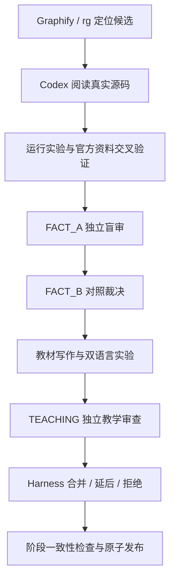
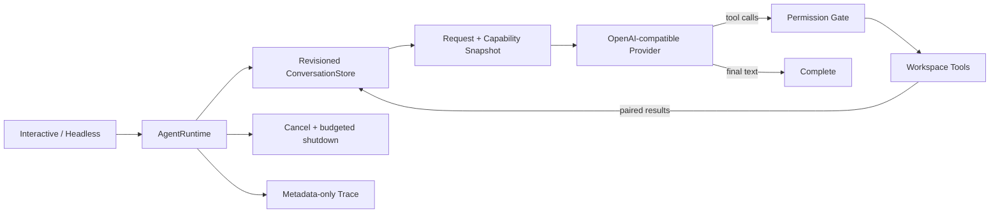

# Claude Code 源码深度课与 Mini Agent Harness

> 不是给函数写注释，而是沿一条真实消息的运行轨迹，读懂生产级 Agent 如何管理状态、投影请求、调用模型、执行工具、处理取消，并把这些机制重新实现出来。

这个仓库同时是一套**源码级 Claude Code 教材**、一条**可复核的教材生产流水线**，以及一个随学习逐步长成的 **Mini Agent Harness**。目标不是记住某几个私有函数名，而是获得可以迁移到企业 Agent 系统的能力：看懂源码、还原运行机制、验证关键判断、修改与复现设计，并在面试中把代码事实讲成系统设计。

当前进度：`S0 + S1 已原子发布` · `M01-M09 共 9 个正式单元` · `1 个串联复习章` · `S2/M10-M11 已完成发布候选` · `Harness 0.2 / H2-in-progress`

## 它解决什么问题

常见源码教程会在两个极端之间摇摆：要么逐函数翻译，要么只画一张宏观架构图。前者看见树叶却没有系统，后者记住名词却无法定位决定性代码。本项目把两者连在一起：


每个正式单元围绕一个完整学习闭环自然推进。源码定位、状态所有权、组件协作、失败路径、取消与恢复、实验、设计权衡和面试表达都服务于同一个机制，不被拆成固定模板，也不靠知识点配额凑篇幅。

## 三层系统

### 1. 源码级教材

教材从 TypeScript/Node.js 阅读基础开始，逐步进入 CLI 运行表面、配置与信任、状态所有权、Query Loop、模型流、Tool Loop、Context、权限、MCP、Subagent、持久化和企业治理。

- TypeScript 是源码阅读与实现主线；
- Python 提供 clean-room 行为镜像；
- Java/Spring 与 LangGraph 用于迁移对照，不假装 API 一一等价；
- 单元规模服从机制闭环，可以动态合并、拆分和调整；
- 信息密集处使用局部流程图、时序图和状态图，既帮助第一次理解，也方便复习。

建议从 [S0 发布说明](curriculum/stages/S0/release-summary.md) 开始，再读 [S1 发布说明](curriculum/stages/S1/release-summary.md)。完成 M01-M09 后，可以用 [I01：从一次启动到安全收尾](curriculum/interludes/I01-runtime-shell-review/final.md) 串起前九章的核心机制。

### 2. Codex 主控 + Claude Code/DeepSeek 双闸门

教材不是由模型“一次生成”。Codex 负责研究、裁决、写作、实验和集成；Claude Code/DeepSeek Max 以独立会话承担事实盲审、同会话对照和教学审查。



Graphify 只用于发现候选组件和跨文件路径。任何 `EXTRACTED` 关系都必须回到源码核验，`INFERRED` 和 `AMBIGUOUS` 只能作为待验证假说；图谱输出不会成为教材事实来源。

项目的最高需求与执行协议分别位于 [2.md](2.md) 和 [3.md](3.md)，完整课程工作地图位于 [course-design-package.md](curriculum/design/course-design-package.md)。

### 3. 累计演进的 Mini Agent Harness

教材中的设计理解会进入一个独立的 clean-room 项目，而不是停留在文字里。当前 Harness 已形成可运行的单 Agent 纵切：



它已经具备：

- Interactive / Headless 共用 Agent Loop；
- revisioned conversation、单 Runtime owner 与 active-run lease；
- 稳定的 RequestContext / CapabilitySnapshot；
- OpenAI-compatible Chat Completions Provider；
- permission-aware Tool Loop 与 `read/list/search/command` 工作区工具；
- tool call/result 配对、错误反馈、取消补齐、single-flight 与最大轮次；
- credential 隔离和 metadata-only Trace；
- TypeScript 主实现、Python 行为镜像与累计回归。

它刻意不追求复刻 Claude Code，也不复制其私有实现。项目只选择足以展示核心工程判断的机制，并为未来的流式聚合、工具并发、Context 压缩、Hook/Skill/MCP、Subagent、恢复和 Sandbox 留出真实演进路径。更完整的能力与边界见 [Mini Agent Harness README](mini-agent-harness/README.md)。

## 快速开始

环境要求：Windows PowerShell、Node.js `22.18+`、Python `3.11+` 与 `rg`。

```powershell
cd mini-agent-harness
npm ci
npm run demo
npm test
npm run typecheck
npm run test:all
```

离线 demo 与确定性测试不访问模型 API。连接兼容 Provider 时，只在本机被忽略的 `.env.local` 中配置凭据：

```powershell
Copy-Item .env.example .env.local
npm run agent -- --prompt "先列出五个 Markdown 文件，再总结项目结构" --output json
```

`run_command` 默认拒绝。授予 executable 意味着允许模型为它提供参数，这仍然不是 Sandbox：

```powershell
npm run agent -- --grant-executable rg
```

当前验证基线为 TypeScript Agent `34/34`、strict typecheck 通过、Python Agent `11/11`、Python ConversationStore `13/13`，以及 H2/H1/S0 全部累计回归通过。真实 API 冒烟与确定性协议测试分开，二者不会互相冒充。

## 当前课程地图

| 阶段 | 主题 | 状态 |
| --- | --- | --- |
| S0 | TypeScript、异步生成器、Node 运行时、可验证源码追踪 | M01-M04 已发布 |
| S1 | 运行表面、配置与信任、状态、能力投影、生命周期 | M05-M09 已发布 |
| I01 | M01-M09 核心机制串联复习 | 已发布 |
| S2 | 消息、Query、模型请求与 Tool Loop | M10-M11 发布候选，M12 进行中 |
| S3-S7 | Context、扩展系统、多 Agent、恢复、安全与治理 | 动态规划 |

课程没有最低章节数。当前设计包是一张工作地图，不是不可修改的目录合同；后续研究可以合章、拆章或调整顺序，但不能因此遗漏重要机制或破坏 Harness 契约。

## 仓库结构

```text
.
├─ 2.md                         # 最高需求
├─ 3.md                         # V3 生成与双闸门协议
├─ curriculum/
│  ├─ design/                   # 课程设计包与标杆规则
│  ├─ global/                   # 术语、符号与跨章知识索引
│  ├─ units/                    # 单元研究、审查、实验与正文
│  ├─ interludes/               # 跨阶段串联复习章
│  └─ stages/                   # 原子发布说明
├─ mini-agent-harness/          # TypeScript 主实现 + Python 行为镜像
└─ input/graphify-audit.md       # 图谱候选经源码核验后的课程审计
```

## 证据与公开边界

这个仓库公开原创教材、实验、Harness 与审查记录，不分发本地 Claude Code 源码快照、Graphify 缓存或外部参考仓库。教材中的源码事实来自特定本地快照，运行验证、官方公开行为与设计推断会被明确区分。

如需复现完整源码研究流程，请自行合法准备源码到 `claude-code-CLI/`。该目录以及 `repos/`、`graphify-out/`、`.env*`、本机 Codex/Claude 配置和运行态审查工作区均被 Git 忽略。

## 适合作品集的工程亮点

这不是“调用一次 LLM API”的演示项目。它能够具体回答：

- durable conversation 到底由谁拥有，异步等待时如何阻止外部插写；
- 为什么会话历史、请求视图和 Provider payload 不能共用同一个数组；
- 为什么模型可见、权限允许和本地 handler 存在是三条独立边界；
- 为什么工具失败也是协议消息，取消后仍要维护 tool call/result 配对；
- 配置、凭据、Trace 与子进程环境如何隔离；
- single-flight、max turns、AbortSignal 和 budgeted shutdown 分别控制什么风险。

一条准确的简历描述是：

> 基于 Claude Code 源码研究设计并实现 TypeScript/Python Agent Harness：以 revisioned conversation 为状态核心，完成请求与能力快照、OpenAI-compatible 模型适配、Permission-aware Tool Loop、取消与配对恢复、工作区受限工具和脱敏 Trace；建立 Codex 主控、Claude Code/DeepSeek 事实与教学双闸门，并用源码核验、双语言实验和累计回归保障教材与实现一致。

---

项目正在沿 S2 继续推进：下一步是把 `query()` / `queryLoop()` 的异步生成器控制流、事件消费、取消传播和结束判定讲透，并让 Harness 的 QueryEvent 与 LoopDecision 从“能运行”升级为“能解释、能验证、能扩展”。
