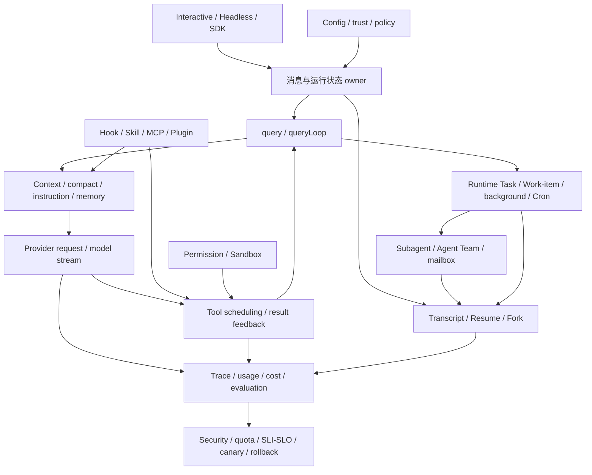
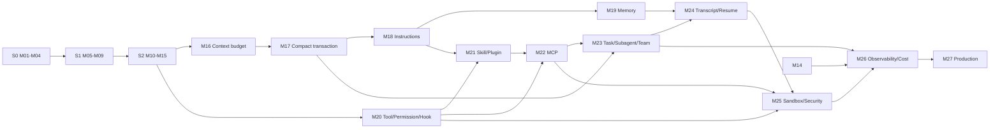

# Claude Code CLI 源码教材全课程设计包

状态：`S4 已发布，M24-M27 按价值优先继续实施`

最后校准：`2026-07-31`

## 1. 地位与最新决策

本设计包受 `2.md` 约束，是可演进工作地图，不是另一份需求。权威顺序为：

```text
2.md
-> 用户确认的项目决策
-> 3.md
-> 本设计包
-> 当前单元工作簿
```

用户已经批准原课程设计、M11 正式质量标杆、认知转折处的局部运行图、资深 Agent 面试官问题与两分钟结论先行回答，并授权动态合章。S0/M01-M04、S1/M05-M09、复习章 I01、S2/M10-M15 和 S3/M16-M19 已完成，已发布编号保持稳定。

最新决定是：Claude Code CLI 教材在 M28 前完成，即最终使用 M01-M27、不创建 M28。剩余内容发布为 S3、S4、S5，不设置 S6：

```text
S3 / M16-M19  Context、压缩、指令、记忆
S4 / M20-M23  执行治理、扩展生态、Task 与多 Agent
S5 / M24-M27  Transcript 恢复、安全治理、观测成本与生产发布
```

旧设计中的 M16-M42 只是一张历史工作地图。重排保留 Context、Tool/Permission/Hook、Skill/MCP/Plugin、两类 Task、后台/Cron、Subagent/Team、Transcript/Resume、Sandbox、安全供应链、观测、成本和部署治理，不为维持旧章节数量保留重复边界。

## 2. 价值优先，而不是平均压缩

M28 前完成不采用“每个旧章都缩短一点”的平均压缩。正文、实验和 Harness 按价值分配篇幅：

| 优先级 | 处理方式 | 代表机制 |
| --- | --- | --- |
| P0 核心契约 | 主体深讲、回源码、失败注入、双语言复现并评估 Harness 合入 | Context/compact transaction、Tool/Permission/Hook、MCP lifecycle、Task lease、Subagent/Team identity、Transcript recovery、Sandbox |
| P1 高价值协作 | 放进一次真实纵切，讲清 owner、交互、关键失败和迁移设计 | Instructions/Memory、Skill/Plugin、background/Cron、observability/cost |
| P2 代表性定位 | 只选解释主链所需的路径，其余提供源码索引 | 管理 UI、重复 CLI command、同义配置选项、只影响展示的分支 |

优先级不是按组件名永久固定。任何细节只要改变协议配对、状态一致性、安全、恢复、幂等或 Harness 契约，就升为 P0；源码体量大但只重复适配的模块不会因此占据主体时间。

十二个剩余单元的迁移主线是：

```text
上下文不是字符串截断，而是有 owner 和提交点的投影/压缩事务
-> 扩展不是“发现即执行”，而是 schema、策略、生命周期与隔离的控制面
-> 长期任务和多 Agent 依靠 identity、lease、mailbox 与恢复事务协作
-> Permission 之外仍需 Sandbox、供应链、可观测性、成本和发布治理
```

## 3. 课程机制地图



箭头表示学习依赖，不宣称每个节点只对应一个文件或类。Context 是管线；Permission 与 Sandbox 不同；Runtime Task 与 Work-item Task 不同；Agent Team 也不是多个临时 Subagent 的别名。

## 4. 阶段总览

| 阶段 | 单元 | 学习闭环 | Harness 里程碑 | 状态 |
| --- | --- | --- | --- | --- |
| S0 源码阅读基础 | M01-M04 | 类型、异步、Node runtime、可验证追踪 | H0 | 已发布 |
| S1 运行壳 | M05-M09 | Surface、配置、状态、能力、生命周期 | H1 | 已发布 |
| S2 单 Agent 主循环 | M10-M15 | 消息、Query、请求、模型流、Tool Loop | H2 / 0.3.0 | 已发布 |
| S3 Context 与记忆 | M16-M19 | 可控上下文、压缩事务、指令、记忆 | H3 / 0.4.0 | 已发布 |
| S4 扩展、任务与多 Agent | M20-M23 | 执行治理、扩展 ABI、Task、Subagent/Team | H4-H5 / 0.5.0 | 已发布 |
| S5 恢复与生产治理 | M24-M27 | Transcript/Resume、安全、观测、部署 | H6-H7 | 待生成 |

S3、S4、S5 各自完成时更新根 README、Mini Agent Harness README、契约、架构、全局索引和累计回归。单元在阶段原子发布前只到 `release-candidate`，不提前创建 `final.md`。

## 5. 已发布主线 M01-M15

| 单元 | 已闭合机制 | Harness 结果 |
| --- | --- | --- |
| M01-M04 | TypeScript 类型、异步/流、Node runtime、源码追踪 | H0 契约骨架 |
| M05-M09 | Surface、配置/信任、AppState、能力投影、生命周期 | H1 运行壳 |
| M10 | durable message、identity、revision、pairing、owner | H2 ConversationStore |
| M11 | 两条输入路径到 Query、请求、模型和工具的标杆纵切 | H2 端到端 Runtime |
| M12 | Query 状态机、pull、terminal 与运行通道 | H2 state/event/summary 分层 |
| M13 | durable/query/API/wire 四层请求投影 | H2 RequestProjector |
| M14 | indexed stream assembly、fallback、usage、bounded stream | H2 stream contract |
| M15 | safe batch、exclusive barrier、Permission、结果、取消 | H2 ToolScheduler |

M11 是唯一正式质量标杆。后续只复用其叙事密度、局部图、代码解释和面试校准，不复制其标题结构。

## 6. S3：Context、压缩、指令与记忆

### M16 模型为什么看不见全部历史：Context 视图、预算与轻量裁剪

- 真实问题：durable history 完整合法，为什么当前请求仍要选择边界、裁剪大结果并控制 token？
- P0 机制：`messagesForQuery`、history boundary、API user group budget、snip/microcompact、attachment 注入与 Prompt Cache 影响；字符、token、message group、wire budget 分层。
- 源码入口：`src/query.ts`、`src/utils/messages.ts`、Context/budget/snippet 服务和 M13 request projection 边界。
- 关键失败：切到 orphan result、预算破坏 pairing、裁剪污染 history、并发 replacement state 丢更新。
- 实验：多轮大工具结果下对比全局截断、per-result preview 和按最终 user group 预算；验证 durable source 不变。
- Harness：H3-1，aggregate result budget、replacement metadata、strict post-projection validation。

### M17 上下文装不下时谁能改写历史：Compact 事务、边界与恢复

- 真实问题：轻量裁剪仍超限时，怎样生成摘要并替换请求视图，又不让并发请求与恢复链半提交？
- P0 机制：auto compact、compact boundary、context collapse、summary request、post-compact messages、Prompt Cache edit、cancel/retry 与 durable Transcript 提交点。
- 源码入口：`src/services/compact/`、`src/query.ts` compact transitions、message normalization 与 session storage 边界。
- 关键失败：summary 成功但 replacement 失败、取消落在两者之间、旧 revision 晚到、重复 compact、summary 破坏 tool relation。
- 实验：在 summary/replacement/Transcript 的不同 commit point 注入取消和 stale writer，证明原 history 可恢复。
- Harness：H3-2，CompactTransaction、revision gate、summary provenance 与 repair report。

### M18 指令怎样进入一次请求：CLAUDE.md、Rules、系统提示与动态附件

- 真实问题：文件被发现不等于模型已看见；多层项目指令、条件 Rules、system prompt 和动态附件如何装配、去重并保持来源？
- P0/P1 机制：指令发现与 scope、trust boundary、Rules 条件与顺序、system prompt builder、dynamic attachment、request snapshot、provenance 和敏感内容边界。
- 源码入口：instruction/rules loaders、system prompt/context builders、attachments、settings/trust 与 request projection。
- 关键失败：重复注入、scope 泄漏、顺序不稳定、旧 instruction revision 污染新请求、把 UI attachment 当 durable fact。
- 实验：同一规则从 user/project/managed/dynamic 四种来源进入，改变 scope/trust/revision 并观察最终请求与 provenance。
- Harness：H3-3，InstructionPipeline、scoped source、dedupe、redaction 与 immutable snapshot。

### M19 记忆不是一段附加文本：Session Memory、提取、压缩与跨会话边界

- 真实问题：短期上下文、压缩摘要、跨轮 memory 和跨会话记忆怎样分工，谁能把推断写入长期状态？
- P0/P1 机制：memory extraction、candidate/accepted state、compression/load、session/project scope、恢复、隐私、TTL 与 provenance；区分 memory、instruction、compact summary 和 Transcript。
- 源码入口：`src/services/SessionMemory/`、memory extraction、session restore、compact 与 system context 邻接。
- 关键失败：模型推断冒充事实、跨项目泄漏、重复提取、旧 memory revision 覆盖新值、恢复时 scope 失真、敏感内容长期化。
- 实验：让同一事实经历提取、拒绝、接受、压缩和新会话加载，验证来源、revision、redaction 与请求可见性。
- Harness：H3 正式版，MemoryStore、candidate lifecycle、scope/provenance、retention 与 compact 后回归。

## 7. S4：执行治理、扩展生态、Task 与多 Agent

### M20 一次工具调用怎样被治理：Tool ABI、Permission 与 Hook 决策链

- 真实问题：模型已看见工具、输入也通过 schema 后，为什么仍不能直接执行？Hook allow/deny/modify 与 Permission rule/mode/user decision 谁优先？
- P0 机制：Tool definition/schema/handler、PreToolUse/PostToolUse/PostToolUseFailure、Hook result、Permission rule/mode/classifier/user prompt、decision provenance，以及 Permission 与 Sandbox 的边界。
- 源码入口：`src/Tool.ts`、`src/services/tools/toolExecution.ts`、`src/utils/hooks/`、permission types/components 和 registry。
- 关键失败：Hook 修改后未重验、allow 越权、deny/stop/throw 未配对、取消发生在决策与副作用之间、Hook output 泄密。
- 实验：同一 call 穿过 visible/schema/hook/policy/human/handler 六道边界，制造冲突并验证最终 decision source。
- Harness：H4-1，ExtensionDecision pipeline、Hook ABI、provenance 与 exactly-once paired result。

### M21 扩展如何被发现和交付：Skill 与 Plugin 的加载、命名空间和供应链

- 真实问题：说明文件和组件包怎样从磁盘变成模型可见能力；metadata、正文、命令、Hook 与 Tool 为什么不能在发现时全部执行？
- P0/P1 机制：Skill metadata、延迟加载与执行策略；Plugin manifest、discovery、component registration、namespace、priority、refresh/unload、policy 和供应链信任。
- 源码入口：Skill/command loaders、plugin commands/loaders、tool/Hook assembly 与 capability refresh boundaries。
- 关键失败：重复名字、优先级漂移、恶意 manifest、旧请求看到新组件、卸载时 in-flight call、模型答案回写形成循环证据。
- 实验：一个 Skill 与 Plugin 提供同名能力，模拟 trust/refresh/unload，观察旧 CapabilitySnapshot 与新 catalog。
- Harness：H4-2，ExtensionRegistry、Skill/Plugin adapters、namespace、revision、signature/policy port。

### M22 能力如何跨进程进入 Agent：MCP 协议、连接生命周期与安全边界

- 真实问题：远端 Tool/Resource/Prompt 怎样经过 transport、initialize、capability negotiation 和通知进入当前请求，又怎样在断线时 fail closed？
- P0 机制：stdio/HTTP transport boundary、initialize/session、Tool/Resource/Prompt、schema projection、notifications、roots、sampling/elicitation 边界、disconnect/reconnect/cancel 与 Permission。
- 源码入口：`src/services/mcp/`、MCP types/client/manager、tool assembly、connection UI 只作必要定位；匹配时定向读取官方 MCP SDK/spec。
- 关键失败：半初始化、schema 漂移、server 失联后的 stale capability、重复调用、transport cancel 不等于业务取消、远端结果/错误泄密。
- 实验：本地 fake MCP server 完成 initialize、list/call、notification、disconnect/reconnect；验证旧 request snapshot 与新 registry revision。
- Harness：H4 正式版，McpTransport/Session、capability negotiation、namespace、lifecycle、redaction 与端到端回归。

### M23 任务不是一个状态字段：Runtime Task、Work-item Task、后台、Cron 与 Subagent/Team

- 真实问题：正在运行的工作、协作任务记录、后台进程、定时触发、临时 Subagent 和长期 Team 都需要异步协作，怎样避免把它们压成一个 Task enum？
- P0 纵切分两层：先区分 Runtime Task 与 Work-item Task 的 state/output/owner/blockedBy/claim/lease/TOCTOU，再沿一个任务派生同步/后台 Subagent，进入 Team identity、mailbox、task ownership、handshake 和 shutdown。
- P1 协作：foreground/background handoff、Cron session/persistent task、missed run、防惊群与幂等 trigger；管理 UI 只作索引。
- 源码入口：`src/Task.ts`、`src/utils/tasks.ts`、Task tools/output、background/Cron/locks、`src/tools/AgentTool/`、Team/SendMessage tools 与 swarm runner。
- 关键失败：双重 claim、owner 死亡、cancel/complete 竞争、重复 trigger、parent cancel 与 child side effect、mailbox 重复/乱序、成员孤儿。
- 实验：双 worker 竞争任务，派生一个 background child 和两个 team member；注入 crash/cancel/duplicate message 并验证 lease、idempotency 与 ownership。
- Harness：H5 正式版，并提前形成 H6 scheduler foundation：TaskStore、Lease、DurableScheduler、child scope、TeamDirectory、Mailbox。

M23 仍是一个单元，因为其认知闭环是“工作所有权怎样从本地任务扩展到多 Agent”。若研究发现 4-7 小时无法讲深，可在 M27 内重新划分相邻单元，但不能增加 M28；优先保留 owner、lease、identity、mailbox、取消与恢复，压缩管理表面。

## 8. S5：Transcript 恢复、安全治理与生产发布

### M24 进程退出后如何继续：Transcript、Resume、Fork 与恢复事务

- 真实问题：conversation、任务与 agent 已经崩溃或退出，怎样从 JSONL/持久层重建可继续且不会重复副作用的运行？
- P0 机制：Transcript entry、append/flush/dedupe、parent chain 与并行 DAG、normal/interrupted resume、fork、compact/memory/task/team 状态接管、background output 与 Cron trigger 恢复。
- 源码入口：`src/utils/sessionStorage.ts`、session restore/recovery、resume commands/screens、conversation recovery、task/background persistence。
- 关键失败：尾部半写、duplicate event、dangling parent、parallel sibling 遗漏、schema migration、missing tool result、执行成功但 commit 未完成。
- 实验：在模型、工具、任务、Transcript 四类 commit point 注入 crash，重放后验证 pairing、lease、idempotency 和 fork isolation。
- Harness：H6 正式版，TranscriptStore、RecoveryReducer、ResumeCoordinator、background/Cron recovery 与双语言回归。

### M25 模型能调用不等于系统安全：Sandbox、Managed Policy 与扩展供应链

- 真实问题：Permission 已允许、工具也能运行，为什么仍可能越权、逃逸、泄密或装入恶意扩展？
- P0 机制：Permission/Sandbox 纵深防御、workspace/network/process isolation、worker identity、managed policy/trust、secret boundary、Skill/MCP/Plugin 供应链和审批来源。
- 源码入口：permission filesystem/process controls、sandbox boundary、managed settings/policy、extension install/load 与 command execution。
- 关键失败：granted executable 任意 argv、子进程逃逸、symlink/TOCTOU、secret 进入 prompt/subprocess、恶意 Plugin/MCP、policy refresh 竞态。
- 实验：同一高风险工具依次通过 model visibility、Permission、Sandbox/worker、network policy 与 secret redaction，证明任一层都不可互相替代。
- Harness：H7-1，Sandbox/Worker port、PolicyEngine、secret boundary、extension trust 与安全回归。

### M26 看不见就无法治理：可观测性、评估、Token、延迟、成本与分布式配额

- 真实问题：怎样解释一次 Agent 运行的质量、延迟和花费，又不把 prompt、工具结果和凭据复制进 telemetry？
- P0/P1 机制：run/request/attempt/tool/task/agent/span identity、logs/metrics/traces、usage 与 price version、TTFT missing、evaluation、tenant quota、并发队列、backpressure、retry/fallback ledger、SLI/SLO 与告警。
- 源码入口：API logging、session tracing、usage/cost、tool/task events、analytics 和 policy limits；产品 UI 图表只作必要定位。
- 关键失败：span 串请求、cumulative usage 当 delta、fallback 漏计费、unknown TTFT 当 0、正文泄漏、noisy neighbor、observer 取得执行权。
- 实验：多工具/多 Agent fake run 注入 fallback、取消、慢队列和 quota；只用脱敏 metadata 重建关键路径并核对 cost ledger。
- Harness：H7-2，redacted telemetry、cost/evaluation ledger、tenant quota、queue governor 与 OpenTelemetry port。

### M27 把 Harness 交到生产：部署、灰度、回滚与系统设计闭环

- 真实问题：本地 Harness 怎样成为可发布、可观测、可恢复、可升级并能在面试中完整表达的企业 Agent 系统？
- P0 机制：composition root、config/secret、worker topology、durable stores、queue/backpressure、schema migration、feature flag、canary、rollback、灾备、容量与成本模型。
- 关键失败：新旧 worker 协议不兼容、恢复记录无法降级、工具副作用重复、灰度期间 policy 分叉、紧急回滚丢任务。
- 实践：部署本地/容器化演示拓扑，执行升级、故障注入、恢复和回滚；产出架构图、ADR、容量估算、威胁模型与大厂系统设计回答。
- Harness：H7 最终作品版，TypeScript 主实现、Python 契约镜像、Java/Spring 集成练习、全阶段回归和作品集 README。

M27 不追逐新的私有函数清单，而是用 M01-M26 的决定性边界完成跨组件验收。最终教材在此结束，不创建 M28 或 S6。

## 9. 单元依赖



- M16 依赖 M13，M17 依赖 M16，M18-M19 依赖 compact/request scope；
- M20 依赖 M15，M21-M22 同时依赖 instruction/capability projection 与执行治理；
- M23 复用两类 Task、M15 并发取消和扩展能力；M24 依赖 Context、Task、Subagent/Team 的可恢复状态；
- M25 纵向复用配置/信任、Permission/Hook、MCP/Plugin 与 Transcript；
- M26 复用模型流 usage/span、Tool/Task/Team identity 与安全边界；M27 依赖全部里程碑。

## 10. 最高需求主题覆盖矩阵

| 主题 | 主讲 | 闭环/复用 | 状态 |
| --- | --- | --- | --- |
| TypeScript/Node 源码阅读 | M01-M04 | 全课程随用随讲 | 已覆盖 |
| CLI、配置、信任、状态、生命周期 | M05-M09 | M18、M25-M27 | 已覆盖 |
| 消息、Query、请求、模型流、Tool Loop | M10-M15 | M16-M27 | 已覆盖 |
| Context budget、snip/microcompact | M13、M16 | M17、M19、M26 | 已规划 |
| auto compact、collapse、Prompt Cache | M17 | M19、M24 | 已规划 |
| CLAUDE.md、Rules、system、attachments | M18 | M21、M25 | 已规划 |
| Session Memory 与 scope/retention | M19 | M24-M27 | 已规划 |
| Tool、Permission、Hook | M15、M20 | M22、M25-M27 | 已规划 |
| Skill/Plugin 生命周期与供应链 | M21 | M23、M25 | 已规划 |
| MCP Tool/Resource/Prompt 与连接 | M22 | M23、M25-M27 | 已规划 |
| Runtime Task / Work-item / background / Cron | M01、M23 | M24、M26-M27 | 已区分 |
| Subagent / Agent Team / mailbox | M23 | M24-M27 | 已规划 |
| Transcript / Resume / Fork / recovery | M10、M24 | M27 | 已规划 |
| Permission 与 Sandbox | M20、M25 | M27 | 已区分 |
| 日志、Trace、评估、Token/延迟/成本 | M14-M15、M26 | M27 | 已规划 |
| 并发、分布式、幂等、配额 | M15、M23-M26 | M27 | 已规划 |
| 灰度、回滚、SLI/SLO、部署 | M26-M27 | M25 | 已规划 |
| TypeScript/Python clean-room | 每个核心机制 | M27 总回归 | 持续要求 |
| Java/Spring/LangGraph 迁移 | 机制附近即时出现 | M23-M27 强化 | 持续要求 |
| 资深大厂面试表达 | 每单元自然融入 | M27 系统设计 | 持续要求 |

## 11. TypeScript 与 Node 难点路线

| 难点 | 首次讲解 | 后续强化 |
| --- | --- | --- |
| union/generic/runtime schema | M01 | M20-M22 ABI |
| Promise/AsyncGenerator/AsyncIterable | M02 | M12、M14、M22-M23 |
| event loop/Stream/child process | M03 | M14、M23、M25 |
| AbortSignal/cleanup/resource scope | M03/M09 | M15、M17、M20-M24 |
| alias/identity/readonly/deep freeze | M04/M10 | M16-M19、M24 |
| revision/snapshot/stale closure | M06-M07 | M16-M19、M23-M24 |
| Map/Set/Promise.all/race | M09 | M15、M23、M26 |
| generator terminal/`using`/dispose | M12 | M17、M22-M24 |
| pure projection/post-validation | M13 | M16-M22 |
| indexed assembly/bounded stream | M14 | M22-M23、M26 |
| dynamic predicate/worker pool/ordered commit | M15 | M20、M23-M26 |
| transaction union/optimistic concurrency | M17 | M19、M23-M24 |
| transport/namespace/registry revision | M21-M22 | M23、M25 |
| lock/lease/Clock/idempotency | M23 | M24、M26-M27 |
| actor/mailbox/structured concurrency | M23 | M24-M27 |
| append-only reducer/schema migration | M24 | M27 |
| AsyncLocalStorage/telemetry/quota | M26 | M27 |

任何新语言能力首次出现时，必须按“最小语义 -> 当前源码作用 -> Java/Python 对照 -> 可运行反例”补齐，不能因章节压缩隐藏前置。

## 12. Mini Agent Harness 演进路线

| 里程碑 | 来源 | 核心契约 | 状态 |
| --- | --- | --- | --- |
| H0 | M01-M04 | message/state/event/cancel/cleanup/trace | 已发布 |
| H1 | M05-M09 | Surface/config/context/capability/lifecycle | 已发布 |
| H2 / 0.3.0 | M10-M15 | ConversationStore/request/provider/stream/ToolScheduler | 已发布 |
| H3 | M16-M19 | aggregate budget、CompactTransaction、InstructionPipeline、MemoryStore | 已发布 / 0.4.0 |
| H4 | M20-M22 | Tool/Hook decision ABI、Skill/Plugin registry、MCP session/lifecycle | 已发布于 0.5.0 |
| H5 | M23 | TaskStore、lease、child scope、TeamDirectory、Mailbox | 已发布 / 0.5.0 |
| H6 | M23-M24 | DurableScheduler、TranscriptStore、RecoveryReducer、ResumeCoordinator | scheduler foundation 已完成，其余待 M24 |
| H7 | M25-M27 | Sandbox/Worker、policy、observability、quota、部署与回滚 | 待实现 |

每次合入记录新增契约、状态 owner、失败语义、兼容影响和累计回归。`merge`、`defer`、`reject` 由证据与架构决定。H3-H7 是能力里程碑，不要求一一对应课程阶段。

## 13. 标杆与阶段验收

M11 标杆要求继续有效：真实问题驱动；决定性源码解释控制流和状态；认知转折处就地增加可复习的局部图；TypeScript 首次难点讲透；Python 保持同一行为契约；实验有假设、反证和结果边界；Harness 说明新增契约与 defer；面试题由资深 Agent 面试官选择并给结论先行的两分钟口语回答；主体学习 4-7 小时，实践另计。

阶段发布检查：组件职责、state owner、调用依赖、快照/实验/公开行为/推断/迁移边界、术语与图文、实验、TypeScript 前置、主题覆盖和 Harness 全量回归。只处理影响事实、初学者理解、实验或 Harness 契约的问题。

## 14. 风险、取舍与动态调整

- 快照缺少少量内部类型文件；不能补造完整类型或声称原仓库全量 typecheck。
- Graphify import/contains/邻近不是运行调用；所有教材关系回源码核验。
- M23 范围最大，必须沿“工作所有权从 Task 扩展到 Agent”纵切，管理 UI 和重复命令降为索引；若仍超出 7 小时，可在 M27 内调整相邻边界，但不能增加 M28。
- M20-M22 与 M25-M26 各自有清楚分工：执行决策、扩展交付、跨进程协议、安全隔离、观测治理不能重新合成一个“插件/企业功能大全”。
- H2 的统一 scheduler、strict pairing 和 provider-neutral stream 是设计迁移，不等同于 Claude Code 私有实现。
- 真实 API 冒烟只证明 Provider 可达；核心行为以确定性 fake、失败注入和累计回归验证。
- 不执行源码 Hash、重哈希、漂移检查、句子级 Claim 或 Graphify 回写。

M16-M27 是当前最终工作地图。调整尚未发布单元时必须同步依赖、主题覆盖、TypeScript 首讲位置、H3-H7 路线、README 和阶段状态。已经发布的 M01-M15 不重排；合章不能删除重要机制、失败语义、实验、Harness 契约或企业迁移。最终教材在 S5/M27 完成，不设置 S6，不创建 M28。
