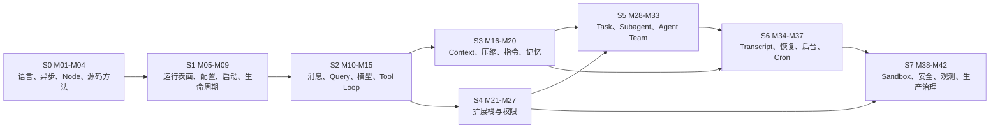

# Claude Code CLI 源码教材全课程设计包

## 1. 审批说明

状态：`已批准`

批准记录：用户于 2026-07-28 以 `continue` 批准本设计包当时列出的 42 单元、8 个阶段、M01-M04 完整源码阅读基础、M11 唯一首章质量标杆以及 H0-H7 Harness 演进路线。M11 已于 2026-07-28 到达 `release-candidate`，并已经用户正式批准为后续教材质量标杆；用户同时确认“认知转折处的多张局部运行图”和“资深 Agent 面试官问题 + 结论先行的约两分钟口语回答”两项增补要求，并授权继续批量单元生产。随后用户进一步批准课程随生成动态合并、拆分和调整，取消 30 单元最低限制；因此本文件的 42 单元是当前工作地图，不是冻结交付数量。

依据：

1. `2.md` 最高需求；
2. 用户确认的 V3 修订决策；
3. `3.md` 执行方案；
4. `input/graphify-audit.md`；
5. 当前 `claude-code-CLI/` 源码直接核验。

本设计包当前展示 42 个候选单元，原则上总量不超过 45，但没有最低下限。每个单元的主体学习为 4 至 7 小时；实践、失败注入、扩展挑战和深入实验另计。逐章研究和生成时可调整尚未发布单元及阶段边界，必要时最终总量可以低于 30。

本文件和 M11 质量标杆均已通过用户审批。S0 的 M01-M04 与 H0 已于 2026-07-28 原子发布；S1 的 M05-M09 与 H1 已于 2026-07-29 完成阶段一致性检查并原子发布。S2 的 M10、已批准 M11 标杆、M12 与 M13 现均为 `release-candidate`，当前下一单元为 M14。所有后续单元在所属阶段原子发布前仍只生成 `release-candidate.md`，不提前创建 `final.md`。

## 2. 设计结论

课程不采用“最小固定点”。M01 至 M04 提供阅读主线源码所需的最小但完整 TypeScript/Node 基础；后续语言难点在真实机制首次出现时继续讲透，并由 TypeScript 覆盖索引约束遗漏。

课程也不按源码目录组织。相反，它沿以下真实能力递进：

```text
读懂类型和异步控制流
-> 识别运行表面和状态容器
-> 跟踪一轮 Agent 运行
-> 理解请求投影、模型流和工具反馈
-> 管理上下文、压缩与记忆
-> 建立可治理的扩展边界
-> 管理任务、Subagent 和 Agent Team
-> 实现持久化、恢复与后台调度
-> 建立安全、可观测和生产治理
```

当前 42 个候选单元不是由 Graphify 节点数量推导，也不是必须维持的数量。Graphify 只帮助发现候选跨目录关系；最终拆分、合并和排序来自源码核验后的学习闭环、状态所有权和 Harness 契约依赖。

动态调整遵守四条规则：

1. 可以合并、拆分、移动、重排或改写尚未发布单元，阶段归属也可随之调整；
2. 每次只同步受影响的依赖图、主题覆盖矩阵、TypeScript 前置和 Harness 路线，不建立 Hash 或重型变更系统；
3. 合并不能删去重要机制、状态/失败语义、验证实验、Harness 契约和企业迁移；拆分必须形成真正独立的认知闭环；
4. 已发布单元编号原则上保持稳定，当前 M05 继续沿用现有编号，后续不为维护连续数量而制造空章。

## 3. 全课程源码机制地图

| 机制域 | 主要入口与决定性源码 | 课程中的关键边界 |
| --- | --- | --- |
| 运行表面 | `src/main.tsx`、`src/entrypoints/init.ts`、`src/screens/REPL.tsx`、`src/cli/print.ts`、`src/QueryEngine.ts` | REPL 与 SDK/Headless 是两种输入适配路径，不互相包含 |
| 配置与启动 | `src/utils/config.ts`、`src/utils/settings/settings.ts`、`src/bootstrap/state.ts`、插件/MCP 初始化 | 配置合并、信任、policy 与运行时装配分层 |
| 消息与 Query | `src/screens/REPL.tsx`、`src/utils/handlePromptSubmit.ts`、`src/QueryEngine.ts`、`src/utils/processUserInput/*`、`src/query.ts` | REPL 本地消息状态、Headless 共享数组、查询快照和 API 消息投影不是同一状态 |
| 模型调用 | `src/query/deps.ts`、`src/services/api/claude.ts`、`src/services/api/logging.ts` | 流式请求、重试、事件归一化、成本与 Span 协作 |
| Tool Loop | `src/services/tools/toolOrchestration.ts`、`src/services/tools/toolExecution.ts` | 调度、输入校验、Hook、Permission、执行、结果反馈分层 |
| Context | `src/query.ts`、`src/services/compact/*`、`src/services/contextCollapse/*`、attachments、memory | 请求视图、裁剪、压缩、边界、指令、记忆不可混为一体 |
| 扩展系统 | `src/Tool.ts`、`src/utils/hooks.ts`、`src/skills/*`、`src/services/mcp/*`、`src/utils/plugins/*` | Tool、Hook、Skill、MCP、Plugin 生命周期和权限不同 |
| Task 与 Agent | `src/Task.ts`、`src/tasks/*`、`src/utils/tasks.ts`、`src/tools/AgentTool/*`、`src/utils/swarm/*` | Runtime Task、Work-item Task、Subagent、Teammate 四套语义 |
| 持久化与恢复 | `src/utils/sessionStorage.ts`、`src/utils/conversationRecovery.ts`、`src/utils/sessionRestore.ts` | 事件写入、链重建、中断判定和状态恢复分开 |
| 后台与调度 | `src/tasks/LocalShellTask/*`、`src/utils/cronTasks.ts`、`src/utils/cronScheduler.ts` | 运行任务后台化与持久 Cron 不是同一机制 |
| 安全与治理 | `src/utils/permissions/*`、`src/utils/sandbox/*`、remote managed settings、telemetry、cost tracker | 应用决策、OS 约束、policy、观测和资源治理分层 |

## 4. 阶段总览

| 阶段 | 单元 | 形成的能力 | Harness 里程碑 |
| --- | --- | --- | --- |
| S0 源码阅读基础 | M01-M04 | 能跟踪 TypeScript 类型、异步迭代、Node 取消和状态 | H0 行为契约与测试骨架 |
| S1 运行表面与启动 | M05-M09 | 能解释 CLI 从入口到 Query 的装配和生命周期 | H1 运行配置与生命周期壳 |
| S2 消息、Query 与模型 | M10-M15 | 能跟完用户输入到模型和 Tool Loop 的一次运行 | H2 可运行的单 Agent 主循环 |
| S3 Context 与记忆 | M16-M20 | 能区分请求投影、压缩、指令和跨会话记忆 | H3 可控上下文与压缩契约 |
| S4 扩展与权限 | M21-M27 | 能设计 Tool/Hook/Skill/MCP/Plugin 扩展栈 | H4 扩展 ABI 与 Permission 层 |
| S5 Task 与多 Agent | M28-M33 | 能区分两类 Task 并实现 Subagent/Team 协作 | H5 多任务与多 Agent 控制面 |
| S6 持久化与后台 | M34-M37 | 能实现 Transcript、恢复、后台化和 Cron | H6 可恢复的长期运行 Harness |
| S7 企业治理 | M38-M42 | 能建立 Sandbox、观测、资源和发布治理 | H7 可部署的最终 Harness |

## 5. S0：TypeScript 与 Node.js 源码阅读基础

### M01 类型不是注释：从 Message、Tool 和状态联合类型读懂系统边界

- 真实问题：为何只看函数体仍无法理解复杂 Agent 的合法状态和消息边界。
- 主线：类型别名、接口、联合类型、字面量判别、泛型、可选字段、模块导入导出；直接阅读 `Message`、`Tool`、`TaskStatus` 等真实类型。
- 学习闭环：从编译期约束推断运行时分支，再回到 Java sealed hierarchy、Python type hint 的能力边界。
- 实践另计：为简化消息联合写类型守卫，注入非法状态并观察编译与运行差异。
- 风险：R1。
- Harness：定义首版消息、运行状态和错误联合契约。

### M02 Promise、AsyncGenerator 与 AsyncIterable：看懂“值如何一段段回来”

- 真实问题：为什么 Query 和 Tool 不返回一个最终对象，而使用 `yield`、`for await` 和流。
- 主线：Promise 调度、async generator、`AsyncIterable`、惰性消费、背压的最小模型；映射 `query()`、`queryLoop()` 与工具进度流。
- 学习闭环：用 Java `CompletableFuture`/Reactive Streams 和 Python async generator 对照，但明确它们不完全等价。
- 实践另计：实现可取消的事件流，观察生产者异常、消费者提前退出和 `finally` 清理。
- 风险：R1。
- Harness：建立统一异步事件协议与消费者测试。

### M03 Node.js 运行时：事件循环、Stream、子进程与 AbortSignal

- 真实问题：为什么看懂 `async/await` 仍会误判定时器、I/O、子进程、信号和取消顺序。
- 主线：事件循环、microtask、timer、Node Stream、child process、进程信号、`AbortController`/`AbortSignal`、资源清理。
- 学习闭环：沿一个长命令从启动、输出、取消到清理，解释 Java 线程中断和 Python asyncio cancellation 的差异。
- 实践另计：长进程、流式输出、超时和 SIGINT 组合实验。
- 风险：R2。
- Harness：加入取消令牌、资源清理注册和可控时钟接口。

### M04 源码追踪方法：从类型到调用、状态、证据和最小复现

- 真实问题：如何避免把导入关系、文件邻近、图最短路径和真实调用混为一谈。
- 主线：入口定位、调用者/被调用者、依赖注入、状态所有权、事件边界、测试反推；使用 Graphify 候选后回源码核验的完整练习。
- 学习闭环：重建一个小型异步循环，不依赖函数列表写解释。
- 实践另计：验证一个 `EXTRACTED` 真关系和一个 `INFERRED` 假阳性。
- 风险：R1。
- Harness：H0，建立 TypeScript/Python 同行为测试、事件命名与状态不变量。

## 6. S1：CLI 运行表面、配置与启动

### M05 一个产品，多种运行表面：Interactive、Print、SDK 与 Headless

- 真实问题：为什么不能用一条“CLI 启动流程”解释所有调用方式。
- 主线：`main.tsx`、REPL、print、SDK/Headless 的输入、状态容器、输出协议和退出方式。
- 学习闭环：画出适配器边界，明确哪些能力共享，哪些只属于 UI。
- 实践另计：用统一接口实现 interactive 与 headless 两个 adapter。
- 风险：R1。
- Harness：新增 RuntimeSurface 接口和两种入口。

### M06 参数、环境、配置来源与信任：一个最终设置值从哪里来

- 真实问题：相同配置为何在不同项目、用户或企业策略下得到不同结果。
- 主线：命令参数、环境、user/project/local/flag/policy/plugin 设置，合并与 first-source-wins，信任和只读 policy。
- 学习闭环：从一个 Permission 或 telemetry 设置反向追踪来源和覆盖关系。
- 实践另计：实现带来源说明的配置解析器和冲突测试。
- 风险：R2。
- Harness：配置快照、来源标记、只读策略层。

### M07 Bootstrap 与 AppState：谁创建系统，谁拥有运行状态

- 真实问题：为什么模块单例、初始化顺序和 React/AppState 容器会影响运行语义。
- 主线：bootstrap state、初始 AppState、组件装配、依赖注入、缓存与初始化时机。
- 学习闭环：区分配置状态、会话状态、请求局部状态和进程全局状态。
- 实践另计：重排初始化顺序并观察缺失依赖或陈旧缓存。
- 风险：R2。
- Harness：RuntimeContext、SessionState 与 RequestContext 分层。

### M08 能力不是一张启动清单：发现目录、请求投影与执行注册表

- 真实问题：为什么启动时发现或注册的能力，不等于当前模型请求可见、获得执行权限或能由本地 handler 执行。
- 主线：Command/Skill/Agent/Tool 的发现目录、MCP 与 Plugin 的异步变化、system prompt 与上下文通道、request/iteration projection、Tool Search、schema cache 和执行注册表；不提前展开各机制内部协议。
- 学习闭环：从发现目录走到模型可见快照和 fail-closed dispatch，并解释 Interactive/Headless 的不同刷新边界。
- 实践另计：输出带 revision 与 projection reason 的能力快照，验证 policy 隐藏、deferred discovery、旧快照稳定和可见但无 handler 的失败路径。
- 风险：R2。
- Harness：CapabilityCatalog、CapabilityProjector、CapabilitySnapshot、ExecutableRegistry 与 SystemContextBuilder。

### M09 生命周期：启动、一次会话、取消与优雅退出

- 真实问题：为什么退出不是简单 `process.exit()`。
- 主线：signal handlers、cleanup registry、会话冲刷、SessionEnd Hook、遥测有限预算与 failsafe；连接到 Query 入口但不展开主循环。
- 学习闭环：解释“关键状态先于次要遥测”的关闭顺序和超时权衡。
- 实践另计：注入卡住的 cleanup，验证关键状态保留与 failsafe。
- 风险：R2。
- Harness：生命周期管理器、分级清理预算和恢复提示。

## 7. S2：消息、Query、模型请求与 Tool Loop

### M10 消息不是聊天文本：会话状态、API 投影与状态所有权

- 真实问题：`mutableMessages`、`messages`、`messagesForQuery` 和 API messages 为什么不能互换。
- 主线：消息联合、UUID、parent、附件、progress、tool_use/tool_result；REPL 本地 `messages`/`messagesRef`、AppState 运行状态与 Headless/QueryEngine 消息状态的所有权边界。
- 学习闭环：跟踪一条用户消息从可变会话状态到当前查询快照。
- 实践另计：构造错误的共享可变数组，观察并发和恢复问题。
- 风险：R2。
- Harness：消息 ID、不可变快照与合法配对不变量。

### M11 标杆纵切：用户输入如何到达模型并进入 Tool Loop

- 真实问题：一次真实 Agent 运行究竟经过哪些层，两个入口在哪里汇合。
- 主线：REPL 本地 `messages`/`messagesRef` 与 SDK/Headless `mutableMessages`/`QueryEngine` 两条输入适配路径，`processUserInput -> query -> queryLoop -> 请求投影 -> model stream -> tool_use -> tool_result -> 下一轮`。
- 学习闭环：形成全课程第一张完整心智图，再用决定性源码解释每个转折。
- 实践另计：记录事件时间线，替换模型 adapter，观察工具调用的第二轮请求。
- 风险：R2。
- Harness：H2 主循环首个端到端版本。
- 特别说明：这是用户批准课程设计后的正式质量标杆章。

### M12 Query 与 Query Loop：异步生成器如何驱动一轮 Agent

- 真实问题：谁生产事件、谁消费、谁决定继续或结束。
- 主线：`query()`、`queryLoop()`、`yield`、递归/迭代轮次、请求局部上下文和调用依赖注入。
- 学习闭环：从事件消费反推控制流和状态写回，不把 generator 当普通返回值。
- 实践另计：消费者提前退出、取消与模型错误实验。
- 风险：R2。
- Harness：QueryEvent、LoopDecision 与取消传播。

### M13 请求投影：从会话历史到 BetaMessageStreamParams

- 真实问题：为什么“对话里存在”不等于“本次 API 请求原样发送”。
- 主线：compact boundary 后历史、Tool Result Budget、snip/microcompact 接口、用户上下文前置、`normalizeMessagesForAPI`、tool result pairing、参数构造。
- 学习闭环：区分持久会话事实与本次请求视图。
- 实践另计：不配对 tool result、过大工具结果和边界消息实验。
- 风险：R2。
- Harness：RequestProjector 与 API 合法性校验。

### M14 真实模型流：请求、事件组装、重试、取消与成本

- 真实问题：API 的字节/事件流如何变成 Agent 能消费的 assistant message。
- 主线：`queryModelWithStreaming`、`queryModel`、`anthropic.beta.messages.create`、stream event、TTFT、重试、错误、Abort、usage 和 Span。
- 学习闭环：解释响应归属、并行请求 Span 和成本统计为何需要准确 request identity。
- 实践另计：可脚本化 fake stream，注入中断、重试和乱序事件。
- 风险：R2。
- Harness：LLMAdapter、StreamingAssembler、UsageRecord。

### M15 Tool Loop：调度、并发、权限、结果反馈与终止

- 真实问题：模型输出 `tool_use` 后，系统如何安全执行并决定下一轮。
- 主线：`runTools`、并发安全分组、串行工具、`runToolUse`、输入校验、Hook/Permission 入口、`tool_result`、取消和终止工具。
- 学习闭环：完成从模型到执行再回模型的闭环，并理解错误也是消息。
- 实践另计：一个并行读工具和一个串行写工具的调度/取消实验。
- 风险：R2。
- Harness：ToolScheduler、ToolResult 与 loop continuation。

## 8. S3：Context Pipeline、压缩、指令与记忆

### M16 Context 的第一层：只改变本次请求的可见视图

- 真实问题：怎样减少请求上下文而不错误修改会话历史。
- 主线：消息范围、compact boundary、请求视图、附件投影、预算观察点。
- 学习闭环：画清 source of truth 与 derived view。
- 实践另计：比较多轮会话状态和连续两次请求投影。
- 风险：R2。
- Harness：ContextView 与不可变输入契约。

### M17 轻量裁剪：Tool Result Budget、snip 与 microcompact

- 真实问题：局部超大内容为何不应立刻触发整段会话压缩。
- 主线：预算计算、工具结果替换/裁剪、snip、microcompact 的触发和输出语义。
- 学习闭环：比较丢弃、占位、摘要和外置存储的权衡。
- 实践另计：构造超大 tool result，验证语义保留和 token 变化。
- 风险：R2。
- Harness：BudgetPolicy、ContentReplacement 与可追踪裁剪。

### M18 多级压缩：auto compact、context collapse 与 compact boundary

- 真实问题：会话长期增长时，如何改变可见历史又保持恢复与继续能力。
- 主线：触发条件、summary、保留消息、boundary、collapse commit/snapshot、写回与后续请求。
- 学习闭环：解释“摘要是新状态”及其恢复代价。
- 实践另计：压缩前后请求、二次压缩与失败中断实验。
- 风险：R2。
- Harness：CompactionTransaction、Boundary 与恢复记录。

### M19 指令装配：CLAUDE.md、Rules、系统提示与动态附件

- 真实问题：不同来源的长期指令何时被发现、放到哪里、如何避免重复。
- 主线：项目指令、Rules、system prompt、用户上下文、附件和动态提醒的装配时机与作用域。
- 学习闭环：区分系统指令、会话消息、工具结果和可重新生成上下文。
- 实践另计：来源冲突、作用域变化和重复注入实验。
- 风险：R2。
- Harness：InstructionSource、优先级和去重策略。

### M20 Session Memory：跨轮与跨会话信息如何保存、压缩和恢复

- 真实问题：短期上下文、会话记忆和项目长期记忆为何需要不同所有者。
- 主线：session memory compact、memory 目录、注入、更新、Resume 后的 Skill/Memory 连续性和隐私边界。
- 学习闭环：建立短期/中期/长期记忆模型，不把 CLAUDE.md 当“记忆数据库”。
- 实践另计：两次会话的记忆更新、过期和错误污染实验。
- 风险：R2。
- Harness：MemoryPort、Provenance 与 retention policy。

## 9. S4：Tool、Permission、Hook、Skill、MCP 与 Plugin

### M21 Tool 契约：发现、Schema、延迟可见与执行边界

- 真实问题：工具既要让模型知道，又要能在本地验证和执行，如何保持一致。
- 主线：`Tool` 接口、input schema、别名、deferred tool、model-visible tools 与 runtime registry。
- 学习闭环：理解 schema 未发送、模型参数错误和本地校验之间的关系。
- 实践另计：自定义工具、错误 schema、延迟发现实验。
- 风险：R1。
- Harness：稳定 Tool ABI 与注册表。

### M22 Permission 决策：Rule、Mode、Tool Check、用户与分类器

- 真实问题：一次工具调用为什么不是 allow/deny 一个布尔判断。
- 主线：deny/ask/allow 规则、tool check、default/acceptEdits/dontAsk/plan/auto/bypass 模式、headless、safety check、auto classifier 和 fail-closed/open 分支。
- 学习闭环：建立决策顺序、不可绕过检查和 input update 语义。
- 实践另计：规则冲突、headless ask、classifier unavailable 和取消实验。
- 风险：R2。
- Harness：PermissionDecision、DecisionReason 与策略组合器。

### M23 Hook 生命周期：观察、修改、阻断与继续

- 真实问题：如何让外部逻辑介入运行，又不把 Hook 变成任意控制流。
- 主线：Session、PreToolUse、PermissionRequest、PostToolUse、PermissionDenied 等 Hook 的输入、输出、并发、超时、progress、updatedInput 和 preventContinuation。
- 学习闭环：跟完一次 Hook 决策怎样进入 Permission 与 tool result。
- 实践另计：修改输入、阻断、超时和错误隔离实验。
- 风险：R2。
- Harness：HookBus、阶段契约和预算。

### M24 Skill：发现元数据、延迟加载与多种执行策略

- 真实问题：为什么 Skill 不是一段启动时全量塞进 Prompt 的 Markdown。
- 主线：目录发现、frontmatter、占位符、预加载元数据、正文延迟加载、inline/fork/remote/MCP 执行、状态与恢复。
- 学习闭环：区分 Skill 内容、SkillTool 调用和 Subagent 执行。
- 实践另计：两个执行模式的同一 Skill，对比上下文与状态边界。
- 风险：R2。
- Harness：SkillDescriptor、Loader 与 ExecutionStrategy。

### M25 MCP：连接生命周期、Tool/Resource/Prompt 与安全边界

- 真实问题：外部 Server 如何成为 Agent 能力，又不破坏统一执行和权限模型。
- 主线：配置、transport、连接状态、发现、schema 注册、调用、错误、资源、Prompt、Tool、MCP Skill、权限与日志安全。
- 学习闭环：从 server 连接跟到一个 MCP tool result 回到 Query Loop。
- 实践另计：本地只读 MCP、断连、schema 变化和超时实验。
- 风险：R2。
- Harness：MCPAdapter、CapabilityNamespace 和生命周期状态机。

### M26 Plugin：组件打包、发现、加载、注册与策略

- 真实问题：如何把 command、agent、skill、hook、settings 等扩展作为一个可管理发布单元。
- 主线：plugin loader、manifest、启用/禁用、来源、注册、冲突、managed allow/block policy、telemetry。
- 学习闭环：理解 Plugin 是供应与注册层，不是独立 Agent Loop。
- 实践另计：最小插件贡献 Skill 与 Hook，验证禁用和冲突。
- 风险：R2。
- Harness：PluginManifest、extension registry 与 provenance。

### M27 扩展栈纵切：一次工具调用怎样穿过 Skill、MCP、Hook、Permission 与 Plugin

- 真实问题：分别知道各机制后，如何解释它们在一次运行中的真实顺序和边界。
- 主线：用内建工具、Skill 触发和 MCP 工具三个案例比较发现、模型可见、输入改写、权限、Sandbox、执行、结果和观测。
- 学习闭环：形成扩展栈时序图，识别只是图中邻近但无真实调用的关系。
- 实践另计：冲突和失败注入，验证统一 ABI。
- 风险：R2。
- Harness：H4，扩展 ABI、策略点和端到端回归。

## 10. S5：Runtime Task、Work-item Task、Subagent 与 Agent Team

### M28 Runtime Task：运行状态、输出、取消与通知

- 真实问题：长操作如何离开当前 Tool 调用继续运行并可被观察、终止和回收。
- 主线：`TaskType`、状态机、AppState registry、TaskOutput、output offset、kill、终态、notified。
- 学习闭环：区分任务控制状态和实际进程/Agent 执行体。
- 实践另计：完成与 kill 竞争、重复通知和输出回收实验。
- 风险：R2。
- Harness：RuntimeTaskManager 与 TaskOutputStore。

### M29 Work-item Task：owner、blockedBy、claim、锁与 TOCTOU

- 真实问题：协作工作项如何避免两个 Agent 同时领取，以及依赖如何阻塞执行。
- 主线：文件持久化、Task List、owner、blockedBy、claim、task-level/list-level lock、`claimTaskWithBusyCheck()`。
- 学习闭环：用竞争时序理解为什么检查和 claim 必须在同一临界区。
- 实践另计：两个进程并发 claim 和崩溃后锁恢复。
- 风险：R2。
- Harness：WorkItemStore、DependencyGraph 与原子 Claim。

### M30 同步 Subagent：上下文派生、AgentTool 与结果回传

- 真实问题：主 Agent 如何委托独立推理而不共享全部可变状态。
- 主线：Agent 定义、`runAgent`、上下文/工具/权限派生、LocalAgentTask、同步等待、消息与结果归并。
- 学习闭环：区分调用一个子 Agent 和调用普通工具。
- 实践另计：限制工具集、取消父 Agent、子 Agent 错误回传。
- 风险：R2。
- Harness：SubagentRunner 与 ContextFork。

### M31 异步与可恢复 Agent：background、resume 和生命周期脱钩

- 真实问题：Subagent 超过当前轮次时，如何继续、通知和再次接管。
- 主线：异步 Agent Task、background 状态、transcript sidechain、metadata、resumeAgent、完成通知。
- 学习闭环：解释身份、执行体、输出和恢复句柄的不同生命周期。
- 实践另计：父会话退出/恢复、重复 resume 和终态 resume。
- 风险：R2。
- Harness：DurableAgentHandle 与 resume token。

### M32 Agent Team：长期身份、Mailbox、任务所有权与权限同步

- 真实问题：为什么 Agent Team 不是“并行启动多个 Subagent”。
- 主线：Lead、Teammate、team config、in-process runner、mailbox、SendMessage、work-item owner、权限请求转发、idle/wakeup。
- 学习闭环：画出消息面、任务面和权限面三条协作流。
- 实践另计：两个 Teammate 的任务移交、消息乱序和权限等待。
- 风险：R2。
- Harness：TeamDirectory、Mailbox、Ownership 与 PermissionRelay。

### M33 Team 生命周期与失败协议：handshake、shutdown、孤儿和恢复

- 真实问题：长期协作怎样正常结束，成员失联时由谁收敛状态。
- 主线：启动握手、活跃/空闲、shutdown request/response、终态、孤儿任务、通知和权限同步失败。
- 学习闭环：从分布式系统视角解释至少一次消息、幂等和领导者责任。
- 实践另计：成员崩溃、重复 shutdown、消息重放和任务回收。
- 风险：R2。
- Harness：H5，多 Agent 生命周期和失败恢复回归。

## 11. S6：Transcript、恢复、后台任务与 Cron

### M34 Transcript JSONL：事件类型、追加、去重与会话链

- 真实问题：为什么持久化不是定期把 `messages` 数组整体写盘。
- 主线：`recordTranscript`、`appendEntry`、materialize、UUID 去重、parent chain、sidechain，以及 queue operation、file history、content replacement、collapse entry 等不同事件。
- 学习闭环：建立 event log 与当前状态投影的关系。
- 实践另计：重复写入、dangling parent、sidechain 和中途 kill 实验。
- 风险：R2。
- Harness：AppendOnlyTranscript、Entry 类型和链不变量。

### M35 Resume：链重建、中断判定、状态接管与恢复

- 真实问题：有 JSONL 文件为什么仍不能直接恢复会话。
- 主线：load transcript、leaf 选择、build chain、未配对工具修复、interrupted prompt/turn、Skill、cost、metadata、worktree、context collapse 和 agent setting 恢复；continue、resume、fork 的差异。
- 学习闭环：从事件重建可运行状态，明确哪些状态可派生、哪些必须单独记录。
- 实践另计：在用户消息后/assistant stream 中/tool result 后分别中断并恢复。
- 风险：R2。
- Harness：ResumeProjector、InterruptionState 和 fork semantics。

### M36 后台 Runtime Task：前后台切换、磁盘输出、通知和取消竞争

- 真实问题：长命令或 Agent 如何在不阻塞主循环时保持可见和可控。
- 主线：foreground registration、in-place background、TaskOutput、stall watchdog、完成更新、pending notification、flush/cleanup、kill race。
- 学习闭环：区分“进程仍运行”“任务状态已终结”“结果已通知”三个事实。
- 实践另计：输出增长、后台化与完成同时发生、取消后迟到结果。
- 风险：R2。
- Harness：BackgroundSupervisor 与 NotificationInbox。

### M37 Cron：会话任务、持久任务、调度锁、漏执行与防惊群

- 真实问题：定时 Prompt 如何跨会话持久，又避免多实例重复执行和整点负载尖峰。
- 主线：session/durable task、JSON 文件、scheduler owner lock、nextFireAt、inFlight、lastFiredAt、watch reload、missed one-shot、recurring reschedule、deterministic jitter、age-out。
- 学习闭环：解释调度正确性、幂等边界与失败策略。
- 实践另计：双进程抢锁、重启、漏执行、重复 watcher 事件和固定时钟实验。
- 风险：R2。
- Harness：H6，DurableScheduler、Clock、Lock 与幂等触发记录。

## 12. S7：Sandbox、安全、可观测性与企业治理

### M38 Permission 与 Sandbox 的纵深防御

- 真实问题：应用层已经允许工具后，为什么仍需要 OS 级文件系统与网络约束。
- 主线：Permission decision 到 Bash/PowerShell 执行、Sandbox runtime config、allow/deny read/write、network、excluded/unsandboxed commands、violation、cleanup。
- 学习闭环：解释两层控制的失败模式和绕过防护。
- 实践另计：允许但被 Sandbox 阻止、settings/skills 写保护和网络域名实验。
- 风险：R2。
- Harness：PolicyEnforcer 与 SandboxAdapter。

### M39 企业安全控制面：Managed Policy、信任与扩展供应链

- 真实问题：个人设置、项目配置、远程策略和插件/MCP 来源冲突时，企业如何获得最终控制权。
- 主线：remote managed settings、cache/checksum、安全变更检查、policy 优先级、hot reload、strict customization、MCP/plugin marketplace allow/block、凭据与日志边界。
- 学习闭环：区分 fail-open 可用性选择和必须 fail-closed 的安全决策。
- 实践另计：远程不可用、陈旧缓存、策略热更新和恶意扩展来源。
- 风险：R2。
- Harness：ManagedPolicyProvider、Provenance 与动态重配置。

### M40 可观测性与评估：日志、指标、Trace 和可行动信号

- 真实问题：Agent 的延迟和失败跨越模型、工具、Hook、用户等待与后台任务，如何定位。
- 主线：debug/diagnostic/analytics 区分，interaction/LLM/tool/hook spans，metrics/logs/traces exporter、PII/redaction、并行 span identity、退出 flush。
- 学习闭环：为一次 Agent 运行设计 correlation ID、关键 Span 和可诊断事件；补充 Agent/RAG eval 作为迁移设计而非快照事实。
- 实践另计：本地 OTEL exporter、并行请求归属、敏感内容开关和故障追踪。
- 风险：R2。
- Harness：TelemetryPort、TraceContext、EvalEvent 和隐私过滤。

### M41 Token、延迟、成本、并发与分布式治理

- 真实问题：一个功能正确的 Agent 为什么仍可能因上下文、重试、分类器、并发和后台调度而不可运营。
- 主线：model usage、cache token、cost、TTFT/TTLT、API/tool/wall time、预算、重试开销、并发上限、Cron jitter、背压和容量规划。
- 学习闭环：从单请求指标推导租户配额、成本预算、限流、降级和 SLO。
- 实践另计：工作负载回放、预算超限、并发队列和降级策略。
- 风险：R2。
- Harness：BudgetGovernor、RateLimiter、CostLedger 与 SLI。

### M42 最终 Mini Agent Harness：部署、灰度、回滚与系统设计闭环

- 真实问题：如何把前 41 个单元的机制组装成可解释、可测试、可恢复、可治理的企业 Harness。
- 主线：最终组件边界、消息/状态契约、单 Agent 与 Team 执行、扩展、持久化、安全、观测、资源治理、部署拓扑、灰度、回滚和灾难恢复。
- 学习闭环：对比 Claude Code、LangGraph 与 Java/Spring 实现选择，完成端到端故障演练和大厂系统设计表达。
- 实践另计：最终 capstone，包含崩溃恢复、权限拒绝、模型降级、工具故障、队友失联和回滚演练。
- 风险：R2。
- Harness：H7 正式版本、TypeScript/Python 契约测试和 Java 集成练习。

## 13. 单元依赖图



关键单元级依赖：

- M11 依赖 M05、M07、M10，是标杆纵切；
- M13 依赖 M10-M12，M14 依赖 M13，M15 依赖 M12-M14；
- M18 依赖 M13、M16、M17；M20 依赖 M18、M19；
- M27 依赖 M21-M26；
- M29 与 M28 可对照学习，但 M32 同时依赖二者；
- M31 依赖 M30 与 M28；M33 依赖 M29、M31、M32；
- M35 依赖 M18、M20、M31、M34；
- M36 依赖 M28 与 M34；M37 依赖 M29、M36 的锁和幂等概念；
- M38 依赖 M22、M23、M27；M39 依赖 M06、M26、M38；
- M40 依赖 M09、M14、M15、M36；M41 依赖 M17、M18、M37、M40；
- M42 依赖全部阶段里程碑。

## 14. 最高需求主题覆盖矩阵

| 最高需求主题 | 主讲单元 | 复用与综合 | 遗漏检查 |
| --- | --- | --- | --- |
| TypeScript 类型、接口、联合、泛型、模块 | M01 | 全课程，M21 Tool ABI、M28 Task union | 已覆盖 |
| Promise、AsyncIterable、生成器、事件循环、Stream | M02-M03 | M12、M14、M15、M23、M36 | 已覆盖 |
| AbortSignal、取消与清理 | M03、M09 | M12、M14、M15、M28、M31、M36 | 已覆盖 |
| CLI、命令、配置、环境、初始化 | M05-M09 | M22、M38-M40 | 已覆盖 |
| `mutableMessages`、messages、QueryEngine | M10-M11 | M12、M34-M35 | 已覆盖 |
| query/queryLoop、yield、模型调用、流式 | M11-M15 | M40-M41 | 已覆盖 |
| Tool Loop 与工具结果反馈 | M11、M15 | M21-M27、M38、M40 | 已覆盖 |
| Context Pipeline 各阶段 | M13、M16-M18 | M20、M34-M35、M41 | 已覆盖且已拆分 |
| CLAUDE.md、Rules、系统提示 | M08、M19 | M20、M39 | 已覆盖 |
| MEMORY 与短中长期记忆 | M20 | M35、M39、M42 | 已覆盖 |
| Tool、Permission、Hook | M21-M23 | M27、M38-M40 | 已覆盖 |
| Skill 全生命周期和执行策略 | M24 | M27、M35、M39 | 已覆盖 |
| MCP Tool/Resource/Prompt 与生命周期 | M25 | M27、M39-M40 | 已覆盖 |
| Plugin 发现、注册与策略 | M26 | M27、M39 | 已覆盖 |
| Runtime Task 与 Background Task | M28、M36 | M31、M37、M40 | 已区分 |
| Work-item Task、owner、blockedBy、claim、锁、TOCTOU | M29 | M32-M33、M37 | 已覆盖 |
| 同步/异步 Subagent、resume | M30-M31 | M35、M42 | 已覆盖 |
| Agent Team、mailbox、handshake、shutdown | M32-M33 | M35、M39-M42 | 已覆盖 |
| Transcript JSONL、追加、链与 entry 类型 | M34 | M18、M31、M35-M36 | 已覆盖 |
| 中断恢复、正常恢复、fork、幂等 | M35 | M34、M37、M42 | 已覆盖 |
| Cron Scheduler、持久任务、漏执行 | M37 | M29、M36、M41 | 已覆盖 |
| Permission 与 Sandbox | M22、M38 | M23、M27、M39 | 已区分并合流 |
| 日志、指标、追踪、Agent/RAG 评估 | M40 | M14-M15、M41-M42 | 已覆盖，评估标记为迁移设计 |
| Token、延迟、成本治理 | M17-M18、M41 | M14、M22、M37、M40 | 已覆盖 |
| 并发与分布式执行 | M15、M29、M33、M37、M41 | M42 | 已覆盖 |
| 灰度、回滚、SLI/SLO、生产部署 | M41-M42 | M39-M40 | 已覆盖 |
| TypeScript/Python clean-room | 每个核心机制 | M42 总回归 | 已覆盖，无数量配额 |
| Java/Spring/LangGraph 对照 | 各机制随讲 | M29、M37、M40-M42 强化 | 已覆盖 |
| 面试短答、追问与系统设计 | 各单元自然融入 | M42 综合 | 已覆盖，无题量配额 |

## 15. TypeScript 难点覆盖索引

| 难点 | 首次系统讲解 | 真实源码强化 |
| --- | --- | --- |
| discriminated union / type guard | M01 | M10 Message、M28 Task、M35 InterruptionState |
| 泛型与结构类型 | M01 | M21 Tool schema、M23 Hook result |
| Promise 与错误传播 | M02 | M09 cleanup、M14 API、M25 MCP |
| AsyncGenerator / AsyncIterable | M02 | M12 Query、M15 Tool、M23 Hook |
| 事件循环与 microtask | M03 | M14 stream、M36 completion race |
| Node Stream 与子进程 | M03 | M14、M36、M38 |
| AbortController / AbortSignal | M03 | M09、M12、M15、M23、M31 |
| 闭包与状态捕获 | M07 | M12 query deps、M37 scheduler |
| React/AppState 函数式更新 | M07 | M10、M28、M36 |
| 依赖注入与 adapter | M07 | M12、M14、M25、M38、M40 |
| Map/Set 与身份不变量 | M09（Set 身份、插入调用顺序） | M10 消息去重、M28、M34、M37、M40 |
| schema 解析与 runtime validation | M21 | M22、M25、M26、M39 |
| 文件 I/O、watcher 与 lock | M29 | M34-M37、M39 |
| AsyncLocalStorage / trace context | M40 | M42 |

规则：后续单元首次使用尚未出现的语言机制时，必须先补充最小语义、Java/Python 对照和当前源码用途，再继续主流程。索引在每阶段检查时更新。

## 16. Mini Agent Harness 演进路线

### H0：契约骨架，M01-M04

- TypeScript/Python 共享行为测试描述；
- Message、RunState、Error、Cancellation；
- 可控 Clock 与测试事件记录。

### H1：运行壳，M05-M09

- interactive/headless adapter；
- 分层配置与 RuntimeContext；
- CapabilitySnapshot；
- 生命周期与清理预算。

### H2：单 Agent 主循环，M10-M15

- 不可变消息快照；
- Query Loop、LLMAdapter、StreamingAssembler；
- RequestProjector；
- Tool registry、scheduler 和 result feedback。

### H3：上下文与记忆，M16-M20

- ContextView 与预算策略；
- ContentReplacement、CompactionTransaction；
- InstructionSource；
- MemoryPort 与来源/保留策略。

### H4：扩展 ABI，M21-M27

- Tool ABI；
- PermissionDecision 与 HookBus；
- Skill ExecutionStrategy；
- MCPAdapter；
- PluginManifest 和扩展 provenance。

### H5：任务与多 Agent，M28-M33

- RuntimeTaskManager 与 WorkItemStore；
- SubagentRunner 与 DurableAgentHandle；
- TeamDirectory、Mailbox、Ownership、PermissionRelay；
- 生命周期和失败恢复。

### H6：可恢复长期运行，M34-M37

- AppendOnlyTranscript；
- ResumeProjector；
- BackgroundSupervisor；
- DurableScheduler、Lock 和幂等触发。

### H7：生产治理，M38-M42

- SandboxAdapter 与 ManagedPolicyProvider；
- TelemetryPort、TraceContext、EvalEvent；
- BudgetGovernor、RateLimiter、CostLedger、SLI；
- 部署、灰度、回滚和灾难恢复演练。

每个单元先做独立实验，再由 Codex 作 `merge/defer/reject`。阶段末只对已合入契约跑全量回归。Python 版遵守相同行为契约但使用 Python 生态实现；Java 在关键机制提供集成练习，不要求全量镜像。

## 17. 标杆章制作规格

标杆单元为 M11。正式制作时必须满足：

1. 从一个用户问题开始，不从目录或名词表开始；
2. 先画两条输入适配路径及 `query()` 汇合点；
3. 用一次最小无工具轮次建立主干，再增加一次工具轮次；
4. 明确每一步的消息对象、状态所有者和可观察事件；
5. 只展示改变语义的源码片段，并逐步解释 TypeScript；
6. 区分会话消息、请求投影和 API 参数；
7. 包含取消或失败的代表路径，但不穷举错误；
8. 用可运行 fake model/tool 实验验证两轮循环；
9. 同时给出 TypeScript 与 Python 行为契约实现；
10. 将消息、Query Loop、模型 adapter 和 Tool feedback 合入 Harness；
11. 自然引出 Java/Spring、LangGraph 和企业 Harness 迁移；
12. 学习者能在不看答案时复述、画图、定位、修改、复现和完成面试表达。
13. 章首总图之后，在状态所有权、请求投影、模型边界、Tool Loop 和取消收敛等认知转折处增加局部运行图，使其同时可用于理解与复习；
14. 以资深大厂 Agent 开发面试官视角选取问题，核心题给出结论先行、结合 Claude Code 设计的口语化约两分钟回答，题量由机制决定。

用户确认标杆后，只抽取叙事密度、图文规则、代码解释颗粒度、实践难度和常见认知问题，不把 M11 的标题结构复制到所有单元。

## 18. 阶段质量检查

每阶段发布前验证：

- 本阶段形成了表中承诺的可运行能力；
- 单元间事实、术语、状态所有权和调用关系不冲突；
- 主讲/复用主题与覆盖矩阵一致；
- TypeScript 难点在使用前已讲；
- 没有将 Graphify、官方新版行为或作者迁移设计伪装成快照事实；
- 实验能反证核心结论，失败结果没有被隐藏；
- TypeScript/Python 契约一致；
- Harness 回归通过；
- 相邻单元没有大段重复；
- 非实质清理问题没有阻断发布。

中间日志、临时缓存、草稿碎片和实验过程写入不在阶段验收范围内，不要求盘点、归档或清理；只检查它们是否实际污染了源码快照、正式产物、实验结论、Harness 契约、凭据或发布状态。

阶段原子发布后再收集用户主观反馈。后续可调整尚未发布单元的范围和教学密度，但不随意重排已发布编号。

## 19. 当前已知风险与边界

- 当前快照内容丰富且包含功能门控，单元研究时必须区分可达主路径和条件性路径；
- Graphify 为无向结构查询时，最短路径尤其容易混入 import/contains，不得直接用于时序图；
- 官方仓库版本可能与本地快照不同，公开行为只能即时对照，不能覆盖快照内部事实；
- 部分企业能力和 Agent/RAG 评估属于设计迁移，不应声称快照已有完整成品；
- DeepSeek Max 审查可能耗时较长，流程等待真实退出，不以余额或短时间无输出判断未调用；
- Windows 是当前执行环境，不把 WSL 作为课程或实验前置；
- 旧 orchestrator、旧 Harness 和旧课程已被用户删除，本设计不依赖其文件存在。

## 20. 已批准决策与动态调整授权

已确认：

1. 当前 42 单元、8 阶段作为初始工作地图，不是最终数量合同；课程无最低单元数，原则上不超过 45；
2. M01-M04 作为完整源码阅读基础，不再采用单一最小固定点；
3. M11 是正式质量标杆，并已完成用户要求的局部图与两分钟面试回答增补；
4. Context、扩展栈、Task、恢复和治理按真实学习闭环拆合，不受当前目录冻结；
5. Harness 按 H0-H7 能力方向累计演进，具体阶段边界可随单元调整；
6. Codex 获准在生成过程中动态合并、拆分、移动和调整尚未发布章节与内容方案，同时保持最高需求覆盖和已发布编号稳定。

## 21. 当前实施校准

- I01 作为 M01-M09 的串联复习章独立发布，不占用新的 M 单元编号，也不改变 S0/S1 的原子发布边界；
- 累计 Harness 当前为 `0.2 / H2-in-progress`：H0/H1 全部契约继续回归，并基于已批准的 M10/M11 研究提前接入 durable conversation、请求/能力快照、OpenAI-compatible Provider、Permission-aware Tool Loop、取消配对、工作区工具与 metadata-only Trace；
- 这条作品级纵切用于把 S0/S1 的类型、异步、Surface、配置、状态、能力和生命周期机制串成可运行系统，不代表 H2 或 S2 已经发布；
- SSE 流式组装、并行工具、Context 压缩、Hook/Skill/MCP/Plugin、Subagent/Team、Transcript 恢复、Sandbox 与生产治理仍按后续真实学习闭环推进，不因当前 Harness 已可运行而提前填充空接口；
- M12 已闭合 Query 控制权、双 owner、terminal/SDK result 分层和取消/close/throw 语义，并把完整 pull-based Harness stream 延后到 M14；
- M13 已闭合 durable/query/API/wire 四层请求投影、跨轮 replacement state、normalize、pairing 与 params，并把 aggregate budget、外置存储和完整 Context 事务延后到 M16-M18；
- 下一课程入口为 S2/M14 模型流；后续若研究证明 M14-M15 需要合并或重排，只同步依赖、主题覆盖、TypeScript 前置与 Harness 契约，不维持章节数量配额。
