# 从一次启动到安全收尾：M01-M09 Agent 运行壳串联复习

M01-M09 已经分别讲过类型、异步事件、Node 资源、源码追踪、运行表面、配置、状态、能力和生命周期。但真正工作时，不会有人递给你一个“现在请使用 M07”的问题。你看到的通常是一个混合故障：为什么终端和 SDK 的表现不一样？为什么配置明明刷新了，当前请求还在使用旧值？为什么 MCP 工具已经连接，模型还是看不见？为什么用户按了取消，子进程还在运行？

这一章不再按 M01、M02 的顺序摘要。我们只跟一次运行：

> 你在一个刚拉取的项目里启动 Claude Code。组织策略隐藏了 `Deploy`，内置 `Read` 可用，一个较慢的 MCP Server 稍后才提供 `Search`。第一次请求已经开始时，`Search` 连接成功。运行中途产生了进度事件，随后用户取消。用户没有立即退出，而是先开启新会话，最后才关闭整个进程。之后，我们用 Headless `stream-json` 表面重放同一个 clean-room Core，检查运行表面是否改写了领域语义。

如果你能不看正文，重建这次运行中的 owner、revision、事件和退出边界，S0 与 S1 就真正接起来了。本章主体复习约 4 至 6 小时；执行实验、故障注入和修改挑战另计。

## 读图前先固定两条证据线

本章会在同一张图里对照 Claude Code 快照与 Mini Agent Harness，但两者不是同一种证据：

- **快照事实**：来自当前 `claude-code-CLI/` 可见源码，例如 Interactive 创建 Ink root、Headless 创建独立 store、`QueryEngine.submitMessage()` 按 `shouldQuery` 决定是否调用 `query()`。
- **运行验证**：来自 M01-M09 已执行的 TypeScript/Python clean-room 实验，例如 generator 提前关闭、旧 request snapshot 不随新 revision 改变。
- **设计迁移**：H0/H1 为了建立更清晰的通用契约，引入 `RuntimeContext`、`RequestContext`、`CapabilitySnapshot`、分阶段 `LifecycleCoordinator` 等概念。它们不是 Claude Code 的真实类名，也不是对私有实现的复制。

先看整条路。实线上方是快照中已核验的主要边界，下方是 H0/H1 对问题的 clean-room 回答。

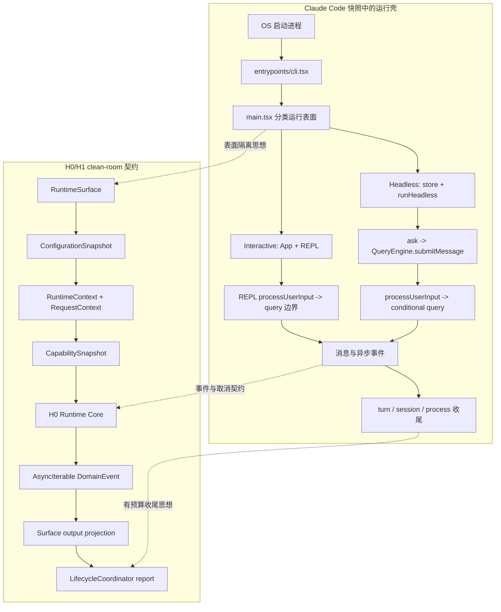

这张图必须读出两个限制。第一，Interactive REPL **不经过 `QueryEngine`**；REPL 有自己的输入与消息 owner，Headless/SDK 才使用 `QueryEngine` 这条路。第二，H1 目前只是运行壳：它不承诺真实 LLM 调用、完整 Tool Loop，也不承诺多个 prompt 已经共享一份会话消息历史。

## 进程启动后，首先被选中的不是模型

你在终端输入 `claude`。很多人会立即搜索 `query()`，但这次运行的第一个决定根本不是“用哪个模型”，而是“需不需要进入完整 CLI”。

`src/entrypoints/cli.tsx` 先处理 `--version` 和若干特殊快路径；只有普通 CLI 路径才动态导入 `main.tsx`。这不只是启动优化。若某个 Hook 或资源在完整 `main` 之后才初始化，那么 `claude --version` 不会执行它，也不应该执行它。

进入 `main.tsx` 后，程序根据 `-p/--print`、`--init-only`、`--sdk-url` 和 `stdout.isTTY` 计算 non-interactive，然后把结果写入 Bootstrap state。`clientType` 是之后根据入口信息得到的来源标签，它不拥有运行表面的选择权。

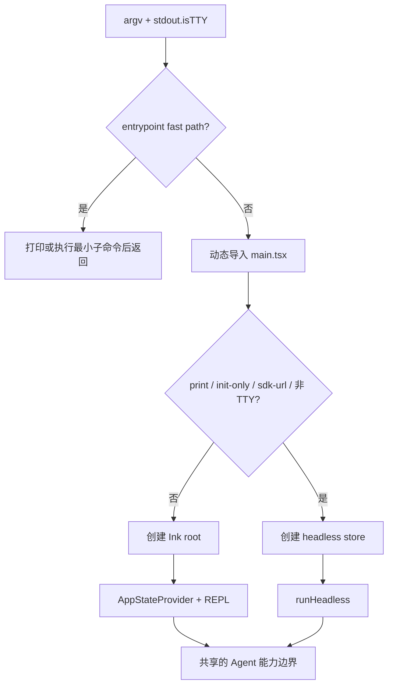

Interactive 的 owner 是一棵持续存在的 UI 树：Ink root 拥有终端生命周期，App/AppStateProvider 提供 store，REPL 拥有交互式消息与提交体验。Headless 没有 React tree，但它不是无状态；`main.tsx` 会构造 `headlessInitialState`、创建 store，然后把 `getState/setState` 传入 `runHeadless()`。

如果 Headless 选择 `stream-json`，`StructuredIO` 还要解决 framing、请求 ID、控制回复、去重、输入关闭和单一出站顺序。传输给它的 chunk 不等于协议消息：一行 JSON 可能被分成多个 chunk，多行 JSON 也可能同时到达。

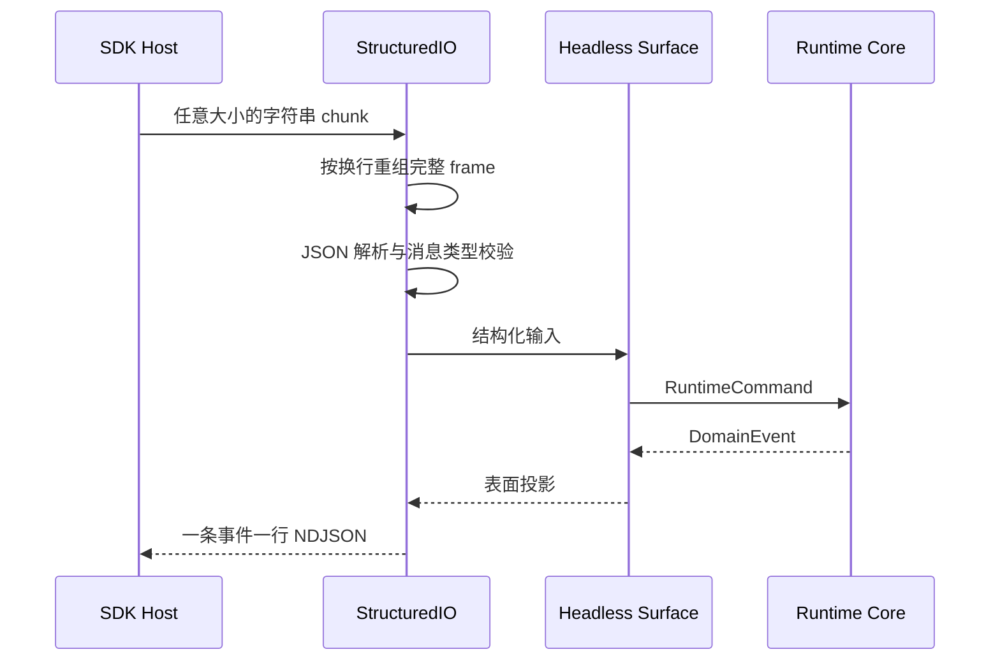

这里有一个重要的跨章不变量：**Surface 可以改变输入和输出形状，不应改变 Core 事件语义。** H1 用 scripted H0 Core 检查 Interactive 和 Headless 是否观察到同一串领域事件。`text`、`json`、`stream-json` 只应决定何时交付、保留什么和怎样编码，不应暗中关闭进度生产或改变工具决策。

### 第一次复习实验：表面不改写 Core

先运行已有的 M05 实验：

```powershell
cd "D:\agent\Claude code最新\curriculum\units\M05\code\typescript"
node runtimeSurface.test.ts
node demo.ts
powershell -NoProfile -ExecutionPolicy Bypass -File .\typecheck.ps1

cd "D:\agent\Claude code最新\curriculum\units\M05\code\python"
python -m unittest -v test_runtime_surface.py
python demo.py
```

运行前先写下反证条件：如果改变 output format 后 Core 收到的 command 或产生的 event 序列改变，那么“表面只做投影”就被推翻。只比较最终字符串不够；一定要比较投影前的事件序列。

## 一条输入要连过三道门，才有资格成为运行状态

Headless 宿主发来的 NDJSON、设置文件里的 JSON、模型未来产生的 Tool input，都属于现实世界的 `unknown`。TypeScript 项目里已经定义了一个类型，并不会让这些数据在运行时自动变得合法。

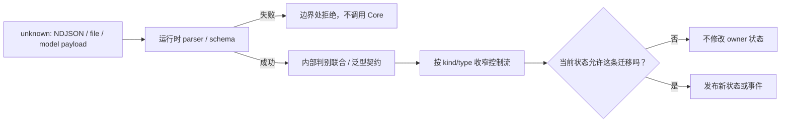

三道门回答的问题不同：

| 门 | 回答的问题 | 不能证明 |
| --- | --- | --- |
| 运行校验 | 这份外部数据实际符合当前 schema 吗 | 当前时刻允许做这个动作 |
| TypeScript 契约 | 内部代码承诺如何构造和分支 | 网络和磁盘数据已经被检查 |
| 迁移规则 | 从当前状态能否到目标状态 | 目标字符串合法就可以任意跳转 |

M01 中的两个 `TaskStatus` 就是一个经典提醒：`src/Task.ts` 的 runtime task 和 `src/utils/tasks.ts` 的 work-item task 即使都有 `completed`，也不是同一个领域。import path、生产者、消费者和 validator 共同决定语义。

这里还要复习两个很容易被语法骗过的边界：

- `const state = {...}` 只是不能让 `state` 重新指向其他对象，它没有冻结字段。
- `readonly Tool[]` 限制消费方改变数组容器，不会在 JavaScript 运行时自动深冻结 Tool 对象。

不要把这些知识单独当成 TypeScript 题。它们会在后面直接决定为什么旧 `RequestContext` 不应被新 revision 污染，为什么 capability snapshot 需要创建新容器，以及为什么结构正确的 tool call 仍然要在执行时重新授权。

## 连线只是候选，状态变化才是运行证据

现在假设你在图谱里看到：

```text
QueryEngine.ts imports query
QueryEngine contains submitMessage
submitMessage calls query
submitMessage indirect_call tool
```

这四条边不能支持同样强的结论。M04 已经核验：`submitMessage()` 存在真实 `query()` call site，但只有 `processUserInput()` 返回 `shouldQuery=true` 时才会到达；`canUseTool(tool, ...)` 中的 `tool` 只是实参，不是被调用的函数。

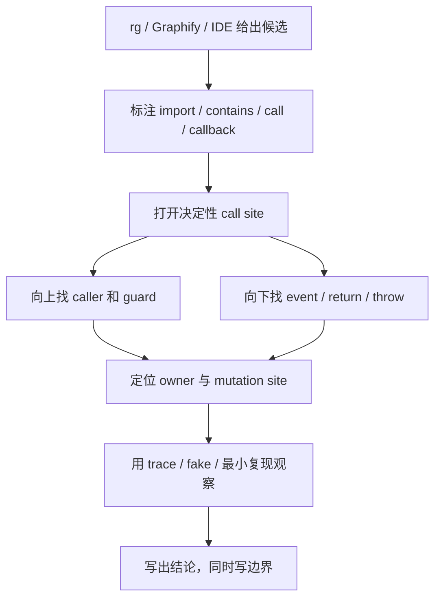

例如 Headless 的真实分支是：

```text
processUserInput
-> 先追加 messagesFromUserInput
-> 建立当前 messages 数组视图
-> shouldQuery=false: 本地结果后 return
-> shouldQuery=true: for await query(...)
```

这解释了两个看似矛盾的事实：“这个方法有 `query()` call site”是真的，“某一次本地命令没有调用 Query”也是真的。一个负路径要用可计数 fake 或明确 branch event 证明，不能用“日志里没看见”代替。

## 配置不是一个字典，而是一次有来源的发布

返回我们的项目。用户设置中 `permissions.defaultMode=default`，项目设置中是 `plan`，flag 设置中是 `acceptEdits`，企业 policy 中是 `dontAsk`。如果只说“高优先级覆盖低优先级”，你还是无法回答嵌套对象、数组、policy 后端选择和 trust 之前的环境变量。

真实流水线要分五步：

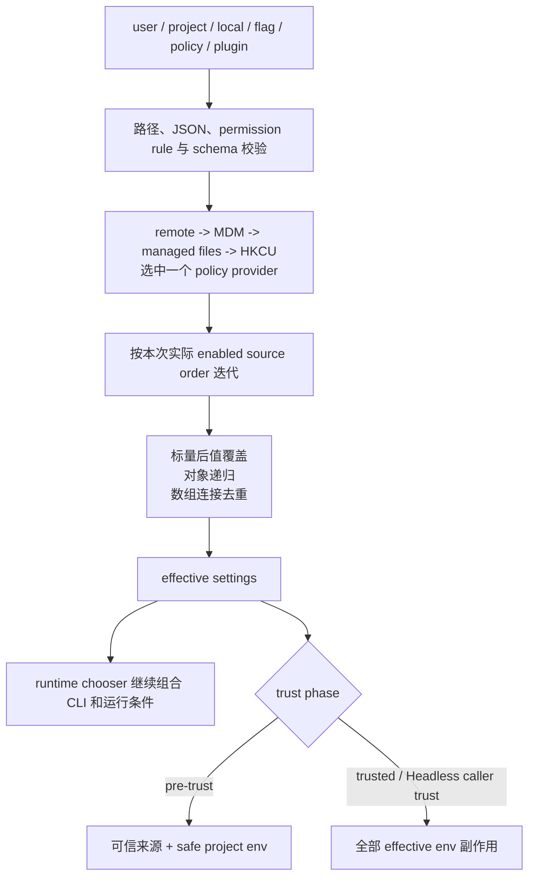

有三个边界必须记牢。

第一，policy provider 之间是 first-valid selection，不是四个后端全部 merge。选中 managed files 后，它内部才可以组合 base 和有序 drop-ins。

第二，当前快照的 `--setting-sources` 字面实现使用保留插入顺序的 `Set`，显式参数可以让实际迭代顺序变成 `ordinary sources -> policy -> flag`。所以源码快照的 compatibility behavior 与 H1 的企业默认不能混写。H1 固定 canonical `user -> project -> local -> flag -> policy`，另保留 snapshot-compatible 函数做研究与对照。

第三，effective settings 是配置合并终点，不是所有运行决策的终点。`permissionSetup.ts` 还会组合危险绕过参数、`--permission-mode`、effective default mode、远程环境限制和 feature gate，最后选出会话模式。

你所在的目录还没被信任时，project/local 中的任意 endpoint、proxy、CA 和 PATH 不能因为“已经合并进 effective object”就进入 `process.env`。Interactive 在 trust dialog 前只应用允许的安全投影。Headless 没有产品内的交互信任门；这表示调用者已经承担前置信任责任，不表示它“不需要信任”。

### 第二次复习实验：最终值、来源和信任是三件事

```powershell
cd "D:\agent\Claude code最新\curriculum\units\M06\code\typescript"
node configuration.test.ts
node demo.ts
powershell -NoProfile -ExecutionPolicy Bypass -File .\typecheck.ps1

cd "D:\agent\Claude code最新\curriculum\units\M06\code\python"
python -m unittest -v test_configuration.py
python demo.py
```

不要只确认 `policy-model` 或 `flag-model` 这个最终字符串。至少检查：actual order 是什么，policy provider 是谁，叶子和数组项的 provenance 是什么，pre-trust 和 trusted 投影分别有哪些环境变量，old snapshot 是否因后续输入修改而变化。

## 当配置发布完成，下一个问题是谁拥有它

“配置是状态”这句话并没有说明任何 owner。Claude Code 快照里至少有四种不同视图：

1. `bootstrap/state.ts` 在 ES module 求值时就创建模块级 `STATE`，`init()` 之前它已经存在。
2. `AppState` 只是形状；`createStore(initialState, onChange)` 创建的闭包才拥有 current root 和 listeners。
3. Interactive 与 Headless 可以创建不同 store 实例，临时 dialog root 也可以有独立 store。
4. 一次 render、一次 `getState()` 和一个为当前阶段保存的 `initialAppState` 对应不同的时间视图。

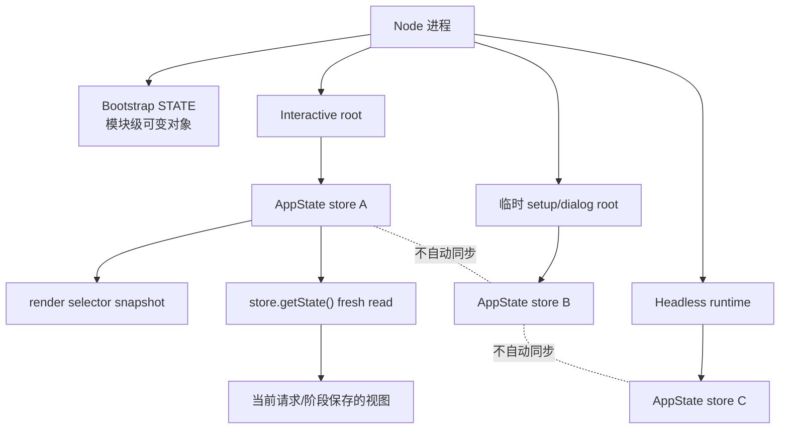

`createStore` 只用 root identity 决定是否通知：updater 先得到 current root，返回同一引用就 no-op；返回新 root 则先提交 state，然后同步运行 observer，再按 `Set` 顺序运行 subscribers。它没有事务回滚。

因此下面的 updater 很危险：

```ts
setAppState(previous => {
  previous.settings.model = 'new-model'
  return previous
})
```

`getState()` 可能已经看见新 model，但 observer 没有运行，UI 和 subscriber 没有得到通知，与 settings 相关的环境和认证副作用也可能没有发生。内存值变了，不等于状态被正确发布。

反过来，每次返回 `{...previous}` 即使内容不变，也会通知。这个 store 把“引用身份变化”当作发布协议，而不是自动 deep compare。

### stale closure 和 request snapshot 都可以是旧值，但只有一个是设计

React 某次 render 产生的 callback 可能在 `await` 之后继续使用旧 selector value。这是 stale closure：代码忘记手里的值来自旧 render，却把它当作 live state。

request snapshot 则相反：系统主动保存一组开始时决策，使同一次请求不因配置热更新而半旧半新。旧 snapshot 本身不是 bug；没有记录 revision、没有定义哪些字段可以 fresh read，才是 bug。

Claude Code REPL 的 `getToolUseContext()` 会在请求边界调用 `store.getState()`，避免只依赖 React 何时完成下一次 render；context 里同时可以包含立即求值的 `tools`、延迟执行的 `refreshTools` 和注入的 `getAppState`。`QueryEngine.processUserInput()` 又在当前阶段保存 `initialAppState`。这不是全 live 与全 frozen 二选一，而是对字段选择一致性策略。

H1 把这个问题收敛成三层 clean-room 契约：

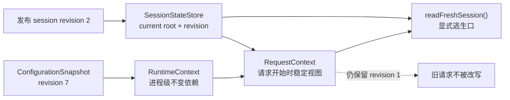

`RuntimeContext`、`SessionStateStore`、`RequestContext` 是设计迁移，不是 Claude Code 的真实类名。他们的价值是让 review 可以追问：为什么这里要打破 snapshot？读到的 revision 是多少？安全 policy 收紧是等下一轮，还是应该立即触发取消？

### 第三次复习实验：让旧请求与新状态同时存在

```powershell
cd "D:\agent\Claude code最新\curriculum\units\M07\code\typescript"
node runtime-context.test.ts
node demo.ts
powershell -NoProfile -ExecutionPolicy Bypass -File .\typecheck.ps1

cd "D:\agent\Claude code最新\curriculum\units\M07\code\python"
python -m unittest -v test_runtime_context.py
python demo.py
```

观察三组独立事实：新 root 是否先提交再通知，listener 失败是否不回滚，session revision 2 发布后旧 request 是否仍保留 revision 1。然后使用 `readFreshSession()` 看见 revision 2，确认 fresh read 没有修改旧 request。

## 请求拿到稳定状态之后，还不能把“所有工具”发给模型

现在回到 `Read`、`Deploy`、`Search` 三个能力。第一轮开始前：

```text
Read    内置工具，已发现，policy 允许，有本地 handler
Deploy  插件已安装，有 handler，但 policy 隐藏
Search  MCP Server 尚未连接
```

如果用一个 `enabled: boolean` 表示能力，这三种状态无法正确表达。能力管线至少需要分开五个问题：

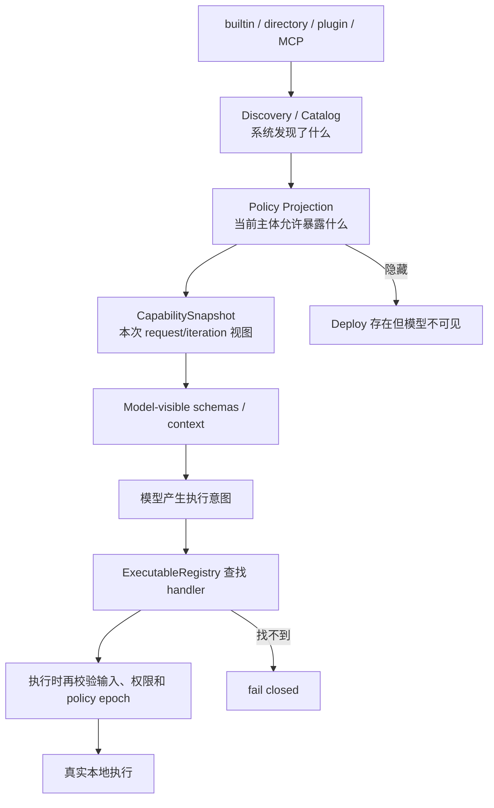

所以要反复说四个不等式：

```text
discovered != model-visible
model-visible != permission-allowed
permission-allowed != executable-registered
current catalog != older request snapshot
```

在 Claude Code 快照里，`getAllBaseTools()` 只给出当前构建和环境的基础候选；`getTools()` 继续应用模式、deny rule 和 `isEnabled()`；`assembleToolPool()` 再合并 MCP tools，按名称定序，同名时保留先出现的 built-in。这仍只是 runtime pool，不是当前 API 必然收到的 schemas。

每次模型请求前，API 投影还会根据模型、模式和预算决定是否启用 Tool Search。deferred tool 可以已经注册 handler，但在被 discover 之前不发送完整 schema。Tool Search 解决的是上下文预算，不是权限授权。

现在 MCP Search 在第一次模型迭代进行中连接成功。它不应该原地改写已经发出请求的 schema。

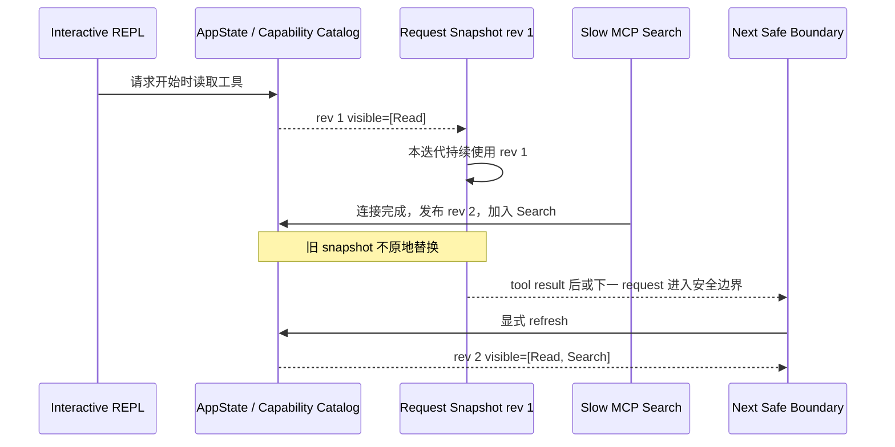

快照中 Interactive 和 Headless 的刷新粒度不完全相同。Interactive `getToolUseContext()` 注入 `refreshTools`，可以在工具结果之后、下一模型迭代之前 fresh read。Headless 会在每个排队 command 前重新 `buildAllTools()`，但当前 `QueryEngineConfig` 保存的是传入的具体 tools，没有相同的 `refreshTools` callback。因此同一个用户意图在两个表面下的刷新边界可以不同，不能因为它们后面都会进入 Query 就反向推导为完全相同。

H1 用 `CapabilityCatalog -> CapabilityProjector -> CapabilitySnapshot -> ExecutableRegistry` 将这个问题变成显式契约。它使用明确 priority 产生唯一 active definition，这比 Claude Code 各类 command/agent consumer 中不完全统一的 first/last 规则更严格，属于设计迁移。

H1 可以验证“当前 snapshot 可见但 registry 没有 handler 时 fail closed”，但这不等于 H1 已经有真实模型产生 `tool_use` 并运行完整 Tool Loop。这里验证的是 dispatch 边界，不是未实现能力。

### 第四次复习实验：让 Search 迟到，让 Ghost 失败

```powershell
cd "D:\agent\Claude code最新\curriculum\units\M08\code\typescript"
node capability-projection.test.ts
node demo.ts
powershell -NoProfile -ExecutionPolicy Bypass -File .\typecheck.ps1

cd "D:\agent\Claude code最新\curriculum\units\M08\code\python"
python -m unittest -v test_capability_projection.py
python demo.py
```

先写五个预测：Deploy 不出现在 schema 但可留在 registry；rev 2 不改变 rev 1 snapshot；Search 在新边界才可见；deferred Search 在 discover 前不发送完整 schema；Ghost 可见却没有 handler 时必须拒绝。任何一项不成立，都应修正你的能力心智模型，而不是把四个清单重新叫成一个 `tools`。

## 事件端口让运行可见，却不会自动提供事务

表面、配置、请求状态和能力快照都已经准备好。现在运行核心开始产生事件。这里是 S0 重新回到主线的地方。

`Promise<FinalAnswer>` 只能表达未来的一次完成。Agent 运行还需要交付 model delta、progress、assistant message、tool result 和 control event。`AsyncIterable` 允许消费者逐项获得它们，但必须读准协议：

- 调用 async generator 只创建 iterator，第一次 `.next()` 才开始执行函数体。
- `yield event` 产生 `{done:false,value:event}` 并暂停。
- `return summary` 产生 `{done:true,value:summary}`；普通 `for await` 没有变量接收这个 return value。
- `yield* child()` 会转发子生成器事件，并在正常结束时取得它的 return value。
- producer throw 使当前 `.next()` reject；`yield {type:'error'}` 对 iterator 仍是普通值。

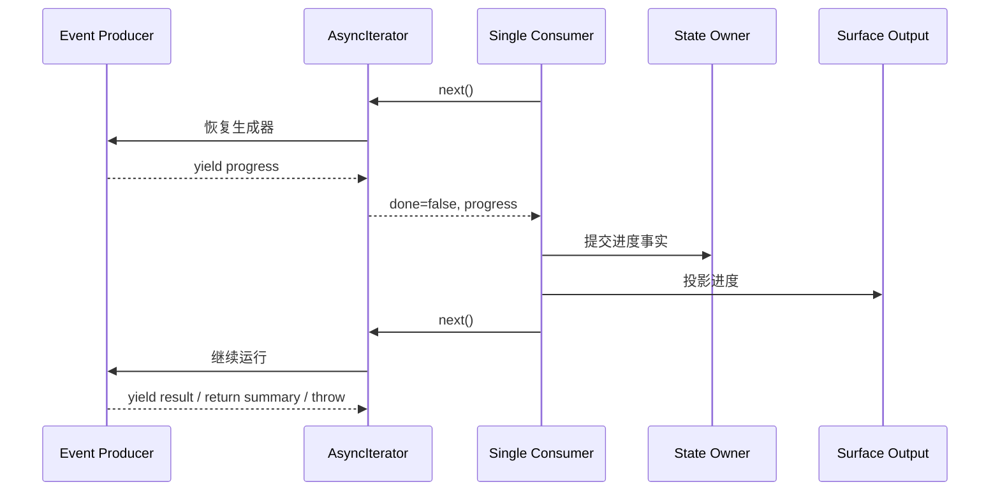

Claude Code 快照里，`query()` 用 `yield* queryLoop()` 转发事件并保留正常 `Terminal`；`QueryEngine.submitMessage()` 用 `for await` 边消费边更新 `mutableMessages`、Transcript、usage 和 SDK 输出。因此它的外部 result 是根据已观察到的消息与 stop reason 收敛，不是 `for await` 替它拿到了 generator return value。

最重要的故障事实是：async generator 不提供事务。如果前两个事件已经被消费者提交，第三次 `.next()` reject，前两次修改不会自动回滚。

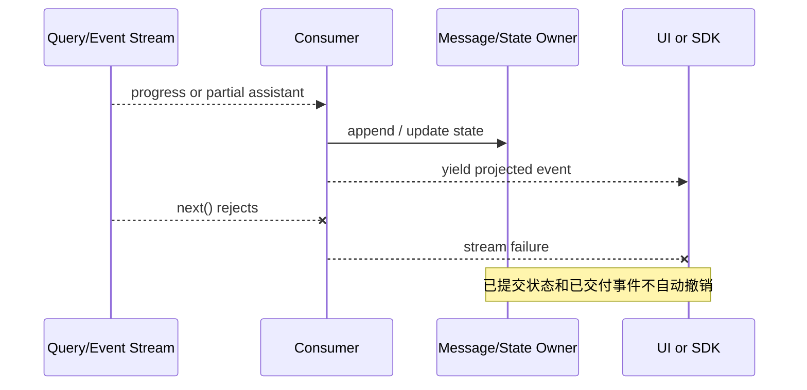

这时要问的不是“整次请求成功还是失败”，而是：哪些内存消息已经追加？Transcript 是已经落盘，还是只进入队列？SDK caller 已经看见什么？工具外部副作用是否发生？后续是追加失败边界、补偿，还是从 checkpoint 恢复？

### AsyncIterable 不是背压与广播的同义词

`src/utils/stream.ts:Stream<T>` 表面是 AsyncIterable，内部却是 push-to-pull adapter：没有等待中的 `next()` 时，`enqueue()` 把值放进无界数组。`StreamingToolExecutor` 也有显式 `pendingProgress` 和 results 缓冲。所以“返回 AsyncIterable”只定义消费端口，不能证明 socket 会被慢消费者自动减速，也不能证明队列有上限。

同一个 iterator 也不应该被 UI、Transcript 和 metrics 三个模块竞争消费。更稳健的企业设计是一个单写者 dispatcher 唯一消费 producer，先提交领域状态与 durable log，再将不可变事件复制到各自有界的 subscriber queue。progress 可以合并，tool result 通常不能丢，permission request 还需要可靠交付和 timeout。

### 第五次复习实验：观察惰性、部分提交与无界缓冲

```powershell
cd "D:\agent\Claude code最新\curriculum\units\M02\code\typescript"
node eventStream.test.ts
node demo.ts
npx --yes --package typescript tsc -p .

cd "D:\agent\Claude code最新\curriculum\units\M02\code\python"
python -m unittest -v test_event_stream.py
python demo.py
```

这组实验不是看“流能不能跑”。你要记录第一次 `.next()` 前生成器体是否执行，消费者提前关闭时哪些 `finally` 运行，外层 `yield*` 后的正常完成代码是否被跳过，producer throw 前已发事件是否保留，consumer 未读取时 push queue 是否增长。

## 用户按下取消后，只是取消意图进入了系统

我们的运行已经产生了 partial assistant 或 progress，用户发现方向不对，按下 Esc。Claude Code REPL 的 `onCancel()` 会先收敛已经发生的事实：若已有 streaming text，先把 partial assistant 加入 messages owner，然后清本轮 UI 状态，再根据当前分支请求取消。普通本地分支调用 `abortController.abort('user-cancel')`，会话和进程仍继续存在。

这一步只完成了下图的前半段。

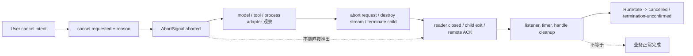

M02 能证明 consumer `.return()` 会尝试关闭 generator 链并触发 `finally`，却不能证明网络请求、子进程和所有工具 Promise 已经停止。M03 所补上的正是资源链：`AbortSignal` 是 one-shot 通知，真正动作属于拥有 resource handle 的 adapter。

以 Shell 为例，`Shell.exec()` 管理 spawn 前装配与 pre-abort，`ShellCommandImpl` 拥有 child、timer、abort listener 和 result promise，`TaskOutput` 拥有输出存储与 poller，`runShellCommand()` 管理前台 progress 与 background 转换。timeout、abort、kill 和 background 是四个动词：

| 事件 | 意图 | child 是否可继续 | 谁接管 |
| --- | --- | --- | --- |
| timeout | 前台等待预算到期 | 可能，若被转 background | background task owner 或 kill 路径 |
| abort | 发布带 reason 的取消通知 | 取决于 listener 策略 | resource adapter |
| kill | 请求终止进程树 | 理论上不应，但还要区分请求和确认 | ShellCommand/platform adapter |
| background | 转移所有权 | 是 | durable/background task owner |

快照的 Shell kill 会发出 tree-kill 请求，并主动收敛内部 result；这是 logical completion，不等于已观察到 OS-level exit。H0 将 `termination requested` 和 `exit confirmed` 分成两个事件，并用 `ResourceScope` 编排幂等清理。这是为了建立可迁移契约，不是声称 Claude Code 内部就是这个类。

### 第六次复习实验：取消请求不等于退出确认

```powershell
cd "D:\agent\Claude code最新\curriculum\units\M03\code\typescript"
node runtimeHarness.test.ts
node demo.ts
powershell -NoProfile -ExecutionPolicy Bypass -File .\typecheck.ps1

cd "D:\agent\Claude code最新\curriculum\units\M03\code\python"
python -m unittest -v test_runtime_harness.py
python demo.py
```

不要只检查最终 status。要检查事件顺序是否为 `cancel.requested -> process.exited -> cleanup.finished`，并区分 timeout 和 user cancellation reason。然后做一次故障注入：取消时只记录 reason，不调用 child terminate，预测 result 会自然完成还是持续等待。这个实验直接检查你是否仍在把 signal 当成 kill。

## 取消一轮之后，会话和进程都还在

用户按 Esc 只结束当前 turn。之后输入 `/clear`，结束的是逻辑 session；最后输入 `/exit`，才进入 process shutdown。还有一类必须承认的硬边界：SIGKILL、机器掉电或容器 OOM 可以让 JavaScript 没有任何清理机会。

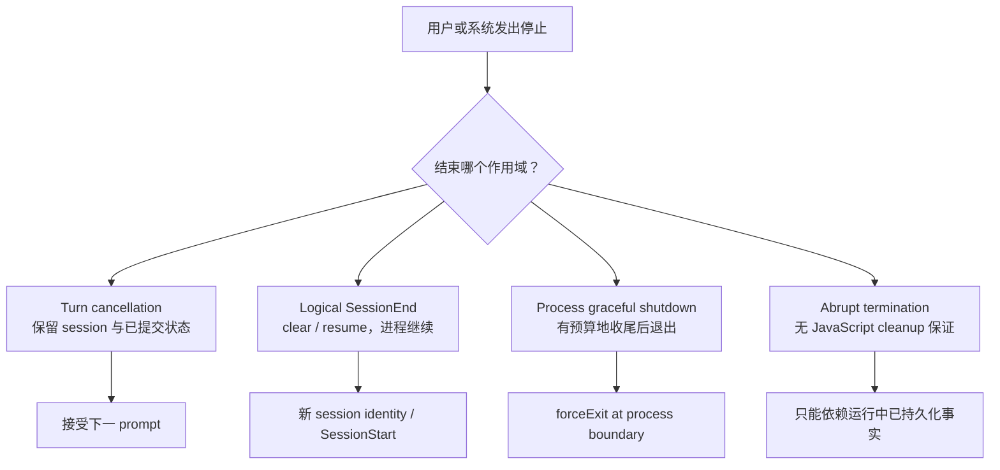

`/clear` 和 Interactive `/resume` 都可以执行 SessionEnd Hook，之后同一 OS process 继续。所以 SessionEnd 不是 shutdown hook 的别名。同样，Interactive Ctrl+C 可以由 Ink keybinding 进入 turn cancel 或退出流；外部 OS `SIGINT` 则进入 process handler。名字相同，入口和 owner 不一定相同。

## 进程收尾的本质，是在时间减少时做价值排序

Claude Code 的 `setupGracefulShutdown()` 在较早的 `init()` 阶段安装 signal handler，而不是等 REPL 完全渲染后才处理 SIGTERM。Headless 另有表面特有的 SIGINT handler，因为它知道当前 in-flight controller；全局 handler 会主动避免与 Print 路径竞争。

首个合法 `gracefulShutdown()` 调用者取得 owner。快照的 `shutdownInProgress` 阻止后续调用重复执行，因此首个 reason 和 exit code 获胜。`gracefulShutdownSync()` 的 `Sync` 也不表示清理已经同步完成：它设置 `process.exitCode`、启动并保存异步 shutdown Promise，然后返回 `void`。

快照的正常收尾顺序可以压缩为：

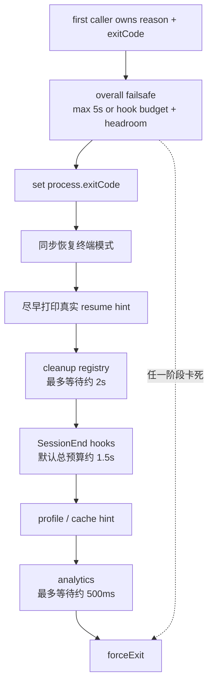

这张图表达的是阶段价值顺序，不是 cleanup registry 内部已经有优先级。真实 registry 只是 `Set<async function> + Promise.all`：

- handler 按插入顺序被调用，但异步完成顺序不受保证；
- 一个 handler reject 使 `Promise.all` fail fast，已经启动的 peer 不会自动取消；
- 与 2 秒 timer 的 `Promise.race` 只停止外层等待，loser 可继续与 SessionEnd 重叠；
- Transcript handler 很重要，但它是惰性注册且与其他 handler 并发，不能声称“一定第一完成”。

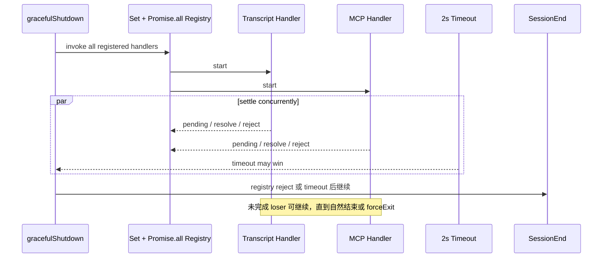

H1 不复制这个简单 registry，而是把“应该先保什么”变成可执行契约。

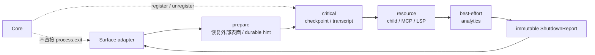

H1 的 `LifecycleCoordinator` 先校验 shutdown request，第一个合法请求获得 owner，后续调用者得到同一个 Promise/Task 和 report。跨层串行，同层并发，每个 handler 独立记录 `completed | failed | timed-out`；overall deadline 使未开始的低优先级工作标为 `skipped`。timeout 会发布合作式取消 signal，但 report 不声称底层已经物理终止。

这些 phase、shared report 和 all-settled 策略是 H1 的设计迁移。Claude Code 快照仍然是无 phase/priority 的 registry。两者都有合理使用场景：本地 CLI 用小控制面换取简单，企业平台面对多租户、远程 worker、SLO 和审计时需要更强的结构化报告。

### 第七次复习实验：证明 timeout 只停止等待

```powershell
cd "D:\agent\Claude code最新\curriculum\units\M09\code\typescript"
powershell -NoProfile -ExecutionPolicy Bypass -File .\typecheck.ps1
node --experimental-strip-types .\lifecycle-coordinator.test.ts
node --experimental-strip-types .\demo.ts

cd "D:\agent\Claude code最新\curriculum\units\M09\code\python"
python .\test_lifecycle_coordinator.py
python .\demo.py
```

再回到 M09 的 snapshot-shaped slow + fail 反例，观察 registry 已 reject 后 slow handler 仍可记录 done。然后在 LifecycleCoordinator 中观察另一种协议：一个 critical handler 失败不会偶然跳过 peer 或后续层，除非你显式把“critical failure 阻止 resource”定义为策略。

## 现在才能看清 H0 与 H1 各自拥有什么

如果把 H0 与 H1 只记成两个版本号，你会错过这九章最重要的累计关系。H0 解决“一次运行的领域事实怎样表达、流动、取消和验证”；H1 解决“世界怎样安全地把一次运行包起来”。

这里还要固定时间线：H1 是 S1 原子发布时的能力固定点；当前工作区已经演进到 H2-in-progress `0.2`，但本复习章只重建 M01-M09 与 H1 的发布边界，不用后续实现倒写已经发布的 S0/S1 结论。

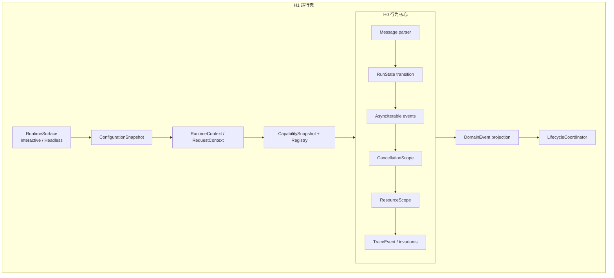

H0 不只是一组类型，它固定了这些行为：外部消息先验证；`RunState` 只能沿合法边迁移；事件逐条提交；失败不回滚既有状态；`shouldQuery=false` 可被观察且 Query 调用数为零；cancel request 与 cleanup 是两个事件；Trace 不把静态导入当成调用，也不记录敏感原文。

H1 在这个核心之外固定：表面不改写事件语义；配置与 session 发布新 revision 而不污染旧 snapshot；RequestContext 默认稳定，fresh read 显式发生；discovery、visibility、permission 和 registry 分开；shutdown 由首个合法请求拥有，并返回结构化 report。

同样要把当前不能力写清：

- H1 没有因 Interactive 可连续提交就自动拥有多轮共享消息 owner。
- H1 没有真实 LLM provider 与模型事件组装。
- H1 没有完整 Tool Loop、并发调度、工具结果反馈和终止状态机。
- H1 没有完整 Transcript、恢复、Sandbox、分布式 worker 或企业治理。

这些不是缺陷清单，而是下一阶段的依赖边界。S2 才会在这个运行壳内部加入会话消息 owner、Query Loop、RequestProjector、LLMAdapter、StreamingAssembler 和 Tool feedback。如果运行壳没有先固定 revision、capability snapshot 和 cancellation owner，后续主循环的每一个动态分支都会重新制造一致性问题。

### 累计回归：不只验证最后一个模块

执行 H1 阶段回归：

```powershell
cd "D:\agent\Claude code最新\mini-agent-harness"
powershell -NoProfile -ExecutionPolicy Bypass -File .\tests\run-h1-regression.ps1
```

S1 发布时的已验证结果是 `12/12 checks passed`，并包含 S0 `15/15`。这些数字是检查组，不是每个模块的单测数量。当前工作区如有后续 Harness 演进，应以命令的实际结果为准，不用发布数字代替当前运行。

## 修改挑战：用一个红灯推翻一条误解

这些挑战不要全部一次合入累计 Harness。每次先在相应单元实验中完成，再根据契约稳定性作 `merge / defer / reject` 决定。

### 挑战一：让投影选项污染 Core

在 M05 clean-room 中把 output format 传入 Core，让 text 模式不生产 progress。如果原有测试只检查最终字符串，它可能仍然绿。补一个跨 Surface 领域事件等价测试，说明为什么这个测试才抓住了问题。

### 挑战二：把 snapshot 改回 live reference

让 M07 `RequestContext` 每次通过 getter 读当前 session。发布 revision 2 后，检查原本标记 revision 1 的 request 是否悄悄读到新 permission/tools。修复时不要删掉所有 fresh read；恢复默认 snapshot，为必要场景保留命名清楚且记录 observed revision 的逃生口。

### 挑战三：定义明确的 RefreshBoundary

在 M08 clean-room 中引入 `NEXT_MODEL_ITERATION | NEXT_REQUEST | IMMEDIATE_REVOCATION` 一类有限集，不用一个 `refresh=true` 布尔值。普通 MCP 新工具在新 snapshot 生效；紧急 deny 则在 dispatch 时检查当前 policy epoch。写测试证明“旧请求一致”与“安全策略可立即收紧”可以同时存在。

### 挑战四：为事件端口选择有界策略

不要直接给 M02 `PushAsyncQueue` 加一个数字就结束。为 `model.delta`、`tool.progress`、`tool.result`、`permission.request` 分别选择合并、只留最新、阻塞、落盘或失败，并写出队列满时的反证条件。同一套策略不应该无差别地用在所有事件上。

### 挑战五：让 critical failure 是策略，不是偶然 fail-fast

修改 LifecycleCoordinator，增加一个“任意 critical failure 时是否跳过 resource”的显式策略。两种配置都要返回完整 report：哪些 handler 失败，哪些未开始，是因 overall deadline 还是 policy skip。对比这个结果与一个 Promise 偶然先 reject 所产生的控制流。

## 迁移到 Java/Spring：先分 owner 和端口，再选框架

用 Java/Spring 实现时，不要从“每个 Tool 都是一个 Bean”开始。Bean 发现只解决了 executable registry，没有解决租户策略、模型可见性、request revision、取消和 shutdown。一条可迁移的端到端边界是：

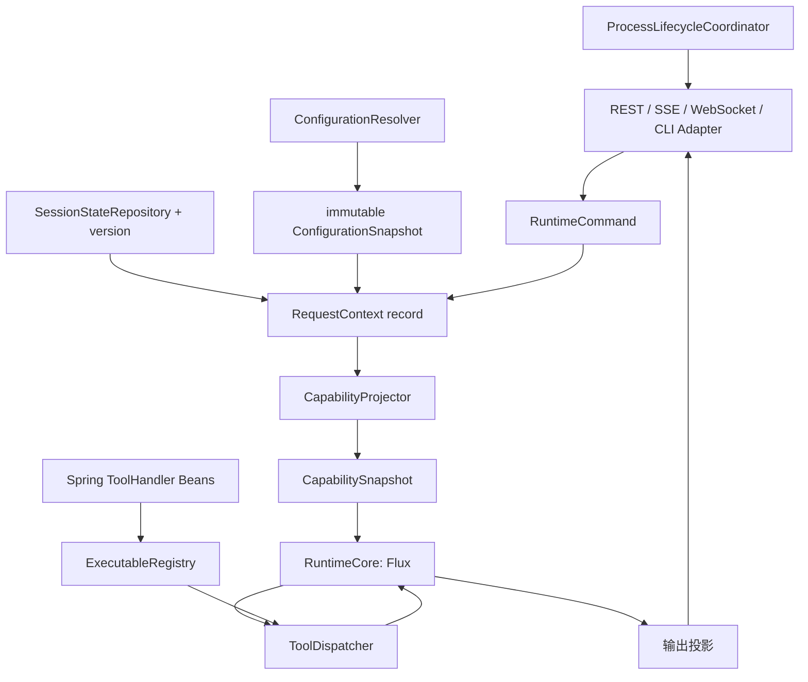

Spring `Environment`、Nacos、Apollo 或 Cloud Config 可以作为配置发现 adapter，但 Core 应该消费带 revision/provenance 的 immutable snapshot，而不是在工具执行到一半时通过 `@Value` 重读全局值。

`Flux<DomainEvent>` 与 TypeScript `AsyncIterable` 共享多值流意图，却不是同一协议。Reactive Streams 有 demand，但 provider adapter 或外部 callback 仍可以在前面偷偷无界缓冲。SSE client 断开要传播到模型 HTTP、Tool `ProcessHandle`、远程 worker 和资源清理，`doFinally` 记一行日志不能证明它们已经退出。

RuntimeContext 可以是 singleton factory 创建的 immutable record；SessionStateRepository 必须按 session ID 隔离，并用 version/CAS 发布；RequestContext 为每次 turn 创建。ThreadLocal 不会自动穿过 Reactor 异步切换，trace identity 可放在 Reactor Context，领域依赖仍建议显式传递。

进程收尾时，turn cancellation、SessionEndEvent 和 JVM/process shutdown 仍是三个 API。Spring `SmartLifecycle` 可以参与 process phase，但 WebSocket 会话切换不应等待 JVM 退出。Kubernetes 收到 SIGTERM 后先让 readiness=false，再给 checkpoint/transcript、resource、best-effort 分配内部预算，并为容器外层强杀保留余量。

## 迁移到 LangGraph/RAG：Graph State 不是所有运行依赖

LangGraph 可以把 model、tool、refresh 和条件路由表示为节点与边，checkpoint 也可持久 graph state。但下面这些值往往仍是外部注入：

```text
configuration revision
model/provider route
tool catalog and registry revision
tenant permission epoch
retriever/index alias
cancellation/resource handles
surface protocol identity
```

恢复 checkpoint 时，必须决定继续绑定原 snapshot，迁移到新 revision，还是因紧急 policy 撤销而拒绝恢复。只因 graph state JSON 可解析，不能证明外部依赖与当时兼容。

RAG 也存在同样问题。query rewrite 使用旧 embedding 配置，retriever 在中途读到新 index alias，reranker 又切换到新 model，这次结果就无法复现。RequestContext 应该保存 configuration、index、reranker 和 policy revision；紧急 ACL 收紧通过独立 epoch gate 阻止下一个副作用，不等普通 fresh read 偶然发生。

## 资深大厂 Agent 开发岗面试：从一次运行讲到系统设计

下面的问题不是按 M01-M09 划分，而是面试官从一个真实 Agent 运行向下追问时最容易穿越的边界。练习时先讲结论，再讲运行机制，最后根据追问落到 Claude Code 快照或企业迁移。

### 问题一：从进程启动到一次请求进入 Agent Core，你会怎样分层？

**参考口语回答（约 2 分钟）：**

> 先说结论：我会把一次 Agent 运行分成 Surface、配置发布、Runtime/Session/Request 状态、能力投影、Core 事件和生命周期六层，不会让一个 `main()` 同时理解 TTY、JSON、模型和退出。Claude Code 的最外层先走 version 等 fast path，`main.tsx` 再按 flags 和 TTY 选 Interactive 或 Headless。Interactive 由 Ink/App/REPL 拥有界面生命周期，Headless 创建独立 store 和 StructuredIO，但两者都不应改写领域事件。进入 Core 前，我会把外部配置变成带 revision 的 snapshot，为当前 request 固定 session 与 capability 视图。Core 只消费领域 command 和 context，返回事件，不直接读 React、stdout 或全局环境。这样新增 HTTP、SSE 或队列表面时，不用重写 Agent Loop。

### 问题二：运行中配置更新或 MCP 工具连接成功，当前请求应该立即看见吗？

**参考口语回答（约 2 分钟）：**

> 先说结论：不应该把所有变化都立即写进当前请求，而是默认固定 revision，只在声明的安全边界刷新；紧急安全撤权则走独立强制通道。Claude Code Interactive 首轮不等所有 MCP，REPL 创建初始 tools 视图，同时保留 `refreshTools`，在工具结果后、下一模型迭代前刷新。这样 Search 可以迟到，却不会改写正在解释的旧 schema。配置也一样，新 policy 发布新 revision，旧 run 默认继续用它绑定的 snapshot。但如果是 deny policy 或 credential revoke，我会在下一个 Tool 副作用前检查当前 policy epoch，必要时取消旧 run，而不是等普通 refresh。

### 问题三：用了 AsyncIterable，是不是流式、背压和取消都解决了？

**参考口语回答（约 2 分钟）：**

> 先说结论：没有，AsyncIterable 只规定消费者怎样逐个取值，不保证上游没有无界缓冲，也不保证 consumer 关闭后 socket 和子进程已经停止。Claude Code 的 `query()` 用 async generator 保留中间事件，QueryEngine 用 `for await` 边消费边改状态；但 `Stream<T>` 的内部仍可以是无界 push queue，StreamingToolExecutor 也有 progress/results 缓冲。consumer `.return()` 会让 generator `finally` 运行，可是只有 finally 真正调用 abort、destroy 或 kill，外部资源才收到动作。生产系统还要按事件语义定队列上限和丢弃策略，并区分取消请求、资源动作和终止确认。

### 问题四：你怎样区分全局状态、会话状态、请求快照和 stale closure？

**参考口语回答（约 2 分钟）：**

> 先说结论：我不会按文件或状态库名称分，而是问创建点、生命周期、owner 和一致性。Claude Code Bootstrap `STATE` 在模块 import 时已经存在，解决早期 cwd、session ID 和入口标记；AppState 是数据形状，真正 owner 是每个 root 创建的 store，同一进程可以有多个 store。一次 React render 捕获的旧值如果被错当成 live state，那是 stale closure；RequestContext 刻意固定 revision，是为了同一请求不半旧半新。我会默认用 immutable request snapshot，对 tools 这类允许变化的字段提供命名清楚的 fresh read，并记录 observed revision。

### 问题五：模型请求里已经有一个工具 schema，为什么执行时还要重新检查？

**参考口语回答（约 2 分钟）：**

> 先说结论：模型可见性只决定模型可以提出什么意图，真正执行权始终属于 Harness。Claude Code 的本地 pool 经过模式、deny rule、MCP 合并后，API 还可能因 Tool Search 隐藏 deferred schema；模型返回 tool intent 后，本地要查 handler、验证 input schema、检查权限和当前策略。旧 transcript、提示注入或部署错配都可能让请求出现当前 registry 没有的名称，这时必须 fail closed 并返回结构化 tool error，不能动态反射执行。企业平台还要确保 model request 和 dispatch 使用同一 snapshot ID，紧急 deny 在执行时检查最新 policy epoch。

### 问题六：用户点了取消，怎样判断一次 Agent 运行真的停了？

**参考口语回答（约 2 分钟）：**

> 先说结论：我会把取消意图、信号传播、资源动作和终止确认分开记录，只看 `signal.aborted` 不能叫已停止。Claude Code REPL 取消时先保留 partial assistant，再 abort 当前 turn，说明已经交付的事实不会回滚。Shell 路径中 AbortSignal 由 ShellCommand listener 转成 tree-kill 或 background 策略，而且 kill 后的内部 result 可以是 logical completion，不一定已看到 OS exit。我的 Harness 会记录 CancelRequested、TerminationSent、ExitConfirmed 和 CleanupFinished；超时没确认就进 `termination_unconfirmed`，由平台 adapter 升级到 SIGKILL、Job Object 或容器 runtime，不伪装成 cancelled success。

### 问题七：你会怎样设计一个有预算的企业 Agent shutdown？

**参考口语回答（约 2 分钟）：**

> 先说结论：我会先关新工作入口，再按可恢复性从高到低分阶段收尾，每个未完成项都进 report，不会对所有 cleanup 直接一次 `Promise.all`。Claude Code 的收尾先恢复终端和打印真实 resume hint，再给 registry、SessionEnd Hook 和 analytics 不同预算，最后 force exit，这个价值排序很合理。但它的 registry 是 Set 加 fail-fast Promise.all，没有真正 phase。企业版我会做 critical checkpoint/transcript、resource child/MCP/lease、best-effort analytics 三层，层间串行、层内 all-settled，timeout 发合作式信号，但标记 termination unconfirmed。Kubernetes readiness 先关，内部 deadline 小于 termination grace，为最后日志和强杀留余量。

### 问题八：在几千个文件的 Agent 仓库里，你怎样证明自己找到的是真实运行链？

**参考口语回答（约 2 分钟）：**

> 先说结论：我会先写一个可证伪的运行问题，再按“候选关系、真实 call site、到达 guard、状态 owner/mutation、运行观察”向下收敛，不会把 import 图当调用图。例如 QueryEngine 确实 import 并在 `submitMessage()` 中调用 `query()`，但只有 `processUserInput` 返回 `shouldQuery=true` 才到达；本地 slash command 在前面已追加消息，然后可以不调 Query 就返回。Graphify 和 IDE 很适合帮我缩小搜索，但 inferred tool call 回源码后发现 `tool` 只是 `canUseTool` 实参，就必须否定。最后我会用可计数 fake、结构化 trace 或最小复现验证负分支和部分失败，并写清结论没有证明什么。

## 离开本章前，从空白纸重建一次运行

先不看任何总图，在纸上画出下列节点：

```text
entrypoint
surface owner
configuration revision
runtime/session/request owner
capability catalog revision
model-visible snapshot
event producer and single consumer
cancel intent and resource confirmation
SessionEnd
process shutdown report
```

每条箭头不允许只写“经过”。改成 `constructs`、`validates`、`publishes`、`snapshots`、`projects`、`yields`、`commits`、`requests-cancel`、`confirms-exit`、`hands-off`。如果一条箭头找不到动词，你很可能还没有找到真实协议。

然后为四个时间点写下 revision：进程开始、request 开始、MCP Search 连接完成、下一安全刷新边界。说明旧 request 为什么不变，紧急 deny 为什么又可以立即阻止下一副作用。

最后复盘取消：如果 trace 只有 `cancelled=true`，补上 request time、reason、source、resource action、exit/remote ACK、cleanup completion 和 timeout/unconfirmed。再说明为什么这些事件不能由一个 `finally` 代替。

## 一页复习索引

| 遇到的问题 | 先问什么 | 最小不变量 | 快速验证 |
| --- | --- | --- | --- |
| 外部 JSON 已经有 TS 类型，还要校验吗 | 这个值是否经过本项目编译器 | unknown 先 schema，再进内部 union | M01 双语言契约实验 |
| 某 status 是合法字符串，为什么仍不能写 | 当前状态到目标状态有迁移边吗 | 值域与迁移规则分开 | H0 RunState test |
| 图谱说 A 调用 B | 是 import、contains、call 还是 callback | call site + guard + owner/mutation | M04 TraceableEngine |
| Interactive 和 Headless 表现不同 | 差异发生在 Core 前还是投影后 | 同一 command 产生同一领域事件序列 | M05 surface tests |
| 一个配置值不符合预期 | actual source order 和 policy provider 是什么 | selection、merge、trust、runtime decision 分层 | M06 configuration tests |
| 设置已更新，当前请求仍用旧值 | 它绑定哪个 revision | 旧 snapshot 不原地改写，fresh read 显式 | M07 runtime-context tests |
| MCP 已连接，模型看不见工具 | 它在 discovery、projection、snapshot 哪一层 | 刷新只在声明边界创建新 snapshot | M08 capability tests |
| 模型说要调用某工具 | 当前 snapshot 可见吗，registry 有 handler 吗 | 意图不是授权，执行时 fail closed | M08 Ghost test |
| 流已关闭，资源还在 | `finally` 是否连接到 abort/destroy/kill | iterator close、resource action、exit confirmation 分开 | M02 + M03 tests |
| `Promise.race` timeout 已到 | loser 有没有合作式信号和确认 | stop waiting 不等于 stop work | M09 slow handler test |
| `/clear`、Esc 和 SIGTERM 都叫停止 | 结束 turn、session 还是 process | 三个 owner 和状态机分开 | M09 lifecycle tests |
| graceful shutdown 是否足以恢复 | SIGKILL 时还剩下什么 | 运行中增量持久，退出 flush 只缩小窗口 | Transcript/shutdown 源码跟踪 |

## 源码与教材定位

行号只适用于当前快照，复习时优先按路径和符号搜索。

### 需求、标杆与阶段结论

- `2.md` -> 学习者、源码深度、实验、Harness 和面试最高要求。
- `3.md` -> Codex 主控、双闸门、写作和发布流程。
- `curriculum/design/benchmark-rules.md` -> M11 已确认的叙事、局部图、实验与两分钟面试回答规则。
- `curriculum/stages/S0/release-summary.md` -> M01-M04 与 H0 原子发布结论。
- `curriculum/stages/S1/release-summary.md` -> M05-M09 与 H1 原子发布结论。
- `mini-agent-harness/contracts/h0-contract.md` -> H0 八项已验证不变量。
- `mini-agent-harness/contracts/h1-contract.md` -> H1 运行表面、配置、状态、能力和生命周期契约。

### 类型、事件和资源

- `curriculum/units/M01/final.md` -> 类型、schema、迁移，两个 Task 领域与 Tool 泛型。
- `curriculum/units/M02/final.md` -> Promise、AsyncGenerator、`yield*`、`for await`、缓冲与部分失败。
- `curriculum/units/M03/final.md` -> event loop、Shell、Stream、AbortSignal、进程取消与资源确认。
- `curriculum/units/M04/final.md` -> Graphify/rg 候选、真实 call site、guard、owner 和 Trace 反证。
- `claude-code-CLI/src/Task.ts` -> runtime Task 值域与终态谓词。
- `claude-code-CLI/src/utils/tasks.ts` -> work-item Task schema 与条件迁移。
- `claude-code-CLI/src/Tool.ts` -> `Tool<Input, Output, P>` 契约。
- `claude-code-CLI/src/query.ts` -> `query()` / `queryLoop()` generator 委托边界。
- `claude-code-CLI/src/QueryEngine.ts` -> Headless/SDK 输入、conditional query 与事件消费。
- `claude-code-CLI/src/utils/stream.ts` -> push-to-pull `Stream<T>` 与无界 queue 边界。
- `claude-code-CLI/src/utils/Shell.ts` 与 `src/utils/ShellCommand.ts` -> spawn、输出模式、timeout、kill、background 和 cleanup owner。

### 运行表面、配置、状态与能力

- `curriculum/units/M05/final.md` -> Interactive/Headless/SDK 表面、StructuredIO 与输出投影。
- `curriculum/units/M06/final.md` -> 配置来源、provider selection、合并、trust 与 revision。
- `curriculum/units/M07/final.md` -> Bootstrap、AppState store、root identity、snapshot 和 fresh read。
- `curriculum/units/M08/final.md` -> 发现目录、能力投影、Tool Search、schema cache 与 registry。
- `claude-code-CLI/src/entrypoints/cli.tsx` 与 `src/main.tsx` -> fast path、表面分类与初始化。
- `claude-code-CLI/src/cli/print.ts` 与 `src/cli/structuredIO.ts` -> Headless store、NDJSON、control request 与输出投影。
- `claude-code-CLI/src/utils/settings/settings.ts` 与 `src/utils/settings/constants.ts` -> 实际 source order、schema、policy selection 和 merge。
- `claude-code-CLI/src/utils/managedEnv.ts` -> pre-trust/full environment projection。
- `claude-code-CLI/src/bootstrap/state.ts` -> 模块级 Bootstrap owner。
- `claude-code-CLI/src/state/store.ts`、`src/state/AppState.tsx` 和 `src/state/AppStateStore.ts` -> store 实例、通知与 React selector。
- `claude-code-CLI/src/tools.ts`、`src/screens/REPL.tsx`、`src/services/api/claude.ts` -> runtime pool、refresh boundary 和 API schema 投影。

### 取消与收尾

- `curriculum/units/M09/final.md` -> turn、session、process、hard termination 与分阶段 Harness 迁移。
- `claude-code-CLI/src/screens/REPL.tsx` -> `onCancel`、partial assistant 与 Interactive resume。
- `claude-code-CLI/src/commands/clear/conversation.ts` -> `/clear` 的 SessionEnd/SessionStart。
- `claude-code-CLI/src/utils/gracefulShutdown.ts` -> signal 安装、first owner、failsafe 和各收尾阶段。
- `claude-code-CLI/src/utils/cleanupRegistry.ts` -> 无 phase/priority 的 `Set + Promise.all`。
- `claude-code-CLI/src/utils/sessionStorage.ts` -> Transcript 增量写入、`Project.flush()` 和 stopping guard。

最后用一句话收束这九章：

> Agent 运行壳的价值，不是把所有东西装进一个大对象，而是让每份外部输入都经过验证，每个运行决策都绑定可解释的 revision，每个事件都有 owner，每次取消都能追到资源确认，每次收尾都能说清时间给了谁、哪些事情仍未完成。
