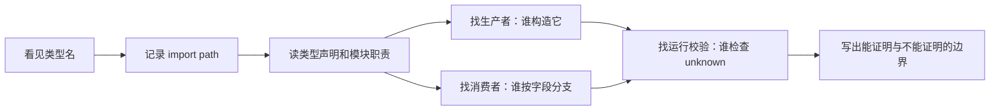
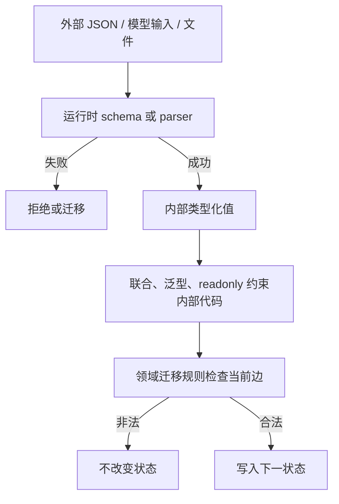
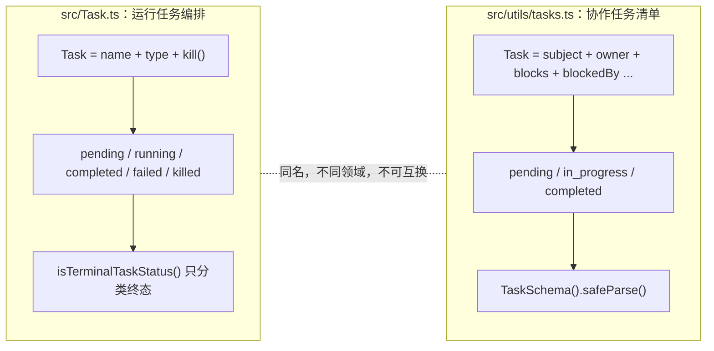
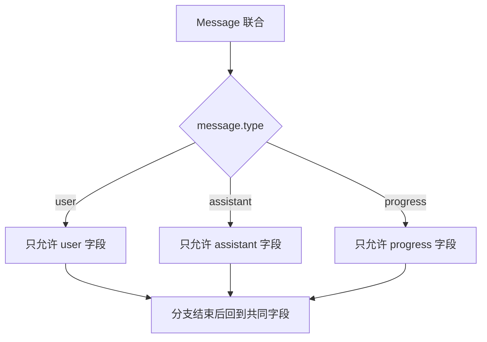
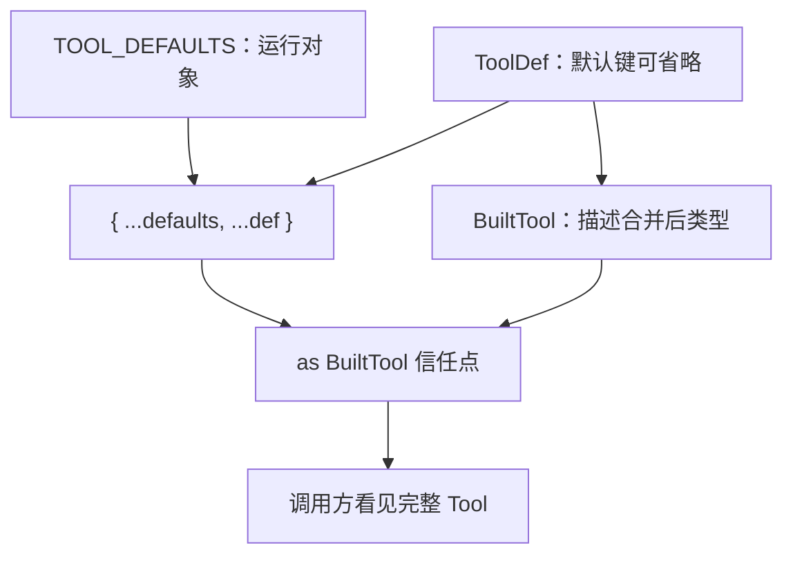
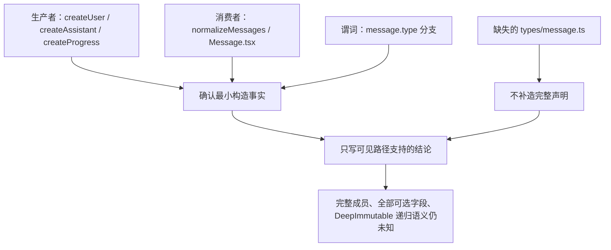
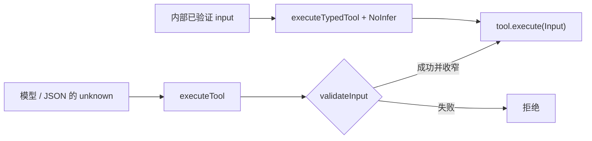

# M01 面试官问“TypeScript 类型能保证 Agent 安全吗？”：从 Message、Tool、Task 扒开三道系统边界

<!-- INTERVIEW_LED_STYLE_V1 -->

这题面试官想考的，其实不是你会不会背 `type`、`interface`、泛型和 Zod，而是看你有没有真正想过：一个工业级 Agent 到底靠什么守住消息、工具和任务的边界。

你是停在“TypeScript 有类型检查，所以比较安全”这种皮毛上，还是会继续追问：模型吐回来的 JSON 根本没经过 `tsc`，谁来验？两个模块都叫 `TaskStatus`，凭什么不是同一个领域？状态值合法，为什么仍然可能发生非法迁移？

很可惜，这位林友当时只回答：“TypeScript 能在编译期发现错误，Zod 再校验一下就行。”面试官接着问：“那 `completed -> running` 为什么还能写出来？`src/Task.ts` 和 `src/utils/tasks.ts` 的 `TaskStatus` 能直接互转吗？”他就接不下去了，面试官摇了摇头，让他先回去等通知。

今天这篇文章，我们就不从语法表开始背，而是沿着 Claude Code 的 Message、Tool 和两套 Task 领域，把下面这些问题一层层扒清楚：

- 类型到底能证明什么，又绝对不能证明什么？
- 模型 tool input 怎样从 `unknown` 进入可信内部对象？
- Agent 为什么需要判别联合，它怎样直接改变控制流？
- `Tool<Input, Output, P>` 为什么能把权限、并发、执行和结果锁成同一条契约？
- 同样是合法的 status，为什么还必须有 transition guard？
- 关键类型文件缺失时，怎样依靠 producer、consumer 和 validator 重建“最小可证事实”？

看完这一章，你不只会解释 Claude Code 的类型设计，还应该能在面试里把答案提升到“静态契约、运行校验、状态迁移”三道门。文章依旧硬核到底，发车！

### 这篇文章写给谁？

这四个单元不再把读者假设成“已经熟悉 TypeScript、Node.js 和 Claude Code 的源码老手”。它同时面向三类人：

- **零基础或基础薄弱的 Agent 学习者**：先从一次真实操作和一个可观察问题出发，再解释术语、类型和源码；
- **正在准备大厂 Agent / Java 后端面试的人**：不仅要知道 Claude Code 怎么写，还要能把它迁移成工业级 Agent Harness 的设计答案；
- **已经能读代码、但容易停在 happy path 的工程师**：重点追状态 owner、异常路径、取消、恢复、运行时验证和可证伪证据。

### 这篇应该怎么学？

不要把正文当成 API 手册从头背到尾。每一节都按同一条主线阅读：

```text
先看用户或面试场景
-> 提出一个能被证伪的问题
-> 找到决定性源码
-> 追数据、状态与资源 owner
-> 补异常路径和边界
-> 用实验推翻错误直觉
-> 最后压成两分钟面试表达
```

文中的 Claude Code 快照事实、clean-room 运行验证和 Mini Agent Harness 设计迁移仍然严格分开；新的叙事方式只负责把路带得更清楚，不会把推断包装成源码事实。

> **原单元主题：** M01 类型不是注释：从 Message、Tool 和 Task 读出 Agent 系统边界
>
> **内容保留说明：** 下文原有源码事实、代码片段、Mermaid 图、实验结果、破坏练习、H0 迁移、跨语言对照、企业治理、面试答案和源码定位均完整保留；本次修改只重构目标读者、叙事入口、章节标题、过渡方式与总结风格。

你第一次打开 Claude Code 的源码，最容易做的一件事，是搜索 `query()`、`call()` 或 `run()`，然后一头扎进函数体。几百行之后，你会认识很多变量，却仍然回答不了三个基础问题：这个变量到底可能是哪几种消息？这个工具的输入和输出为什么不会串型？一个任务的 `status` 取值合法，是否就代表这次状态变化合法？

问题不在于函数看少了，而在于你跳过了函数赖以成立的契约。

在 TypeScript Agent 系统里，类型通常同时承担三项工作：限制内部代码可以构造什么，告诉消费者应该在哪个判别字段分支，以及把同一份输入/输出关系传播到多个组件。但类型也有明确边界：它会在运行前被擦除，不能自动验证磁盘 JSON、模型 tool input 或网络 payload，也不能凭一个字符串联合定义完整状态机。

完成本单元后，你应该能在读函数体前先画出候选领域边界，沿 import path 区分同名类型，用 producer、consumer 和 validator 交叉核验类型含义，并能明确说出一句很重要的话：

> TypeScript 类型描述内部代码在编译时承诺什么；运行时 schema 判断外部数据实际上是什么；状态迁移规则判断一个合法值此刻能不能发生。

主体阅读和源码跟踪预计 5 至 6.5 小时。双语言实验、破坏练习和扩展挑战另计。

## 一、先看一个面试翻车现场：两个 `TaskStatus`，真的是同一个东西吗？

假设你搜索 `TaskStatus`，看见下面两个结果：

```text
src/Task.ts
src/utils/tasks.ts
```

如果只看名字，你可能以为第二个是第一个的工具函数。实际情况完全不同：它们定义了两套不兼容的 `Task` 和 `TaskStatus`，服务两个不同领域。

这给出本章第一条源码阅读纪律：



图里没有“相信名字”这一步。名称只是导航线索，模块路径和使用方式才决定语义。

## 二、别急着钻源码：工业级 Agent 到底有哪三道安全门？

> **这一节面试官真正想听的：** 不要把 type、schema 和 state machine 混成一句“类型安全”。它们执行时间不同、证明能力不同、失败后果也不同。

在进入真实源码前，先建立一个最小心智模型。

### 编译期类型

```ts
type RunStatus = 'pending' | 'running' | 'completed'
```

竖线 `|` 表示联合：`RunStatus` 可以是三个字面量之一。编辑器和 `tsc` 会拒绝：

```ts
const status: RunStatus = 'sleeping'
```

但生成 JavaScript 后，`RunStatus` 不存在。若磁盘文件里写着 `"sleeping"`，`JSON.parse()` 不会因为你定义过这个类型就自动拒绝它。

### 运行时验证

```ts
const RunStatusSchema = z.enum(['pending', 'running', 'completed'])
const result = RunStatusSchema.safeParse(rawValue)
```

这里真正运行的是 Zod。`safeParse()` 接收现实世界的数据，并返回成功或失败。TypeScript 可以再用 `z.infer` 从 schema 推出静态类型，使“运行校验的值域”和“内部编译类型”尽量保持同源。

### 状态迁移

即使 `pending`、`running`、`completed` 都是合法值，也不代表任意两者之间都能跳转。通常你希望：

```text
pending -> running -> completed
```

而不是：

```text
completed -> running
```

联合类型只能回答“右边是不是合法值”，不能回答“当前状态能不能到右边”。后者需要 transition function、状态机、数据库条件更新或测试。



这张图以后会反复出现。消息从 SDK 进入、Tool input 从模型进入、Transcript 从磁盘恢复时，都必须先问：现在处于哪一层？

## 三、第一套 Task：运行任务的类型到底承诺了什么？

打开 `claude-code-CLI/src/Task.ts`。文件开头给出两组字符串联合：

```ts
export type TaskType =
  | 'local_bash'
  | 'local_agent'
  | 'remote_agent'
  | 'in_process_teammate'
  | 'local_workflow'
  | 'monitor_mcp'
  | 'dream'

export type TaskStatus =
  | 'pending'
  | 'running'
  | 'completed'
  | 'failed'
  | 'killed'
```

对 TypeScript 初学者，先读懂语法：`export` 允许其他模块导入；`type` 给一个类型表达式命名；每个引号里的值既是字符串，也是比 `string` 更窄的字面量类型。

如果一个参数是 `TaskStatus`，编译器允许五个值，不允许任意字符串。这已经比 Java 的裸字符串常量安全，接近一个 enum。但运行时没有 TypeScript enum 对象，也没有自动的 `values()`。

紧接着是：

```ts
export function isTerminalTaskStatus(status: TaskStatus): boolean {
  return status === 'completed' || status === 'failed' || status === 'killed'
}
```

这段函数增加了一条运行语义：三个值被当前系统视为终态。注意它返回普通 `boolean`，不修改任务，也不阻止调用者稍后把状态改回 `running`。它是终态分类谓词，不是状态机。

继续看 `TaskStateBase`：

```ts
export type TaskStateBase = {
  id: string
  type: TaskType
  status: TaskStatus
  description: string
  toolUseId?: string
  startTime: number
  endTime?: number
  // 其余字段省略
}
```

问自己两个问题：

1. `?` 是什么意思？
2. `type` 和 `status` 是否已经形成判别联合？

`toolUseId?: string` 表示属性可以不存在；它不是“属性一定存在但值可能为 null”。Java 常用 nullable 字段表达二者，TypeScript 的对象类型能区分 absent 与 present-undefined，但具体 API 是否区分仍要看运行代码。

第二个问题的答案是否定的。这里只是两个独立字段：

```text
type: TaskType
status: TaskStatus
```

编译器不会根据 `type === 'local_bash'` 自动出现 Bash 专属字段，也不会知道某种 task type 不能处于某个状态。若要表达这种关系，需要真正的对象联合：

```ts
type TaskState =
  | { type: 'local_bash'; pid: number; status: TaskStatus }
  | { type: 'remote_agent'; remoteSessionId: string; status: TaskStatus }
```

只有这种形状，`type` 才是对象联合的判别字段。真实 `TaskStateBase` 没有作出这项承诺，所以教材不能替它脑补。

## 四、第二套 Task：同名不等于同一个领域

现在打开 `claude-code-CLI/src/utils/tasks.ts`。这里不是运行任务执行器，而是协作任务清单。它的状态只有：

```ts
export const TASK_STATUSES = ['pending', 'in_progress', 'completed'] as const

export const TaskStatusSchema = lazySchema(() =>
  z.enum(['pending', 'in_progress', 'completed']),
)

export type TaskStatus = z.infer<ReturnType<typeof TaskStatusSchema>>
```

先看 `as const`。如果没有它，数组常被推断成可变的 `string[]`；加上 `as const` 后，元素保留字面量，数组也成为只读 tuple 候选。这里真正被 `TaskStatus` 使用的是 `z.enum()` 与 `z.infer`，`TASK_STATUSES` 还服务其他消费点。

`ReturnType<typeof TaskStatusSchema>` 可以从函数类型取出返回类型；`z.infer<...>` 再从 schema 类型推出解析成功后的值类型。尖括号表示泛型参数，不是 Java 的继承语法。

两个 Task 领域必须分开画：



这不是命名风格问题，而是会导致真实错误的边界。把 `running` 写进协作任务文件，当前 Zod schema 不接受；把 `in_progress` 赋给 `Task.ts` 的 `TaskStatus`，`tsc` 不接受。

### schema 前还有条件迁移

`utils/tasks.ts:getTask()` 在解析文件时包含旧状态兼容，但它受环境条件保护：只有 `process.env.USER_TYPE === 'ant'`，才把旧值映射到当前值，例如 `open -> pending`、`resolved -> completed`，以及若干过程状态到 `in_progress`。

非 ant 环境不会走这段迁移，旧值无法通过当前 schema，读取路径返回 `null`。所以准确表述是“特定环境在 schema 前执行兼容迁移”，不是“TaskStatus 会自动兼容旧值”。

这也展示了一个企业系统常见顺序：

```text
旧数据 -> 有版本和环境边界的迁移 -> 当前 schema 校验 -> 当前领域对象
```

若迁移发生在 schema 之后，旧数据已经先被拒绝；若迁移没有边界，错误值可能被静默美化。

## 五、Agent 怎么知道自己拿到的是哪一种消息？

我们暂时离开 Task，先掌握一个贯穿整个 Agent 系统的能力：控制流收窄。

考虑这个 clean-room 联合：

```ts
type Message =
  | { type: 'user'; content: string }
  | { type: 'assistant'; blocks: Array<unknown> }
  | { type: 'progress'; completed: number }
```

在分支前，`message` 只能访问三种成员共同拥有的 `type`。进入分支后：

```ts
if (message.type === 'user') {
  console.log(message.content)
}
```

编译器根据运行条件把 `message` 收窄为 user 变体，因此 `content` 合法。如果这里写 `message.blocks`，编译器会拒绝。



### 类型谓词让辅助函数也能收窄

真实 `utils/messages.ts` 中有：

```ts
return messages.findLast(
  (msg): msg is AssistantMessage => msg.type === 'assistant',
)
```

`msg is AssistantMessage` 是类型谓词。它告诉 TypeScript：当这个函数返回 true 时，参数可以被当作 `AssistantMessage`。因此 `findLast()` 的结果从宽泛 `Message | undefined` 变成 `AssistantMessage | undefined`。

谓词仍然需要诚实。下面这种函数可以编译，却在逻辑上撒谎：

```ts
function isAssistant(value: Message): value is AssistantMessage {
  return true
}
```

类型谓词不是运行时魔法，它只是把你的检查结论反馈给编译器。审查谓词时必须读函数体。

### `never` 把未来变更变成编译反馈

`utils/messages.ts:getPlanPhase4Section()` 的默认分支使用：

```ts
default:
  variant satisfies never
  return PLAN_PHASE4_CONTROL
```

当所有联合成员都已被 case 处理，默认分支里的 `variant` 应该收窄成 `never`，表示理论上没有可能值。未来若新增 variant 却忘记新增 case，`variant` 不再是 `never`，`tsc` 会报错。

`satisfies` 与 `as` 的方向相反：

- `expression satisfies Target`：请编译器检查它确实兼容 Target，同时尽量保留表达式自身的精确类型；
- `expression as Target`：请编译器把它按 Target 看待，在某些情况下会覆盖原有怀疑。

因此穷尽检查喜欢 `satisfies never`，外部输入边界不应该靠 `as Message`。

## 六、Tool 泛型为什么不是“写着好看”？

> **先带着一个问题看源码：** 如果 Tool 参数改了，执行、权限、只读判断、并发判断和进度回调，谁来保证它们不会各说各话？

进入 `claude-code-CLI/src/Tool.ts`。真实 Tool 的主体是：

```ts
export type Tool<
  Input extends AnyObject = AnyObject,
  Output = unknown,
  P extends ToolProgressData = ToolProgressData,
> = {
  call(
    args: z.infer<Input>,
    context: ToolUseContext,
    canUseTool: CanUseToolFn,
    parentMessage: AssistantMessage,
    onProgress?: ToolCallProgress<P>,
  ): Promise<ToolResult<Output>>

  readonly inputSchema: Input
  readonly name: string
  isConcurrencySafe(input: z.infer<Input>): boolean
  isReadOnly(input: z.infer<Input>): boolean
  // 其余能力省略
}
```

逐层读：

- `Input extends AnyObject` 表示 Input 必须满足 Zod object schema 的类型约束；
- `= AnyObject` 是默认泛型参数，调用者未指定时使用宽泛版本；
- `z.infer<Input>` 把 schema 类型转成解析成功后的 JavaScript 值类型；
- `Output` 进入 `ToolResult<Output>.data`；
- `P` 进入进度回调；
- `Promise<...>` 表示 call 异步完成，Promise 机制本身在 M02 讲透；
- `readonly inputSchema` 阻止通过 Tool 引用重新赋 schema，但不深冻结 schema 内部对象。

泛型的真正价值是把分散位置锁成同一条类型链：

```mermaid
flowchart LR
  SCHEMA["Input：Zod object schema"] --> INFER["z.infer<Input>"]
  INFER --> CALL["call(args)"]
  INFER --> DESC["description(input)"]
  INFER --> CAP["并发 / 只读 / 危险 / 权限判断"]
  CALL --> OUT["Output"]
  OUT --> RESULT["ToolResult<Output>.data"]
  P["P：进度数据"] --> CALLBACK["ToolCallProgress<P>"]
  CALLBACK --> UI["进度渲染和事件"]
```



如果每个方法自己写一个相似但不同的 input interface，重构工具参数时很容易只改 call、忘记权限检查。泛型让变化沿协议传播。

### schema 与泛型各守一道门

真实工具执行路径在 `services/tools/toolExecution.ts` 对模型提供的 input 调用 `tool.inputSchema.safeParse(input)`。这一步发生在运行时，因为模型返回的是现实数据，不受你的 TypeScript 编译器管理。

解析成功后，内部方法才获得 `z.infer<Input>`。因此正确流程是：

```text
模型 JSON
-> inputSchema.safeParse
-> 类型化 input
-> 能力与权限判断
-> call(input)
-> ToolResult<Output>
```

“已经有泛型，所以不用 schema”和“已经有 schema，所以内部不用泛型”都只守住了一半。

### `Tools = readonly Tool[]` 没有承诺深不可变

`readonly Tool[]` 让消费方不能 `push()`、`pop()` 或改索引，但元素本身仍是对象。若 Tool 的内部字段可变，readonly 数组不会冻结它们。生成 JavaScript 后，这个 readonly 也不会自动调用 `Object.freeze()`。

Java 可以把它近似理解为“接口只暴露不可修改的 List 视图”，但也要警惕：Java 的 `List.copyOf()` 有运行时不可修改行为，TypeScript 的 readonly 主要是编译器约束，不完全等价。

## 七、默认能力怎么补齐，类型和运行对象又怎么对上？

真实 Tool 有很多必需能力，但工具作者不应反复写相同默认方法。源码定义 `ToolDef`：

```ts
type DefaultableToolKeys =
  | 'isEnabled'
  | 'isConcurrencySafe'
  | 'isReadOnly'
  | 'isDestructive'
  | 'checkPermissions'
  | 'toAutoClassifierInput'
  | 'userFacingName'

export type ToolDef<Input, Output, P> =
  Omit<Tool<Input, Output, P>, DefaultableToolKeys> &
  Partial<Pick<Tool<Input, Output, P>, DefaultableToolKeys>>
```

把工具类型看作一张字段表：

- `Pick<T, K>` 只取指定键；
- `Partial<T>` 把这些键变为可选；
- `Omit<T, K>` 取剩余键；
- `&` 是交叉类型，要求同时满足两侧。

所以 ToolDef 的语义是：非默认键仍必需，默认键在定义时可省略。

`BuiltTool<D>` 再用映射类型描述默认值填充后的返回形状，运行时的 `buildTool()` 执行：

```ts
return {
  ...TOOL_DEFAULTS,
  userFacingName: () => def.name,
  ...def,
} as BuiltTool<D>
```

后面的 `...def` 会覆盖前面的默认值，这是 JavaScript 对象展开的运行顺序。结尾的 `as BuiltTool<D>` 是信任点：作者声称运行对象符合复杂条件类型，但 `as` 本身不验证对象。



源码注释说 60 多个工具通过零错误 typecheck，这是作者提供的工程说明；当前快照缺构建元数据和若干类型文件，我们无法独立运行原项目 typecheck，所以不能把这句注释写成“本课程已验证”。准确的阅读方式是：理解意图，标出断言边界，再用可构建实验验证迁移后的契约。

## 八、关键类型文件缺失了，还能不能严谨分析源码？

> **这是源码面试的加分点：** 真正成熟的回答不是把缺失接口补得像真的一样，而是主动缩小结论，只保留证据能支持的最小契约。

当前快照有 1902 个源文件，却实际缺少 `src/types/message.ts`、`src/types/utils.ts` 和 `src/types/tools.ts`。许多文件仍保留 type-only import：

```ts
import type {
  AssistantMessage,
  Message,
  ProgressMessage,
  UserMessage,
} from '../types/message.js'
```

`import type` 会在编译后被擦除，运行 bundle 不需要保留这个模块的 JavaScript 值，因此 source map 快照可能缺少纯类型源。这里不能靠记忆补一个 Message 定义，也不能声称“完整源码已经证明联合只有五种”。

我们仍然可以做有边界的重建。

### 从生产者看构造形状

`utils/messages.ts` 可见：

- `createAssistantMessage()` 最终构造 `type: 'assistant'`；
- `createUserMessage()` 构造 `type: 'user'`；
- `createProgressMessage()` 构造 `type: 'progress'`。

这证明这些函数的产物确实使用这些判别值，也证明部分字段如何生成。它不证明 Message 没有其他生产者。

### 从消费者看分支需求

`normalizeMessages()` 对 `assistant/attachment/progress/system/user` 分支。`components/Message.tsx` 的渲染 Props 是更窄、更接近 UI 的联合，并处理 `attachment/assistant/user/system/grouped_tool_use/collapsed_read_search`；进度消息作为另外的 lookup 输入传入。

这揭示另一个重要设计：同一系统不一定只有一个“宇宙 Message”。流水线的不同阶段可以使用不同联合视图：持久化消息、正规化消息、渲染消息和 SDK 事件不必完全相同。

### 从 guard 看决定性字段

类型谓词反复使用 `message.type === ...`，说明 `type` 是可见消费者的决定性判别字段。内层 content block 又有自己的 `content.type`，例如 `text`、`tool_use`、`tool_result`。不要把外层 message type 与内层 block type 混成一层。



这是源码研究能力的一部分：证据不足时缩小结论，比用一个看似完整的接口填空更可靠。

## 九、结构类型为什么既省事，又容易串领域？

真实源码同时使用 `type` 和少量 `interface`。对本章需要，先掌握最小区别：

- `type` 能直接表达联合、交叉、映射和条件类型；
- `interface` 很适合描述可扩展对象契约；
- TypeScript 默认是结构类型：只要对象拥有所需字段，通常不要求显式 `implements` 或共同父类。

例如：

```ts
interface Tool<I, O> {
  name: string
  execute(input: I): Promise<O>
}

const weather = {
  name: 'weather',
  async execute(input: { city: string }) {
    return { temperatureC: 31 }
  },
}
```

`weather` 可以在结构兼容时被当作 Tool 使用，即使没有 `implements Tool`。这与 Java 的 nominal typing 不同：Java 通常要求类显式实现接口。

结构类型降低适配成本，也带来边界风险：两个领域对象碰巧字段相同，可能被认为兼容。稳定 ID、品牌类型、模块封装和运行 schema 都可以在需要时加强领域区分。

## 十、别只看懂：亲手把三层边界拆坏一次

实验目录：

```text
curriculum/units/M01/code/typescript
curriculum/units/M01/code/python
```

TypeScript 先运行行为测试和 demo：

```powershell
cd "D:\agent\Claude code最新\curriculum\units\M01\code\typescript"
node --experimental-strip-types contracts.test.ts
node --experimental-strip-types demo.ts
```

预期：4 个行为测试通过，demo 显示 user 消息、结构化天气输出和 `completed` 终态。

再单独运行编译器：

```powershell
npx -y -p typescript tsc --project tsconfig.json
```

为什么分成两条命令？Node 24 的 `--experimental-strip-types` 会擦掉可擦除类型后运行代码，它不是完整 `tsc`。运行成功不能证明静态错误不存在。`tsconfig.json` 开启 `strict` 与 `noEmit`，只检查不生成文件。

`typecheck.ts` 有两个 `@ts-expect-error`。这个注释不是忽略错误：它要求下一行必须真的有 TypeScript 错误。若错误消失，`tsc` 会报告“Unused @ts-expect-error”。因此它适合验证“这段非法代码仍被拒绝”。

### 为什么实验有两个 Tool 执行入口

`executeTypedTool()` 用于已经在内部类型化的 input：

```ts
export function executeTypedTool<Input, Output>(
  tool: Tool<Input, Output>,
  input: NoInfer<Input>,
): Promise<Output>
```

`NoInfer<Input>` 阻止错误的 input 反过来参与推断 Input，类型来源由 Tool 契约决定。`executeTool()` 则故意接收 `unknown`，先调用 `validateInput()`，再进入 execute。



第一版实验曾让同一个泛型参数同时从 Tool 和 raw input 推断，结果错误输入可能参与推宽，预期的编译错误没有出现。修复不是加 `as`，而是把内部静态入口和外部运行入口分开。这就是类型设计改变 API 语义的实例。

### Python 为什么需要同一套运行校验

运行：

```powershell
cd "D:\agent\Claude code最新\curriculum\units\M01\code\python"
python -m unittest -v test_contracts.py
python demo.py
```

Python 版用 `Literal`、联合、dataclass 和 Generic Protocol 表达静态意图，但默认 Python 解释器不会执行 type hint。`parse_message()` 和 `WeatherTool.validate_input()` 才是运行边界。

本单元没有运行 mypy 或 pyright，所以不能声称 Python 静态检查已通过。4/4 `unittest` 只证明运行行为。

### 做四次有目的的破坏

不要只看绿色测试。

1. 在 TypeScript `HarnessMessage` 新增一个 `attachment` 变体，不修改 `summarizeMessage()`。运行 `tsc`，观察 `assertNever(message)` 是否报错。这验证穷尽分支。
2. 把 `parseMessage()` 改成 `return value as HarnessMessage`。再运行错误 JSON 测试，若错误输入通过，说明断言不是验证。
3. 从 `ALLOWED_TRANSITIONS.completed` 加入 `running`。测试会变红，说明 transition table 才拥有迁移语义。
4. 删除 `executeTool()` 的 validator，直接断言 input。传 `{ city: 42 }`，观察错误进入工具内部还是在边界被拒绝。

每次破坏都要先写预测，再运行。若现象与预测不一致，优先修正心智模型，不要先改断言让测试变绿。

## 十一、学完不能只会讲：把契约真正合进 Mini Agent Harness

本单元合入的不是 Claude Code 私有类型副本，而是四条行为契约：

```mermaid
flowchart TD
  RAW["外部输入"] --> PARSER["parseMessage / validateInput"]
  PARSER --> MESSAGE["HarnessMessage 判别联合"]
  MESSAGE --> LOOP["后续 AgentLoop 消费"]
  IDLE["RunState.idle"] -->|"transition guard"| RUNNING["running"]
  RUNNING --> COMPLETED["completed"]
  RUNNING --> FAILED["failed"]
  RUNNING --> CANCELLED["cancelled"]
  TOOL["Tool<Input, Output>"] --> LOOP
```



当前 H0 故意比真实快照小：

- `kind` 而不是 `type`，避免让学习实现冒充 Claude Code Message；
- 四种消息只是课程当前需要的领域，不宣称覆盖真实联合；
- Tool 暂时没有进度、权限和并发能力，这些在对应单元演进；
- RunState 有集中 transition table，这是设计迁移，不是对 `Task.ts` 的复制；
- validator 是手写教学实现，后续可以替换为 Zod、Valibot、JSON Schema 或企业 schema registry。

后续每新增一种消息或状态，都要回答：谁能构造、谁能消费、运行时从哪里验证、旧数据怎样迁移、终态能否恢复。H0 是这些问题的第一个可运行骨架。

## 十二、换成 Java、Spring、Python，这套边界还成立吗？

### Java sealed hierarchy 对应判别联合

Java 17+ 可以写：

```java
sealed interface HarnessMessage
    permits UserMessage, AssistantMessage, ProgressMessage, SystemMessage {}
```

记录类型可以携带变体字段，pattern switch 可以做接近 TypeScript 的穷尽检查。区别是 Java 以 nominal hierarchy 为主，类必须显式加入 permits/implements；TypeScript 以对象结构和字面量字段收窄。

对于外部 JSON，Jackson 反序列化配置和 Bean Validation 才是运行边界。Java 类型存在于 class metadata，不代表任意 JSON 已被安全解析；同样不能省略 schema 和错误处理。

### Spring 中不要让 DTO 直接成为领域状态

一个稳健边界是：

```text
Controller DTO
-> Bean Validation / JSON schema
-> mapper
-> sealed domain message
-> transition service
-> repository conditional write
```

DTO 适配协议，领域对象表达内部不变量，transition service 表达合法边。若多个实例并发修改状态，仅靠进程内 transition table 不够，还需要版本号、compare-and-set、事务或事件序列。

### Python 的 TypedDict/Pydantic/dataclass 各有角色

- `TypedDict`/`Literal`：帮助 mypy/pyright 理解字典结构；
- Pydantic：运行时解析和错误报告；
- dataclass：内部领域对象；
- transition function：状态迁移。

把 Pydantic model 直接在所有层传递很方便，但会把外部协议、持久化形状和内部领域绑在一起。是否分层取决于变更频率和风险，不是为了形式统一。

## 十三、到了 LangGraph 和企业 Agent，框架会替你守住这些边界吗？

LangGraph 的 State schema 能描述图节点共享的状态形状，条件边能表达部分迁移。但你仍要决定：

- State 中保存的是外部 DTO、领域消息还是请求投影？
- tool node 接受的参数是否经过运行校验？
- checkpoint 恢复旧 schema 时怎样迁移？
- 新增消息变体后，哪些节点必须更新？
- 并发节点写同一字段时，reducer 是否保持领域不变量？

框架提供状态和边的容器，不替你定义领域。

企业级实现还需要四项本章直接推出的治理：

- **Schema 版本**：消息、Tool input/output 和 checkpoint 带版本，迁移发生在当前 schema 校验前且有明确范围。
- **边界观测**：记录 validation failure 的类型、来源和版本，但避免把敏感 payload 全量写日志。
- **兼容发布**：新增联合变体先升级宽容消费者，再升级生产者；删除字段按双读双写或版本转换推进。
- **契约测试**：Provider adapter、Tool registry、消息存储和恢复路径共用 schema fixtures，避免每层各自理解同名类型。

## 十四、面试官继续深挖：怎样把“类型题”答成工业级 Agent 设计题？

本单元最有价值的不是背 TypeScript 术语，而是能把静态设计与 Agent 运行风险连起来。下面 6 道题覆盖大厂 Agent 开发岗位最可能从本章展开的追问。

### 问题 1：为什么说 Agent 系统里的 TypeScript 类型不是注释，但又不能依赖类型保证运行安全？

**参考口语回答（约 2 分钟）：**

> 先说结论：TypeScript 类型是内部组件之间的编译期契约，不是运行时安全边界。它很重要，因为判别联合能限制消息分支，泛型能把 Tool 的 schema、call、result 和 progress 串成一条一致的类型链，`readonly` 能限制谁可以修改集合；但这些类型生成 JavaScript 时会被擦除，模型返回的 tool input、磁盘里的 task JSON、SDK 网络消息都没有经过我们的 `tsc`。Claude Code 的设计也体现了两层：`Tool<Input, Output, P>` 负责内部静态传播，真正执行前还要对 `tool.inputSchema.safeParse(input)`；`utils/tasks.ts` 用 Zod 检查文件数据。再往前一步，字符串联合只说明 status 值合法，`isTerminalTaskStatus()` 也只分类终态，不定义迁移。所以生产 Harness 我会分成 type、runtime schema、transition policy 三道门，任何 `as Message` 都不能替代验证。

### 问题 2：你怎样从一个 discriminated union 读出 Agent 的控制流？

**参考口语回答（约 2 分钟）：**

> 先说结论：我先找稳定的判别字段，再沿生产者、消费者和穷尽检查确认每个变体什么时候出现、谁负责处理。比如 Claude Code 的可见消息代码反复按 `message.type` 分支，`createUserMessage()`、`createAssistantMessage()` 和 `createProgressMessage()` 是生产者，`normalizeMessages()` 和 `Message.tsx` 是不同阶段的消费者。进入 `type === 'assistant'` 分支后，编译器才允许访问 assistant 专属内容；type predicate 可以把这种收窄带进 `findLast()` 之类的高阶函数；`satisfies never` 则让新增联合成员但漏改 switch 变成编译错误。不过我不会只看 case 列表就宣布完整联合，因为当前快照缺 `types/message.ts`，而且渲染联合和持久化联合可能本来就不同。源码阅读要把“当前消费者处理什么”和“全系统只能有什么”分开。

### 问题 3：Claude Code 里为什么会有两个 `TaskStatus`，你会怎样避免企业项目出现同名领域混淆？

**参考口语回答（约 2 分钟）：**

> 先说结论：同名类型不等于同一领域，import path 是契约的一部分。Claude Code 的 `src/Task.ts` 表示运行任务编排，状态是 pending、running、completed、failed、killed，Task 本身更像带 kill 能力的执行器；`src/utils/tasks.ts` 表示协作任务清单，状态是 pending、in_progress、completed，并且通过 Zod 校验磁盘实体。`running` 和 `in_progress` 不能互换，两个 completed 的业务含义也不必完全一致。我在企业项目里会先按 bounded context 命名，比如 RuntimeTaskStatus 和 WorkItemStatus，放进不同模块，API DTO 也不直接复用领域类型。如果确实需要映射，就写显式 mapper 和契约测试，不靠字符串相同自动转换。这样将来一个领域增加 cancelled，另一个增加 blocked，不会误伤彼此。

### 问题 4：`Tool<Input, Output, P>` 这种泛型设计解决了什么，运行时为什么还需要 schema？

**参考口语回答（约 2 分钟）：**

> 先说结论：泛型解决内部一致性传播，schema 解决外部数据真实性，二者缺一不可。Claude Code 的 Input 不是只给 `call()` 用，它通过 `z.infer<Input>` 同时约束 description、并发安全、只读、危险判断和权限路径；Output 进入 `ToolResult<Output>` 和渲染；P 约束进度回调。这样工具参数变更会在所有消费点暴露编译错误。但模型给出的 JSON 没有经过这个编译器，所以执行边界仍要 `inputSchema.safeParse()`，成功后才得到内部 Input。我的 Harness 会把 Provider payload 先当 unknown，校验失败返回结构化 tool error，校验成功再进入泛型化 executor。对于副作用工具，schema 之后还要权限、幂等和审计，类型正确不代表操作被授权。

### 问题 5：字符串联合已经限制了状态值，为什么还要状态机或 transition guard？

**参考口语回答（约 2 分钟）：**

> 先说结论：值域约束回答“这个值是否合法”，状态机回答“从当前值到这个值是否合法”，是两个问题。`Task.ts` 的 TaskStatus 能拒绝 sleeping，但 completed 和 running 都各自合法，所以类型本身阻止不了 completed 再回 running；`isTerminalTaskStatus()` 只是告诉消费者哪些是终态，也不会自动拦截写入。生产 Harness 里我会把 RunState 做成带载荷的判别联合，再由 transition service 定义合法边；单机内存可以查表，数据库里要用 version 或条件更新防并发竞争，分布式场景还要处理重复事件和恢复。测试除了覆盖每个状态，还要覆盖非法边不产生副作用。这样取消、失败和恢复语义才不会散落在多个 if 里。

### 问题 6：源码快照缺少关键类型文件时，你怎样保证教材或设计结论可信？

**参考口语回答（约 2 分钟）：**

> 先说结论：缺失声明时可以重建最小可证契约，但不能补造完整类型。我会做三角核验：先找 producer 看对象实际怎样构造，再找 consumer 看按哪些字段分支，最后找 runtime validator 看外部输入怎样进入；三者交集是可以写入教材的事实。Claude Code 当前快照里 `types/message.ts` 缺失，但可见的 createUser、createAssistant、createProgress，加上 normalizeMessages 和 Message.tsx，足以确认若干 `type` 判别和阶段性联合；它们不足以证明完整成员、所有可选字段或 DeepImmutable 的递归定义。我会把结论标成快照事实和无法确认项，再用 clean-room 代码验证迁移后的行为，而不会声称原项目 typecheck 通过。这种证据纪律也适用于闭源 SDK、反编译包和版本不完整的企业系统。

面试时先讲机制结论，面试官追问证据再给路径和符号。不要一上来背 `Pick`、`Omit` 的定义；要解释这些类型操作怎样改变 Tool 作者与调用方的责任。

## 十五、关掉答案：你能不能独立走完一次证据闭环？

关掉正文，自己完成以下任务：

先画三层约束图，分别放入 `TaskStatus`、`TaskStatusSchema.safeParse()` 和 `transitionRunState()`。如果把三者放在同一层，重新解释它们各自何时执行。

然后从 `src/Tool.ts:Tool` 出发，沿 Input、Output、P 三条线各定位至少两个消费点；再到 `toolExecution.ts` 找运行时 input 校验。用一句话解释为什么泛型和 schema 都保留。

接着对比 `src/Task.ts` 与 `src/utils/tasks.ts`，写出两个完整限定名称、状态值域和实体职责。尝试把一个领域状态直接映射到另一个，列出会丢失的语义。

运行双语言测试与 TypeScript typecheck，完成至少一次破坏。把“预期、实际、证明了什么、没有证明什么”写成四句话。

最后为自己的 RAG 或 Agent 项目选一个外部边界，例如检索结果、Tool input、checkpoint 或队列事件。画出 `unknown -> runtime schema -> domain union -> transition`，并说明每一层的 owner。

## 写在最后：这一章真正值得带走的四个设计哲学

一、**类型不是注释，但类型也不是防火墙。** 它约束内部代码的承诺，却不会替你检查模型、磁盘和网络送来的现实数据。

二、**同名不等于同域，import path 本身就是语义。** 工业系统里最危险的错误之一，就是因为字符串和值长得一样，便省掉显式映射。

三、**外部输入永远先按 `unknown` 对待。** 先迁移、再 schema 校验、再进入领域联合；任何 `as Message` 都只能移动编译器视线，不能改变真实数据。

四、**合法值不等于合法变化。** 联合类型定义值域，transition policy 定义边，数据库条件写和幂等机制再保证并发环境里的真实迁移。

面试现场记住一句话就够了：**type 管内部承诺，schema 管外部事实，state machine 管此刻能不能变。**

## 附录：源码定位地图

行号只作当前快照辅助，优先按符号搜索：

- `src/Task.ts` -> `TaskType`、`TaskStatus`、`isTerminalTaskStatus`、`TaskStateBase`、`Task` -> 运行任务值域与终态谓词 -> 约 6–78 行。
- `src/utils/tasks.ts` -> `TASK_STATUSES`、`TaskStatusSchema`、`TaskSchema` -> 协作任务运行 schema -> 约 69–90 行。
- `src/utils/tasks.ts` -> `getTask` 的 `USER_TYPE === 'ant'` 分支 -> schema 前条件迁移 -> 约 319–332 行。
- `src/Tool.ts` -> `ToolResult`、`Tool`、`Tools` -> Input/Output/P 类型链与只读集合 -> 约 321、362、701 行。
- `src/Tool.ts` -> `ToolDef`、`BuiltTool`、`buildTool` -> 默认方法的静态/运行合并与断言信任点 -> 约 721–792 行。
- `src/utils/messages.ts` -> `createAssistantMessage`、`createUserMessage`、`createProgressMessage` -> 可见消息生产者 -> 约 355–611 行。
- `src/utils/messages.ts` -> `normalizeMessages` -> 按 `message.type` 收窄的消费者 -> 约 732–821 行。
- `src/utils/messages.ts` -> `getPlanPhase4Section` -> `satisfies never` 穷尽检查 -> 约 3180–3205 行。
- `src/components/Message.tsx` -> `Props.message`、`MessageImpl` -> 更窄渲染联合及分支 -> 约 31–350 行。
- `src/services/tools/toolExecution.ts` -> `inputSchema.safeParse` -> Tool 外部输入运行校验 -> 约 615 行。

证据说明：上述 Claude Code 结论是当前静态快照事实；双语言实验是 clean-room 运行验证；H0 模块边界和企业方案是设计迁移。Graphify 只帮助定位候选，没有作为正文事实或图示证据。
