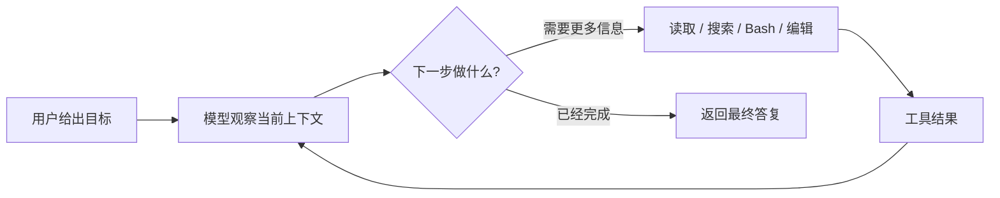
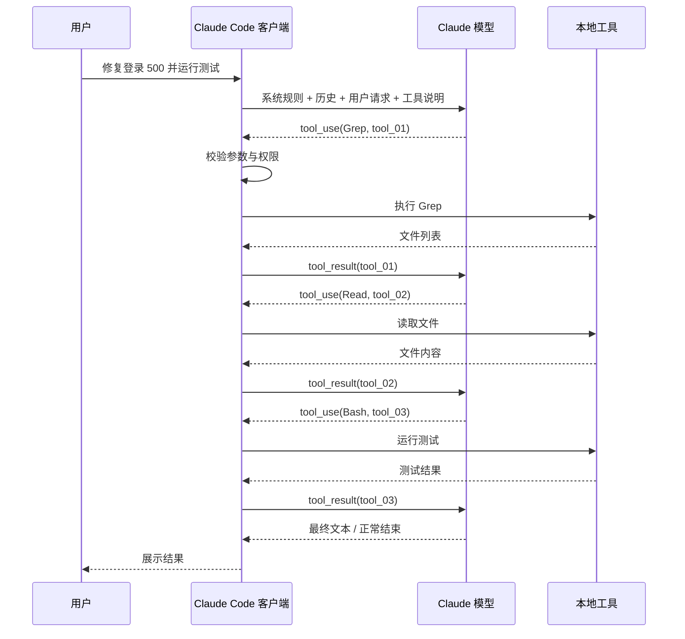
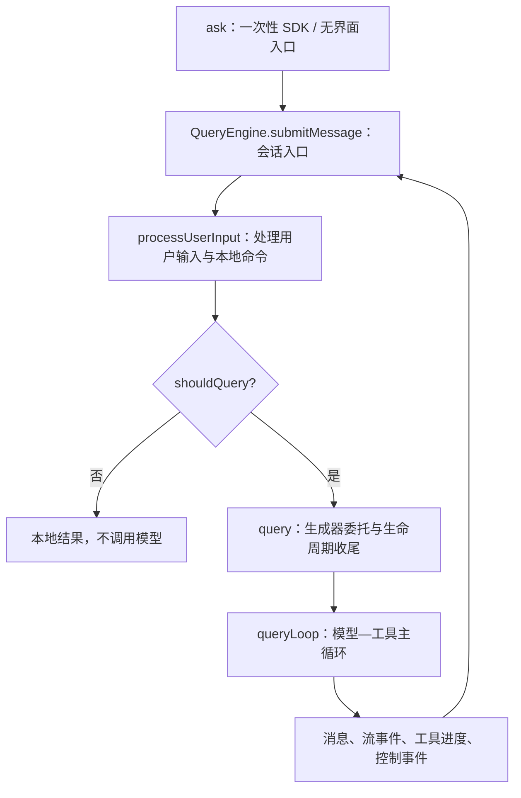

# Claude Code 源码拆解（一）：第一次认识 Agent——从“修复登录 500”看懂一次完整运行

> 本篇是 M01–M04 合并重构教材的第一部分。它不要求你提前懂 Claude Code、TypeScript 或 Agent 架构。
>
> **上一部分：** 无，这是入口篇。
>
> **下一部分：** `curriculum/units/M02/final.md`——契约、权限、`tool_use/tool_result` 与事件流。

## 这套教材怎么读

这套教材有两条阅读路线。

### 第一次阅读：只抓住主干

只读带有“主干”标记的内容。目标不是记源码名，而是先回答四个问题：

1. Claude Code 是什么；
2. 模型和客户端分别负责什么；
3. 一次任务为什么要循环多轮；
4. 系统怎样判断继续还是结束。

### 第二次阅读：再进入源码

读“源码映射”和“源码深挖”。这时再记住 `ask()`、`QueryEngine.submitMessage()`、`query()`、`queryLoop()` 等名称。

> **代码标记说明**
>
> - **[教学伪代码]**：帮助理解，不保证能在原仓库直接运行；
> - **[源码事实·简化]**：由当前快照支持，但为了教学省略了参数和分支；
> - **[Clean-room 实验]**：独立编写的可运行验证，不冒充 Claude Code 原实现；
> - **[企业设计迁移]**：从源码思想推导出的生产方案，不是原仓库目录结构。

---

# 一、先看 Claude Code 实际在做什么

假设你打开一个 Java 项目，在终端输入：

```text
帮我修复登录接口偶发的 500 错误，修复后运行测试。
```

如果 Claude Code 只是聊天机器人，它最多根据你的描述猜一个原因。

但真实的编程 Agent 会做出一连串动作：

```text
1. 查看项目目录
2. 搜索登录接口
3. 读取相关 Controller、Service 和异常日志
4. 运行测试复现问题
5. 根据报错继续读取代码
6. 修改文件
7. 再次运行测试
8. 向用户汇报修改结果
```

注意：这些步骤不是用户提前写死的流程。模型会根据每一轮看到的新信息，决定下一步做什么。



这就是 Agent 最基本的“感知—决策—行动—再感知”循环。

## 1. ChatBot、Copilot 和 Agent 的区别

| 类型 | 用户给什么 | 系统做什么 | 谁决定下一步 |
| --- | --- | --- | --- |
| ChatBot | 一个问题 | 返回一次回答 | 用户再次提问 |
| Copilot | 当前代码 | 预测局部补全 | 用户决定是否采用 |
| Agent | 一个目标 | 多轮读取、执行、修改和验证 | 模型结合系统规则决定 |

Agent 最重要的变化不是“回答更长”，而是它开始接触现实世界：文件、终端、Git、网络和外部工具。

一旦系统可以做真实操作，就不能只考虑模型聪不聪明，还要考虑：

- 模型给出的参数可靠吗；
- 哪些操作需要用户确认；
- 工具失败后能否继续；
- 用户取消后进程是否真的退出；
- 已经修改的状态怎样恢复；
- 我们怎样证明某条源码链路真的发生过。

这些围绕模型建立的约束、执行、恢复和观测设施，可以统称为 **Agent Harness**。你可以把它理解成给模型配套的方向盘、刹车、安全带和仪表盘。

---

# 二、Claude、Claude Code 和源码快照分别是什么

第一次读源码时，最容易把三个东西混在一起。

## 1. Claude 模型

Claude Opus、Sonnet 等是运行在服务端的大语言模型。模型负责：

- 理解输入；
- 结合上下文推理；
- 生成文字；
- 产生结构化工具调用请求。

模型本身不会直接打开你电脑上的文件，也不会自己启动本地进程。

## 2. Claude Code 客户端

Claude Code 是运行在用户环境中的编程 Agent 客户端。它负责：

- 收集用户输入和项目上下文；
- 调用模型 API；
- 把可用工具描述交给模型；
- 执行模型请求的本地工具；
- 管理权限、消息、取消、进度和持久化；
- 将执行结果重新交给模型。

可以先记住：

```text
模型负责“决定想做什么”
客户端负责“判断能不能做，并把动作安全地执行出来”
```

## 3. 本教材中的源码

本教材分析的是当前仓库保存的 Claude Code 客户端静态快照，不是 Claude 大模型源码。

快照可能缺少少量纯类型文件、测试或构建元数据。因此全文严格区分：

- 当前文件能直接证明的源码事实；
- 通过独立实验验证的语言行为；
- 为企业 Agent 平台提出的迁移设计。

看到一个教学代码块时，先看它上方的代码性质标签，不要默认每个符号都能在仓库中原样搜索到。

---

# 三、贯穿全文的任务：修复登录接口 500

后面三篇不再频繁更换例子。我们一直追踪同一个任务：

```text
用户：帮我修复登录接口偶发的 500 错误，修复后运行测试。
```

先不看源码，按慢动作把它拆成几轮。

## 第 1 轮：模型先要找到代码

客户端发给模型的内容可以抽象为：

```text
系统规则
+ 当前工作目录和项目环境
+ 可用工具说明
+ 历史消息
+ 用户当前请求
```

模型第一次不一定直接回答原因。它可能返回：

```json
{
  "type": "tool_use",
  "name": "Grep",
  "id": "tool_01",
  "input": {
    "pattern": "login",
    "path": "src"
  }
}
```

这里的 `tool_use` 意思是：

> 模型请求客户端执行一个工具。

模型只是产生结构化请求，并没有亲自搜索磁盘。

## 第 2 轮：客户端执行工具，把结果交还模型

客户端先检查参数和权限，再执行搜索。完成后，会构造与 `tool_01` 配对的结果：

```json
{
  "type": "tool_result",
  "tool_use_id": "tool_01",
  "content": "src/auth/LoginController.java\nsrc/auth/LoginService.java"
}
```

`tool_result` 的作用是告诉模型：

> 你上一轮请求的工具已经执行，这是结果。

一个 `tool_use` 通常必须有对应的 `tool_result`。即使工具失败，也应该返回带错误标记的结构化结果，而不是让消息历史里留下无人回应的工具请求。

## 第 3 轮：模型根据新信息继续行动

模型现在看到了搜索结果，可能继续请求读取 `LoginService.java`，再请求运行测试。每个工具结果都会加入消息历史，下一轮模型才能在已有事实基础上继续判断。

## 最后一轮：模型不再请求工具

当模型认为已经修复并验证完成，它返回普通文本并结束本轮，例如：

```text
已修复 LoginService 中空用户记录未检查导致的 500，相关测试已通过。
```

整个过程可以压成：



这是理解后续所有源码的地基。

---

# 四、先用人话理解主循环

主循环不是“模型自己在无限思考”，而是客户端反复完成五件事。

> **[教学伪代码]**

```ts
while (任务还没有结束) {
  const request = 准备本轮上下文()
  const response = await 调用模型(request)

  if (response 请求工具) {
    const result = await 校验并执行工具(response)
    把工具结果加入消息历史(result)
    continue
  }

  return response.最终文字
}
```

先记住五步：

```text
准备上下文
-> 调模型
-> 判断结果类型
-> 执行工具
-> 把结果放回历史并继续
```

## 1. 为什么 Demo 很短，生产代码却很长

正常路径可能两百行就能表达，但真实系统还要处理：

- 模型输入太长；
- 模型输出被截断；
- 工具参数不合法；
- 用户拒绝权限；
- 多个工具是否能并发；
- 工具执行到一半被取消；
- 网络流中断；
- 子进程没有真正退出；
- 已经写入的消息怎样保留；
- 最大轮数和预算怎样止损。

因此工业级主循环的大量代码不是让模型“更聪明”，而是让异常路径不会把整个会话拖垮。

## 2. Agent 怎么知道继续还是停止

在最简模型中：

```text
出现 tool_use -> 执行工具并继续
没有 tool_use，模型给出最终文本 -> 正常结束
```

真实业务还会有多种终止原因：

| 原因 | 含义 |
| --- | --- |
| completed / end turn | 模型正常结束 |
| max turns | 达到最大轮数，系统止损 |
| aborted | 用户或上层取消 |
| model error | 模型请求失败 |
| prompt too long | 输入超过上下文限制且无法恢复 |
| output recovery failed | 输出截断后多次续写仍失败 |
| hook prevented | 自定义治理规则阻止继续 |

所以“循环退出”不等于“任务成功”。外层必须拿到结构化终止原因，才能决定展示、恢复、重试或告警。

---

# 五、再把人话映射到源码名称

现在才进入源码。第一次阅读只要知道各层职责，不要求背行号。

```text
ask()
-> QueryEngine.submitMessage()
-> processUserInput()
-> query()
-> queryLoop()
```



## 1. `ask()`：一次性适配入口

**SDK** 是供其他程序调用的接口；**Headless** 指没有交互式终端界面，由脚本直接驱动。

> **[源码事实·简化]**

```ts
async function* ask(prompt) {
  const engine = new QueryEngine(config)

  try {
    yield* engine.submitMessage(prompt)
  } finally {
    // 把需要交回外部的缓存状态导出
  }
}
```

它的主要工作是装配依赖、创建 `QueryEngine`，再把本轮事件向外转发。

## 2. `QueryEngine`：跨多轮保存会话状态

`QueryEngine` 可以先理解为当前会话的“总账本”。它持有：

- 消息历史；
- 用量统计；
- 权限拒绝记录；
- 取消控制器；
- 文件读取缓存；
- 已加载的项目上下文。

后续每次用户继续提问，同一个会话需要看到前面发生过什么，因此这些状态不能只放在一次函数调用的局部变量里。

## 3. `processUserInput()`：不是所有输入都要调模型

Claude Code 还支持本地斜杠命令。**斜杠命令（slash command）** 是以 `/` 开头、可能由客户端直接处理的命令，例如帮助或本地控制命令。

> **[源码事实·简化]**

```ts
const processed = await processUserInput(prompt)

messages.push(...processed.messages)

if (!processed.shouldQuery) {
  return
}
```

这说明：源码中存在 `query()` 调用点，不代表每一种输入都会到达它。

## 4. `query()`：转发事件，也处理正常收尾

> **[源码事实·简化]**

```ts
const terminal = yield* queryLoop(params)
通知正常完成的命令生命周期()
return terminal
```

这里先不深挖 `yield*`。只要知道：`query()` 会把内层产生的事件继续交给外部，并在主循环正常返回后处理收尾。

## 5. `queryLoop()`：真正反复调用模型和工具

它负责：

1. 准备本轮消息；
2. 调用模型并接收流式事件；
3. 收集工具调用；
4. 执行工具；
5. 把结果放回消息；
6. 根据终止原因继续或返回。

到这里，你已经有了第一次阅读所需的完整地图。

---

# 六、第一次阅读只需要记住的十个词

| 词语 | 初学者解释 |
| --- | --- |
| Model | 服务端大模型，负责理解和决策 |
| Client | 本地 Claude Code 程序，负责执行与治理 |
| Message | 进入对话历史的一条结构化记录 |
| Tool | 客户端提供给模型使用的能力 |
| `tool_use` | 模型提出的工具执行请求 |
| `tool_result` | 客户端执行后交还模型的结果 |
| Turn | 一次模型调用及其产生的响应阶段 |
| Query | 一次需要模型参与的处理过程 |
| Event | 运行中逐步产生的消息或控制信息 |
| Terminal | 主循环最终返回的结构化结束原因 |

后面遇到 `payload`，把它理解为“传输的数据内容”；遇到 `Transcript`，把它理解为“可持久化的会话运行记录”；遇到 `owner`，把它理解为“谁真正持有并负责修改这份状态或资源”。

---

# 七、常见误解先纠正

| 错误理解 | 正确理解 |
| --- | --- |
| Claude 模型直接读取本地文件 | 模型产生 `tool_use`，客户端执行本地工具 |
| Agent 就是一个更长的聊天回答 | Agent 会围绕目标循环执行真实动作 |
| 工具调用失败就不需要返回结果 | 失败也应形成可配对的结构化 `tool_result` |
| 有 `query()` 调用点就一定会调用模型 | 还要看 `shouldQuery` 等运行条件 |
| 主循环退出就代表成功 | 还要区分 completed、abort、error、max turns 等原因 |
| 源码里的每个教学代码都能直接运行 | 必须区分源码简化、伪代码、实验和设计迁移 |

---

# 八、这一篇学完后，你应该能复述什么

不用背函数细节，用自己的话回答：

> Claude Code 不是 Claude 模型本身，而是运行在用户环境中的 Agent 客户端。用户给出目标后，客户端组装系统规则、历史和工具说明调用模型；模型可能返回普通文本，也可能返回 `tool_use`。客户端校验权限与参数、执行工具，再通过对应的 `tool_result` 把现实结果放回消息历史，模型基于新信息继续判断，直到正常结束或触发取消、错误、轮数上限等终止原因。源码里 `ask` 负责一次性装配，`QueryEngine` 保存会话状态，`processUserInput` 决定是否需要模型，`query` 管生成器委托和收尾，`queryLoop` 才是模型与工具反复交互的心脏。

如果这段话还不顺，先不要进入复杂异步语法，重新看“慢动作拆解”和时序图。

---

# 九、面试入门题

## 问题：Claude Code 和普通 ChatBot 最大的区别是什么？

**两分钟回答：**

> 普通 ChatBot 通常是用户问一次、模型答一次；Claude Code 是一个可以接触文件、终端和 Git 的编程 Agent。模型负责根据当前上下文决定下一步是回答还是请求工具，Claude Code 客户端负责校验参数和权限、执行本地工具、把结果作为 `tool_result` 放回消息历史，再次调用模型。一次任务因此可能循环很多轮。真正体现工业级能力的不是 while 循环本身，而是循环周围的消息契约、权限、状态、取消、错误恢复和可观测性。可以说模型决定能力上限，Harness 决定这套能力能不能安全稳定地落地。

**记忆锚点：** 模型决策、客户端执行、多轮循环、Harness 治理。

**常见失分回答：** “Claude Code 就是把大模型接到几个工具上。”这只描述了 Demo，没有说明安全执行和异常治理。

---

# 十、进入下一篇前的检查

请先确认自己能回答：

1. 模型为什么不能直接读取本地文件？
2. `tool_use` 和 `tool_result` 分别是谁产生的？
3. 工具结果为什么要重新加入消息历史？
4. `processUserInput()` 为什么可能让本轮完全不进入模型？
5. 主循环结束为什么不一定代表成功？

下一篇会沿着同一个登录 500 案例继续追问：

> 模型把工具参数写错了怎么办？为什么 TypeScript 类型不够？哪些工具能自动执行，哪些必须向用户确认？运行过程为什么不能只返回一个 `Promise<FinalAnswer>`？

**下一篇：** `curriculum/units/M02/final.md`
