# Claude Code 源码拆解：一个工业级 Agent 为什么不能只靠 `while (true)`

> M01–M04 合并重构版：从零认识 Agent，沿一次真实运行理解契约、事件流、资源生命周期与源码证据。

## 此页内容

- 一、Claude Code 到底是什么
- 二、敲下回车后，Agent 内部发生了什么
- 三、第一道缰绳：类型、校验与状态迁移
- 四、第二道缰绳：一次运行不是结果，而是一条事件流
- 五、第三道缰绳：`await` 之后还有资源生命周期
- 六、第四道缰绳：不要把代码里的连线当成真实调用
- 七、把四部分串起来：工业级 Agent Harness 的最小骨架
- 八、三个最值得亲手做的实验
- 九、资深 Agent 开发岗高频面试题
- 写在最后

---

大家好。

这几年 Agent 开发有一个很明显的变化：大家不再只盯着模型排行榜，而是开始讨论 **Harness Engineering**。

这个词听起来很新，其实意思很朴素：

> 模型像一匹能力很强、但行为不完全稳定的马；Harness 就是缰绳、围栏、刹车和仪表盘。

模型负责理解和决策，系统负责告诉它：

- 哪些数据是真的；
- 哪些工具可以调用；
- 哪些操作需要确认；
- 中途发生了什么；
- 用户取消后资源是否真的停止；
- 出错后哪些状态已经写入；
- 我们凭什么相信画出来的调用链。

很多初学者第一次写 Agent，会得到下面这段代码：

```ts
while (true) {
  const response = await callModel(messages)

  if (response.toolCalls.length === 0) {
    return response.text
  }

  const results = await runTools(response.toolCalls)
  messages.push(...results)
}
```

这段代码没有错。它甚至可以跑通一个不错的 Demo。

但它没有回答真正困难的问题：

- 模型返回的工具参数如果是错的，谁负责拦截？
- 两个工具同时修改一个文件怎么办？
- 模型正在输出时，工具进度怎样实时显示？
- 消费者不再读取事件，上游会不会继续往内存里塞？
- 用户按下 Ctrl+C，AbortSignal 触发是否就代表子进程已经退出？
- Query 中途失败，前面已经写入的消息会不会自动回滚？
- 文件 import 了某个函数，能不能证明本次请求真的调用了它？

Claude Code 值得学习的地方，不是它有一个 `while (true)`，而是它在这个循环周围修了大量“看起来不聪明，却决定系统能不能长期运行”的基础设施。

这篇文章把原来的 M01、M02、M03、M04 四个单元彻底打散并重新糅合。我们不再从 TypeScript 语法表开始，也不按文件目录逐个讲，而是从一名普通用户的一次操作出发，由浅入深看清四件事：

```text
契约：进入系统的东西可信吗？
过程：运行中发生的事情怎样被观察？
资源：取消和结束时，外部工作真的收敛了吗？
证据：我们怎样证明某条运行结论，而不是凭箭头讲故事？
```

文中会保留真正帮助理解的源码、流程图、边界和实验，但删掉重复的语法展开与过度细碎的代码。目标不是让你背下 51 万行源码，而是建立一套可以迁移到 Spring AI、LangGraph、Java Agent 平台和企业 RAG 系统的思考方式。

---

# 一、Claude Code 到底是什么

在看源码之前，先把最容易混淆的三个东西分开。

## 1. ChatBot、Copilot 和 Agent 有什么区别

ChatBot 的典型行为是：

```text
用户提问 -> 模型回答 -> 结束
```

Copilot 更像一次局部预测：

```text
当前代码 -> 预测接下来几行 -> 用户决定是否接受
```

Agent 不一样。你给它的往往不是一个问题，而是一个目标：

```text
“帮我定位这个 Bug，修复后运行测试。”
```

它需要自己决定：

1. 先读哪个文件；
2. 是否搜索相关符号；
3. 要不要执行测试；
4. 测试失败后继续读什么；
5. 修改哪些代码；
6. 什么时候已经完成，可以停下来。

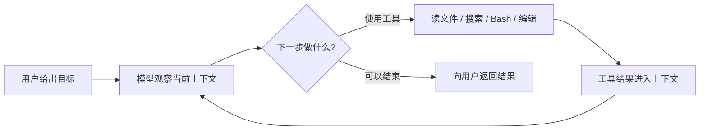

Agent 的核心因此不是“会聊天”，而是一个持续的 **感知—决策—行动—再感知** 循环。

## 2. 为什么 Agent 比普通聊天系统难得多

聊天系统主要管理输入和输出。

Agent 还要管理：

- 消息历史；
- 工具定义和工具参数；
- 权限与危险操作；
- 模型和工具的流式事件；
- 子进程、网络流和定时器；
- 取消、超时和后台任务；
- Transcript 与恢复；
- 运行状态、用量和错误；
- 调用链与可观测证据。

因此，一个 Agent 的可靠性并不只取决于模型。

可以把它理解成一辆车：

| 部分 | 在 Agent 中对应什么 |
| --- | --- |
| 发动机 | 大模型推理能力 |
| 方向盘 | Prompt、工具描述和任务目标 |
| 变速箱 | Query / Tool-Use Loop |
| 刹车 | 权限、取消、超时和轮数限制 |
| 安全带 | 运行时校验、状态迁移与恢复 |
| 仪表盘 | Event、Trace、Transcript 和指标 |

只换一台更强的发动机，并不会自动得到一辆能安全上路的车。

---

# 二、敲下回车后，Agent 内部发生了什么

现在从一个最普通的场景开始。

你在终端输入：

```text
帮我修复登录接口偶发的 500 错误，并运行测试。
```

很多人会把内部过程想成：

```text
用户输入 -> 调用大模型 -> 返回答案
```

真实情况更接近下面这条链：

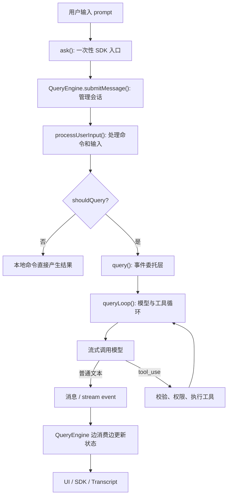

这张图暂时不要求你记函数名，先看职责。

## 1. `ask()`：一次调用的外包装

`ask()` 适合 SDK 或 Headless 场景。它创建一个 `QueryEngine`，把配置、工具、权限回调、状态读写器和初始消息交给它，然后把 `submitMessage()` 产生的事件继续向外传。

简化后像这样：

```ts
async function* ask(prompt: string) {
  const engine = new QueryEngine(config)

  try {
    yield* engine.submitMessage(prompt)
  } finally {
    saveReadFileState(engine.getReadFileState())
  }
}
```

这里已经埋下两个后文会讲的重要点：

- `yield*` 不是普通函数调用，它会转发一串事件；
- `finally` 只能证明清理或交接逻辑被执行，不能自动证明所有网络请求和子进程都已经停止。

## 2. `QueryEngine`：会话状态的所有者

`QueryEngine` 不只负责“调一次模型”。它持有一段会话会跨轮使用的状态，例如：

- `mutableMessages`：累计消息；
- `abortController`：取消入口；
- `permissionDenials`：权限拒绝记录；
- `totalUsage`：累计用量；
- `readFileState`：文件读取状态；
- 已发现的 Skill 和 Memory 路径。

它更像一名会话管家：

> Query 负责产生过程，QueryEngine 负责把过程沉淀成会话状态和对外结果。

## 3. 不是每条输入都会调用模型

`submitMessage()` 会先运行 `processUserInput()`。这个阶段可能识别本地 slash command，并返回一个 `shouldQuery` 标志。

```ts
const processed = await processUserInput(...)

this.mutableMessages.push(...processed.messages)
const messages = [...this.mutableMessages]

if (!processed.shouldQuery) {
  // 返回本地命令结果
  return
}

for await (const message of query({ messages, ... })) {
  // 消费模型与工具产生的事件
}
```

这个顺序非常值得注意：

```text
shouldQuery = false
```

只代表“不进入模型 Query”，不代表“什么都没发生”。用户输入可能已经被解析、追加到消息、写入 Transcript，并产生本地结果。

这也是后面“不要把连线当调用”的第一个例子：代码里存在 `query()` 调用点，不代表每次 `submitMessage()` 都会走到它。

## 4. Query 不是一次返回一个大对象

`QueryEngine` 使用：

```ts
for await (const message of query(...)) {
  // 每来一个事件，就立即处理一个事件
}
```

因此，模型的一小段文本、工具进度、assistant 消息、usage 更新和控制事件，都可以在整轮结束前被处理。

接下来四章要解释的，其实就是这条完整链路周围的四道缰绳。

---

# 三、第一道缰绳：类型、校验与状态迁移

很多 TypeScript 初学者会说：

> “我们用了 TypeScript，所以模型返回的数据是安全的。”

这句话只对了一半。

TypeScript 能检查开发者写的 TypeScript 代码，但模型 JSON、磁盘文件、网络 payload 并没有参加你的 `tsc` 编译。

一个工业级 Agent 至少需要三道门：

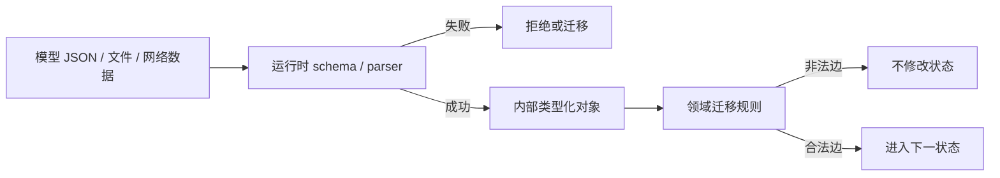

| 层次 | 回答的问题 | 常见实现 |
| --- | --- | --- |
| 编译期类型 | 内部代码允许构造和访问什么 | 联合、泛型、readonly、sealed hierarchy |
| 运行时校验 | 外部数据实际上是什么 | Zod、JSON Schema、Pydantic、Bean Validation |
| 状态迁移 | 当前状态能不能变成目标状态 | transition function、状态机、CAS、事务 |

## 1. 类型不是注释，但也不是防火墙

例如：

```ts
type RunStatus = 'pending' | 'running' | 'completed'
```

编译器会拒绝：

```ts
const status: RunStatus = 'sleeping'
```

但运行后的 JavaScript 中，这个类型已经被擦除了。

如果磁盘 JSON 写着：

```json
{ "status": "sleeping" }
```

`JSON.parse()` 不会因为你定义过 `RunStatus` 就自动报错。

真正的运行边界必须执行：

```ts
const RunStatusSchema = z.enum(['pending', 'running', 'completed'])
const result = RunStatusSchema.safeParse(raw.status)
```

所以准确说法是：

> 类型约束系统内部的开发行为；Schema 检查进入系统的现实数据。

## 2. 同名类型，不一定属于同一个世界

Claude Code 快照里有两套 `TaskStatus`。

第一套位于 `src/Task.ts`，表示运行任务：

```text
pending / running / completed / failed / killed
```

第二套位于 `src/utils/tasks.ts`，表示协作任务清单：

```text
pending / in_progress / completed
```

它们名字相同，却属于两个不同领域：

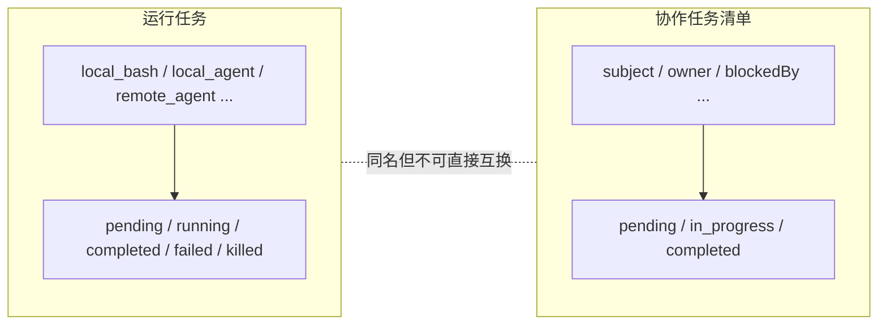

这给出一条非常实用的源码阅读纪律：

> 类型名只是线索，模块路径、生产者、消费者和校验器共同决定语义。

企业项目里，最好直接使用更明确的名字：

```text
RuntimeTaskStatus
WorkItemStatus
```

不要因为两个领域都出现 `completed`，就用字符串直接映射。

## 3. 判别联合为什么特别适合 Agent

Agent 系统中有很多“看起来都是消息，实际上行为完全不同”的对象：

```ts
type Message =
  | { type: 'user'; content: string }
  | { type: 'assistant'; content: string }
  | { type: 'progress'; percent: number }
  | { type: 'system'; text: string }
```

`type` 是判别字段。

当代码进入：

```ts
if (message.type === 'progress') {
  renderProgress(message.percent)
}
```

TypeScript 才知道这里可以访问 `percent`。

它带来的价值不是“少写几个类型转换”，而是把控制流和数据形状绑定在一起：

- 新增消息类型时，哪些消费者必须修改；
- 某个分支能访问哪些字段；
- 哪些事件需要持久化；
- 哪些事件只用于 UI；
- 哪些失败是普通事件，哪些会终止迭代器。

不过要注意：同一系统不一定只有一份“宇宙 Message”。持久化消息、模型 content block、SDK 输出和 UI 渲染对象可以是不同的联合视图。

## 4. Tool 泛型解决一致性，Schema 解决真实性

真实 Tool 类型的核心思想可以缩成：

```ts
type Tool<InputSchema, Output, Progress> = {
  inputSchema: InputSchema
  call(input: Infer<InputSchema>): Promise<ToolResult<Output>>
  isReadOnly(input: Infer<InputSchema>): boolean
  isConcurrencySafe(input: Infer<InputSchema>): boolean
}
```

同一份 `InputSchema` 同时影响：

- 工具执行参数；
- 工具描述；
- 权限判断；
- 是否只读；
- 是否可并发；
- 是否危险。

这比每个函数各写一套相似的参数接口可靠得多。

但模型传回来的仍然只是现实世界中的 JSON，所以执行前必须先做：

```text
模型 tool input
-> inputSchema.safeParse
-> 类型化 input
-> 权限与能力判断
-> call(input)
-> ToolResult
```

泛型和 Schema 缺一不可：

- 只有泛型：挡不住模型和磁盘里的错误数据；
- 只有 Schema：内部调用点之间缺少一致性传播。

## 5. 状态值合法，不代表状态变化合法

下面两个值都合法：

```text
running
completed
```

但这不代表允许：

```text
completed -> running
```

联合类型只能回答“右边是不是合法值”，不能回答“当前能不能走到右边”。

因此生产系统通常需要集中迁移规则：

```ts
const transitions = {
  pending: ['running'],
  running: ['completed', 'failed', 'cancelled'],
  completed: [],
  failed: [],
  cancelled: [],
} as const
```

分布式环境还要再补：

- 版本号；
- compare-and-set；
- 数据库条件更新；
- 幂等事件；
- 重复消费与恢复策略。

### 本章小结

第一道缰绳可以压成三句话：

1. **内部代码靠类型保持一致。**
2. **外部数据靠运行时校验进入系统。**
3. **状态变化靠迁移规则守住时间顺序。**

这三层混在一起，是初学者最常见的设计错误。

---

# 四、第二道缰绳：一次运行不是结果，而是一条事件流

理解了“什么数据可以进入系统”，下一个问题是：

> 一次可能持续几十秒、甚至几分钟的 Agent 运行，应该怎样交付给调用方？

## 1. `Promise` 只能交付一次完成

普通异步函数：

```ts
async function runAgent(): Promise<FinalAnswer> {
  // 很久以后
  return answer
}
```

调用方只能知道：

```text
还没完成 / 已完成 / 失败
```

但真实 Agent 过程里还会出现：

- 模型文本 delta；
- assistant 消息；
- 工具开始；
- 工具进度；
- 权限请求；
- 工具结果；
- 重试提示；
- 上下文压缩边界；
- 用量更新；
- 取消与终止原因。

因此 Claude Code 大量使用 `AsyncGenerator` 和 `AsyncIterable`。

## 2. 先用水龙头理解异步生成器

`Promise` 像一桶水：接满以后一次性交给你。

`AsyncGenerator` 像水龙头：消费者每次请求一点，生产者运行到一个 `yield` 就暂停。

```ts
async function* events() {
  yield { type: 'run.started' }
  yield { type: 'model.delta', text: '正在检查...' }
  yield { type: 'tool.progress', percent: 50 }
  return { reason: 'completed' }
}
```

第一次调用生成器函数，只创建 iterator；第一次 `.next()` 才真正进入函数体。

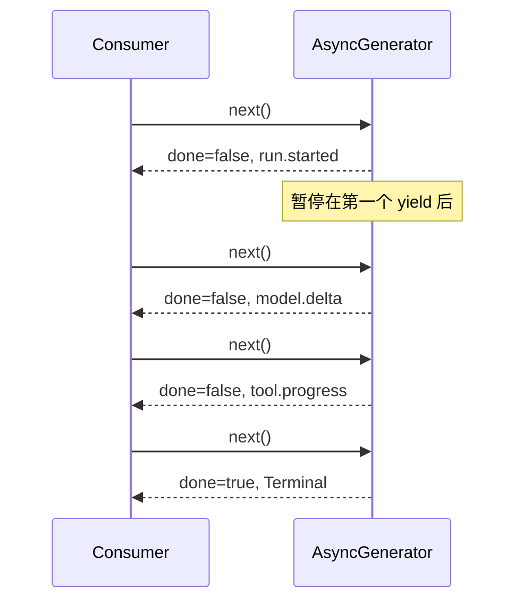

## 3. `yield*` 与 `for await` 解决的不是同一件事

Claude Code 的 `query()` 类似：

```ts
async function* query(params) {
  const terminal = yield* queryLoop(params)
  notifyCompletedCommands()
  return terminal
}
```

`yield*` 是生成器之间的委托，它做两件事：

1. 把 `queryLoop()` yield 的每个事件原样向外转发；
2. 子生成器正常 `return` 时，取得它的终值。

而 `QueryEngine` 使用：

```ts
for await (const message of query(...)) {
  consume(message)
}
```

`for await` 只消费 `yield` 出来的值。循环自然结束时，语法没有变量接收生成器的 `return value`。

因此要区分两份协议：

```text
Event：运行过程中发生了什么
Terminal：生成器最终为什么结束
```

跨语言系统更适合把关键完成状态设计成显式事件，因为 Python async generator 不允许携带 TypeScript 那样的 return value。

## 4. 为什么 QueryEngine 要边消费边更新状态

每个 Query event 到达后，QueryEngine 可以立即完成不同副作用：

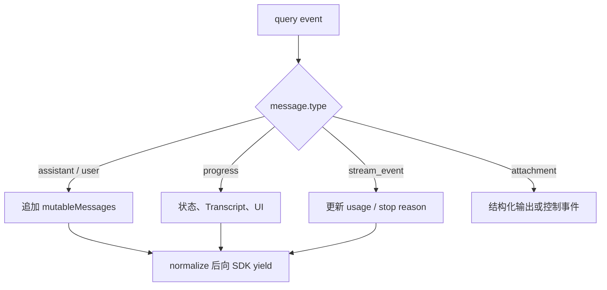

如果把 Query 改成：

```ts
await query(): Promise<Message[]>
```

那么 UI、Transcript 和用量统计都只能在整轮结束后批量处理。长工具运行期间，系统就失去了中间观测点。

## 5. 流式不等于没有缓冲

这是一个非常重要的边界：

```text
AsyncIterable != 网络流
AsyncIterable != 无界安全
AsyncIterable != 自动背压
```

一个对象可以对外提供 AsyncIterable 接口，内部却维护一个数组：

```ts
class PushQueue<T> {
  private queue: T[] = []

  enqueue(value: T) {
    this.queue.push(value)
  }

  async next() {
    return this.queue.shift()
  }
}
```

如果生产者每秒写入 10,000 个 token chunk，而消费者每秒只读取 100 个，数组仍然会持续增长并最终 OOM。

Claude Code 的工具执行器也会缓存 pending progress 和 results，再由 Query Loop drain。

所以设计流协议时，要明确：

- 队列上限；
- 满时阻塞、合并、丢弃还是失败；
- token delta 是否可以合并；
- progress 是否只保留最新值；
- tool result 是否必须可靠交付；
- 多个消费者怎样 fan-out，而不是竞争同一个 iterator。

## 6. 错误有两条通道

Agent 流里的错误不能全部画成一根红线。

第一种是异常：

```ts
throw new Error('network failed')
```

它会让消费者等待的 `.next()` reject，通常表示当前事件流无法继续。

第二种是错误事件：

```ts
yield {
  type: 'tool_result',
  is_error: true,
  content: 'permission denied',
}
```

对迭代器来说，它仍是一个普通值。模型或业务策略可以看到它以后继续决策。

可以概括为：

```text
不可继续的协议或运行时失败 -> throw
可以被模型、用户或策略处理的业务失败 -> 结构化 event
```

## 7. 已经发生的事件不会因为后续异常自动回滚

假设 Query 先 yield 一条 assistant 消息，QueryEngine 已经：

- push 到 `mutableMessages`；
- 写入 Transcript；
- 向 SDK 用户显示。

下一次 `.next()` 才抛异常。

前面的副作用不会自动撤销。AsyncGenerator 不是数据库事务。

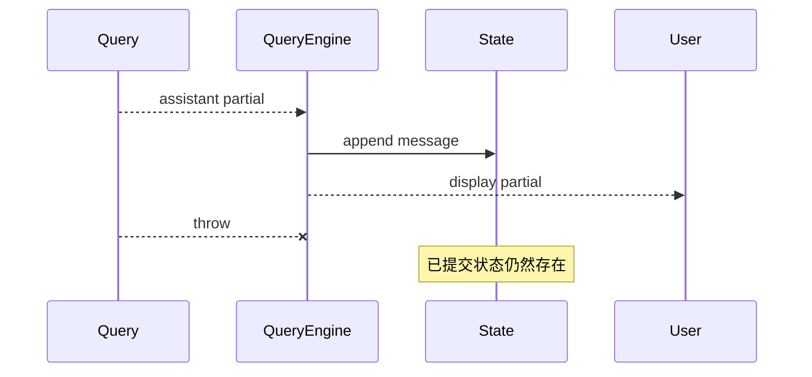

企业系统要为部分失败明确选择：

- 接受 append-only 历史，并记录失败边界；
- 对可逆状态做补偿；
- 对外部 Tool 副作用使用幂等键或 Saga；
- 用 checkpoint 定义恢复点。

### 本章小结

第二道缰绳的核心是：

> Agent 首先是一段过程，其次才是一个结果。

过程需要事件、顺序、缓冲、完成、错误和关闭协议。只说“我们支持流式输出”远远不够。

---

# 五、第三道缰绳：`await` 之后还有资源生命周期

到这里，很多人已经能解释异步生成器，却仍然会在取消和子进程上犯错。

最典型的误解是：

> “调用 `abort()` 以后，`await` 抛异常了，所以工作已经停止。”

不一定。

## 1. `await` 只暂停当前函数

看起来是一行：

```ts
const result = await exec(command, signal)
```

背后可能同时存在：

- child process；
- stdout/stderr；
- 输出文件；
- progress poller；
- timeout timer；
- AbortSignal listener；
- Promise continuation；
- background task owner。

`await` 暂停的是当前 async function，不是整个 Node 进程。

可以先建立一个够用的事件循环模型：

```text
当前同步调用栈
-> Promise / microtask continuation
-> timer、I/O、child-process 等宿主回调
```

它不是要你死背 Node phases，而是提醒你：

> 状态在哪一个 continuation 被修改，会决定其他调用方什么时候看见它。

## 2. 一条 Bash 命令有多个所有者

Claude Code 的 Bash 路径可以简化为：

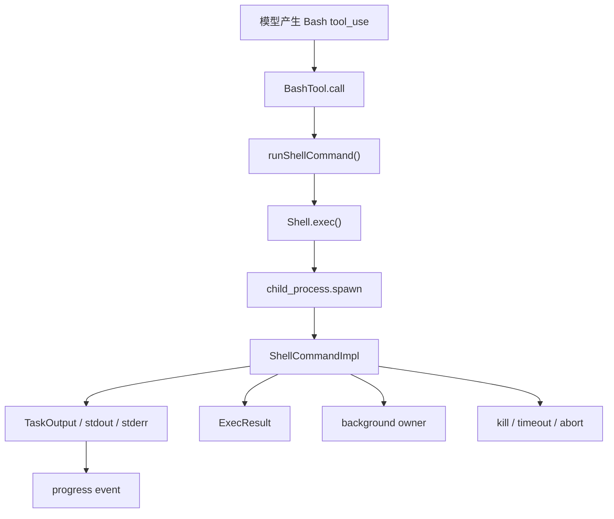

几个对象各管一段生命周期：

| 对象 | 主要责任 |
| --- | --- |
| `Shell.exec()` | spawn 前装配、cwd、环境和输出模式 |
| `ShellCommandImpl` | child、timeout、abort listener、状态和 result |
| `TaskOutput` | 输出存储、预览和 progress |
| `runShellCommand()` | 前台等待、progress yield、后台转换 |

把所有逻辑塞进一个 `runBash()` 大函数，最容易造成重复清理、无人清理和所有权转移不清。

## 3. 默认输出不一定经过 `child.stdout`

很多人看到 `spawn` 会自动画：

```text
child.stdout -> data event -> UI
```

但 Claude Code 的默认 Bash 路径可以把 stdout 和 stderr 指向同一个输出文件，由 `TaskOutput` 定期读取文件尾部生成进度。

只有需要实时 callback 的场景才使用 pipe mode：

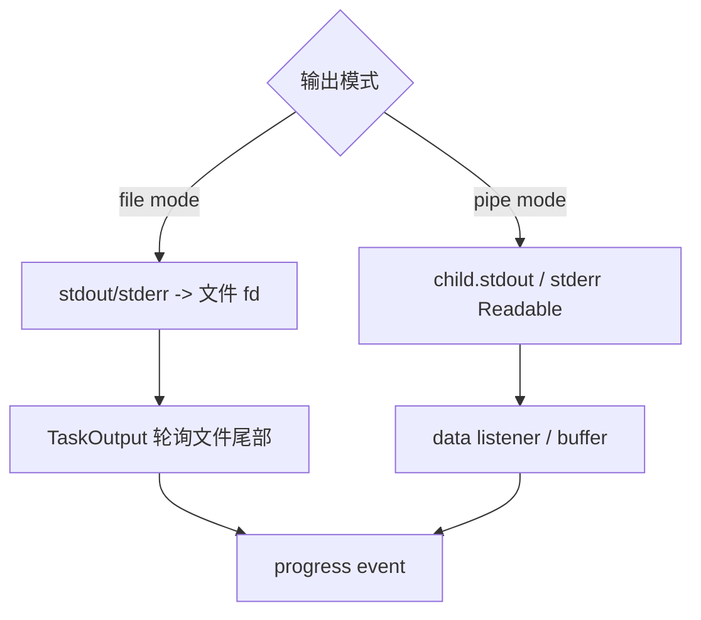

file mode 的好处是大输出不必全部驻留 JS heap，也便于后台任务继续写入；代价是要处理文件轮询、大小 watchdog 和平台 fd 语义。

这说明：不要看到抽象名叫 “Stream”，就想当然认为底层一定是一条 Node Readable。

## 4. timeout、abort、kill、background 必须是四个动词

| 词 | 真正含义 | child 是否一定停止 |
| --- | --- | --- |
| timeout | 前台预算耗尽 | 不一定，可能转后台 |
| abort | 发出取消通知和 reason | 不一定，取决于 listener |
| kill | 请求终止进程或进程树 | 请求发出也不等于已确认退出 |
| background | 把运行所有权交给后台任务 | 不停止，child 继续 |

Claude Code 对某些 `interrupt` reason 不立即 kill，而是给上层转后台的机会。对其他取消原因才进入 kill 路径。

因此不能用一个布尔字段：

```ts
cancelled: true
```

覆盖所有语义。

更稳健的领域事件是：

```text
CancelRequested
TerminationSent
ExitConfirmed
BackgroundOwnershipTransferred
CleanupFinished
```

## 5. AbortSignal 是通知，不是强杀 API

`AbortController.abort(reason)` 会：

- 把 signal 设为 aborted；
- 保存 reason；
- 通知 listeners。

真正动作必须由资源所有者实现：

```text
模型请求 owner -> abort HTTP request
子进程 owner -> terminate / tree-kill
Readable owner -> destroy stream
timer owner -> clearTimeout
工具 owner -> discard or cancel
```

因此：

```text
signal.aborted = true
```

只能证明取消通知已发出，不能证明：

- socket 已关闭；
- child 已退出；
- 孙进程已停止；
- fd 已释放；
- 工具 promise 已 settled。

## 6. 请求终止与确认退出是两个时刻

某些实现为了让上层快速结束，会在发出 tree-kill 后立即 resolve 一个逻辑结果，而不等待真正的 OS `exit` 事件。

这种设计不是错，但协议必须说清楚：

```text
result resolved = 逻辑上不再等待
```

不一定等于：

```text
process tree fully exited = 操作系统资源已经确认收敛
```

安全要求较高的工具执行平台，应该在释放配额、删除临时目录或复用工作区之前等待更强的确认。

## 7. `Promise.race` 不会取消输家

```ts
await Promise.race([
  command.result,
  timeoutPromise,
])
```

只表示调用方先观察到谁完成。

如果 timeout 赢了：

- command 仍然可能运行；
- 网络请求仍然可能发送数据；
- timer/listener 仍然需要清理；
- 还需要显式 abort、kill 或 ownership transfer。

所以可靠 timeout 是四件事：

```text
deadline
-> 触发取消动作
-> 等待有限确认
-> cleanup timer/listener
```

## 8. cleanup 与 cancel 不能互换

cleanup 通常负责：

- 移除 listener；
- 清 timer；
- 释放引用；
- 关闭 buffer 或 poller。

它不一定负责终止仍在运行的 child。

如果先 cleanup，再丢掉一个仍然运行的 child handle，就制造了孤儿资源。

合理顺序通常是：

```text
请求停止
-> 等待或升级终止
-> 确认所有权转移或退出
-> cleanup
```

## 9. graceful shutdown 必须有预算

服务退出时有两个极端都不对：

- 无限等待所有资源完美结束：部署和故障恢复会卡死；
- 直接 `process.exit()`：可能丢 Transcript、破坏终端状态、留下外部工作。

Claude Code 的思路是分层预算：

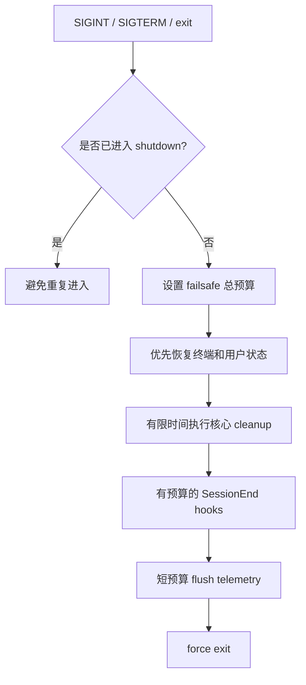

企业 Agent 服务也应该按价值排序：

1. 停止接收新任务；
2. 持久化 run/checkpoint 与幂等状态；
3. 取消模型和工具；
4. 等待有限确认并升级强杀；
5. 尽力 flush 次要 telemetry；
6. 到达总预算后退出。

### 本章小结

第三道缰绳可以压成一句话：

> 取消是意图，终止是动作，退出是事实，清理是收尾；四者不是同一个事件。

---

# 六、第四道缰绳：不要把代码里的连线当成真实调用

我们已经知道系统有什么契约、过程和资源。最后一个问题是：

> 你怎样证明自己对源码的解释是真的？

很多源码文章最大的风险，不是漏掉细节，而是把“结构上相关”悄悄升级成“运行时一定发生”。

## 1. 源码里的关系不是一种关系

假设工具给你四条边：

```text
QueryEngine imports query
QueryEngine contains submitMessage
submitMessage calls query
submitMessage indirect_call tool
```

它们支持的结论完全不同：

| 关系 | 最多能证明什么 |
| --- | --- |
| import | 模块绑定或类型可见 |
| contains | 方法属于这个类或文件 |
| call site | 某条代码路径可以调用目标 |
| callback injection | 运行时会调用某个协议，具体实现由装配决定 |
| state mutation | 某个 owner 的字段确实被修改 |
| runtime trace | 这一次输入实际走过该路径 |

因此可靠的证据链应该逐层增强：

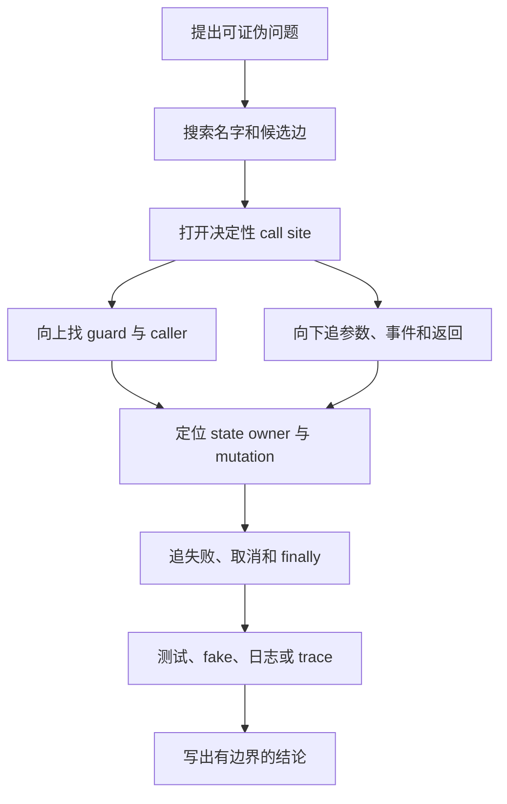

## 2. import 了 `query`，不代表每次都调用

`QueryEngine.ts` 确实 import 了 `query`，也存在真实调用点：

```ts
for await (const message of query({...})) {
  // 消费事件
}
```

但要回答“每条输入是否都会调用”，还必须向上找到：

```ts
if (!shouldQuery) {
  return
}
```

所以准确结论是：

> `submitMessage()` 包含真实 Query 调用点，但本次是否到达由 `processUserInput()` 返回的 `shouldQuery` 决定。

“存在边”和“这次走边”是两个问题。

## 3. 参数里出现一个对象，不代表调用了它

下面代码调用的是 `canUseTool`：

```ts
const result = await canUseTool(
  tool,
  input,
  context,
)
```

`tool` 在这里是参数。

它不等于：

```ts
tool()
```

也不等于：

```ts
tool.run()
```

静态图工具可能因为符号邻接推断出“间接调用”，但源码回读可以直接否定这个候选。

这条纪律对 Agent 源码尤其重要，因为 Tool、Model Adapter、Hook 和 Permission Policy 经常以函数或对象形式被注入。

## 4. 找到 state owner，比列出函数名更重要

源码追踪如果只得到：

```text
ask -> submitMessage -> query
```

你还不能解释：

- 失败后消息留在哪里；
- 下一轮能看到什么；
- 哪个字段跨 turn 保留；
- 哪些状态只属于当前调用；
- 并发时谁会发生竞争。

例如：

```ts
this.mutableMessages.push(...messagesFromUserInput)
const messages = [...this.mutableMessages]
```

这两行创建了两个不同层次：

- `mutableMessages`：长期 owner store；
- `messages`：当前 turn 的浅快照容器。

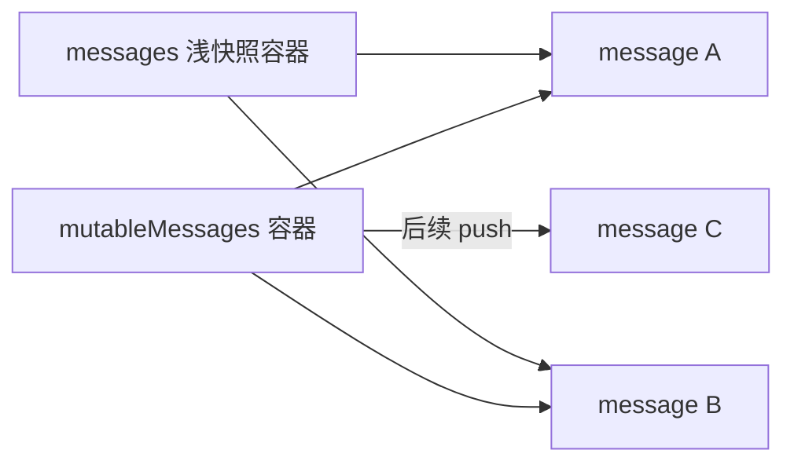

两个数组容器分离，但原有元素对象仍可能共享引用。

看到复制时，要问：

- 新容器还是深拷贝？
- 后续 push 改的是哪个数组？
- 元素是否可能原地修改？
- Query 收到的是长期 store，还是某一时刻的请求投影？

## 5. 调用发生，不等于状态已经更新

即使已经进入 `query()`，每个 event 还要经过 QueryEngine 的消费分支。

不同类型可能：

- 追加长期消息；
- 写 Transcript；
- 更新 usage；
- 只向 SDK yield；
- 触发结构化输出；
- 作为控制信号被跳过。

所以完整描述不是：

```text
query 返回消息
```

而是：

```text
query 产生事件
-> consumer 按类型分支
-> 修改特定 owner
-> 选择是否持久化
-> 选择是否对外输出
```

## 6. 失败不是自动事务回滚

如果事件先被消费并写入状态，下一次迭代才失败，前面的 mutation 仍可能保留。

追踪异常路径时，要逐项寻找：

- rollback；
- compensation；
- retry；
- missing tool result 修复；
- checkpoint；
- append-only failure boundary。

如果源码没有这些机制，就不能因为最外层请求失败而假定内部状态恢复到了调用前。

## 7. Graph、测试和 Trace 各自回答不同问题

| 工具 | 主要回答 |
| --- | --- |
| AST / Graphify / IDE | 哪些结构可能相关 |
| 源码回读 | 代码在什么条件下做什么 |
| 契约测试 | 给定输入必须满足哪些不变量 |
| Runtime Trace | 这一次运行实际发生了什么 |

不要让它们互相冒充：

- 静态图不能直接代表生产调用率；
- 一次 Trace 不能代表所有分支；
- clean-room 实验不能冒充原项目官方测试；
- 注释描述的未来愿景不能冒充当前调用路径。

最有价值的测试往往不是“最终有两条消息”，而是记录过程：

```text
call.entered
state.mutated(owner=conversation, field=messages)
view.snapshotted
branch.skipped(reason=local_command)
event.yielded(type=assistant)
call.failed
```

它让“我看懂了”变成一个可以被反驳的结论。

### 本章小结

第四道缰绳的核心是：

> 先把箭头分类，再讨论箭头代表什么；先找 owner 和 mutation，再讨论失败后留下什么。

---

# 七、把四部分串起来：工业级 Agent Harness 的最小骨架

现在把整篇文章收拢。

一次可靠 Agent 运行至少经过四层治理：

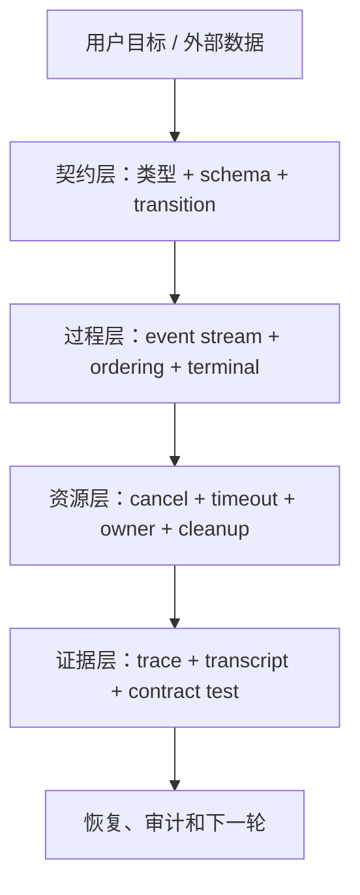

## 1. 契约层：什么可以进入系统

它负责：

- 消息和工具输入的运行时校验；
- 内部判别联合与泛型传播；
- 状态合法值与迁移规则；
- 旧版本数据迁移；
- 权限和安全属性。

核心原则：

> 外部一律先当 `unknown`，验证后再进入领域。

## 2. 过程层：运行中发生了什么

它负责：

- 模型 delta；
- assistant 与 user 消息；
- 工具进度与结果；
- completion、error 和 cancellation；
- 事件顺序与缓冲策略；
- 单写者消费和多订阅者 fan-out。

核心原则：

> 先设计事件协议，再选择 AsyncGenerator、Flux、SSE 或消息队列。

## 3. 资源层：谁持有现实世界的工作

它负责：

- HTTP request；
- Node Readable；
- child process；
- timer 和 listener；
- 临时文件；
- background task；
- shutdown budget。

核心原则：

> 每个资源必须有唯一 owner；取消必须从意图传播到动作，再到确认。

## 4. 证据层：怎样知道系统真的如此运行

它负责：

- Transcript；
- TraceEvent；
- state mutation；
- runtime span；
- 契约测试；
- 失败注入；
- 源码位置与版本边界。

核心原则：

> 静态关系、运行事实、测试不变量和设计推断必须分开标记。

## 5. 一个可迁移到企业项目的最小结构

```text
AgentRun
├── ConversationState       # 长期消息与 checkpoint
├── RequestProjection       # 当前轮发给模型的视图
├── EventDispatcher         # 唯一消费模型/工具事件
├── ToolRegistry            # schema、权限、并发与执行
├── CancellationScope       # one-shot reason 与 deadline
├── ResourceScope           # 模型流、子进程、timer、listener
├── TransitionService       # 运行状态合法迁移
├── TranscriptStore         # 可恢复的持久记录
└── TraceSink               # 不阻断主流程的结构化观测
```

对 Spring / Java 项目，可以映射为：

```text
Controller DTO
-> Bean Validation / JSON Schema
-> AgentRunService
-> Flux<AgentEvent>
-> ToolExecutor / ProcessAdapter
-> RunStateRepository(CAS / transaction)
-> Transcript + OpenTelemetry
```

对 LangGraph 项目，要额外回答：

- State 里保存外部 DTO 还是领域对象？
- reducer 是否保持不变量？
- conditional edge 本次是否真的走过？
- 节点内部启动的资源由谁持有？
- graph cancel 怎样到达模型、工具和子进程？
- checkpoint 在哪一个事件后提交？

框架提供容器，不替你定义这些答案。

---

# 八、三个最值得亲手做的实验

原四章包含大量 clean-room 实验。对初学者来说，不需要一次做完所有实验。下面三个实验足以建立最关键的直觉。

## 实验一：类型断言不是运行时校验

目标：观察错误 Tool input 怎样越过错误边界。

先写安全版本：

```ts
type WeatherInput = { city: string }

function parseWeatherInput(value: unknown): WeatherInput {
  if (
    typeof value !== 'object' ||
    value === null ||
    typeof (value as Record<string, unknown>).city !== 'string'
  ) {
    throw new Error('invalid weather input')
  }

  return value as WeatherInput
}
```

测试：

```ts
parseWeatherInput({ city: 'Beijing' }) // 通过
parseWeatherInput({ city: 42 })        // 拒绝
```

然后破坏它：

```ts
function parseWeatherInput(value: unknown): WeatherInput {
  return value as WeatherInput
}
```

再次传入 `{ city: 42 }`。

你会看到：`as` 没有执行任何验证，只是让编译器停止怀疑。

**你应该得到的结论：**

```text
类型断言改变编译器视角，不改变现实数据。
```

## 实验二：流关闭不等于外部资源关闭

```ts
async function* stream(trace: string[]) {
  const timer = setInterval(() => trace.push('timer.tick'), 10)

  try {
    yield 'first'
    yield 'second'
  } finally {
    trace.push('generator.finally')
    // 故意不 clearInterval(timer)
  }
}
```

消费者读取第一个事件后 `break`：

```ts
for await (const event of stream(trace)) {
  console.log(event)
  break
}
```

你会看到 `generator.finally` 执行，但 timer 仍然继续产生 tick。

然后在 `finally` 中加入：

```ts
clearInterval(timer)
```

**你应该得到的结论：**

```text
生成器退出只是控制流事实；外部资源是否停止取决于显式 disposer。
```

## 实验三：证明“不调用”比证明“存在调用点”更难

写一个可计数 fake：

```ts
let queryCalls = 0

async function processInput(prompt: string) {
  return {
    messages: [{ type: 'user', content: prompt }],
    shouldQuery: !prompt.startsWith('/'),
  }
}

async function submitMessage(prompt: string) {
  const processed = await processInput(prompt)

  if (!processed.shouldQuery) {
    return 'local result'
  }

  queryCalls += 1
  return 'model result'
}
```

运行：

```ts
await submitMessage('/help')
console.assert(queryCalls === 0)

await submitMessage('fix bug')
console.assert(queryCalls === 1)
```

**你应该得到的结论：**

```text
源码中有调用点，只能证明“可能调用”；
执行完整分支并观察计数，才能证明某个输入“没有调用”。
```

## 实验报告统一写四句话

每次实验都不要只写“测试通过”。固定回答：

1. 我原来预测什么？
2. 实际观察到什么？
3. 它证明了什么？
4. 它没有证明什么？

这是从“会跑代码”走向“会做源码研究”的关键一步。

---

# 九、资深 Agent 开发岗高频面试题

下面的问题不再按原四章分组，而是按面试中的逻辑递进组织：先讲整体，再讲契约、事件、资源和证据。

## 问题 1：Claude Code 为什么不只是一个调用大模型的聊天程序？

**参考口语回答（约 2 分钟）：**

> Claude Code 的本质是一个工业级 Agent Harness。模型负责观察上下文并决定下一步是回复还是调用工具，系统负责把这些决策变成可靠执行。和 ChatBot 最大的区别是，一次任务会经历多轮模型与工具循环，还要维护会话状态、权限、工具输入校验、事件流、子进程、取消、Transcript 和恢复。真正复杂的代码通常不在“调模型”这条 happy path，而在错误参数、部分失败、用户中断、输出过大、资源没有退出和状态如何跨轮保留。我的理解是模型是发动机，Harness 是刹车、方向盘和仪表盘；模型能力决定上限，系统治理决定能不能稳定上线。

## 问题 2：TypeScript 已经有类型，为什么 Agent 仍然需要 Zod 或 JSON Schema？

**参考口语回答（约 2 分钟）：**

> TypeScript 类型是内部代码的编译期契约，不是运行时安全边界。模型返回的 tool input、磁盘 JSON、MCP payload 和网络消息都没有经过我们的 `tsc`，所以进入系统时必须先当作 `unknown`，通过 Zod、JSON Schema 或手写 parser 校验。校验成功后，泛型和判别联合再保证内部调用的一致性。Claude Code 的 Tool 设计就是这两层：Input schema 既能在运行时 safeParse，又通过 infer 约束 call、只读、并发和权限逻辑。再往后还有第三层，状态值合法不代表迁移合法，例如 completed 和 running 都合法，但 completed 不能随便回 running，所以还要 transition policy。

## 问题 3：为什么说同名类型不一定是同一个领域？

**参考口语回答（约 2 分钟）：**

> 类型名只是导航线索，import path、生产者、消费者和运行校验才决定语义。Claude Code 快照里就有两套 TaskStatus：`src/Task.ts` 表示运行任务，包含 running、failed、killed；`src/utils/tasks.ts` 表示协作任务清单，包含 in_progress，并通过 Zod 校验持久文件。两个 completed 也不一定有同样业务含义。我在企业项目里会按 bounded context 命名成 RuntimeTaskStatus 和 WorkItemStatus，跨领域转换用显式 mapper 和契约测试，绝不因为字符串相同直接 cast。这样一个领域新增 cancelled、另一个新增 blocked 时不会互相污染。

## 问题 4：Agent Query 为什么更适合事件流，而不是 `Promise<FinalAnswer>`？

**参考口语回答（约 2 分钟）：**

> 因为一次 Agent 运行不是一个延迟返回值，而是一段需要持续观察和控制的过程。中间会产生模型 delta、assistant 消息、工具进度、权限请求、tool result、usage 和控制事件。Claude Code 用 async generator 逐个 yield，QueryEngine 用 for-await 边消费边更新 mutableMessages、Transcript、usage 和 SDK 输出，因此用户不需要等整轮结束。Promise 适合一次完成，AsyncIterable 适合多次事件。不过使用 AsyncIterable 不代表自动有背压和取消；生产系统仍要规定 queue 上限、慢消费者策略、early-close 后怎样连接 AbortSignal 和资源 disposer。

## 问题 5：`yield*` 和 `for await...of` 的本质区别是什么？

**参考口语回答（约 2 分钟）：**

> `yield*` 是生成器之间的委托，既能把子生成器 yield 的事件原样转发，也能在子生成器正常 return 时拿到终值。`for await` 是消费者语法，只逐个消费 yielded values，循环结束后没有位置接 generator return value。Claude Code 的 `query()` 用 `const terminal = yield* queryLoop(...)`，因此既转发事件又取得 Terminal；QueryEngine 用 for-await，关心每条事件带来的状态副作用，再根据自己观察到的 stop reason 收敛 SDK result。工程上要把 event protocol 和 terminal protocol 分开设计，跨语言时最好把关键 completion 做成显式 event。

## 问题 6：用了 AsyncIterable，为什么仍然可能 OOM？

**参考口语回答（约 2 分钟）：**

> AsyncIterable 只定义消费者怎样异步取值，不约束生产者是否提前把值塞进数组。一个 push-to-pull adapter 可以对外暴露 `.next()`，内部却是无界 queue；StreamingToolExecutor 也可能缓存 progress 和 result。如果生产速度长期高于消费速度，仍然会 OOM。我的设计会按事件语义分层：token delta 可以合并，progress 可以只保留最新值，tool result 和 permission request 要可靠交付；dispatcher 唯一消费上游，再为各 subscriber 建独立有界队列，监控 queue depth 和 lag，达到阈值时阻塞、降采样或断开非关键消费者。

## 问题 7：AbortSignal 触发是否等于子进程已经退出？

**参考口语回答（约 2 分钟）：**

> 不等于。AbortSignal 只是一份 one-shot 取消通知和 reason，真正的资源动作要由 owner 的 listener 完成。模型请求要 abort HTTP，子进程要 terminate 或 tree-kill，Readable 要 destroy，timer 要 clear。即使 kill 请求已经发出，也还要区分 TerminationSent 和 ExitConfirmed；有些实现会为了快速收敛先 resolve 逻辑结果，并不保证 OS 已经报告 exit。我的 Harness 会把 CancelRequested、TerminationSent、ExitConfirmed 和 CleanupFinished 分成事件，超过 deadline 未确认就升级强杀或隔离，资源配额和工作目录在强确认前不复用。

## 问题 8：timeout、cancel、kill 和 background 有什么区别？

**参考口语回答（约 2 分钟）：**

> timeout 是预算事件，cancel 是终止意图，kill 是资源动作，background 是所有权转移，不能共用一个 cancelled boolean。Claude Code 的长 Bash 命令超时后可能转后台继续运行；某些 interrupt reason 也不会立刻 kill，而是让后台任务接管。background 后必须有 durable owner、输出限制和完成通知。生产设计里我会分开建模 deadline、cancel reason、execution mode、ownerId 和 exit confirmation。这样服务恢复时才能知道任务是被终止了、还在后台跑，还是只是不再由前台等待。

## 问题 9：看到 A import 了 B，能不能说一次请求一定调用了 B？

**参考口语回答（约 2 分钟）：**

> 不能。import 只证明模块绑定或类型可见，真实调用要找到 call site，还要向上找 guard 和 caller。Claude Code 的 QueryEngine 确实 import 并调用 query，但 submitMessage 前面有 processUserInput 返回的 shouldQuery；本地 slash command 可以直接返回，一次都不进入模型 Query。即使到达 call site，还要向下追 event 怎样修改 owner。我的源码追踪方法是：先提出可证伪问题，用图工具找候选，再回源码找调用点、条件、参数、状态 owner、失败路径，最后用可计数 fake 或 runtime trace 验证特定输入。

## 问题 10：Agent 流中途失败，怎样判断哪些状态需要补偿？

**参考口语回答（约 2 分钟）：**

> 不能把 iterator reject 当成事务回滚，要沿副作用提交点逐个判断。QueryEngine 可能已经消费 assistant event、追加 mutableMessages、写 Transcript、累计 usage，并把部分文本交给用户，下一次迭代才失败；这些状态不会自动撤销。我的设计会区分 EventAccepted、StateCommitted、ExternalEffectConfirmed 和 StreamFailed。内存或数据库中的可逆状态可以补偿，外部 Tool 副作用使用幂等键、outbox 或 Saga，Transcript 保持 append-only 并记录 failure boundary，恢复从最后一个稳定 checkpoint 继续。

## 问题 11：怎样为企业 Agent 设计不会泄漏资源的取消机制？

**参考口语回答（约 2 分钟）：**

> 我会让每个 run 有一个 CancellationScope 和 ResourceScope。CancellationScope 只保存 one-shot reason、source 和 deadline，父级向子级传播；资源 adapter 负责把通知桥接成 abort、destroy、terminate 或 kill。ResourceScope 记录模型流、子进程、timer、listener 和临时文件的 owner 与幂等 disposer。取消时先广播请求，再等待有限确认，超时升级，最后 cleanup。服务 shutdown 还有总体预算，先持久化 checkpoint，再取消核心资源，最后尽力 flush telemetry。`finally` 只是挂接这些动作的位置，不是资源已经退出的证明。

## 问题 12：怎样证明自己的源码结论可信？

**参考口语回答（约 2 分钟）：**

> 我会把证据分成四类：静态图回答可能的结构关系，源码 call site 和 guard 回答代码条件，契约测试回答给定场景必须满足什么，runtime trace 回答这一次实际发生了什么。它们不能互相冒充。比如 Graphify 可以给出 submitMessage 到 query 的候选，也可能把参数里的 tool 误推成执行调用；必须回源码否定假阳性。若原仓库缺测试，我会缩小事实结论，再写 clean-room 实验验证语言或协议假设，并明确它不是官方实现证明。真正可靠的说明同时写“证明了什么”和“没有证明什么”。

---

# 写在最后

把 M01–M04 四个单元揉成一篇以后，你会发现它们其实一直在讲同一件事：

> 一个工业级 Agent，如何把“不完全可靠的推理”变成“可以观察、可以约束、可以恢复的执行”。

这背后有四个很朴素、但值得反复琢磨的设计哲学。

## 一、边界比聪明更重要

模型再强，也不能让外部 JSON 自动变可信，不能让非法状态迁移自动消失，也不能替你判断一次授权能否扩散到下一次操作。

可靠系统先划边界，再谈智能。

## 二、过程比最终答案更重要

用户看到的不是最后一个字符串，而是一段持续发生的工作。消息、进度、权限、错误、取消和恢复都要在过程中留下可处理的事件。

没有过程协议的“流式”，只是把字符提前显示出来。

## 三、取消不是一句 `abort()`

从取消请求，到资源收到动作，到操作系统确认退出，再到 listener 和 timer 清理，是一条完整生命周期。

用户看见“已取消”，系统却留下孤儿进程，是 Agent 平台最危险的假成功之一。

## 四、证据强度必须匹配结论强度

import 只能证明 import，call site 只能证明某条路径可能调用，一次 trace 只能证明一次运行。

源码研究真正的深度，不是画更多箭头，而是知道哪条箭头能支持哪句话，以及什么时候应该诚实地停止推断。

最后用一句话记住这篇教材：

> 类型守住数据，事件守住过程，资源域守住现实工作，证据链守住我们对系统的理解。

当这四道缰绳同时存在，`while (true)` 才不再只是一个 Demo 循环，而真正成为可以上线、可以恢复、可以审计的 Agent 心脏。

---

# 附录：源码定位地图

行号只用于当前静态快照辅助，后续版本优先按符号搜索。

## 契约与类型

- `src/Task.ts`：`TaskType`、`TaskStatus`、`isTerminalTaskStatus`、`TaskStateBase`。
- `src/utils/tasks.ts`：协作任务 `TaskStatusSchema`、旧数据迁移与文件校验。
- `src/Tool.ts`：`Tool<Input, Output, P>`、`ToolDef`、`buildTool()`。
- `src/services/tools/toolExecution.ts`：模型 Tool input 的 `safeParse()` 运行校验。
- `src/utils/messages.ts`：消息生产者、类型谓词与分支收窄。

## 事件流

- `src/query.ts`：`query()`、`queryLoop()`、`yield*` 与 Terminal。
- `src/QueryEngine.ts`：`submitMessage()` 中的 `for await` 消费和状态更新。
- `src/services/api/claude.ts`：流式委托与手动 `.next()` 保留终值的路径。
- `src/services/tools/StreamingToolExecutor.ts`：progress/results 缓冲与 drain。
- `src/utils/stream.ts`：单消费者 push-to-pull 队列。

## 运行时资源

- `src/tools/BashTool/BashTool.tsx`：`BashTool.call()` 与 `runShellCommand()`。
- `src/utils/Shell.ts`：spawn 前装配、输出模式、pre-abort 与 cwd 更新。
- `src/utils/ShellCommand.ts`：child、timeout、abort、kill、background 和 cleanup。
- `src/utils/abortController.ts`：父子取消传播。
- `src/utils/combinedAbortSignal.ts`：多个 signal 与 timeout 合并。
- `src/utils/cleanupRegistry.ts`：全局 cleanup 注册与执行。
- `src/utils/gracefulShutdown.ts`：预算化 shutdown 与 failsafe。

## 调用与证据

- `src/QueryEngine.ts`：跨 turn owner、`processUserInput()`、`shouldQuery`、Query 调用和 event switch。
- `src/utils/processUserInput/processUserInput.ts`：输入适配与 `shouldQuery` 来源。
- `ask()`：创建 QueryEngine、委托 `submitMessage()` 和 finally 状态交接。

## 证据边界

本文中的 Claude Code 描述来自当前静态源码快照；语言行为与破坏实验属于 clean-room 运行验证；企业 Harness、Spring、Java、LangGraph 和 SLO 设计属于迁移方案。当前快照缺失的纯类型文件、部分测试和构建元数据，没有通过猜测补成“完整官方事实”。