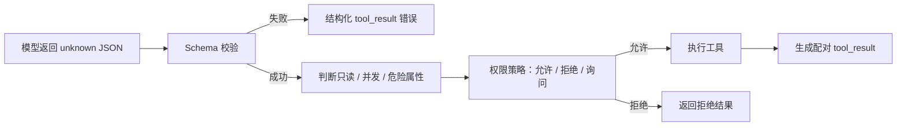
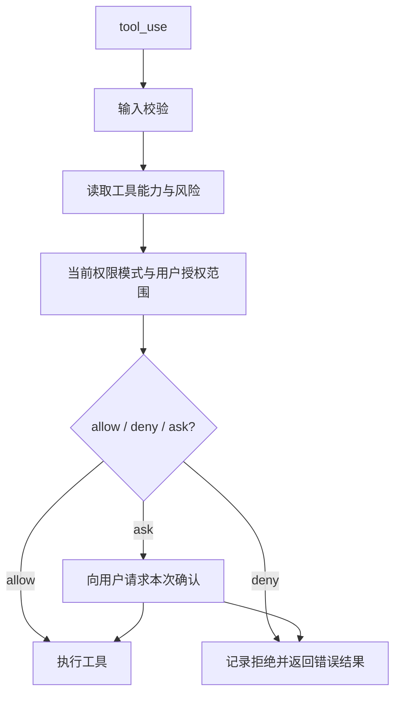
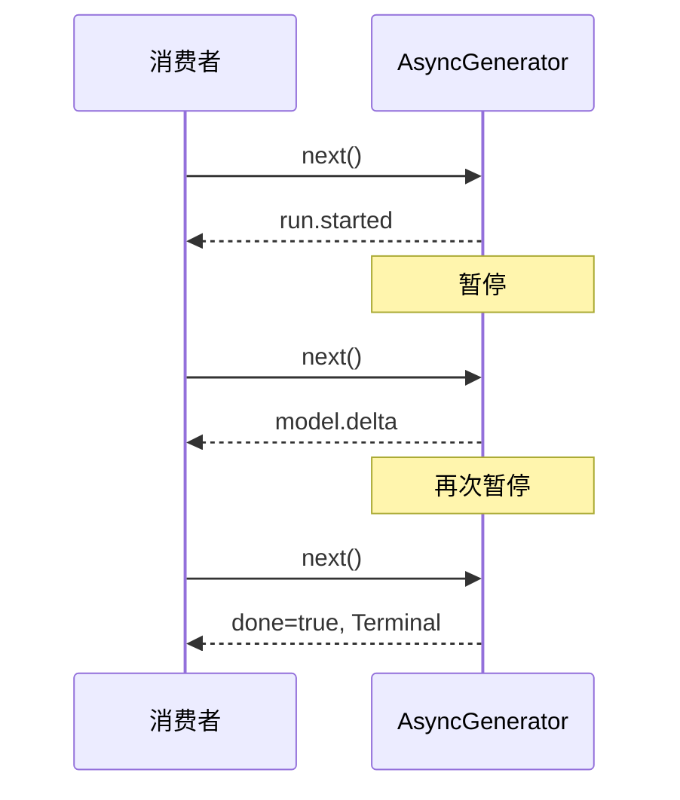

# Claude Code 源码拆解（二）：让模型不能胡来——契约、权限与事件流

> 本篇是 M01–M04 合并重构教材的第二部分。
>
> **上一篇：** `curriculum/units/M01/final.md`——Claude Code、模型、客户端与一次完整 Agent 循环。
>
> **下一篇：** `curriculum/units/M03/final.md`——状态所有权、子进程、取消与资源收敛。

## 本篇继续追踪同一个任务

```text
用户：帮我修复登录接口偶发的 500 错误，修复后运行测试。
```

上一篇讲到：模型不会直接操作本地环境，而是产生 `tool_use`；Claude Code 客户端校验并执行工具，再返回配对的 `tool_result`。

这一篇只回答两个问题：

1. 模型给出的工具请求为什么不能直接执行；
2. 一次运行为什么不能等到最后才返回结果。

这两个问题分别对应工业级 Agent 的两道缰绳：

```text
契约与权限：什么数据、什么操作可以进入执行层
事件流：运行过程中发生的事情怎样及时交给外部
```

---

# 一、先看一个最危险的“看起来能跑”实现

模型请求读取文件：

```json
{
  "type": "tool_use",
  "name": "Read",
  "input": {
    "file_path": 42
  }
}
```

`file_path` 本应是字符串，但模型返回了数字。

如果客户端直接执行：

> **[教学伪代码]**

```ts
await tools[request.name].call(request.input)
```

错误会进入工具内部，甚至可能在更危险的工具中变成真实副作用。

因此工具执行前不能只有“找到工具并调用”，而要经过一道完整边界：



这里最重要的不是 TypeScript 语法，而是边界顺序：

```text
先验证真实性
-> 再判断能力与风险
-> 再做权限决策
-> 最后才执行
```

---

# 二、TypeScript 零基础只需要先懂这五件事

本章不会把你带进完整 TypeScript 教程，只解释阅读 Claude Code 所需的最小语法。

## 1. `type`：给一种数据形状起名字

```ts
type ReadInput = {
  file_path: string
}
```

意思是：内部代码承诺 `file_path` 是字符串。

## 2. `|`：表示多个候选之一

```ts
type RunStatus = 'pending' | 'running' | 'completed'
```

`RunStatus` 只能是三个字符串之一。

## 3. `<T>`：让同一套结构传播不同类型

```ts
type Result<T> = {
  data: T
}
```

`T` 可以理解成暂时留出的类型位置。

## 4. `Promise<T>`：将来只完成一次

```ts
function readFile(): Promise<string>
```

表示函数异步完成后得到一个字符串，或者失败。

## 5. `async function*` 与 `yield`：过程中返回多次

```ts
async function* events() {
  yield '开始'
  yield '进行中'
  return '完成'
}
```

生成器可以多次交出中间值，最后再结束。

先掌握这些就够了。`Pick`、`Omit`、复杂条件类型等细节不再放在主线里。

---

# 三、为什么 TypeScript 类型不是运行时安全边界

下面这段类型声明能帮助编辑器和编译器发现内部错误：

```ts
type ReadInput = {
  file_path: string
}
```

但是模型返回的 JSON 没有经过你的 TypeScript 编译器。磁盘文件、MCP 消息和网络数据同样如此。

因此下面的写法没有验证任何东西：

```ts
const input = rawValue as ReadInput
```

`as` 只是告诉编译器“请按 ReadInput 看待它”，不会在运行时检查 `file_path`。

真正的边界应接收 `unknown`，再解析：

> **[Clean-room 实验·简化]**

```ts
function parseReadInput(value: unknown): ReadInput {
  if (
    typeof value !== 'object' ||
    value === null ||
    typeof (value as Record<string, unknown>).file_path !== 'string'
  ) {
    throw new Error('invalid Read input')
  }

  return value as ReadInput
}
```

真实 Claude Code 工具路径使用运行时 Schema 的思想，在执行前对模型 input 做 `safeParse()`。

可以把职责分成三层：

| 层 | 回答的问题 |
| --- | --- |
| TypeScript 类型 | 内部代码承诺怎样使用数据 |
| 运行时 Schema / parser | 外部数据实际上是否符合要求 |
| 状态迁移与权限策略 | 这个合法数据此刻是否允许产生动作 |

## 1. 状态值合法，不代表变化合法

`running` 和 `completed` 都是合法值，但不意味着允许：

```text
completed -> running
```

因此还需要迁移规则：

> **[企业设计迁移]**

```ts
const allowedTransitions = {
  pending: ['running'],
  running: ['completed', 'failed', 'cancelled'],
  completed: [],
  failed: [],
  cancelled: [],
} as const
```

分布式系统还要用版本号、条件更新或 compare-and-set 防止两个实例同时修改同一状态。

## 2. 源码深挖：为什么会有两套 `TaskStatus`

> **第一次阅读可以跳过。**

当前快照里，`src/Task.ts` 与 `src/utils/tasks.ts` 都出现 `TaskStatus`，但它们属于两个领域：

- 前者描述运行任务编排，例如 `running/failed/killed`；
- 后者描述协作任务清单，例如 `in_progress`，并用 Schema 校验持久化文件。

这说明类型名只是导航线索，真正语义由模块路径、生产者、消费者和校验边界决定。

---

# 四、工具为什么要同时声明“会做什么”和“有多危险”

一个工具不能只有 `call()`。

> **[源码事实·简化]**

```ts
type Tool<InputSchema, Output, Progress> = {
  inputSchema: InputSchema
  call(input: Infer<InputSchema>): Promise<ToolResult<Output>>
  isReadOnly(input: Infer<InputSchema>): boolean
  isConcurrencySafe(input: Infer<InputSchema>): boolean
}
```

先不用纠结泛型语法，只看它表达的设计：同一份输入 Schema 同时影响：

- 工具执行参数；
- 权限检查；
- 是否只读；
- 是否可以并发；
- 是否具有破坏性；
- 进度和结果的数据类型。

这样修改一个工具参数时，所有相关位置都会受到约束，而不是权限模块和执行模块各自维护一份容易漂移的接口。

## 1. 只读与并发不是一回事

- `Read`、`Grep`、`Glob` 通常只读取状态，可以更积极地并发；
- `Edit`、`Write`、`Bash` 可能修改文件或外部环境，需要更谨慎；
- 即使两个工具都“不是破坏性操作”，同时写同一文件也可能互相覆盖。

所以生产系统需要分别判断：

```text
是否只读
是否可并发
是否具有破坏性
是否需要用户确认
```

不能用一个 `safe=true` 代替所有维度。

---

# 五、权限系统：为什么有时自动执行，有时弹确认

回到登录 500 案例。

模型请求：

```text
Read LoginService.java
```

这是本地、只读、容易审查的操作，策略可能自动允许。

接着模型请求：

```text
git push origin main
```

这会影响共享仓库，而且难以撤销，应该询问用户或直接拒绝。

一次权限决策可以抽象为：



权限设计有三个重要原则：

1. **授权有范围。** 用户同意一次操作，不代表以后无限授权；
2. **默认收敛。** 工具遗漏安全属性时，应倾向更谨慎，而不是默认放行；
3. **拒绝也是结果。** 模型需要知道操作被拒绝，才能换方案或向用户解释。

## 1. `tool_use` 与 `tool_result` 为什么必须配对

如果模型产生：

```json
{
  "type": "tool_use",
  "id": "tool_03",
  "name": "Bash",
  "input": { "command": "./mvnw test" }
}
```

正常结果、权限拒绝、参数错误和用户取消，都应该形成引用 `tool_03` 的 `tool_result`：

```json
{
  "type": "tool_result",
  "tool_use_id": "tool_03",
  "is_error": true,
  "content": "用户未批准执行该命令"
}
```

这样模型才能明确知道上一动作发生了什么，消息协议也不会留下孤立工具请求。

---

# 六、为什么 Agent 不能只返回 `Promise<FinalAnswer>`

运行测试可能持续几十秒。期间用户希望看到：

```text
模型正在分析
搜索完成
开始读取文件
测试已运行 10 秒
测试输出新增 30 行
正在等待用户授权
工具执行失败
开始重试
```

如果 Query 只返回：

```ts
Promise<FinalAnswer>
```

调用方在最终完成前只知道“还没结束”。

因此一次 Agent 运行更适合被建模成事件序列。

## 1. 用水桶和水龙头理解

- `Promise` 像一桶水：装满后一次性交付；
- `AsyncGenerator` 像水龙头：运行中逐段交付事件。

> **[教学伪代码]**

```ts
async function* runAgent() {
  yield { type: 'run.started' }
  yield { type: 'model.delta', text: '正在检查登录代码...' }
  yield { type: 'tool.progress', toolUseId: 'tool_03', percent: 50 }
  return { reason: 'completed' }
}
```

每次 `yield` 后，生成器暂停，等消费者再次请求下一个值。



---

# 七、`yield*` 和 `for await` 先按职责理解

## 1. `yield*`：生成器把内层事件继续向外转发

> **[源码事实·简化]**

```ts
const terminal = yield* queryLoop(params)
return terminal
```

它同时做两件事：

1. 转发 `queryLoop()` 产生的中间事件；
2. 内层正常结束后取得最终 `Terminal`。

## 2. `for await`：消费者逐条处理事件

> **[源码事实·简化]**

```ts
for await (const message of query(params)) {
  更新消息历史(message)
  写入Transcript(message)
  更新Usage(message)
  yield 转换后的SDK事件
}
```

`QueryEngine.submitMessage()` 不等整个 Query 返回一大包消息，而是边收到事件边更新状态和输出。

## 3. `for await` 为什么拿不到生成器的 return value

普通 `for await` 只消费 `yield` 出来的值，遇到 `done=true` 就结束循环，没有变量接住生成器 `return` 的终值。

如果调用方既要中间事件，又必须取得终值，可以：

- 手动调用 `.next()`；
- 把完成设计成显式事件；
- 或提供独立的 `result Promise`。

这是协议设计问题，不是某一种写法永远更高级。

---

# 八、流式不等于没有缓存，也不等于自动取消

这一节是进阶内容，但结论必须记住。

## 1. AsyncIterable 仍然可能 OOM

一个对象可以对外提供异步迭代接口，内部却不断把事件塞入无界数组：

```text
生产者 push 很快
-> queue 不断增长
-> 消费者处理很慢
-> 内存最终耗尽
```

所以事件协议还要规定：

- 队列上限；
- 慢消费者处理；
- token delta 是否合并；
- progress 是否只保留最新值；
- tool result 是否必须可靠交付。

## 2. 多个模块不能随便竞争同一个 iterator

如果 UI、Transcript 和 Metrics 各自直接 `for await` 同一个单消费者流，事件可能被不同消费者分走。

更稳妥的设计是：

```text
一个 dispatcher 唯一消费上游
-> 先按顺序更新核心状态
-> 再复制不可变事件给各订阅者
```

这叫显式 fan-out，即由一个分发者把事件复制给多个观察者。

## 3. `break` 只保证生成器退出流程，不保证外部资源停止

消费者提前 `break`，生成器的 `finally` 通常会执行。但网络请求、timer 和子进程是否停止，要看 `finally` 是否真正连接了 abort、destroy、kill 或 disposer。

下一篇会专门解决这个问题。

---

# 九、错误有两条通道，已经发生的事情不会自动回滚

## 1. 抛异常

```text
producer throw
-> consumer 的 next() 被拒绝
-> 整条流可能终止
```

适合不可继续的运行时或协议失败。

## 2. 产生错误事件

```json
{
  "type": "tool_result",
  "is_error": true,
  "content": "测试失败"
}
```

对迭代器来说仍是普通事件，模型或策略可以继续处理。

## 3. 已经 `yield` 的事件不会因为后续异常自动撤销

登录任务中可能发生：

```text
1. assistant 消息已展示给用户
2. 消息已追加到内存历史
3. Transcript 已写入
4. 下一次读取流时才抛异常
```

第 4 步不会自动回滚前 3 步。

因此企业系统要明确：

- 哪个事件只是被观察；
- 哪个状态已经提交；
- 哪个外部副作用已经确认；
- 失败后需要补偿还是保留部分历史。

---

# 十、本篇实验：类型断言不是校验

## 环境

- Node.js 20 或更高；
- 新建文件 `runtime-validation.ts`；
- Node 版本支持类型擦除时可直接运行，或者使用项目现有 TypeScript 工具链。

## 完整实验

> **[Clean-room 实验]**

```ts
type ReadInput = { file_path: string }

function unsafeParse(value: unknown): ReadInput {
  return value as ReadInput
}

function safeParse(value: unknown): ReadInput {
  if (
    typeof value !== 'object' ||
    value === null ||
    typeof (value as Record<string, unknown>).file_path !== 'string'
  ) {
    throw new Error('invalid Read input')
  }

  return value as ReadInput
}

const bad = { file_path: 42 }

console.log('unsafe:', unsafeParse(bad))

try {
  console.log('safe:', safeParse(bad))
} catch (error) {
  console.log('safe rejected:', String(error))
}
```

预期：

```text
unsafe: { file_path: 42 }
safe rejected: Error: invalid Read input
```

四句话报告：

1. **预测：** `as ReadInput` 可能会检查字段；
2. **观察：** 错误对象直接通过；
3. **证明：** 类型断言不执行运行时校验；
4. **没有证明：** 这个实验没有证明 Claude Code 使用的所有 Schema 分支都正确。

---

# 十一、常见错误理解总表

| 错误理解 | 正确理解 |
| --- | --- |
| TypeScript 会检查模型 JSON | 模型数据必须由运行时 Schema 检查 |
| 数据值合法就能随时写入 | 还要检查状态迁移和并发条件 |
| 工具只有执行函数 | 还应声明 Schema、只读、并发和风险属性 |
| 用户同意一次等于永久授权 | 授权必须绑定本次范围和上下文 |
| 工具失败不需要返回结果 | 失败也要形成配对 `tool_result` |
| AsyncIterable 天然有背压 | 内部仍可能存在无界 push queue |
| 生成器 finally 执行等于资源关闭 | 还要检查是否连接真实 disposer |
| 流失败会回滚先前状态 | 已提交事件与副作用通常保留 |

---

# 十二、本篇小结与面试题

## 面试题：为什么 Agent 既需要 TypeScript 类型，又需要运行时 Schema？

**两分钟回答：**

> TypeScript 类型解决内部代码的一致性，但模型返回的 tool input、磁盘 JSON、MCP payload 和网络消息都没有经过我们的编译器，所以进入系统时必须先当作 unknown，通过 Zod、JSON Schema 或 parser 做运行时校验。校验成功后，泛型再把同一份输入契约传播到工具执行、权限、只读和并发判断。再往后一层，值合法也不代表状态变化合法，例如 completed 和 running 都是合法值，但 completed 不能随便回到 running，所以还需要 transition policy。我的生产设计是三道门：类型保证内部承诺，Schema 验证现实数据，权限与迁移规则决定这个动作现在能不能发生。

**记忆锚点：** 内部一致性、外部真实性、动作合法性。

## 面试题：为什么 Agent Query 更适合事件流，而不是 `Promise<FinalAnswer>`？

**两分钟回答：**

> 一次 Agent 运行不是一个延迟返回值，而是一段需要持续观察和控制的过程。中间会产生模型 delta、assistant 消息、工具进度、权限请求、tool result、usage 和控制事件。Claude Code 用 async generator 逐个 yield，QueryEngine 用 for-await 边消费边更新消息、Transcript、usage 和 SDK 输出。不过 AsyncIterable 只定义消费接口，不自动提供端到端背压和取消；生产系统仍要明确 queue 上限、慢消费者、early close 和资源 disposer。选择事件流是为了保留过程语义，而不是因为换了一个类型就自动解决流控。

**记忆锚点：** 过程事件、增量副作用、背压与取消另行设计。

---

# 十三、进入下一篇前的检查

请确认自己能解释：

1. 为什么 `as ReadInput` 不能验证模型数据；
2. Schema、权限和执行的正确顺序；
3. 工具为什么要声明只读、并发和危险属性；
4. 拒绝或失败为什么也要产生 `tool_result`；
5. `Promise` 与事件流分别适合什么；
6. 为什么流式不代表无缓存、无 OOM、自动取消。

下一篇中，登录任务已经运行到：

```text
Claude Code 启动 ./mvnw test
测试不断输出
用户按下 Ctrl+C
```

我们将回答：取消通知发出后，子进程真的退出了吗？谁持有消息、timer、listener 和 child？为什么 cleanup、cancel、kill、exit confirmation 是四件不同的事？

**下一篇：** `curriculum/units/M03/final.md`
