# M02 面试官问“Agent 为什么不能只 return Promise？”：从 AsyncGenerator 扒开事件流、终值、背压与关闭协议

<!-- INTERVIEW_LED_STYLE_V1 -->

这题面试官想考的，其实不是你会不会写 `async function*`，而是看你有没有把 Agent 当成“一段持续发生的过程”，而不是“一次晚点返回的函数调用”。

很多候选人会回答：“因为要流式输出，所以用 AsyncGenerator。”这句话只答到最表面。面试官真正会继续追：`yield*` 和 `for await` 到底差在哪？生成器 `return` 的终值去了哪里？消费者 `break` 以后网络请求真的停了吗？用了 AsyncIterable 为什么仍然可能 OOM？错误应该 throw，还是作为 event 继续流？

很可惜，这位林友当时只说：“Promise 一次返回，AsyncGenerator 可以多次 yield，所以体验更好。”面试官追问：“外层 `.return()` 后，`yield*` 后面的 completed 通知还会执行吗？多个模块能不能一起 `for await` 同一个流？”他沉默了。面试官摇摇头，让他回去等通知。

今天这篇文章，我们就沿着 Claude Code 的 `query() -> queryLoop() -> QueryEngine.submitMessage()` 和 StreamingToolExecutor，把下面这些问题一次讲透：

- 一次 Query 的事件、终值和异常分别走哪条通道？
- 为什么 `yield*` 能拿到 Terminal，而普通 `for await` 拿不到？
- 提前关闭生成器时，哪些 `finally` 会执行，哪些“正常完成”代码会被跳过？
- Tool progress 为什么一边流、一边仍然进入数组缓存？
- AsyncIterable 为什么不等于网络流、不等于背压、更不等于自动取消？
- 已经 yield 的部分状态，后续 throw 为什么不会自动回滚？

看完这一章，你应该能把“流式输出”答成一份完整的事件协议：生产、消费、缓冲、完成、失败、关闭和资源联动，一个都不能少。发车！

### 这篇文章写给谁？

这四个单元不再把读者假设成“已经熟悉 TypeScript、Node.js 和 Claude Code 的源码老手”。它同时面向三类人：

- **零基础或基础薄弱的 Agent 学习者**：先从一次真实操作和一个可观察问题出发，再解释术语、类型和源码；
- **正在准备大厂 Agent / Java 后端面试的人**：不仅要知道 Claude Code 怎么写，还要能把它迁移成工业级 Agent Harness 的设计答案；
- **已经能读代码、但容易停在 happy path 的工程师**：重点追状态 owner、异常路径、取消、恢复、运行时验证和可证伪证据。

### 这篇应该怎么学？

不要把正文当成 API 手册从头背到尾。每一节都按同一条主线阅读：

```text
先看用户或面试场景
-> 提出一个能被证伪的问题
-> 找到决定性源码
-> 追数据、状态与资源 owner
-> 补异常路径和边界
-> 用实验推翻错误直觉
-> 最后压成两分钟面试表达
```

文中的 Claude Code 快照事实、clean-room 运行验证和 Mini Agent Harness 设计迁移仍然严格分开；新的叙事方式只负责把路带得更清楚，不会把推断包装成源码事实。

> **原单元主题：** M02 值不是一次回来的：Promise、AsyncGenerator 与 Agent 事件流
>
> **内容保留说明：** 下文原有源码事实、代码片段、Mermaid 图、实验结果、破坏练习、H0 迁移、跨语言对照、企业治理、面试答案和源码定位均完整保留；本次修改只重构目标读者、叙事入口、章节标题、过渡方式与总结风格。

> 本单元主体阅读与源码跟踪约 5 至 6.5 小时。双语言实验、破坏练习与企业扩展另计约 2 至 3 小时。

假设一个 Agent 正在做这件事：

```text
读取 300 MB 日志 -> 持续报告进度 -> 找到错误 -> 调用诊断工具 -> 返回最终结论
```

如果函数只返回 `Promise<FinalAnswer>`，调用方在完成前只知道“还没结束”。它看不见模型刚产生的文本片段，看不见工具进度，也不知道应该把哪一段中间状态写入 Transcript。更麻烦的是，用户可能在第三个事件后退出消费，而生产者此时还持有网络流或子进程。

Claude Code 的 Query 和 Tool 路径因此不是“调用函数，等待最终对象”这么简单。当前源码快照里，`query()`、`queryLoop()`、模型适配层和工具执行器大量使用 `AsyncGenerator`、`AsyncIterable`、`yield`、`yield*` 与 `for await`。这些语法共同表达一份生命周期协议：

```text
谁启动生产 -> 谁请求下一个值 -> 中间值怎样传播
-> 正常终值由谁取得 -> 提前退出怎样关闭 -> 异常怎样到达消费者
```

本单元只闭合这份异步迭代协议。事件循环、timer、Node Stream、子进程和 `AbortSignal` 留到 M03；Query Loop 的业务状态机留到 M12；模型流重试和 Tool Loop 并发分别留到 M14、M15。这样划分不是降低深度，而是先把语言运行规则讲准，避免以后把业务分支误认成 JavaScript 语义。

本文中的 Claude Code 结论来自本地 `claude-code-CLI/` 静态快照，标为“快照事实”；`curriculum/units/M02/code/` 的结果是 clean-room“运行验证”；H0 事件端口是“设计迁移”。Graphify 只用于找到候选源码，没有作为正文事实或图示证据。

## 一、先别背语法：一句 Query 的值到底穿过了几层？

先不要钻进某一行代码。一次 Query 的异步值会经过四种不同形状：

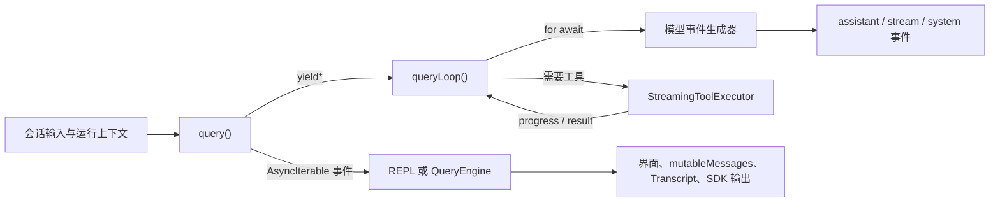

箭头上的两个词不能互换：

- `yield*` 是生成器之间的委托，既能转发中间值，也能取得被委托生成器的正常终值；
- `for await` 是消费者语法，只逐个取得 yielded values，普通循环结束后拿不到生成器的 return value。

整章最需要守住的另一个边界是：

```text
AsyncIterable != 网络流
AsyncIterable != 无缓冲
AsyncIterable != 自动取消
```

它只保证“这个对象可以被异步地逐个迭代”。值从哪里来、队列是否有上限、退出时是否关闭 socket，都要继续读具体实现。

## 二、Promise 不是不够快，而是它只表达一次完成

先从学习者最熟悉的 `Promise` 开始：

```ts
async function loadAnswer(): Promise<string> {
  const response = await fetch('/answer')
  return response.text()
}
```

调用 `loadAnswer()` 时，函数体立即开始执行，遇到第一个真正需要等待的 `await` 后把控制权还给调用者，同时交出一个 `Promise<string>`。这个 Promise 最终只有两种结果：fulfilled 的 string，或 rejected 的错误。

对 Agent 来说，一个终值往往不够。我们可以把“未来终值”和“过程中多次出现的事件”分开：

| 抽象 | 主要问题 | 消费方式 | 完成信息 |
| --- | --- | --- | --- |
| `Promise<T>` | 将来的一次结果是什么 | `await promise` | fulfilled value 或 rejection |
| `AsyncIterable<Y>` | 过程中会依次出现什么 | `for await (const y of source)` | 循环自然结束，不提供独立终值 |
| `AsyncGenerator<Y, R, N>` | 产出 Y、最终返回 R，并可接收 N | `.next()` / `for await` / `yield*` | 手动 `.next()` 或委托方可看到 R |

这里的 `N` 是调用者下一次 `.next(value)` 送回生成器的值。Claude Code 当前主线多把它省略为 `void`，所以本单元不扩展双向协程，只记住完整类型有三个参数。

Promise 的回调到底在 microtask 队列何时执行，为什么 timer 和 I/O 顺序不同，这些属于 M03。当前只需要一个不会错的模型：Promise 表达一次异步完成；async generator 表达可暂停、可继续、可关闭的多次异步交互。

## 三、你创建了生成器，代码为什么还没开始跑？

看本单元的 clean-room 生产者：

```ts
export async function* runEventStream(
  runId: string,
  trace: string[],
): AsyncGenerator<HarnessEvent, RunSummary, void> {
  trace.push('producer.started')
  try {
    yield { type: 'run.started', runId }
    yield { type: 'model.delta', text: 'hello' }
    yield { type: 'run.completed', runId }
    return { runId, yielded: 3 }
  } finally {
    trace.push('producer.finally')
  }
}
```

执行 `const iterator = runEventStream(...)` 只创建 iterator，`producer.started` 此时还不会写入 trace。第一次 `await iterator.next()` 才让函数体运行到第一个 `yield`。生产者把值交出去后暂停，第二次 pull 才继续。

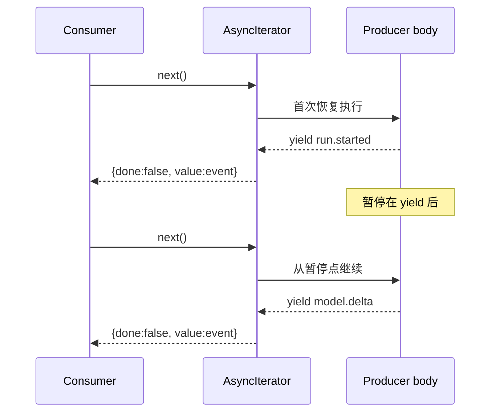

这张图解释了 iterator 边界为何具有天然的逐次拉取特征：生成器在 `yield` 后不会自己跑到下一个 `yield`。但它只描述生成器体这一层。若网络 SDK 已经在另一个回调中把 10,000 个 chunk 推进数组，消费者慢一点并不能让 socket 自动停止；后面读 `Stream<T>` 时会看到这个反例。

### `IteratorResult` 是一个判别联合

每次 `.next()` 都返回 Promise，Promise 完成后得到的对象可抽象成：

```ts
type IteratorResult<Y, R> =
  | { done: false; value: Y }
  | { done: true; value: R }
```

这正好复用 M01 的判别联合思维：先检查 `done`，TypeScript 才知道 `value` 是事件还是终值。

```ts
while (true) {
  const step = await iterator.next()
  if (step.done) {
    summary = step.value
    break
  }
  events.push(step.value)
}
```

若把 `if (step.done)` 删除，再把 `value` 一律当 `HarnessEvent`，就会把协议的完成面抹掉。这不是一个格式问题，而是控制流错误。

## 四、模型流结束了：到底是 yield、return，还是 throw？

对 async generator 做源码追踪时，不要只搜 `yield`。至少区分三条路径：

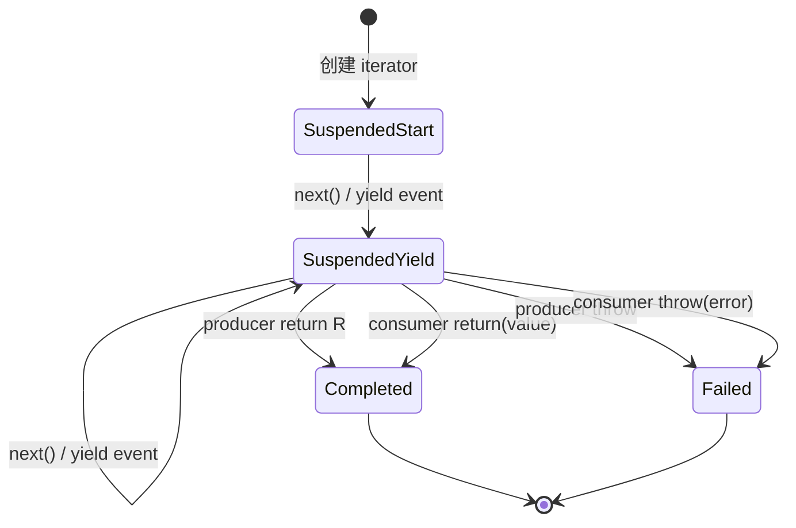

- 生产者 `yield event`：本次 step 是 `{done:false,value:event}`，函数暂停；
- 生产者 `return summary`：本次 step 是 `{done:true,value:summary}`，函数正常结束；
- 生产者 `throw error`：消费者正在等待的 `.next()` rejected；
- 消费者 `.return(value)`：请求生成器提前关闭，`finally` 执行，外部得到 `{done:true,value}`；
- 消费者 `.throw(error)`：把异常送进生成器当前暂停点；若未捕获，生成器失败。

业务系统还可能选择第四种表面形式：不 throw，而是 `yield {type:'error', ...}`。对迭代协议来说它仍是一个普通值，消费者不会进入 `catch`。因此“发生了错误”与“iterator rejected”必须分开描述。

## 五、从 query 到 queryLoop：`yield*` 为什么是协议接力棒？

> **这一节是高频追问：** “调用了子生成器”只是表面；真正要讲清的是中间事件怎样原样上浮、正常终值怎样被外层接住、异常和提前关闭又为什么跳过完成段。

当前快照的 `src/query.ts:query()` 结构非常短，却决定了事件和终值怎样跨层：

```ts
const terminal = yield* queryLoop(params, consumedCommandUuids)
for (const uuid of consumedCommandUuids) {
  notifyCommandLifecycle(uuid, 'completed')
}
return terminal
```

这是快照中的决定性语义，不要把它翻译成“query 调用了 queryLoop”就结束。`yield*` 做了两件事：

1. 把 `queryLoop()` 的每个 yielded event 原样转发给 `query()` 的消费者；
2. 只有子生成器正常 return 时，才把其 `Terminal` 作为 `yield*` 表达式结果交给外层。

`Terminal` 是业务终止原因，例如完成、达到轮次限制、模型错误或流被取消。这里先不展开每一种 reason，那是 M12 的业务状态机；本章只看它作为 generator return value 怎样传播。

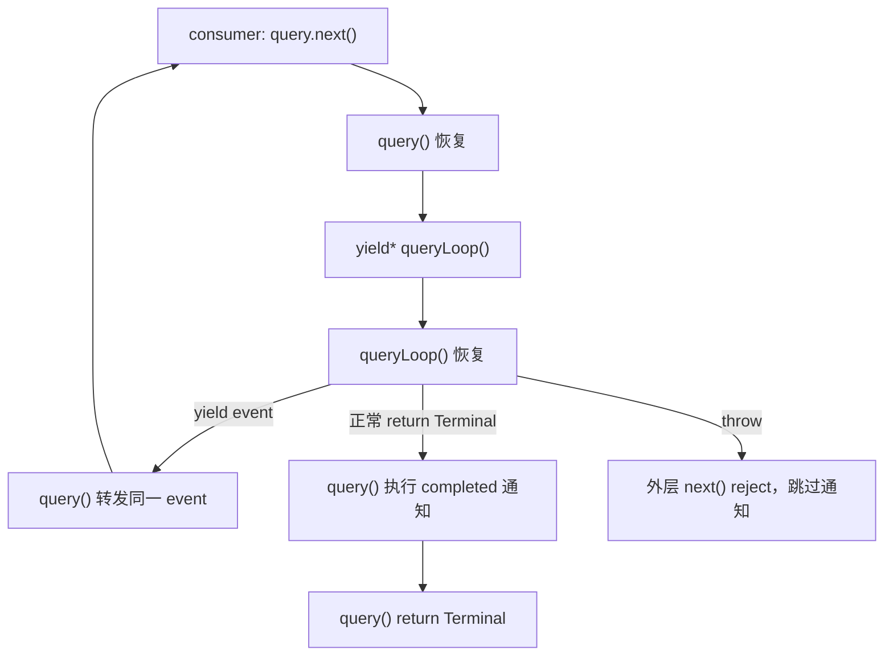

### 消费者提前 `.return()` 时，为什么不会误报完成

这一点不能靠直觉。一个常见误判是：对外层 `.return()` 后，控制流会继续执行 `yield*` 之后的 completed 通知。我们用原生 Node 对嵌套 async generator 做了最小复现。

正常耗尽的 trace：

```text
inner after-yield
inner finally
outer after-yield*
outer finally
```

消费者在第一个事件后调用 `outer.return('consumer-stop')` 的 trace：

```text
inner finally
outer finally
```

`outer after-yield*` 没有执行。也就是说，Return completion 关闭被委托生成器和外层生成器，运行两层 `finally`，但不进入正常完成段。`src/query.ts` 紧邻 `yield*` 的注释与该运行结果一致：throw 和 `.return()` 都跳过 command completed 通知，只是一个以 rejection 传播，一个以关闭完成。

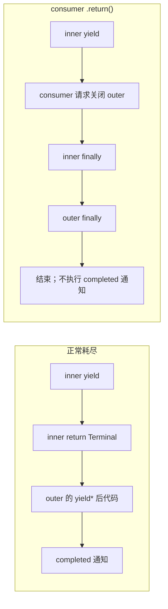

这也是为什么 `finally` 与“业务正常完成”不能混为一谈。`finally` 表示退出时总要做的清理；completed 通知表示工作自然到达了协议终点。

## 六、事件一到，状态就改：QueryEngine 为什么不能等到最后再处理？

`src/QueryEngine.ts:submitMessage()` 没有先等 `query()` 返回一个大对象。它直接：

```ts
for await (const message of query({...})) {
  // 按 message.type 更新历史、Transcript、usage 和 SDK 输出
}
```

在当前快照中，这个循环边消费边做至少四类工作：

- assistant、user、progress、attachment 等内部消息进入 `mutableMessages`；
- 需要持久化的消息按类型写入 Transcript，assistant 写入有专门的异步时序考虑；
- `stream_event` 的 message_start/delta/stop 更新本条与累计 usage、`lastStopReason`；
- 内部消息经 `normalizeMessage()` 变成 SDK 输出，compact boundary、最大轮次、预算等控制事件有专门分支。

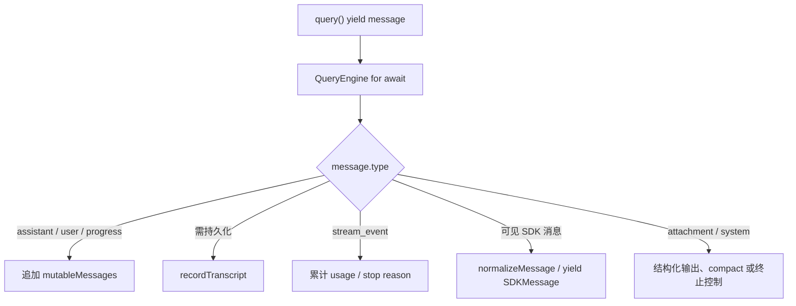

这张图揭示了 `AsyncIterable` 在 Agent Harness 中真正的价值：它把状态更新的时间点保留给消费者。若改成 `await query(): Promise<Message[]>`，所有 UI、Transcript 与预算逻辑只能在整轮结束后批量处理；长工具运行期间就没有可靠的中间观测。

### `for await` 为什么拿不到 `Terminal`

`for await` 会反复调用 `.next()`，遇到 `done:true` 就退出，但语法没有变量接收该 step 的 `value`。所以 `query()` 的 `Terminal` 不会直接出现在 `submitMessage()` 循环体里。

当前 `QueryEngine` 在循环结束后，依据已经写入的消息与 `lastStopReason` 形成 SDK result。不要把这说成“Terminal 丢失导致一个已证实的 bug”：两个对象本来属于不同协议层，一个是 query 内部终止原因，一个是 SDK 对外结果。准确说法是：`for await` 不传递 return value，QueryEngine 使用自己观察到的消息和 stop reason 收敛外部结果。

如果你的 Harness 需要同时得到 event stream 和结构化 summary，有三种常见选择：

1. 像 Claude Code 的委托层一样手动 `.next()`，保留 generator return value；
2. 把 `run.completed` 设计成显式 event，使所有语言和消费者都能看到；
3. 返回 `{ events, result }` 两个端口，例如 result 是单独 Promise。

没有永远正确的一种，关键是协议必须明确，不能让一部分消费者等 return value，另一部分只等 completion event。

## 七、既要中间事件、又要最终对象，为什么必须手动 `.next()`？

`src/services/api/claude.ts:executeNonStreamingRequest()` 展示了一个很好的反例。它包装重试生成器：重试期间可能产生 system API error message，最终正常完成时 return 一条 `BetaMessage`。

它没有写：

```ts
for await (const event of generator) { ... }
```

而是手动取得 step：

```ts
let step
do {
  step = await generator.next()
  if (!step.done && step.value.type === 'system') {
    yield step.value
  }
} while (!step.done)
return step.value
```

手动循环同时获得两种能力：中间 system message 可以继续向上 yield；`done:true` 时的 `BetaMessage` 可以作为本层终值 return。若改成普通 `for await`，中间过滤还在，但最终 BetaMessage 没有接收位置。

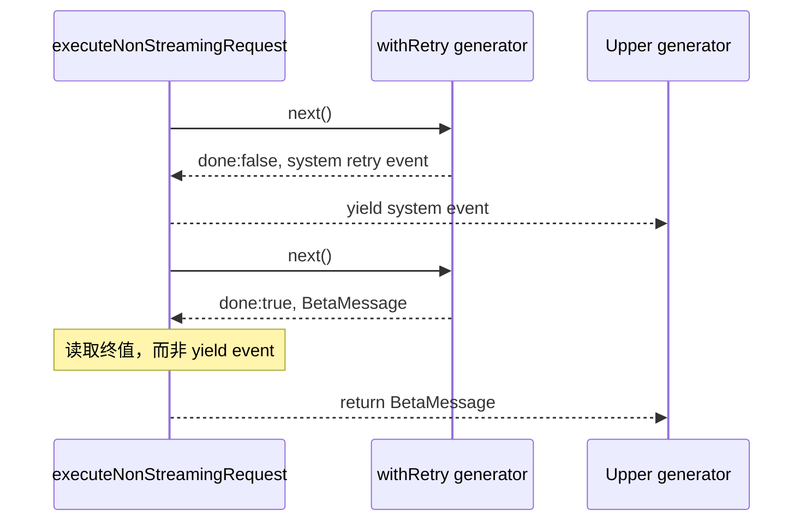

注意另一个容易混淆的边界：如果重试回调 throw，`await generator.next()` 会 reject，不会把 thrown string 或 Error 放进 `step.value`。只有生成器正常 yield/return 的值才走 `IteratorResult.value`。

`queryModelWithStreaming()` 则主要用 `yield*` 转发流式模型事件，正常 return 类型没有需要上层使用的业务值。相同语法工具在不同位置承担不同协议，不要看到 `yield*` 就默认“一定有重要终值”。

## 八、工具进度明明在流，为什么内存里还是有队列？

`src/services/tools/StreamingToolExecutor.ts` 会为每个工具启动 `runToolUse()` 生成器，并用 `for await` 消费它。收到 update 后：

- progress message 进入该工具的 `pendingProgress`；
- 其他 message 先进入局部 `messages`，结束后成为 `tool.results`；
- context modifier 进入单独集合；
- 工具错误可能触发 sibling abort 规则。

`getCompletedResults()` 是同步 generator，负责按顺序 drain 已缓存进度与结果；`getRemainingResults()` 是 async generator，在没有现成输出时，用 `Promise.race` 等待任一执行 promise 完成或新的 progress signal。

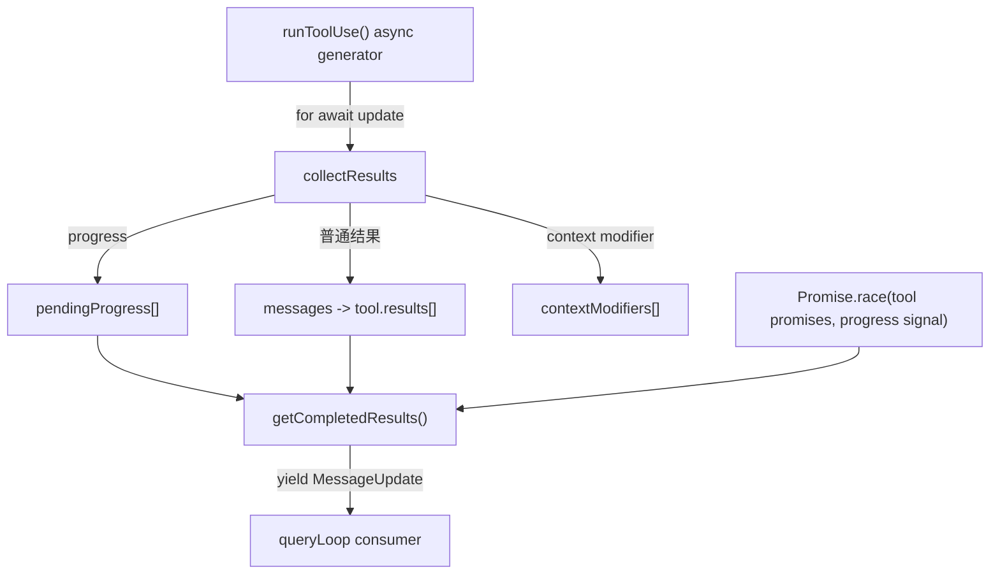

这里同时存在“流式”和“缓存”并不矛盾。流式描述值可以分段到达；缓存描述生产与消费速率不同时，未消费值暂时由谁持有。`pendingProgress[]` 与 `tool.results[]` 都是显式缓冲。工具并发顺序、sibling cancellation 和 discard 的完整业务语义留到 M15，但从语言层已经可以得出一条重要结论：`for await` 不会替你消灭队列。

## 九、用了 AsyncIterable 还会 OOM？看清 push queue 的真面目

> **面试官在这里看工程经验：** 流式只说明分段到达，不说明生产者受控。看到 queue、pending waiter 和 subscriber，就要继续问上限、丢弃、阻塞与观测。

`src/utils/stream.ts:Stream<T>` 更直接地推翻“AsyncIterable 就有端到端背压”。它的生产者调用 `enqueue(value)`，消费者调用 `next()`：

- 已有等待中的 `next()`：`enqueue` 直接 resolve 等待者；
- 没有等待者：值进入无界数组 `queue`；
- `done()`：标记完成并唤醒等待者；
- `error(error)`：让等待中的或下一次 `next()` reject；
- `return()`：标记 done 并调用可选 `returned()` 回调；
- `[Symbol.asyncIterator]()` 只允许启动一次迭代。

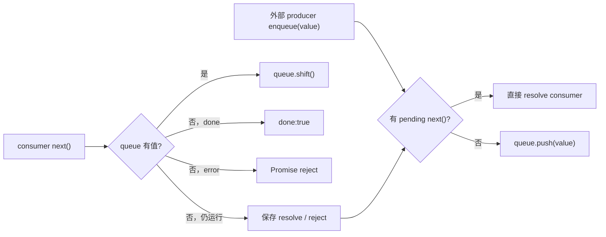

这是一种 push-to-pull 适配器：外部世界先 push，消费者看到标准 async iterator。它不是 Reactive Streams 意义上的 demand 协议，因为 producer 不需要获得配额就能继续 enqueue；队列也没有上限、阻塞、丢弃或合并策略。

### 谁拥有什么状态

| 状态 | 所有者 | 修改者 | 观察者 |
| --- | --- | --- | --- |
| generator 暂停位置 | JavaScript runtime / generator object | `.next/.return/.throw` 驱动 | consumer 通过 step 间接观察 |
| `Stream.queue` | `Stream<T>` 实例 | `enqueue`、`next` | `Stream` 内部逻辑 |
| pending waiter | `Stream<T>` 实例 | `next` 建立，enqueue/done/error 清除 | producer 通过方法间接触发 |
| QueryEngine `mutableMessages` | `QueryEngine` 持有的共享数组 | `submitMessage` 消费分支 | SDK 查询与后续轮次 |
| Tool pending progress/results | `StreamingToolExecutor` 的 tool record | `collectResults` 写，drain generator 取 | `queryLoop` |

所有权表比“这是一个流”更有用。它能直接推出失败问题：如果 consumer 永远不再 `next()`，谁还持有 queue？如果 consumer `.return()`，returned callback 是否真的关闭上游？如果 progress 生产远快于 UI，数组会增长到什么程度？

## 十、用户不看了，模型和工具就真的都停了吗？

> **先把结论记住：** iterator 关闭是控制流事实，socket、Promise、子进程是否停止是资源事实；两者之间必须有显式桥接。

对 generator 自身，`for await` 中的 `break` 会尝试调用 iterator 的 `return()`，`finally` 会执行。这让我们能在 clean-room 代码中可靠记录 `producer.finally`。

但下面这个推理是错的：

```text
generator finally 执行
=> 网络 SDK 已取消
=> 子进程已终止
=> 所有工具 promise 已结束
```

正确关系是：

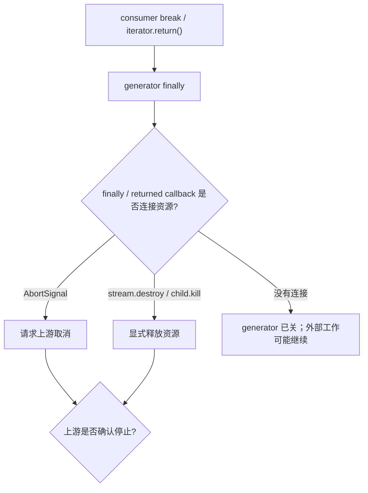

当前 `queryLoop()` 有资源处置与具体工具对象，不能从本单元的语言实验推导“所有外部资源必然取消”。我们只确认两点：委托生成器的 Return completion 会关闭生成器链；端到端资源取消必须继续检查 disposer、iterator return、`AbortSignal` 和组件自己的 discard/kill 实现。M03 会把这条链落到 Node 资源上，M15 再处理工具执行器。

## 十一、错误应该 throw，还是当成普通 event 继续跑？

把 Agent 中的失败画成一条异常线会丢失关键信息。至少有两条：

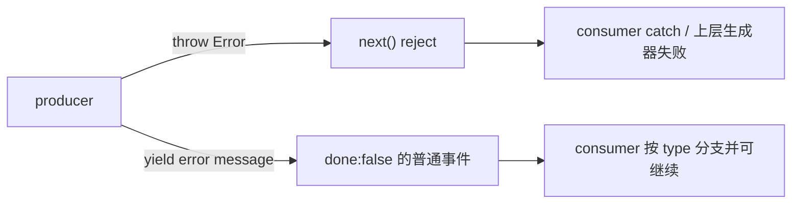

当前快照中，运行时 bug 或未处理错误可以穿过 `yield*`；另一些错误会编码成 assistant API error、system retry message 或 `tool_result is_error=true`，继续沿事件协议传播。某个 catch 还可能先补足缺失的 tool result，再发 assistant 级错误并 return `model_error`。

本单元不要求背所有错误类型。你要能回答的是：

1. 这个失败让 `.next()` reject 了吗？
2. 还是产生一个普通 event，由业务状态机决定继续或结束？
3. 消费者已收到部分事件时，后续失败会不会回滚先前状态？
4. Transcript 和内存状态是否已经写入部分事实？

第三点尤其重要。async generator 不提供事务：前两个 yield 已经被 QueryEngine 写入后，第三次 next reject，不会自动撤销前两次写入。企业 Harness 要么接受 append-only 的部分历史并记录失败边界，要么在更高层引入 transaction/checkpoint，不能期待迭代器替你回滚。

## 十二、别靠感觉：把惰性、终值、关闭和缓冲全部跑出来

代码位于：

```text
curriculum/units/M02/code/typescript/
curriculum/units/M02/code/python/
```

TypeScript 运行：

```powershell
cd "D:\agent\Claude code最新\curriculum\units\M02\code\typescript"
node eventStream.test.ts
node demo.ts
npx --yes --package typescript tsc -p .
```

Python 运行：

```powershell
cd "D:\agent\Claude code最新\curriculum\units\M02\code\python"
python -m unittest -v test_event_stream.py
python demo.py
```

当前运行结果是 TypeScript 6/6、Python 5/5，两个 demo 正常；TypeScript 核心实现通过 `strict` typecheck。测试分别回答下面的问题，而不是笼统证明“流实现正确”。

### 惰性与逐次 pull

预测：只创建 generator 时 trace 为空；第一次 `.next()` 后只出现第一个 yield 之前的记录。若第二段也已经执行，惰性模型被反证。

实际：预测成立。它证明本 generator body 由 pull 驱动，不证明网络 SDK 没有在外部预读。

### 正常委托与终值

预测：`delegatedRun()` 转发三个 event，正常耗尽后取得 `{runId,yielded:3}`，并记录 `delegate.return:3`。

实际：预测成立。它证明 `yield*` 能保留正常终值；普通 `for await` 测试没有观察这个值。

### 两种提前退出

第一个测试直接关闭 producer，确认 `finally` 执行且第二个事件前的代码没有运行。第二个测试关闭 outer delegate，确认 inner/outer 两层 finally 都执行，而 `delegate.return` 不执行。

这正是 `query()` completed 通知边界的最小复现。

### 部分事件后的生产者异常

预测：消费者先收到 start 和 delta，第三次 pull rejected，finally 仍执行。实际符合预测。它同时说明先前事件不会因异常被自动撤销。

### push queue 缓冲

预测：consumer 尚未 next 时连续 enqueue 两个值，`bufferedCount` 为 2。实际符合预测。这直接反证“只要实现 AsyncIterable 就没有缓冲”。

### 做五次有目的的破坏

1. 删除 `runEventStream()` 的 `finally`，提前 return 后比较 trace，说明清理不是 generator 自动生成的业务日志。
2. 把 `delegatedRun()` 的 `yield*` 改成 `for await`，尝试保留 `RunSummary`，观察协议缺口。
3. 删除手动循环的 `if (step.done)`，让 TypeScript 报出 event/summary 混用，复习 M01 的判别联合。
4. 向 `PushAsyncQueue` enqueue 100 万个整数但暂不消费，观察内存，说明无界缓冲的代价；完成后立即结束进程，不把这个教学队列用于生产。
5. 在消费者收到第一个事件后 `break`，另起一个与 generator 无关的 timer，观察 timer 仍会运行，证明 generator 关闭不会自动取消外部资源。

每次先写预测、再运行、最后写“证明了什么”和“没有证明什么”。尤其不要用 finally trace 声称真实 Claude Code 网络连接已经关闭。

## 十三、换成 Python，为什么完成协议必须重新设计？

Python 的 async generator 同样由 `anext()`/`async for` 驱动，也支持 `aclose()` 和 `finally`。但 Python 语法禁止 async generator `return value`。你不能把 TypeScript 的 `AsyncGenerator<Event, RunSummary>` 原样翻成：

```python
async def source():
    yield event
    return summary  # async generator 中不允许携带 return value
```

本单元 Python 版因此把正常完成建模为显式 `run.completed` event。这不是降级，而是选择一个跨语言更显性的协议。

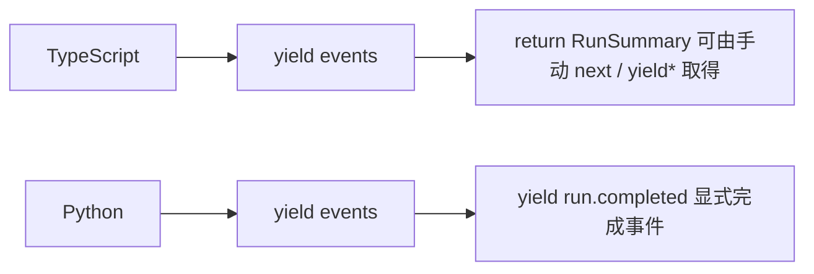

如果企业系统同时有 TypeScript gateway 和 Python worker，推荐把 completion 放进网络协议，而不是依赖某一种语言独有的 generator return value。进程内 TypeScript 层仍可保留 return summary 作为便利，但两者必须有清楚映射。

## 十四、把事件流真正合进 Mini Agent Harness

M01 已经建立 Message、RunState 与运行时校验边界。M02 为 H0 增加异步事件端口：

```ts
type HarnessEvent =
  | { type: 'run.started'; runId: string }
  | { type: 'model.delta'; text: string }
  | { type: 'tool.progress'; toolUseId: string; percent: number }
  | { type: 'run.completed'; runId: string }
```

本次 `merge` 的是行为契约，不是 Claude Code 私有消息联合：

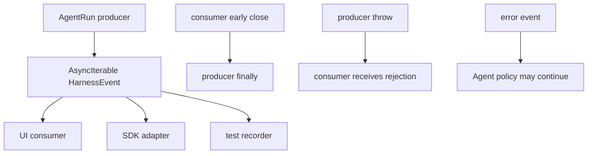

新增契约：

- 事件使用判别联合；consumer 未知事件必须有明确兼容策略；
- producer 正常完成、异常失败和 consumer early-close 是三个不同出口；
- event port 暂定单消费者，禁止多个 consumer 争抢同一 iterator；
- completion 是否显式事件由跨语言协议决定，TypeScript 内部 summary 不能成为唯一完成事实；
- queue 策略必须显式，当前教学 `PushAsyncQueue` 不是生产实现。

状态所有者：AgentRun 拥有生产生命周期；具体 adapter 拥有消费副作用；Transcript writer 不应悄悄成为第二个竞争 consumer，而应由一个 fan-out/dispatcher 明确复制事件。

失败语义：producer throw 使端口失败，已发事件保留；业务可恢复错误应建模为 event。兼容影响：新增事件变体会触发 M01 的穷尽检查。回归结果：双语言行为测试通过。

取消令牌、清理注册表和可控 clock 暂不合入本章；它们依赖 M03 对 Node 资源生命周期的完整说明。这个 defer 防止把 `.return()` 错当成万能取消。

## 十五、迁移到 Java 和 Spring：Flux 就等于 AsyncIterable 吗？

Java 的 `CompletableFuture<T>` 最接近 `Promise<T>`：都表达一次未来完成，不表达多值 demand。多值异步序列更接近 `Flow.Publisher<T>`、Project Reactor 的 `Flux<T>`。

但 `Flux` 与普通 JS `AsyncIterable` 有一个关键差异：Reactive Streams 协议显式存在 `request(n)`，subscriber 用 demand 告诉 publisher 最多发送多少。async iterator 的 `.next()` 看起来像 request-one，但如果前面包着 push queue，上游照样可以无界生产。因此把 async generator 迁移成 Flux 时，要迁移行为契约，而不是只换类型名。

Spring WebFlux 里可以这样分层：

```text
AgentRunService -> Flux<AgentEvent>
Provider adapter -> 受控 backpressure / buffer policy
Tool executor -> 独立资源与取消句柄
SSE/WebSocket adapter -> 客户端消费
Transcript subscriber -> 经显式 multicast/fan-out 复制
```

要特别处理客户端断开：SSE cancel signal 需要传播到 AgentRun，再连接到 WebClient request、工具 Future 和子进程。仅在 controller 的 `doFinally` 打日志，不会自动停止所有下游资源。

## 十六、LangGraph 支持 streaming，就等于底层问题解决了吗？

LangGraph 可以按 values、updates、messages 等模式流出执行过程，也能把节点状态变化提供给调用者。但框架提供流出口，不替你回答：

- Provider token stream 是否预缓冲；
- 工具 progress 是节点 update 还是独立 event；
- consumer 断开后 graph run 是否继续；
- checkpoint 在哪一个事件后提交；
- 多个观察者如何避免竞争消费；
- error 是 graph failure 还是 state 中的可恢复结果。

理解 Claude Code 的 async generator 链，价值就在于你不会把“框架支持 streaming”当作完整设计。你会继续追踪 producer、queue、consumer 和 resource handle。

## 十七、企业级 Agent 怎么设计：先写协议，再挑库

一个可生产事件端口至少需要六项明确决定：

1. **事件身份**：run ID、sequence、tool use ID，支持重放去重与因果关联。
2. **顺序范围**：只保证单 run 顺序，还是跨 tool、跨 worker 全局有序。
3. **缓冲策略**：上限、阻塞、丢弃、合并 progress 或落盘，不允许“数组自然增长”。
4. **完成与失败**：正常 completion、业务错误 event、transport failure、consumer cancellation 分开。
5. **资源联动**：关闭 iterator 后，要触发哪些 Abort/kill/dispose，并如何确认已停止。
6. **观测与恢复**：记录生产等待、消费延迟、queue depth、取消延迟；明确 checkpoint 与事件提交顺序。

对模型 token delta，UI 慢时可以合并小片段；对 tool result，通常不能丢；对 progress，保留最新百分比可能足够；对 permission request，则需要可靠交付和超时。这说明 backpressure 策略应按事件语义分层，而不是所有 event 共用一个无界 queue。

生产治理还要避免慢消费者拖垮主循环。常见方案是单写者 dispatcher 负责状态与持久化，再将只读副本发送到有界 subscriber queue；关键 subscriber 超时让 run 失败，非关键观测 subscriber 可断开或降采样。选择必须落到 SLO：最大 queue depth、最大 event lag、取消确认时间和丢弃率。

## 十八、面试官继续深挖：怎样从 async generator 讲到流控与取消？

下面的问题来自资深面试官会沿本章直接或间接展开的追问。参考回答保留面试现场可组织的口语节奏：第一句给结论，再讲机制、Claude Code 设计和企业边界。

### 问题 1：为什么 Agent Query 更适合返回 AsyncIterable，而不是 Promise<FinalAnswer>？

**参考口语回答（约 2 分钟）：**

> 先说结论：因为一次 Agent 运行不是一个延迟返回值，而是一段需要被观察和控制的事件过程。Promise 只能告诉调用方最终成功或失败，AsyncIterable 可以在同一生命周期里逐步交付模型 delta、assistant 消息、工具进度、tool result 和控制事件。Claude Code 的 `query()` 就是 `AsyncGenerator<EventUnion, Terminal>`，外层用 `yield* queryLoop()` 转发中间值；`QueryEngine.submitMessage()` 用 `for await` 边消费边更新 mutableMessages、Transcript、usage 和 SDK 输出。这样 Headless 不用等整轮结束才有反馈。不过 AsyncIterable 只定义消费接口，不自动提供端到端背压和取消，所以生产系统还要明确 queue 上限、consumer early-close、AbortSignal 和资源释放。也就是说，我选择它是为了保留过程语义，不是因为用了这个类型就天然解决了流控。

### 问题 2：`yield*` 和 `for await...of` 有什么本质区别？在 Claude Code 里分别解决什么？

**参考口语回答（约 2 分钟）：**

> 先说结论：`yield*` 是生成器到生成器的委托，既转发 yield 值，也能拿到子生成器正常 return 的终值；`for await` 是消费者语法，只消费 yield 值，循环结束后没有地方接 return value。Claude Code 的 `query()` 用 `const terminal = yield* queryLoop(...)`，所以 queryLoop 的事件继续向外流，正常结束时 Terminal 又能回到 query 做 completed 通知。`QueryEngine.submitMessage()` 用 `for await`，它关心每条消息带来的状态和 SDK 副作用，不直接取得 Terminal，而是在循环后根据消息和 stop reason 形成外部 result。另一个很清楚的例子是 `executeNonStreamingRequest()`：它必须保留重试 generator 最后的 BetaMessage，所以不用普通 for-await，而是手动 next，system retry 事件向上 yield，done 时读 step.value。

### 问题 3：消费者对外层 async generator 调用 `.return()`，嵌套的 `yield*` 后代码还会执行吗？

**参考口语回答（约 2 分钟）：**

> 先说结论：不会按正常耗尽路径继续执行；Return completion 会关闭委托链，触发内外 finally，但跳过 `yield*` 后的正常完成代码。这个边界不能凭经验猜，我们用 Node 做了嵌套实验：正常 next 到 done 时，先看到 inner finally，再看到 outer after-yield-star；第一个事件后调用 outer.return 时，只看到 inner finally 和 outer finally，没有 outer 的正常完成记录。Claude Code `query.ts` 也依赖这个语义：只有 queryLoop 正常 return，才通知 consumed commands completed；throw 和 consumer return 都跳过。工程上我会把“总要清理”放 finally，把“业务完成”放正常 return 后，绝不在 finally 里误报 success。

### 问题 4：用了 AsyncIterable，为什么还可能 OOM？你怎样设计背压？

**参考口语回答（约 2 分钟）：**

> 先说结论：AsyncIterable 只规定消费者怎么异步取值，不限制生产者是否先把值堆进内存。Claude Code 的 `utils/stream.ts:Stream<T>` 就是 push-to-pull 适配器：有 pending next 时 enqueue 直接 resolve，没有等待者就 push 到无界数组。StreamingToolExecutor 也有 pendingProgress 和 results 缓冲。所以判断背压要从 socket、SDK、queue 一直追到 consumer，不能只看最外层类型。我的生产设计会按事件类别设策略：tool result 可靠保留，token delta 可以合并，progress 可以只留最新值；每个 subscriber 用有界队列，暴露 queue depth 和 lag，达到阈值时阻塞上游、降采样或断开非关键消费者。Java Reactive Streams 还可以用 request(n) 明确 demand，但接入前也要确保 adapter 没有偷偷无界缓存。

### 问题 5：Generator 的 `finally` 执行了，能否说明网络请求和工具都取消了？

**参考口语回答（约 2 分钟）：**

> 先说结论：不能，finally 只说明生成器控制流正在退出，外部资源是否停止取决于它有没有连接具体取消机制。consumer break 通常会调用 iterator.return，generator finally 会跑；但如果网络 SDK 在独立回调里继续读 socket，或者工具 promise、子进程没有收到 Abort/kill，它们可以在 generator 关闭后继续工作。Claude Code 的真实路径还包含 AbortController、流资源释放、StreamingToolExecutor discard 和工具子控制器，这些要分别核验，不能从语言语义一跳得出“全部取消”。我在企业 Harness 里会建 ResourceScope，注册 abort、destroy、kill 和 dispose，取消时并行触发并等待有预算的确认，同时记录取消延迟和未收敛资源。M02 只证明 finally，M03 才把它接到 Node 资源。

### 问题 6：Agent 流里的错误应该 throw，还是作为 event 返回？

**参考口语回答（约 2 分钟）：**

> 先说结论：不可继续的协议或运行时失败用 throw 终止流，可被模型或策略处理的业务失败用结构化 event，关键是两条通道不能混淆。throw 会让 consumer 的 next reject，已经 yield 的事件不会自动回滚；error event 对 iterator 来说仍是普通值，状态机可以重试、换工具或向用户解释。Claude Code 里两种都有：未处理异常可以穿过 yield*，API retry、assistant API error、tool_result is_error 则作为消息继续传播。生产上我会定义 RunFailed 终态和 ToolFailed 可恢复事件，保留 stable error code、cause ID 和 redacted detail；Transcript 按 append-only 记录部分进展与失败边界。不能把所有 Error.toString() 都送给模型，也不能把每个工具拒绝都升级成 transport failure。

### 问题 7：如果多个模块都想消费同一条事件流，你会直接让它们 `for await` 吗？

**参考口语回答（约 2 分钟）：**

> 先说结论：不会让多个模块竞争同一个单消费者 iterator，因为每个事件通常只会被其中一个 next 取走，状态、持久化和 UI 会看到不同历史。Claude Code 的 `Stream<T>` 甚至显式限制只能迭代一次；QueryEngine 作为主要 consumer，在一个循环里完成状态写入、Transcript 和 SDK 转换。企业 Harness 里我会设单写者 dispatcher：它唯一消费 producer，先按顺序更新领域状态和 durable log，再把不可变事件复制到 UI、metrics、SSE 等 subscriber。每个 subscriber 有独立有界 queue 和重要性策略。需要重放时从 durable event log 按 sequence 恢复，而不是偷偷共享 iterator。这样也能定义慢观测者不能拖垮核心运行的 SLO。

回答这些题时，不要一开口背 `AsyncGenerator<Y,R,N>`。先解释为什么 Agent 是一个过程，再用类型和源码证明你的机制结论；面试官继续追问时，再落到 `.next()`、`yield*`、queue owner、取消链和生产策略。

## 十九、关掉答案：你能不能独立画出完整事件协议？

先关掉正文，画一张只包含 producer、iterator、consumer 的 pull 时序图。标出第一次 `.next()` 前函数体是否执行、yield 后谁暂停、done:true 时 value 属于哪个类型。

然后从 `src/query.ts:query()` 走到 `queryLoop()`，分别解释正常 return、throw 和 consumer `.return()` 是否执行 command completed 通知。不要只复述答案，运行嵌套测试并用 trace 证明。

接着到 `QueryEngine.submitMessage()`，选 assistant、progress 和 stream_event 三个分支，写出每个 event 改了哪份状态、是否持久化、是否转成 SDK 输出。再解释为什么 for-await 循环拿不到 Terminal。

继续对比 `executeNonStreamingRequest()` 和 `utils/stream.ts:Stream<T>`：前者为什么手动 next，后者为什么有 AsyncIterable 外观仍然可能无界缓冲。为 Stream 设计一个 `maxSize` 策略，写清满时阻塞、丢弃还是失败；不要只加一个数字。

最后为自己的 RAG/Agent 项目写出事件协议，至少包含 run ID、sequence、normal completion、recoverable error、fatal failure 和 cancellation。决定 Python worker 怎样表达 TypeScript generator return value，再说明 Spring SSE 客户端断开后取消如何到达模型请求和工具资源。

## 写在最后：事件流背后的四个设计哲学

一、**Agent 首先是过程，其次才是结果。** 用户界面、Transcript、预算、工具进度和取消都依赖中间事件，而不是最后那个 FinalAnswer。

二、**yielded event 与 generator return 是两份协议。** 谁只消费事件，谁还需要终值，必须在 API 设计时说清楚，不能靠调用者猜。

三、**流式不等于背压。** AsyncIterable 可以包着无界 push queue；判断系统是否安全，要沿 producer、buffer、dispatcher、subscriber 一直追到底。

四、**关闭控制流不等于关闭资源。** `finally` 是挂接取消和释放动作的位置，不是网络、工具和子进程已经停下来的证明。

面试现场可以用一句话收束：**Promise 交付一次完成，事件流交付运行过程；真正的工业设计还要补上缓冲、关闭、错误和资源联动。**

## 附录：源码定位地图

行号只作当前快照辅助，优先按符号搜索：

- `src/query.ts` -> `query()` -> `yield* queryLoop()`、completed 生命周期通知、return `Terminal` -> 约 219–239 行。
- `src/query.ts` -> `queryLoop()` -> async generator 主体、模型事件消费、工具结果与各类 `Terminal` -> 约 241 行起。
- `src/QueryEngine.ts` -> `submitMessage()` 中 `for await (const message of query(...))` -> mutableMessages、Transcript、usage 与 SDK 输出的增量消费 -> 约 675 行起。
- `src/services/api/claude.ts` -> `queryModelWithStreaming()` -> `yield* withStreamingVCR()` 与 `queryModel()` 委托链 -> 约 752–780 行。
- `src/services/api/claude.ts` -> `executeNonStreamingRequest()` -> 手动 `.next()` 过滤 system event 并保留 `BetaMessage` 终值 -> 约 818–917 行。
- `src/services/tools/StreamingToolExecutor.ts` -> `collectResults()`、`getCompletedResults()`、`getRemainingResults()` -> progress/results 缓冲与 `Promise.race` 唤醒 -> 约 332–489 行。
- `src/utils/stream.ts` -> `Stream<T>` -> 单消费者、push queue、pending waiter、done/error/return -> 全文件。

证据说明：上述 Claude Code 行为是当前静态快照事实；嵌套生成器、queue 与双语言测试是 clean-room 运行验证；H0 事件端口、Spring/Reactive Streams 与企业流控方案是设计迁移。事件循环顺序、Node 资源取消和完整 Tool Loop 并发将在后续单元继续闭合。
