# M03 `await` 之后还有运行时：事件循环、Stream、子进程与取消

> 本单元主体阅读与源码跟踪约 5.5 至 7 小时。双语言子进程实验、故障注入和扩展挑战另计约 2.5 至 4 小时。

假设 Claude Code 执行一条长命令：

```text
npm test -- --watch=false
```

命令启动后不断输出，十几秒后用户按下取消。表面上可以写成一句：

```ts
const result = await exec(command, signal)
```

但这句 `await` 隐藏了至少八个不同的运行时事实：

1. JavaScript 当前调用栈什么时候让出执行权；
2. Promise continuation、timer 和子进程事件谁先有机会运行；
3. stdout/stderr 是 Node Readable、文件 fd，还是被轮询的输出文件；
4. 谁拥有 child process、timeout、abort listener 和输出 buffer；
5. `signal.aborted` 只是通知，还是已经向进程树发出 kill；
6. kill 请求后，内部 result 何时算完成；
7. background 是继续运行还是取消；
8. 命令完成、进程退出和资源引用释放是不是同一个时刻。

如果把它们压成“async/await 会异步执行”，后面一定会在取消、后台任务和 graceful shutdown 上犯错。M02 已经讲清“值怎样分段回来”；M03 要把生成器的控制流接到真实 Node 资源上，沿一条 Bash 命令从启动、输出、进度、取消一直走到 cleanup。

本文把当前 `claude-code-CLI/` 中可直接核验的实现称为“快照事实”，把 `curriculum/units/M03/code/` 的结果称为“运行验证”，把 H0 的 ResourceScope 和生产方案称为“设计迁移”。快照由 source map 恢复，平台分支很多；涉及 Windows、POSIX、Bun 或特定 feature gate 时都会缩小表述。

## 先把长命令的全部生命周期看见

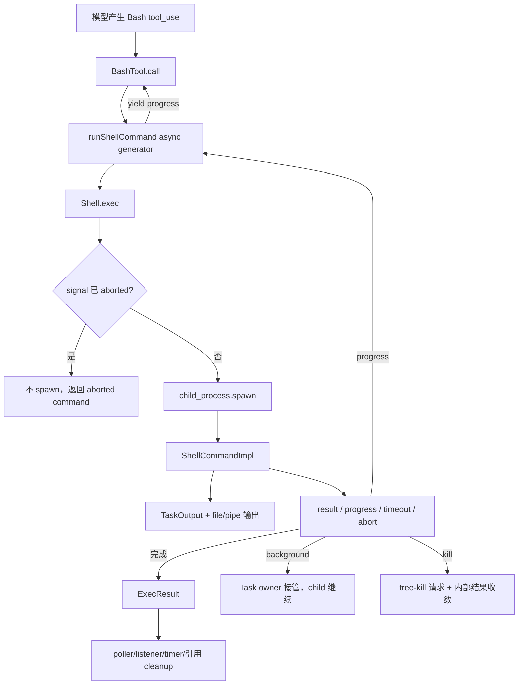

先记住四个 owner：

- `Shell.exec()` 拥有 spawn 前的装配和输出模式选择；
- `ShellCommandImpl` 拥有 child、timeout、abort listener、状态和 result Promise；
- `TaskOutput` 拥有输出存储、预览和 progress 轮询；
- `runShellCommand()` 拥有前台等待、progress yield 与 background 转换。

它们不是一个“大 Bash 函数”。每次跨 owner，都有新的状态和清理责任。

## 事件循环不是一个神秘队列

TypeScript 学习者常把 Node event loop 背成一串 phases，却仍然解释不了当前源码。先建立够用的三层模型：

```text
当前 JavaScript 调用栈
-> microtask checkpoint（Promise continuation、queueMicrotask）
-> Node/宿主调度的 timer、I/O、child-process 等回调
```

这是认知模型，不是说 timer 与所有 I/O 永远有固定全局次序。Node/libuv 版本、I/O 是否已经 ready、poll 状态都会影响宏观顺序。本章只依赖两条稳定结论：当前同步栈不会被普通回调半途打断；当前栈结束后，已排队的 Promise/microtask continuation 会在进入后续 timer/I/O 工作前被处理。

本章 TypeScript 实验：

```ts
const trace = ['sync']
queueMicrotask(() => trace.push('microtask'))
setTimeout(() => trace.push('timer'), 0)
await new Promise(resolve => setTimeout(resolve, 10))
```

观察到：

```text
sync -> microtask -> timer
```

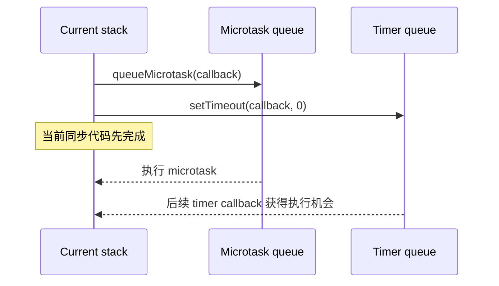

它没有证明“所有 Promise 永远早于所有 I/O”，也没有展开 Node 20 以后 timer phase 的 libuv 细节。它只是给后续源码一个可用支点：`.then()` 和 `await` continuation 不是另一个线程，它们仍要回到 JavaScript 执行序列。

### `await` 会把函数切成两段

```ts
const value = await promise
use(value)
```

可以先理解为：注册 promise 完成后的 continuation，当前 async function 暂停；promise settled 后，`use(value)` 作为后续 microtask 恢复。暂停的是这个函数，不是整个 Node 进程。child stdout、timer 或别的 request 可以继续产生事件。

这也解释了 M02 的 `Promise.race`：它不是开新线程竞速，而是多个 promise 争夺“谁先 settled 并安排 continuation”。没有赢到的工作默认不会被取消。

## `Shell.exec()`：先装配，再 spawn

当前快照的 `src/utils/Shell.ts:exec()` 接收：command、AbortSignal、shell type 和 timeout/progress/sandbox/background 等 options。它在 spawn 前完成 shell provider、cwd、环境和输出容器的装配。

有一个决定性早期分支：

```ts
if (abortSignal.aborted) {
  return createAbortedCommand()
}
```

这叫 pre-spawn cancellation。它避免创建一个明知不需要的 child，也避免“刚 spawn 就 kill”的竞态。但通过这个分支只能说明当前检查时 signal 已 aborted；检查之后 signal 仍可能在 spawn 前后变化，所以正常路径还必须注册 abort listener。

真正 spawn 时，快照刻意没有把 signal 直接传给 Node：

```ts
spawn(binary, args, {
  stdio: ...,
  detached: provider.detached,
  windowsHide: true,
  // signal 不直接传入
})
```

原因写在源码附近：进程终止由 ShellCommand 自己通过 tree-kill 处理。一个 shell 命令可能再启动子孙进程，只杀直接 child 不等于收敛进程树。`detached` 又由 shell provider 决定，不能把所有平台画成同一个 process group。

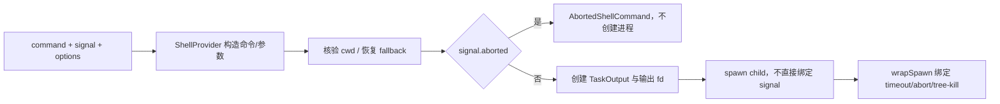

这张图同时说明 abort 检查和资源 owner 的先后：输出 handle 在 spawn 失败时必须由 `Shell.exec()` 关闭；child 创建成功后，timer/listener 生命周期转给 ShellCommand。

## stdout/stderr 有两条完全不同的路径

看到 `child_process.spawn`，很多人会自动画：

```text
child.stdout -> data event -> UI
```

这对当前默认 Bash 路径是错的。`Shell.exec()` 根据是否传入 `onStdout` 选择两种模式。

### file mode：默认 Bash 命令

默认模式创建 TaskOutput 文件 handle，并把 stdout 与 stderr 都指向同一个 fd。child 的 `stdout`/`stderr` 对象因此是 null，JavaScript 不逐 chunk 参与写入。进度由 TaskOutput poller 定期读文件尾部。

源码对平台有专门处理：POSIX 使用 append/no-follow 组合；Windows 用 `'w'` 打开以满足继承 handle 的写权限语义。教材只需抓住行为边界：两个 fd 汇入同一输出文件，结果里的 `stdout` 实际包含交错后的完整输出，BashTool 后续把 stderr 参数留空以避免重复。

### pipe mode：需要实时 stdout callback 的调用方

传入 `onStdout` 时，stdio 使用 pipe。`StreamWrapper` 给 Readable 设置 UTF-8 encoding，监听 `data`，写入 TaskOutput；调用方还可以并列注册自己的 `data` listener，两个 listener 收到同一 chunk。

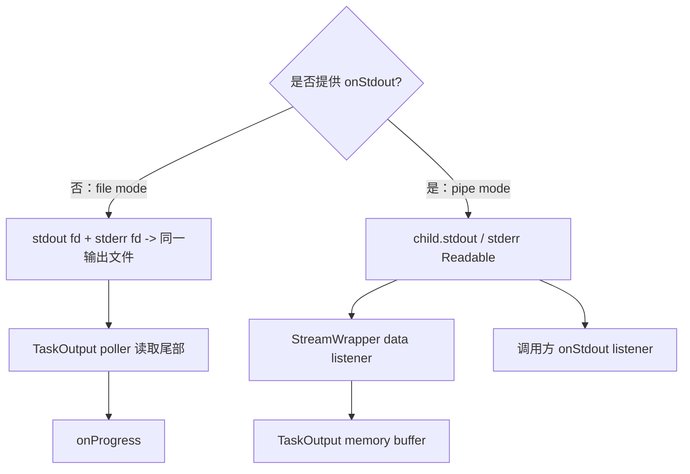

这就是 M02 “AsyncIterable 不等于真实上游形状”的延伸。Node Readable 可以用 event、`.pipe()` 或 async iterator 消费；但当前 file mode 甚至绕开了 JS Readable。教材流程图必须按具体模式画。

## Node Readable 的两种消费姿势

本章 clean-room 实现使用：

```ts
for await (const chunk of stream) {
  output += String(chunk)
}
```

快照的 pipe mode 使用：

```ts
stream.on('data', handler)
```

两者都消费 Readable，但流动模式不同。注册 `data` listener 会进入 flowing mode，chunk 主动推给 listener；async iterator 提供 pull 外观，Node 内部仍有 highWaterMark buffer 和底层生产机制。无论哪种方式，都要处理编码、结束、错误和 listener cleanup。

`StreamWrapper.cleanup()` 不 destroy stream，只移除自己的 data listener并释放对 stream/TaskOutput 的引用。它的职责是防内存引用泄漏，不是终止 child。这个边界后面会再次出现：cleanup 与 cancel 不能互换。

## `ShellCommandImpl` 才是命令生命周期 owner

`src/utils/ShellCommand.ts` 定义的公开状态是：

```text
running | backgrounded | completed | killed
```

实例内部还持有 child、timeout ID、size watchdog、abort signal/handler、result resolver、exit resolver、StreamWrapper 和 TaskOutput。

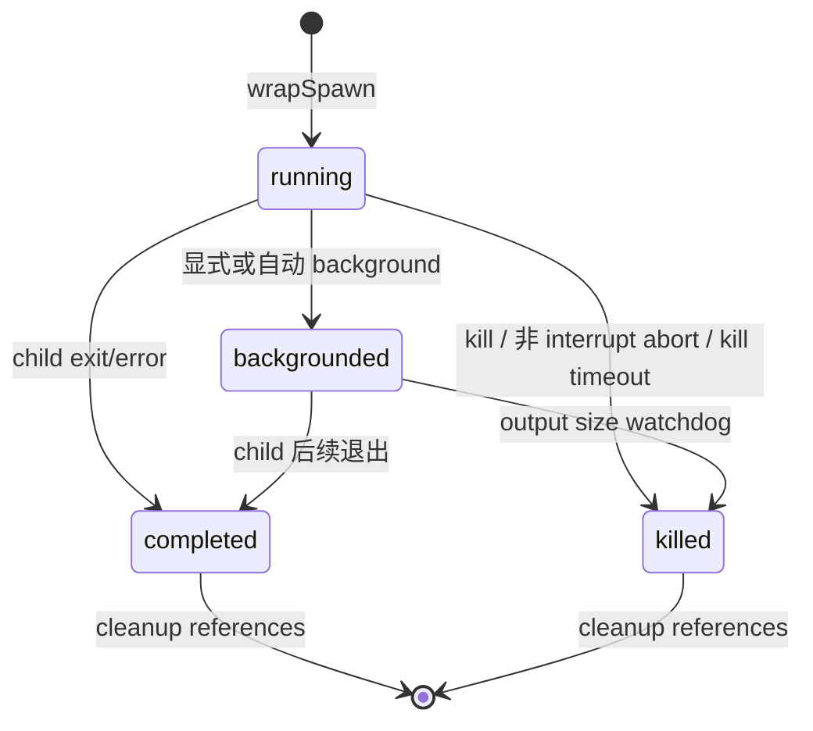

图中没有 `cancelled` 状态，因为快照把取消意图放在 AbortSignal，把命令结果放在 `ExecResult.interrupted`/code，把生命周期状态放在 ShellCommand.status。三个层次不要合并成一个字符串。

### 为什么监听 `exit`，不是 `close`

ShellCommand 监听 child `exit` 和 `error`。源码注释给出一个很实际的原因：`close` 要等 stdio 关闭；若孙进程继承了 fd，即使 shell 自己退出，fd 仍可能保持打开。使用 `exit` 可以在 shell 退出时先把控制权还给调用方。

代价是：shell 退出不代表所有后代与 fd 都已关闭。输出完整性由 TaskOutput/file 策略和后台任务协议继续承担。这里不是“exit 比 close 正确”，而是为了避免孙进程 fd 把前台等待无限延长所做的边界选择。

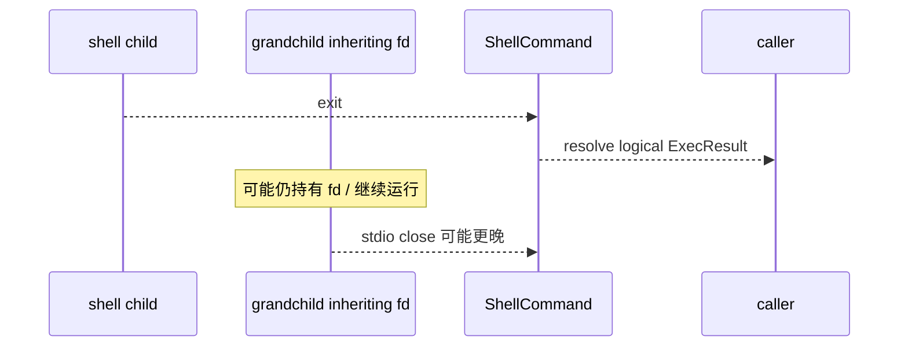

## timeout、abort、kill、background 必须分四个动词

### timeout

构造 ShellCommand 时启动 timer。如果允许自动后台化且 `onTimeout` callback 已设置，timeout 调用 background；否则进入 kill 路径。

所以 timeout 不必然意味着失败。对适合长期运行的命令，它可能只是“前台等待预算用完，转由后台 owner 管理”。

### abort

abort handler 先看 `signal.reason`：

- reason 为 `'interrupt'`：不 kill，保留进程，让上层把它后台化并向模型暴露部分输出；
- 其他 reason：调用 `kill()`。

`AbortSignal` 是 one-shot 状态与事件：一旦 aborted 不会恢复。它不含资源关闭实现，只有消费它的组件才能把通知变成 kill、destroy 或业务终止。

### kill

快照的 `#doKill()`：

1. 把 status 设为 killed；
2. 若有 pid，调用 tree-kill 请求以 SIGKILL 终止进程树；
3. 主动 resolve 内部 exit code。

第三步非常关键：ShellCommand 的 result 可以在 tree-kill 请求发出后收敛，不必等待真实 child `exit` 事件。后续 exit event 到达时 resolver 已经被清空。这是一份“逻辑完成”契约，不是 OS-level exit confirmation。

timeout 分支传入内部 SIGTERM 类别码用于生成 timeout message，但 tree-kill 实际仍请求 SIGKILL。不要仅看 result code 推断操作系统实际收到的 signal。

### background

`background(taskId)` 不杀进程。它把 status 改成 backgrounded，清掉前台 timeout 与 abort listener：

- file mode 启动输出文件 size watchdog，避免无人看管的 append 填满磁盘；
- pipe mode 把内存 buffer spill 到磁盘；
- 后台 Task owner 负责后续通知、kill 和 cleanup。

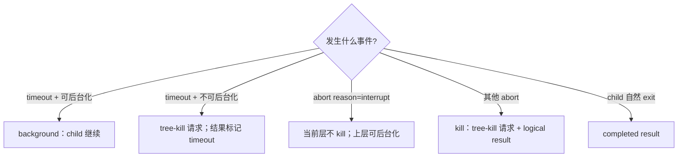

这张图是本章最重要的复习索引。以后看到“取消 Bash”，先问是哪一个动词，不要先猜结果。

## progress 是 result 与 poll signal 的竞速

`runShellCommand()` 是 async generator。它先调用 `Shell.exec()` 得到 ShellCommand，然后把 `shellCommand.result` 与 progress threshold、TaskOutput poll signal、background 状态组合起来。

最初短命令有一个阈值：

```text
Promise.race(resultPromise, progress-threshold timer)
```

若命令很快完成，直接 cleanup 并 return ExecResult，不启动持续 progress UI。超过阈值才启动 TaskOutput poller。

进度循环里每轮创建 progressSignal：

```text
Promise.race(resultPromise, progressSignal)
```

poller 的 onProgress 更新闭包里的 last output/line/byte，并 resolve signal；generator 醒来后 yield progress。命令 result 先完成则清 foreground registration、cleanup 并 return。finally 无论怎样离开都停止 polling。

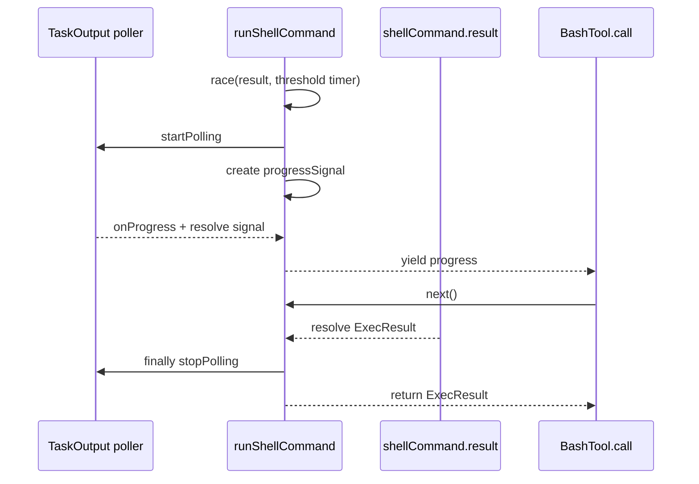

这连接了 M02：BashTool.call 必须手动 `.next()`，因为中间 progress 要交给 `onProgress`，最终 ExecResult 又要从 `done:true.value` 取得。

### `Promise.race` 不会取消输家

threshold timer 赢时，resultPromise 仍在运行；result 赢时，timer callback 仍可能排队，除非被显式清理或 timer 不再产生有害副作用。源码对多个长 timer 调用 `.unref()`，表示它们本身不应成为维持 Node 进程存活的理由。

`unref()` 不是取消 timer。事件循环若因为其他资源仍活着，timer 到期仍可执行。看到 `.unref()` 应读成“移除 keep-alive 权重”，不是“删除任务”。

## `.then()` 中的同步工作为什么影响 `await` 后的可见状态

`Shell.exec()` 在返回 ShellCommand 前，先给 `shellCommand.result` 注册一个 `.then()`。它读取命令写下的 cwd 文件、更新全局 cwd、清理临时文件。源码特意使用同步 `readFileSync/unlinkSync`，并解释原因：这些动作要在 `.then()` 的当前 microtask 内完成。

调用者稍后 `await shellCommand.result`。Promise reactions 按注册顺序排队；更早注册的 cleanup reaction 先运行，其同步部分在让出控制权前更新 cwd，调用者 continuation 才继续。

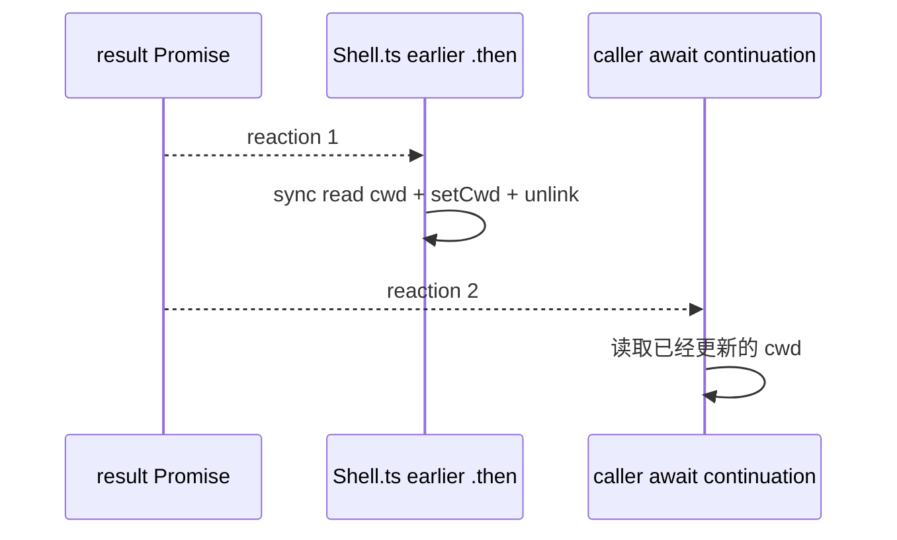

若把 readFile 改成 `await readFile(...)`，reaction 1 会在读文件处再次让出，reaction 2 可能先继续，调用者就观察到旧 cwd。这是 microtask 语义怎样直接改变状态可见性的真实源码例子。

## AbortController：通知图，不是 kill 方法

`AbortController` 拥有 signal；调用 `abort(reason)` 只会把 signal 置为 aborted、保存 reason 并通知 listener。真正动作由 listener 实现。

当前快照还有两种组合方式。

### child controller：父向子单向传播

`createChildAbortController(parent)` 做到：父 abort 会带 reason 传播给 child；child 自己 abort 不反向影响 parent。实现用 WeakRef，避免 parent 的 listener 强持有已经废弃的 child；child abort 时还会移除 parent listener。

### combined signal：多个来源汇合

`createCombinedAbortSignal(signalA,{signalB,timeoutMs})` 创建新 controller，任一输入 abort 或 timer 到期都会 abort combined。它返回 cleanup，负责 clearTimeout 和 removeEventListener。

当前实现调用 `combined.abort()` 时没有传输入 reason，因此 combined signal 不保留来源原因。使用者若需要区分 user、timeout、parent failure，不能假定这个 helper 已经替它编码。

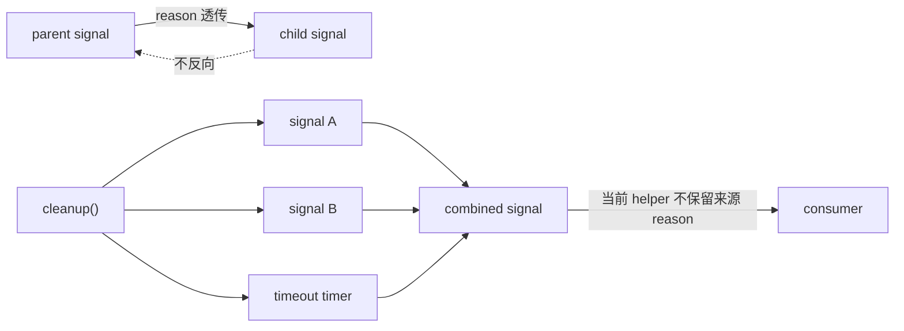

这和本章 clean-room 实现有意不同：课程的 CancellationScope 保留 parent 或 timeout reason，方便 H0 状态机区分原因。那是设计迁移，不是对源码的描述。

## cleanup 为什么不能只写在 process exit

资源生命周期通常有三种结束入口：自然完成、用户取消、系统 shutdown。只在 happy path 清理 listener，会让重复运行不断积累 timer、AbortSignal handler、Readable 引用和 TaskOutput buffer。

ShellCommand 的 `cleanup()`：

- 移除 StreamWrapper data listener，释放引用；
- 清 TaskOutput；
- 清 timeout/size watchdog/abort listener；
- 释放 child、signal 和 callback 引用。

它不 kill。先 `cleanup()` 再让仍运行的 child 失去 owner 是错误用法。快照调用方在前台命令完成时 cleanup；background 后由 LocalShellTask 等新 owner 接管。

全局层还有 `cleanupRegistry.ts`。`registerCleanup()` 把 async cleanup 放进 Set，返回 unregister；`runCleanupFunctions()` 用 `Promise.all` 并行执行。它与本章 ResourceScope 的逆序串行 dispose 不同：前者追求全局关机预算内并行收敛，后者用于有依赖顺序的小资源域。

## graceful shutdown 是有预算的降级流程

`gracefulShutdown()` 不是无限等所有资源完美结束。快照先防重复进入，计算 SessionEnd hook budget，设置 failsafe timer；随后清终端模式、打印 resume hint，再把全局 cleanup 与 2 秒 timeout 做 race。

后面还有有预算的 SessionEnd hooks、profile/analytics；analytics flush 又限制在约 500ms。最终 force exit。failsafe 的总体预算取 5 秒与 hook budget 加 headroom 的较大值。

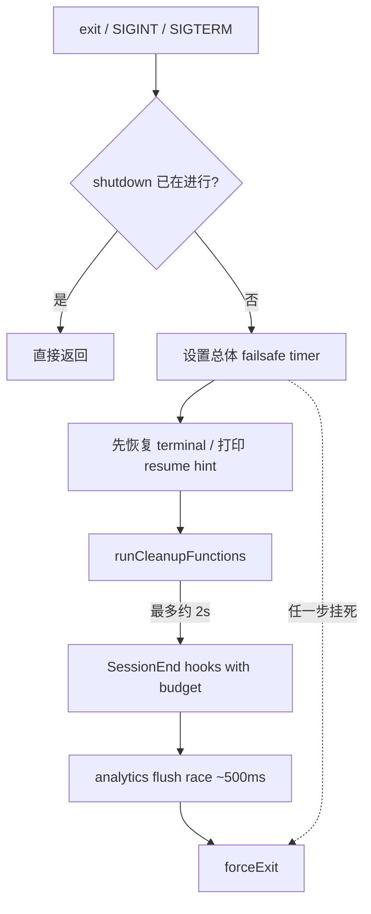

企业系统也需要这种优先级：先保护用户数据和终端/协议完整性，再尽力 flush 次要 telemetry。graceful 不等于无限等待，force 也不等于一开始就丢弃所有状态。

## 用双语言实验验证“请求取消”与“确认退出”

代码位置：

```text
curriculum/units/M03/code/typescript/
curriculum/units/M03/code/python/
```

TypeScript：

```powershell
cd "D:\agent\Claude code最新\curriculum\units\M03\code\typescript"
node runtimeHarness.test.ts
node demo.ts
powershell -File typecheck.ps1
```

Python：

```powershell
cd "D:\agent\Claude code最新\curriculum\units\M03\code\python"
python -m unittest -v test_runtime_harness.py
python demo.py
```

当前结果：TypeScript 5/5、Python 5/5，两个 demo 正常，TypeScript strict typecheck 通过。

### 事件循环实验

TypeScript 观察 `sync -> microtask -> timer`；Python 观察 `sync -> call_soon -> timer`。两者证明各自 runtime 的本地调度，不把 `queueMicrotask` 与 asyncio `call_soon` 宣称为同一规范。

### 正常 child 与 Stream 实验

child 每隔很短时间输出 tick，第二个 tick 同时写 stderr。父进程增量读取两条 stream，最终等待 child exit 并汇总输出。反证条件是某个已观察 chunk 在最终结果中消失，或 cleanup 在 exit 前误报完成。

### 外部 cancel

收到第一个或第二个 stdout 后触发 cancel。事件必须满足：

```text
cancel.requested -> process.exited -> cleanup.finished
```

TypeScript Windows 运行显示 exitCode 为 null、signal 为 SIGTERM；Python subprocess 给出平台退出码。测试不把这些平台细节强行归一，只验证生命周期顺序。

### timeout

timeout 走独立 reason，结果为 `timed_out` 而不是一般 `cancelled`。这证明 reason 会改变领域状态。它不证明 Claude Code 的 combined helper 保留 reason，因为 clean-room scope 是作者设计。

### ResourceScope

注册两个 disposer，验证逆序执行与重复 dispose 不产生第二次副作用。这是 H0 契约；Claude Code 全局 cleanup registry 实际用并行 Promise.all，不得拿本实验替换快照事实。

### 做六次破坏

1. 删除 pre-spawn aborted 检查，立即 abort 后仍 spawn，观察多余进程。
2. 在 cancel handler 里只记录 reason、不调用 child.kill，观察 result 是否继续等待自然完成。
3. kill 后立即返回，不等待 exit，把 clean-room 改成快照的 logical completion；比较事件顺序和适用场景。
4. 去掉 cancellation cleanup，循环运行几千次，观察 listener warning 或残留 timer。
5. 把 `unref()` 误改成 clearTimeout，比较“timer 不维持进程”与“timer 不再执行”。
6. 让两个 consumer 同时以不同方式读取同一 Readable，观察 chunk 分配/复制，解释为什么输出 owner 必须明确。

每个破坏先写预测。第 3 项没有单一正确答案：它迫使你选择 result 是逻辑 ack 还是 OS exit confirmation，并把选择写进协议。

## H0：合入取消域、资源域和可控时钟

M01 建了类型/状态契约，M02 建了事件端口。M03 合入三份能力：

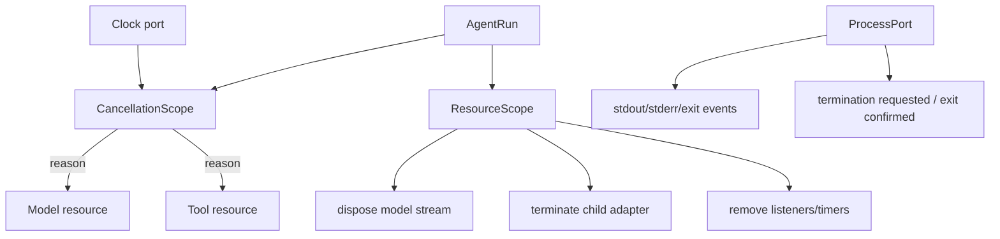

新增契约：

- cancellation 是 one-shot，reason 必须是稳定联合，而不是任意字符串；
- parent 可以取消 child，child 失败是否反向升级由业务策略决定；
- termination requested 与 exit confirmed 是两个事件；
- ResourceScope 幂等，每个资源只能有一个 owner；
- timer 通过 Clock adapter 创建并可清理，测试不依赖真实长等待；
- ProcessPort 隔离平台 kill 语义，领域层不比较 137、143、null 等裸值。

状态所有者：AgentRun 拥有 CancellationScope；Model/Tool adapter 拥有真实 resource handle；ResourceScope 只编排 disposer，不篡夺 handle；ProcessPort 负责把 OS 事实翻译成领域事件。

失败语义：cancel 请求后超过 budget 未确认 exit，进入 `termination_unconfirmed` 并升级平台 adapter；不能假装 completed。兼容影响：M02 event union 增加 cancel/exit/cleanup 变体，消费者必须更新穷尽分支。回归：M01-M03 独立测试全部通过。

Harness 不复制 `tree-kill` 或 Claude Code 的 numeric code。POSIX process group、Windows Job Object、container task kill 由部署平台适配。

## Java/Spring：线程中断也不是强制终止

Java `Thread.interrupt()` 最接近合作式取消通知：它设置 interrupt flag，某些阻塞调用抛 `InterruptedException`，业务代码仍需尊重并传播。它不是安全的强制 thread kill。

对于 `Process`，可以调用 `destroy()`/`destroyForcibly()`，再用 `onExit()` 或 `waitFor(timeout)` 观察确认。与本章一样，请求终止和确认退出要分开。

Spring/Reactor 方案可以是：

```text
HTTP/SSE cancel
-> RunCancellationToken
-> WebClient subscription dispose
-> Tool ProcessHandle.destroy
-> bounded wait
-> destroyForcibly / platform escalation
-> onExit confirmation
-> ResourceScope close
```

Reactor 的 `doFinally` 能观察 cancel/complete/error，但不自动知道外部 process 是否退出。需要显式 bridge。ThreadLocal 也不会自动跨 reactive continuation，应把 run ID、cancel reason 和 resource IDs 放进 Reactor Context 或显式参数。

## Python asyncio：Task.cancel 只注入 CancelledError

`asyncio.Task.cancel()` 请求在协程的下一个 suspension point 注入 `CancelledError`。协程可以在 finally 清理，也可能吞掉取消。subprocess 仍需 `terminate()`/`kill()` 并 `await process.wait()`。

本章 Python 实验正是这条契约：cancel Event 只是来源；runner 收到后 terminate，给进程有限时间，再必要时 kill，最后 await wait。不要把 Java interrupt、Python Task.cancel 和 AbortSignal 当作可互换的强杀 API；它们共同点是合作式通知，资源动作各自不同。

## 与 LangGraph 和企业 Agent 的关系

LangGraph run 可以被取消，节点也可以接收配置和异步资源，但框架不能自动杀死节点内部启动的任意 child process。节点若把进程 handle 藏在局部变量里，外层图取消只能停止等待，未必停止工作。

企业 Harness 应建立可观测资源域：

- 每个 run 有 cancel request time、reason、source 与 deadline；
- 每个外部资源有 owner、resource ID、start/close/exit confirmation；
- 指标区分 cancel latency、kill escalation、unconfirmed resource、orphan process；
- shutdown 有分级预算，先 durable state，再工具/连接，最后 telemetry；
- 容器环境用 task/container runtime kill，不能依赖本机 PID 假设；
- background 是所有权转移，必须有 durable owner 与输出限制，不是“把 promise 丢到一边”。

SLO 可以写成：99% 用户取消在 500ms 内停止模型 token 输出，99% 普通 child 在 2s 内确认退出，未确认任务全部进入隔离队列并告警。指标必须分别测 request、signal sent 和 confirmed，不然“取消成功率 100%”可能只是在统计按钮点击。

## 资深 Agent 开发岗面试：从 event loop 讲到资源收敛

下面 8 道题覆盖资深面试官会从本章直接或间接追问的内容。参考回答先给结论，再落到 Claude Code 决定性设计、平台边界和生产方案。

### 问题 1：`await exec()` 看起来是一行，为什么还需要理解 Node event loop？

**参考口语回答（约 2 分钟）：**

> 先说结论：await 只暂停当前 async function，不会冻结进程，也不替你定义 timer、stdout、abort 和状态写入的顺序。长命令运行时，child 输出、TaskOutput poll、timeout 和 AbortSignal 都会在后续 event-loop 回调里发生；Promise settled 后，await continuation 以 microtask 恢复。Claude Code 有个很典型的设计：`Shell.exec()` 在返回 command 前先给 result 注册 `.then()`，里面同步读取 cwd 文件并更新全局 cwd，调用者后来 await 同一个 result。更早注册的 reaction 先运行，同步部分不再 await，所以调用方继续时能看到新 cwd。若改成 async read，就会多一个 microtask 边界并产生可见性竞态。理解 event loop 是为了读出这些状态时序，不是背 phases 名字。

### 问题 2：Claude Code 的 Bash stdout 是怎样流到进度 UI 的？

**参考口语回答（约 2 分钟）：**

> 先说结论：默认 Bash 路径不是直接监听 child.stdout，而是把 stdout/stderr 都写到同一文件 fd，再由 TaskOutput poll 文件尾部产生 progress；只有提供 onStdout 的 pipe mode 才用 Node Readable data listener。`Shell.exec()` 选择输出模式，`ShellCommandImpl` 持有 TaskOutput，`runShellCommand()` 在超过 progress threshold 后启动 poller，用 `Promise.race(resultPromise, progressSignal)` 等命令完成或进度唤醒，再 yield progress 给 BashTool.call。BashTool 手动 next，progress 走 callback，done value 变 ExecResult。这个设计让大输出不必全部经过 JS heap，还能把后台输出留在文件，但代价是文件轮询、大小 watchdog 和平台 fd 语义都要治理。

### 问题 3：AbortSignal 触发是否等于子进程已经退出？

**参考口语回答（约 2 分钟）：**

> 先说结论：不等于。AbortSignal 只是 one-shot 通知和 reason，必须由 ShellCommand listener 把它桥接成 tree-kill 或 background 策略。Claude Code 甚至对 reason 等于 interrupt 做特殊处理：当前层不 kill，让调用方把长命令转后台；其他 reason 才 kill。更重要的是快照的 kill 发出 tree-kill 后会主动 resolve 内部 exit code，所以 result 表示逻辑收敛，不保证已经收到 OS exit。我的生产 Harness 会显式区分 CancelRequested、TerminationSent 和 ExitConfirmed；对需要强隔离的工具，最后一个才释放配额和工作目录。超时未确认就升级 SIGKILL、Job Object 或容器 runtime，并记录取消延迟。

### 问题 4：timeout、cancel 和 background 有什么区别？

**参考口语回答（约 2 分钟）：**

> 先说结论：timeout 是预算事件，cancel 是终止意图，background 是所有权转移，三者不能共用一个 boolean。Claude Code 的 ShellCommand timeout 如果命令允许自动后台化并注册了 callback，会 background，child 继续；否则进入 kill。AbortSignal reason 为 interrupt 也不 kill，为后台化保留机会。background 会清前台 timeout 和 abort listener，file mode 启动输出大小 watchdog，后续由 Task owner 管理。企业系统里我会把 deadline、cancel reason、execution mode 和 ownerId 分开建模；background 必须有 durable task、输出上限和完成通知，不能只是 fire-and-forget。这样恢复时才能知道任务还在谁手里。

### 问题 5：为什么 child process 有 `exit` 和 `close`，你会等哪一个？

**参考口语回答（约 2 分钟）：**

> 先说结论：exit 确认直接 child 结束，close 还要等 stdio 关闭，若孙进程继承 fd，close 可能很晚；选择取决于你承诺的完成语义。Claude Code ShellCommand 监听 exit，源码明确是为了避免 `sleep 30 &` 这类孙进程持有 fd 让前台一直等。它随后从 TaskOutput 收敛结果。这提高响应性，但不能声称所有后代和 fd 已关闭。我的 Harness 会把 command logical result 与 process-tree/resource confirmation 分开：交互层可以在 shell exit 后返回，隔离层继续追踪后代；涉及临时目录删除或安全配额时必须等更强确认或由 container runtime 托管。

### 问题 6：`Promise.race` 能否用来实现可靠 timeout？

**参考口语回答（约 2 分钟）：**

> 先说结论：race 只能决定等待者先观察谁，不会取消输家，所以可靠 timeout 还需要取消动作和 cleanup。`runShellCommand()` 用 race 组合 result 与 progress signal，这很合适，因为 progress 赢后命令要继续；初始 threshold timer 赢后也只是开始展示进度。若是 API timeout，timer 赢后必须 abort request，并清 timer/listener，否则底层 I/O 继续。Claude Code 的 combinedAbortSignal 返回 cleanup，gracefulShutdown 也用 race 给 cleanup 设置 2 秒预算，再由 failsafe 保证退出。生产代码要把 deadline、abort、确认和 timer disposal 写成同一 scope，不能只 `Promise.race([work, sleep])` 就宣布取消成功。

### 问题 7：你怎样设计一个不会泄漏 listener 和子进程的 CancellationScope？

**参考口语回答（约 2 分钟）：**

> 先说结论：我会让每个 run 只有一个 cancellation owner，所有资源在同一个 ResourceScope 注册幂等 disposer，并区分通知传播和资源关闭。父 signal 可以单向取消 child，child 的局部失败是否升级父级由策略决定；组合 signal 要保留 first reason，完成后清 timer 和 parent listener。进程 adapter 收到 cancel 后发 terminate，等待 exit deadline，再强杀；模型 stream 则 abort request 并等待 reader close。Claude Code 的 childAbortController 用 WeakRef 避免父持有废弃 child，combined helper 显式返回 cleanup，ShellCommand cleanup 清 timer/listener/reference，这些都说明 listener 生命周期必须设计。我的额外要求是 ExitConfirmed 之前不把资源配额标记为释放。

### 问题 8：服务关闭时为什么不能无限 graceful，也不能直接 `process.exit()`？

**参考口语回答（约 2 分钟）：**

> 先说结论：无限 graceful 会让部署和故障恢复卡死，直接 exit 又会丢 transcript、破坏终端或留下外部资源，所以需要按价值排序的预算化 shutdown。Claude Code 先防重入并设置总体 failsafe，先恢复 terminal、打印 resume hint，再让全局 cleanup 最多跑约 2 秒，SessionEnd hook 有单独预算，analytics flush 只给约 500ms，最后 force exit。企业 Agent 服务我会先停止接新请求，持久化 run/checkpoint 和幂等状态，再取消模型与工具、等待有限确认，最后尽力 flush telemetry；超过预算的任务转 durable recovery 或告警。Kubernetes terminationGracePeriod、preStop 和 readiness 也要与内部预算对齐。

面试回答不要只说“Node 是单线程”。真正有区分度的是：你能指出哪个 continuation 改了什么状态，哪个 signal 只是请求，哪个事件才确认资源收敛。

## 离开本单元前，完成一次闭环

关掉正文，先画一条命令从 BashTool.call 到 child spawn 的链。为每个组件标 owner：谁持有 child、timeout、abort listener、TaskOutput、progress signal 和 background task ID。

再画 file mode 与 pipe mode，只允许真实路径出现 `child.stdout.on('data')`。解释为什么默认 Bash 的 stderr 最终出现在 result.stdout，以及为什么这不等于所有 Shell 调用都合并 stderr。

随后列出 timeout、abort reason interrupt、其他 abort、kill、background、natural exit 六种事件，逐一写 status、child 是否继续、谁接管 cleanup、result 是 logical 还是 OS confirmation。

运行双语言测试，做一次 cancel 和一次 timeout。不要只看 status；检查事件顺序 `requested -> exited -> cleanup`。再把 TypeScript runner 改成 kill 后立即返回，解释它更接近快照哪一层，以及会失去什么保证。

最后为自己的 Spring/RAG 项目设计 CancellationScope：至少包含 reason、deadline、resource owner、termination requested、exit confirmed、escalation 和 shutdown budget。若使用 LangGraph，明确节点内部 child handle 放在哪里，图取消怎样找到它。

## 源码定位地图

行号只作当前快照辅助，优先按符号搜索：

- `src/tools/BashTool/BashTool.tsx` -> `BashTool.call` -> 手动 `.next()` 转发 progress、取得 ExecResult -> 约 620–730 行。
- 同文件 -> `runShellCommand()` -> result/progress race、前后台转换、poller finally -> 约 826–1143 行。
- `src/utils/Shell.ts` -> `exec()` -> pre-abort、输出模式、spawn、wrapSpawn、cwd result reaction -> 约 181–430 行。
- `src/utils/ShellCommand.ts` -> `StreamWrapper` -> pipe mode data listener 与 cleanup -> 约 66–110 行。
- 同文件 -> `ShellCommandImpl` -> status、abort special case、timeout、exit、kill、background、cleanup -> 约 114–365 行。
- `src/utils/abortController.ts` -> `createAbortController()` / `createChildAbortController()` -> listener limit、单向 reason 传播与 WeakRef cleanup。
- `src/utils/combinedAbortSignal.ts` -> `createCombinedAbortSignal()` -> signal/timeout 汇合与显式 cleanup。
- `src/utils/cleanupRegistry.ts` -> `registerCleanup()` / `runCleanupFunctions()` -> 全局并行 cleanup。
- `src/utils/gracefulShutdown.ts` -> `gracefulShutdown()` -> failsafe、2 秒 cleanup race、hook/analytics budget 与 force exit -> 约 391 行起。

证据说明：Shell、Bash、AbortController 与 graceful shutdown 描述是当前快照事实；Windows 上双语言 child-process 测试是 clean-room 运行验证；H0 ResourceScope、ExitConfirmed 契约、Java/Spring 与企业 SLO 是设计迁移。POSIX process group、Windows Job Object 与容器 kill 需由对应平台 adapter 继续验证。
