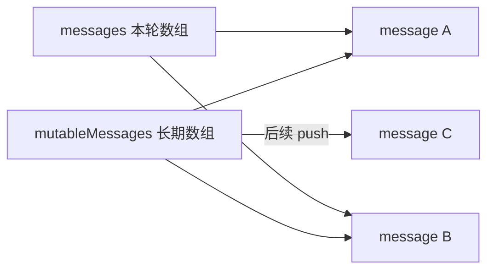
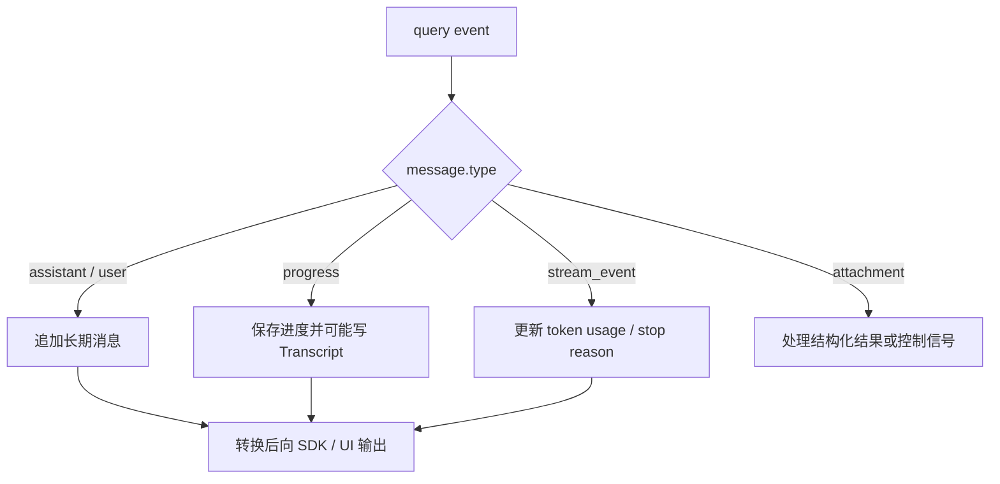
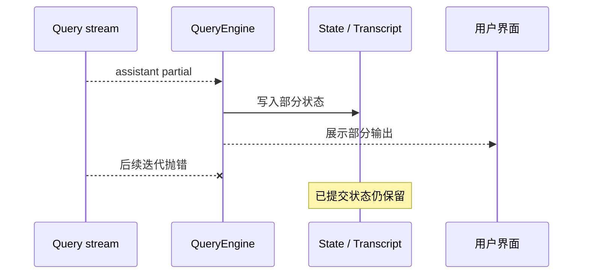
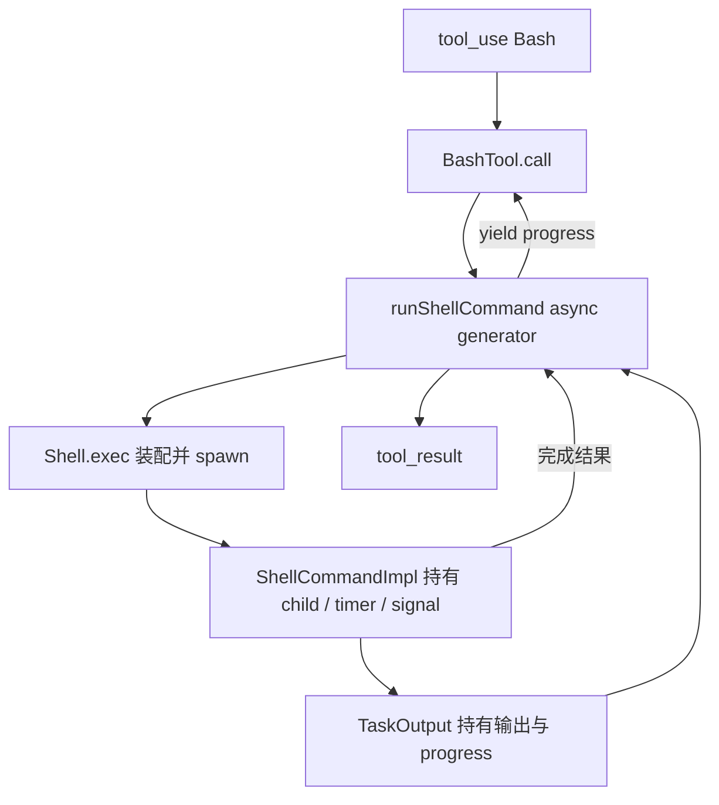
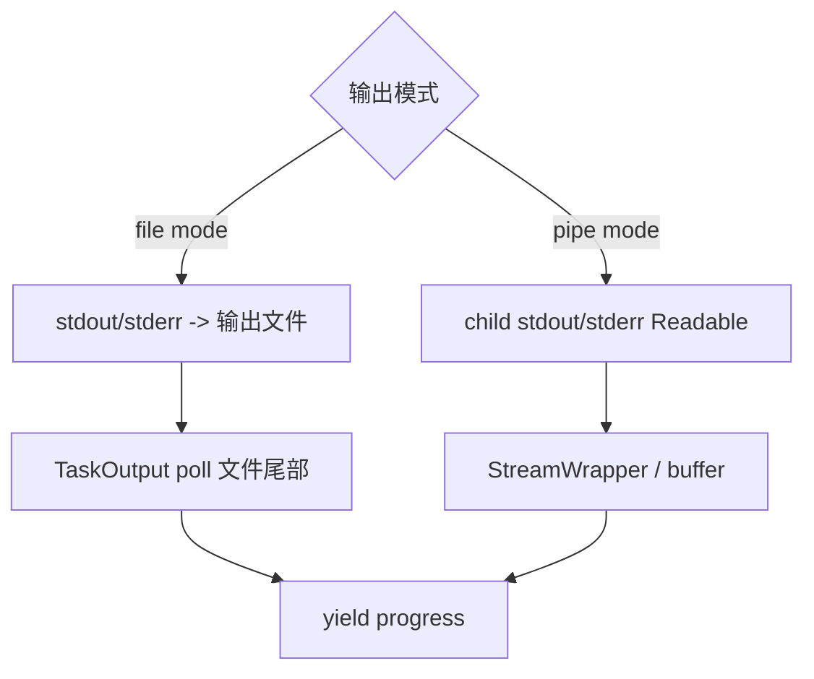
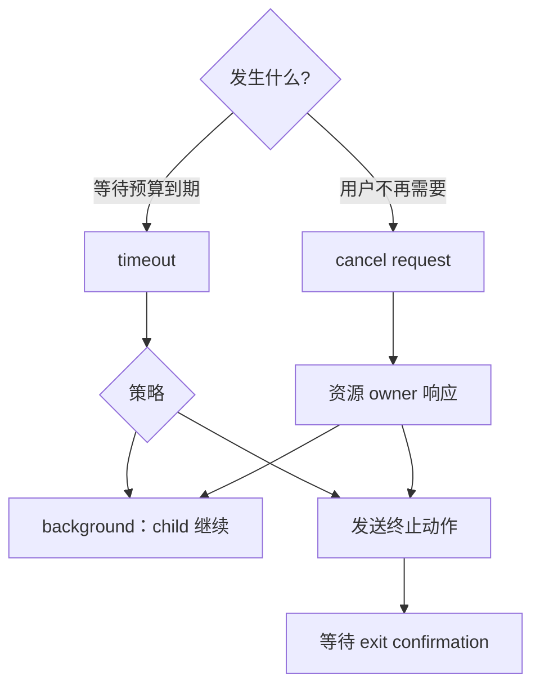
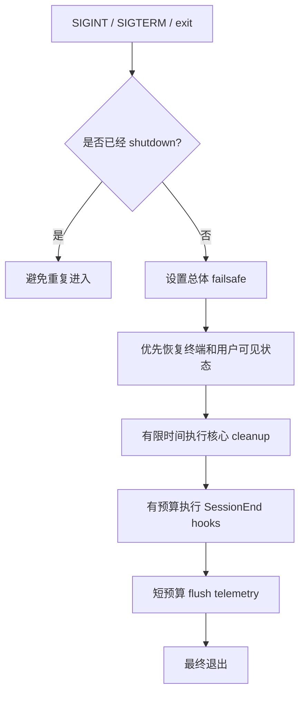

# Claude Code 源码拆解（三）：用户按下 Ctrl+C 后，任务真的停了吗？

> 本篇是 M01–M04 合并重构教材的第三部分。
>
> **上一篇：** `curriculum/units/M02/final.md`——契约、权限、`tool_use/tool_result` 与事件流。
>
> **下一篇：** `curriculum/units/M04/final.md`——源码证据、实验、企业 Harness 与面试表达。

## 本篇继续追踪登录 500 任务

Claude Code 已经定位代码，现在模型请求运行测试：

```json
{
  "type": "tool_use",
  "id": "tool_03",
  "name": "Bash",
  "input": {
    "command": "./mvnw test"
  }
}
```

测试启动后不断输出。十几秒后，用户按下 Ctrl+C。

一个初学者很容易写出：

> **[教学伪代码]**

```ts
controller.abort('user_cancelled')
return { status: 'cancelled' }
```

这段代码只能证明系统记录了“用户想取消”。它不能证明：

- 模型网络请求已经停止；
- Bash 子进程已经退出；
- Bash 启动的孙进程已经退出；
- stdout/stderr 的文件描述符已经关闭；
- timer 和 listener 已经清理；
- 临时文件和工作区现在可以安全复用。

本篇最重要的一句话是：

> **取消是意图，终止是动作，退出是事实，清理是收尾。**

---

# 一、先理解“谁拥有它”

源码里到处都有变量，但不是每个变量都对一份状态负最终责任。

**Owner（所有者）** 指真正持有一份状态或资源，并负责决定它何时修改、转移和释放的组件。

登录任务里至少有四类 owner：

| 对象 | 典型 owner | 责任 |
| --- | --- | --- |
| 跨轮消息、usage、权限拒绝 | QueryEngine | 在同一会话中持续保存 |
| 当前轮发给模型的消息视图 | submitMessage / query 当前调用 | 只服务本轮请求 |
| child process、timeout、abort listener | ShellCommand | 管理命令生命周期 |
| 输出文件、buffer、poller | TaskOutput | 保存和增量读取命令输出 |

为什么 owner 重要？因为取消和失败时，你必须知道该找谁收敛资源。把 child handle 藏在一个局部变量里、让上层只持有 Promise，会导致取消时根本找不到真实工作。

---

# 二、长期消息与本轮视图不是同一个容器

当前快照的 QueryEngine 持有 `mutableMessages`，它是跨多轮会话的长期消息 store。

一次 `submitMessage()` 又可能创建本轮视图：

> **[源码事实·简化]**

```ts
this.mutableMessages.push(...messagesFromUserInput)
const messages = [...this.mutableMessages]
```

数组展开创建了一个新的数组容器，但里面的 message 对象仍可能共享引用。



这叫 **浅快照（shallow snapshot）**：

- 两个数组长度可以分离；
- 元素对象仍可能共享；
- 向长期 store `push`，不会自动增加旧视图的长度；
- 原地修改共享对象，两个视图都可能观察到。

初学者不需要记术语，但要形成习惯：

> 看到复制就画引用，看到 `push` 就标目标 owner。

---

# 三、事件到达后，状态会边运行边提交

上一篇讲过，QueryEngine 使用 `for await` 逐条消费 Query 事件。每一种事件可能产生不同副作用：



**Transcript** 可以理解为可持久化的会话运行记录，帮助恢复、审计和重放关键历史。

## 1. 流中途失败不会自动回滚

假设发生：

```text
1. Query yield 一条 assistant 消息
2. QueryEngine 把消息写入 mutableMessages
3. UI 已展示这段文字
4. Transcript 写入或进入写队列
5. 下一次 iterator.next() 才抛异常
```

第 5 步不会自动撤销前 4 步。



因此“请求失败”不能只用一个布尔值描述。至少要区分：

- 事件已接收；
- 状态已提交；
- 外部副作用已发生；
- 流最终失败。

---

# 四、`await` 只暂停当前函数，不会冻结整个程序

很多初学者看到：

```ts
const result = await exec(command)
```

会误以为 JavaScript 在原地等待，其他事情都不发生。

更准确的理解是：

```text
当前 async function 暂停
-> JavaScript 线程可以处理其他已就绪工作
-> child 继续运行并产生输出
-> timer、I/O、Promise continuation 继续被调度
-> Promise 完成后，await 后面的代码恢复
```

先建立一个够用的模型：

```text
当前同步调用栈
-> microtask（Promise / await continuation）
-> timer、I/O、child-process 等宿主回调
```

这不是完整 Node event loop 教程，但足以理解：

- `await` 不会自动取消子进程；
- `Promise.race` 不会创造新线程；
- 多个 Promise 只是竞争谁先完成并唤醒等待者；
- 输掉 race 的工作默认仍然继续。

---

# 五、一条 Bash 命令经过哪些组件

第一次阅读只看人话链路：

```text
模型请求 Bash
-> Bash 工具检查权限
-> 创建命令执行对象
-> spawn 子进程
-> 收集输出并产生 progress
-> 等待自然完成、取消、超时或转后台
-> 形成 tool_result
```

再映射源码：

```text
BashTool.call
-> runShellCommand
-> Shell.exec
-> child_process.spawn
-> ShellCommandImpl
-> TaskOutput
```



## 1. spawn 前为什么还要检查一次取消

> **[源码事实·简化]**

```ts
if (signal.aborted) {
  return createAbortedCommand()
}
```

这叫 pre-spawn cancellation：如果任务在创建进程前已经取消，就不要启动一个明知不需要的 child。

但检查结束后仍然可能发生竞态，所以正常路径还需要注册 abort listener。

---

# 六、stdout/stderr 不一定直接流进 JavaScript

> **本节属于源码深挖，第一次阅读只记住结论。**

直觉上的实现是：

```text
child.stdout.on('data') -> UI
```

但当前默认 Bash 路径可以采用 file mode：stdout 和 stderr 写入输出文件，再由 TaskOutput 定期读取文件尾部产生 progress。

| 模式 | 输出怎样走 | 适合什么 |
| --- | --- | --- |
| file mode | child 写文件，TaskOutput 轮询 | 大输出、后台保留、减少 JS 堆压力 |
| pipe mode | Node Readable 产生 data chunk | 调用方需要实时回调 |



这说明流程图必须来自具体实现，不能看到 `spawn()` 就自动画成 `stdout data event`。

---

# 七、timeout、cancel、kill、background 必须分开

这四个词经常被错误地合并成“任务停止了”。

## 1. timeout：等待预算用完

timeout 只说明规定时间到了。策略可以选择：

- 终止任务；
- 把长任务转到后台继续；
- 只发送告警；
- 升级到更强终止动作。

## 2. cancel：上层表达不再需要

用户按 Ctrl+C、客户端断开或父任务失败，都可能产生 cancel reason。

取消是合作式通知。资源 owner 必须监听它，才能把意图变成动作。

## 3. kill：对资源发出终止动作

子进程可能需要：

- terminate；
- tree-kill；
- 强制 kill；
- 容器 runtime 终止；
- Windows Job Object 等平台机制。

## 4. background：所有权转移

background 不是取消。child 继续运行，只是前台不再等待，新的 durable task owner 接管：

- 输出限制；
- 后续 kill；
- 完成通知；
- 恢复与清理。



---

# 八、AbortSignal 不是 kill 方法

`AbortController.abort(reason)` 做的事情可以概括为：

```text
把 signal 置为 aborted
+ 保存 reason
+ 通知 listener
```

它不会自动知道：

- 应该关闭哪个 socket；
- 应该杀哪个 PID；
- 是否要保留后台任务；
- 需要等待多久；
- 失败后如何升级。

这些动作由具体资源 adapter 实现。

## 1. 父取消怎样传播给子任务

典型关系是单向传播：

```text
父任务取消 -> 子任务取消
子任务局部失败 -X-> 自动取消整个父任务
```

子失败是否升级到父级，应该由业务策略决定，而不是取消工具默认决定。

## 2. 多个取消来源如何合并

一个工具可能同时受到：

- 用户取消；
- 父任务失败；
- deadline；
- 系统 shutdown。

组合 signal 时要清理 timer 和 listener，并决定是否保留第一个 cancel reason。否则最后只知道“被取消”，却不知道是谁触发的。

---

# 九、发送 kill 与确认退出是两个时刻

某些实现为了让上层快速收敛，会在发出 tree-kill 后就 resolve 一个逻辑结果，而不等待真正的 OS `exit`。

这不是绝对错误，但协议必须说清楚：

```text
TerminationSent：已经发送终止请求
ExitConfirmed：操作系统或平台确认资源退出
```

如果要删除临时目录、释放租户配额或复用工作区，只看到 `TerminationSent` 可能不够安全。

> **[企业设计迁移]**

```text
CancelRequested
-> TerminationSent
-> ExitConfirmed
-> CleanupFinished
```

超过 deadline 仍未确认退出，可以进入：

```text
强杀升级
-> 隔离工作区
-> 标记 termination_unconfirmed
-> 告警与人工处理
```

---

# 十、`Promise.race` 不会取消输家

> **[教学伪代码]**

```ts
await Promise.race([
  command.result,
  timeoutPromise,
])
```

如果 timeoutPromise 先完成，只说明等待者先观察到超时。

command 仍可能：

- 继续占用 CPU；
- 继续写文件；
- 继续输出；
- 最后产生副作用。

可靠 timeout 至少包含：

```text
deadline 到达
-> 发出取消/终止动作
-> 等待有限确认
-> 必要时升级
-> 清理 timer 与 listener
```

`unref()` 也不是取消 timer。它只表示这个 timer 本身不应该成为维持 Node 进程存活的理由；如果进程因为其他资源仍活着，timer 到期后依然可能执行。

---

# 十一、cleanup 与 cancel 不能互换

cleanup 常见职责：

- 移除 event listener；
- 清理 timer；
- 停止 poller；
- 释放 buffer 和对象引用；
- 关闭临时 handle。

它不一定负责终止仍在运行的 child。

错误顺序：

```text
先 cleanup
-> 丢失 child handle
-> child 仍在运行
-> 系统再也找不到 owner
```

合理顺序：

```text
请求停止
-> 发送终止动作
-> 等待确认或完成所有权转移
-> cleanup
```

## 1. `finally` 是挂接清理的位置，不是清理完成的证明

生成器提前关闭时 `finally` 执行，只说明控制流进入收尾。你还必须查看 `finally` 内部是否调用了真正的 abort、kill、destroy 和 cleanup。

---

# 十二、graceful shutdown 为什么必须有预算

服务关闭有两个极端：

- 无限等待：部署和故障恢复会卡死；
- 立即退出：可能丢 Transcript、破坏终端状态、留下工具资源。

当前快照采用预算化思路：



企业 Agent 服务可以按价值排序：

1. 停止接收新任务；
2. 持久化 checkpoint 和幂等状态；
3. 取消模型与工具；
4. 等待有限退出确认并升级；
5. 尽力 flush 次要 telemetry；
6. 到达总预算后退出。

---

# 十三、本篇实验：生成器退出不等于 timer 停止

## 环境

- Node.js 18 或更高；
- 新建 `cancel-vs-cleanup.mjs`。

## 第一次运行：故意泄漏 timer

> **[Clean-room 实验]**

```js
async function* stream(trace) {
  const timer = setInterval(() => trace.push('timer.tick'), 20)

  try {
    yield 'first'
    yield 'second'
  } finally {
    trace.push('generator.finally')
    // 故意不 clearInterval(timer)
  }
}

const trace = []

for await (const event of stream(trace)) {
  console.log('event:', event)
  break
}

await new Promise(resolve => setTimeout(resolve, 80))
console.log(trace)
process.exit(0)
```

预期看到：

```text
event: first
[
  'generator.finally',
  'timer.tick',
  'timer.tick',
  ...
]
```

## 第二次运行：连接真实 disposer

在 `finally` 中加入：

```js
clearInterval(timer)
```

再次运行后，不应继续出现 `timer.tick`。

四句话报告：

1. **预测：** `break` 会让生成器和它创建的资源都停止；
2. **观察：** `finally` 执行，但 timer 继续；
3. **证明：** 控制流退出不等于外部资源退出；
4. **没有证明：** 本实验没有证明 Claude Code 所有网络请求和子进程都会泄漏。

---

# 十四、常见错误理解总表

| 错误理解 | 正确理解 |
| --- | --- |
| `await` 会冻结整个 Node 程序 | 只暂停当前 async function |
| Query 抛错会回滚消息和 UI | 已提交事件和副作用通常保留 |
| `signal.aborted=true` 表示任务已停 | 只表示取消通知已发出 |
| timeout 就是 kill | timeout 是预算事件，策略决定后续动作 |
| background 就是取消 | background 是所有权转移，任务继续 |
| 发出 kill 就能释放全部资源 | 还要等待 ExitConfirmed 或隔离 |
| `Promise.race` 会取消输家 | 输家默认继续工作 |
| `unref()` 等于 clearTimeout | 它只移除 keep-alive 权重 |
| finally 执行表示资源已关闭 | 还要看是否连接真实 disposer |
| cleanup 可以代替 cancel | cleanup 不能安全终止无人持有的工作 |

---

# 十五、本篇面试题

## 问题：AbortSignal 触发是否等于子进程已经退出？

**两分钟回答：**

> 不等于。AbortSignal 只是一份 one-shot 取消通知和 reason，真正的资源动作由 owner 的 listener 实现。模型请求需要 abort HTTP，Readable 需要 destroy，child process 需要 terminate 或 tree-kill，timer 需要 clear。即使 kill 已经发出，也要区分 TerminationSent 和 ExitConfirmed；有些实现为了让上层快速收敛，会先 resolve 逻辑结果，并不保证 OS 已报告 exit。我的生产设计会把 CancelRequested、TerminationSent、ExitConfirmed 和 CleanupFinished 分成事件，超过 deadline 未确认就升级强杀或隔离，资源配额和工作区在强确认前不复用。

**记忆锚点：** 通知、动作、确认、清理。

## 问题：timeout、cancel、kill 和 background 有什么区别？

**两分钟回答：**

> timeout 是等待预算到期，cancel 是上层表达不再需要，kill 是资源终止动作，background 是把仍然运行的任务交给新 owner。四者不能压成一个 cancelled 布尔值。Claude Code 的长 Bash 命令在某些条件下超时后可以转后台继续；background 后必须有 durable task、输出上限、完成通知和后续 kill 能力。生产系统要分别记录 deadline、cancel reason、execution mode、ownerId 和 exit confirmation，这样恢复时才能判断任务究竟已终止、仍在后台，还是只是不再由前台等待。

**记忆锚点：** 预算、意图、动作、所有权转移。

---

# 十六、进入下一篇前的检查

请确认自己能解释：

1. owner 为什么比变量名更重要；
2. 长期消息 store 与本轮浅快照有什么区别；
3. 流中途失败为什么不会自动撤销前面状态；
4. `await` 为什么不等于所有工作停止；
5. timeout、cancel、kill、background 的区别；
6. 为什么 TerminationSent 与 ExitConfirmed 要分开；
7. 为什么 `Promise.race` 和 `finally` 都不是完整取消方案。

最后一篇会回答另一个常被忽略的问题：

> 我们画出的调用链凭什么可信？看到 import、IDE Call Hierarchy 或代码图连线，能不能直接说一次请求真的走过？怎样用 guard、owner、fake、Trace 和失败实验建立证据？

**下一篇：** `curriculum/units/M04/final.md`
