# M04 别把连线当调用：从类型、图邻接追到真实状态变化

> 本单元主体阅读与源码跟踪约 5 至 6.5 小时。双语言 Trace 实验、反证练习和扩展挑战另计约 2.5 至 4 小时。

你在一个代码图里搜到下面几条关系：

```text
QueryEngine.ts imports query
QueryEngine contains submitMessage
submitMessage calls query
submitMessage indirect_call tool
```

它们看起来都像“有一条边”，但能支持的结论完全不同。前三条里只有第三条接近运行时调用；即使第三条为真，也不代表每次 `submitMessage()` 都会进入 Query。第四条甚至可能是假阳性。

大型 Agent 系统最危险的源码误读，通常不是漏看一个函数，而是把“结构上有关”悄悄升级成“运行时一定发生”。一旦第一条边错了，后面的消息流、状态 owner、取消语义和 Harness 设计都会建立在不存在的路径上。

本单元不教你背一个“源码阅读清单”。我们只追一个可以被证伪的问题：

> 当前 SDK/Headless 路径中，一条 prompt 何时从 `QueryEngine.submitMessage()` 真正进入 `query()`，哪些状态已经在此前改变，什么证据能证明这件事？

这条追踪会把 M01 的类型边界、M02 的异步生成器和 M03 的运行时资源接成一种可重复的方法。本文所说的 QueryEngine 路径属于当前 `claude-code-CLI/` 快照；交互式 REPL 有自己的 `onQuery -> query()` 适配路径，不要因为类名叫 QueryEngine 就把所有运行表面塞进它。

## 先看见“源码关系”不是一种关系

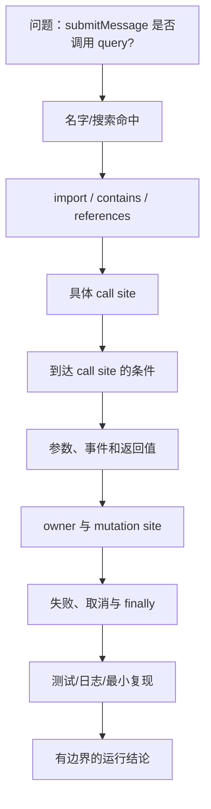

越往下，证据能回答的问题越强：

- 名字相同只能提示可能相关；
- import 证明模块绑定可见，不能证明分支执行；
- class contains method 证明成员归属，不能证明方法被实例化或调用；
- call site 证明某条路径可以调用，还要继续找 guard；
- 参数和事件说明数据怎样穿过边界；
- mutation site 才能说明谁真的改变了状态；
- 测试或最小复现把静态解释变成可观察行为。

低层证据不是“错误证据”。`import` 对定位文件非常有价值，只是它不能回答运行问题。严谨不是要求每次都找到最强证据，而是让证据强度与结论强度匹配。

## Graphify 先缩小搜索面，但不替你作结论

本单元的 Graphify 查询出现过两个很有教育意义的结果。用 `import call state tests` 一类高频词搜索时，图扩展出 253 个节点；缩成 `query engine` 后，又因为 `src/ink/layout/engine.ts` 这个同名模块扩展到 1149 个节点。

图没有坏。问题是查询词没有表达清楚你要追的是哪个运行表面。高命中量只说明结构可达，不说明结果更接近答案。

定向查看 `.submitMessage()` 邻域后，得到两个候选：

```text
EXTRACTED  submitMessage -> query()  at QueryEngine.ts:L675
INFERRED   submitMessage -> tool()   at QueryEngine.ts:L253
```

此时正确动作不是把两条边画进教材，而是打开这两个位置。

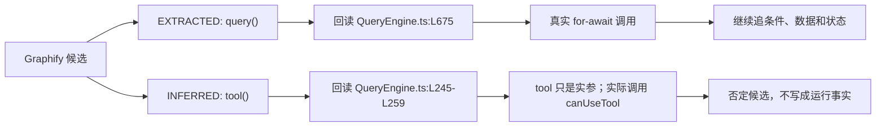

这里有两个重要边界：

1. `EXTRACTED` 也必须回源码核验，因为 AST 能识别语法调用，却不知道你关心的输入是否能到达它。
2. `INFERRED` 不是“低置信度事实”，而是待验证假说；源码一旦否定，就应该停止为它寻找故事。

Graphify 在正文中的作用到这里结束。接下来的事实全部来自直接源码和可运行实验。

## 先验证那条看起来最真的边

`src/QueryEngine.ts` 顶部有：

```ts
import { query } from './query.js'
```

这只建立模块绑定。决定性代码位于 `QueryEngine.submitMessage()`：

```ts
for await (const message of query({
  messages,
  systemPrompt,
  userContext,
  systemContext,
  canUseTool: wrappedCanUseTool,
  toolUseContext: processUserInputContext,
  querySource: 'sdk',
  // ...
})) {
  // 根据 message.type 修改状态并向 SDK yield
}
```

这段代码能证明四件不同的事：

1. `query({...})` 在到达这里时被真实调用；
2. 返回值被当作 `AsyncIterable`，由 `for await` 逐条消费；
3. `messages`、系统上下文、权限 callback 和运行上下文作为本轮参数传入；
4. 事件到达后还要进入循环体，调用发生不等于状态已经更新。

它不能单独证明：

- 每条 prompt 都能到达 L675；
- QueryEngine 是交互式 REPL 的必经入口；
- `messages` 与长期会话数组是同一个数组引用；
- 所有 query event 都进入长期消息状态；
- 发生异常时前面的修改会回滚。

一个好的源码结论通常同时写“证明什么”和“尚未证明什么”。这能阻止后续段落在不知不觉中扩大断言。

## 再向上找 guard：import 了也可以一次都不调用

要回答“是否总会调用”，必须向上找到控制这个 call site 的分支。

`submitMessage()` 先调用 `processUserInput()`：

```ts
const {
  messages: messagesFromUserInput,
  shouldQuery,
  allowedTools,
  model: modelFromUserInput,
  resultText,
} = await processUserInput({
  input: prompt,
  messages: this.mutableMessages,
  querySource: 'sdk',
  // ...
})
```

随后它先把输入阶段产生的消息写入 owner：

```ts
this.mutableMessages.push(...messagesFromUserInput)
const messages = [...this.mutableMessages]
```

再往后才判断：

```ts
if (!shouldQuery) {
  // 产生本地命令输出和 result
  return
}
```

所以真实分支是：

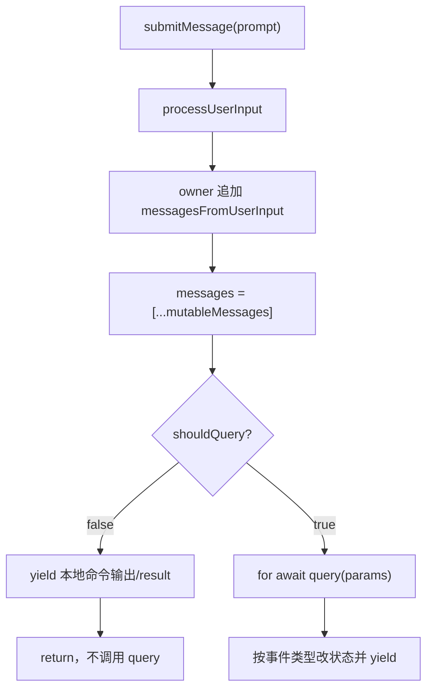

现在才能给出有边界的结论：

> `submitMessage()` 包含一个真实的 `query()` 调用点，但是否执行由 `processUserInput()` 返回的 `shouldQuery` 决定。本地 slash command 可以完成本轮并返回 SDK result，而一次都不调用 `query()`。

注意顺序：即使不进入 Query，用户输入消息也已经被追加，并可能先写 transcript。把 `shouldQuery=false` 简化成“什么都没发生”同样错误。

## 假阳性为什么出现：传一个值，不等于调用它

Graphify 把 `QueryEngine.ts:L253` 标成 `tool()` 的 inferred indirect call。打开源码后看到：

```ts
const wrappedCanUseTool: CanUseToolFn = async (
  tool,
  input,
  toolUseContext,
  assistantMessage,
  toolUseID,
  forceDecision,
) => {
  const result = await canUseTool(
    tool,
    input,
    toolUseContext,
    assistantMessage,
    toolUseID,
    forceDecision,
  )

  if (result.behavior !== 'allow') {
    this.permissionDenials.push({
      tool_name: sdkCompatToolName(tool.name),
      // ...
    })
  }
  return result
}
```

JavaScript/TypeScript 中函数、对象和 class 实例都可以作为普通值传递。这里：

- 被调用的是注入的 `canUseTool(...)`；
- `tool` 是第一个实参；
- 后续读取了 `tool.name`；
- 没有 `tool(...)`，也没有 `tool.run()` 或 `tool.call()`。

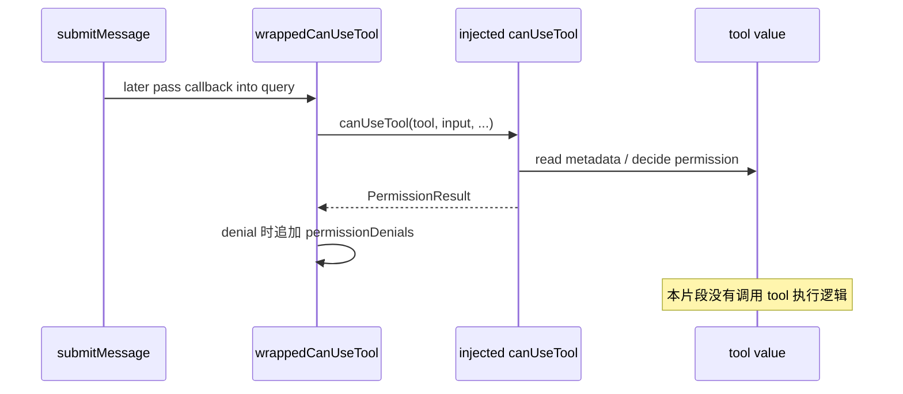

这种误判在 Agent 系统里很常见，因为 Tool、model adapter、hook、permission policy 都经常以 callback 或对象注入。静态图看到“函数调用的参数里出现某个符号”时，可能推断间接关系；你必须区分：

```text
f(x)       -> 调用 f，把 x 作为值传入
x()        -> 调用 x
x.run()    -> 调用 x 的 run 方法
return x   -> 返回 x，不调用
() => x()  -> 创建闭包；只有闭包后来被调用时才调用 x
```

最后一种还要求继续找“谁调用闭包”。只看到闭包定义，不能声称闭包体已经执行。

## 向上追 caller：谁创建 owner，谁只做一轮适配

确认 `submitMessage -> query` 后，还要回答这条链从哪里进入。当前 SDK/Headless 的 convenience wrapper 是 `ask()`。

`ask()` 接收 tools、commands、MCP clients、state getter/setter、read-file cache、model options、AbortController 等依赖，创建 QueryEngine：

```ts
const engine = new QueryEngine({
  cwd,
  tools,
  commands,
  mcpClients,
  canUseTool,
  getAppState,
  setAppState,
  initialMessages: mutableMessages,
  readFileCache: cloneFileStateCache(getReadFileCache()),
  // ...
})
```

然后：

```ts
try {
  yield* engine.submitMessage(prompt, { uuid: promptUuid, isMeta })
} finally {
  setReadFileCache(engine.getReadFileState())
}
```

这里同时出现 M02 与 M03 的知识：

- `yield*` 把 `submitMessage()` 的 SDK events 委托给外层 `ask()`；
- `finally` 保证正常、异常或消费者关闭时都尝试把 read-file state 交回外部 owner；
- finally 能证明状态 handoff 被执行，不能自动证明 Query 内所有外部资源已停止。

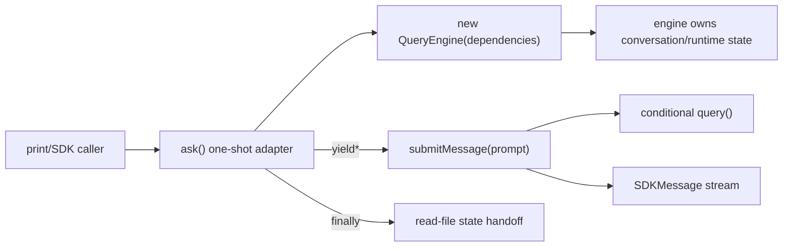

边界必须保留：当前源码注释说 QueryEngine 可供 headless/SDK 使用，并提到未来 REPL 复用；当前交互式 REPL 并不是通过 QueryEngine 才能进入 `query()`。追 caller 时，注释的愿景和当前调用点要分开。

## 找到 state owner，才能解释“调用产生了什么”

`QueryEngine` 的字段比类名更诚实：

```ts
private config: QueryEngineConfig
private mutableMessages: Message[]
private abortController: AbortController
private permissionDenials: SDKPermissionDenial[]
private totalUsage: NonNullableUsage
private readFileState: FileStateCache
private discoveredSkillNames = new Set<string>()
private loadedNestedMemoryPaths = new Set<string>()
```

constructor 把 `config.initialMessages ?? []` 直接赋给 `this.mutableMessages`，并保存或创建 AbortController。类注释明确这些状态可跨同一 conversation 的多个 turn 保留。

不要把所有变量都叫“state”。至少区分：

| 值 | owner | 生命周期 | 谁修改 |
| --- | --- | --- | --- |
| `this.mutableMessages` | QueryEngine | conversation / 多 turn | submitMessage 的输入和事件分支 |
| `messages` | 当前 submitMessage 调用 | 当前 turn 的数组视图 | 本地 push、transcript 路径 |
| `processUserInputContext` | 当前 submitMessage 调用 | 输入处理与 Query 装配 | submitMessage 重建 |
| `permissionDenials` | QueryEngine | engine 生命周期 | wrappedCanUseTool |
| `totalUsage` | QueryEngine | engine 生命周期 | stream_event 分支 |
| `readFileState` | QueryEngine，结束后 handoff | engine 生命周期 | Tool context；ask finally 导出 |

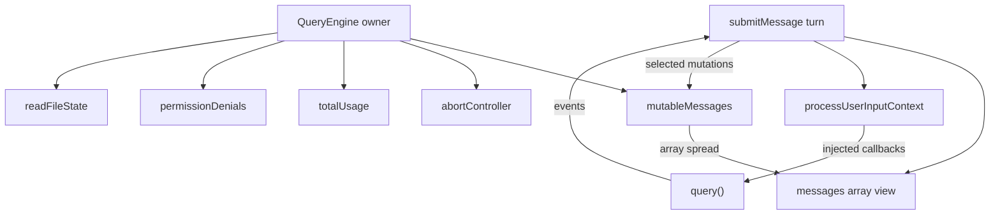

源码追踪到调用点却不找 owner，最终只能说“数据经过了这里”。找到 owner 和 mutation site 后，才能说清失败后留下什么、下一 turn 看见什么、并发时谁会竞争。

## 数组浅快照：引用关系也属于调用证据

下面两行是 M04 的小型试金石：

```ts
this.mutableMessages.push(...messagesFromUserInput)
const messages = [...this.mutableMessages]
```

数组展开创建了新的数组容器。因此后续：

```text
this.mutableMessages.push(x)
```

不会自动增加 `messages.length`；反过来也一样。但元素对象仍共享引用，如果某个 message 对象被原地修改，两个数组视图可能都观察到变化。

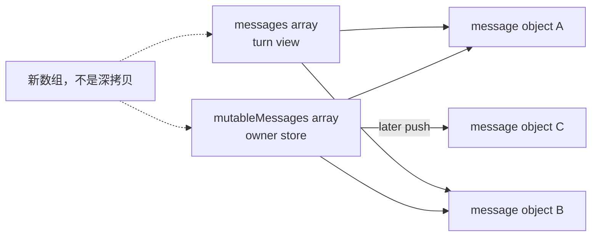

这一点怎样改变运行语义？`query()` 收到的是本轮组装时的数组视图，QueryEngine 仍持有长期 store。循环中有些事件同时 push 到两者，有些只改 owner store，有些只更新 usage。你不能只看变量名 `messages` 猜它们同步。

M11 会完整讲请求投影；M04 只要求掌握追踪动作：看到复制，立刻画引用；看到 push，标明目标数组；看到对象 mutation，再检查元素身份是否共享。

## 向下追 callee：事件不是“query 返回一个结果”

M02 已讲过 `for await`。在这里，它改变的是状态证据：每个 event 到达后，`switch (message.type)` 执行不同副作用。

当前快照可直接确认：

- `assistant`：更新 stop reason，push 到 `mutableMessages`，再 normalize/yield；
- `progress`：push 到 owner store，必要时也 push 到 turn view 并 fire-and-forget transcript，然后 normalize/yield；
- `user`：push 到 owner store，再 normalize/yield；
- `stream_event`：更新本条消息 usage，`message_stop` 时累计进 `totalUsage`；是否向 SDK yield 取决于 `includePartialMessages`；
- `attachment`：push owner store，可能写 transcript，并处理 structured output、max-turns 等子类型；
- `tombstone`：作为控制信号跳过普通消息写入。

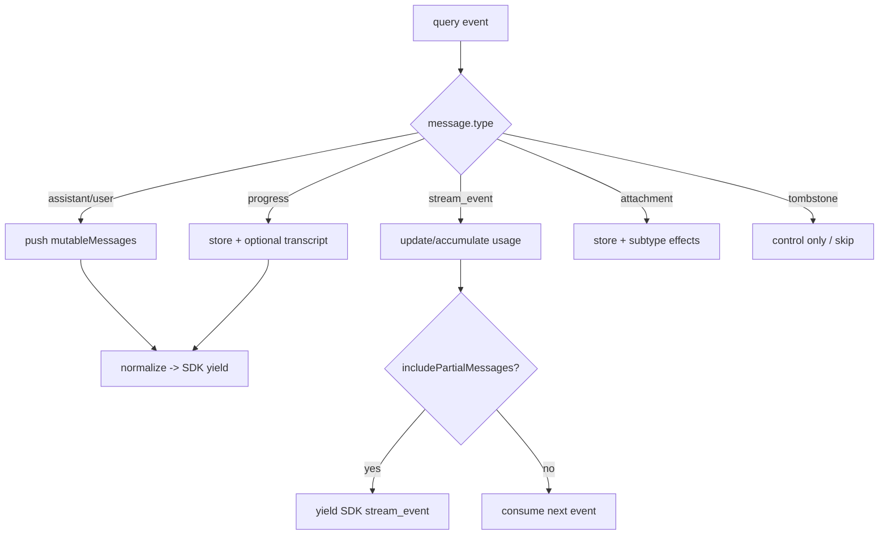

所以“`submitMessage` 调用了 query”只是调用链的一半。完整解释至少还要说：事件怎样被消费，哪个分支修改哪个 owner，哪些状态只在本地累计，哪些值继续对外 yield。

## 失败路径：部分状态不会因为 throw 自动撤销

假设 query 先 yield 一条 assistant message，QueryEngine 已经把它 push 到 `mutableMessages`，随后下一次迭代抛异常。JavaScript 没有自动事务语义；此前的数组 push、transcript enqueue 或 usage 更新不会因为 generator throw 自动回滚。

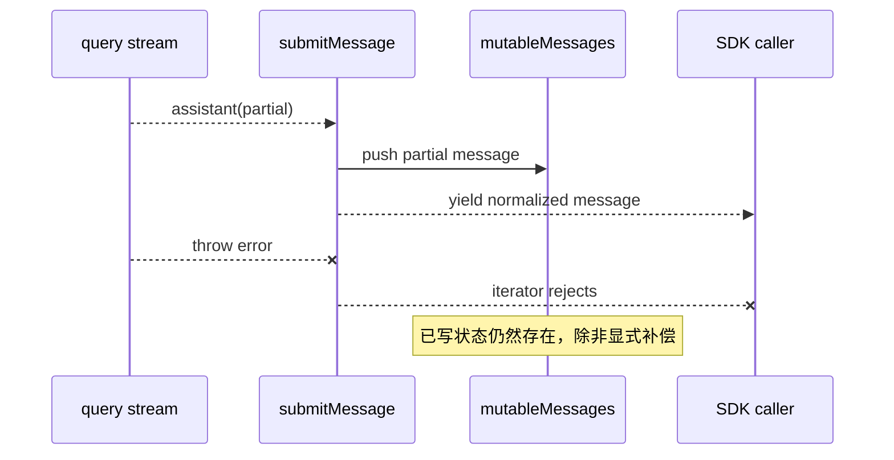

这不是说当前 QueryEngine 一定在所有异常下保留同样状态，而是一个追踪规则：每个副作用发生后，继续寻找它的 rollback、compensation 或 recovery；若没有，就不能假定异常原子性。

企业 Agent 中尤其要区分：

- 内存消息已追加；
- transcript 已持久化或只进入写队列；
- 工具外部副作用已经发生；
- SDK caller 已收到部分流事件；
- 当前 iterator 最终 reject。

“请求失败”不是一个能覆盖这些层次的布尔值。

## 依赖注入让调用图从箭头变成协议

`QueryEngineConfig` 注入 `canUseTool`、`getAppState`、`setAppState`、cache getter/setter、Elicitation handler 等函数。静态源码可以看到字段被调用，却未必知道运行时具体绑定哪个实现。

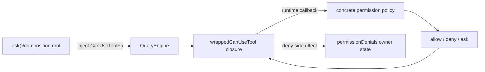

追踪这种边要做三次定位：

1. 调用位置：字段或闭包在哪里被执行；
2. 类型协议：参数和返回值怎样约束实现；
3. composition root：当前运行模式把哪个具体实现传进来。

如果第三步在当前单元不重要，可以停在“调用注入的 CanUseToolFn，具体实现由 caller 决定”，但不能凭字段名虚构具体类。成熟的源码阅读允许有边界地停止。

## 测试不是源码的装饰，也不是万能真相

理想情况下，你会从原仓库测试确认：本地分支不调用 Query、事件分支更新哪些字段、异常后留下什么。当前快照没有提供可直接定位的 QueryEngine 专题测试文件，因此不能声称“官方测试已覆盖”。此外，`src/query.ts` 还 type-import `./query/transitions.js`，但当前快照缺少对应 `src/query/transitions.ts`；这意味着不能把原项目 Query 路径说成已能在本地完整 typecheck 或直接构造运行。静态调用与状态结论仍可从可见源码核验，运行层则必须明确使用独立 clean-room 复现。

这时有三种诚实选择：

- 只保留静态源码能证明的条件结论；
- 找更邻近的测试、fixture、mock 或注释，但不扩大它们的证明范围；
- 写一个不复制私有实现的最小复现，把语言/协议假设变成可观察事件。

本单元采用第三种，同时明确它验证的是追踪方法和 H0 设计，不是给 Claude Code 快照补官方测试。

## 用 TraceLog 把“我看懂了”改成可反驳事件

代码位置：

```text
curriculum/units/M04/code/typescript/
curriculum/units/M04/code/python/
```

TypeScript：

```powershell
cd "D:\agent\Claude code最新\curriculum\units\M04\code\typescript"
node traceHarness.test.ts
node demo.ts
powershell -File typecheck.ps1
```

Python：

```powershell
cd "D:\agent\Claude code最新\curriculum\units\M04\code\python"
python -m unittest -v test_trace_harness.py
python demo.py
```

当前结果：TypeScript 5/5、Python 5/5，两个 demo 正常，TypeScript strict typecheck 通过。

实验里的 `TraceableEngine` 不复制 QueryEngine。它只保留这次方法训练所需的最小结构：

```ts
const processed = await processInput(prompt, history)
ownerMessages.push(...processed.messages)
const requestView = [...ownerMessages]

if (!processed.shouldQuery) return

for await (const message of queryStream(requestView)) {
  ownerMessages.push(message)
  yield message
}
```

每次关键动作由 TraceLog 记录成判别事件：

```text
call.entered
state.mutated
view.snapshotted
event.yielded
branch.skipped
call.failed
```

这继承了 M01 的联合类型，又把 M02 的事件流和 M03 的生命周期观察接进同一测试骨架。

### 主路径：调用、事件和 mutation 必须同时出现

主路径预期：

```text
call processInput
-> owner messages size=1
-> request view size=1
-> call queryStream
-> yield assistant
-> owner messages size=2
```

仅断言最终有两条消息是不够的，因为你不知道 Query 是否被调用、视图何时创建。仅断言 Query 被调用也不够，因为你不知道 owner 是否吸收了事件。Trace 把几个相互独立的结论分开。

### 本地分支：证明“没有调用”

`processInput.shouldQuery=false` 时，测试同时检查：

- query counter 为 0；
- Trace 中没有 `submitMessage -> queryStream`；
- 末事件是 `branch.skipped`，reason 明确。

负结论比正结论更难证明。源码中没搜到调用不代表运行中没调用；这里能证明，是因为依赖被换成可计数 fake，且测试完整执行了目标分支。

### 请求视图：观察两个容器的长度分离

queryStream 保留收到的 request view。它 yield assistant 后，engine owner 变成两条消息，而保留视图仍是一条。这验证数组容器分离，不验证元素深不可变。

### 传参反证：tool.run 计数保持 0

permission callback 收到 ToolProbe，只读取 `name`。若“出现为调用参数”真的等于执行工具，`runCalls` 应大于 0；实际两种语言都保持 0。这直接推翻错误图边。

### 部分失败：先写状态，再抛错

queryStream 先 yield `partial`，再 throw。caller 最终看到异常，但 engine state 保留 user 与 partial assistant，Trace 最后是 `call.failed`。这证明没有自动事务回滚。

## 做六次有目的的破坏

1. 删除 `shouldQuery` guard，观察本地命令也调用 Query；说明 import 不变但运行边改变。
2. 把 `requestView = [...messages]` 改成直接引用，观察后续 owner push 怎样改变视图长度。
3. 在 permission wrapper 中误写 `tool.run()`，让反证测试失败；比较传参和执行的副作用差异。
4. 删除 `state.mutated` trace，只保留 call trace；尝试回答失败后留下什么，体会证据缺口。
5. query yield 后、owner push 前抛错，比较部分状态与对外事件顺序。
6. 让两个注入的 QueryStream 实现产生同样最终消息但不同事件顺序，验证最终快照不能替代过程协议。

每次先写预测，再改代码。你的目标不是“制造红灯”，而是说明哪条源码解释会被这个红灯推翻。

## 一次可复用的追踪循环

现在把本章过程收敛成一个循环，而不是死清单：

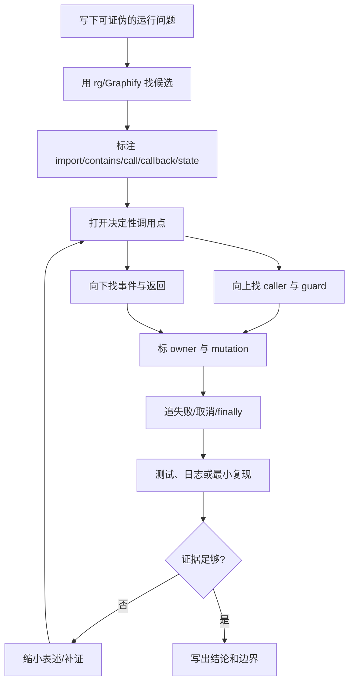

起点必须是问题，不是文件名。例如：

- 好问题：“本地 slash command 是否仍进入模型 Query？”
- 弱问题：“解释 QueryEngine.ts。”

前者自然要求找到 guard、调用点和可观察反例；后者很容易变成 1200 行源码的函数目录。

停止条件也很重要。若你的结论只需要说明“调用注入的权限协议”，找到 callback 类型和调用点就可能足够；若要解释某个企业策略为何拒绝，才需要继续追 composition root。无界追踪不是深度，是失去问题边界。

## H0：合入可观察证据与跨语言行为测试骨架

M01 给了类型与状态契约，M02 给了异步事件端口，M03 给了取消/资源收敛。M04 增加的不是另一套 Agent 功能，而是让这些契约可被持续验证的骨架。

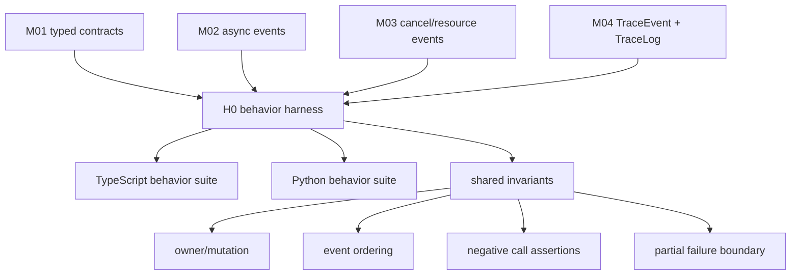

合入契约：

- 事件必须有稳定 type；跨语言比较语义，不比较类名或裸平台值；
- 运行调用必须来自实际 trace 或具体 call site，静态 import 不记作 runtime event；
- mutation event 必须标 owner 与 field；
- 负路径用可计数 fake 或明确 branch event 证明；
- 失败测试同时检查对外结果与已提交状态；
- Trace 是测试与观测接口，不是无限日志；不得记录 prompt、密钥或敏感 Tool 输入全文。

状态所有者：每个运行实例拥有自己的 TraceLog；业务组件仍拥有业务状态，TraceLog 只观察，不反向修改。兼容影响：后续新增事件变体时，TypeScript/Python 测试映射都要更新；生产 telemetry adapter 可以转换事件，但不能改变领域顺序。

失败语义：Trace 写入失败不能阻断核心 Agent 运行；测试模式可以 fail-fast，生产模式应有采样、限流和脱敏。H0 当前使用内存数组，后续 M40 再接完整观测治理。

## Java/Spring：Bean 注入图也不是运行时调用图

Spring 容器能告诉你 Bean A 依赖 Bean B，但不能证明一次请求执行了 B 的哪个方法。`@Autowired PermissionPolicy` 类似 QueryEngineConfig 的 callback 注入：composition root 建立依赖，业务方法在具体分支调用协议。

Java 追踪时也分三层：

```text
类依赖/Bean wiring
-> 方法调用与条件
-> transaction/event/async 边界后的状态提交
```

代理让问题更复杂：`@Transactional`、`@Async`、AOP interceptor 会在源代码直接调用之外插入运行行为。此时调用点仍是起点，但最终边界要结合代理配置、事务测试和 trace/span。不要因为 IDE Call Hierarchy 没显示代理就说它不存在，也不要因为 Bean 图连通就说每次都调用。

本章 H0 TraceEvent 可映射成 Java sealed interface；测试用 fake `ProcessInput`/`QueryPort` 记录 invocation，状态修改用领域事件或 test probe 观察。重要的是保持同一不变量，而不是把 TypeScript 私有字段逐行翻成 Java class。

## Python：duck typing 更需要显式 composition root

Python 把 async callable 直接传入对象非常自然，但静态工具更难确定具体实现。Protocol/type hint 可以说明期望形状，运行 trace 和 fake 才能证明某次绑定。

本章 Python 实现使用：

- async callable 表示 `process_input`；
- async iterator 表示 `query_stream`；
- dataclass TraceEvent 表示可观察事件；
- `IsolatedAsyncioTestCase` 验证调用、分支和部分失败。

它没有模仿 TypeScript private field 或 union 穷尽检查。两种语言共享的是“什么必须被观察”，而不是“怎样写相同语法”。

## LangGraph：图节点边是编排允许，不是所有内部副作用

LangGraph 的 edge 表示控制可以从节点 A 转到节点 B；conditional edge 仍要看 state/router 才知道本次走哪条。节点 B 内部又可能调用模型、Tool、数据库或子进程，这些不会自动出现在上层图边里。

因此调试 LangGraph Agent 也要分层：

- graph transition：哪个 router 选择哪个节点；
- node invocation：节点函数是否真正进入；
- internal dependency call：模型/Tool/存储谁被调用；
- state reducer：哪个字段被怎样合并；
- external effect：真实副作用是否确认。

Claude Code 的 `shouldQuery` 与 LangGraph conditional edge 很相似：结构上存在目标不代表本次会走。不同点是 QueryEngine 用普通 TypeScript 分支和 async generator 实现，不应反过来说它“就是一个 LangGraph”。

## 企业级迁移：把代码图、运行 trace 和契约测试分层治理

企业代码智能系统常把 AST、依赖图、distributed trace、日志和测试覆盖率塞进一个 UI。好的系统不会把它们压成一种“关系”。

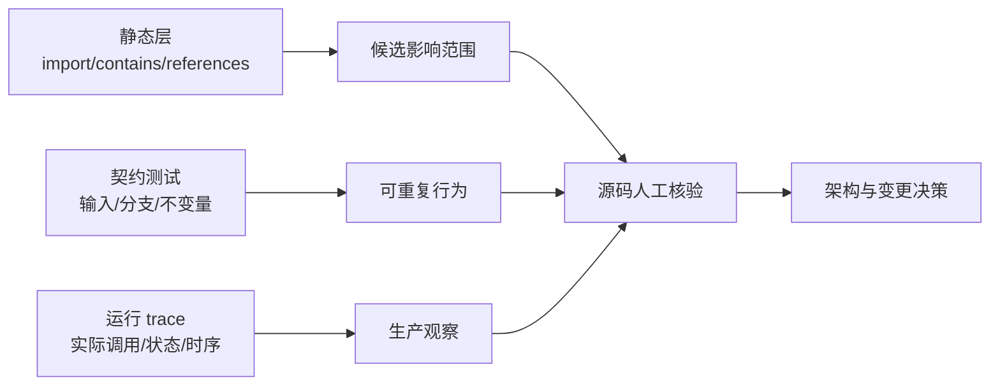

建议把数据模型分开：

- `StaticEdge(kind, source, target, location, confidence)`；
- `RuntimeSpan(runId, caller, callee, start, end, status)`；
- `StateMutation(runId, owner, field, version, reason)`；
- `ContractResult(scenario, invariant, pass/fail)`。

不要让静态关系冒充生产调用率，也不要让一次 trace 冒充所有分支。隐私上，TraceEvent 只保留结构化类型、owner、资源 ID 和脱敏摘要；prompt、Tool 输入、文件内容和凭据按最小化原则处理。成本上，通过采样和关键边强制记录平衡可观测性与延迟。

代码审查时，可以要求每个高风险 Agent 改动回答三件事：新增了哪条静态依赖，改变了哪个运行分支，哪个契约测试或 trace 能观察到。这样 Graphify/IDE 帮你找候选，测试帮你固定行为，生产 trace 帮你发现环境差异，各司其职。

## 资深 Agent 开发岗面试：从“会搜代码”讲到可验证架构

下面 8 道题覆盖面试官会从源码追踪直接延伸出的调用、依赖注入、状态、异步失败和企业观测问题。参考回答都先给结论，再展开 Claude Code 的决定性例子和生产边界。

### 问题 1：看到 A 文件 import 了 B，能不能说 A 在运行时调用了 B？

**参考口语回答（约 2 分钟）：**

> 先说结论：不能，import 只证明模块绑定或类型可见，运行调用还要找到 call site 和能到达它的条件。Claude Code 的 QueryEngine.ts 确实 import 了 query，但 submitMessage 先跑 processUserInput；如果 shouldQuery 是 false，本地 slash command 会产出 result 并 return，一次都不调用 query。只有到 L675 的 `for await (const message of query(...))`，我才能确认真实调用和异步消费。工程上我会把 import、contains、calls、callback 和 mutation 分开记录，再用分支测试或 trace 证明特定输入走了哪条边，避免把依赖图当调用图。

### 问题 2：你拿到一个几千文件的 Agent 仓库，会怎样快速找到一条真实运行链？

**参考口语回答（约 2 分钟）：**

> 先说结论：我先写一个可证伪的运行问题，再从外部入口、决定性 call site、状态 owner 和可观察结果做纵向切片，不会按目录通读。以 QueryEngine 为例，我问的是“本地命令是否仍进入模型 Query”，先用 Graphify 或 rg 找 submitMessage 和 query 候选，然后回源码找 processUserInput 返回的 shouldQuery guard，再向上追 ask 的构造和依赖注入，向下追 for-await 事件怎样 push mutableMessages。最后用可计数 fake 证明 false 分支 queryCalls 为 0。这样图工具负责缩小搜索，源码负责事实，实验负责证伪，三层不会混。

### 问题 3：依赖注入为什么会让静态调用图不完整？你怎样处理？

**参考口语回答（约 2 分钟）：**

> 先说结论：静态代码通常只能看到“调用一个协议字段”，具体实现由 composition root 在运行时绑定，所以要把调用位置、接口契约和装配位置分开追。Claude Code 的 wrappedCanUseTool 调用注入的 canUseTool，并把 tool 作为参数；仅看参数名甚至会误推成 tool 被执行。我要先确认 `canUseTool(...)` 的直接调用，再看 CanUseToolFn 的输入输出，只有问题需要解释具体策略时才继续追 ask 或更上层传入哪个实现。生产上再用 span 标注实现 ID 和决策结果，但不记录敏感输入。这样既承认动态绑定，也不靠猜测补调用边。

### 问题 4：源码追踪里为什么状态 owner 比函数列表更重要？

**参考口语回答（约 2 分钟）：**

> 先说结论：函数列表只能说明代码经过哪里，owner 才决定失败后数据留在哪里、下一轮谁能看见以及并发时谁会冲突。QueryEngine 持有跨 turn 的 mutableMessages、usage、permissionDenials 和 readFileState；submitMessage 还创建当前 turn 的 messages 数组视图。query event 到来后，有的 push 长期 store，有的更新 usage，有的只控制是否向 SDK yield。若只说“消息经过 query”，我解释不了异常后的部分状态或恢复。企业 Harness 我会要求 mutation event 带 owner、field、runId 和 version，跨 owner 写入必须经过显式协议。

### 问题 5：静态源码已经很清楚了，为什么还要最小复现？

**参考口语回答（约 2 分钟）：**

> 先说结论：最小复现不是替代源码，而是把容易误判的语言和协议假设变成可观察反证。比如数组 spread 创建新容器、for-await 部分 yield 后 throw 不回滚、对象作为参数不等于调用，这些都能从规范推导，但一个小测试能明确观察 requestView 长度、tool.run 计数和失败后的 owner state。M04 的 TraceableEngine 不冒充 Claude Code 实现，只验证同一追踪契约。若原仓库测试缺失，我会缩小快照结论，并把 clean-room 结果标为运行验证，绝不说它补齐了官方证据。

### 问题 6：Agent 流式调用中途失败，怎样判断哪些状态需要补偿？

**参考口语回答（约 2 分钟）：**

> 先说结论：按副作用提交点逐个判断，不能把 iterator reject 当事务回滚。Claude Code 的 submitMessage 会边消费 query event 边 push mutableMessages、记录 transcript 或累计 usage；如果已经处理 assistant 后下一次迭代失败，之前的状态可能保留，SDK caller 也可能已收到部分输出。我的设计会把 event accepted、state committed、external effect confirmed 和 stream failed 分成事件，对可逆状态补偿，对 Tool 外部副作用用幂等键或 saga，对 transcript 保持可恢复顺序。测试既看最终 error，也看失败前的事件和 owner state。

### 问题 7：代码图和 distributed trace 应该怎样结合，才不会互相误导？

**参考口语回答（约 2 分钟）：**

> 先说结论：代码图回答“可能有什么结构关系”，runtime trace 回答“这次实际走了什么”，契约测试回答“给定场景必须满足什么”，三者要保留来源和语义，不能合并成一条无类型的边。Graphify 可以提示 submitMessage 邻居，但 inferred tool call 回源码后被否定；一次生产 trace 又只能代表一个输入。企业系统里我会分别存 StaticEdge、RuntimeSpan、StateMutation 和 ContractResult，用源码位置与稳定符号关联。变更评估先看静态影响，再跑契约测试，最后观察灰度 trace 与 SLI，任何一层都不能单独宣布全局真相。

### 问题 8：你会怎样为自己的 Agent Harness 设计可观测性，而不把日志做成新负担？

**参考口语回答（约 2 分钟）：**

> 先说结论：先从少量稳定领域事件和不变量开始，Trace 只观察、不拥有业务状态，也不能阻断主流程。H0 我会记录 call.entered、state.mutated、view.snapshotted、event.yielded、branch.skipped、call.failed，并强制 mutation 带 owner；取消再复用 M03 的 requested、exit confirmed、cleanup。测试模式全量记录并 fail-fast，生产模式采样、限流、脱敏，Trace 写失败降级而不是让 Agent 失败。像 Claude Code 的消息和 usage 分支，我关心类型、顺序和资源 ID，不会把 prompt、Tool 输入或密钥全文放进 telemetry。

真正有区分度的回答不是“我会用 IDE 查引用”，而是你能说明哪种边支持哪种结论、何时需要继续追、怎样用失败输入推翻自己的解释。

## 离开本单元前，完成一次纵向证据闭环

先关掉本文，写下一个问题：“一条本地 slash command 是否调用模型 Query？”画出 `ask -> QueryEngine -> processUserInput -> shouldQuery -> query/local result`，在每条箭头上标 `constructs`、`calls`、`returns flag`、`branches` 或 `yields`，不要都写“经过”。

再打开 Graphify 或 IDE，只把结果记成候选。验证 `.submitMessage -> query()` 的真实 call site；验证 `.submitMessage -> tool()` 为什么是假阳性。用自己的话解释 `canUseTool(tool, ...)` 与 `tool()` 的差别。

随后为 `mutableMessages`、turn-local `messages`、permissionDenials、usage 和 readFileState 标 owner、生命周期和 mutation site。用两个数组盒子画出浅快照，明确容器分离与元素共享。

运行双语言 5 个测试。把 `shouldQuery=false` guard 删除一次，把 permission wrapper 改成执行 tool.run 一次，再让 query 在 partial event 后失败。每次写出哪条解释被红灯推翻，不要只记录“测试失败”。

最后选你自己的 Spring/LangGraph/RAG 项目做同样切片：一个 Bean/节点边、一个真实方法调用、一个状态 reducer、一个外部副作用和一个失败恢复。能把这五者分开，你才真正具备进入 M05 以后复杂运行表面的源码追踪能力。

## 源码定位地图

行号只作当前快照辅助，优先按符号搜索：

- `src/QueryEngine.ts` -> `QueryEngine` fields/constructor -> 跨 turn 状态 owner -> 约 176-207 行。
- 同文件 -> `submitMessage()` -> `wrappedCanUseTool` -> 调用注入 callback、传入 tool、记录 denial -> 约 209、243-270 行。
- 同文件 -> `processUserInput()` 调用 -> 追加 owner messages、创建 turn view、写入 transcript -> 约 410-463 行。
- 同文件 -> `if (!shouldQuery)` -> 本地输出/result 并 return -> 约 556-639 行。
- 同文件 -> `for await (const message of query(...))` -> 真实 Query 调用与参数装配 -> 约 675 行。
- 同文件 -> event switch -> mutableMessages、transcript、usage 与 SDK yield -> 约 753-850 行起。
- 同文件 -> `ask()` -> 创建 QueryEngine、`yield* submitMessage`、finally handoff read-file state -> 约 1186-1294 行。
- `src/query.ts` -> `query()` / `queryLoop()` -> AsyncGenerator 委托边界 -> 约 219-250 行。
- `src/utils/processUserInput/processUserInput.ts` -> `processUserInput()` -> 输入适配结果与 shouldQuery 来源。

证据说明：上述调用、条件、owner 与 mutation 是当前快照事实；Graphify 查询只用于候选定位并包含一次被源码否定的 inferred edge；双语言 TraceableEngine 是 clean-room 运行验证；H0 TraceEvent、TraceLog、测试骨架和企业观测模型是设计迁移。当前快照未发现可直接定位的 QueryEngine 专题测试，并缺少 `src/query/transitions.ts`，因此没有把 clean-room 测试写成官方实现证明，也没有声称原 Query 路径已在本地通过 typecheck。
