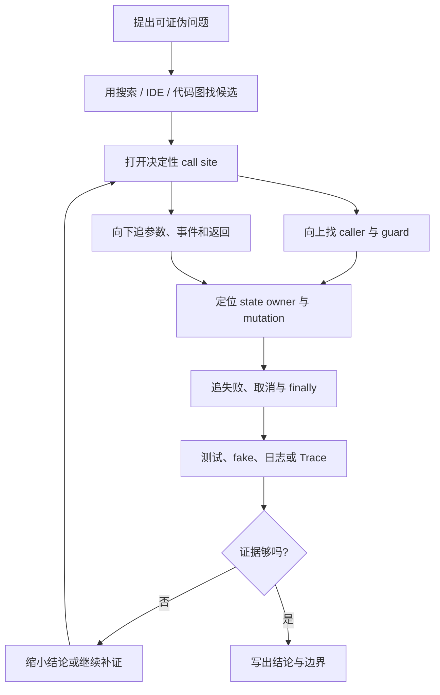
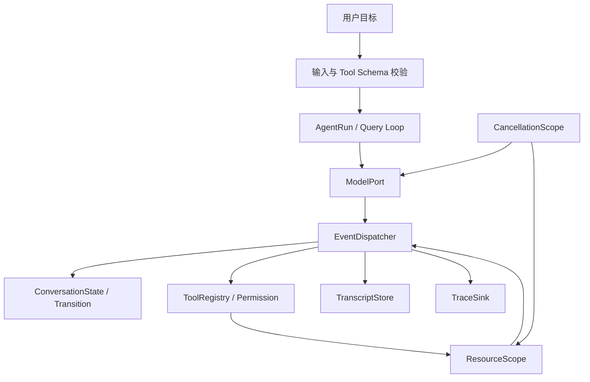

# Claude Code 源码拆解（四）：怎样证明 Agent 真按你画的链路运行？

> 本篇是 M01–M04 合并重构教材的第四部分，也是总结篇。
>
> **上一篇：** `curriculum/units/M03/final.md`——状态所有权、子进程、取消与资源收敛。
>
> **下一步：** 回到真实源码，用本篇方法选择一条运行链做纵向追踪。

前三篇已经建立了三层理解：

```text
M01：模型怎样通过客户端和工具完成一次任务
M02：数据、权限与事件怎样进入执行过程
M03：状态与现实资源怎样在取消和失败时收敛
```

最后还缺一层：

> 我们凭什么相信这些解释？

很多源码文章最大的错误不是漏掉一个函数，而是把“结构上相关”悄悄升级成“运行时一定发生”。

本篇会继续用登录 500 案例回答：

- 看到 `QueryEngine` import `query`，能否说每次都调模型；
- 参数里出现 `tool`，能否说工具已经执行；
- 怎样证明 `/help` 分支没有调用 Query；
- 状态先写入、流后失败时，测试应该检查什么；
- 怎样把四篇知识组合成企业级 Agent Harness。

---

# 一、从一个错误的源码图开始

假设代码图工具返回：

```text
QueryEngine.ts imports query
QueryEngine contains submitMessage
submitMessage calls query
submitMessage indirect_call tool
```

初学者很容易画成：

```text
QueryEngine -> submitMessage -> query -> tool
```

然后说：“这就是一次请求的运行链。”

问题是，上面四条“边”根本不是同一种关系。

| 关系 | 最多能证明什么 | 不能证明什么 |
| --- | --- | --- |
| import | 模块绑定或类型可见 | 本次运行执行了目标 |
| contains | 方法属于类或文件 | 方法已被创建或调用 |
| call site | 某条代码路径可以调用 | 当前输入一定能到达 |
| callback injection | 运行时调用某个协议 | 具体实现是谁，除非继续追装配 |
| state mutation | 某个 owner 字段被修改 | 失败后一定回滚 |
| runtime trace | 这一次运行实际发生 | 其他输入也一定相同 |

因此源码研究的第一条纪律是：

> 连线必须带类型，结论强度不能超过证据强度。

---

# 二、一条可信源码结论怎样逐层建立

不要从“解释这个 1500 行文件”开始。先提出一个可以被反例推翻的问题：

```text
本地斜杠命令 /help 是否会调用模型 Query？
```

然后按下面的循环追踪：



这不是机械检查表，而是一种反复缩小不确定性的过程。

---

# 三、真实调用点只证明“可能调用”

当前快照里，`QueryEngine.submitMessage()` 存在真实调用：

> **[源码事实·简化]**

```ts
for await (const message of query({
  messages,
  systemPrompt,
  canUseTool: wrappedCanUseTool,
  // ...
})) {
  // 根据 message.type 更新状态并向外输出
}
```

这段代码可以证明：

- 到达这里时会真实调用 `query()`；
- 返回值按异步事件流消费；
- 消息、系统上下文和权限 callback 被传入；
- 事件到达后还会进入循环体产生副作用。

但它不能单独证明每种输入都能到达这里。

向上继续追，会看到：

> **[源码事实·简化]**

```ts
const processed = await processUserInput(prompt)

this.mutableMessages.push(...processed.messages)
const messages = [...this.mutableMessages]

if (!processed.shouldQuery) {
  return
}
```

所以准确结论是：

> `submitMessage()` 包含真实 Query 调用点，但本次是否进入模型由 `processUserInput()` 返回的 `shouldQuery` 决定；本地命令可以先改变消息或产生本地结果，然后直接返回。

注意后半句：“没有调用模型”不等于“什么都没发生”。输入消息可能已经进入 owner，Transcript 也可能已记录相关事实。

---

# 四、把对象作为参数，不等于调用对象

代码图可能把下面代码误判为工具执行：

> **[源码事实·简化]**

```ts
const result = await canUseTool(
  tool,
  input,
  context,
)
```

这里真正被调用的是 `canUseTool()`。

`tool` 只是第一个参数。它不等于：

```ts
tool()
tool.run()
tool.call(input)
```

JavaScript/TypeScript 中函数、对象和类实例都可以作为普通值传递。阅读调用图时必须区分：

```text
f(x)       调用 f，把 x 传进去
x()        调用 x
x.run()    调用 x 的 run 方法
return x   返回 x，不调用
() => x()  创建闭包；闭包以后被调用时才调用 x
```

最后一种还要继续寻找“谁调用了闭包”。只看到闭包定义，不能说闭包体已执行。

---

# 五、依赖注入为什么让调用图不完整

**依赖注入（Dependency Injection）** 指调用方把一个实现或 callback 交给组件，而不是组件内部写死具体类。

例如 `QueryEngine` 接收权限协议：

```text
composition root / ask
-> 注入 CanUseToolFn
-> QueryEngine 包装 callback
-> query 在需要时调用权限协议
```

静态代码可能只能看到：

```ts
this.config.canUseTool(...)
```

要解释“最终是哪种权限策略”，还要继续追创建 `QueryEngine` 的装配位置。

追这种边分三层：

1. **调用位置：** 协议字段在哪里执行；
2. **类型契约：** 参数和返回值要求什么；
3. **装配位置：** 当前运行模式传入哪个实现。

如果问题只要求说明“调用了权限协议”，找到前两层就可以停止。无边界地追遍整个仓库不是深度，而是失去问题范围。

---

# 六、状态 owner 比函数列表更重要

函数列表只能告诉你代码经过哪里，owner 才能回答：

- 失败后数据留在哪里；
- 下一轮谁能看到；
- 并发修改时谁会冲突；
- 哪些状态需要补偿。

对 QueryEngine 路径可以先画：

| 状态 | owner | 生命周期 | 典型修改位置 |
| --- | --- | --- | --- |
| `mutableMessages` | QueryEngine | 同一会话多轮 | 输入和事件消费分支 |
| 本轮 `messages` | 当前 submitMessage | 当前轮 | 本轮请求装配 |
| permission denials | QueryEngine | engine 生命周期 | 权限 wrapper |
| total usage | QueryEngine | engine 生命周期 | stream event 分支 |
| child / timeout / signal | ShellCommand | 单命令生命周期 | exit、abort、kill、background |

看到一行状态修改时，固定问三件事：

```text
改的是谁的字段？
这一步已经提交了吗？
后面失败时有没有 rollback 或 compensation？
```

---

# 七、怎样证明“不调用”

证明源码里“有调用点”比较容易；证明某个输入“没有调用”更难。

仅仅搜索不到运行日志不够，因为可能是日志遗漏。更可靠的方法是把依赖换成可计数 fake。

> **[Clean-room 实验]**

```ts
let queryCalls = 0

async function processInput(prompt: string) {
  return {
    messages: [{ type: 'user', content: prompt }],
    shouldQuery: !prompt.startsWith('/'),
  }
}

async function submitMessage(prompt: string) {
  const processed = await processInput(prompt)

  if (!processed.shouldQuery) {
    return 'local result'
  }

  queryCalls += 1
  return 'model result'
}

await submitMessage('/help')
console.assert(queryCalls === 0)

await submitMessage('fix login bug')
console.assert(queryCalls === 1)
```

这个实验能证明：在这份 clean-room 实现和指定输入中，`/help` 分支没有调用 Query。

它不能证明真实 Claude Code 所有斜杠命令都不调用模型。实验结论必须保留适用范围。

---

# 八、Trace 应记录“发生了什么”，而不是复制全部敏感内容

**Trace（运行轨迹）** 是按顺序记录关键运行事件，用来观察一条请求实际走过什么路径。

> **[企业设计迁移]**

```text
call.entered
state.mutated
view.snapshotted
event.yielded
permission.decided
resource.termination_requested
resource.exit_confirmed
branch.skipped
call.failed
```

一条 mutation event 至少应该说明：

```text
runId
owner
field
operation
reason
version / sequence
```

Trace 不应该无脑记录：

- 完整 prompt；
- 文件全文；
- 密钥；
- 未脱敏 Tool input；
- 用户隐私内容。

测试模式可以更严格地全量记录结构事件；生产模式应采样、限流和脱敏。Trace 写入失败通常不应拖垮 Agent 核心运行。

---

# 九、四种证据不能互相冒充

| 证据 | 回答什么 | 常见误用 |
| --- | --- | --- |
| 静态代码图 | 哪些结构关系可能存在 | 把 import 当运行调用 |
| 源码 call site + guard | 什么条件下可以执行 | 忽略动态注入或平台分支 |
| 契约测试 | 给定场景必须满足什么不变量 | 把 clean-room 测试说成官方证明 |
| runtime trace | 这一次实际发生了什么 | 用一次 trace 推断所有输入 |

成熟的结论通常这样写：

> 当前静态快照显示 `submitMessage()` 在 `shouldQuery=true` 路径通过 `for await` 调用 `query()`；`shouldQuery=false` 的本地分支在该调用点前返回。独立 fake 实验验证了“条件分支可以使 Query 调用次数为零”的语言与设计假设，但不替代原仓库完整运行测试。

这段话同时交代了事实、条件、验证方式和边界。

---

# 十、把 M01–M04 串成一个工业级 Agent Harness

下面不是 Claude Code 原始目录结构，而是根据前面机制抽象出的企业 Agent 设计。

> **[企业设计迁移]**

```text
AgentRun
├── ConversationState       # 跨轮消息与 checkpoint
├── RequestProjection       # 当前轮发给模型的只读视图
├── ModelPort               # 模型请求与流式响应
├── EventDispatcher         # 唯一消费上游并分发事件
├── ToolRegistry            # Schema、能力、权限和执行
├── TransitionService       # 运行状态合法迁移
├── CancellationScope       # reason、source、deadline
├── ResourceScope           # 模型流、child、timer、listener
├── TranscriptStore         # 可恢复持久记录
└── TraceSink               # 结构化、脱敏、非阻断观测
```



## 1. 对 Java / Spring 项目的映射

```text
Controller DTO
-> Bean Validation / JSON Schema
-> AgentRunService
-> Flux<AgentEvent>
-> ToolExecutor / ProcessAdapter
-> RunStateRepository(CAS / transaction)
-> Transcript + OpenTelemetry
```

第一次阅读只需要理解：

- `Flux<AgentEvent>` 对应多事件异步流；
- CAS 指 compare-and-set，用版本条件防并发覆盖；
- OpenTelemetry 用于统一 trace、metric 和 log 关联。

## 2. 对 LangGraph 项目的追问

框架提供 State、节点和边，但不会替你决定：

- State 保存外部 DTO 还是内部领域对象；
- reducer 怎样合并并发更新；
- conditional edge 本次是否真的走过；
- 节点内部启动的 child 由谁持有；
- graph cancel 怎样到达模型和工具；
- checkpoint 在哪个事件后提交。

框架提供容器，不替你定义领域不变量。

---

# 十一、初学者应该亲手做的三个实验

前两篇已给出完整代码，这里整理成学习路线。

## 实验 1：类型断言不是运行时校验

位置：M02。

目标：传入 `{ file_path: 42 }`，比较 `as ReadInput` 与真实 parser。

你要证明：

```text
编译器相信了，不代表现实数据变正确了。
```

## 实验 2：生成器退出不等于资源退出

位置：M03。

目标：消费者 `break` 后观察 `finally` 与 `setInterval`。

你要证明：

```text
控制流结束，不代表外部 timer、socket 或 child 自动停止。
```

## 实验 3：用 fake 证明分支没有调用 Query

位置：本篇第七节。

目标：让 `/help` 的 `queryCalls` 保持 0，普通请求变成 1。

你要证明：

```text
有调用点只说明可能调用；完整执行目标分支才能证明本次没有调用。
```

## 实验报告固定写四句话

1. 我原来预测什么；
2. 实际观察到什么；
3. 它证明了什么；
4. 它没有证明什么。

这四句话比“测试通过”更接近真正的源码研究。

---

# 十二、全课程常见错误理解总表

| 错误理解 | 正确理解 |
| --- | --- |
| 模型直接操作本地文件 | 模型产生 `tool_use`，客户端执行 |
| TypeScript 自动校验模型 JSON | 外部数据必须经过运行时 Schema |
| 工具失败可以不返回 | 失败也要形成配对 `tool_result` |
| 用户批准一次等于永久授权 | 授权必须绑定范围和上下文 |
| Agent Query 只需要最终答案 | 过程还包含消息、进度、权限和控制事件 |
| AsyncIterable 天然有背压 | 内部仍可能有无界 queue |
| 流 throw 会自动回滚 | 已提交状态和副作用通常保留 |
| `abort()` 表示资源已经退出 | 它只是取消通知 |
| timeout、kill、background 是一回事 | 分别是预算、动作和所有权转移 |
| `Promise.race` 会取消输家 | 输家默认继续执行 |
| finally 执行表示 cleanup 完成 | 还要检查真实 disposer |
| import 表示本次调用 | 还要找 call site、guard 和 trace |
| 参数里出现 tool 表示执行工具 | 必须看到 `tool.call()` 等真实调用 |
| 一次 trace 能证明所有分支 | 它只证明一次具体运行 |

---

# 十三、面试题分层训练

## A. 入门必会

### 1. Claude Code 为什么不是普通 ChatBot？

**记忆锚点：** 目标、多轮、工具、客户端治理。

> Claude Code 是运行在用户环境中的编程 Agent 客户端。模型根据上下文决定回复还是请求工具，客户端负责校验参数和权限、执行工具、把 `tool_result` 放回历史，再次调用模型。一次任务可能循环很多轮，还要管理消息、取消、错误和持久化。模型决定能力上限，Harness 决定能否安全稳定落地。

### 2. `tool_use` 和 `tool_result` 分别是什么？

**记忆锚点：** 模型请求、客户端执行、ID 配对。

> `tool_use` 是模型产生的结构化工具请求，模型本身没有直接执行本地动作；客户端校验 Schema 和权限后执行，再返回引用同一 tool use ID 的 `tool_result`。成功、参数错误、权限拒绝和取消都应该形成明确结果，让模型知道上一动作发生了什么，也避免消息历史出现孤立工具调用。

### 3. 为什么 TypeScript 类型不够？

**记忆锚点：** 编译期、unknown、Schema、迁移。

> TypeScript 只约束经过编译的内部代码，模型 JSON、磁盘文件和网络 payload 没有经过我们的编译器，所以必须在运行时作为 unknown 校验。Schema 成功后再进入泛型内部契约；状态值合法也不代表当前迁移合法，还要有 transition policy。

### 4. 为什么 Query 要用事件流？

**记忆锚点：** 过程、增量状态、UI、Transcript。

> 一次 Agent 运行会持续产生模型 delta、工具进度、权限请求、结果和控制事件，不能只等最终答案。事件流让 QueryEngine 边消费边更新消息、usage、Transcript 和 SDK 输出。不过流式不等于自动背压和取消，queue 与资源联动仍要单独设计。

## B. 进阶题

### 5. `yield*` 和 `for await` 有什么区别？

> `yield*` 是生成器委托，既转发内层 yielded events，也能取得内层正常 return 的终值；`for await` 是消费者语法，只逐条消费 yield 值，循环结束后没有位置接生成器 return。协议要明确哪些消费者只关心事件，哪些还要结构化 Terminal。

### 6. AsyncIterable 为什么仍然可能 OOM？

> AsyncIterable 只定义取值接口，生产者仍可能把事件不断 push 到无界数组。生产速度长期高于消费速度时照样 OOM。应按事件语义设置有界队列：token delta 可合并、progress 可保留最新值、tool result 和 permission request 需要可靠交付。

### 7. AbortSignal 是否等于子进程已退出？

> 不等于。AbortSignal 只是 one-shot 取消通知，资源 owner 要把它桥接成 abort HTTP、destroy stream、terminate 或 tree-kill。还要区分 TerminationSent 和 ExitConfirmed，超时未确认时升级强杀或隔离，最后才能 cleanup 和复用资源。

### 8. timeout、cancel、kill、background 的区别？

> timeout 是等待预算到期，cancel 是上层不再需要，kill 是资源动作，background 是所有权转移。它们不能共用一个 cancelled 布尔值；background 任务必须有 durable owner、输出限制和完成通知。

## C. 资深追问

### 9. 怎样证明某个输入没有调用 Query？

> 源码中有调用点只能证明可能调用。要证明特定输入没有调用，需要完整执行目标分支，把 Query 依赖替换为可计数 fake，断言调用次数为零，同时观察 branch.skipped 等结构事件。结论只适用于该实现和输入，不能扩大成所有分支。

### 10. 流中途失败，怎样判断哪些状态需要补偿？

> 沿副作用提交点逐个判断。消息可能已进入 mutableMessages，Transcript 可能已写入，用户可能已看到部分输出，Tool 外部副作用也可能已确认；iterator reject 不会自动回滚。应区分 EventAccepted、StateCommitted、ExternalEffectConfirmed 和 StreamFailed，可逆状态补偿，外部副作用使用幂等键、Outbox 或 Saga。

### 11. 依赖注入为什么使静态调用图不完整？

> 静态代码常只能看到调用一个协议字段，具体实现由 composition root 运行时注入。追踪时要分调用位置、类型协议和装配位置；只需要说明协议调用时可以在前两层停止，需要解释具体策略时再追装配和 runtime trace。

### 12. 怎样让源码结论可信？

> 我会分开静态图、源码 call site 与 guard、契约测试和 runtime trace。静态图回答可能关系，源码回答条件，测试固定给定场景的不变量，trace 证明一次实际运行。若快照缺测试，就缩小事实结论，用 clean-room 实验验证语言假设，并明确它不冒充官方实现证明。可靠结论必须同时写证明了什么和没有证明什么。

---

# 十四、写在最后：四道缰绳

四篇教材看起来分别讲主循环、类型、事件、子进程和源码追踪，其实都在回答同一个问题：

> 怎样把模型不完全可靠的推理，变成可以约束、可以观察、可以取消、可以恢复的执行？

## 1. 契约守住进入系统的数据

类型保证内部一致，Schema 验证外部真实性，权限和状态迁移决定动作此刻是否合法。

## 2. 事件守住运行过程

Agent 的价值不只在最终答案。消息、进度、权限、错误和终止都要形成可处理的过程协议。

## 3. 资源域守住现实世界的工作

取消请求、终止动作、退出确认和 cleanup 是四个阶段。用户看见“已取消”而系统留下孤儿进程，是最危险的假成功之一。

## 4. 证据链守住我们对源码的理解

import 只能证明 import，call site 只能证明某条路径可以调用，一次 trace 只能证明一次运行。证据强度必须匹配结论强度。

最后用一句话记住整套教材：

> **模型负责决定，契约负责约束，事件负责连接，资源域负责收敛，证据链负责证明。**

当这些能力同时存在，一个简单的 `while (true)` 才能从 Demo 循环成长为可上线的 Agent 心脏。

---

# 附录：源码定位地图

行号只用于当前静态快照辅助，优先按符号搜索。

## 主循环与会话

- `src/QueryEngine.ts`：构造器、跨轮字段、`submitMessage()`、`shouldQuery`、event switch、`ask()`。
- `src/query.ts`：`query()`、`queryLoop()`、生成器委托与 Terminal。
- `src/utils/processUserInput/processUserInput.ts`：输入适配和 `shouldQuery` 来源。

## 工具契约与权限

- `src/Tool.ts`：`Tool<Input, Output, P>`、能力和默认方法。
- `src/services/tools/toolExecution.ts`：模型 Tool input 运行校验。
- `src/Task.ts` 与 `src/utils/tasks.ts`：两套不同 Task 领域。

## 事件流

- `src/services/api/claude.ts`：流式委托和手动 `.next()` 路径。
- `src/services/tools/StreamingToolExecutor.ts`：progress/results 缓冲与 drain。
- `src/utils/stream.ts`：单消费者 push-to-pull 队列。

## 资源生命周期

- `src/tools/BashTool/BashTool.tsx`：`BashTool.call()` 与 `runShellCommand()`。
- `src/utils/Shell.ts`：pre-abort、spawn、输出模式和装配。
- `src/utils/ShellCommand.ts`：child、timeout、abort、kill、background 和 cleanup。
- `src/utils/abortController.ts`：父子取消传播。
- `src/utils/combinedAbortSignal.ts`：多个 signal 与 timeout 合并。
- `src/utils/cleanupRegistry.ts`：全局 cleanup。
- `src/utils/gracefulShutdown.ts`：预算化 shutdown 与 failsafe。

## 证据边界

本文中的 Claude Code 行为描述来自当前静态快照；三个实验属于 clean-room 运行验证；企业 AgentRun、ResourceScope、TraceSink、Spring 和 LangGraph 映射属于设计迁移。快照中缺失的纯类型文件、测试或构建元数据，没有通过猜测补成“完整官方事实”。
