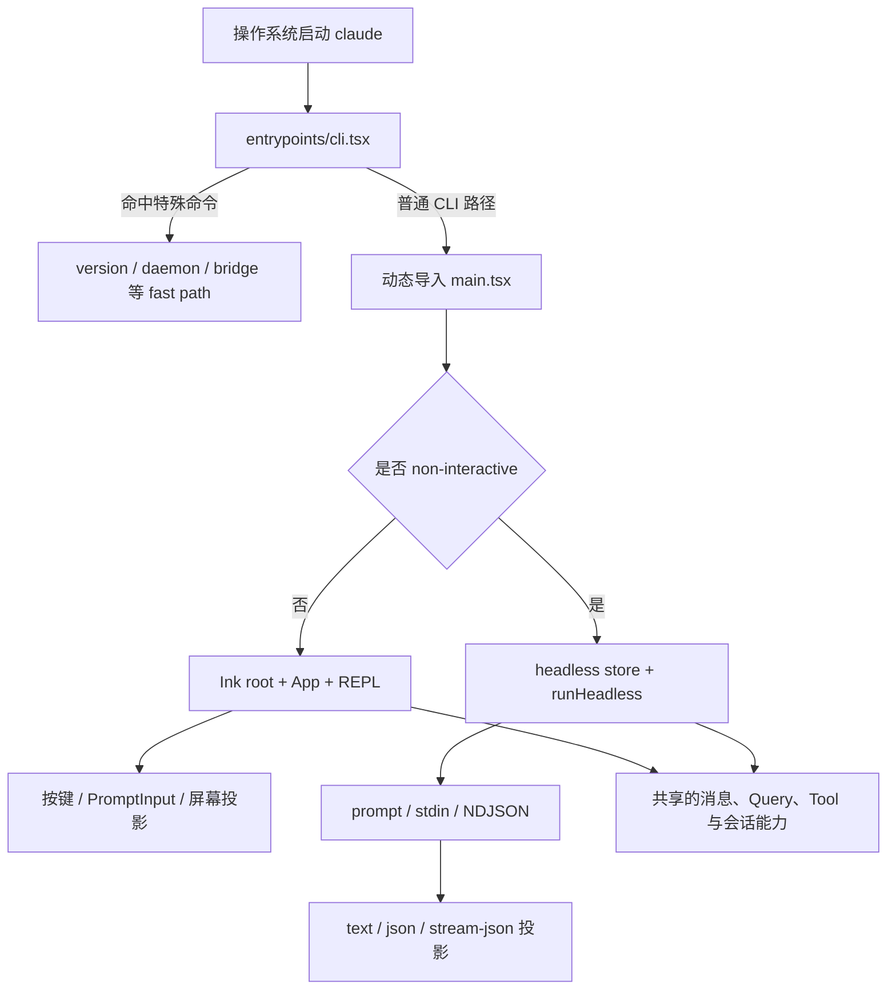
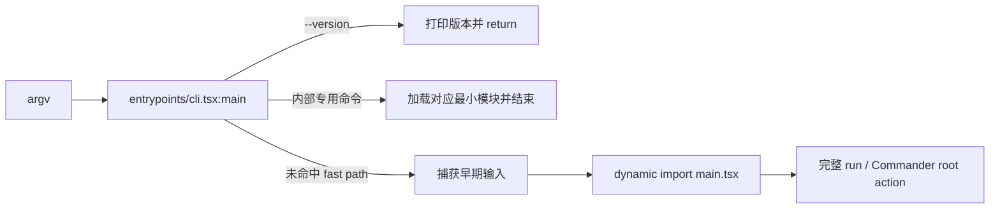
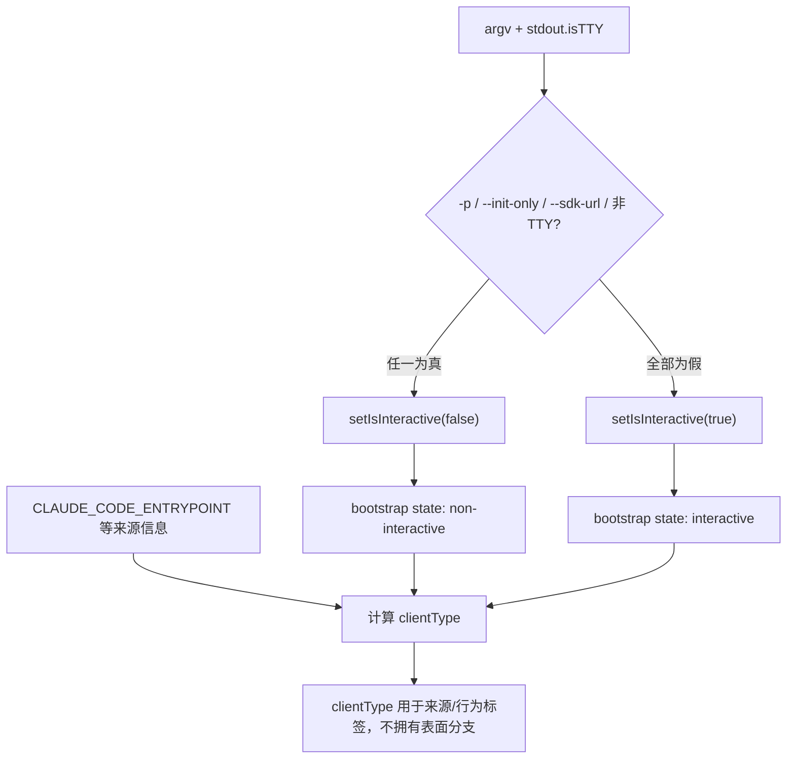
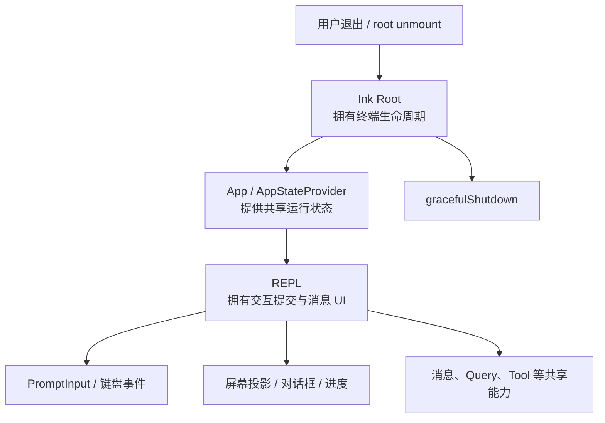
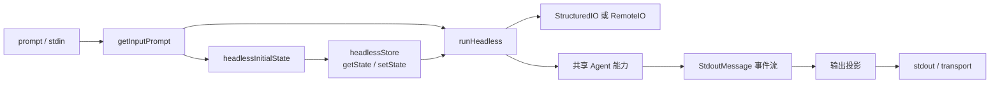
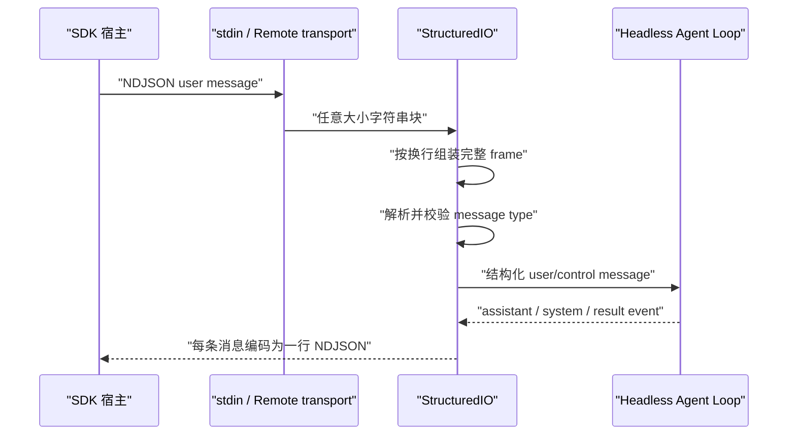
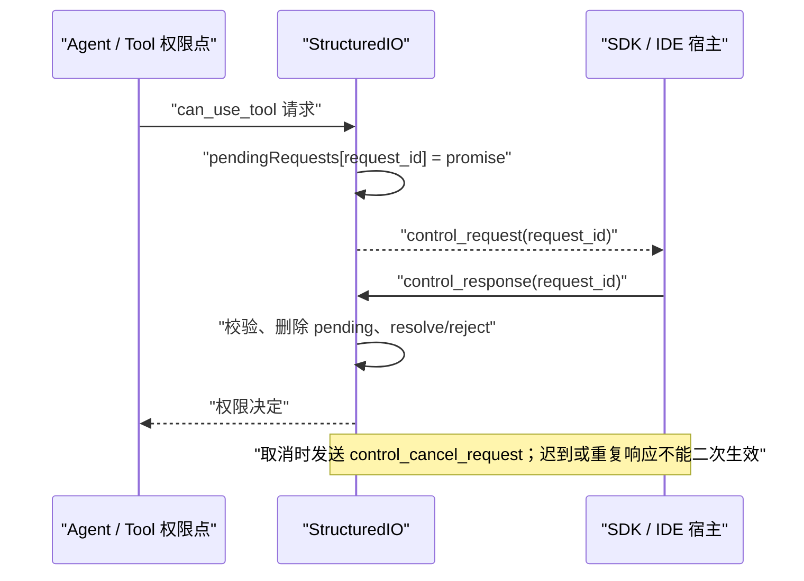
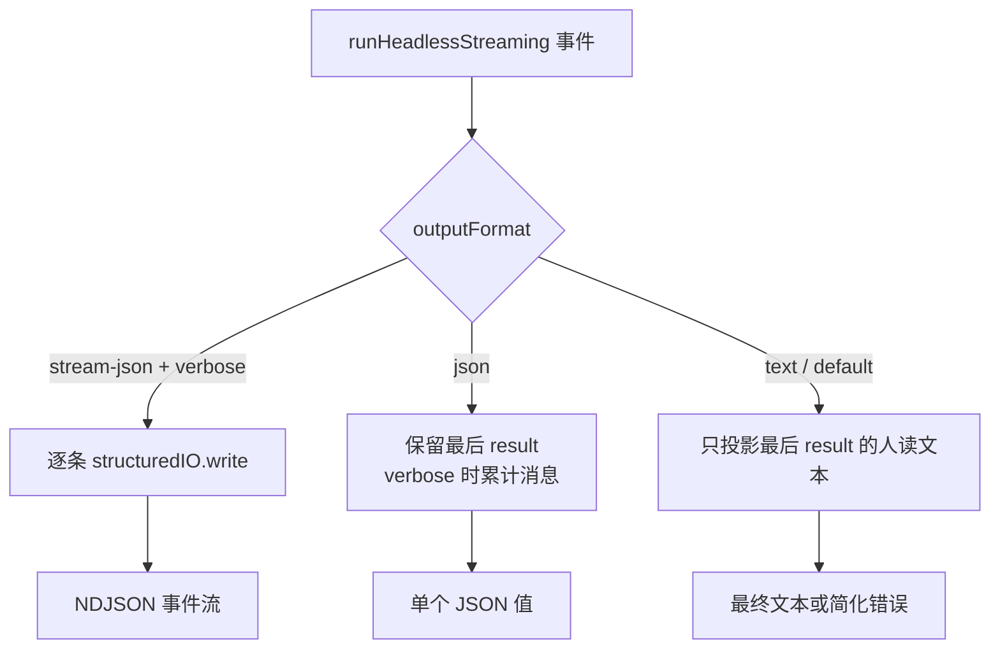
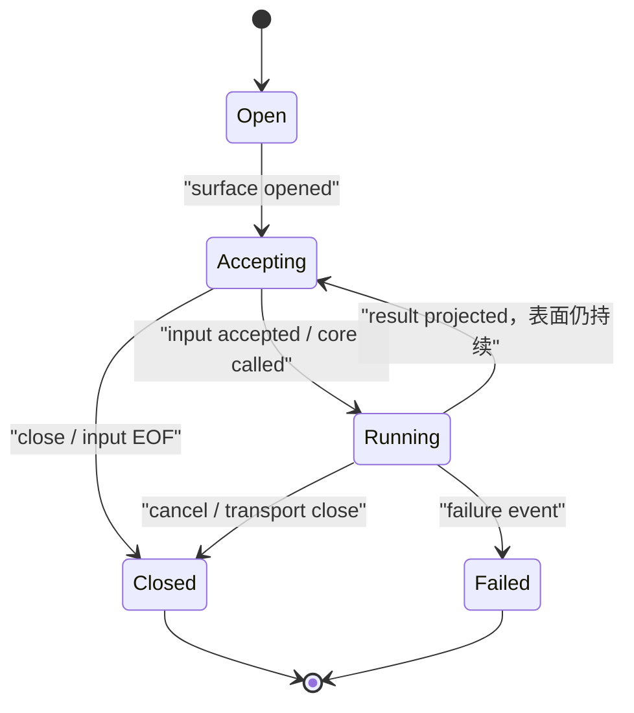
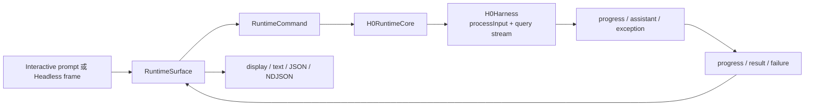

# M05 同一个 Agent，为什么需要多种运行表面

> 本单元主体阅读、画图与源码跟踪约 4.5 至 6.5 小时。双语言实验、破坏实验和企业迁移练习另计约 2 至 3 小时。

你在终端里输入 `claude`，看到的是一个可以连续对话的界面；把一段文本通过管道交给 `claude -p`，你希望它只输出最终答案；SDK 宿主启动同一个 CLI 时，又希望逐条收到模型事件、权限请求和取消响应。

这三种体验看上去像三个产品，底下却要共享同一套 Agent 能力。反过来，如果只写一个巨大的 `main()`，让模型循环同时理解键盘、React、TTY、NDJSON、WebSocket 和退出码，任何一种接入方式都会污染其他方式。

本单元要解决的不是“Claude Code 有哪些命令行参数”，而是一个 Agent Harness 的基础架构问题：

> 怎样把人的交互界面、一次性脚本和机器协议隔离在不同运行表面，同时让它们复用领域核心，又不篡改核心事件的语义？

学完后，你应当能从一次真实进程启动出发，判断表面在哪里被选择，谁拥有输入、状态和输出，为什么 `stream-json` 是协议而不是换一种打印格式，以及怎样把这个分层迁移到自己的 TypeScript、Python 或 Java Agent Harness。

## 先建立一张不会误导你的总图

先不要钻进函数名。把一次启动压缩成四段：最外层分派、运行面分类、表面适配、共享核心。



这张图先纠正三个常见误解。

第一，`entrypoints/cli.tsx` 不会无条件加载完整 CLI。版本查询和若干内部命令可以在更外层直接结束。

第二，Interactive 与 Headless 在进入模型请求之前就已经分叉。它们不是“同一个 UI 最后换一种打印方式”。Interactive 会创建 React/Ink 树，Headless 明确不创建。

第三，共享核心不等于共享全部状态容器。两条路径可以复用消息、Query、Tool 等能力，同时分别拥有 UI 生命周期、输入协议和输出承诺。

本地 `claude-code-CLI/` 是发布包 source map 还原出的静态源码快照。本单元把直接读到的内部实现称为“快照事实”，把本单元 TypeScript/Python 代码实际运行得到的结果称为“运行验证”，把 Mini Agent Harness 与企业方案称为“设计迁移”。快照缺少原始仓库测试和完整构建元数据，因此这里不声称 Claude Code 原项目已在本机完整启动或通过测试。

## 先观察四次启动，它们到底哪里不同

设想下面四种调用。命令只是为了建立运行问题，不要求你现在真的访问模型。

```powershell
# 1. 人在终端里持续对话
claude

# 2. 脚本只要最终文本
claude -p "解释这个目录"

# 3. 管道输入，没有交互式终端
Get-Content .\error.log | claude -p "定位根因"

# 4. SDK-facing 宿主逐行发送和接收结构化消息
claude -p --input-format stream-json --output-format stream-json --verbose
```

四次运行可能使用相同模型、工具和工作目录，却有不同的外部契约：

| 观察维度 | Interactive | Print text/json | SDK-facing stream-json |
| --- | --- | --- | --- |
| 输入来源 | 键盘、PromptInput、UI 动作 | 参数与 stdin | NDJSON 消息流或远程传输 |
| 生命周期 | 进程持续，等待下一次提交 | 通常以本次结果结束 | 可持续收发，并承载控制消息 |
| 状态外壳 | Ink root、AppState、REPL local state | 独立 headless store | headless store + StructuredIO/RemoteIO |
| 输出承诺 | 终端屏幕，人类可读 | 最终文本或 JSON | 一条消息一行的机器协议 |
| 人在环 | UI 对话框 | 受参数限制 | control request/response |
| 结束信号 | root 退出与优雅关闭 | result、错误和进程退出 | 输入关闭、result、cancel、传输关闭 |

如果把这些差异都塞进 Agent Loop，循环里的每一步都得问：我现在是不是 TTY？要不要渲染 React？是否需要打印换行？权限请求该开弹窗还是写 JSON？这样的核心既难测试，也无法被其他宿主可靠复用。

Claude Code 的源码没有把它们压成一条假想的“通用 UI 流”。我们从最外层开始看它如何逐步作出选择。

## 第一处分派发生在完整 CLI 加载之前

最外层入口位于 `src/entrypoints/cli.tsx`。它自己的 `main()` 先读取 `process.argv.slice(2)`，随后检查 `--version` 以及 daemon、bridge、background 等特殊路径。以版本查询为例，决定性行为非常直接：

```ts
const args = process.argv.slice(2)

if (
  args.length === 1 &&
  (args[0] === '--version' || args[0] === '-v' || args[0] === '-V')
) {
  console.log(`${MACRO.VERSION} (Claude Code)`)
  return
}
```

只有没有被这些 fast path 消费的普通路径，才执行：

```ts
const { startCapturingEarlyInput } = await import('../utils/earlyInput.js')
startCapturingEarlyInput()
const { main: cliMain } = await import('../main.js')
await cliMain()
```

源码定位是 `src/entrypoints/cli.tsx:33`、`:37` 和 `:287-302`。

这里的 `await import(...)` 是动态导入。与文件顶部的静态 `import` 不同，它只在控制流走到这里时才加载模块，并返回一个 Promise。它改变的不是代码风格，而是启动边界：`claude --version` 不需要先评估完整 UI、工具、会话和网络依赖。

Java 中可以把它类比为在真正需要时才通过独立启动器加载某个模块，而不是让 Spring 在打印版本号之前先创建完整 ApplicationContext。Python 中则接近在分支内部 `import module`。类比的重点是“延迟成本与副作用”，不是说三个语言的模块系统完全相同。



复习时看到这张图，应立即想起：不是所有 `claude ...` 都会走到 REPL 或 `runHeadless()`。如果以后排查“为什么某个启动 hook 没执行”，先确认命令是否在更外层已经返回。

## 第二处分派才决定 Interactive 还是 Headless

进入 `src/main.tsx:main()` 后，程序在完整初始化前做早期分类。快照中的决定性代码位于 `src/main.tsx:797-815`：

```ts
const cliArgs = process.argv.slice(2)
const hasPrintFlag = cliArgs.includes('-p') || cliArgs.includes('--print')
const hasInitOnlyFlag = cliArgs.includes('--init-only')
const hasSdkUrl = cliArgs.some(arg => arg.startsWith('--sdk-url'))
const isNonInteractive =
  hasPrintFlag || hasInitOnlyFlag || hasSdkUrl || !process.stdout.isTTY

setIsInteractive(!isNonInteractive)
initializeEntrypoint(isNonInteractive)
```

这几行短，却改变了后续整个进程的控制流。

`process.stdout.isTTY` 表示标准输出是否连接到终端设备。它不是“有没有 stdin 数据”，也不是“用户是不是人”。当输出被管道、文件重定向或父进程捕获时，它可能为假。源码因此把无 TTY stdout 也归入 non-interactive，而不是只看 `--print`。

`setIsInteractive()` 把分类结果写入 bootstrap state。后续 `getIsNonInteractiveSession()` 只是读取它的反值：

```ts
export function getIsNonInteractiveSession(): boolean {
  return !STATE.isInteractive
}
```

这才是运行分支的状态来源。

紧接着，源码又计算 `clientType`，识别 `sdk-ts`、`sdk-py`、`sdk-cli`、VS Code、remote 等来源。容易犯的错误是把 `clientType` 当成表面选择器。实际顺序是：先用 flags 与 TTY 计算 `isNonInteractive`，写入 interactive state；然后才根据环境与入口标签形成 client type。



四个概念必须分开记：

| 概念 | 它回答的问题 | 它不回答的问题 |
| --- | --- | --- |
| `--print` | 用户是否显式请求非交互输出 | 所有 Headless 是否都由它触发 |
| `isNonInteractive` | 后续是否跳过 Ink/REPL | 调用者是哪种 SDK |
| `CLAUDE_CODE_ENTRYPOINT` | 进程从什么宿主或入口进入 | 输入输出一定是什么格式 |
| `clientType` | 统一后的客户端来源标签 | 谁拥有 React tree 或 headless store |

这也是企业系统常见的建模原则：部署渠道、调用者身份、传输协议和业务运行模式是四个维度。把它们压进一个 `mode = "sdk"` 字符串，后续一定会出现无法表达的组合。

## Interactive 路径拥有的是一棵持续存在的 UI 树

当 `isNonInteractiveSession` 为假时，`main.tsx` 才创建 Ink root。源码甚至在注释里说明原因：Headless 不能创建这个 root，因为 Ink 构造器中的 console patch 会吞掉非交互输出。决定性位置在 `src/main.tsx:2211-2242`：

```ts
if (!isNonInteractiveSession) {
  const ctx = getRenderContext(false)
  const { createRoot } = await import('./ink.js')
  root = await createRoot(ctx.renderOptions)
  await showSetupScreens(root, ...)
}
```

完成 setup、trust、恢复选择等准备后，fresh session 最终调用 `launchRepl()`。`src/replLauncher.tsx:12-21` 动态导入 `App` 和 `REPL`，再把它们装配为：

```tsx
<App {...appProps}>
  <REPL {...replProps} />
</App>
```

这里不能只说“App 包着 REPL”。这层嵌套表达了所有权：

- Ink root 拥有终端渲染生命周期；
- `App`/AppStateProvider 提供共享运行状态；
- `REPL` 拥有交互提交、消息显示和持续会话体验；
- PromptInput、对话框和屏幕更新是人类交互投影，不是稳定的机器协议。

`renderAndRun()` 再执行 `root.render(element)`、启动延后预取、等待 `root.waitUntilExit()`，最后 `gracefulShutdown(0)`。进程不会在一次 assistant 文本出现后自动退出，因为 root 仍在等待用户下一次操作。



这张所有权图也解释了为什么 Interactive 不能简单输出 NDJSON：屏幕会重绘，日志可能被 patch，组件会显示局部进度和对话框。这些都适合人看，却会破坏要求“一行一个完整 JSON 对象”的宿主解析器。

M11 将完整解释 REPL 的 `messages/messagesRef -> processUserInput -> query()`。本单元只保留它与运行表面的连接点，不提前展开消息与 Tool Loop 的内部机制。

## Headless 路径不是“没有 UI，所以没有状态”

当 bootstrap state 表明 non-interactive 时，root action 在 `src/main.tsx:2584` 进入 Headless 分支。它不会创建 React tree，但会基于 `getDefaultAppState()` 建立独立的 `headlessInitialState`，把 MCP、工具权限、effort、model 等运行数据装入 store。

完成必要初始化后，它动态导入 `src/cli/print.ts`，调用：

```ts
void runHeadless(
  inputPrompt,
  () => headlessStore.getState(),
  headlessStore.setState,
  commandsHeadless,
  tools,
  sdkMcpConfigs,
  activeAgents,
  options,
)
return
```

源码定位为 `src/main.tsx:2823-2860`。最后的 `return` 很重要，它证明该分支不会继续落入 `launchRepl()`。

`runHeadless()` 的参数同时接受 `getAppState` 和 `setAppState`。这不是无状态函数，它只是不用 React 持有状态。`src/cli/print.ts:517-532` 还明确说明：Headless 没有 React tree，因此 UI 中的 settings change hook 不会运行，必须直接订阅设置变化并写回 AppState。



所以“Headless”只表示没有交互式终端树，不表示没有会话、权限、工具或可变状态。生产系统中同样如此：HTTP worker 没有页面，不代表它可以把状态随便放在局部变量里。

## 输入为什么是 `string | AsyncIterable<string>`

`getInputPrompt()` 位于 `src/main.tsx:857-883`。它把两种输入保留成不同形状：

- text 模式读取参数和 stdin 文本，合并成一个 string；
- `stream-json` 模式直接返回 `process.stdin`，让后续逐块消费。

对应的 `runHeadless()` 签名是：

```ts
inputPrompt: string | AsyncIterable<string>
```

这是本单元第一个重要 TypeScript 语义。

`A | B` 是联合类型，表示运行时值可能是 A 或 B。它不表示同时拥有两者的能力。使用前必须通过 `typeof inputPrompt === 'string'` 或其他检查收窄。`AsyncIterable<string>` 表示值不会一次性全部出现；消费者通过 `for await...of` 每次等待一个异步产生的块。

Java 中更接近 `String` 与 `Publisher<String>`/`Flux<String>` 两种入口，而不是 `List<String>`。Python 则接近 `str | AsyncIterator[str]`。关键差别是生命周期：完整 string 已经结束，异步流可能还会继续到达数据、关闭或失败。

为什么不能统一成 string？因为机器宿主可能在第一轮之后继续发送用户消息、权限控制响应和取消。等到 stdin 全部关闭再解析，会把双向协议退化成一次性文件。

为什么也不能强迫所有文本都由宿主构造 NDJSON？因为 shell 用户只想传一个 prompt。表面适配器的职责就是接受方便的外部形状，尽早转成内部领域消息。

## StructuredIO 不是 JSON 打印器，而是协议边界

`runHeadless()` 会把普通文本正规化为结构化 user message，或直接接入已有的异步输入流，随后通过 `StructuredIO` 读取和写出 SDK 消息。

`StructuredIO` 的核心状态位于 `src/cli/structuredIO.ts:135-169`：

- `structuredInput` 是解析后的 AsyncGenerator；
- `pendingRequests` 保存尚未收到响应的控制请求；
- `inputClosed` 区分传输是否关闭；
- `resolvedToolUseIds` 防止重复 control response 再次污染会话；
- `outbound` 是单一出站队列。

读取路径在 `:215-260`。它把任意到达的字符串块累积到 `content`，按换行查找完整 frame，再把每一行交给 `processLine()`。这意味着 transport chunk 和 protocol message 不是一回事：一个 JSON 行可能分成两个 TCP/stdio chunk，两个 JSON 行也可能在同一个 chunk 中到达。



写出路径看上去只有一行：

```ts
async write(message: StdoutMessage): Promise<void> {
  writeToStdout(ndjsonSafeStringify(message) + '\n')
}
```

它的语义却非常严格：一条消息必须对应一行。宿主可以持续读取，不需要寻找一个巨大 JSON 数组的结束括号。反过来，任何写入 stdout 的调试文本都可能被当成 JSON frame，直接破坏协议。因此机器协议的 stdout 必须保持纯净，普通诊断应进入 stderr 或独立日志通道。

### 控制请求为什么需要 request ID

Agent 的人在环权限不能依靠本地弹窗，因为 Headless 可能由 IDE、远程服务或 SDK 宿主控制。`StructuredIO.sendRequest()` 会创建带 `request_id` 的 `control_request`，放入 `outbound`，再把 Promise 的 resolve/reject 保存到 `pendingRequests`。宿主返回 `control_response` 后，用同一个 ID 找回并完成等待者。



`outbound` 由 `sendRequest()` 和 Headless 事件输出共同使用，并由单一 drain loop 写出。它解决的是顺序问题：权限请求不能越过已经排队的模型 stream event。仅仅给 `stdout.write()` 外面加锁还不够，因为你还要定义不同消息源进入同一协议序列时的先后语义。

输入流关闭也不是普通空字符串。`StructuredIO.read()` 在结束时把 `inputClosed` 置为真，并拒绝所有仍未完成的 permission request，错误是“Tool permission stream closed before response received”。这避免 Agent 永久等待一个已经不可能到达的宿主答复。

## `text`、`json`、`stream-json` 共享事件，承诺不同

`runHeadlessStreaming()` 先产生 `StdoutMessage`。外层 `runHeadless()` 再根据 output format 投影。决定性代码位于 `src/cli/print.ts:847-957`。



三种格式的区别不是文件扩展名：

- `text` 面向 shell 和人，只输出最终 result 文本或简化错误；
- `json` 面向一次性结构化消费，默认输出最后一个 result，verbose 时才需要累计完整数组；
- `stream-json` 面向实时宿主，在运行中逐条写出事件，当前源码要求 verbose。

源码还做了一个容易忽略的内存决策：只有 `json + verbose` 需要保留完整消息数组。`stream-json` 已经边到达边写出，text 只关心最后 result，因此两者不必为整个长会话累计所有输出消息。

这揭示了“投影”的准确含义：领域事件序列先发生，表面再决定保留哪些、怎样编码、何时交付。输出格式不应反向改变模型调用、工具执行或会话状态。

一个错误实现可能在 `text` 模式关闭进度生成来节省成本。这样 text 与 stream-json 已不再是同一运行的不同投影，而是两个行为不同的 Core。除非产品明确把它们定义为不同能力，否则这会让调试和审计极其困难。

## SDK 的证据边界必须画在正确位置

源码快照能确认 CLI 这一侧的事实：

- `main.tsx` 识别 `sdk-ts`、`sdk-py`、`sdk-cli` 等 client type；
- `--sdk-url` 会参与 non-interactive 分类；
- Headless 可以通过本地 `StructuredIO` 或远程 `RemoteIO` 承载消息；
- `RemoteIO extends StructuredIO`，把协议接到 WebSocket/SSE 等传输；
- `stream-json` 承载 user、assistant、system、result 和 control 消息。

但 `src/entrypoints/agentSdkTypes.ts` 不能证明外部 SDK 的真实启动实现。这个文件导出类型和函数签名，快照中的 `tool()`、`createSdkMcpServer()`、`query()` 实现会直接抛出 `not implemented`。例如 `query()` 在 `:120-121` 明确抛出 `query is not implemented in the SDK`。

因此下面这条线必须停住：

```text
快照可证实：CLI 如何识别 SDK-facing 入口并提供结构化协议
快照不可证实：外部 npm/Python SDK 某个版本怎样定位二进制、拼参数、监管进程和重试
```

“有同名 TypeScript 类型”不等于“真实运行时在这里”。源码研究中，类型入口、打包占位、协议定义和实际进程调用必须分别核验。

## 表面关闭、失败和业务结果不能混成一个信号

运行表面至少有三类结束：

1. 业务完成：产生 result；
2. 表面关闭：用户退出、stdin/transport 关闭；
3. 运行失败或取消：模型、工具、协议或宿主中断。

如果把 close 伪造成 assistant success，恢复系统会认为模型真的回答过；如果把业务 failure 只变成裸进程退出码，SDK 宿主又无法知道已经出现过哪些部分事件。



这张图是教学抽象，不是声称 Claude Code 内部只有这几个状态。它用来固定一个 Harness 不变量：`surface.closed` 是生命周期事实，不是 assistant 业务消息。M09 会继续深入真实启动、取消、退出和清理预算。

## 用 clean-room 实验验证分层，而不是相信图

本单元提供两套遵守相同行为契约的实现：

```text
curriculum/units/M05/code/typescript/runtimeSurface.ts
curriculum/units/M05/code/python/runtime_surface.py
```

它们不复制 Claude Code 私有实现，只保留要验证的结构：

```text
RuntimeSurface
-> RuntimeCommand
-> RuntimeCore
-> DomainEvent
-> surface-specific projection
```

### 先运行 TypeScript

```powershell
cd "D:\agent\Claude code最新\curriculum\units\M05\code\typescript"
node runtimeSurface.test.ts
node demo.ts
powershell -NoProfile -ExecutionPolicy Bypass -File .\typecheck.ps1
```

本项目已经实际运行：7 个行为测试通过，demo 正常输出，strict typecheck 通过。

### 再运行 Python

```powershell
cd "D:\agent\Claude code最新\curriculum\units\M05\code\python"
python -m unittest -v test_runtime_surface.py
python demo.py
```

本项目已经实际运行：7 个行为测试通过，demo 正常输出。

这些结果证明的是 clean-room 契约，不是 Claude Code 原仓库测试。

### 实验一：同一 Core 是否保持同一事件序列

结论假设：Interactive 与 Headless 只适配外部边界，不改变 Core。

输入：两边都提交 `hello`，Core 固定产生 `progress`、`result`。

观察点：比较两次 `SurfaceRun.events`，不要比较 output string。

预期：事件类型、顺序和内容完全相同，只有 `interactive.output` 与 `headless.output` 不同。

反证：Core 为了 Headless 读取 output format，或两边得到不同事件。

### 实验二：三种 Headless 格式是否只是投影

结论假设：text/json/stream-json 不影响 Core。

输入：同一 prompt 分别使用三种 output format。

观察点：事件数组相同；text 只有最终文本；JSON 可解析；每个 stream-json 元素以换行结束且自身只占一行。

反证：改变 format 后 Core command 数量或事件序列变化。

### 实验三：非法 NDJSON 是否在 Core 前被拒绝

结论假设：协议边界先验证，再进入业务核心。

输入：`{bad json}`。

观察点：抛出 `invalid NDJSON`，`core.commands.length === 0`，trace 中出现 `input.rejected` 而没有 `core.called`。

反证：非法 frame 已经触发模型或工具。

### 实验四：关闭是否产生伪结果

结论假设：close 只改变表面生命周期。

输入：先 `surface.close()`，再提交 `late`。

观察点：提交被拒绝，Core 调用数为 0，trace 只有 `surface.closed`。

反证：得到 assistant/result，或 Core 仍收到命令。

### 一个实际遇到的 TypeScript 运行陷阱

第一版实现使用了构造器参数属性：

```ts
constructor(protected readonly core: RuntimeCore) {}
```

TypeScript 编译器可以把它转换成字段声明与赋值，但 Node 24 的 strip-only 模式只能擦除类型，不能执行这种需要生成 JavaScript 的语法。实际运行得到 `ERR_UNSUPPORTED_TYPESCRIPT_SYNTAX`。

修复是显式声明字段并在构造器中赋值：

```ts
protected readonly core: RuntimeCore

constructor(core: RuntimeCore) {
  this.core = core
}
```

这次失败改变了执行方式，不改变表面契约。它提醒你：能被 `tsc` 编译的 TypeScript，不一定能被 Node 的类型擦除器直接运行。读源码时必须同时知道项目经过什么构建链。

### 主动做四次破坏

1. 把 `projectHeadless()` 的 format 判断移进 Core。重新运行测试，解释为什么事件等价测试仍可能不足，并新增一次“Core 不读取 format”的接口检查。
2. 删除 NDJSON 解析前的校验，让坏输入到达 Core。观察调用计数怎样直接推翻安全边界。
3. 去掉 stream-json 行尾 `\n`。写一个逐行消费者，观察它为什么无法及时得到完整 frame。
4. 在 `close()` 中追加 `{type: 'result', text: 'closed'}`。解释这条伪业务消息会怎样污染恢复、计费和审计。

每次只改一个变量，先写预期和反证，再运行。实验完成后恢复文件，重新执行双语言测试与 typecheck。

## H1-in-progress 怎样累计复用 H0

独立实验确认边界后，同一契约已经合入 `mini-agent-harness/`。H0 的消息校验、运行状态、取消、资源清理和 Trace 保持不变；H1 新增 `H0RuntimeCore`，把 H0 事件映射到表面领域事件。



H1 当前冻结九项新增不变量，完整记录在 `mini-agent-harness/contracts/h1-contract.md`。最关键的边界是：

- Surface 适配输入与输出，不拥有业务消息；
- Core 不读取 TTY、React 或 output format；
- H0 异常映射为显式 failure，部分 progress 仍可见；
- `SurfaceTrace` 观察边界，不成为业务状态 owner；
- Interactive 可连续提交不等于多个 H0 run 已共享会话历史。

最后一点尤其重要。M05 只证明“表面可以继续接收输入”，没有提前声称会话状态由谁跨 prompt 保存。H1 会在 M06-M09 继续加入配置、bootstrap state、能力快照和完整生命周期。

累计回归命令：

```powershell
cd "D:\agent\Claude code最新\mini-agent-harness"
powershell -NoProfile -ExecutionPolicy Bypass -File .\tests\run-h1-regression.ps1
```

当前实际结果是 H1 `4/4` 检查通过，其中包括 S0 原有 `15/15` 全量回归；H1 自身 TypeScript 8 个、Python 7 个行为测试通过，TypeScript strict 通过。

本单元的 Harness 裁决是 `merge`。理由不是接口看上去整洁，而是输入前置校验、事件等价、输出投影、关闭和失败语义已经被双语言测试验证，并且没有破坏 H0。它仍叫 `H1-in-progress`，因为生命周期壳尚未由 M06-M09 完成。

## 迁移到 Java/Spring，先拆端口再选 WebFlux

在 Java 服务中，最容易犯的错误是让一个 singleton `AgentService` 同时接收 Controller DTO、拼 SSE、持有对话数组并调用模型。更稳妥的分层从端口开始：

```java
sealed interface RuntimeCommand permits PromptCommand {}
record PromptCommand(String text) implements RuntimeCommand {}

sealed interface DomainEvent
    permits ProgressEvent, ResultEvent, FailureEvent {}

interface RuntimeCore {
    Flux<DomainEvent> run(RuntimeCommand command, RunContext context);
}

interface RuntimeSurface<I, O> {
    Flux<O> submit(I input);
}
```

HTTP JSON、SSE、WebSocket 和内部任务队列各自实现 Surface adapter。它们可以共享同一个 `RuntimeCore`，但不能让 Core 读取 `ServerHttpResponse`、SSE event builder 或 Kafka acknowledgment。

Spring WebFlux 的 `Flux<DomainEvent>` 对应 TypeScript `AsyncIterable<DomainEvent>` 的流式意图，但背压和取消语义不同，不能逐行翻译。你需要明确：下游取消订阅时是否取消模型请求，工具子进程如何终止，已经持久化的事件是否保留。

对于 NDJSON，生产实现至少要有：

- 最大 frame 大小，避免无限累积没有换行的输入；
- JSON schema/判别字段校验；
- 独立 stdout/protocol 与 diagnostic log；
- request ID、session ID、turn ID 和 tool use ID；
- 每会话有界 pending request map；
- 输入关闭时拒绝未完成请求；
- 重连后的重复响应去重；
- 明确的协议版本和未知消息策略。

### 与 LangGraph 的关系

LangGraph 可以承载核心状态图和 checkpoint，但 HTTP/SSE/SDK 仍是外部运行表面。不要把 WebSocket frame 直接写进 graph state，也不要让 graph node 拼接终端颜色。先由 adapter 转成领域 command，图运行产生领域 event，再由 adapter 编码。

这使同一个 graph 可以被 REST、批任务、命令行和测试驱动，也使协议变化不必重写 Agent 节点。

## 提升到企业级时，运行表面还是治理边界

多表面设计不只是为了复用代码。它决定安全、可观测和容量治理放在哪里。

### 安全

Interactive 可以让本地用户确认权限；远程 SDK 必须把 permission request 发给有身份的宿主。两者最终都应产生同一种领域权限决定，但认证、展示和超时策略属于表面或控制协议。

不要因为 client type 名为 `sdk-cli` 就默认可信。来源标签、身份认证、运行模式和权限策略必须分别验证。

### 可观测性

建议至少记录以下边界事件，不记录敏感 prompt 原文：

```text
surface.opened
input.accepted / input.rejected
core.called
event.received
output.projected
control.requested / control.resolved / control.cancelled
surface.closed
```

这些事件应带 session/turn/request ID、surface type、format、耗时和结果类别。这样可以区分“模型慢”“宿主没回答权限”“stdout 协议被污染”和“UI 没刷新”。

### 容量与隔离

`json + verbose` 会累计完整数组，`stream-json` 可以边写边释放。协议选择因此会影响内存上界。远程连接还需要写队列上限和慢消费者策略，不能让一个不读取事件的 SDK 宿主拖垮整个 Agent worker。

### 兼容与版本

外部协议比内部函数更难改。新增事件时，旧宿主是忽略、降级还是失败必须提前定义。本单元 clean-room 选择对未知 event 显式失败，是为了暴露遗漏；生产协议也可以选择可扩展 envelope，但不能在没有规则时静默吞消息。

## 资深 Agent 开发岗面试：从结论讲到运行边界

下面的问题从大厂 Agent 开发岗位的真实追问出发。参考回答刻意保留口语节奏：第一句先给结论，再讲机制、Claude Code 的决定性设计和生产迁移。不要背文件名，先练会讲清边界；面试官追问证据时再定位源码。

### 问题 1：为什么一个 Agent 产品需要 Interactive、Headless 和 SDK 多种运行表面？

> 先说结论：多运行表面不是复制三套 Agent，而是把不同输入、生命周期和输出协议隔离在适配层，让消息、模型和工具核心保持一致。以 Claude Code 为例，Interactive 会创建 Ink root、App 和 REPL，生命周期由终端 UI 持有；Headless 不建 React tree，而是创建独立 store，进入 `runHeadless()`；SDK-facing 仍复用 Headless，但通过 `StructuredIO` 或 `RemoteIO` 收发 NDJSON 和 control message。真正要共享的是领域 command、Query、Tool 和领域 event，不该共享的是键盘事件、React 对象、stdout 编码和退出方式。如果让我设计企业 Harness，我会把 HTTP、SSE、WebSocket、批任务都做成 Surface adapter，核心只接受领域输入。这样新增接入方式不会把传输分支扩散进 Agent Loop，测试也能证明不同表面对同一输入产生相同核心事件。

### 问题 2：Claude Code 到底怎样选择非交互模式，`clientType` 能不能当选择条件？

> 先说结论：不能把 `clientType` 当运行表面选择器；当前快照先根据 flags 和 TTY 计算 non-interactive，再单独计算客户端来源标签。`main.tsx` 检查 `-p/--print`、`--init-only`、`--sdk-url` 或 stdout 非 TTY，任一成立就 `setIsInteractive(false)`。后面才根据 `CLAUDE_CODE_ENTRYPOINT` 等信息得到 `sdk-typescript`、`sdk-python`、`sdk-cli`、remote 或 cli。这个区分很重要，因为无 TTY 的普通脚本也可能被内部标成 `sdk-cli`，但它不等于外部 TypeScript SDK。生产系统里我也会分开建模 runtime mode、transport、caller identity 和 telemetry source，避免一个 `mode` 字段同时承担路由、安全和统计，最后出现命名驱动权限的漏洞。

### 问题 3：Interactive 和 Headless 的状态所有权有什么不同？

> 先说结论：两边都不是无状态，区别是状态由什么生命周期容器持有。Claude Code 的 Interactive 由 Ink root 持有渲染生命周期，AppStateProvider 提供共享状态，REPL 再维护交互消息和提交体验；Headless 明确没有 React tree，所以 `main.tsx` 创建独立 headless store，把 `getState/setState` 传给 `runHeadless()`，设置变化也要直接订阅，不能依赖 React hook。两边可以复用相同 AppState 数据形状和 Agent 能力，但不能把 React state 当成业务状态的唯一实现。迁移到服务端时，我会让 session store 成为明确 owner，Surface 只观察和投影；这样 CLI、HTTP 和后台任务不会各自复制一份互相漂移的会话状态。

### 问题 4：`text`、`json` 和 `stream-json` 只是序列化格式不同吗？

> 先说结论：它们共享底层事件，但交付时机、保留策略和协议承诺不同，不能只理解成 `JSON.stringify` 开关。Claude Code 的 `runHeadlessStreaming()` 先产生消息；text 最终只投影最后一个 result 的文本或简化错误，json 默认输出最后 result，verbose 时才累计完整数组，stream-json 则在运行中逐条写 NDJSON。源码甚至只为 `json + verbose` 保留全部消息，其他模式避免长期累计。企业里这会影响延迟、内存和恢复：SSE/NDJSON 可以实时交付但要处理慢消费者和断线，单次 JSON 简单但必须等终态。我会要求三种投影对同一 Core event 序列保持等价，并用契约测试防止格式选项反向改变模型或工具行为。

### 问题 5：为什么 SDK stream-json 需要专门的 StructuredIO，逐行解析还不够吗？

> 先说结论：逐行 JSON 只解决 framing，完整 SDK 协议还需要顺序、请求响应关联、取消、关闭和去重。Claude Code 的 `StructuredIO` 会把任意 transport chunk 重新组装成换行 frame，校验 user/control message；出站时保证一条消息一行。权限请求带 `request_id`，Promise 保存在 `pendingRequests`，control response 再按 ID resolve 或 reject；输入关闭时所有 pending permission 都必须失败。它还有统一 outbound 队列，防止 control request 越过已排队的 stream event，并跟踪已处理的 tool use ID，避免重连后的重复响应污染会话。企业实现还要补最大 frame、队列上限、协议版本和鉴权。只写一个 `readLine().map(JSON::parse)`，远远没有定义一个可恢复的双向协议。

### 问题 6：从这份快照能否证明 Claude Code 的 TypeScript/Python SDK 怎样启动 CLI？

> 先说结论：不能，这份快照能证明 CLI 侧的 SDK-facing 协议和标签，不能证明外部 SDK 包的具体进程管理实现。我们能看到 `main.tsx` 识别 sdk client type、`--sdk-url` 进入 non-interactive、`StructuredIO/RemoteIO` 承载消息；但 `agentSdkTypes.ts` 在当前快照里主要是公共类型和占位函数，`query()` 直接抛出 not implemented。正确的源码结论必须停在证据边界。如果面试中需要讨论外部 SDK，我会再查对应版本的官方包源码和文档，确认二进制定位、参数、重试与退出监管，而不会因为同名类型文件就把它画进真实调用链。这种克制本身是源码研究能力。

### 问题 7：让你用 Java/Spring 设计同类多表面 Agent Harness，你会怎样拆？

> 先说结论：我会先定义领域 command/event 和 RuntimeCore，再让 REST、SSE、WebSocket、批任务分别实现 Surface adapter，绝不让 Core 依赖 Controller 或传输对象。Core 返回 `Flux<DomainEvent>`，会话状态由按 session 隔离的 Store 持有；HTTP JSON 可以收集到终态，SSE 和 WebSocket 实时投影，内部队列则负责 ack 与重试。权限等人在环请求使用稳定 request ID 和有界 pending map，输入关闭要拒绝等待者，副作用操作要有幂等键。取消从 Reactor subscription 传播到模型 HTTP 和工具进程，但已提交的事件不做假回滚。LangGraph 可以作为 Core 内部编排器，checkpoint 也放在领域层，不能把 SSE frame 写进 graph state。最后我会用同一 scripted core 跑所有 adapter 的契约测试，证明表面差异没有改变业务事件。

### 问题 8：多运行表面最容易出现什么线上故障，你会怎样定位？

> 先说结论：最常见的不是模型本身错误，而是边界混淆，例如 stdout 混入日志、模式误判、权限响应悬挂、慢消费者堆满队列，或者 surface close 被当成业务成功。我会先按 `surface.opened -> input.accepted -> core.called -> event.received -> output.projected -> surface.closed` 建结构化 trace，并关联 session、turn 和 request ID。Claude Code 的设计给了很好的定位思路：Interactive 与 Headless 在 root/store 处已经分开，StructuredIO 又把 parse、pending request 和 outbound 排序集中起来。这样看到 `input.accepted` 但没有 `core.called`，先查协议或校验；有 core event 没 output，就查投影和写队列；pending request 在 input close 后还存在，就是生命周期清理问题。可观测性必须围绕所有权边界设计，不能只记一条总耗时。

这些回答都应先讲机制，再在追问时给出源码锚点。只背 `main.tsx:803` 不能证明你理解架构；能解释为什么分类、来源、协议和状态必须分开，才说明你能把设计迁移到新系统。

## 离开本单元前完成一次完整闭环

先不看总图，自己画两条路径：`entrypoints/cli.tsx -> main.tsx -> Interactive` 和 `entrypoints/cli.tsx -> main.tsx -> Headless`。在图上标出 fast path、表面选择条件、状态 owner、输入形状、输出投影和结束信号。

然后回答四个问题：

1. 为什么 `clientType` 不是运行表面 owner？
2. 为什么 Headless 没有 React tree却仍然有 AppState？
3. 为什么 `stream-json` 的 stdout 不能混入普通日志？
4. 为什么 close、failure 和 result 必须是三个不同事实？

接着运行 TypeScript/Python demo 与测试，比较两边事件顺序。任选一个破坏实验，先写反证条件，再解释失败怎样推翻不变量。

最后为自己的企业项目写一页设计：列出至少两个 Surface、一个 RuntimeCore、状态 owner、协议 ID、关闭与取消语义，以及跨 Surface 的等价测试。不要先写框架名。

如果这些工作都能独立完成，你获得的就不只是 Claude Code 的启动知识，而是一套可迁移判断：

> 运行表面负责适配世界，领域核心负责保持语义；输入、状态、协议和生命周期只有在所有权清楚时，才能既复用又不互相污染。

## 源码与实验定位地图

| 问题 | 决定性位置 |
| --- | --- |
| 最外层 fast path 与普通 CLI 动态导入 | `claude-code-CLI/src/entrypoints/cli.tsx:33-42, 287-302` |
| non-interactive 分类与 client type | `claude-code-CLI/src/main.tsx:797-849` |
| interactive bootstrap state | `claude-code-CLI/src/bootstrap/state.ts:1057-1074` |
| text 与 stream-json 输入形状 | `claude-code-CLI/src/main.tsx:857-883` |
| 仅 Interactive 创建 Ink root | `claude-code-CLI/src/main.tsx:2211-2242` |
| Headless store 与 `runHeadless()` 分支 | `claude-code-CLI/src/main.tsx:2584-2860` |
| `App + REPL` 装配 | `claude-code-CLI/src/replLauncher.tsx:12-21` |
| root render、等待退出和优雅关闭 | `claude-code-CLI/src/interactiveHelpers.tsx:94-103` |
| Headless 主入口 | `claude-code-CLI/src/cli/print.ts:455-535` |
| 输出投影与内存保留策略 | `claude-code-CLI/src/cli/print.ts:847-957` |
| StructuredIO 状态、NDJSON framing 和关闭 | `claude-code-CLI/src/cli/structuredIO.ts:126-169, 215-260` |
| control request、取消与 pending map | `claude-code-CLI/src/cli/structuredIO.ts:362-425, 465-529` |
| RemoteIO 传输适配 | `claude-code-CLI/src/cli/remoteIO.ts:31-93` |
| SDK 类型与占位实现边界 | `claude-code-CLI/src/entrypoints/agentSdkTypes.ts:1-121` |
| TypeScript clean-room | `curriculum/units/M05/code/typescript/runtimeSurface.ts` |
| Python clean-room | `curriculum/units/M05/code/python/runtime_surface.py` |
| H1 累计契约 | `mini-agent-harness/contracts/h1-contract.md` |
