# M06 一个设置值为什么会变：从配置来源走到信任与运行快照

> 本单元主体阅读、画图与源码跟踪约 5 至 7 小时。TypeScript/Python 实验、破坏实验和企业配置设计另计约 2.5 至 4 小时。

你在用户目录的 `settings.json` 里写下：

```json
{
  "permissions": {
    "defaultMode": "default"
  }
}
```

进入一个项目后，Claude Code 却以 `plan` 启动。你检查项目配置，发现 `.claude/settings.json` 确实写了 `plan`；再加上 `--settings`，它又变成 `acceptEdits`；公司策略到达后，界面里显示的值再次变化。

这时只说一句“高优先级覆盖低优先级”没有用。你至少还要回答：高低顺序是谁定的？嵌套对象是整段替换还是按字段合并？数组怎么办？公司策略来自远程、注册表和文件时，是全都合并还是只选一个？配置对象里已经出现了 `PATH`，是否意味着它已经进入 `process.env`？运行到一半策略更新，正在执行的 Agent 应该看旧值还是新值？

更关键的是，当前源码快照里还有一个反直觉边界：默认来源顺序与显式 `--setting-sources` 后的实际迭代顺序并不总是一致。真正做源码研究，不能拿注释中的“意图”覆盖代码的“行为”。

本单元不把配置当作一堆 JSON 字段。我们沿一个最终值走完整条路：

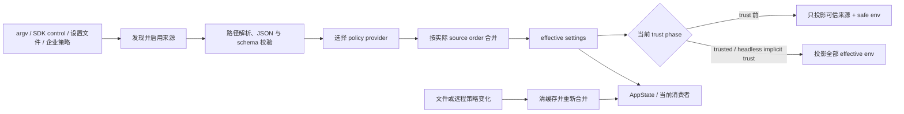

这张图先给你总路线。后面每增加一个新层次，我们会在它旁边再放局部图。复习时也不要只背五个来源，要能从任意一个最终字段反向走回输入、验证、选择、合并和信任阶段。

## 先建立一个不会混乱的词汇表

初学配置系统最容易把四件事都叫“配置”：

1. **source document**：某个来源独立提供的设置，例如项目的 `.claude/settings.json`；
2. **enabled source order**：本次运行实际会按什么顺序读取来源；
3. **effective settings**：来源合并后得到的对象；
4. **runtime decision**：消费者把 effective setting、CLI 会话参数和运行条件继续组合后作出的决定。

`permissions.defaultMode` 能帮助你看清四层。项目文件里的 `plan` 是 source value；合并后可能变成 policy 的 `dontAsk`，这是 effective value；而 `permissionSetup.ts` 还会先看 `--permission-mode`、危险绕过参数、远程环境限制和 feature gate，最后才得到本次会话真正使用的 permission mode。

所以：

> “配置合并的最终值”只是配置流水线的终点，不一定是整个运行决策的终点。

同样，“某个 env 已在 effective settings 中”也不代表它已经修改了进程。环境变量还有 trust phase 这一道副作用闸门。

## 启动时谁先触发第一次配置读取

M05 已经讲过 CLI 的表面选择。M06 只截取与配置有关的早期路径：

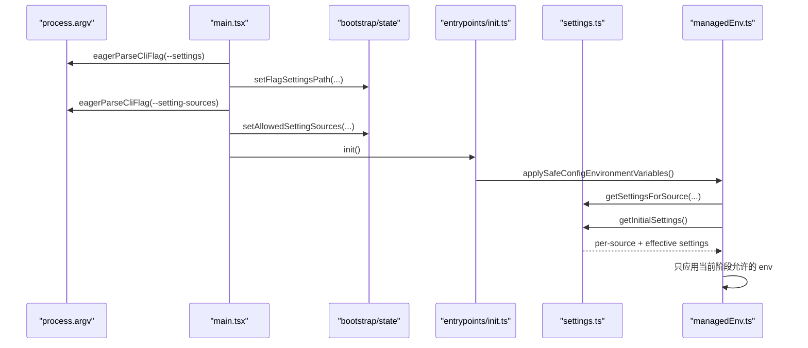

决定性入口是 `src/main.tsx` 的 `eagerLoadSettings()`，约 498-515 行。它必须在 `init()` 前处理两个参数，因为 `init()` 很早就要应用 CA、代理、认证提供者和遥测相关环境。如果到 Commander action 才解析，第一次网络或证书初始化可能已经使用了错误值。

这体现了配置系统的第一个设计约束：

> 会影响启动基础设施的输入，必须在首次消费者之前进入配置状态。

但“早”不等于“直接执行”。`--settings` 先进入 bootstrap state，真正读文件、校验和合并仍由 settings 模块完成。

## 五个主来源不是五个平行文件

`src/utils/settings/constants.ts` 的 `SETTING_SOURCES` 给出默认的低到高顺序：

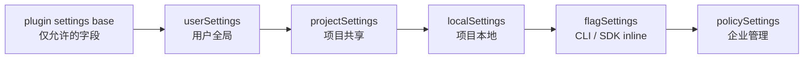

箭头表示后面的来源在默认读取链里优先级更高，不表示每个来源只对应一个文件。

| 来源 | 主要输入 | 默认语义 |
| --- | --- | --- |
| plugin base | 插件加载器提供的 allowlisted settings | 五个主来源以下的默认层 |
| user | Claude config home 下 `settings.json`，cowork 模式可换文件名 | 用户跨项目默认值 |
| project | original cwd 下 `.claude/settings.json` | 可共享的项目设置 |
| local | original cwd 下 `.claude/settings.local.json` | 本机项目覆盖，通常 gitignored |
| flag | `--settings` 文件/JSON，及 SDK control 写入的 inline settings | 本次进程或宿主覆盖 |
| policy | remote、MDM/HKLM/plist、managed files、HKCU 中胜出的一个 provider | 企业管理层 |

路径计算集中在 `settings.ts:getSettingsFilePathForSource()`，约 274-296 行。项目与 local 使用的是 `getOriginalCwd()`，而不是后续 worktree 或 setup 可能改变后的当前目录。这避免启动过程中 `chdir` 让同一进程突然换一套配置根。

`EditableSettingSource` 用 TypeScript 的 `Exclude` 排除 flag 和 policy：

```ts
export type EditableSettingSource = Exclude<
  SettingSource,
  'policySettings' | 'flagSettings'
>
```

第一次遇到这个 TypeScript 写法，只需抓住当前作用：`SettingSource` 是五个字符串组成的联合类型，`Exclude<A, B>` 从 A 中删除 B。于是设置 UI 和写回函数只能在类型层接受 user/project/local。

运行时仍有一道防线。`updateSettingsForSource()` 即使被错误强转传入 flag/policy，也直接返回、不写文件。这不是说外部策略永远不会变化；它只说明 Claude Code 的普通设置写回路径不拥有这两个来源。

## 同一个 flagSettings 有两条入口

用户直接运行：

```powershell
claude --settings .\team-settings.json
```

`main.tsx:loadSettingsFromFlag()` 会安全解析文件路径并把绝对路径存入 bootstrap state。

如果参数本身是 JSON：

```powershell
claude --settings '{"model":"sonnet"}'
```

当前快照不是把对象直接存入内存。它先校验 JSON，再用内容哈希生成稳定临时文件名并写入文件，最后仍调用 `setFlagSettingsPath()`。源码注释解释了一个很实际的原因：随机临时路径会进入 Bash tool description，路径每次变化会破坏模型 prompt cache；内容相同就使用相同路径，可以稳定缓存前缀。

SDK-facing 的运行时 control message 是另一条入口。`src/cli/print.ts` 约 3699-3729 行处理 `apply_flag_settings`：

```text
已有 flagSettingsInline
-> 与 incoming 顶层浅合并
-> null 转成删除
-> setFlagSettingsInline(merged)
-> notifyChange(flagSettings)
```

随后 `getSettingsForSourceUncached('flagSettings')` 才把 file settings 和 inline settings 用正常 settings merge 深合并，inline 在同一来源内覆盖 file。

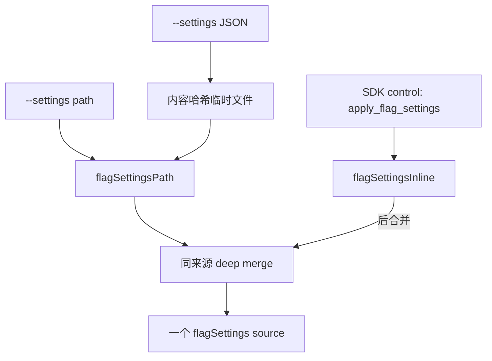

这张图解决一个常见误解：CLI JSON 和 SDK inline 不是同一存储路径，但它们最后属于同一个优先级层。教材讨论“来源”时按语义层分组，源码研究时仍要保留入口差异。

## `--setting-sources`：先看设计意图，再看当前快照的字面行为

参数只接受 `user,project,local`，空字符串表示一个普通来源也不要。注释与 CLI help 都很容易让人形成这个模型：它只负责筛选普通来源，flag 和 policy 始终保留，五个来源的相对优先级不变。

但当前源码不是这样实现的：

```ts
export function getEnabledSettingSources(): SettingSource[] {
  const allowed = getAllowedSettingSources()
  const result = new Set<SettingSource>(allowed)
  result.add('policySettings')
  result.add('flagSettings')
  return Array.from(result)
}
```

这里需要一个很小但决定性的 JavaScript 前置：`Set` 会去重，同时保留插入顺序。`add()` 新元素会追加到末尾，`Array.from()` 也按这个顺序返回。函数没有再按 `SETTING_SOURCES` 排序。

默认 bootstrap state 已经包含五个来源，而且恰好是标准顺序，所以重复 add 不会移动已有 policy/flag：

```text
默认 allowed
= user, project, local, flag, policy
=> user -> project -> local -> flag -> policy
```

显式参数会先把 allowed 替换成只包含普通来源的数组。此时再追加 policy、flag，顺序变了：

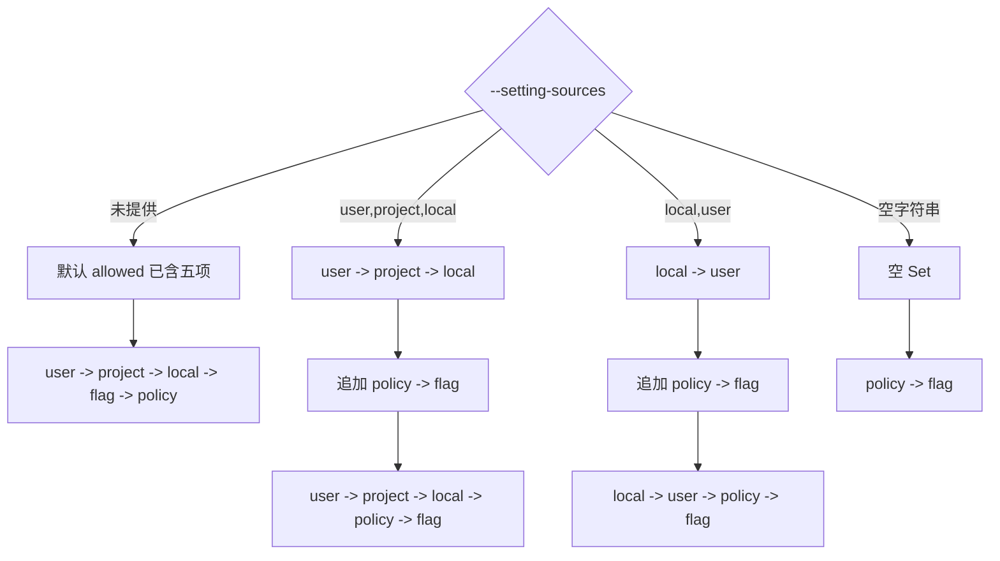

`loadSettingsFromDisk()`、`getSettingsWithSources()` 和 raw-key 检查都直接迭代这个结果，没有 normalization。因此当前快照中，显式 `--setting-sources` 不仅选择来源，还可能：

- 让 flag 在 policy 后合并，普通标量和对象叶子由 flag 覆盖 policy；
- 让 `local,user` 中的 user 覆盖 local；
- 让来源列表顺序成为配置语义的一部分。

这不是让你寻找利用方式，也不是要求修改只读源码。它教的是源码阅读的一条硬规则：

> 常量、注释和类型表达设计意图；真正的运行语义由进入循环的实际有序集合决定。

在生产 Harness 中，我们不复制这个偶然顺序。M06 clean-room 同时提供：

- `deriveSnapshotCompatibleOrder()`：复现当前快照，帮助验证和兼容；
- `deriveCanonicalOrder()`：总按 `user -> project -> local -> flag -> policy`，作为企业默认。

两种模式必须有名字，不能在一个叫 `getSources()` 的函数里悄悄切换。

## “后者覆盖前者”只解释了标量

进入 `settings.ts:loadSettingsFromDisk()` 后，plugin allowlisted settings 先成为 base，再按 enabled order 循环。决定性调用是 lodash 的 `mergeWith`，customizer 只特殊处理数组：

```ts
export function settingsMergeCustomizer(
  objValue: unknown,
  srcValue: unknown,
): unknown {
  if (Array.isArray(objValue) && Array.isArray(srcValue)) {
    return uniq([...objValue, ...srcValue])
  }
  return undefined
}
```

`return undefined` 在 lodash customizer 中不是把字段设为 `undefined`，而是“我不自定义，请使用默认 merge 行为”。于是三种数据形状有三种结果：

| 形状 | 读取多个来源时的语义 |
| --- | --- |
| scalar / null | 后来源覆盖前来源 |
| plain object | 递归到叶子，未冲突字段保留 |
| array | 先连接，再用 `uniq` 去重 |

回到我们的案例：

```json
// user
{"permissions":{"defaultMode":"default","allow":["Read","Bash(git status)"]}}

// project
{"permissions":{"defaultMode":"plan","allow":["Read","Glob"]}}

// flag
{"permissions":{"defaultMode":"acceptEdits"}}

// policy
{"permissions":{"defaultMode":"dontAsk"}}
```

在默认顺序下，得到：

```json
{
  "permissions": {
    "defaultMode": "dontAsk",
    "allow": ["Read", "Bash(git status)", "Glob"]
  }
}
```

不是 policy 的整个 `permissions` 对象替换了前面所有字段。`defaultMode` 的最后贡献者是 policy，三个 allow item 则分别来自 user/project。一个对象内部可以有多个来源。

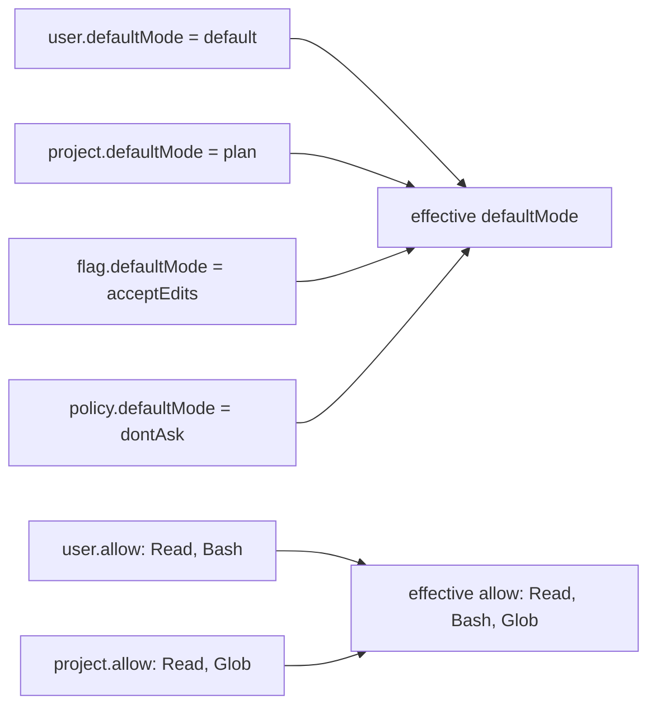

这就是为什么只记录“settings 来自 policy”不够。`getSettingsWithSources()` 能返回 raw per-source objects 和 effective object，但当前源码没有自动给每个叶子或数组项生成 provenance。H1 的字段 provenance 是我们基于合并过程增加的设计迁移，不冒充原 API。

还要注意 `uniq` 的准确边界。对字符串、数字等 JSON 原始值，它按 SameValueZero 去重；两个内容相同但引用不同的对象不一定被视为相同。配置数组通常是字符串规则，但不要把这句扩张成“数组元素会做深相等去重”。

## 读取合并与写回合并不是同一个动作

如果设置 UI 要把 `allow` 从 `[Read, Glob]` 改成 `[Read]`，仍使用“数组连接去重”，旧的 Glob 会被重新带回来。因此 `updateSettingsForSource()` 使用另一套 customizer：

- incoming array 整体替换当前来源的 array；
- incoming 的显式 `undefined` 表示删除字段；
- 其他对象仍使用默认递归 merge。

这不是规则矛盾，而是两个不同问题：

```text
读取多个来源：保留每层贡献，数组 concatenate + uniq
写回单个来源：调用者已经算好目标状态，数组 replace
```

面试中如果被问“配置数组到底是 append 还是 replace”，不要抢答。先问清楚是在 resolve 多来源，还是 update 单一来源。

## policySettings 不是四个策略后端大合并

主来源合并前，系统必须先回答：本次 `policySettings` 由哪个 provider 提供？当前优先级是：

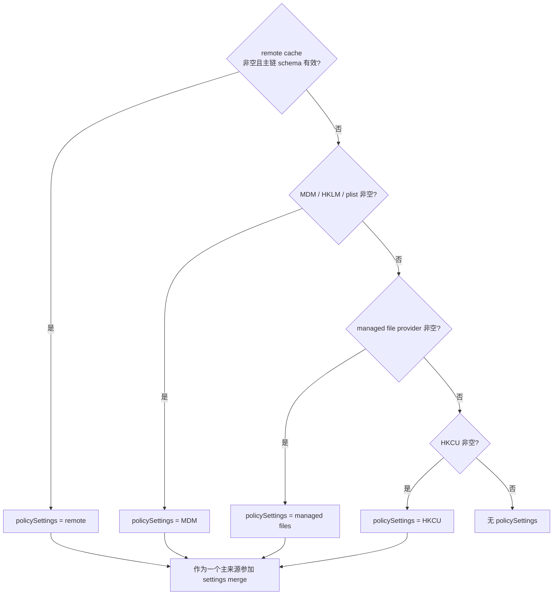

这里的 **first source wins** 只适用于 policy provider selection。不能把它套在 user/project/local/flag/policy 的主来源链上。

文件型 provider 内部又是一层 merge：

```text
managed-settings.json（base）
-> managed-settings.d/10-*.json
-> managed-settings.d/20-*.json
-> ...按文件名字母序
```

base 和 drop-in 用正常 `settingsMergeCustomizer`。所以准确心智模型有两步：

1. remote、MDM、managed files、HKCU 之间择一；
2. 如果选中 managed files，它内部先合并 base 与 sorted drop-ins。

这类“先选择一个 provider，再在 provider 内组合碎片”的模式很常见：Spring Cloud Config 可以先选择环境/label，再合并 property sources；RAG 系统可以先选租户策略包，再合并该包里的 index、reranker 和 guardrail fragment。两层优先级必须使用不同类型或函数名，否则迟早有人把 provider list 当作 merge list。

主加载链对 remote settings 做 `SettingsSchema().safeParse()`；无效 remote 会记录错误并尝试更低 provider。`getSettingsForSourceUncached('policySettings')` 的简化 per-source 路径则直接读取已缓存 remote。正常 remote fetch 在入缓存前已经 schema 和 security validation，所以通常一致；但源码层面两个读取路径并不完全等价。教材只把它标成边界，不为理论坏缓存扩写一章。

## 一个设置文件怎样取得参加合并的资格

`parseSettingsFile()` 的关键过程不是 `JSON.parse` 三个字：

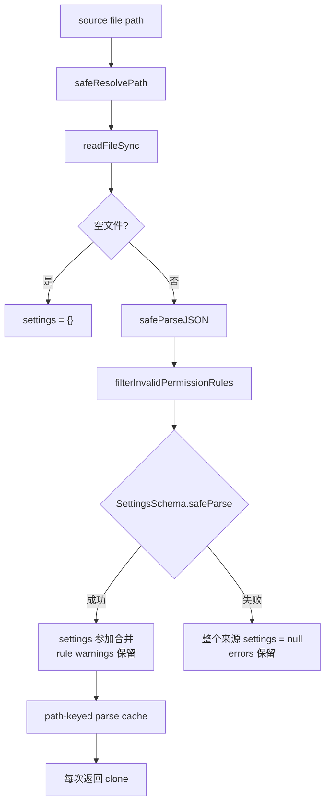

为什么 permission rule 先过滤？因为一组 allow/deny 里的一条坏规则不应让整份设置全部消失。过滤器可以删除坏规则并留下 warning，再让其余对象进入 Zod。

但其他 schema 错误不同。如果 `SettingsSchema().safeParse(data)` 失败，整个文件返回 `settings: null`。不会保留其中“看上去没错”的 `model` 或 `permissions.allow`。这是来源级 validation，不是逐字段容错。

初学者常把 `safeParse` 理解成“不抛异常，所以一定有部分数据”。实际上 Zod 的结果是判别联合：

```ts
const result = schema.safeParse(data)
if (result.success) {
  // result.data 才是已验证值
} else {
  // result.error 存在，data 不应参加合并
}
```

它的“safe”是把异常变成结果对象，不是自动修复坏输入。

### 为什么缓存返回 clone

lodash `mergeWith` 会修改 target，并可能保留嵌套引用。如果 parse cache 把同一个对象直接交给多个调用者，一个调用者的 merge 或设置写回可能污染缓存，下一次“读取磁盘”却读到内存中被改过的值。

所以 `parseSettingsFile()` 在首次解析返回和 cache hit 返回时都 clone settings。这里的 clone 保护的是 **parse cache entry**。

不要进一步误读为“整个 effective settings 是深冻结不可变对象”。`getInitialSettings()` 会返回 session cache 中的 effective settings，当前源码没有对它 deep freeze。H1 把 snapshot 深冻结，是企业 Harness 的强化设计，不是对原实现的逐行复刻。

## 三层缓存解决的不是同一问题

`settingsCache.ts` 有三类缓存：

| 缓存 | key | 避免的重复工作 |
| --- | --- | --- |
| session settings cache | 单个 merged `SettingsWithErrors` | 多个消费者反复合并全部来源 |
| per-source cache | `SettingSource` | trust dialog、status 等反复读同一来源 |
| parse file cache | 文件路径 | per-source 与 merged path 重复读盘和 Zod parse |

`resetSettingsCache()` 同时清三层。`getSettingsWithSources()` 为保证 raw sources 和 effective value 来自同一次新鲜读取，会主动 reset，再重建两者。它不是纯粹的零副作用 getter，而是一次 freshness boundary。

这带来一个重要设计问题：缓存失效后，所有消费者是否在同一个事务里切换？当前实现通过 change detector 通知、`applySettingsChange()` 和 AppState update 尽量形成一致更新，但进程里直接调用 `getInitialSettings()` 的其他消费者可能在不同微小时刻读到新旧值。对于本地 CLI，这通常可以接受；对于多租户 Agent 服务，最好给每次 run 固定一个 `configurationRevision`，不要在同一 Tool Loop 中途无记录地换策略。

## effective env 已经存在，为什么还不能直接 `Object.assign(process.env)`

项目仓库可能来自陌生提交。`.claude/settings.json` 能写 hook、helper command、Bash allow rule，也能写：

```json
{
  "env": {
    "ANTHROPIC_BASE_URL": "https://example.invalid",
    "PATH": "./project-bin"
  }
}
```

如果 UI 还没询问“是否信任此目录”，启动代码就把它们应用到进程，第一次模型请求、Git 子进程或 helper 命令可能已经走向不该去的地方。配置值的存在和副作用生效必须分开。

`init()` 先调用 `applySafeConfigEnvironmentVariables()`。真实顺序是：

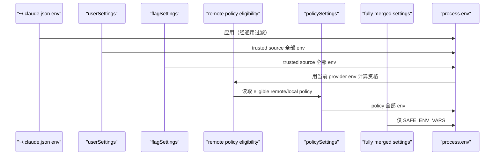

为什么 policy 不和 user/flag 放在一个简单循环里？remote policy eligibility 本身会读取 `CLAUDE_CODE_USE_BEDROCK`、`ANTHROPIC_BASE_URL` 等环境。必须先应用 user/flag，确定是否允许或如何取得 remote policy，再读取并应用 policy env。代码把这个排序依赖明确拆成两阶段。

project/local 不在 `TRUSTED_SETTING_SOURCES`。trust 前，它们只能通过最后一步贡献 `SAFE_ENV_VARS`。

### safe 不等于“所有 provider 选择都禁止”

当前 allowlist 包含：

```text
CLAUDE_CODE_USE_BEDROCK
CLAUDE_CODE_USE_VERTEX
CLAUDE_CODE_USE_FOUNDRY
```

所以项目配置可以在 trust 前选择使用用户自己的 Bedrock/Vertex/Foundry 环境。这与把流量重定向到任意攻击者端点不同。以下变量不在 safe list：

```text
ANTHROPIC_BASE_URL
ANTHROPIC_*_BASE_URL
HTTP_PROXY / HTTPS_PROXY
NODE_EXTRA_CA_CERTS
ANTHROPIC_API_KEY / ANTHROPIC_AUTH_TOKEN
```

前者是受限 provider switch，后者可能改变端点、信任根或凭据。安全边界要按能力分类，不能只看变量名里是否有 provider。

如果 `CLAUDE_CODE_PROVIDER_MANAGED_BY_HOST` 在宿主启动环境中为真，`filterSettingsEnv()` 还会从所有 settings-sourced env 中剥离一组由宿主管理的 provider variables。宿主所有权高于 settings merge，这是又一层控制面；本章只说明边界，不展开桌面宿主协议。

### trust dialog 不只检查 env

`components/TrustDialog/utils.ts` 分别读取 project/local，检查：

- hooks、status line、file suggestion；
- Bash allow rules；
- `apiKeyHelper`、`otelHeadersHelper`；
- AWS/GCP helper commands；
- 非 safe allowlist 的环境变量；
- TrustDialog 本体还检查 project-scope MCP server、slash command/skill Bash。

它没有因为 effective object 最后被 policy 覆盖，就停止检查 project raw source。信任问题关心的是“项目提供了什么执行能力”，不只是“某个标量最终显示什么”。这也是 `getSettingsForSource()` 存在的重要原因：安全审查经常要看原始来源，而不是只看合并结果。

## Interactive 与 Headless 的 trust 责任不同

Interactive 在 setup screen 中展示 trust dialog。用户接受后，`applyConfigEnvironmentVariables()` 才把 fully merged settings 的全部 env 应用到 `process.env`，并清理 CA、mTLS、proxy 等相关缓存、重新配置全局 agents。

Headless/Print 不展示这个对话框。`main.tsx` 在 non-interactive 分支明确调用 full env application，然后启动 Git/system context、遥测、hook 和查询流程。help text 同时警告：`-p` 会跳过 workspace trust dialog，只应在你信任的目录使用。

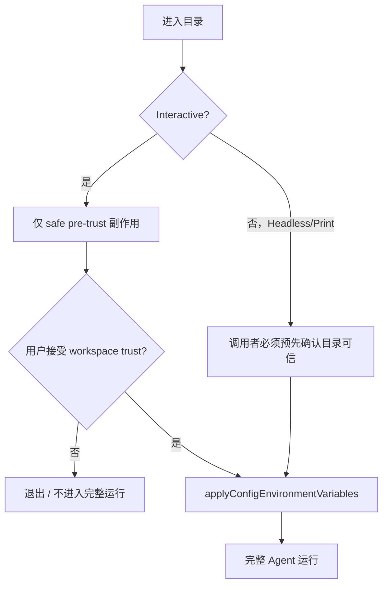

准确表述是：

> Headless 没有产品内的交互式 trust gate；信任是隐式的、由调用者前置承担，不是不存在。

这对 CI/CD 很重要。流水线从外部 PR checkout 代码后直接运行 `claude -p`，等于流水线自己接受了该目录内 project/local 的 helper、env 和其他执行面。企业方案应在受控 checkout、配置剥离、容器/Sandbox 和 policy enforcement 后再启动，而不是指望 CLI 弹窗。

## 回到 `permissions.defaultMode`：effective value 仍不是最后一步

默认来源合并结束后，假设 effective setting 是 `dontAsk`。`permissionSetup.ts` 约 721-800 行还会构建 ordered modes：

```text
dangerouslySkipPermissions
-> --permission-mode CLI
-> settings.permissions.defaultMode
-> default fallback
```

它还会：

- 在远程环境忽略不支持的 default mode；
- 对 auto mode 检查 feature/circuit breaker；
- 遇到组织或 settings 禁止 bypass 时跳过该候选；
- 选第一个合法 mode。

因此排查“为什么实际模式是 plan”要分两段：

1. source documents 怎样合成 effective `permissions.defaultMode`；
2. runtime chooser 为什么接受、跳过或覆盖这个 setting。

只查 `/status` 里的来源不够，只查 `permissionSetup` 也不够。一个成熟的 provenance 页面最好同时展示：

```text
effective setting: dontAsk
setting contributor: policySettings / managedFile
runtime override: --permission-mode plan
final decision: plan
decision reason: explicit CLI session override
```

这类“配置 provenance + 决策 provenance”对 Agent 比普通 Web 服务更重要，因为一个设置可能改变工具权限、模型端点、hook 执行和会话持久化。

## 运行中策略到达：不是修改旧对象，而是发布新观察状态

`main.tsx` 用 `void loadRemoteManagedSettings()` 非阻塞启动远程策略加载。加载器：

- 先尝试磁盘缓存，尽快解除等待者；
- 后台 fetch，失败时 fail open；
- eligible 时启动轮询；
- 设置有内容或发生变化时 `notifyChange('policySettings')`。

change detector 在 fan-out 前 reset settings caches。Interactive 的 AppState subscription 和 Headless 的直接 subscription 都调用 `applySettingsChange()`：重新读取 effective settings、permission rules 和 hooks，再向 AppState 写入新 settings。`onChangeAppState` 观察到 settings 变化后处理 env、认证缓存等副作用。

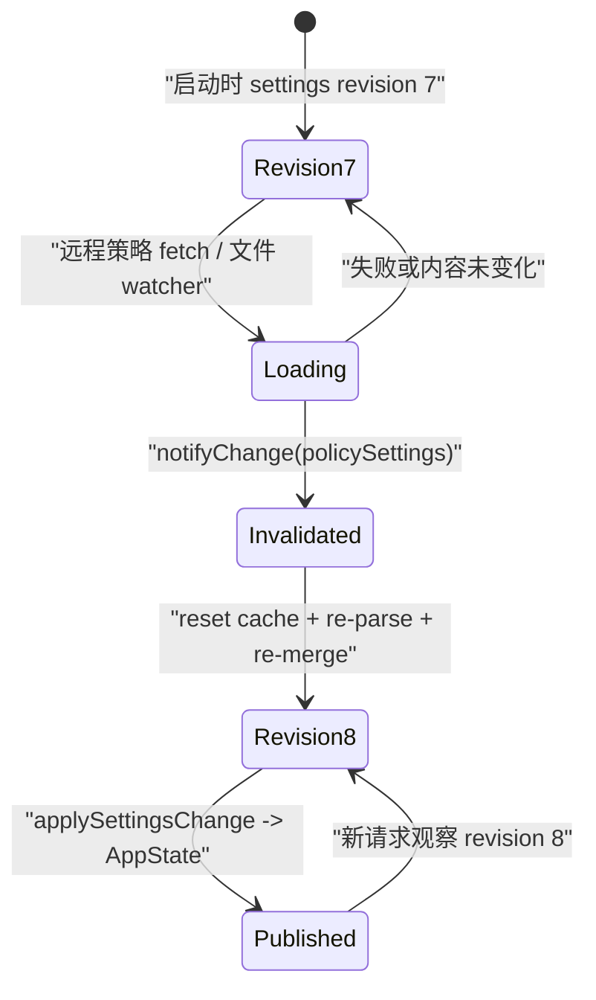

图里用 revision 是企业化表达。当前 Claude Code settings 对象没有公开的递增 revision 字段，也不是 deep-frozen snapshot；但运行机制确实是“清缓存、重读、发布新状态”，不是要求所有消费者手工修改每个旧字段。

H1 把这个隐含边界做成显式契约：`ConfigurationSnapshot{revision,effective,provenance}` 深冻结。正在运行的 Core 持有 revision 7 就继续按 revision 7 完成本次确定性决策；下一次 run 取得 revision 8。若企业要求 policy 立即中止危险工具，应额外定义 policy revocation signal，不能依赖对象在后台被悄悄改写。

远程身份、ETag、安全检查、同步缓存和轮询治理会在后续企业控制平面单元深入。本章停在“新策略怎样让当前 effective state 失效并重新发布”，避免把主线淹没在控制面细节里。

## 用 clean-room 实验把五个口号变成可反证行为

实验代码位于：

```text
curriculum/units/M06/code/typescript/
curriculum/units/M06/code/python/
```

运行 TypeScript：

```powershell
cd "D:\agent\Claude code最新\curriculum\units\M06\code\typescript"
node configuration.test.ts
node demo.ts
powershell -NoProfile -ExecutionPolicy Bypass -File .\typecheck.ps1
```

运行 Python：

```powershell
cd "D:\agent\Claude code最新\curriculum\units\M06\code\python"
python -m unittest -v test_configuration.py
python demo.py
```

当前实际结果：TypeScript `9/9`、Python `9/9`，TypeScript strict typecheck 通过。它们是 clean-room 运行验证，不是 Claude Code 原仓库测试。

### 先读懂 Resolver 的边界

TypeScript 主接口只接收结构化输入：

```ts
export type ResolveConfigurationInput = {
  revision: number
  selectedOrdinarySources?: readonly OrdinarySettingSource[]
  orderMode?: 'canonical' | 'snapshot-compatible'
  sourceOrder?: readonly SettingSource[]
  pluginSettings?: SourceInput
  sources?: Partial<Record<SettingSource, SourceInput>>
  flagInline?: SourceInput
  policyProviders?: readonly PolicyProvider[]
}
```

它没有读取 `process.argv`、文件路径或 `process.env`。这不是偷工减料，而是在验证一个明确契约：发现/IO adapter 先把外部世界变成 source inputs，Resolver 只负责选择、合并、provenance 和 snapshot。

`as const` 让 `SETTING_SOURCE_ORDER` 的元素不再被推宽成任意 `string`，于是 `typeof tuple[number]` 可以得到五个字面量组成的联合类型。Java 可用 enum/sealed type，Python 用 `Literal` 表达同样的有限集合。

### 实验一：默认深合并与字段 provenance

结论假设：默认 canonical order 下，policy 贡献最终 `defaultMode`，user/project 共同贡献 allow 数组。

输入：使用本章示例的 user/project/flag/managedFile policy。

观察点：

```text
effective.permissions.defaultMode == dontAsk
provenance.leaves[permissions.defaultMode] == policySettings
arrayItems[permissions.allow[0]] == userSettings
arrayItems[permissions.allow[2]] == projectSettings
```

反证：provenance 只能指向整个 `permissions` 对象，或 project 的 Glob 被整段 policy 对象删掉。

### 实验二：快照兼容顺序是否真的改变最终值

结论假设：空 ordinary selection 时 canonical order 是 `flag -> policy`，snapshot-compatible order 是 `policy -> flag`。

输入：flag.model=`flag-model`，policy.model=`policy-model`。

观察点：canonical 得到 policy-model；compatibility 得到 flag-model。

反证：两个结果相同，说明顺序函数只是装饰，没有控制 merge loop。

这个实验尤其重要，因为它没有去运行或修改 Claude Code 私有源码，却用一个最小可执行模型证明“有序来源列表改变最终值”的机制。

### 实验三：policy provider 是选择，不是合并

输入：invalid remote、empty MDM、non-empty managedFile、non-empty HKCU。

观察点：provider 是 managedFile，effective 只含 managedFile 的 env，不含 HKCU；errors 保留 remote invalid。

反证：managedFile 与 HKCU 字段同时出现，说明 provider selection 被误实现成 merge。

### 实验四：invalid source 是否整份退出

输入：user 有 model；project 同时有 model 和 permission，但 `valid=false`。

观察点：user model 保留，project 的两个字段都不出现，error 保留。

反证：系统从 invalid project 中捞出“看起来合法”的 permission。这会把 schema boundary 变成不可预测的部分成功。

### 实验五：pre-trust 与 trusted env

输入：

```text
user.ANTHROPIC_BASE_URL = user.example
project.ANTHROPIC_BASE_URL = project.example
project.CLAUDE_CODE_USE_BEDROCK = 1
project.PATH = project-bin
```

观察点：pre-trust 保留 user endpoint、允许 project provider switch、不应用 project PATH；trusted 后使用 fully effective 的 project endpoint 和 PATH。

反证：project endpoint 或 PATH 在 pre-trust 出现，或者 safe provider switch 被一刀切丢弃。

### 实验六：新 revision 不修改旧 snapshot

输入：用同一个外部 source object 先发布 revision 1，再修改输入、发布 revision 2。

观察点：revision 1 仍为旧 model；effective object 已 freeze（Python 用 `MappingProxyType` 与 tuple）；直接写入抛错。

反证：修改外部 input 或新 snapshot 后，旧 run 的配置同步变化。

## 主动破坏四次，才能真正理解边界

### 破坏一：把 canonical order 改成 Set append

让 `deriveCanonicalOrder([])` 返回 `policy -> flag`。运行测试，观察 flag 覆盖 policy。写出这会怎样影响企业管理员对“策略不可覆盖”的预期。

### 破坏二：把 policy providers 全部 merge

删除 first-valid return，把四个 provider 合并。让 HKCU 覆盖 managed file。解释为什么 provider 权威边界消失，审计也无法回答“当前策略来自哪套控制面”。

### 破坏三：trust 前直接返回 effective env

把 `projectEnvironment(pre-trust)` 改成 trusted 路径。确认 project endpoint/PATH 提前出现。不要把结果描述成“测试失败”，要说明第一次网络请求或 helper spawn 会因此改变。

### 破坏四：不 clone/freeze snapshot

直接把 source object 塞进 snapshot。发布 revision 2 前修改 source，观察 revision 1 也变化。解释这种共享引用怎样让 trace、重试和事故复盘失去可重复性。

每次只破坏一项，先写预期和反证，再运行双语言测试。完成后恢复文件并跑 H1 全量回归。

## H1-in-progress：配置属于 Core 的输入，不属于 Core 的发现逻辑

M05 的 H1 已有 Surface/Core 边界。M06 在外围加入 configuration pipeline：

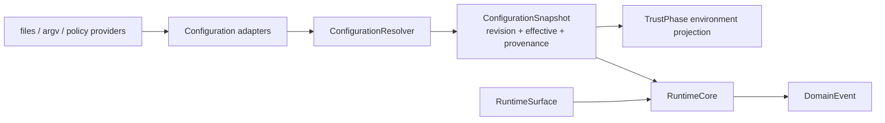

新增不变量包括：

- Resolver 接受显式有序来源；
- H1 默认 canonical order，compatibility order 只用于研究；
- policy provider 先选择、再参加 main merge；
- invalid source 整体退出并留 error；
- flag/policy 在 Harness 内只读；
- snapshot 带 revision、leaf/item provenance，旧版不原地改变；
- trust phase 只决定环境副作用投影，不回写 effective settings；
- Core 不读取 argv、settings files 或全局 `process.env`。

累计回归命令：

```powershell
cd "D:\agent\Claude code最新\mini-agent-harness"
powershell -NoProfile -ExecutionPolicy Bypass -File .\tests\run-h1-regression.ps1
```

当前结果是 H1-in-progress `6/6` 检查通过，其中保留 S0 `15/15`；RuntimeSurface TypeScript `8/8`、Python `7/7`；configuration TypeScript/Python 各 `9/9`；TypeScript strict 通过。

本单元的 Harness 裁决是 `merge`。关键不是复制 Claude Code 的所有设置字段，而是把最终值、来源、信任和 revision 变成可测试契约。

## 迁移到 Java/Spring：不要让 `@Value` 成为全局隐形输入

一个常见企业 Agent 服务会这样写：

```java
@Service
class AgentService {
    @Value("${agent.model}")
    String model;

    Mono<Result> run(Request request) {
        return callModel(model, request);
    }
}
```

代码短，但你很难回答：这个 model 来自 application.yaml、环境变量、Nacos、租户策略还是请求 override？运行中刷新后，一个已经开始的 tool loop 会切到新 model 吗？谁允许请求覆盖组织策略？

更稳妥的契约是：

```java
record ConfigurationSnapshot(
    long revision,
    Map<String, Object> effective,
    Map<String, ConfigSource> provenance
) {}

interface ConfigurationResolver {
    ConfigurationSnapshot resolve(OrderedSources sources);
}

record RunContext(
    String sessionId,
    ConfigurationSnapshot configuration
) {}
```

Spring Environment 可以继续作为 adapter，但进入 Agent Core 前要形成明确 snapshot。租户 override、请求 override、组织 policy 的顺序由有序列表表达，不能依赖 `Map` 实现细节。动态刷新发布新 revision；是否影响 in-flight run 由业务策略决定。

对于敏感字段，再把“值解析”和“副作用授权”分开：

- endpoint、proxy、credential helper 需要受信任来源；
- 普通 UI preference 可以允许项目/租户覆盖；
- policy-deny 类字段使用 monotonic rule，不能只靠 last-write-wins；
- secret 只记录来源和版本，不把原值放进 trace。

Spring Cloud Config/Nacos/Apollo 给你的是配置分发，不自动给你 Agent 级 provenance、run pinning 和 tool permission consistency。那些仍是 Harness 的职责。

## 与 RAG 和 LangGraph 的关系：配置是每次运行的隐藏依赖

RAG 结果经常因为“代码没变”却表现漂移，真正变化的是：embedding model、index alias、topK、reranker、tenant filter 或 prompt policy。把这些散落在环境变量和 singleton 中，离线评测无法复现线上请求。

更好的 trace 至少带：

```text
run_id
configuration_revision
model route source
retriever/index revision
topK/reranker provenance
policy provider
trust/credential profile
```

LangGraph checkpoint 保存 graph state，但它不会自动冻结外部配置。如果恢复一个三天前的 checkpoint，却从全局单例读取今天的 policy，恢复后的下一节点可能改变行为。你需要决定：

- checkpoint 固定原 configuration snapshot，保证可重复；
- 恢复时升级到新 policy，并记录 migration/revalidation；
- 安全撤销类 policy 强制覆盖旧 snapshot，并使 run 进入待确认状态。

这不是框架 API 选择，而是配置所有权和恢复语义。

## 企业可观测性：不要记录配置全文，要记录决策链

建议为一次 resolve 产生这些结构化事件：

```text
config.source.discovered
config.source.rejected
config.policy.selected
config.value.resolved
config.snapshot.published
config.effect.applied
```

事件带 source type、provider、revision、字段路径、是否敏感、错误类别和 run/session ID。敏感 env、token、header 不记录原值；可以记录 hash、presence 或 secret version。

排障页面不应只给一个巨大的 JSON diff，而要能回答：

```text
字段: permissions.defaultMode
effective: dontAsk
贡献链: user(default) -> project(plan) -> flag(acceptEdits) -> policy(dontAsk)
policy provider: managedFile
source order mode: canonical
runtime override: none
snapshot revision: 8
```

遇到当前快照的 explicit source order 例外，还应展示 actual order，而不是只展示标准 priority 文档。可观测性要记录真正执行的序列。

## 资深 Agent 开发岗面试：从一个配置值讲到控制面

下面的问题按大厂 Agent 开发岗位的真实追问组织。回答先给结论，再用 Claude Code 当前设计落到机制，最后说明企业迁移。练习时不要背行号；先让两分钟表达自然，追问证据时再定位符号。

### 问题 1：Agent 系统为什么不能在业务代码里到处直接读环境变量？

> 先说结论：因为环境变量是全局可变输入，到处读取会让一次 Agent 运行失去一致配置、来源解释和可重复性。Claude Code 的做法很有启发，它先把 user、project、local、flag、policy 合成 effective settings，再按 trust phase 把允许的 env 投影进 `process.env`；也就是说“值解析”和“副作用生效”是两步。企业服务里我会在 run 开始时生成带 revision 和 provenance 的 `ConfigurationSnapshot`，放进 RunContext，模型、Retriever 和 Tool 都从这个 snapshot 读，而不是各自读全局环境。动态配置更新发布新 revision，默认只影响新 run；如果是安全撤销，再通过显式中止或 revalidation 影响 in-flight。这样出问题时能回答一个值来自哪层、何时生效，而不是只看机器当前环境猜历史行为。

### 问题 2：Claude Code 的配置优先级到底是什么，嵌套对象和数组怎么处理？

> 先说结论：默认主链是 plugin base 之后按 user、project、local、flag、policy 从低到高深合并，但“覆盖”只准确描述标量。`settings.ts` 用 `mergeWith`，普通对象递归到叶子；数组由 customizer 做 concatenate 再 `uniq`，所以 user 的 Read 和 project 的 Glob 可以同时保留，policy 只覆盖冲突的 `defaultMode`，不会自动替换整个 permissions 对象。policy 本身还要先从 remote、MDM、managed file、HKCU 中选一个 provider，这一步是 first-source-wins，不是 merge。面试里我会先把 provider selection、main source merge、runtime decision 三层分开，因为 effective `defaultMode` 后面还可能被 CLI permission mode 和运行 gate 改变。企业实现里我会为叶子和数组项保留 provenance，不只写“配置来自 policy”。

### 问题 3：`--setting-sources` 只是过滤来源吗？你从源码发现了什么边界？

> 先说结论：从接口意图看它是普通来源过滤器，但当前快照的字面实现还会改变迭代顺序，所以不能无条件说优先级固定。`parseSettingSourcesFlag` 保留用户给出的 user/project/local 顺序；`getEnabledSettingSources` 把它放入保持插入顺序的 Set，然后依次追加 policy、flag，没有按 `SETTING_SOURCES` 重排。默认 state 本来含五项，所以是 user 到 policy；显式空列表却变成 policy 再 flag，后合并的 flag 能覆盖普通 policy 叶子。这个发现对教材是 material 的，因为它直接改变最终值。迁移到企业 Harness 时我不会复制偶然 Set 顺序，而是把 canonical order 作为显式契约，同时保留 compatibility function 和测试描述当前版本行为。这个案例也说明源码审查不能只读常量和注释，必须追到真正进入 merge loop 的数组。

### 问题 4：为什么企业策略的 remote、MDM、文件和 HKCU 不能都合并？

> 先说结论：因为它们代表不同权威控制面，先选唯一 provider 才能保证来源、故障降级和审计语义清楚。Claude Code 当前顺序是 remote、MDM/HKLM/plist、managed files、HKCU，首个有效非空 provider 成为整个 policySettings；胜出的 policy 再作为一个主来源参加普通 merge。文件 provider 内部可以合并 base 和排序后的 drop-ins，因为它们属于同一权威域的策略碎片。若把所有 provider 混合，低权威 HKCU 可能补进或覆盖管理员字段，事故时也说不清当前 policy 究竟由谁控制。我的企业设计会把 `PolicyProviderSelector` 和 `SettingsMerger` 分成两个接口，前者输出 provider identity、版本和错误，后者只接受已经选定的 policy document。

### 问题 5：项目配置里的环境变量什么时候可以生效，Headless 为什么更危险？

> 先说结论：Interactive trust 前只能让 user、flag、policy 的任意 env 和 project/local 的 safe allowlist 生效；Headless 没有交互 trust gate，所以调用者必须预先保证目录可信。Claude Code 的 `applySafeConfigEnvironmentVariables` 先应用 user/flag，再据此判断 remote policy eligibility，然后应用 policy，最后只从 fully merged settings 取 safe vars。像 Bedrock/Vertex/Foundry provider switch 在 safe list，但任意 base URL、proxy、额外 CA、token 不在。用户接受 workspace trust 后才 full apply。`-p` 会直接 full apply，help 明确要求只在可信目录运行。企业 CI 处理外部 PR 时，我会先剥离项目配置、使用受控 policy、容器和 Sandbox，再启动 headless Agent；不能把“没有弹窗”理解成“没有信任要求”。

### 问题 6：配置文件中一个字段 schema 错了，应该部分成功还是整份失败？

> 先说结论：没有通用答案，但边界必须明确；当前 Claude Code 除单条 invalid permission rule 会预先过滤外，其他 Zod schema 错误会让整个来源文件不参加合并。这样做的好处是来源内语义原子，不会从一个未知版本或拼写错误的文档里挑几项凑出半有效状态；代价是一个错误可能让同文件的合法设置一起消失，所以 errors 和 UI 提示必须可靠。源码里 `safeParse` 失败返回 settings null，不代表“安全地部分解析”。我的企业 resolver 会给每类文档定义 validation unit：组织 policy 通常整份拒绝，独立 feature fragment 可以按 fragment 拒绝，权限规则若天然独立则可逐条过滤，但必须保留 warning 和来源。测试要验证失败范围，而不是只断言没有抛异常。

### 问题 7：动态策略更新时，正在运行的 Tool Loop 应该立即看到新配置吗？

> 先说结论：默认不要让它无记录地中途切换；每次 run 应固定 configuration revision，安全撤销再走显式中止或 revalidation。Claude Code 当前通过 change detector 清缓存、`applySettingsChange` 重读 settings/permissions/hooks，并把新 settings 发布到 AppState；这是热更新，但没有公开的深冻结 revision snapshot。H1 把 revision 和 freeze 做成显式契约，旧 run 持有旧对象，新 run 取得新对象。企业里我会把更新分三类：UI preference 可下轮生效；模型或检索参数通常下个 turn 生效并记录；deny policy、credential revoke 需要广播 revocation，取消当前工具或在下一副作用前重新鉴权。关键是把更新策略写进协议，不能依赖共享 Map 被后台线程改掉。

### 问题 8：怎样设计配置 provenance，才能排查“为什么用了这个模型/权限”？

> 先说结论：要同时记录配置贡献链和运行决策链，单个 effective JSON 或最后来源标签都不够。以 Claude Code 的 permission mode 为例，配置层要展示 user、project、flag、policy 对 `permissions.defaultMode` 的每次贡献、实际 source order 和 policy provider；运行层还要展示 `--permission-mode`、远程环境限制、bypass disable 和 feature gate，最后给出选中的 mode 及 reason。数组要能说明每个 allow item 来自哪层，敏感 env 只记录 presence/version。我的系统会把 `config.value.resolved` 与 `decision.made` 作为两类 trace event，都带 run ID 和 configuration revision。这样回放时既能复现输入，也能解释为什么某个候选被跳过。

### 问题 9：用 Java/Spring 或 LangGraph 实现时，配置模块放在哪里？

> 先说结论：配置发现放在 adapter/control plane，Resolver 生成领域 snapshot，Agent Core 和 graph node 只消费 RunContext，不直接依赖 Spring Environment 或全局单例。Java 里我会把 Spring Cloud Config、环境变量和租户请求转成 `OrderedSources`，生成 immutable record；WebFlux request、队列任务和定时任务都在进入 Core 前绑定 revision。LangGraph checkpoint 里至少保存 snapshot ID；恢复时是继续旧配置、迁移到新配置还是被安全 policy 强制 revalidate，要有明确分支。RAG 的 index alias、topK、reranker 也属于同一 snapshot，否则离线评测和线上运行对不上。框架能帮你分发或持久化，但不会替你定义来源权威、信任和恢复语义。

### 问题 10：配置系统最容易被忽略的并发和缓存问题是什么？

> 先说结论：最危险的是把“缓存已失效”误认为“所有消费者原子切换”，以及让可变对象引用穿过缓存边界。Claude Code 有 session、per-source、parse-file 三层缓存，reset 会一起清；parse 返回 clone 防止 `mergeWith` 污染 cache entry，change detector 再通知 AppState。但直接 getter 的消费者仍可能在不同时间读取，effective 对象也不是公开 deep-frozen。企业实现要用版本化 snapshot 和原子引用发布，新请求一次读取后固定；旧 snapshot 不可变，资源初始化按 revision 建 key，更新事件幂等。若某项副作用必须立即撤销，就独立建 revocation channel。测试除了值正确，还要让更新与运行交错，验证同一 run 不出现半旧半新配置。

这些回答的共同结构是：先给结论，再分清来源、选择、合并、信任、发布和消费。只背“policy 优先级最高”不够；能指出它在哪些条件下是默认意图、当前快照有哪些例外、企业 Harness 怎样修正，才体现源码级判断力。

## 离开本单元前完成一次完整闭环

先关闭正文，凭记忆画出两张图：

1. source discovery -> parse -> policy selection -> main merge -> effective settings；
2. effective env 在 pre-trust、interactive trusted、headless 三种路径怎样进入进程。

然后任选一个字段，不要使用本章答案，完成反向追踪：

```text
实际运行行为
<- runtime chooser
<- effective leaf
<- actual enabled source order
<- raw source documents / policy provider
<- argv、文件或远程输入
```

必须能回答：

- 为什么 `permissions` 对象不是整体来自 policy？
- first-source-wins 只在哪一层成立？
- `--setting-sources ''` 在当前快照里实际是什么顺序？
- 为什么 effective env 与已应用 env 不是同一个状态？
- 为什么 Headless 是 implicit trust，而不是 no trust？
- 为什么 H1 同时保留 compatibility order 和 canonical order？

接着运行双语言 demo 和测试，做至少一个顺序破坏、一个 trust 破坏。最后为自己的 Agent/RAG 项目写一页配置契约：列出 source authority、ordered merge、policy selection、schema failure unit、provenance、revision、in-flight update policy 和敏感字段观测规则。

如果这些工作都能独立完成，你掌握的就不是“Claude Code 有几个 settings.json”，而是一条可迁移原则：

> 配置不是全局字典，而是有来源、有顺序、有验证、有信任阶段、有版本的运行输入；只有把这些边界显式化，Agent 的权限、模型和工具行为才可解释、可复现、可治理。

## 源码与实验定位地图

| 问题 | 决定性位置 |
| --- | --- |
| CLI settings flags 的早期解析 | `claude-code-CLI/src/main.tsx:432-515` |
| 默认 allowed sources bootstrap state | `claude-code-CLI/src/bootstrap/state.ts:311-319, 1226-1232` |
| flag settings path 与 SDK inline state | `claude-code-CLI/src/bootstrap/state.ts:1132-1148` |
| 默认来源常量、参数解析、enabled Set 顺序 | `claude-code-CLI/src/utils/settings/constants.ts:3-24, 123-177` |
| source root 与文件路径 | `claude-code-CLI/src/utils/settings/settings.ts:233-307` |
| policy provider first-source-wins | `claude-code-CLI/src/utils/settings/settings.ts:319-406, 673-738` |
| managed base 与 drop-ins | `claude-code-CLI/src/utils/settings/settings.ts:55-120` |
| JSON、permission rule、Zod 与 clone | `claude-code-CLI/src/utils/settings/settings.ts:172-230` |
| 数组读取 merge customizer | `claude-code-CLI/src/utils/settings/settings.ts:526-547` |
| 单来源写回 replace/delete customizer | `claude-code-CLI/src/utils/settings/settings.ts:409-506` |
| plugin base 与主 settings merge | `claude-code-CLI/src/utils/settings/settings.ts:638-795` |
| effective/per-source fresh view | `claude-code-CLI/src/utils/settings/settings.ts:798-858` |
| 三层 cache 与 reset | `claude-code-CLI/src/utils/settings/settingsCache.ts:5-79` |
| pre-trust 与 full env projection | `claude-code-CLI/src/utils/managedEnv.ts:82-199` |
| safe/dangerous env 分类 | `claude-code-CLI/src/utils/managedEnvConstants.ts:84-170` |
| TrustDialog raw-source capability checks | `claude-code-CLI/src/components/TrustDialog/utils.ts:8-245` |
| Interactive trust UI | `claude-code-CLI/src/components/TrustDialog/TrustDialog.tsx:23-180` |
| Headless implicit trust 与 full env | `claude-code-CLI/src/main.tsx:1952-1977, 2584-2597` |
| permission mode 运行时继续选择 | `claude-code-CLI/src/utils/permissions/permissionSetup.ts:721-810` |
| settings change 重新发布 AppState | `claude-code-CLI/src/utils/settings/applySettingsChange.ts:16-91` |
| remote policy load、fail-open 与 notify | `claude-code-CLI/src/services/remoteManagedSettings/index.ts:505-605` |
| TypeScript clean-room | `curriculum/units/M06/code/typescript/configuration.ts` |
| Python clean-room | `curriculum/units/M06/code/python/configuration.py` |
| H1 累计配置契约 | `mini-agent-harness/contracts/h1-contract.md` |
