# M07 状态不是一个大对象：从 Bootstrap 走到一次请求的稳定视图

> 本单元主体阅读、画图与源码跟踪约 5 至 7 小时。TypeScript/Python 实验、破坏实验和企业状态设计另计约 2.5 至 4 小时。

你启动 Claude Code，MCP 服务器还在连接。界面已经出现，第一条用户输入也已经提交。就在 Query 即将开始时，一个 MCP server 连接成功，新工具被写入运行状态。

现在有一个很实际的问题：这次 Query 应不应该看到新工具？

如果回答“当然应该，读取最新状态就行”，同一次请求的 permission、model、system prompt 和 tools 可能在不同时间点来自不同版本。如果回答“不应该，请求开始后全部冻结”，一个刚连接成功的工具又可能直到下一轮才能被模型使用。更麻烦的是，UI 组件手里的值、store 当前值和 QueryEngine 保存的值，可能本来就不是同一时刻的对象。

这个问题不能靠一句“用全局状态管理”解决。我们必须先知道系统里到底有几种状态、谁创建、谁拥有、谁能修改，以及一次请求在哪里选择稳定性或新鲜度。

先把整条路看见：

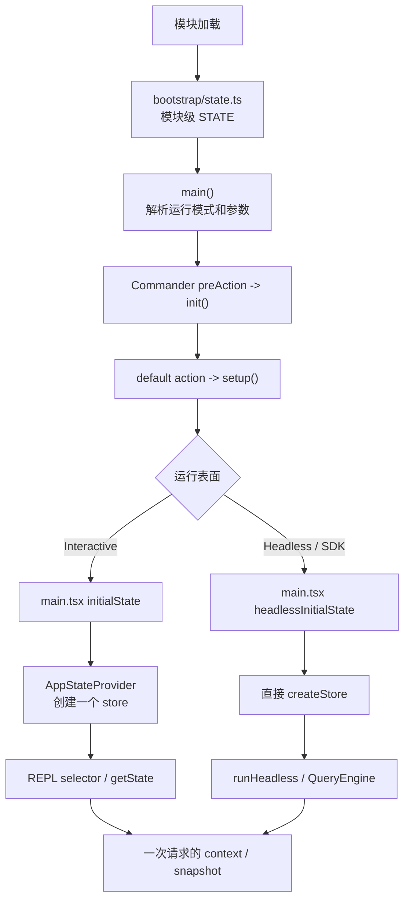

这张图里已经出现了两个容易混淆的词：Bootstrap `STATE` 和 AppState store。它们不是同一个对象，也不是“旧状态升级成新状态”的前后阶段。

本单元会从启动时序走到请求边界。走完以后，你应能面对任意 Agent 系统中的一个字段，连续追问：它是什么范围的状态？谁是 owner？读取的是 live value 还是 snapshot？更新是否有副作用？失败时已经提交了什么？

## 先用四个问题代替“全局状态”这个模糊词

以后看到一个状态，不要先问它放在哪个文件，先问四个问题：

1. **创建点**：它在模块 import、进程 init、会话创建，还是请求创建时产生？
2. **生命周期**：它活到进程退出、Provider unmount、会话切换，还是单次请求结束？
3. **owner**：谁保存 current value，谁有权替换它，谁只能订阅或读取？
4. **一致性**：读取者需要最新值，还是需要在一段操作内保持不变的 revision？

用这四问看当前快照，可以先得到一张粗略地图：

| 范围 | 典型 owner | 例子 | 本单元中的名字 |
| --- | --- | --- | --- |
| 进程/模块 | `bootstrap/state.ts` 模块闭包 | cwd、session ID、启动 flags、计量、缓存 | Bootstrap state |
| 一个运行 root | `Store<AppState>` | settings、permission、MCP、Plugin、UI、Task registry | Session/运行状态 |
| React 一次渲染 | `useSyncExternalStore` 返回值 | selector 选出的 mode、model、提示状态 | render snapshot |
| 一次请求或阶段 | context 对象、局部常量 | configuration revision、initial AppState、tools view | request snapshot |

这里的“Session/运行状态”是教学分类，不代表 `AppState` 每个字段都严格只有会话寿命。真实 AppState 是一个历史演进后的大容器，里面也有 UI、缓存和任务状态。分类的目标不是给源码重新命名，而是让你的 Harness 不继续复制这种生命周期混杂。

## 第一份状态在 `init()` 之前已经存在

很多初学者会把 `init()` 想成程序的总构造器：先进入 `main`，再调用 `init`，然后所有状态才出现。当前源码不是这样。

入口 `src/entrypoints/cli.tsx` 动态导入 `main.js`。`main.tsx` 的导入链又加载 `src/bootstrap/state.ts`。ES module 在执行调用方函数之前先完成依赖模块求值，于是下面这行先运行：

```ts
const STATE: State = getInitialState()
```

`getInitialState()` 在这一刻读取并规范化 cwd，生成 session ID，创建 Map、Set、数组和大量默认字段。也就是说，当 `main()` 还没有进入 Commander `preAction`，Bootstrap `STATE` 已经存在。

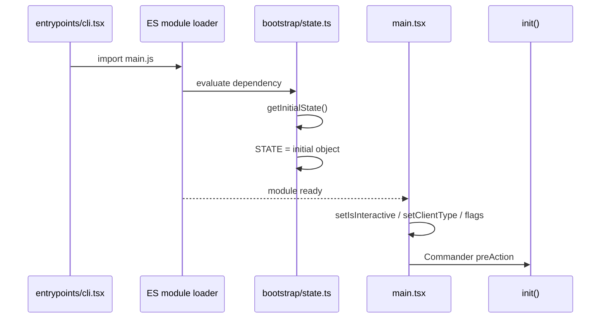

这解释了 Bootstrap 层为什么存在：一些非常早的代码需要一个依赖很少、不会反向导入 UI 或高层服务的访问点。例如在 React tree 还不存在时，CLI 已经需要知道运行模式、cwd、session ID 和设置来源。

但源码在 `State` 前写了：

```text
DO NOT ADD MORE STATE HERE - BE JUDICIOUS WITH GLOBAL STATE
```

在 `getInitialState()` 和 `STATE` 附近又分别写了 `THINK THRICE` 和 `ESPECIALLY HERE`。这不是装饰。模块单例解决了“很早就要访问”的问题，同时引入三种代价：

- 依赖被隐藏在 getter 内，函数签名看不出它读取了进程状态；
- 生命周期容易混合，进程、session 和单轮计量都可能堆进同一对象；
- 测试只能重置共享对象，难以天然隔离并发案例。

因此正确设计结论不是“Claude Code 使用单例，所以 Harness 也应该建一个万能单例”，而是：Bootstrap 只能保存真正需要在依赖图底部、模块加载早期访问的最小状态。

## `const` 没有让 `STATE` 不可变

对 TypeScript 新手，这里必须停一下。

```ts
const STATE = getInitialState()
STATE.sessionId = nextId
```

`const` 只禁止变量 `STATE` 重新指向另一个对象，不禁止修改对象字段。Java 中更接近 `final State state`：引用不能重新赋值，对象仍可以变。

所以 Bootstrap 的 getter/setter 实际共享同一个可变对象。`switchSession()` 就会修改这个对象：先替换 `sessionId` 和 `sessionProjectDir`，再同步发出 `sessionSwitched` signal。

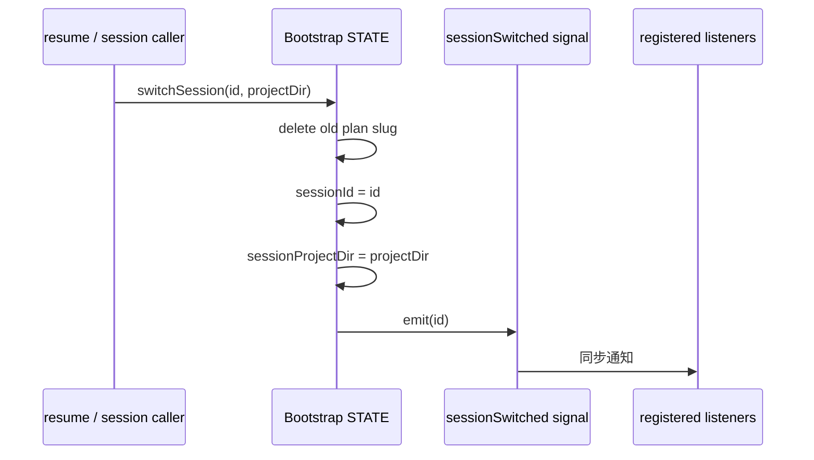

为什么不让 Bootstrap 直接 import 所有 listener？源码注释给出一个重要架构约束：Bootstrap 要保持依赖图的 leaf。高层模块反过来注册 callback，Bootstrap 只知道 signal，不知道 PID 文件、UI 或其他业务模块。

这是一种很有迁移价值的设计：底层状态可以暴露事件端口，但不应反向依赖所有消费者。

## 测试重置的是字段，不是模块身份

`resetStateForTests()` 只有在 `NODE_ENV === 'test'` 时可调用。核心逻辑是：

```ts
Object.entries(getInitialState()).forEach(([key, value]) => {
  STATE[key as keyof State] = value as never
})
```

它重新生成默认字段，然后逐个覆盖同一个 `STATE`。此外还清理单独的 token budget 变量和 session listeners。

为什么不简单写 `STATE = getInitialState()`？因为 `STATE` 是 `const`，而且模块里的 getter/setter 都围绕同一个对象身份工作。测试重置字段可以保留模块身份。

代价也很清楚：同一 Node 进程中的并发测试共享这份状态，一个测试重置可能改变另一个测试观察到的 session ID。M07 不修改只读快照，也不要求为这个边缘风险建立重型修复；但你的 clean-room Harness 不应该主动复制这个测试困难。

## `init()` 与 `setup()` 不是两个同义初始化函数

Bootstrap `STATE` 出现后，`main()` 先根据参数设置 `isInteractive`、client type、settings flag 等早期状态。Commander 只有真正执行 command 时才进入 `preAction`，其中调用 `init()`。

`src/entrypoints/init.ts:init` 是 memoized async function。它的职责更接近进程设施初始化：

- 启用配置读取；
- 在 trust dialog 前只应用安全环境变量；
- 设置 graceful shutdown；
- 启动或注册 telemetry、proxy、mTLS、LSP cleanup 等设施；
- 根据能力初始化 remote settings/policy loading promise。

随后默认 command 的 action 才调用 `src/setup.ts:setup`。`setup()` 面向本次工作目录和 session 装配，例如 custom session ID、messaging、worktree、hooks snapshot。

其中有一个不能随便重排的决定性顺序：

```text
setCwd(cwd)
-> captureHooksConfigSnapshot()
-> initializeFileChangedWatcher(cwd)
```

源码注释明确要求 `setCwd()` 在依赖 cwd 的代码之前调用，hooks snapshot 又必须在它之后。若重排，程序可能在目录 B 运行，却捕获目录 A 的 hooks 配置。这不是“启动慢一点”，而是信任边界和执行语义都可能改变。

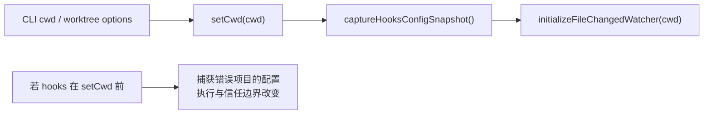

到这里可以得到第一个可迁移原则：**初始化顺序是一张依赖图，不是一串可以随意排序的 await。**

企业 Harness 最好把依赖写成显式构造条件，例如只有 configuration、cwd policy 和 model adapter 都 ready，才能创建 RuntimeContext；不要让第一次模型调用在深层才发现缺了一项。

## AppState 是形状，store 才是 owner

接下来进入最容易被名字误导的地方。

`src/state/AppStateStore.ts` 定义：

```ts
export type AppState = DeepImmutable<{ /* 很多字段 */ }>
export type AppStateStore = Store<AppState>

export function getDefaultAppState(): AppState {
  return { /* 新的对象、Map、Set、数组 */ }
}
```

这三个符号扮演不同角色：

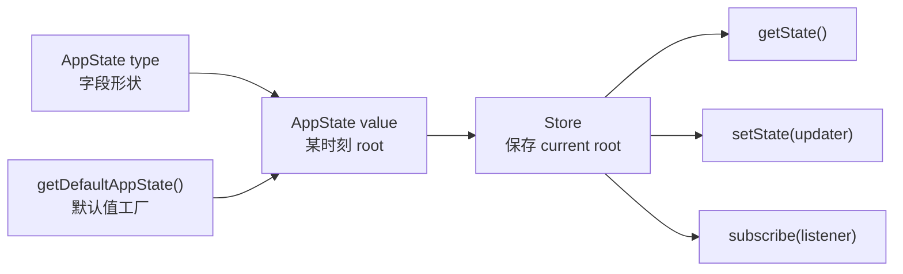

`AppState` 类型不拥有任何运行状态；一个普通对象值也不会自动通知观察者。只有 `createStore(initialState, onChange)` 创建的闭包，才保存 current root 和 listeners。

`DeepImmutable` 主要提供 TypeScript 编译期约束，不等于运行时每个对象都经过 `Object.freeze`。而且大型真实类型里还会对包含函数、Map/Set 或第三方对象的部分做现实妥协。真正决定通知的仍然是 root identity 和 updater 纪律。

另一个重要边界是：AppState 很大，但它不是“整个 Claude Code 会话”。它保存 settings、permission context、MCP、Plugin、Task registry、UI、恢复辅助状态等；交互式主消息数组仍由 REPL 的本地 `messages/messagesRef` 拥有，Headless 消息走 `print.ts/QueryEngine` 路径。M10 会完整讲消息所有权，这里只需要记住：**一个大状态类型不自动成为所有业务数据的 owner。**

## Interactive store 在 Provider 挂载时只创建一次

Interactive 主路径是：

```text
main.tsx 构造 initialState
-> launchRepl()
-> <App initialState={...}>
-> <AppStateProvider initialState={...} onChangeAppState={...}>
-> <REPL />
```

`AppStateProvider` 的核心源码经过 React Compiler 变换，语义可还原为：

```ts
const [store] = useState(() =>
  createStore(initialState ?? getDefaultAppState(), onChangeAppState),
)
```

这里的 `useState` 不是在保存 AppState，而是在保存 **store 实例**。传给 `useState` 的函数是 lazy initializer，只在这个 Provider 第一次挂载时调用。

因此后续父组件即使传入另一个 `initialState` prop，React 不会自动重建 store。`initialState` 的语义是“挂载初值”，不是“持续受控属性”。如果要恢复一个新 session，代码必须明确修改 store、重新挂载 root，或使用其他恢复路径，不能指望 prop 变化自动替换 owner。

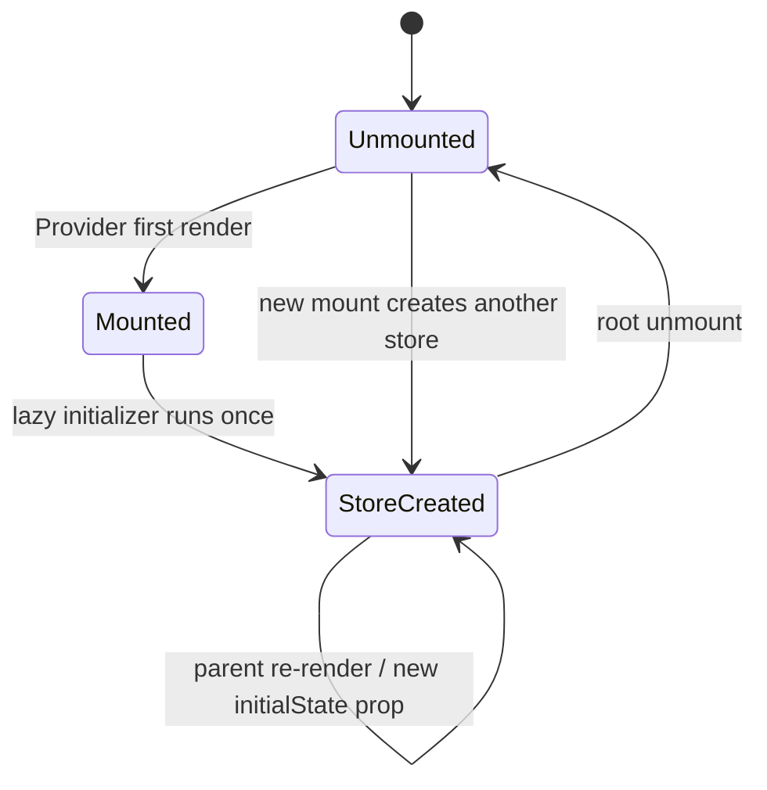

这和 Java/Spring 的区别很明显。Spring singleton bean 通常由 ApplicationContext 创建；React Provider 中的 store 则属于一个 UI root 的挂载生命周期。两个 root 即使渲染同一个 Provider 类型，也会得到两个实例。

Provider 还用 `HasAppStateContext` 禁止在同一子树内嵌套另一个 `AppStateProvider`。这是为了避免后代组件突然读取内层 store。但“禁止嵌套”不等于“整个进程只允许一个实例”。

## 一个进程中可以存在多个 AppState store

除了主 REPL，setup token、doctor、MCP approval、Teleport、InvalidConfigDialog、export renderer 等路径也会挂载 `AppStateProvider`。这些 root 可以调用 `getDefaultAppState()` 得到自己的默认对象，再创建自己的 store。

准确的所有权图如下：

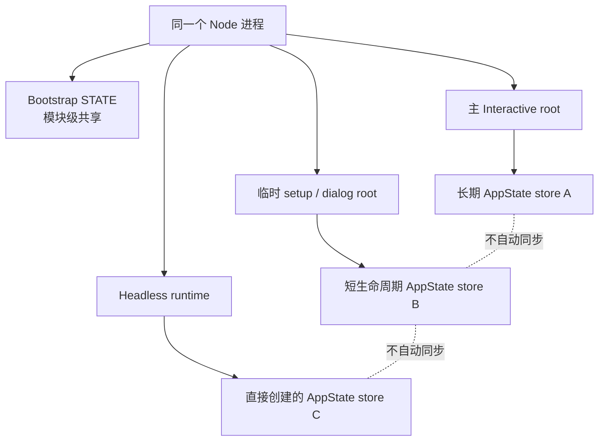

如果一个临时 dialog 修改自己的 `verbose`，不能据此断言主 REPL 的 store 也变化。只有落到共享外部设施的副作用，例如写回 global config，其他 root 后续重新读取时才可能观察到。

这也是为什么“状态在哪个类型里”还不够，必须继续问“哪一个实例”。

## Headless 不需要 React，仍然需要状态 owner

Headless 分支在 `main.tsx` 中先调用 `getDefaultAppState()`，再合入当前 MCP clients/tools、permission context、effort 和其他运行依赖，得到 `headlessInitialState`。

随后直接执行：

```ts
const headlessStore = createStore(headlessInitialState, onChangeAppState)

runHeadless(
  inputPrompt,
  () => headlessStore.getState(),
  headlessStore.setState,
  // ...
)
```

这说明 React 不是状态管理契约本身。React Provider 只是 Interactive 路径中创建并分发 store 的 adapter；Headless 通过依赖注入把 getter/setter 交给普通 TypeScript 代码。

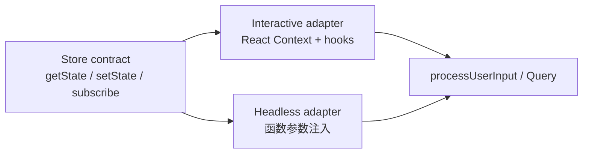

这个分层对企业系统很重要。若 Core 必须调用 React hook 才能取得 permission，Headless worker、消息队列消费者和单元测试都会被 UI 框架绑死。更稳妥的方式是：UI 用 hook 取得 store，再把普通 getter/setter 接口注入 Core。

## 24 行 store 如何定义整个更新语义

`src/state/store.ts:createStore` 很短，但决定了本单元最重要的行为：

```ts
const prev = state
const next = updater(prev)
if (Object.is(next, prev)) return
state = next
onChange?.({ newState: next, oldState: prev })
for (const listener of listeners) listener()
```

不要只把这段翻译成“更新状态并通知”。逐行看语义：

1. updater 同步收到 current root；
2. `Object.is` 只比较 root identity，不做 deep compare；
3. 相同 root 直接返回，observer 和 subscribers 都不知道；
4. 新 root 先成为 current state；
5. 单一 `onChange` observer 同步运行；
6. 普通 listeners 按 `Set` 迭代顺序同步运行。

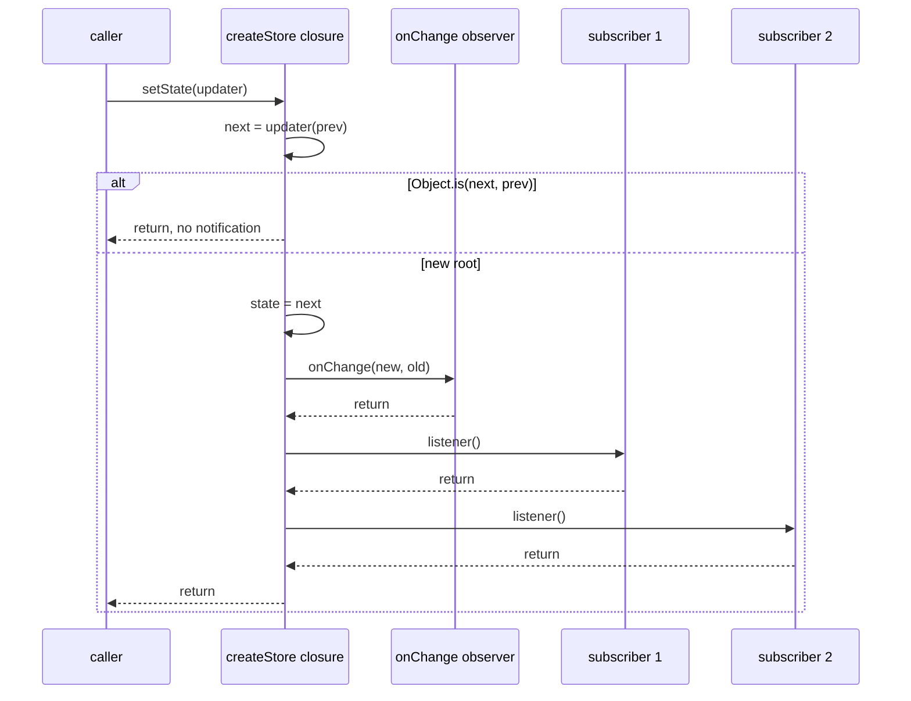

这个 store 没有 batching、transaction、rollback、event queue 或 listener error isolation。不要把其他状态库的能力自动投射到它身上。

## 最危险的 updater：内容变了，系统却没有收到通知

看下面的错误写法：

```ts
setAppState(previous => {
  previous.settings.model = 'new-model'
  return previous
})
```

对象内容确实被原地改变，但 `previous` 和返回值是同一个引用。`Object.is(next, prev)` 为 true，store 立即返回。直接调用 `getState()` 可能已经看到被修改的内容，React subscriber、settings observer 和其他 listener 却一个都没有收到通知。

这比“更新失败”更危险，它会形成撕裂：

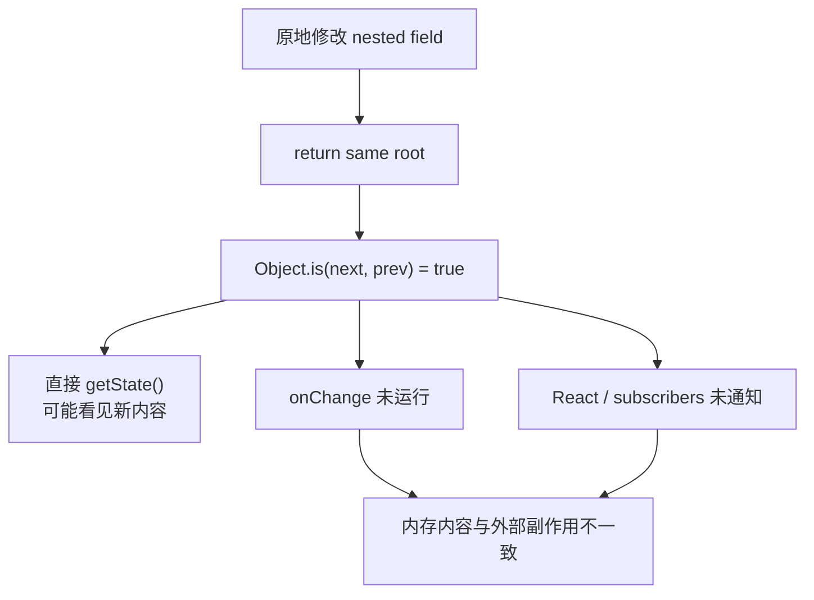

正确模式通常是至少创建新 root，并为发生变化的嵌套对象创建新引用：

```ts
setAppState(previous => ({
  ...previous,
  settings: {
    ...previous.settings,
    model: 'new-model',
  },
}))
```

Java 的类比是：你修改了一个放在 `AtomicReference<State>` 里的对象内部字段，却没有 `set` 一个新 State。依赖引用版本变化的观察者不会知道。

Python 中没有 `Object.is`，clean-room 用 `next_state is previous` 表达同样的身份判断。`==` 比较内容，不适合复现此契约。

## 新 root 也不等于业务真的变化

反过来，如果每次都返回一个新对象，即使里面值完全一样，store 也会通知：

```ts
setAppState(previous => ({ ...previous }))
```

因为 root identity 不同，`Object.is` 为 false。这不是 bug，而是这个 store 选择的性能契约：它相信 updater 用引用身份表达“是否有变化”。

源码在更新 file history 时专门先比较子状态：如果 updater 返回同一个 `fileHistory`，外层 updater 也返回原 root，从而避免无意义地通知整个 store。

所以函数式更新不只是语法风格。updater 同时承担两个职责：计算下一状态，并通过引用身份声明是否发生了需要通知的变化。

## observer 和 subscriber 不是同一个角色

`createStore` 接收最多一个 `onChange` observer，又维护任意数量的 subscribers。

在主 App/Headless store 中，observer 是 `onChangeAppState`。它知道 old/new 两个完整 root，可以集中处理跨系统副作用。普通 subscriber 没有参数，只在被通知后自己调用 `getState()`。

这形成一条清晰但脆弱的提交顺序：

```text
state 已替换
-> observer 处理副作用
-> subscribers 观察新 state
```

如果 observer 抛异常，state 已经提交，普通 subscriber 尚未运行。如果第一个 subscriber 抛异常，后面的 subscriber 不会运行。store 没有回滚。

这不是数据库事务。调用者如果捕获错误后重试同一个 updater，可能重复某些已经完成的副作用。

## 一次 AppState 更新可能离开内存边界

`src/state/onChangeAppState.ts:onChangeAppState` 证明 AppState 更新不是纯 reducer。它按 old/new diff 可能执行：

- permission mode 变化时通知 CCR external metadata 和 SDK status；
- model 变化时写回 user settings，并更新 Bootstrap model override；
- expanded view、verbose 变化时写 global config；
- settings root 变化时清理 API key/AWS/GCP credential cache；
- settings.env 变化时重新应用环境变量。

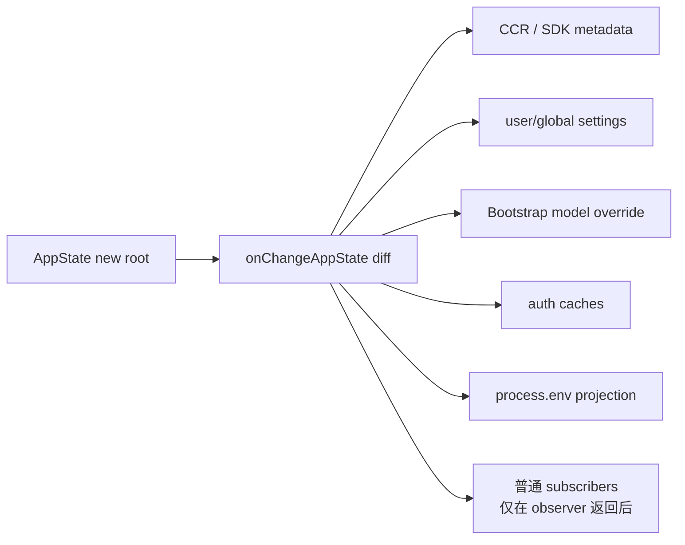

这解释了前面的同 root 错误为什么严重：它不只让 UI 没刷新，还可能让内存 model 已改变、磁盘设置和 Bootstrap override 却仍是旧值。

源码内部有些副作用自己用 try/catch 隔离，例如认证缓存和环境重应用；但 store 原语本身不保证原子性。迁移到企业系统时，不要把网络通知、磁盘写入和内存提交都塞进一个无法重试的同步 observer。

更稳妥的生产设计通常是：内存状态提交产生一个带 revision 的 domain event，再由可重试 outbox/worker 处理外部副作用；读取路径知道当前 revision 与副作用完成状态。M07 的 clean-room 只保留同步顺序用于学习，不假装已经实现分布式一致性。

## React 组件读到的是 selector snapshot

`useAppState(selector)` 大致做三件事：

```ts
const store = useAppStore()
const get = () => selector(store.getState())
return useSyncExternalStore(store.subscribe, get, get)
```

`useSyncExternalStore` 让 React 安全订阅外部 store。每次收到通知，React 再计算 selector 结果，并用 `Object.is` 判断 selected value 是否变化。

如果 selector 每次创建新对象：

```ts
useAppState(state => ({
  model: state.mainLoopModel,
  verbose: state.verbose,
}))
```

即使 model 和 verbose 都没变，新对象引用也会让 `Object.is` 判定 changed。源码注释建议分别选择字段，或选择已有子对象引用。

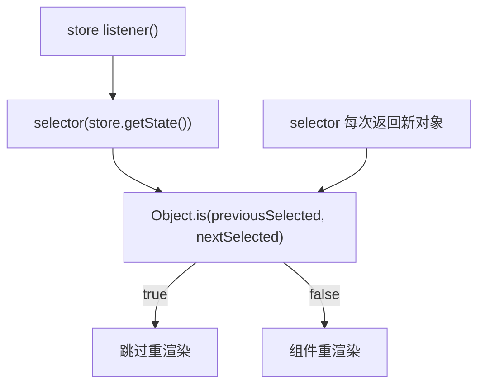

`useSetAppState()` 则只返回稳定 setter，不订阅任何 state。只负责发起更新的按钮不需要因为每次状态变化而重渲染。

这里出现了第一个“快照”：组件函数执行时拿到的 selector 结果服务于这次 render。它不是一个会在闭包里自动变动的 live pointer。

## 闭包为什么会让异步代码读到旧值

JavaScript 闭包保存的是变量环境。React 每次 render 会产生一组新的局部值和 callback；一个旧 callback 如果仍被 timer、event emitter 或异步任务持有，就可能继续看到旧 render 的 selector value。

假设组件 render 时：

```ts
const tools = useAppState(selectTools)

const onSubmit = useCallback(async () => {
  await something()
  startQuery(tools)
}, [tools])
```

在 `await` 期间 MCP tools 更新。如果正在执行的 callback 来自旧 render，它手里的 `tools` 仍是旧引用。React 之后重渲染并创建新 callback，不会倒过来修改已经在运行的旧闭包。

Java 中可以把它类比为 lambda 捕获了某个局部 final 引用；Python 中则像 coroutine 持有创建时可见的局部变量。区别是 React render 会反复创建这些闭包，所以“哪次 render 创建的 callback”尤其重要。

## REPL 在请求边界主动做 fresh read

`src/screens/REPL.tsx:getToolUseContext` 没有直接信任 render closure 中的所有运行值，而是先执行：

```ts
const s = store.getState()
```

它在构造 ProcessUserInputContext 时读取当下的 verbose、permission、MCP 等状态。`computeTools()` 也会重新调用 `store.getState()`，以包含异步连接完成的 MCP tools。

这一步解决的是：**请求开始时不要依赖 React 是否恰好完成下一次 render。**

但不能把它简化成“从此整个请求所有字段都实时”。context 里存在三类读法：

| 读法 | 例子 | 语义 |
| --- | --- | --- |
| 构造时求值 | `verbose: s.verbose`、`tools: computeTools()`、初始 `mcpClients` | context 创建时快照 |
| 延迟函数 | `refreshTools: computeTools` | 真正调用时 fresh read |
| 注入 getter | `getAppState: () => store.getState()` | 调用方明确选择读取当前 root |

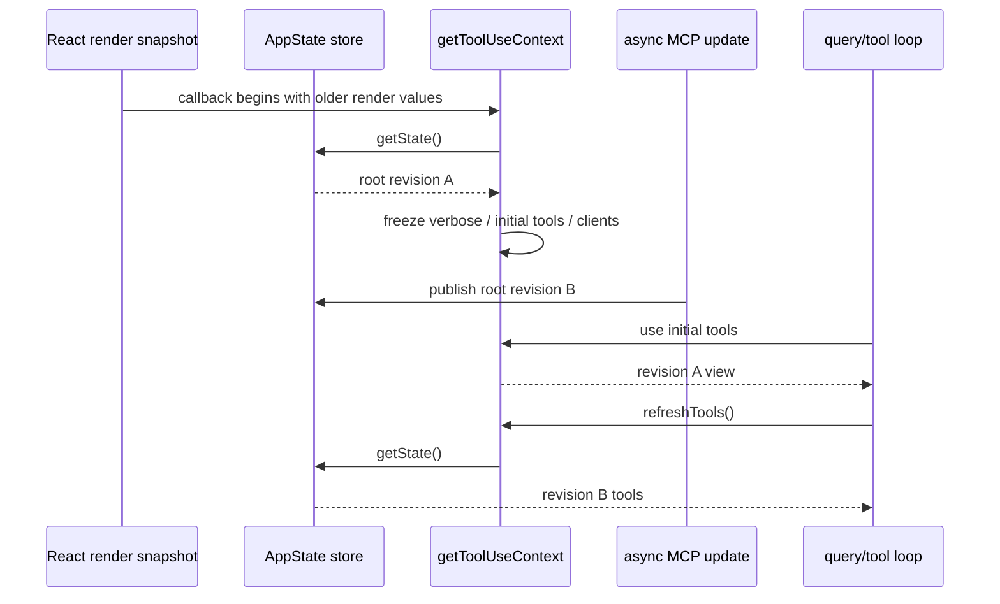

同一个 context 允许初始稳定视图与定向刷新并存。关键不是“全 live”或“全 snapshot”二选一，而是每个字段的策略必须明确。

## QueryEngine 又保存了一次有意的 `initialAppState`

Headless/SDK 的 `QueryEngine.processUserInput()` 在处理开始时执行：

```ts
const initialAppState = getAppState()
```

后面用它决定 additional working directories、permission mode、fast mode 等当前阶段输入。与此同时，QueryEngine 仍持有注入的 `getAppState/setAppState`，后续机制可以定向读写 SessionState。

这不是自相矛盾。`initialAppState` 表达“这组决定应该基于同一个起始视图”，getter 表达“某些允许动态变化的能力需要显式刷新”。

到这里，我们可以给四种读法下准确的定义：

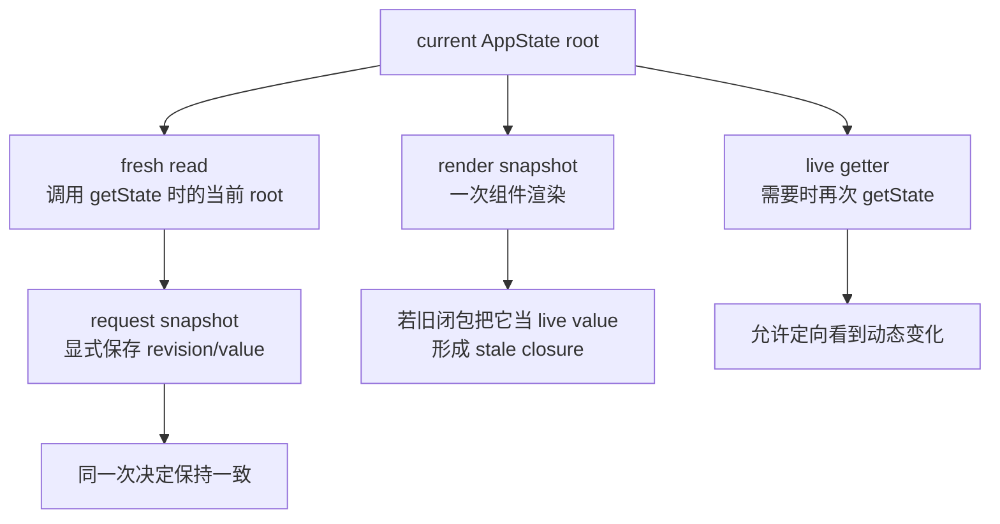

- render snapshot 是 React 一次渲染的一致视图；
- fresh read 是某个时刻读取 current root 的动作；
- request snapshot 是主动冻结一组请求决策；
- live getter 是允许调用方以后再次读取；
- stale closure 是忘记前面保存的是旧视图，却把它当作自动更新的实时值。

旧 snapshot 本身不是 bug。没有定义一致性边界，才是 bug。

## 到底哪些变化应该在本轮可见

现在回到开头的 MCP 工具问题。

一个可辩护的策略是：

- system prompt、configuration revision、初始 permission policy 等影响整轮语义的输入，在 request 创建时冻结；
- 工具集合若协议允许 mid-query refresh，则通过显式 `refreshTools()` 读取新版本；
- 刷新必须留下 revision/trace，不能静默让请求前后使用不同能力却无法解释；
- 破坏安全约束的 policy 收紧，不能等到下一轮才生效，应有独立的强制失效/取消通道，而不是依赖普通 fresh read。

Claude Code 当前快照展示了 snapshot 与 fresh read 混合，但它不是企业系统全部治理答案。我们从源码提取的是设计问题和边界，而不是复制每个实现细节。

## 用双语言实验把引用、通知和 revision 变成可观察事实

M07 的 clean-room 不导入 Claude Code 源码，不读取真实设置，不修改认证缓存或 `process.env`。它只复现可验证的 store 语义，并设计更清晰的三层上下文。

TypeScript：

```powershell
cd "D:\agent\Claude code最新\curriculum\units\M07\code\typescript"
node runtime-context.test.ts
node demo.ts
powershell -NoProfile -ExecutionPolicy Bypass -File .\typecheck.ps1
```

Python：

```powershell
cd "D:\agent\Claude code最新\curriculum\units\M07\code\python"
python -m unittest -v test_runtime_context.py
python demo.py
```

先不要急着运行。先写下六个假设：

1. 返回相同 root 时，直接读能看到原地修改，但 observer/subscriber trace 为空；
2. 返回新 root 时，observer 先于 subscribers，且全部在 `setState` 返回前完成；
3. 第一个 subscriber 抛错后，state 已提交，第二个 subscriber 没运行；
4. session 发布 revision 2 后，旧 RequestContext 仍是 revision 1；
5. 显式 fresh read 可以看到 revision 2，而不会改写旧 request；
6. 缺少 RuntimeContext 或非法 configuration revision 时，请求开始前失败。

任何一项观察相反，都能反证当前实现或教材结论。

## 先读懂最小 store，而不是直接看测试结果

TypeScript `runtime-context.ts` 中的 `createSynchronousStore` 保留源码的关键顺序：

```ts
const previous = state
const next = updater(previous)
if (Object.is(next, previous)) return

state = next
observer?.({ newState: next, oldState: previous })
for (const listener of listeners) listener()
```

Python 对应实现用 `is` 而不是 `==`：

```py
previous = self._state
next_state = updater(previous)
if next_state is previous:
    return

self._state = next_state
self._observer(next_state, previous)
for listener in tuple(self._listeners):
    listener()
```

两种语言不是逐行翻译，而是遵守同一行为契约：身份 no-op、先提交、observer、同步有序 subscribers、异常不回滚。

Python 用 `dict` 保存 listeners，是为了同时保留插入顺序与去重；TypeScript 使用原生 `Set`。这里的容器选择是语言生态差异，外部行为一致。

## 三层 clean-room context 在解决什么

实验随后创建三个概念：

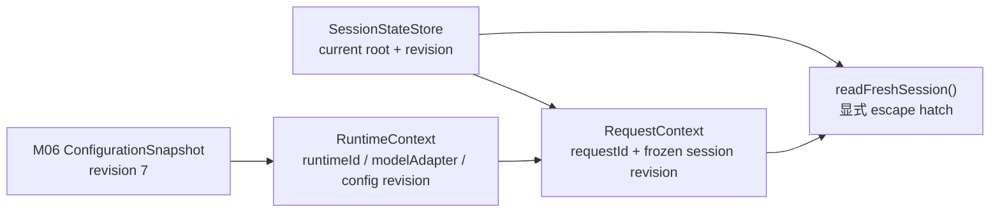

`RuntimeContext` 保存进程级、创建后不应改变的依赖引用。M07 没有把所有 dependency 塞进去，只用 runtime ID、model adapter、configuration revision 和 start time 演示契约。

`SessionStateStore` 拥有 current session root。每次 `publish` 创建新 revision，并复制、冻结外部输入。调用者之后修改原 input，不会污染已经发布的状态。

`RequestContext` 在创建时保存 request ID、runtime ID、configuration revision、session revision 和 session values。它不会因为 session 后续 publish 而变化。

`readFreshSession()` 是显式 escape hatch。名字直接告诉 reviewer：这里打算越过 request snapshot，读取当前 session。调用它不是免费动作，代码评审时应追问为什么允许。

## 正向实验：旧请求与新会话状态同时存在

demo 的关键顺序是：

```ts
const request = createRequestContext(runtime, session, 'request-1')
session.publish({ permissionMode: 'plan', tools: ['Read', 'Glob'] })
const fresh = readFreshSession(request, session)
```

实际输出显示：

```text
requestSnapshot.sessionRevision = 1
requestSnapshot.permissionMode = default
freshRead.observedSessionRevision = 2
freshRead.permissionMode = plan
notificationTrace = observer:2 -> subscriber:2
```

这证明的不是“snapshot 永远比 fresh 好”，而是两种语义可以被明确区分、同时观察和测试。系统设计者必须按字段选择。

独立实验实际结果：TypeScript `7/7`、Python `7/7`，TypeScript strict typecheck 通过。

## 破坏实验一：原地修改后返回同一个 root

测试故意执行：

```ts
store.setState(previous => {
  previous.count = 1
  return previous
})
```

预期：`getState().count` 是 1，但 trace 为空。实际结果与预期一致。

这条失败实验非常有价值，因为它揭示的不是简单异常，而是“不同观察者看到不同世界”。修复方式不是手工补一次 `listener()`，而是恢复不可变更新纪律，让 root identity 与发布语义一致。

## 破坏实验二：第一个 listener 抛错

测试注册两个 listener，第一个先记录 trace 再抛错，第二个只记录 trace。

预期：

```text
setState 抛出 listener failed
current state 已是 count=1
trace 只有 first
second 未运行
```

实际结果一致。这证明 store 不是事务，也不会 best-effort 通知剩余 listeners。

若企业系统不能接受这种半完成状态，可以选择：

- 每个 subscriber 自己隔离异常并上报；
- store 收集全部 listener 错误后统一抛出 AggregateError；
- 把外部副作用改为提交后的可靠事件处理；
- 对关键 policy 变化使用版本化状态机，而不是普通 callback fan-out。

选择哪一种取决于一致性要求，不应无条件把教学实现升级成“万能事件总线”。

## 破坏实验三：让 RequestContext 偷偷持有 live store

尝试把 `sessionValues` 改成 getter，每次都从 store 读取。这样写起来很方便，但 request revision 会失去意义：日志写着 revision 1，读取到的值却可能来自 revision 3。

反过来，如果完全删除 fresh read，运行中连接成功的工具、用户明确更改的 mode 或紧急 policy 收紧又无法按机制刷新。

正确修复不是站队，而是给两条路径不同名字和 trace：默认 snapshot，少数场景显式 fresh read，并记录 observed revision。

## H1-in-progress 怎样承接 M06，而不是另起炉灶

M06 已经产生 `ConfigurationSnapshot.revision`。M07 的 `RuntimeContext` 不重新读取设置文件，而是接收这个 revision：

```ts
const configuration = resolveConfiguration({ revision: 7 })
const runtime = createRuntimeContext({
  runtimeId: 'runtime-1',
  configurationRevision: configuration.revision,
  modelAdapter: 'fake-model',
})
```

这保持了前面建立的边界：配置发现与 trust projection 位于 Core 外围，RuntimeContext 只携带已经发布的配置版本。

H1 新增不变量：

- RuntimeContext 缺失关键依赖时，在请求创建前失败；
- SessionStateStore 是 session revision owner；
- RequestContext 是单轮稳定视图；
- fresh read 必须显式；
- observer/listener 异常不伪装成回滚成功；
- 不复制 Claude Code 的模块级万能 Bootstrap state。

累计回归实际结果：H1-in-progress `8/8` 检查通过，包含 S0 `15/15`、M05 运行表面、M06 配置、M07 TypeScript/Python runtime context 和 TypeScript strict。

## 迁移到 Java/Spring：Bean scope 不能替你定义状态 scope

在 Spring 中，最容易犯的错误是把所有东西都做成 singleton bean：

```java
@Component
class AgentState {
    Map<String, Object> values = new ConcurrentHashMap<>();
}
```

线程安全容器只解决并发读写，不解决 session A 与 session B 是否应该共享、一个 request 是否需要稳定 revision、配置热更新是否可以中途进入 Tool Loop。

更接近本单元结论的分层是：

```text
Singleton RuntimeRegistry
  -> immutable RuntimeContext per deployment/runtime
  -> SessionStateRepository keyed by sessionId
  -> RequestContext created per request/turn
```

`RuntimeContext` 可以是构造器注入的 immutable record；`SessionStateRepository` 通过 compare-and-set/version 切换 revision；`RequestContext` 是一次调用显式传递的 record，而不是 ThreadLocal 中的万能 Map。

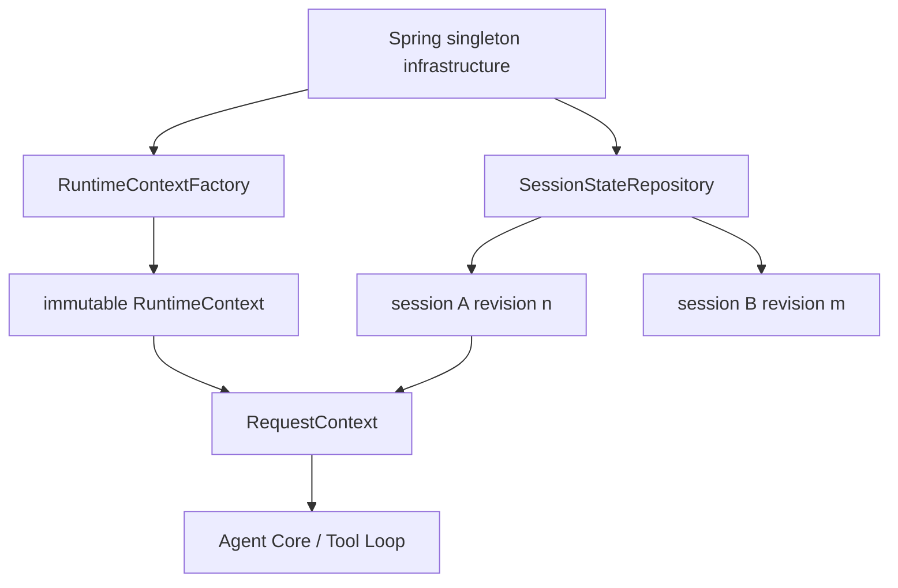

如果使用 Reactor/WebFlux，request context 更适合进入 Reactor Context；普通 MVC 可以显式参数传递。ThreadLocal 只在严格同步调用链中可靠，异步切线程后必须有传播策略。本单元不提前展开 M40 的 tracing context，但已经可以判断：状态范围必须由协议定义，不能由框架默认 scope 猜出来。

## 迁移到 RAG：一次检索必须能回答“基于哪一版状态”

RAG 流程常把 tenant、embedding model、index alias、permission filter 和 topK 从多个全局配置读取。若检索开始后 index alias 热更新，query rewrite 用旧 index，retriever 用新 index，reranker 又用新模型，结果很难复现。

RequestContext 至少应记录：

- configuration revision；
- tenant/policy revision；
- index snapshot 或 alias resolution；
- model/reranker version；
- 允许 fresh read 的字段和实际 observed revision。

紧急 ACL 收紧不能仅靠“下一请求生效”。它需要强制 invalidation：正在执行的请求在进入 retrieval/tool 前重新检查 policy epoch，若发现已过期则取消或重建 context。这和普通 UI 状态更新不是同一等级。

## 迁移到 LangGraph：checkpoint 不是外部运行依赖快照

LangGraph checkpoint 通常保存 graph state，但 model adapter、tool registry、tenant policy、feature flag 可能仍由运行环境注入。恢复 checkpoint 不代表恢复了同一组外部依赖。

因此恢复时应比较：

```text
checkpoint.sessionRevision
checkpoint.configurationRevision
current.configurationRevision
toolRegistryRevision
policyEpoch
```

若不兼容，需要迁移、拒绝恢复，或显式创建新 branch。不能只因为 graph state JSON 可解析，就宣称运行可以精确继续。

## 企业可观测性：记录 revision 和读取方式，不记录整个状态

生产日志不应把 AppState 或 RequestContext 全量序列化，其中可能包含路径、账户、permission、MCP 配置和其他敏感数据。更有用的字段是：

```text
runtime_id
session_id
request_id
configuration_revision
session_revision_at_start
fresh_read_count
fresh_read_observed_revisions
state_publish_reason
observer_duration_ms
subscriber_error_count
```

当出现“本轮为什么没看到新工具”时，你能回答：请求起始 revision 是 12，MCP 在中途发布 revision 13，Tool Loop 是否调用过 refresh，以及最终用的是哪一版 tools。只打印“state updated”没有诊断价值。

对于 observer 外部副作用，还应区分 `state_committed` 与 `side_effect_applied`。否则磁盘写入失败时，日志可能只显示状态更新成功，掩盖半完成窗口。

## 资深 Agent 开发岗面试：从状态 owner 讲到请求一致性

下面的问题不是让你背源码行号。每个回答都先给结论，再用 Claude Code 的决定性设计承接追问，最后落到自己的系统方案。正常语速约两分钟，可以按面试官追问压缩或展开。

### 问题 1：Agent 系统为什么不能把所有状态放进一个全局单例？

> 先说结论：不是全局单例绝对不能用，而是它只适合真正的进程级 Bootstrap 信息；一旦把 session、request 和可热更新能力也混进去，生命周期、并发隔离和测试都会失控。Claude Code 的 `bootstrap/state.ts` 确实有模块级 `STATE`，但源码连续警告不要继续加状态；它解决的是 React 和高层服务还没创建时，CLI 就要访问 cwd、session ID、运行模式的问题。真正的运行状态由独立 `Store<AppState>` 持有，而且一个进程里主 REPL、Headless runtime 和临时 dialog 可以有不同 store。我的企业实现会把不可变 RuntimeContext、按 sessionId 隔离的 SessionStateStore、每轮 RequestContext 分开。这样看到一个字段时能明确 owner、revision 和清理时机，也能避免 session A 的模式变更污染 session B。

### 问题 2：Claude Code 的 Bootstrap state 和 AppState 到底有什么区别？

> 结论是两套独立容器，不是同一状态的两个阶段。Bootstrap `STATE` 在模块 import 时由 `getInitialState()` 创建，属于模块闭包，活到进程退出，提供很多早期 getter/setter；`init()` 调用前它就存在。AppState 则是一个运行状态形状，只有经过 `createStore` 才有 owner 和订阅语义。Interactive 由 `AppStateProvider` 在挂载时创建 store，Headless 在 `main.tsx` 直接创建 store，再注入 getter/setter 给 `runHeadless`。两者偶尔通过副作用相连，例如 model 变化会回写 Bootstrap override，但它们没有自动双向同步。面试追问状态源时，我会先按创建时机和生命周期拆开，而不是都叫 global state。

### 问题 3：为什么 `AppStateProvider` 收到新的 `initialState` 后，store 不会自动重建？

> 先说结论：因为 `initialState` 只参与 Provider 首次挂载的 lazy initialization，不是持续受控 prop。源码语义是 `useState(() => createStore(initialState, onChange))`，`useState` 在后续 render 会忽略新的 initializer，所以 store identity 对这个 root 保持稳定。这对 `useSyncExternalStore` 很重要，消费者不需要因为 Provider 每次 render 换 store 而重新订阅。代价是恢复或切换 session 不能只改 prop，必须明确更新 store 或重挂 root。Java/Spring 里类似于 Bean 构造参数只在创建 bean 时使用，不会因为外部变量变了就自动替换 bean。设计 API 时我会把 `initialState` 命名和文档写清，避免用户误以为它是 controlled state。

### 问题 4：函数式 `setState` 为什么仍然会丢更新？

> 结论是函数式 updater 只保证你拿到调用时 current root，不保证你按正确的引用语义发布。Claude Code 的 store 只用 `Object.is(next, prev)` 判断变化。如果我原地改 `prev.tasks` 再返回 `prev`，内容已经变了，但 observer 和 subscribers 完全不运行，直接 `getState` 与 UI 甚至可能看到不同世界。正确做法是为变化路径创建新引用，并让相同 root 真正表示 no-op。高并发企业系统还要在这个基础上加 revision 或 compare-and-set，防止两个 updater 都基于旧 revision 覆盖。面试里我会特别区分“引用身份通知丢失”和“并发 lost update”，前者当前 store 实验就能复现，后者需要版本控制解决。

### 问题 5：React stale closure 和 request snapshot 有什么区别？

> 先给结论：两者都可能是旧值，但 stale closure 是无意使用旧 render 视图，request snapshot 是为了一致性主动冻结。Claude Code REPL 在构造 ToolUseContext 时会调用 `store.getState()`，避免依赖 React 是否已完成下一次 render；但 context 里的 verbose、初始 tools 和 MCP clients 仍是构造时快照，`refreshTools` 和 `getAppState` 才是后续 fresh read。QueryEngine 又保存 `initialAppState` 给当前阶段使用。所以判断 bug 不能只看值旧不旧，要看这个字段是否声明了 snapshot 边界、revision 和刷新策略。我的实现默认 RequestContext 稳定，只有明确允许动态变化的工具集合走命名清楚的 fresh read，并记录 observed revision。

### 问题 6：一次 Tool Loop 应该始终读最新状态吗？

> 结论是不应该一刀切。影响整轮语义的 configuration、system prompt、初始 permission 和模型选择通常应该冻结，否则同一请求无法复现；允许热插拔的 tools 可以通过显式 refresh 在安全点更新。Claude Code 当前 REPL 就同时提供初始 tools snapshot 和 `refreshTools`，说明它也在做这种分层。对于安全策略收紧，我不会等普通 fresh read，而是用 policy epoch 和 cancellation gate，发现请求基于旧策略就阻止下一次 tool execution。企业设计关键是每个字段写清 consistency policy：snapshot、live、refresh-at-boundary 还是 invalidate-and-restart，并把 revision 写入 trace。

### 问题 7：`setState` 成功返回之前 observer 抛错，状态算成功还是失败？

> 先说结论：在当前 store 语义里，内存状态已经提交，但通知链失败，不能叫事务回滚。顺序是 `state = next` 后同步调用 `onChange`，再调用 subscribers；observer 抛错会让普通 subscriber 不运行，第一个 subscriber 抛错也会中断后面的人。Claude Code 的 `onChangeAppState` 还可能写配置、通知 CCR/SDK、清认证缓存和改环境，所以重试可能重复已完成的副作用。生产系统里我会把 state commit 和外部 side effect 分开，用 revisioned event/outbox 做幂等重试，至少也要隔离 listener 错误并记录部分完成。不能捕获异常后假装什么都没发生。

### 问题 8：怎样在 Java/Spring 中实现 RuntimeContext、SessionState 和 RequestContext？

> 结论是用显式 scope 和版本，不用一个 singleton Map 代替所有状态。Spring singleton 适合 RuntimeContextFactory、model adapter registry 和 SessionStateRepository；RuntimeContext 本身可以是 immutable record，带 configuration revision。SessionState 按 sessionId 存在 repository 中，用 version/CAS 发布新 root。每次请求从 runtime 和 session 当前版本创建 RequestContext record，显式传给 Agent Core。WebFlux 可以用 Reactor Context 传播 trace identity，但业务状态仍建议显式参数；普通 ThreadLocal 在异步切线程后不可靠。恢复时还要比较 checkpoint 与当前 config/tool/policy revision，而不是只反序列化 graph state。

### 问题 9：如果一个进程里有多个 AppState store，怎样避免它们互相打架？

> 先说结论：先接受它们是隔离 owner，再把真正需要共享的东西提升为独立服务，不做隐式 store 同步。Claude Code 的主 REPL、Headless 和临时 Provider 可以有不同 store；修改临时 dialog 的内存状态不会自动改主 REPL。若两者都写 global config，真正共享的是磁盘配置和 change detector，而不是 AppState identity。企业系统里我会明确 local UI state、session domain state 和 process service。多个 view 需要看同一 session 时，订阅同一个 SessionStateRepository；只服务 dialog 的字段留在 local store。跨 store 更新必须通过 domain command/event，并带 sessionId 和 revision，不能复制对象后期待它们自行一致。

### 问题 10：状态系统应该记录哪些可观测信息，才能排查动态工具或权限问题？

> 结论是记录状态决策链和 revision，不记录整个状态对象。至少要有 runtime/session/request ID、configuration revision、请求起始 session revision、每次 publish 的 reason、fresh read 次数和 observed revision、permission/tool registry revision、observer 耗时和 subscriber 错误。这样遇到“本轮没看到新 MCP 工具”，能证明请求从 revision 12 开始，工具在中途发布 revision 13，Tool Loop 有没有调用 refresh。Claude Code 的源码让我们看到初始 snapshot 与 fresh getter 并存，生产系统就应该把这种选择显式 trace。全量序列化 AppState 既泄露敏感配置，也很难检索，通常不是好的可观测性。

## 离开本单元前，完成一次真正的所有权闭环

不要只运行测试。选择你自己 Agent 项目中的一个字段，例如 `permissionMode`、`toolRegistry`、`retrieverConfig` 或 `currentModel`，完成下面这条链：

```text
找到创建点
-> 标出 owner 和生命周期
-> 列出所有修改者与观察者
-> 判断更新是否有外部副作用
-> 标出请求读取的是 snapshot 还是 live value
-> 加入 revision 和失败 trace
-> 制造一次原地修改或旧闭包错误
-> 修复并解释为什么修复有效
```

然后画两张图：一张 owner 图，只画状态实例；一张请求时序图，只画 snapshot 与 fresh read。若两张图无法对齐，说明你的状态协议还不够明确。

最后尝试用两分钟回答：

> 我不会把状态管理理解成选 Redux、Zustand 或 Spring Bean。第一步是按进程、session、request 划 owner；第二步定义 root identity、revision 和通知顺序；第三步为每个读取点选择 snapshot 或 fresh；最后才选择框架。Claude Code 的 Bootstrap、AppState store、React selector 和 QueryEngine snapshot 正好展示了这些边界为什么必须分开。

## 源码与实验定位地图

内部实现证据：

- `claude-code-CLI/src/bootstrap/state.ts`
  - `getInitialState`
  - 模块级 `STATE`
  - `switchSession`
  - `resetStateForTests`
- `claude-code-CLI/src/entrypoints/cli.tsx:main`
- `claude-code-CLI/src/main.tsx`
  - Commander `preAction`
  - Headless `headlessInitialState/headlessStore`
  - Interactive `initialState/launchRepl`
- `claude-code-CLI/src/entrypoints/init.ts:init`
- `claude-code-CLI/src/setup.ts:setup`
- `claude-code-CLI/src/state/AppStateStore.ts`
  - `AppState`
  - `AppStateStore`
  - `getDefaultAppState`
- `claude-code-CLI/src/state/store.ts:createStore`
- `claude-code-CLI/src/state/AppState.tsx`
  - `AppStateProvider`
  - `useAppState`
  - `useSetAppState`
  - `useAppStateStore`
- `claude-code-CLI/src/state/onChangeAppState.ts:onChangeAppState`
- `claude-code-CLI/src/components/App.tsx:App`
- `claude-code-CLI/src/replLauncher.tsx:launchRepl`
- `claude-code-CLI/src/screens/REPL.tsx:getToolUseContext`
- `claude-code-CLI/src/cli/print.ts:runHeadless`
- `claude-code-CLI/src/QueryEngine.ts:processUserInput`

运行验证与设计迁移：

- `curriculum/units/M07/code/typescript/runtime-context.ts`
- `curriculum/units/M07/code/typescript/runtime-context.test.ts`
- `curriculum/units/M07/code/python/runtime_context.py`
- `curriculum/units/M07/code/python/test_runtime_context.py`
- `mini-agent-harness/typescript/runtimeContext.ts`
- `mini-agent-harness/python/runtime_context.py`
- `mini-agent-harness/contracts/h1-contract.md`

证据边界：Bootstrap、AppState、store 和请求读取路径是当前快照事实；双语言输出是运行验证；`RuntimeContext / SessionStateStore / RequestContext` 是 clean-room 设计迁移，不是 Claude Code 真实类型名。Graphify 只帮助定位候选文件，没有作为本章任何事实或图示的最终证据。
