# M08 能力不是一张启动清单：发现目录、请求投影与执行注册表

> 本单元主体阅读、画图与源码跟踪约 5 至 7 小时。TypeScript/Python 实验、破坏实验和企业能力治理设计另计约 2.5 至 4 小时。

假设你的 Agent 启动时有三个工具：

```text
Read    内置工具，允许模型使用
Deploy  插件已经安装，本地也有执行代码，但企业策略禁止模型使用
Search  来自一个启动较慢的 MCP Server，第一轮请求发出后才连接成功
```

现在问一个看似简单的问题：

> “系统当前有哪些能力？”

如果你回答 `Read、Deploy、Search`，你把“本地存在”当成了“模型可见”；如果只回答 `Read`，你又没有说明这是第一轮还是第二轮，也没有解释 Search 何时生效；如果回答“看 `tools` 数组”，你还需要先说清是哪一个 `tools`：环境候选、AppState 中的 MCP 工具、当前 Query 的工具快照，还是 API 实际发送的 schema。

成熟 Agent 的能力不是一张启动清单，而是一条持续投影的管线：

```text
发现了什么
-> 当前运行目录登记了什么
-> 当前策略允许暴露什么
-> 本轮模型实际看见什么
-> 模型选择后本地能否安全执行
```

Claude Code 的工具、Skill、Agent、Plugin 和 MCP 正好把这条管线的复杂性暴露出来。读懂它之后，你不仅能解释“为什么一个插件安装后还要 reload”“为什么 MCP 工具可能第二轮才出现”，还会知道企业 Harness 为什么必须把 capability catalog、request snapshot 和 executable registry 分开。

本地 `claude-code-CLI/` 是从发布包 source map 得到的静态源码快照。本单元把直接源码结论称为“快照事实”，把本单元双语言代码运行结果称为“运行验证”，把 Mini Agent Harness 的五层设计称为“设计迁移”。Graphify 只帮助定位候选文件，不作为以下流程图或结论的最终证据。

## 先把五层能力看全

下面这张图先回答“同一个工具名会经过哪些语义层”。暂时不要记函数名，只看每一层淘汰或保留什么。

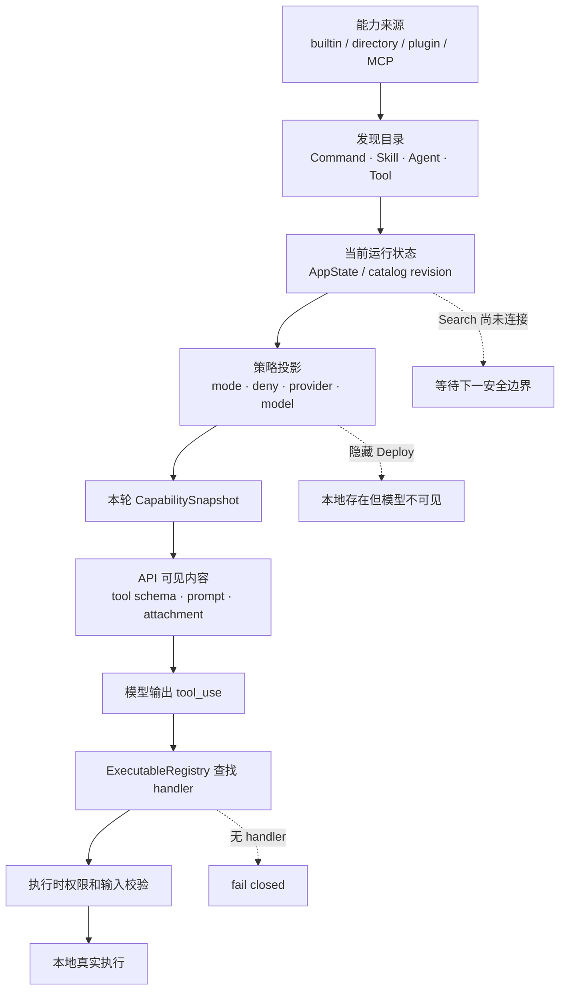

这张图里最重要的不是箭头，而是四个“不等于”：

```text
discovered != model-visible
model-visible != permission-allowed
permission-allowed != executable-registered
registered now != included in an older request snapshot
```

接下来沿一次真实启动和两次模型调用，把每个不等式落回源码。

## 启动时先建立发现目录，而不是最终能力表

Claude Code 在 `src/main.tsx` 中准备 `setup()`、command discovery 和 agent discovery。决定性顺序是：

```ts
initBuiltinPlugins()
initBundledSkills()

const setupPromise = setup(...)
const commandsPromise = getCommands(preSetupCwd)
const agentDefsPromise = getAgentDefinitionsWithOverrides(preSetupCwd)
```

源码注释直接说明为什么先注册再开始 `getCommands()`：command discovery 会 memoize；如果 bundled skill 注册发生在异步等待之后，第一次发现可能把空列表缓存下来。

这段代码第一次改变了我们的心智模型：初始化顺序不是性能实现细节，它决定发现结果。把三条线画出来更清楚：

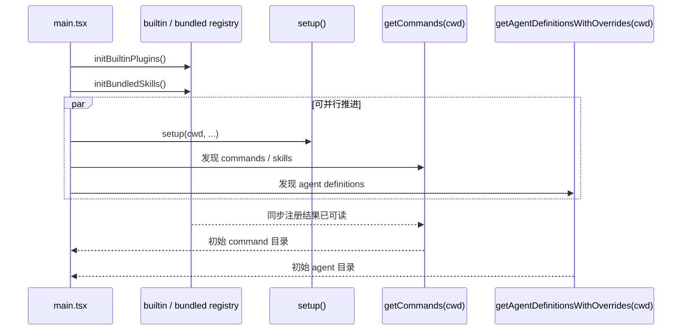

这里的 `Promise` 表示将来完成的异步结果。`setupPromise`、`commandsPromise` 和 `agentDefsPromise` 被先创建，再统一等待，可以让不互相依赖的 I/O 重叠。它与 Java `CompletableFuture` 的核心相似：创建 future 不等于结果已经完成；依赖方必须在正确边界 `await`/`join`。

但 builtin/bundled 注册是同步内存写入，必须先发生。若把它也随意丢进并行区，`getCommands()` 第一次读取和注册写入就可能竞争。对初学者来说，这比背“某函数在第几行”更重要：**被 memoize 的第一次观察具有架构意义。**

## Command 与 Skill：同一个目录里也未必有统一覆盖规则

`src/commands.ts` 的 `loadAllCommands()` 按以下顺序拼接来源：

```text
bundled skills
-> builtin-plugin skills
-> directory skills
-> workflow commands
-> plugin commands
-> plugin skills
-> built-in commands
```

它返回一个数组，没有在末尾做统一的 `uniqBy(name)`。这意味着“数组顺序”只是原始目录顺序，还不是全系统唯一的 active command 规则。

不同消费者会继续做不同事情：

- `findCommand()` 用 `.find()`，直接查找时先出现的同名项获胜；
- `getCommands()` 每次重新判断 availability 和 `isEnabled()`，再加入 dynamic skills；
- dynamic skills 加入时会避开 base command 中已有的名字；
- `getSkillToolCommands()` 遍历整个 command 数组筛选 model-invocable prompt command，本身不建立统一唯一项；
- 某些 attachment 生成路径又会自行按 name 去重。

因此不能写一张“所有 command 永远按某优先级覆盖”的表，然后把它推广到每个调用点。准确做法是先问：**当前消费者是 direct lookup、listing 还是 execution？**

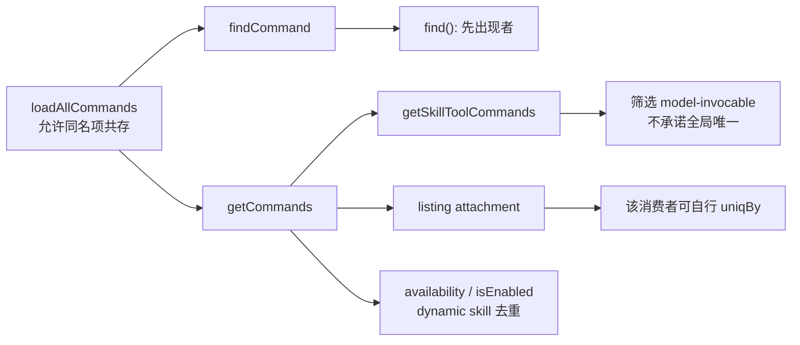

这也是为什么 Mini Agent Harness 不照抄源码数组形状，而采用显式 `priority` 生成唯一 active definition。迁移设计思想，不是复制所有偶然行为。

### Skill 被列出，不等于完整指令已经进入上下文

`getSkillToolCommands()` 关注 prompt command 是否允许模型调用、来源是否合适、是否有 description/when-to-use。模型最初看到的通常是 Skill 名称和使用时机元数据，不是把每个 `SKILL.md` 全文都塞进首轮请求。

可以把 Skill 生命周期分成四步：

```text
文件存在
-> loader 发现
-> listing 元数据对模型可见
-> 模型选择后加载完整 Skill 内容
```

这样做解决上下文预算问题：系统可以拥有很多 Skill，但只在需要时付出完整指令 token。代价是 discovery 需要可靠，且“模型知道名称”和“完整内容已加载”必须在 trace 中分开。

## Agent 定义：active 也不等于本轮可调用

`src/tools/AgentTool/loadAgentsDir.ts` 的 `getActiveAgentsFromList()` 对同名 `agentType` 采用后写覆盖。顺序是：

```text
built-in
-> plugin
-> user
-> project
-> flag
-> managed policy
```

这里用的是 `Map.set(key, value)`。Java 开发者可以把它看成反复 `map.put(agentType, definition)`：相同 key 的 value 被后者替换，但 key 在 Map 中的插入位置并不会因为替换自动移动。TypeScript 的 `Map` 同时承担“按 key 覆盖”和“保持插入顺序”两种语义，读调用结果时要区分值的来源与数组顺序。

得到 active agent definition 后，`AgentTool.prompt()` 还会按 required MCP servers、permission 和 allowed agent types 过滤模型 listing；`AgentTool.call()` 执行时再次解析 agent type，并重新检查权限和 MCP 条件。

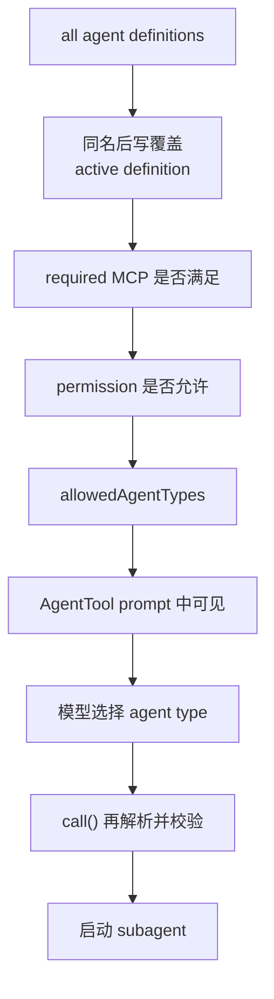

两次过滤不是多余。listing 时过滤减少模型提出无效选择；执行时重检防止状态变化、伪造输入或旧上下文绕过安全边界。企业系统里也应把“减少错误建议”和“真正授权”分开。

## Tool pool：先组装本地候选，再谈模型 schema

工具主线位于 `src/tools.ts`。

`getAllBaseTools()` 枚举当前构建和环境可能提供的基础工具；它不是每个模式最终都可用的列表。`getTools(permissionContext)` 继续应用：

```text
simple / bare 模式
-> 特殊工具排除
-> blanket deny rules
-> REPL 模式对 primitive tools 的替换
-> 每个 tool.isEnabled()
```

随后 `assembleToolPool(permissionContext, mcpTools)` 处理 MCP 工具：

```ts
const builtInTools = getTools(permissionContext)
const allowedMcpTools = filterToolsByDenyRules(mcpTools, permissionContext)

return uniqBy(
  [...builtInTools].sort(byName).concat(allowedMcpTools.sort(byName)),
  'name',
)
```

这里的数组操作改变了三个语义：

1. built-in 和 MCP 各自排序，保证 prompt cache 的稳定前缀；
2. 连接两个分区时 built-in 在前；
3. `uniqBy` 保留第一次出现，因此同名时 built-in handler 获胜。

它形成的是本地 runtime pool：当前宿主有哪些候选工具对象。先把这条路径单独画出来：

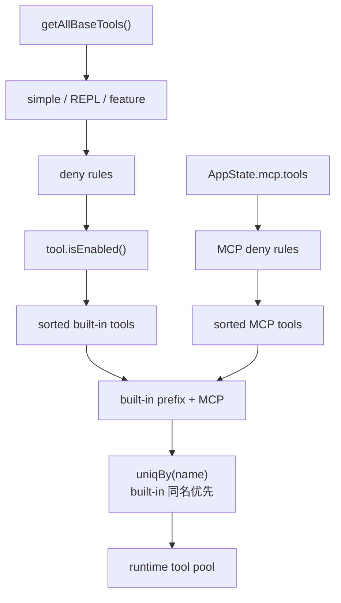

不要越过最后一个节点直接画到模型。`runtime tool pool` 后面还有 request projection。

## MCP 慢连接：第一轮没有 Search，不等于系统永远没有 Search

Interactive 启动明确不等待所有 MCP server 再渲染 REPL 或开始第一轮。`src/services/mcp/useManageMCPConnections.ts` 在连接状态变化时，把 server 的 clients、tools、commands 和 resources 分批写入 AppState。

回到开头的 Search：它来自一个慢 MCP server。可能出现下面的时间线。

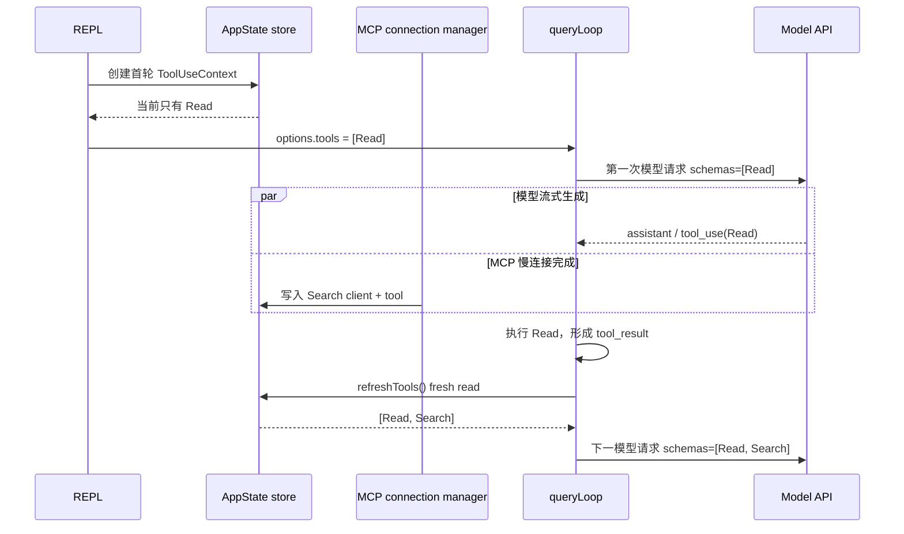

这个设计做了一个明确权衡：首轮 TTFT 不被最慢 MCP 拖住，但首轮能力可能不完整。只要系统在可解释的边界刷新，并记录当时 revision，这不是一致性 bug。

真正危险的是在模型流式返回 `tool_use` 的中途原地替换 schema。那样模型提出调用时使用的工具定义，可能与宿主解释调用时的定义不同。

## 为什么刷新必须发生在安全边界

REPL 的 `getToolUseContext()` 同时放入一个立即值和一个函数：

```ts
const computeTools = () => {
  const state = store.getState()
  return assembleAndFilter(state.toolPermissionContext, state.mcp.tools)
}

options: {
  tools: computeTools(),
  refreshTools: computeTools,
}
```

`tools: computeTools()` 现在执行，得到本次 context 的初始工具数组；`refreshTools: computeTools` 传递函数本身，将来调用时再读 store。

如果你来自 Java，前者类似 `List<Tool> tools = computeTools()`，后者类似保存 `Supplier<List<Tool>> refreshTools = this::computeTools`。函数引用不等于函数结果。

`src/query.ts` 在 tool results 已产生、即将递归发下一次模型请求前调用 `refreshTools()`。因此边界可以表达成一个状态机：

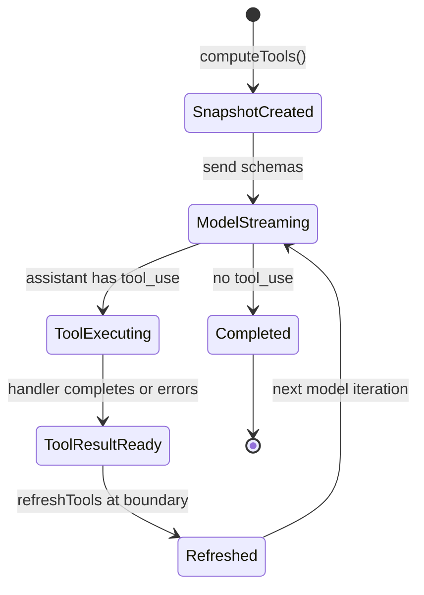

`ModelStreaming` 和 `ToolExecuting` 期间不修改当前 snapshot；`ToolResultReady -> Refreshed` 才发布下一视图。这就是“请求或模型迭代快照”的价值：不要求整个 session 永远冻结，也不允许任意时刻漂移。

## Interactive 与 Headless 的刷新粒度并不相同

很容易看到两条入口最终都进 `query()`，就假设工具刷新完全一致。源码并非如此。

Interactive：

```text
REPL getToolUseContext
-> tools = computeTools()
-> refreshTools = computeTools
-> queryLoop 在模型迭代之间调用 refresh
```

Headless/SDK：

```text
print.ts drainCommandQueue
-> 每个排队 command fresh getAppState()
-> buildAllTools(appState)
-> ask({ tools })
-> QueryEngineConfig 保存具体 tools
-> submitMessage 内没有 refreshTools callback
```

因此 Headless 的晚到 MCP 工具通常在下一次排队 command/`ask()` 进入，而不是当前 `submitMessage()` 内部 Tool Loop 的下一模型迭代。

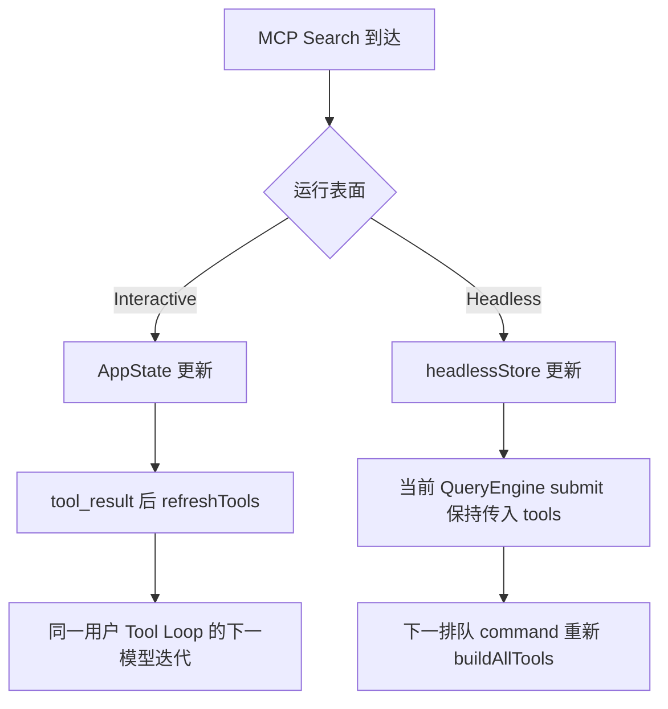

这是快照事实，不是推荐企业系统复制这种非对称。企业 Harness 更好的做法是定义统一的 `RefreshBoundary` 枚举，并让 Interactive/HTTP/Kafka/SDK 入口都显式声明刷新粒度。

## 系统上下文也不是启动时拼好的一根字符串

能力不仅通过 tool schema 告诉模型，还通过 system prompt、user context、agent metadata 和 attachment 告诉模型如何使用。

先看 Interactive 的 `src/utils/systemPrompt.ts:buildEffectiveSystemPrompt()`。它的选择顺序可以压缩成：

```text
override
-> coordinator
-> main-thread agent
-> custom system prompt
-> default system prompt
+ append system prompt
```

`override` 完全替换，连 append 都不保留；普通 main-thread agent prompt 替换 default；Proactive 模式则有特殊 append 行为。

Headless/SDK 的 `QueryEngine.submitMessage()` 没有调用这个 builder，而是手动装配：

```text
custom 或 default
+ 可选 memory mechanics
+ append system prompt
```

所以不能把 Interactive 的 coordinator/agent/override 规则外推给 Headless。两条入口共享 `fetchSystemPromptParts()`，不代表共享最终有效提示构造器。

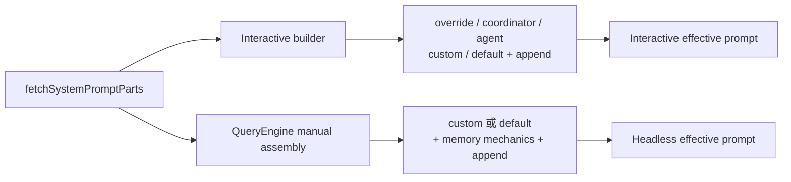

这条差异正是系统设计中的“共享 helper 不等于统一 contract”。如果企业平台希望不同入口语义一致，必须在 contract 层统一，而不是因为它们调用了同一个底层函数就宣布一致。

### replace 与 append 的代价不同

`fetchSystemPromptParts()` 在提供 custom system prompt 时，会跳过 default system prompt，也跳过 system context；user context 仍会加载。

因此 custom 不是“换一段身份文本，其他环境信息照旧”，而是更强的替换。企业系统中要把这些动作建模成不同字段：

```text
replace_base_prompt
append_policy_prompt
system_context_projection
meta_user_context_projection
```

若只提供一个 `prompts: string[]`，调用者很难知道第一项是替换还是追加，更无法审计安全基线有没有被覆盖。

## CLAUDE.md 为什么不应笼统叫“拼进 system prompt”

`src/query.ts` 发请求前使用两个 helper：

- `appendSystemContext(systemPrompt, systemContext)` 把 system context 追加到 system prompt；
- `prependUserContext(messagesForQuery, userContext)` 创建一个 meta user message，放到请求消息前面。

当前快照中的 CLAUDE.md 等项目指导属于 user context，最终通过 meta user message 投影。它对模型可见，但 API role/位置并不等同于 system prompt。

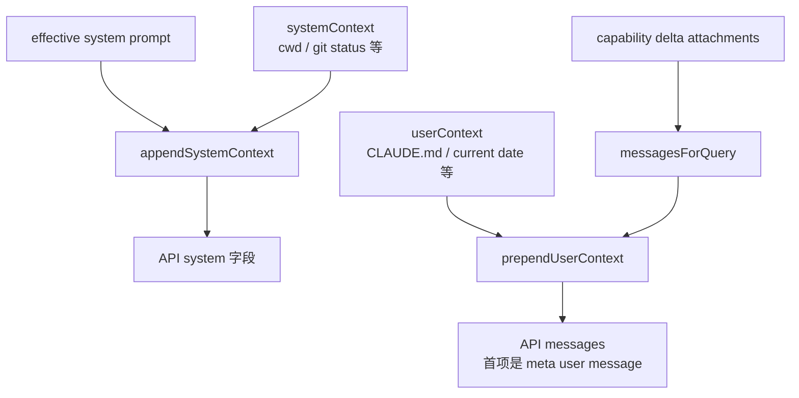

这一区分影响安全和调试。排查“模型为什么遵循了某条指令”时，至少要记录来源、role、投影时间和 revision，不能只 dump 一根最终字符串。

## Runtime pool 还要经过 Tool Search，才成为 API schemas

现在 Search 已经连接并进入 runtime tool pool。它是否立刻以完整 schema 发送给模型，还取决于 `src/services/api/claude.ts` 的请求投影。

每次 API 调用前，Claude Code 会判断当前 model、mode 和 token 阈值是否启用 Tool Search，再识别 deferred tools。启用后：

```text
非 deferred tool       -> 正常进入 filteredTools
ToolSearchTool          -> 保留，用于继续发现
deferred 且未发现       -> 不进入本轮完整 schema
deferred 且已发现       -> 进入本轮 schema
```

已发现集合不是凭全局布尔值记忆，而是可以从消息历史里的 `tool_reference` block 重建。这样 compact/resume 后仍能知道当前对话发现过什么。

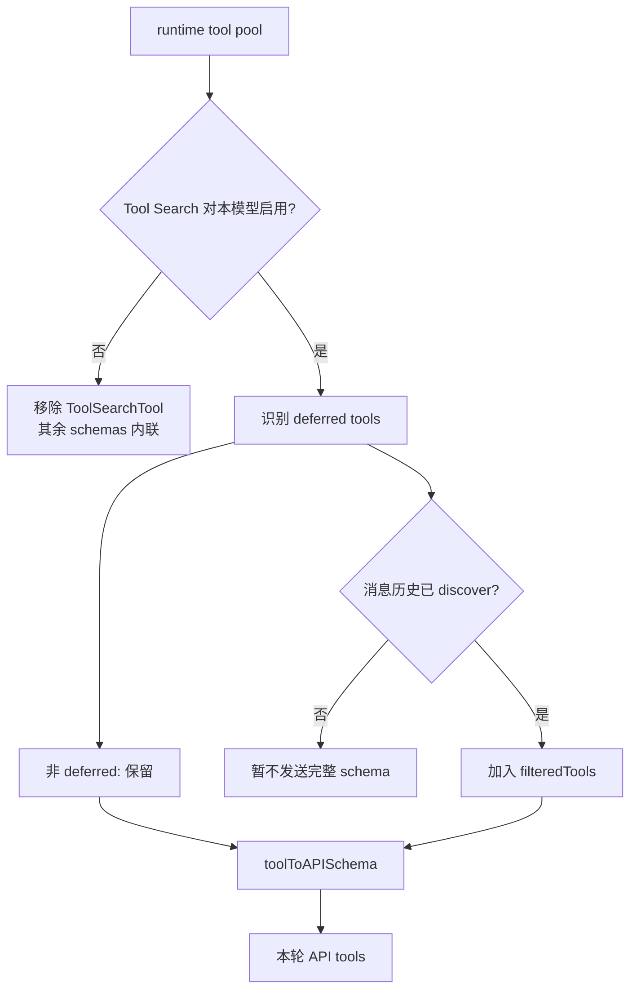

所以 Search 可以同时满足：

```text
已连接
已注册 handler
存在于 runtime pool
但尚未出现在本轮完整 API schema
```

这不是矛盾，而是延迟能力加载。

## Schema cache：稳定请求字节，也会冻结第一次渲染

`src/utils/api.ts:toolToAPISchema()` 计算工具的 base schema：

```text
name
description
input_schema
strict
eager_input_streaming
```

它把 base 放入 `src/utils/toolSchemaCache.ts` 的 session-scoped Map。`defer_loading` 和 cache control 是每次请求叠加的 overlay，不写回 base。

为什么缓存？tool schemas 位于很靠前的 prompt cache 位置。运行中 feature flag 或动态 prompt 文本变化会改变序列化字节，导致后续大段上下文 cache miss。固定首次渲染可以换取稳定性和成本。

但稳定性有代价：同名且 cache key 不变时，后续 description/base 渲染变化不会自动生效。带 `inputJSONSchema` 的工具把序列化 schema 放进 key，input schema 真正变化会形成新 key；所以不能笼统说“MCP 重连后所有 schema 都旧”，准确风险是：**cache key 没变的 base 内容保持首次值。**

这是一种典型的缓存契约：

```text
你缓存的不是对象
而是“哪些输入变化被 key 认为有意义”的决定
```

企业系统应把 `schemaRevision` 或内容摘要作为可观察字段；若选择 session-stable cache，就要明确刷新事件，而不是期待对象内容变化自动被发现。

## Delta attachment：模型知道了，不等于系统能执行

动态能力变化还可能通过 transcript attachment 进入模型上下文：

```text
deferred_tools_delta
agent_listing_delta
mcp_instructions_delta
skill_discovery
```

这些 attachment 解决的是“模型认知更新”和“恢复后重建已宣布集合”。它们不是 handler 注册 API，也不是 permission grant。

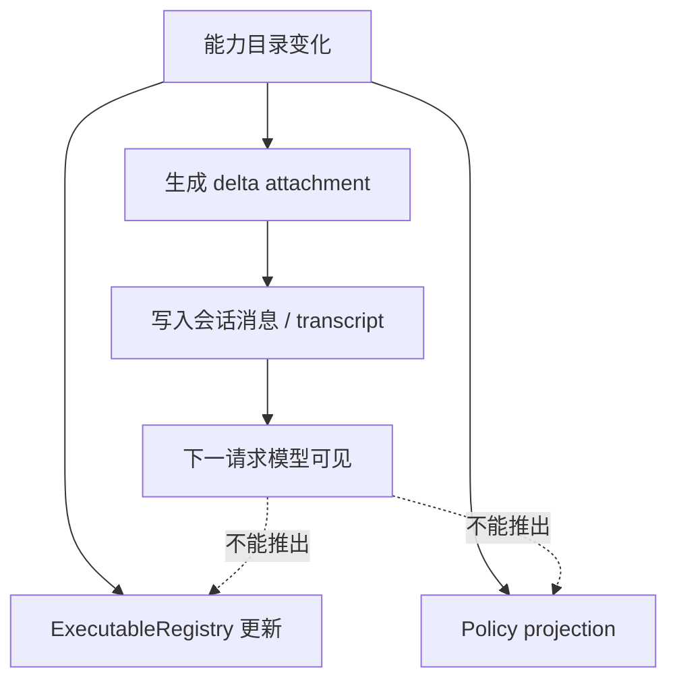

如果模型根据 attachment 选择一个工具，本地仍需在当前 snapshot 和 registry 中解析，再执行权限检查。否则一条伪造或陈旧 attachment 就可能变成执行授权。

## Plugin 已安装，为什么当前会话仍可能没有它

Plugin 又增加了一组经常被混淆的状态：

```text
声明启用
-> 已下载/物化到缓存
-> cache-only loader 能读到
-> 当前会话组件已激活
```

Interactive 启动的常规消费者使用 `loadAllPluginsCacheOnly()`，避免为了启动去 clone/fetch marketplace。`initializeVersionedPlugins()` 在 Headless 会等待必要 bookkeeping，在 Interactive 通常 fire-and-forget；背景安装可能把 `plugins.needsRefresh` 设为 true，提示用户执行 `/reload-plugins`。

真正的当前会话激活路径是 `src/utils/plugins/refresh.ts:refreshActivePlugins()`：

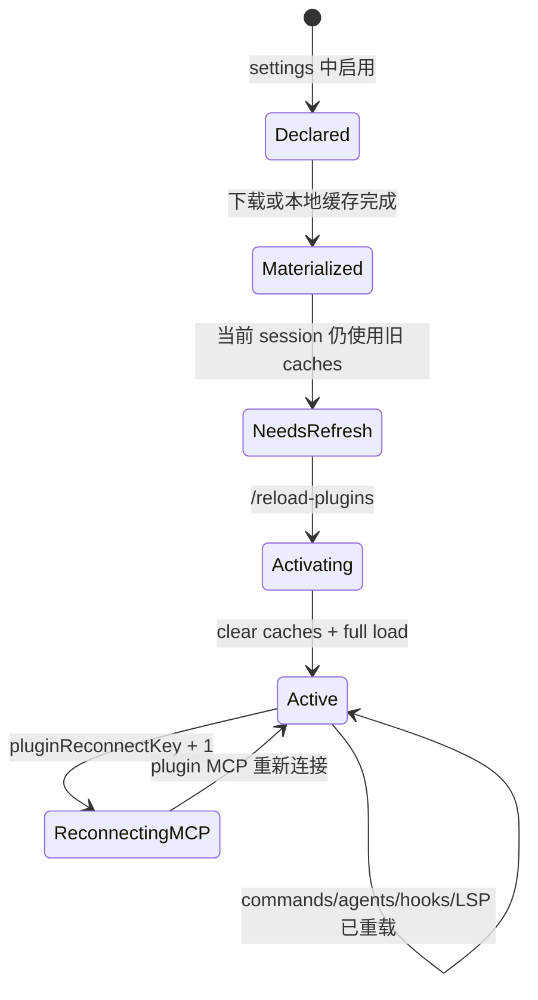

`refreshActivePlugins()` 不只改一个 enabled flag。它清理多层缓存、完整加载插件、重载 commands 和 agents、写 AppState、递增 MCP reconnect key、重载 hooks，并重新初始化 LSP 配置。

这解释了为什么“文件已经下载”不能自动等于“当前进程中的 command、agent、hook 和 MCP 全部换新”。激活是跨组件事务，虽然当前实现并不提供数据库式原子回滚。

## 回到 Read、Deploy、Search：两次模型请求到底看见什么

现在可以完整回答开头的问题。

初始状态：

```text
Read    built-in，runtime pool 有，policy 允许
Deploy  plugin，registry 有 handler，policy 隐藏
Search  MCP 尚未连接
```

第一模型迭代的 snapshot：

```text
catalog revision = 1
model-visible schemas = [Read]
executable registry = [Read, Deploy]
Deploy reason = hidden-by-policy
```

Search 连接后发布 revision 2，但旧 snapshot 不变。Interactive 在 tool result 后刷新：

```text
catalog revision = 2
runtime pool = [Read, Search, Deploy]
policy projection = [Read, Search]
若 Search deferred 且未 discover -> schemas 仍可能只有 [Read]
discover 后 -> schemas = [Read, Search]
registry = [Read, Deploy, Search]
```

Deploy 从未因为“本地可执行”自动暴露给模型。Search 也没有因为“异步连接成功”原地改写正在流式执行的第一请求。

## 用双语言实验把边界变成证据

本单元独立实验位于：

```text
curriculum/units/M08/code/typescript/
curriculum/units/M08/code/python/
```

先不要急着看测试断言。先写下五个假设：

1. policy 隐藏 Deploy 后，registry 仍可登记 Deploy，但 schema 不含它；
2. revision 2 加入 Search，不会改变旧 revision 1 snapshot；
3. 只有显式创建下一 boundary snapshot 才看见新 catalog；
4. deferred Search 在 discover 前已可注册，但不会进入 schema；
5. 注入 model-visible Ghost 却不注册 handler，dispatch 必须失败。

TypeScript：

```powershell
cd "D:\agent\Claude code最新\curriculum\units\M08\code\typescript"
node capability-projection.test.ts
node demo.ts
powershell -NoProfile -ExecutionPolicy Bypass -File .\typecheck.ps1
```

运行验证：8/8 行为测试通过，strict typecheck 通过。demo 的关键输出是：

```text
oldSnapshot       revision=1 visible=[Read]
refreshedSnapshot revision=2 visible=[Read, Search]
registry                     =[Read, Search]
Deploy projection reason     =hidden-by-policy
```

Python：

```powershell
cd "D:\agent\Claude code最新\curriculum\units\M08\code\python"
python -m unittest -v test_capability_projection.py
python demo.py
```

运行验证：8/8 通过，并得到同样的 revision、visible schema、registry 和 reason。

### 为什么专门限制 capability name

第一次双语言运行时，TypeScript 的 `localeCompare()` 与 Python 默认字符串排序对 `ModeOnly/ModelOnly` 给出了不同顺序。集合相同，但 trace 顺序不同。

这不是业务事实错误，却会破坏跨语言可复现实验。最终实现把 capability name 限制为 portable ASCII identifier，并使用 code-point 顺序。这个修复说明：排序规则也是协议。Java 的 `Collator`、数据库 collation、JavaScript locale 和 Python Unicode 顺序不能默认视为相同。

### 主动做四次破坏

1. 删除 `policyHiddenNames`，观察 Deploy 进入 schema；解释这是投影错误，不是 registry 错误。
2. 让 `CapabilityCatalog.publish()` 原地修改旧 snapshot 的数组；观察第一请求的 visible list 被污染。
3. 删除 dispatch 的 registry 检查，让 Ghost 返回伪成功；解释模型文本如何越过执行边界。
4. 把 custom prompt 与 default prompt 直接 concat；观察 replace 语义被改成 append。

反证条件要具体：若旧 snapshot 会随着 revision 2 改变，immutable boundary 假设失败；若 Ghost 能执行，fail-closed 假设失败；若未 discover 的 Search 已进入 schema，deferred projection 假设失败。

## Mini Agent Harness：五层契约怎样接到 H1

H1-in-progress 新增五个角色：

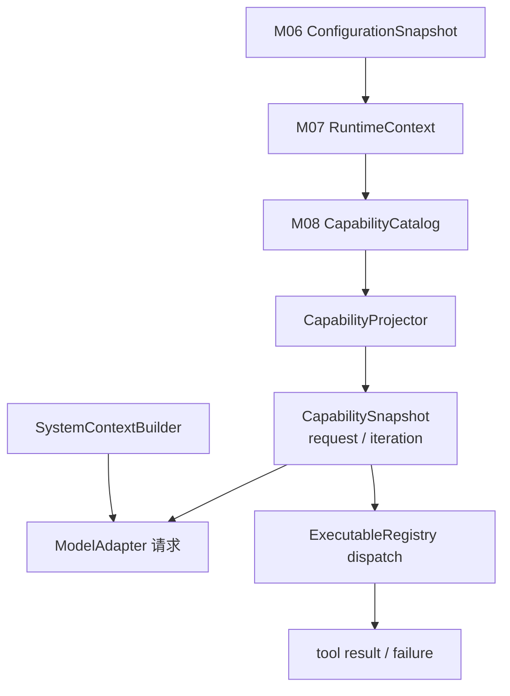

它没有把 M06/M07 推倒重来：configuration revision 继续进入 RuntimeContext；SessionState/RequestContext 继续定义状态一致视图；CapabilitySnapshot 在 request 或模型迭代边界补充“本轮允许模型看见什么”。

合入后的不变量包括：

- catalog publication 创建新 revision；
- snapshot 保留 catalog revision、boundary、mode、provider 和 model，既能解释结果，也能把模型请求与执行日志对齐；
- projection decision 保留 source 与 reason；
- registry 与 visibility 分离；
- dispatch 同时验证 visibility 和 handler；
- prompt replacement、append、meta user context、system context 分字段表示。

累计回归命令：

```powershell
cd "D:\agent\Claude code最新\mini-agent-harness"
powershell -NoProfile -ExecutionPolicy Bypass -File .\tests\run-h1-regression.ps1
```

运行验证：H1-in-progress 10/10 检查通过，其中继续包含 S0 15/15；M08 Harness TypeScript/Python 各 6/6，TypeScript strict 通过。

Harness 的 `CapabilityCatalog` 比 Claude Code 当前 command 数组更严格：它通过显式 priority 产生唯一 active definition。这是设计迁移，不是声称源码已经这样做。

## 迁移到 Java/Spring：不要只注册一堆 Bean

在 Spring 中最自然的第一步可能是：每个 Tool 都是一个 Bean，然后 `Map<String, ToolHandler>` 收集全部实现。这只完成 executable registry，没有完成 capability projection。

更完整的边界可以是：

```java
record CapabilityDefinition(
    String name,
    CapabilitySource source,
    int priority,
    boolean deferred
) {}

record CapabilitySnapshot(
    long catalogRevision,
    String boundary,
    List<ToolSchema> schemas,
    List<ProjectionDecision> decisions
) {}
```

Spring `ApplicationContext` 可以帮助发现 handler bean，但 policy、tenant、provider、model 和 request boundary 不应该隐藏在 Bean 扫描里。建议拆成：

```text
ToolHandler Bean discovery
-> CapabilityCatalogService 发布 revision
-> CapabilityPolicy 根据 tenant/user/project 过滤
-> RequestCapabilityProjector 创建 immutable snapshot
-> ModelAdapter 只接收 snapshot.schemas
-> ToolDispatcher 用 snapshot + registry + authorization 执行
```

`ToolDispatcher` 不能只做 `handlers.get(toolName).apply(input)`。它至少检查：

1. toolName 是否在当前 snapshot 可见；
2. 当前 principal/tenant policy 是否仍允许；
3. handler 是否注册且版本兼容；
4. input schema 与大小限制；
5. 幂等键、超时、取消和审计字段。

这能抵御旧消息、伪造 tool_use、灰度版本错配和 registry 漂移。

## RAG 与 LangGraph：检索器也是能力，不只是一个函数

RAG 系统常把 Retriever 直接注入 Chain，然后认为“能调用”就等于“应该暴露”。同样的五层模型依然适用：

```text
检索器已部署
-> 当前租户索引可用
-> policy 允许访问这个数据域
-> 本轮模型收到 Retriever schema/说明
-> 调用时用当前身份和 snapshot 校验
```

例如财务 Retriever 已在 registry，但普通员工的 projection 不应包含它。即使旧 checkpoint 中有一次历史 tool call，恢复后也不能据此绕过当前权限。

LangGraph 可以把 `project capabilities -> model -> dispatch -> tool result -> refresh` 表达成节点和条件边，但 checkpoint 必须保存 catalog revision、projection reasons 和 tool schema revision。只保存一个 `tools` 列表，会在恢复时失去“当时为什么可见”的证据。

## 企业级能力治理：观察一致性，而不是只打印工具名

生产问题通常不会以“CapabilityProjector 报错”出现，而会表现为：

- 模型说找不到工具，但运维看到插件已经安装；
- 模型提出了某工具，执行端却返回 unknown tool；
- 某租户看到不该出现的工具 description；
- MCP 更新后，模型仍按旧 description 生成参数；
- Interactive 可用，Headless 同一轮不可用。

因此一次模型请求至少应记录：

```text
request_id / session_id / tenant_id
configuration_revision
catalog_revision
projection_boundary
visible_tool_names + schema_revision
hidden decisions + reason（敏感信息需脱敏）
registry_revision
provider / model / mode
prompt base source + append policy revision
MCP connection states
```

可以定义一个发布前一致性检查：

```text
visible schemas ⊆ executable registry
visible schemas ∩ policy denied = empty
snapshot.catalogRevision <= current catalog revision
dispatch uses the same snapshot id as model request
```

第一条若失败，应阻断请求或至少阻断相关工具，而不是“让模型试试看”。第二条是安全不变量。第三条允许旧请求稳定存在。第四条防止执行端偷偷切换到新能力表解释旧 `tool_use`。

刷新策略也应明确：

- MCP 连接变化：下一模型迭代或下一 request；
- 企业 policy 紧急撤销：执行时必须实时重检，不能等旧 snapshot 结束；
- description 优化：可等下一 session/schema revision；
- handler 下线：先停止 projection，再等待旧请求排空，最后移除 registry。

这就是 control plane 与 data plane 的区别。Catalog/policy 发布属于控制面；某次 model request 和 tool dispatch 属于数据面。控制面可以持续变化，数据面必须知道自己绑定哪个 revision。

## 资深 Agent 开发岗面试：从能力清单讲到安全执行

下面 9 道题覆盖本单元最可能被直接或延伸追问的能力。回答都先给结论，再用 Claude Code 的设计和企业 Harness 落地。练习时保持口语节奏，不要逐字背诵。

### 问题 1：一个 Agent “有哪些工具”，为什么不能只看工具注册表？

**参考口语回答（约 2 分钟）：**

> 先说结论：工具注册表只能回答本地有什么 handler，不能回答当前模型看见什么、是否有权限、以及本轮请求绑定的是哪个版本。以 Claude Code 为例，`getAllBaseTools()` 先给出环境候选，`getTools()` 还会按 simple/REPL 模式、deny rule 和 `isEnabled()` 过滤，`assembleToolPool()` 再合并 MCP 工具。到真正发模型请求时，`claude.ts` 还会根据 Tool Search 把 deferred 且未发现的工具排除，所以 runtime pool 可以大于 API schemas。模型返回 `tool_use` 后，本地仍要做 handler 查找和权限校验。我在企业 Harness 里会拆 `CapabilityCatalog`、`CapabilityProjector`、不可变 `CapabilitySnapshot` 和 `ExecutableRegistry`，并记录 revision。这样“模型找不到工具”和“执行端没有工具”能被区分，安全上也不会把模型可见直接当授权。

### 问题 2：MCP Server 在一次 Agent 运行中途连接成功，新工具应该马上生效吗？

**参考口语回答（约 2 分钟）：**

> 结论是不能在任意时刻原地生效，应该只在声明的安全边界发布新快照。Claude Code Interactive 路径不等所有 MCP 才开始首轮，`useManageMCPConnections()` 会异步把工具写进 AppState。REPL 创建 ToolUseContext 时先算一次 `options.tools`，同时保留 `refreshTools`。`query.ts` 只在 tool result 完成、准备下一次模型请求前刷新，所以当前模型流和对应 tool_use 始终按同一视图解释，新工具可以在同一用户 Tool Loop 的下一模型迭代出现。这样兼顾首轮延迟和一致性。企业实现里我会把 boundary 和 catalog revision 放进 snapshot；policy 紧急撤销仍要在执行时实时重检，因为安全撤销不能只依赖旧快照。

### 问题 3：Claude Code 的 Interactive 和 Headless 在工具刷新上完全一致吗？

**参考口语回答（约 2 分钟）：**

> 先给结论：不完全一致，汇合到 Query Loop 不代表入口装配和刷新契约相同。Interactive 的 `getToolUseContext()` 注入 `refreshTools`，所以工具结果后、下一模型迭代前可以从 AppState fresh read。Headless 的 `print.ts` 会在每个排队 command 前重新 `buildAllTools()`，但 `QueryEngineConfig` 接收的是具体 tools，`submitMessage()` 没有同样的 refresh callback，因此当前 submit 内通常保持传入集合，晚到 MCP 要等下一 command。这个差异很适合说明源码阅读不能只看公共尾部。我做企业 Harness 会把刷新粒度定义成统一 contract，例如 `NEXT_MODEL_ITERATION` 或 `NEXT_REQUEST`，让 Web、CLI、Kafka 入口显式选择并在 trace 中记录，而不是各自靠闭包行为决定。

### 问题 4：Tool Search 为什么能减少上下文，它和本地工具注册是什么关系？

**参考口语回答（约 2 分钟）：**

> 结论是 Tool Search 延迟的是模型 schema 暴露，不是必须延迟本地 handler 注册。Claude Code 的 runtime pool 可以已经包含很多 MCP 工具；请求时 `claude.ts` 根据模型支持、模式和阈值判断是否启用 Tool Search，把工具分成普通和 deferred。未发现的 deferred 工具不会把完整 schema 放进当前请求，模型通过 ToolSearchTool 得到 `tool_reference` 后，历史里就能重建 discovered set，后续请求再加入 schema。这样大量工具不会每轮消耗完整 description 和 input schema token。企业实现要保留一个关键不变量：deferred 工具可以注册但不可见；一旦模型选择，dispatch 仍要用当前 snapshot 和 registry 双重校验。Tool Search 是上下文优化，不是权限系统。

### 问题 5：custom system prompt 和 append system prompt 有什么本质区别？

**参考口语回答（约 2 分钟）：**

> 先说结论：custom 是替换 base，append 是在有效 base 后增加约束，两者不能用无语义的字符串数组混在一起。Claude Code 的 `fetchSystemPromptParts()` 在 custom prompt 存在时会跳过 default，也跳过 system context，但仍获取 user context。Interactive 的 `buildEffectiveSystemPrompt()` 还有 override、coordinator、main-thread agent 和 proactive 分支；Headless `QueryEngine` 则手动组装 custom/default、memory mechanics 和 append，并不走同一个 builder。所以我不会笼统说两条入口的 system prompt 一样。企业平台里会把 base source、replacement、append policy、system context 和 meta user context 分字段建模，记录 policy revision，并限制谁有权 replace；安全基线通常只能 append 或由受控 policy owner 替换。

### 问题 6：Plugin 已经安装，为什么当前会话还可能没有对应 Skill、Agent 或 MCP？

**参考口语回答（约 2 分钟）：**

> 结论是安装解决文件物化，激活解决当前进程中的多组件一致更新，它们不是一个状态。Claude Code Interactive 启动主要用 `loadAllPluginsCacheOnly()`，不会为了启动去 clone 或 fetch。背景安装完成后可以标记 `needsRefresh`，但当前 command、agent、hook、MCP caches 仍可能是旧的。`/reload-plugins` 最终调用 `refreshActivePlugins()`，清多层 cache，完整加载 plugin，重建 commands 和 agents，写 AppState，递增 `pluginReconnectKey` 触发 MCP 重连，还重载 hooks 和 LSP。企业插件平台也要把 declared、materialized、validated、active 和 draining 分开，并给激活过程 revision 和回滚策略，不能看到目录存在就让模型调用。

### 问题 7：如果模型请求里出现一个本地没有 handler 的 tool_use，你会怎么处理？

**参考口语回答（约 2 分钟）：**

> 结论是 fail closed，并把它记录成能力视图不一致，而不是动态反射调用或静默忽略。首先验证这个 toolName 是否属于发出该模型请求时的 CapabilitySnapshot；如果不属于，可能是旧消息、提示注入或模型幻觉。即使属于，也要在 ExecutableRegistry 找到兼容 handler，再做当前权限、输入 schema、租户和幂等校验。找不到 handler 时返回结构化 tool error，让 Agent Loop可以决定恢复，同时告警 `snapshot_revision != registry_revision` 或部署缺失。本单元的双语言实验专门注入 model-visible `Ghost` 却不注册 handler，dispatch 必须抛错。核心原则是模型提出执行意图，执行权和最终授权始终属于 Harness。

### 问题 8：怎样设计多租户 Agent 平台的能力灰度和紧急撤权？

**参考口语回答（约 2 分钟）：**

> 先给结论：用版本化控制面发布能力目录和 policy，用不可变数据面 snapshot 执行普通请求，但安全撤权在 dispatch 时必须再检查当前 policy epoch。灰度时 Catalog 记录 capability source、handler version 和 schema revision，Projector 根据 tenant、用户、model/provider 和实验组生成 snapshot；模型请求、tool_use 和执行日志都带 snapshot ID。上线新 handler 时先注册和健康检查，再逐步进入 projection；下线时先从新 projection 移除，等待旧请求排空，再删除 handler。紧急撤权不能等待旧 snapshot，自执行入口读取最新 deny epoch 并 fail closed。这样既保持一次模型迭代内部一致，又允许安全控制面即时收紧。

### 问题 9：如果用 Spring 或 LangGraph 复现这套设计，你会保留哪些边界？

**参考口语回答（约 2 分钟）：**

> 结论是保留“发现、投影、快照、执行、上下文”五个边界，不照抄 Claude Code 的文件和 React 形状。Spring 里 ToolHandler Bean 扫描只负责 ExecutableRegistry，CapabilityCatalog 负责 source/priority/revision，Projector 根据 tenant policy、mode、provider 和 model 生成 immutable schemas，ModelAdapter 只接收这个 snapshot，Dispatcher 再按同一 snapshot 和实时授权执行。LangGraph 可以把 projection、model、tool、refresh 做成节点和边，但 checkpoint 要保存 catalog revision、visible schema revision 和 projection reason，否则恢复后不知道当时模型为什么能看到某工具。RAG Retriever 也按同样方式治理：已部署不等于当前租户可见。框架负责调度，能力和安全契约仍由 Harness 定义。

面试时不要一上来背文件名。第一句先给分层结论；面试官追问“Claude Code 哪里体现”时，再定位 `main.tsx`、`commands.ts`、`tools.ts`、`REPL.tsx:getToolUseContext`、`query.ts`、`QueryEngine.ts`、`services/api/claude.ts` 和 `utils/plugins/refresh.ts`。

## 离开本单元前，完成一次能力审计

先不看正文，用自己的话回答：

```text
为什么 Deploy 已安装且有 handler，模型仍不应看见？
为什么 Search 在 MCP 连接后不能修改正在流式执行的旧请求？
为什么 attachment 告诉模型有工具，不等于完成注册或授权？
为什么 Interactive 与 Headless 的刷新和 prompt 组装不能互相外推？
```

然后手画一张包含 catalog revision、snapshot boundary、API schemas 和 registry 的图。任选一个自己的 Agent 项目，列出五份清单：discovered、registered、policy-visible、request-visible、actually-dispatched。如果五份清单目前由同一个 `tools` 数组承担，本单元的迁移任务就是把它们拆开。

最后运行双语言 demo，做一次 Ghost fail-closed 破坏，并设计插件下线顺序：先停止新 projection，还是先删除 handler？若你能解释为什么前者更安全，以及紧急 deny 为什么仍要执行时重检，就已经从“会配置工具”走到了“能设计企业级能力平面”。

## 源码定位地图

| 要回答的问题 | 首要位置 | 决定性符号 |
| --- | --- | --- |
| builtin/bundled 为什么先注册 | `src/main.tsx` | `initBuiltinPlugins`, `initBundledSkills` |
| command/skill 来源如何合并 | `src/commands.ts` | `getSkills`, `loadAllCommands`, `getCommands`, `getSkillToolCommands` |
| Agent 同名和 listing 怎么处理 | `src/tools/AgentTool/` | `getActiveAgentsFromList`, `AgentTool.prompt/call` |
| runtime tool pool 如何形成 | `src/tools.ts` | `getAllBaseTools`, `getTools`, `assembleToolPool` |
| MCP 如何异步更新运行状态 | `src/services/mcp/useManageMCPConnections.ts` | `flushPendingUpdates`, list-changed handlers |
| Interactive 何时刷新工具 | `src/screens/REPL.tsx`, `src/query.ts` | `getToolUseContext`, `computeTools`, `refreshTools` |
| Headless 何时重建工具 | `src/cli/print.ts`, `src/QueryEngine.ts` | `buildAllTools`, `drainCommandQueue`, `QueryEngineConfig` |
| prompt replace/append 如何分支 | `src/utils/queryContext.ts`, `src/utils/systemPrompt.ts` | `fetchSystemPromptParts`, `buildEffectiveSystemPrompt` |
| user/system context 放在哪里 | `src/utils/api.ts`, `src/query.ts` | `prependUserContext`, `appendSystemContext` |
| runtime pool 怎样变成 schemas | `src/services/api/claude.ts` | Tool Search、`filteredTools`, `toolToAPISchema` |
| schema 哪些字段会缓存 | `src/utils/api.ts`, `src/utils/toolSchemaCache.ts` | `toolToAPISchema`, `TOOL_SCHEMA_CACHE` |
| 动态能力如何通知模型 | `src/utils/attachments.ts` 等 | deferred/agent/MCP/skill delta |
| plugin 怎样真正激活 | `src/utils/plugins/refresh.ts` | `refreshActivePlugins` |

到这里，开头的问题有了一个可以复用的回答：

> Agent 的“能力”不是启动时生成的一张工具表，而是由发现目录和执行注册表提供候选，由策略与请求边界生成模型视图，再由本地 Harness 在执行时重新校验的版本化契约。控制面可以持续变化，一次模型迭代必须绑定明确快照。
