# M09 结束不是一个动作：从一轮取消到有预算的会话与进程收尾

> 本单元主体学习约 5 至 7 小时。运行双语言实验、故障注入、修改 Harness 和企业方案练习另计。

你在 Claude Code 里提交了一条很长的请求。模型已经流出半段分析，随后准备调用工具。你发现方向不对，按了一次 Esc。界面停了，半段文字还在，会话也还能继续。

过了一会儿，你输入 `/clear`。旧对话消失，CLI 没退出；某些 SessionEnd Hook 运行了，新的 session 又开始了。

最后你输入 `/exit`。这次终端模式要恢复，Transcript 要尽量冲刷，后台资源要清理，Hook 和 analytics 还各自有预算，整个进程最终必须退出。

这三个动作在用户感受上都像“停下来”，但它们结束的不是同一个东西。生产 Agent 最危险的生命周期错误，往往就来自一句含糊的话：

> “收到取消后，做一下 cleanup，然后退出。”

取消哪个范围？谁拥有 cleanup？最多等多久？等待超时以后，底层 Promise 是被取消了，还是仍在运行？新的工作还能不能注册？失败时优先保住 Transcript，还是优先上报 analytics？如果这些问题没有答案，所谓优雅退出只是一个函数名。

本单元要建立一个以后可以反复复用的判断框架：**先问结束对象，再问状态 owner，最后问预算与恢复保证。**

## 先把四种结束分开

先不要看函数名，先画作用域。

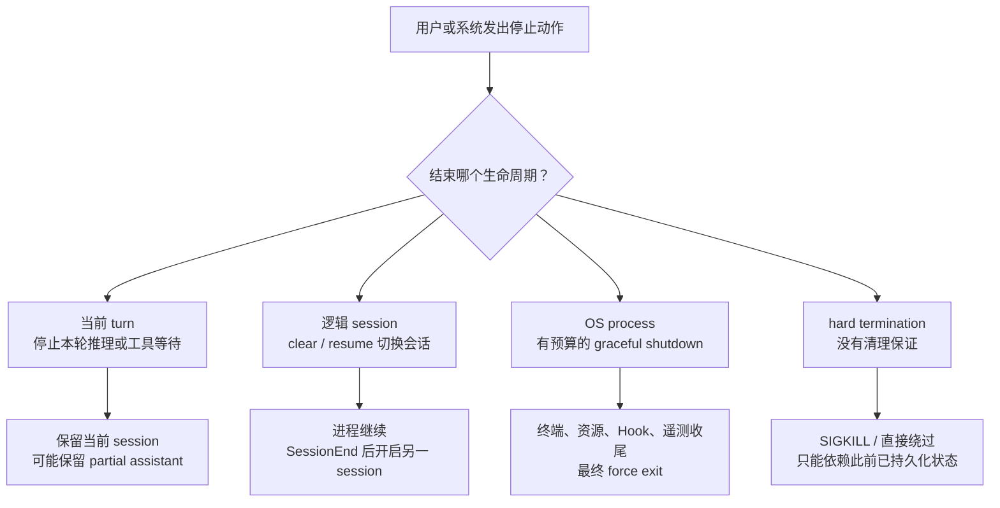

这张图是全章最重要的复习索引。以后看到 `abort()`、`SessionEnd`、`gracefulShutdown()` 或 `process.exit()`，不要因为它们都带有“结束感”就画成一条线。

可以先用一句话固定四层语义：

```text
turn cancellation
!= logical SessionEnd
!= process graceful shutdown
!= abrupt termination
```

- **turn cancellation** 终止当前一次工作，通常保留会话 owner 和已提交状态；
- **logical SessionEnd** 关闭一段逻辑会话，进程仍可承载下一段会话；
- **process graceful shutdown** 在有限时间内组织进程级收尾，然后退出；
- **abrupt termination** 不承诺执行 JavaScript cleanup，只能靠增量持久化和下次恢复。

下面沿四条路径分别走一次。

## 按 Esc 时，退出的只是当前 turn

Interactive 的关键入口在 `src/screens/REPL.tsx:onCancel()`。它不是简单执行一行 `abortController.abort()`，而是先收敛 UI 与会话中已经发生的事实：

1. 暂停 proactive 行为并强制结束当前 query guard；
2. 如果已经有流式文本，把 partial assistant 写入 `messages`；
3. 清理 loading 与 token budget 等本轮 UI 状态；
4. 根据当前是在 permission、prompt、remote 还是 local query，执行不同取消动作；
5. 普通本地分支调用 `abortController.abort('user-cancel')`；
6. 清掉旧 controller，避免下一次 Esc 误认仍有可取消工作；
7. 当前 session 和进程继续存在。

局部时序比函数列表更容易看出“先保存再取消”的意义：

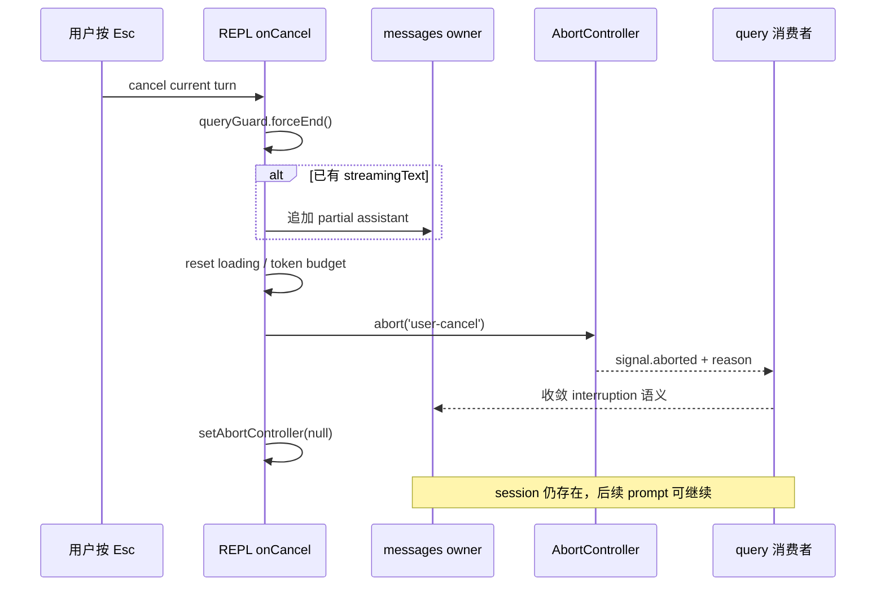

为什么 partial assistant 要在 abort 前进入消息 owner？因为“模型已经输出过这些字”是已经发生的事实。若 UI 先把流清空，再把取消当成一个错误字符串，学习者和恢复逻辑都会看到一段凭空消失的历史。

这里复用了 M03 的核心结论：`AbortSignal` 是通知，不是资源动作本身。`abort('user-cancel')` 只让消费者看见 one-shot 状态与 reason；它不自动：

- 回滚已追加的消息；
- 终止所有子进程；
- 运行 SessionEnd；
- 冲刷整个 Transcript；
- 关闭 OS process。

reason 也不是装饰信息。当前 query 路径会区分 `user-cancel`、`interrupt` 等原因；某些原因需要生成中断消息，另一些原因表示新的排队输入正在接管上下文。企业 Harness 若把所有取消都压成 `CancelledError`，后续恢复、计费和用户提示就失去了决策依据。

### Ctrl+C 为什么不能只靠名字判断

在 Interactive UI 内，Ctrl+C 可能被按键系统解释为取消当前 turn，也可能在空闲状态进入双击退出流程。外部工具执行 `kill -INT` 或 IDE 点击 Stop，则会触发 Node/Bun 的 OS `SIGINT` handler。

两者都叫 Ctrl+C/SIGINT，但入口层不同：

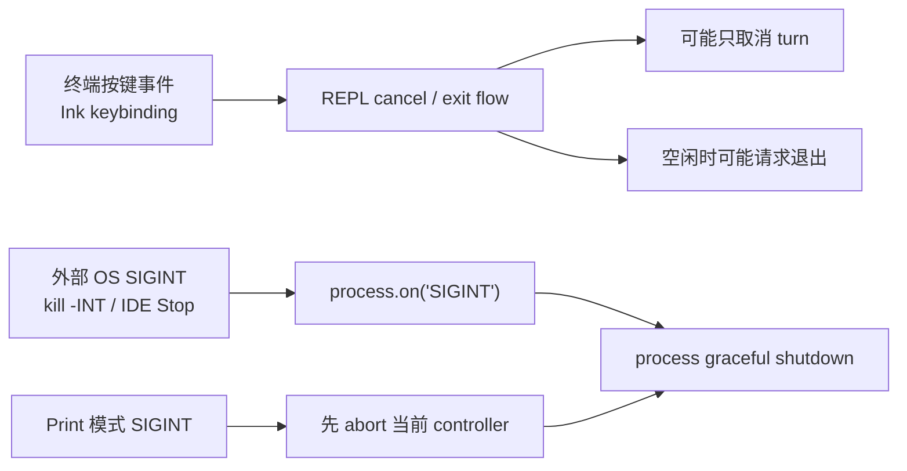

源码阅读时不要看到 `SIGINT` 三个字就把所有 Ctrl+C 行为合并。真正的判断方式是：事件从 Ink 输入栈来，还是从 `process.on()` 来；它调用的是 `onCancel`、exit flow，还是 `gracefulShutdown`。

## `/clear` 与 `/resume`：结束会话，但不结束进程

SessionEnd Hook 容易被误解成“进程退出 Hook”。当前快照直接给出了反例：

- `src/commands/clear/conversation.ts` 在清空当前会话前执行 `executeSessionEndHooks('clear', ...)`；
- `src/screens/REPL.tsx` 的 Interactive resume 路径在切换前执行 `executeSessionEndHooks('resume', ...)`；
- 两者完成后，OS process 仍继续工作，并进入新的逻辑 session。

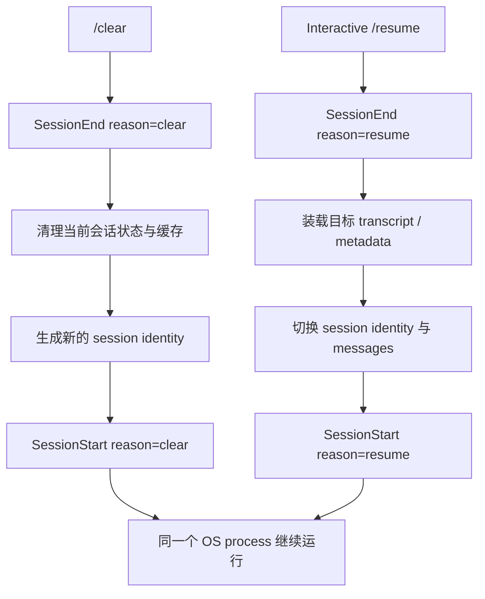

这揭示了一个很有迁移价值的设计：**Hook 事件应该围绕领域生命周期命名，而不是围绕进程 API 命名。** 在一个常驻 Java 服务里，tenant conversation、workflow run、WebSocket session 都可能多次结束和重建，JVM 从未退出。如果把 SessionEnd 绑死到 shutdown hook，就无法表达这些逻辑边界。

### 相同 Hook 名称，不代表相同状态可见性

三类 SessionEnd 都使用同一个 timeout helper，但它们传入的上下文并不完全相同：

| 调用点 | reason | AppState access | 进程是否继续 |
| --- | --- | --- | --- |
| `/clear` | `clear` | 取决于 `clearConversation` 调用方是否传入 `getAppState/setAppState` | 是 |
| Interactive `/resume` | `resume` | 显式传入 `store.getState` 与 `setAppState` | 是 |
| 普通 `/exit`、signal、Headless 收尾 | `prompt_input_exit` 或默认 `other` | 只有调用者显式传 options 才存在；常见调用通常未传 | 否 |

这不是一个无关紧要的参数差异。Hook 能否读取或更新 session-derived state，决定了它能否做会话清理、生成上下文或写回状态。教材后面的 Hook 单元会深入协议；此处只需保留边界：**reason 与 timeout 可以共享，状态能力仍由 call site 注入。**

## 进程级退出设施在什么时候安装

进程级入口从 `src/entrypoints/init.ts:init` 开始。它先应用 safe environment，然后调用 memoized `setupGracefulShutdown()`，再继续初始化较高层设施。

早安装的原因很实际：如果只有完整 REPL 渲染后才注册 handler，那么初始化 OAuth、代理、MCP 或其他设施期间收到 SIGTERM，进程就可能直接按默认行为结束。

`setupGracefulShutdown()` 当前安装或维护这些入口：

- non-print `SIGINT` -> `gracefulShutdown(0)`；
- `SIGTERM` -> `gracefulShutdown(143)`；
- 非 Windows `SIGHUP` -> `gracefulShutdown(129)`；
- 非 Windows且 stdin 是 TTY 时的 orphan check；
- uncaught exception 与 unhandled rejection 的诊断/analytics 观察。

注意最后一项只说明“记录”，不能推导出“所有未捕获异常都会自动完成 graceful shutdown”。日志 handler 与退出 owner 是不同责任。

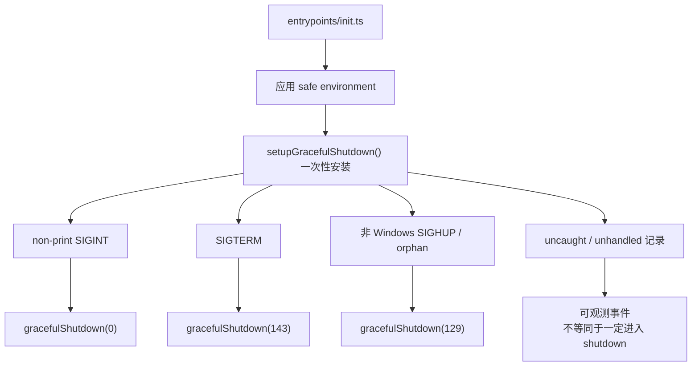

### Print 模式为什么要有自己的 SIGINT handler

`src/cli/print.ts:runHeadlessStreaming` 持有当前请求的 `abortController`。它比全局 handler 更了解 Headless turn，因此专用 SIGINT handler 做两件事：

```text
abort current in-flight query
-> gracefulShutdown(0)
```

全局 handler 检测到 argv 包含 `-p` 或 `--print` 时主动跳过，避免两个 handler 竞争 first-caller ownership。这个设计说明 surface adapter 并非只负责输出格式；它还拥有该表面特有的输入、当前 turn controller 和信号适配知识。

## `gracefulShutdownSync` 为什么名字很容易骗人

Headless 正常结束和不少早期错误路径会调用 `gracefulShutdownSync()`。如果只看名字，很容易写出：

> “同步版确保退出前所有 cleanup 已完成。”

源码表达的恰好不是这个意思。它的最小形状是：

```typescript
process.exitCode = exitCode
pendingShutdown = gracefulShutdown(exitCode, reason, options)
  .catch(/* fallback cleanup + forceExit */)
  .catch(/* suppress test-mode rejection */)
```

同步发生的只有两件事：设置 `process.exitCode`，启动并保存异步关机 Promise。函数返回时，cleanup 完全可能仍在运行。`pendingShutdown` 主要供测试等待；普通调用者没有 `await gracefulShutdownSync()` 这个语义。

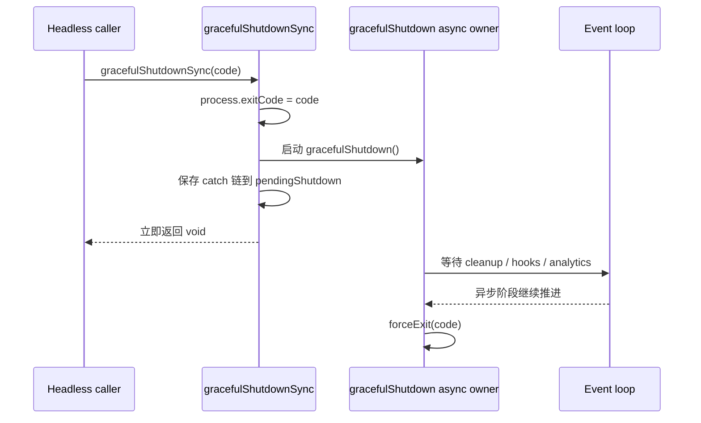

这也是一个 TypeScript/Node 阅读技巧：`Sync` 可能描述“调用接口不返回 Promise”，不代表其启动的所有副作用已同步完成。判断时必须看返回类型、内部 Promise 所有权和调用方是否 await。

## 第一个调用者拥有整个 shutdown

进程关闭时常会发生竞争：用户输入 `/exit` 的同时部署平台发来 SIGTERM；Headless SIGINT handler 先取消当前请求，而另一个路径也检测到 fatal error。若每个入口都独立清理，可能重复关闭 MCP、重复 flush、覆盖 exit code，甚至让第二个清理看到半关闭资源。

当前快照用模块级 `shutdownInProgress` 做最小所有权门：

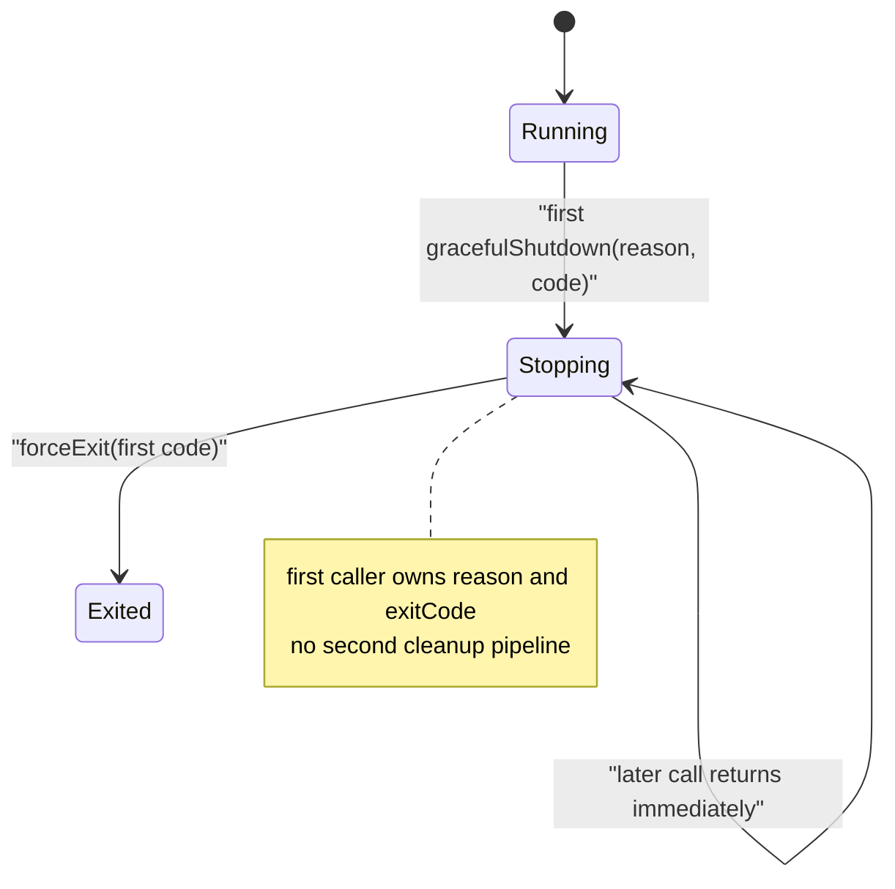

进入 `gracefulShutdown()` 后先检查 flag；首次进入者把它设为 `true`。后续调用直接返回，因此：

- 第一个 reason 进入 SessionEnd Hook；
- 第一个 exit code 最终进入 `forceExit`；
- 后续信号不重启预算，不创建第二个 registry run；
- 后续调用者得到的也不是同一个可观察 report，只是提前结束。

最后一点正是 clean-room Harness 会改进的地方：Claude Code 当前 owner guard 足以避免重复执行，但调用方无法从一个共享 report 了解“谁赢了、哪些 cleanup 完成、哪些超时”。在企业系统里，我们希望复用同一个 Promise/Task 与结构化报告，而不是仅复用一个布尔门。

## 真正的关机顺序：先保住可恢复性，再有限等待

现在可以走完整条 process shutdown。请先只看顺序，不急着研究每个阶段内部：

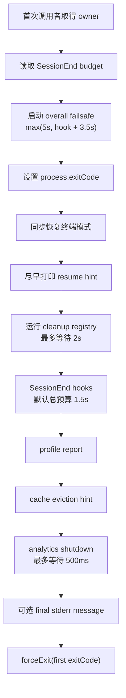

顺序背后的价值判断是：

1. 终端不能因为网络或 Hook 卡住而长期处于坏模式；
2. 恢复提示应该尽早可见，而不是等所有遥测结束；
3. 业务资源与会话写入有较大但有限的 2 秒等待窗；
4. 用户 Hook 有独立、可配置的合作式预算；
5. analytics 慢网络最多只值得 500ms；
6. 所有阶段都受 overall failsafe 兜底，进程不会无限挂住。

这不是“每一步都一定成功”的顺序，而是“在时间不断减少时，系统愿意为谁等待”的顺序。下一节开始拆开这些保证。

## 终端与恢复提示为什么放在所有异步工作之前

`cleanupTerminalModes()` 使用同步写恢复鼠标跟踪、扩展键盘模式、alternate screen、标题和进度状态。它不是业务持久化，而是在保护用户的 shell。

假设先等待 MCP 关闭，再恢复终端。如果 MCP socket 永远不 resolve，CLI 即使最终被平台杀死，用户也可能回到一个鼠标事件乱飞、光标错位、键盘协议未复位的终端。把终端清理提前，等于先处理一个“失败后用户无法自行忽略”的本地副作用。

`printResumeHint()` 紧跟其后。它只在满足 TTY、Interactive、持久化开启、session file 已存在等条件时显示，并用 guard 避免 failsafe 再次重复打印。这里的恢复提示不是“退出成功证明”，而是一张尽早交给用户的恢复句柄。

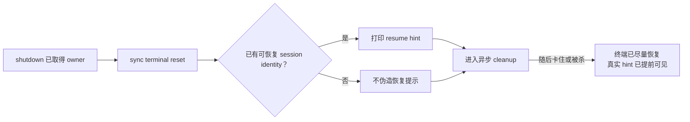

企业迁移时也应保持这个原则：恢复句柄必须来自**已经持久化**的 identity 或 checkpoint，不要先生成一个 token，再异步尝试写盘。否则提示本身会承诺一个不存在的恢复点。

## Cleanup registry：注释说关键，不等于代码有优先级

当前 `src/utils/cleanupRegistry.ts` 极小：

```typescript
const cleanupFunctions = new Set<() => Promise<void>>()

export async function runCleanupFunctions(): Promise<void> {
  await Promise.all(Array.from(cleanupFunctions).map(fn => fn()))
}
```

这几行代码同时决定了四个重要语义。

第一，`Set` 保存函数身份并保留插入顺序。重复注册同一个函数对象会去重，但两个行为相同的不同闭包仍是两个条目。

第二，`Array.from(set).map(fn => fn())` 会按插入顺序**调用** handler。调用顺序不是完成顺序；一旦 handler 返回 Promise，多个异步操作会并发推进。

第三，`Promise.all` 是 fail-fast。任一 Promise reject，聚合 Promise 会立即 reject；已经启动的 peer 不会自动收到取消，也不会回滚。

第四，没有 phase、priority、dependency、handler report 或 cooperative signal。源码注释可以表达“session data 最关键”，但教材只能把代码实际提供的保证写成事实。

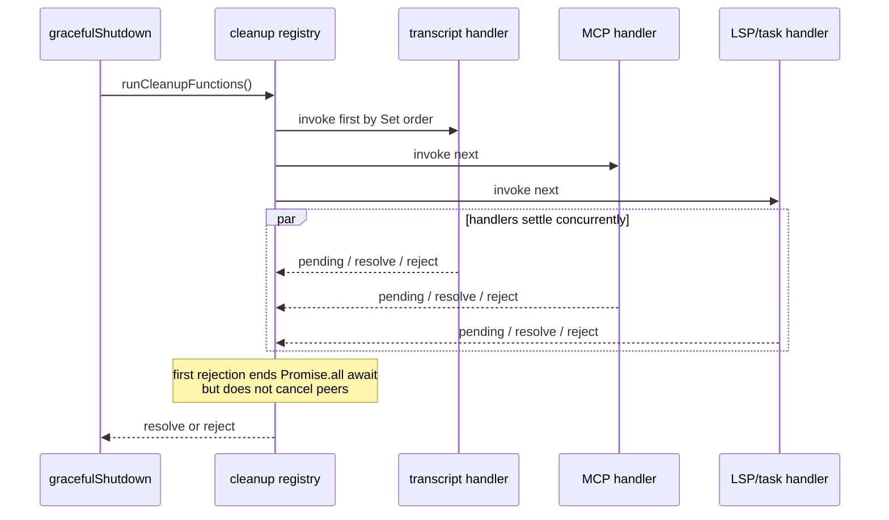

### 一个 20 行实验推翻“失败会取消同伴”

M09 的 snapshot-shaped 实验注册了两个 handler：

- `slow` 先记录 start，等待外部 release，再记录 done；
- `fail` 记录 start 后立即抛错。

真实观察顺序是：

```json
["slow:start","fail:start","registry:rejected","after-await","slow:done"]
```

如果 `Promise.all` 会取消同伴，最后的 `slow:done` 就不应该出现。它出现了，说明“聚合 await 已失败”和“底层工作已停止”是两个不同事实。

这也是为什么本单元不把每个 `catch` 都当实验。一个代表性反例已经击中了最危险的错误心智模型：**上层不再等待，不等于下层不再执行。**

## 两秒超时只停止等待，不会清空现场

`gracefulShutdown()` 并不是直接 `await runCleanupFunctions()`，而是把它和一个 2 秒 rejection timer 放进 `Promise.race`。无论 registry 自己 reject，还是 timer 先到，外层都会吞掉错误并继续 SessionEnd。

很多初学者会把 `Promise.race` 画成“超时后删除慢任务”。JavaScript 没有这个保证。race 只选出最先 settle 的 Promise 作为自己的结果；loser 仍持有闭包、I/O 和回调，直到自然 settle 或整个进程被强制结束。

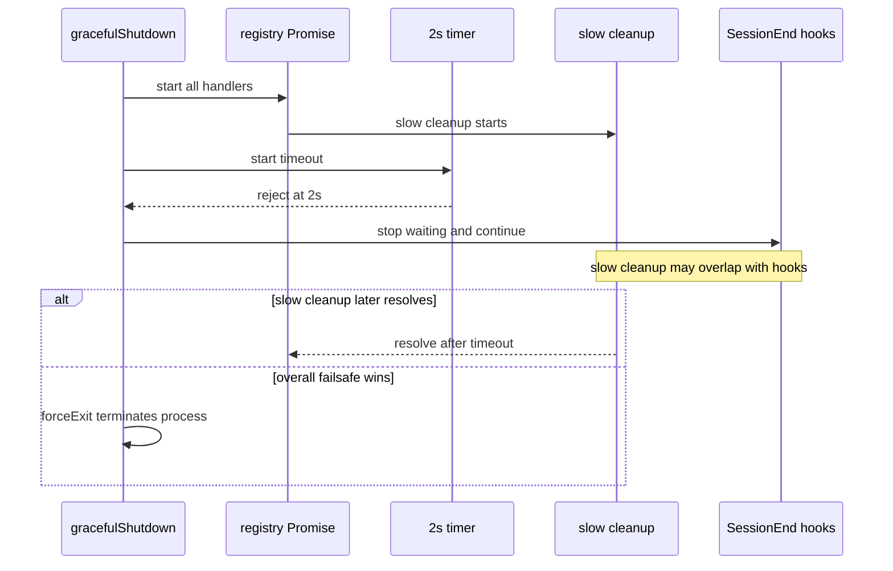

这种重叠会带来真实设计问题：如果慢 cleanup 与 SessionEnd Hook 同时写同一个文件，或一个正在关闭连接、另一个仍试图发送数据，就可能产生竞争。当前快照选择了简单 registry 和最终退出确定性，没有提供 phase 级互斥。教材的 clean-room Harness 会把 critical/resource/best-effort 分层，正是为了让跨层依赖可表达。

### Reject 比 2 秒更早时，等待窗甚至会提前结束

外层在 registry 内吞掉 `runCleanupFunctions()` 的错误，因此某个 handler 立即 reject 时，`cleanupPromise` 可能很快 resolve，整个 2 秒 stage 随即结束。其他 peer 仍在背景运行，SessionEnd 已经开始。

这比“所有 cleanup 最多一起跑 2 秒”更精确：

```text
正常情况：等待所有 handler，最多 2s
任一 handler reject：可能远早于 2s 停止等待
无论哪种情况：未完成 peer 都不会被 race 自动取消
```

因此 fail-fast 很适合“所有结果都成功才算成功”的批处理，却不一定适合 shutdown registry。关机时更常见的需求是 all-settled：一个 telemetry exporter 失败，不应让 transcript 和 MCP cleanup 失去剩余等待窗口。

## Transcript flush 到底保证了什么

`src/utils/sessionStorage.ts:getProject()` 在首次创建 `Project` 单例时惰性注册 cleanup。handler 先 `await project.flush()`，再尽力 re-append title/tag metadata，使 tail-based resume listing 仍能找到这些信息。

`Project.flush()` 的内部顺序是：

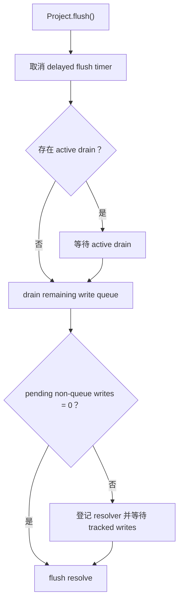

这说明 Transcript 的 owner 不是在退出时临时遍历一个 `messages` 数组写文件。正常运行中已经有队列、active drain 和 tracked non-queue write；shutdown 只负责让这些增量操作尽量收敛。

### 为什么不能说“Transcript 一定第一个完成”

必须把两层顺序分开：

```text
阶段顺序：cleanup registry 在 SessionEnd hooks 和 analytics 之前
registry 内部：Transcript handler 与其他 handler 并发，没有 priority
```

而且 handler 是惰性注册。第一次使用 `Project` 的时机决定它何时进入 Set，不能证明它永远是第一项。即使调用顺序第一，也不能证明异步完成第一。

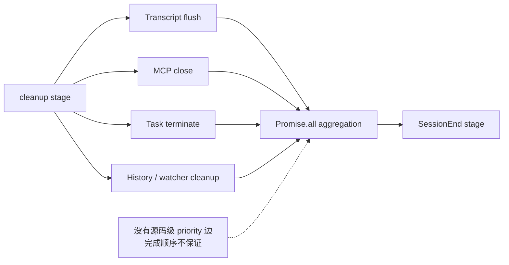

源码注释“Flush session data first”表达的是重要性和阶段意图。严谨教材不能把注释升级成 API 没有实现的保证。这个差异恰好是源码级学习的价值：你不仅看作者想做什么，还要确认运行时真的保证了什么。

### 进入 stopping 后为什么要拒绝新远程写入

`Project.persistToRemote()` 先检查 `isShuttingDown()`；若进程已进入 shutdown，就不再发起新的 remote persistence。

这表达了一个通用 drain 原则：

> 一旦开始收尾，必须关闭新工作入口，否则“等待全部完成”的集合可能永远增长。

本地已经进入 queue/tracked writes 的工作由 `flush()` 尽量收敛；新的远程写入被抑制。`print.ts` 也用 `isShuttingDown()` 避免在 Headless finally 中把 session 再标为 idle。当前定向搜索没有发现 `main.tsx` 使用它阻止新 command，因此教材不能扩大这个 guard 的责任范围。

## SessionEnd 的预算比 cleanup 更接近合作式取消

cleanup registry 没有 signal。SessionEnd 路径则取得 `getSessionEndHookTimeoutMs()`，并向 `executeSessionEndHooks` 传入：

- `AbortSignal.timeout(sessionEndTimeoutMs)`；
- `timeoutMs: sessionEndTimeoutMs`；
- 调用点实际拥有的 AppState functions。

默认总预算是 1.5 秒，设置中的单 Hook timeout 也受这个整体 cap 约束。Hook runner 若尊重 signal，可以停止继续工作；但这仍然是合作式协议，不是操作系统层面的强杀。

对比三种 timeout：

| 阶段 | 等待预算 | 取消表达 | 超时后的保证 |
| --- | ---: | --- | --- |
| cleanup registry | 2s | 无 handler signal | 外层继续，loser 可能仍运行 |
| SessionEnd hooks | 默认总计 1.5s，可配置 | `AbortSignal.timeout` + timeoutMs | runner 可合作收敛，异常被吞掉 |
| analytics | 500ms | 无统一 abort | 外层继续，慢 exporter 可丢失 |

这张表也解释了为什么“有 timeout”不是一个完整契约。必须继续问：timeout 限制谁的等待？谁能观察 signal？底层工作是否有幂等/补偿？结果如何被记录？

## Overall failsafe 如何包住局部预算

在任何异步阶段开始前，代码先读取 SessionEnd budget，再启动：

```text
overall failsafe = max(5000ms, sessionEndTimeoutMs + 3500ms)
```

默认 hook budget 1500ms 时，结果是 5000ms。额外 3500ms 大致覆盖 2 秒 cleanup、500ms analytics 以及 profile/cache/final write 的余量。若用户把 SessionEnd budget 配成 10 秒，failsafe 会扩展到 13.5 秒，而不是仍在 5 秒时把配置悄悄截断。

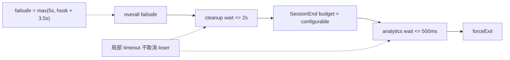

Failsafe 到点后会再次尽量恢复终端、打印 hint，并调用 `forceExit`。正常路径到达 `forceExit` 时会清掉 timer，避免后续重复触发。

### Cache eviction hint 不携带 shutdown reason

SessionEnd 之后，代码运行 profile report，再在存在 `lastRequestId` 时发送 `tengu_cache_eviction_hint`。当前 payload 是固定 `scope: 'session_end'` 与 `last_request_id`。

`reason` 进入的是 `executeSessionEndHooks(reason, ...)`，不是 cache event。把 reason 画进缓存事件会制造一个不存在的可观测能力，后续治理方案也会错误依赖它。

### 为什么 analytics 只有 500ms

analytics exporter 可能等待慢网络。退出时继续无限等待，会让“记录退出”反过来阻止退出。当前设计明确接受慢网络下丢失一部分 analytics，以换取可预测的 process termination。

这是典型的业务优先级：

```text
可恢复 session state > 资源释放 > 用户 Hook > 遥测完整性
```

但请再次注意：这是整个 stage 的价值排序，不是当前 cleanup registry 内已经实现的严格 priority。clean-room 设计需要把价值排序翻译成可执行 phase，不能只写注释。

## `forceExit` 是有意结束协商

`forceExit(exitCode)` 清理 failsafe timer，最后再 drain stdin，然后调用 `process.exit(exitCode)`。若死 TTY 导致 exit 抛出 EIO，production 路径可回退到 SIGKILL；测试环境重抛，便于测试观察。

到达这里意味着系统不再等待新的异步协商。进程退出会截断仍在背景运行的 cleanup 或 analytics Promise。因此每个重要状态都不能把唯一持久化机会押在最后一刻。

## 哪些路径根本不会进入 graceful owner

成熟代码库里通常仍有 bypass。教材若宣称“所有退出都统一进入 gracefulShutdown”，就会给恢复能力制造虚假的安全感。

当前需要记住三类：

1. `claude --bg` 会话中的 `/exit`、Ctrl+D 等可只执行 tmux detach，REPL 继续在后台运行；这不是 process shutdown；
2. 特定短命子命令、早期错误 UI 或 helper 仍可能直接 `process.exit()`；
3. SIGKILL 无法被 JavaScript 捕获，所有 cleanup/Hook 都可能完全不运行。

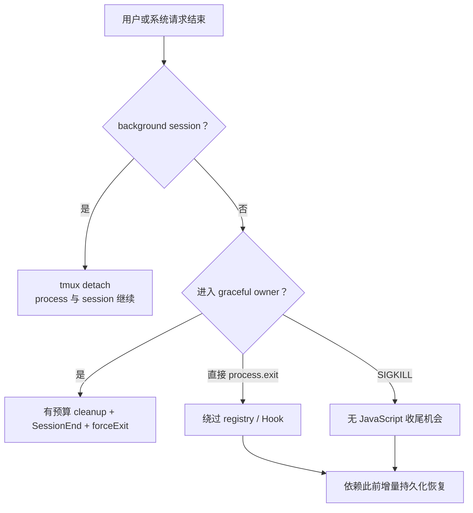

这个图给企业 Agent 一个硬约束：**crash consistency 不能由 graceful shutdown 单独提供。** Transcript/checkpoint 必须在运行过程中增量提交；退出 flush 只是缩小丢失窗口，不是唯一防线。

## 为什么当前设计合理，又为什么还值得改进

当前快照的设计有明显优点：

- 单一全局 owner 避免重复 shutdown；
- registry 让资源模块自注册，不需要一个巨型 `finally` 导入所有设施；
- terminal/hint 提前，用户体验不被慢网络绑架；
- cleanup、Hook、analytics 和 overall 分别有预算；
- 最终 force exit 保证进程可收敛。

它也有明确边界：

- registry 没有 phase/priority；
- `Promise.all` fail-fast 可能过早结束等待；
- timeout 不向 handler 发 signal；
- 无结构化 per-handler report；
- 后续 shutdown caller 看不到首调用者结果；
- 关键状态与资源 cleanup 的依赖只能靠注册者自律。

这些不是“源码写错了”的简单结论。轻量 CLI 可以用较小控制面换取实现简单；企业平台面对多租户、远程 worker、审计和 SLO 时，才需要更强契约。设计迁移的目标不是批评原实现，而是识别约束变化后哪些边界必须显式化。

## 用双语言实验把“停止等待”与“停止工作”分开

现在不要只接受正文结论。M09 提供独立 TypeScript 与 Python clean-room 实现，先验证共同契约，再主动破坏。

### 实验要验证什么

核心假设：

1. `critical -> resource -> best-effort` 跨层严格按顺序进入；
2. 同层 handler 并发启动，一个失败不会跳过 peer 或下一层；
3. tier timeout 会产生合作式取消 reason 和 `timed-out` 报告；
4. timeout 不会伪装成底层已物理取消；
5. 第一个 shutdown request 拥有同一个 Promise/Task 与最终 report；
6. stopping 后拒绝新注册，unregister 后的 handler 不运行；
7. prepare/recovery hint 发生在慢 cleanup 之前；
8. overall deadline 用尽后，未开始的低优先级层被明确标为 `skipped`。

反证条件也要先写清：如果 resource 在 critical 未 settle 前启动，phase 假设失败；如果一个 critical reject 导致同层 good handler 或 resource 不运行，failure isolation 假设失败；如果 timeout report 写 completed，观测契约失败。

### 运行 TypeScript

```powershell
cd "D:\agent\Claude code最新\curriculum\units\M09\code\typescript"
powershell -NoProfile -ExecutionPolicy Bypass -File .\typecheck.ps1
node --experimental-strip-types .\lifecycle-coordinator.test.ts
node --experimental-strip-types .\demo.ts
```

当前验证结果：strict 通过，生命周期测试 `8/8`。demo 中依次看到 transcript、MCP、analytics，report 的 `deadlineExceeded` 为 false。

Node 24 的 strip-only TypeScript 有一个值得记住的限制：它能去掉普通类型标注，却不转换 parameter property 这类需要生成 JavaScript 字段赋值的语法。因此示例使用显式字段：

```typescript
readonly options: CoordinatorOptions

constructor(options: CoordinatorOptions = {}) {
  this.options = options
}
```

这不是生命周期语义，却直接影响“初学者能否复制命令运行”。教材代码不能只在 IDE 类型检查里看起来正确。

### 运行 Python

```powershell
cd "D:\agent\Claude code最新\curriculum\units\M09\code\python"
python .\test_lifecycle_coordinator.py
python .\demo.py
```

当前验证结果同样是 `8/8`。Python 使用 `asyncio.Task`、`asyncio.wait(timeout=...)` 和自定义 `CancellationToken` 表达同一行为契约；它不是对 TypeScript 的逐行翻译。

两种语言的时间单位尤其容易写错：TypeScript 默认 `Date.now()` 返回毫秒；Python `monotonic()` 返回秒，因此 Python 在计算 overall elapsed 时乘以 1000。若直接复制公式而不转换，200ms 预算会被误当成 200 秒量级。

### 主动做五次破坏

1. 把 TypeScript `Promise.all(tasks)` 改成逐个 `await`。观察同层第二个 handler 是否仍能在第一个结束前 start；解释吞吐和确定性变化。
2. 删除 handler 的 rejection 分支，让一个错误直接穿出。观察后续 tier 是否消失；再用 per-task result 恢复 failure isolation。
3. timeout 后不调用 `controller.abort(...)`。report 仍会超时，但 handler 无法合作收敛；解释“等待预算”和“取消协议”的差别。
4. 允许 stopping 后继续 register。构造一个 handler 在 cleanup 中注册另一个 handler；回答新条目属于当前 snapshot 还是下一轮，并解释为什么 drain 会变得含糊。
5. 把 transcript 从 critical 移到 best-effort，并让 resource 卡住直到 overall deadline。观察 transcript 被 `skipped`；说明这个分类为何违背可恢复性目标。

不要只把代码改到测试重新变绿。每次破坏都要画出 owner、等待者、底层任务和 report 的变化。

## Mini Agent Harness：把价值排序变成可执行契约

M09 已把 `LifecycleCoordinator` 合入 H1-in-progress。它不复制 Claude Code 的 `cleanupRegistry` 形状，而是保留问题和设计思想：

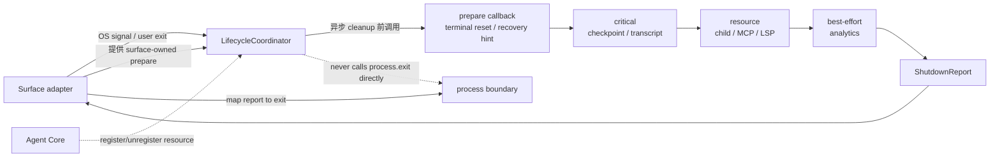

### 为什么 Core 不应该直接 `process.exit()`

Core 可能运行在 CLI、HTTP server、测试进程、桌面应用或 worker 线程中。若领域核心直接退出进程：

- 单元测试会被整个终止；
- 一个 tenant 的 session 失败可能杀掉共享服务；
- Java/Spring 与 Python worker 无法复用同一契约；
- Surface 无法决定 stderr、exit code、Kubernetes termination 或 detach 行为。

因此 Coordinator 只返回 `ShutdownReport`。Surface adapter 再把 report 映射为 CLI exit、HTTP readiness 变化、worker ack 或进程管理动作。

### 状态机和 first-owner Promise

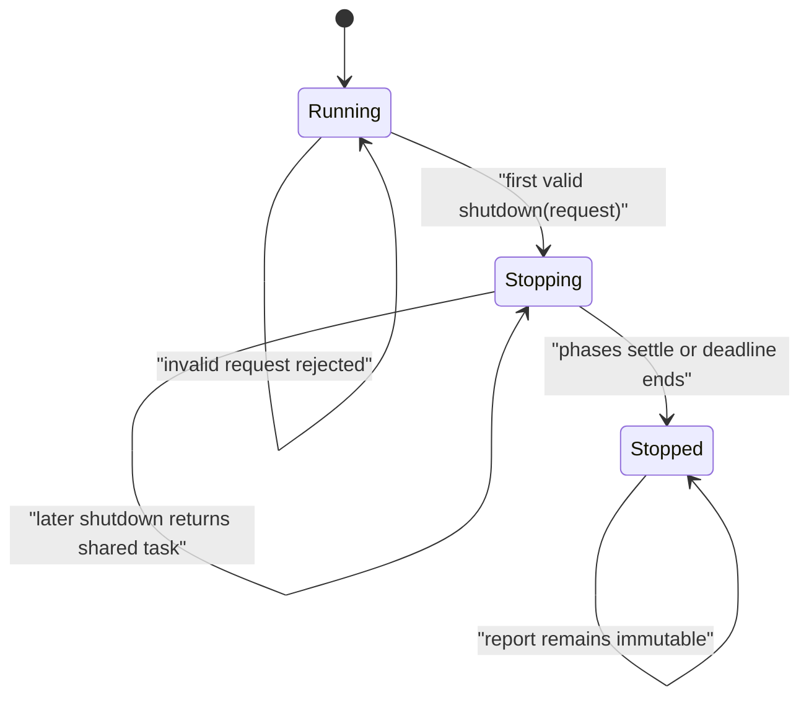

与源码快照的 boolean guard 相比，Harness 返回同一个 Promise/Task。后续调用者可以 await 同一份 report，并清楚知道首个 reason 和 exit code，没有必要自行猜测进程是否还在收尾。

先校验 request，再把 state 变成 stopping，也很重要。若一个非法的无限预算先抢走 owner，再抛错，合法 SIGTERM 就无法接管。测试专门验证非法预算不会改变 lifecycle state。

### 三层的真正含义

- `critical`：不完成会显著损害恢复或一致性，例如 checkpoint、Transcript、幂等位置；
- `resource`：停止继续占用外部资源，例如子进程、MCP、LSP、租约；
- `best-effort`：允许在退出窗口不足时丢弃，例如非关键 analytics。

层与层串行，同层并行并用独立结果隔离错误。这里选择的不是“所有 critical 一定成功”，而是“在给低优先级工作时间前，先给 critical 自己的完整预算窗”。

每个 handler 结果至少保留：

```text
name, tier, status, duration, optional error
```

`timed-out` 表示 Coordinator 停止等待并已发 signal；`skipped` 表示 handler 根本没有开始。这两个状态不能合并，否则运维人员无法判断是否存在仍在后台跑的 loser。

### 为什么 phase 内用 all-settled 思想

TypeScript 实现给每个 task 自己附上 success/failure 归一化，再 `Promise.all` 等这些永不向外 reject 的结果；Python 则检查 `asyncio.wait` 的 done/pending 集合并逐项读取结果。

这不是隐藏错误。错误被从控制流转换成 report 数据，shutdown owner 才能继续完成其他必要动作并给出可观测结论。若某个错误应阻断后续 phase，可以在策略层根据 critical result 决定，而不是被第一个随机 reject 隐式决定。

### 合作式 timeout 仍不是强杀

TypeScript 给同层 handler 同一个 `AbortSignal`，Python 给同一个 `CancellationToken`。timeout 后：

```text
mark unfinished records timed-out
-> send cleanup-tier-timeout:<tier>
-> return tier report
```

若 handler 完全忽略 signal，它仍可能继续运行。最终 process boundary 才能强制终止整个进程。这个限制必须出现在 API 文档和面试回答里，否则团队会把 `timed-out` 误读成“资源已经释放”。

## 从 H1 回归看一次安全演进

生命周期能力不是单独 demo 通过就算合入。H1 回归同时运行：

- S0 全量 `15/15`；
- Interactive/Headless surface；
- configuration；
- RuntimeContext 与 request snapshot；
- CapabilityProjection 与 ExecutableRegistry；
- TypeScript/Python LifecycleCoordinator；
- TypeScript strict。

当前结果：

```text
H1-in-progress regression: 12/12 checks passed (including S0 15/15)
```

这里的 `12/12` 是检查组，不是单测数量。生命周期模块本身双语言各 `8/8`。这一区分能避免用一个漂亮数字掩盖测试粒度。

H1 至此形成了一个可解释的运行壳：surface 知道如何接收输入和关闭，configuration/runtime context 提供不可变运行依赖，capability projection 决定本轮可见和可执行能力，lifecycle coordinator 负责有预算地收尾。它还没有模型主循环、Tool Loop 或完整持久化；这些将在 H2/H6 演进，不能提前声称成品。

## 迁移到 Java/Spring：先分清三种关闭

Java 开发者最容易想到 `@PreDestroy` 或 `DisposableBean`。它们只覆盖容器 bean 的停止，不自动表达 turn cancellation 和 logical session transition。

一个更清晰的 Spring 边界是：

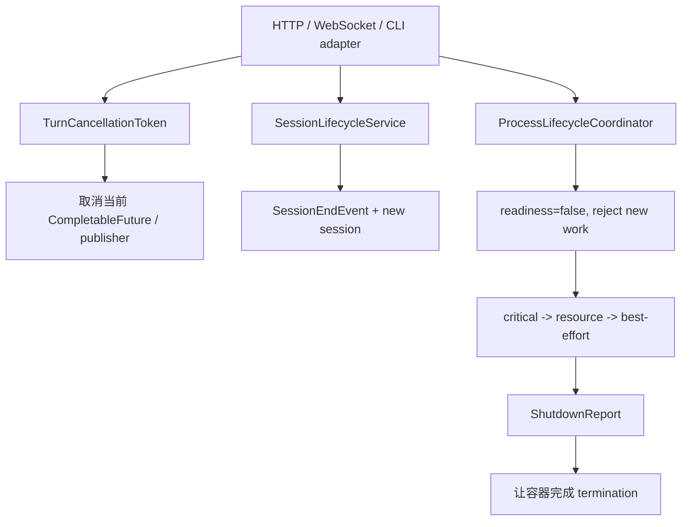

实现时可以采用：

- `SmartLifecycle` 或应用事件负责 process phase；
- session service 发布领域级 `SessionEndEvent`，不依赖 JVM shutdown；
- Reactor/CompletableFuture 的取消 token 负责单 turn；
- `TaskExecutor`/scheduler 进入 stopping 后拒绝新任务；
- 每个 cleanup 返回 `CompletionStage<CleanupResult>`；
- `orTimeout` 只限制 future 的观察语义时，要确认底层 I/O 是否真的收到取消；
- readiness 先置 false，让负载均衡停止送新请求，再开始 drain。

不要把所有 bean 的 `@PreDestroy` 并行运行就叫做分级 shutdown。关键是 critical checkpoint 是否获得独立预算、resource 是否在它之后、失败是否进入 report，以及容器 `terminationGracePeriodSeconds` 是否覆盖内部 overall deadline。

### Kubernetes 预算必须从外向内算

假设 Pod 有 30 秒 termination grace：

```text
0s      收到 SIGTERM，readiness=false
0-15s   critical：checkpoint / transcript / lease state
15-23s  resource：child process / connection / worker
23-26s  best-effort：metrics / analytics
26-28s  report + final logs
28-30s  外层保留强杀余量
```

内部 overall deadline 不应正好等于 30 秒。kubelet、日志和进程管理还需要余量。若每个组件都各自宣称“最多 30 秒”，串起来就必然超预算。

## 分布式 Agent 的 shutdown 不是本地 Promise 问题

当工具或 Subagent 在远程 worker 上运行，本地 `AbortSignal` 只能表达意图。可靠收尾还需要：

- 带 operation ID 的 cancel/shutdown command；
- worker ACK，区分 received、stopping、stopped；
- lease 到期与 orphan reaper；
- checkpoint/version，防止旧 worker 在恢复后继续提交；
- 幂等 cleanup，容忍重复 SIGTERM 和消息重放；
- coordinator failover 后能够重建 in-flight ownership；
- report 区分 local timeout 与 remote confirmed termination。

此时 `timed-out` 更不能翻译成“远程任务已停”。它只说明本地等待预算耗尽。企业 API 可以进一步使用：

```text
cancel-requested
cancel-acknowledged
termination-confirmed
lease-expired
orphaned
```

M09 只建立进程内基础；后面的 Task、Subagent 和 Agent Team 单元会把 owner 扩展到分布式协作。

## RAG 与 LangGraph：中断图执行后还剩什么

在 RAG/Graph 工作流里，turn cancellation 可能发生在：

- embedding 请求中；
- vector search 后、rerank 前；
- 模型已经生成 tool call；
- graph node 已写外部系统但 checkpoint 尚未提交。

LangGraph 的 interrupt/checkpoint 能帮助恢复图状态，却不会自动决定外部副作用的补偿和进程退出顺序。你仍需要回答：

- 当前 node 的输出是否已经 durable；
- cancel reason 是否写入 run state；
- vector DB/HTTP client 是否接受 cooperative cancellation；
- process shutdown 前先 flush graph checkpoint，还是先关闭 client；
- 恢复后是否会重复执行有副作用 node。

因此正确迁移不是“给每个 node 加 timeout”，而是把 M09 的 owner/phase/report 契约放到框架外层，并让 checkpoint 成为 critical cleanup。

## 可观测性：不要只记录一条 shutting down

生产 report 至少要支持这些问题：

- 谁取得 first-owner，reason 和 exit code 是什么；
- stopping 后拒绝了多少新工作；
- 每个 phase 的预算、实际耗时和剩余 overall budget；
- 哪些 handler completed、failed、timed-out、skipped；
- timeout 后仍有多少底层任务未确认终止；
- recovery hint/checkpoint 对应哪个 durable version；
- process 最终是 normal exit、failsafe 还是外部 SIGKILL。

指标可以包括：

```text
shutdown_duration_ms{phase}
shutdown_handler_total{tier,status}
shutdown_deadline_exceeded_total
shutdown_late_registration_total
shutdown_unconfirmed_resource_total
session_end_total{reason}
```

不要把高基数 session ID 放进 metric label；它适合 trace/log field。analytics 自己也是 best-effort cleanup，关键 shutdown report 应优先写入本地可靠日志或宿主控制面，不能只依赖正在被关闭的 exporter。

## 资深 Agent 开发岗面试：从取消讲到生产收尾

下面的问题不是章末背诵题。每个回答都先给结论，再自然展开到 Claude Code 快照、失败边界和企业设计，控制在面试现场约两分钟能组织出的长度。

### 问题 1：Agent 系统里的 cancel、SessionEnd 和进程退出有什么区别？

**回答：** 结论先说，这三者必须按作用域分开，不能共用一个“stop”布尔值。cancel 通常只结束当前 turn，保留 session 和已经提交的消息；SessionEnd 是逻辑会话边界，像 `/clear`、`/resume`，进程可以继续；进程退出才需要终端、资源、Hook、遥测和最终 exit 的整体收尾。Claude Code 的 REPL `onCancel` 会先保留 partial assistant，再用带 reason 的 AbortController 中止当前 query，它不会运行 SessionEnd。`/clear`、`/resume` 会运行 SessionEnd Hook，但不会退出。`gracefulShutdown` 则是 first-caller owner，按预算完成进程级 cleanup。生产设计里我会给三层不同 API 和状态机，因为远程任务取消、会话切换、Pod SIGTERM 的恢复和审计要求完全不同。最后还要单独承认 SIGKILL：它绕过所有 JavaScript cleanup，所以持久化必须增量完成，不能只押在退出 finally。

### 问题 2：`Promise.race` 做 timeout 后，慢 cleanup 是不是已经被取消？

**回答：** 不是。`Promise.race` 只让上层停止等待 loser，不会物理取消底层 Promise。Claude Code 的 cleanup stage 用 registry Promise 和 2 秒 timer race，analytics 也和 500ms sleep race。timer 赢了以后，未完成 cleanup 仍可能与 SessionEnd 并发，直到自然结束或 process 被 force exit。我们做的对照实验里，一个 handler 立即 reject，registry await 已经失败，但慢 handler 之后仍然打印 done，正好证明这个边界。企业实现里我会把 timeout 和 cancellation protocol 分开：handler 接收 AbortSignal 或 token，report 标记 timed-out，同时保留“termination unconfirmed”。如果是远程 worker，还要等 ACK、lease 或终态事件，不能把本地 timeout 当作远端已停。

### 问题 3：Claude Code 的 cleanup registry 能保证 Transcript 最先完成吗？

**回答：** 不能。能确认的是 cleanup stage 整体位于 SessionEnd Hook 和 analytics 之前，而且 Transcript 的 Project 在首次使用时会惰性注册 flush；`Project.flush` 会等 active drain、剩余队列和 tracked writes。但 registry 本身是 Set 加 `Promise.all`，所有 handler 并发，没有 phase 或 priority。Set 只能说明调用顺序，不能说明异步完成顺序，惰性注册也不能保证 Transcript 永远是第一项。源码注释强调 session data 最关键，这是设计意图，不是 registry 已实现的优先级。迁移到企业 Harness 时，我会把 checkpoint/Transcript 放进独立 critical phase，给它完整预算，再进入 resource 和 best-effort，而不是只写一条“优先保存”的注释。

### 问题 4：为什么 `gracefulShutdownSync()` 不是同步清理？

**回答：** 结论是它只是同步外壳。函数同步设置 `process.exitCode`，调用异步 `gracefulShutdown`，把 catch 后的 Promise 保存到 `pendingShutdown`，然后返回 void；调用者并没有 await cleanup 完成。这个命名容易让人按直觉误读，所以我会看返回类型、Promise owner 和 call site，而不是只看 Sync 后缀。它适合 Headless 尾部或某些不能改成 async 的错误路径，用事件循环继续推进 shutdown，同时有 failsafe 保证最终退出。clean-room 设计里我更倾向让核心 `shutdown()` 始终返回共享 Promise/Task，外层若必须同步触发再提供 adapter，这样测试和并发调用者都能 await 同一份 report，不会靠模块级测试 helper 才知道是否完成。

### 问题 5：多个信号同时到达时，谁决定 exit code 和 shutdown reason？

**回答：** Claude Code 当前是 first caller wins。`gracefulShutdown` 用 `shutdownInProgress` 做门，第一个进入者设置 owner，后续调用直接返回，所以第一个 reason 进入 SessionEnd，第一个 exit code 最终 force exit。这个规则避免重复关闭资源和后到信号覆盖已经开始的预算。边界是后续调用者拿不到结构化结果，只知道没有再启动一轮。我的 Harness 会复用同一个 Promise/Task 和 immutable report：第一个合法 request 抢 owner，后续 signal await 同一结果，report 记录 winning reason、code、各 phase 状态。还要先校验 request 再切 stopping，防止一个非法预算抢走 owner后失败。

### 问题 6：如何设计一个有预算的企业级 Agent shutdown？

**回答：** 我会先关入口，再按价值分阶段，而不是把所有 cleanup 一次 `Promise.all`。收到 SIGTERM 后先把 readiness 置 false，拒绝新 turn 和新资源注册；同步恢复用户表面并输出基于 durable checkpoint 的恢复句柄。然后 critical phase 冲刷 Transcript、checkpoint、幂等位置；resource phase 关闭子进程、MCP、连接和租约；best-effort phase 做 analytics。每层内可以并发，但用 all-settled 记录 completed、failed、timed-out，层间按顺序，并受 overall deadline。timeout 要发 cooperative signal，但 report 不能假装底层已被杀。外层 Kubernetes grace 还要比内部 deadline 大，留 final log 和强杀余量。最后 Surface 决定 process exit，核心只返回 report，便于 CLI、Spring 服务和测试复用。

### 问题 7：为什么 graceful shutdown 不能代替崩溃恢复？

**回答：** 因为 SIGKILL、机器掉电、容器 OOM 和直接 `process.exit` 都可能不给 cleanup 任何机会。Graceful shutdown 只能缩小正常退出时的丢失窗口，不能建立 crash consistency。Claude Code 也存在 background detach 和直接退出的 bypass，所以 Transcript 本身是运行中增量写入，退出时的 `Project.flush` 只是收敛 active drain、queue 和 tracked writes。企业 Agent 我会用 append-only event、checkpoint version、幂等外部副作用和恢复扫描；关键状态在每个提交点 durable，而不是只在 JVM shutdown hook 写一次。恢复时还要区分消息已经写入但工具副作用未确认、远程 worker 仍持有旧 lease 等不完整状态。

### 问题 8：如果用 Spring 或 LangGraph 复现，你会保留哪些 Claude Code 设计，改哪些？

**回答：** 我会保留三点：生命周期分层、first-owner、有限预算；也会保留“终端或恢复提示先于慢遥测”的价值排序。要改的是 registry 控制面：从 Set 加 fail-fast `Promise.all` 改成 critical/resource/best-effort phase、per-handler all-settled report 和 cooperative token。Spring 里 turn cancel、SessionEnd event、process SmartLifecycle 要分开，readiness 先关闭；LangGraph 的 checkpoint 放 critical，但 graph interrupt 不代表外部工具已经停止。Core 不直接 `System.exit`，由 adapter 根据 report 决定容器退出。对于远程 Subagent，我还会增加 cancel ACK、lease 和 termination-confirmed，因为本地 Future timeout 只能说明我不等了，不能说明远端结束了。

## 离开本单元前，完成一次生命周期演练

请在不看答案的情况下完成：

1. 画出 Esc、`/clear`、`/resume`、`/exit`、Print SIGINT、SIGKILL 分别结束哪一层；
2. 从 `entrypoints/init.ts` 定位 signal 安装，再走到 `gracefulShutdown` 的 first-owner guard；
3. 用自己的话解释为什么 `gracefulShutdownSync` 返回时 cleanup 可能没完成；
4. 重做 slow + fail registry 实验，写出反证条件；
5. 画出 transcript handler 与 MCP handler 的并发关系，不画不存在的 priority；
6. 修改 LifecycleCoordinator，让一个 critical failure 阻止 resource，比较显式策略与偶然 fail-fast；
7. 把 recovery hint 改成依赖未落盘 identity，设计一个失败实验，再修复；
8. 为 Spring/Kubernetes 写一份 30 秒 shutdown budget，预留外层强杀余量；
9. 用两分钟回答“timeout 是否等于取消完成”，并准备远程 worker 追问。

当你能够解释“谁停止等待、谁仍在运行、谁拥有最终退出”，M09 才算学完。

## 源码定位地图

核心快照事实：

| 问题 | 路径 -> 符号 -> 决定性代码 |
| --- | --- |
| 何时安装全局退出设施 | `src/entrypoints/init.ts` -> `init` -> safe env 后调用 `setupGracefulShutdown()` |
| signal 与 orphan 入口 | `src/utils/gracefulShutdown.ts` -> `setupGracefulShutdown` -> SIGINT/SIGTERM/SIGHUP/orphan handlers |
| 同步外壳 | 同文件 -> `gracefulShutdownSync` -> 设置 exitCode、保存异步 catch 链 |
| first owner 与总顺序 | 同文件 -> `gracefulShutdown` -> `shutdownInProgress`、failsafe、各 stage、`forceExit` |
| registry 并发 | `src/utils/cleanupRegistry.ts` -> `registerCleanup/runCleanupFunctions` -> Set + `Promise.all` |
| turn cancel | `src/screens/REPL.tsx` -> `onCancel` -> partial assistant、branch cancel、`abort('user-cancel')` |
| Interactive resume | 同文件 -> resume path -> `executeSessionEndHooks('resume', AppState options)` |
| clear session | `src/commands/clear/conversation.ts` -> `clearConversation` -> SessionEnd clear、状态切换、SessionStart |
| 普通 `/exit` 与 bg detach | `src/commands/exit/exit.tsx`、`src/components/ExitFlow.tsx` -> `call/onExit` |
| Interactive root 正常结束 | `src/interactiveHelpers.tsx` -> `renderAndRun` -> root exit 后 await graceful shutdown |
| Headless 正常/SIGINT | `src/cli/print.ts` -> normal tail、`runHeadlessStreaming:sigintHandler` |
| SessionEnd timeout | `src/utils/hooks.ts` -> `getSessionEndHookTimeoutMs/executeSessionEndHooks` |
| Transcript cleanup 注册 | `src/utils/sessionStorage.ts` -> `getProject` -> lazy `registerCleanup` |
| Transcript drain | 同文件 -> `Project.flush` -> timer、active drain、queue、tracked writes |
| stopping 后抑制远程写 | 同文件 -> `persistToRemote` -> `isShuttingDown()` guard |
| 代表性资源 cleanup | `src/tasks/LocalShellTask/*`、`LocalAgentTask/*`、`src/services/mcp/client.ts` -> register/unregister |

版本边界：官方 CHANGELOG 可证明外部 SIGINT、SessionEnd timeout、SSH disconnect flush 和 unclean transcript recovery 等新版公开修复，但不能替代本单元对当前快照内部阶段、预算和 registry 语义的核验。

最终请保留这句判断：

> 优雅退出不是“执行 cleanup”，而是由明确 owner 在有限预算内关闭新入口、保存可恢复状态、收敛资源、记录未完成项，并承认强制终止仍可能发生。
