# M10 消息不是聊天文本：谁拥有历史，谁只看见一次快照

你已经在 M05-M09 看见 Claude Code 怎样选择运行表面、装配配置与能力，以及怎样收尾进程。现在终于要进入 Agent 主循环。但在研究 `query()` 之前，有一个比循环更基础的问题必须先解决：**循环到底在消费什么？**

初学者很容易回答：“消费 `messages` 数组。”这个回答只说出了容器名，没有说明语义。真实系统至少还要追问：

- 这个数组由谁长期拥有；
- 当前请求拿到的是 owner，还是某一时刻的 view；
- 数组复制后，里面的对象还会不会变化；
- `user` 到底表示人类输入，还是也可能表示工具结果；
- 同一段 assistant 输出为什么同时需要本地 UUID、provider response ID 和 tool-use ID；
- progress 为什么能被 UI 和 SDK 看见，却不应该成为恢复链上的节点；
- 两个工具并行返回时，线性聊天记录为什么会变成一张小型 DAG。

如果这些问题没有答案，后面的 Query Loop、Context Pipeline、Tool Loop 和 Transcript 都会建立在模糊地基上。最常见的后果不是“少显示一条消息”，而是旧请求突然看见新成员、并发更新互相覆盖、工具结果配错调用、恢复时丢掉一个并行分支，或者把 UI 进度误送给模型。

本单元会闭合消息的所有权、快照、身份和配对边界。它不会重复 M11 的完整“用户输入到模型”纵切，也不会提前展开 M13 的全部 API normalization 算法。你学完后应该能先回答：**哪些数据可以进入下一层，为什么它们在进入前已经足够稳定和可辨认。**

## 先看见四个不同的问题

下面这张图不是一次完整 Agent 运行图。它只回答：同一会话历史在进入模型前，为什么必须经过所有权、快照和投影三个边界。

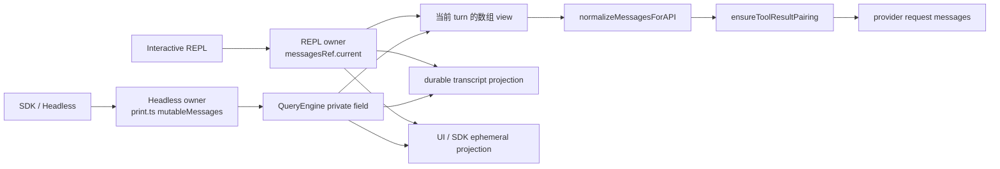

图中有四个不能混为一谈的概念：

1. **长期 owner** 决定会话当前有哪些内部消息；
2. **turn view** 固定某次查询开始时看到的数组成员；
3. **API projection** 删除、转换、合并并修复 provider 协议需要的消息；
4. **durable/ephemeral projection** 决定什么进入恢复历史，什么只服务当前观察者。

`mutableMessages` 因此不是“直接送给 LLM 的输入”。它首先是内部会话历史的一种所有权实现。模型最终看见的是从某个 view 派生出来、经过 API normalization 和 tool pairing 后的协议序列。

## 用一轮带工具的消息建立直觉

假设用户输入：“读取 `config.json`，告诉我端口。”在内部运行中，你可能观察到下面这些事件：

```text
U1  human user message
A1  assistant text fragment: "我先读取文件"
A2  assistant tool_use fragment: Read(config.json)
P1  progress: reading
R1  user-role tool_result: { port: 8080 }
A3  assistant final text: "端口是 8080"
```

如果只看 provider role，`U1` 和 `R1` 都可能表现为 `user`；如果只看 provider response ID，`A1` 和 `A2` 还可能属于同一次 response；如果只看本地数组，`P1` 也在其中，但它不应进入 durable transcript。于是“一条消息”这个词至少已经承载了四种不同关系。

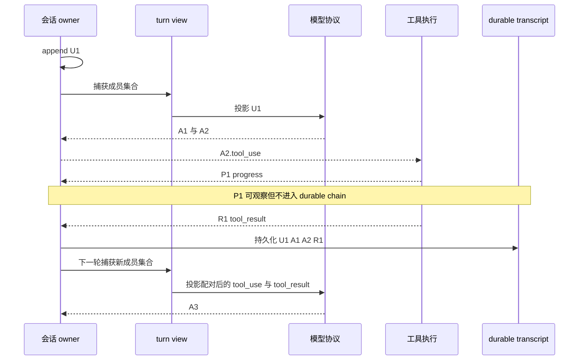

这条时间线先给出三个结论：

- **数组顺序**描述当前观察到的发生顺序，却不等于所有身份关系；
- **provider role**是网络协议字段，不是完整领域类型；
- **是否持久化**是另一条策略轴，不能从“在内存数组里出现过”直接推出。

后面的源码正是在分别解决这些问题。

## REPL 的 owner 为什么不是 React render state

先看交互式 REPL。`src/screens/REPL.tsx` 在当前快照中同时创建：

```ts
const [messages, rawSetMessages] = useState(initialMessages)
const messagesRef = useRef(messages)
```

如果你只熟悉 Java，可以先把 React state 想成“触发下一次界面渲染的已发布值”，把 ref 想成“当前组件生命周期内可同步读取的可变字段”。这个类比不完全等价，但足够解释这里的关键差异：**调用 `rawSetMessages()` 并不保证当前调用栈下一行已经能从 render state 读到新值。**

Claude Code 因此包了一层 `setMessages`。决定性语义可以简化成：

```ts
const prev = messagesRef.current
const next = typeof action === 'function'
  ? action(messagesRef.current)
  : action
messagesRef.current = next
rawSetMessages(next)
```

第一处赋值同步改变 owner，第二处调用请求 React 更新 render projection。用户消息 append 后，代码可以立刻读取 `messagesRef.current` 并把已经包含新消息的数组交给 `onQueryImpl()`，不需要等待下一次 render。

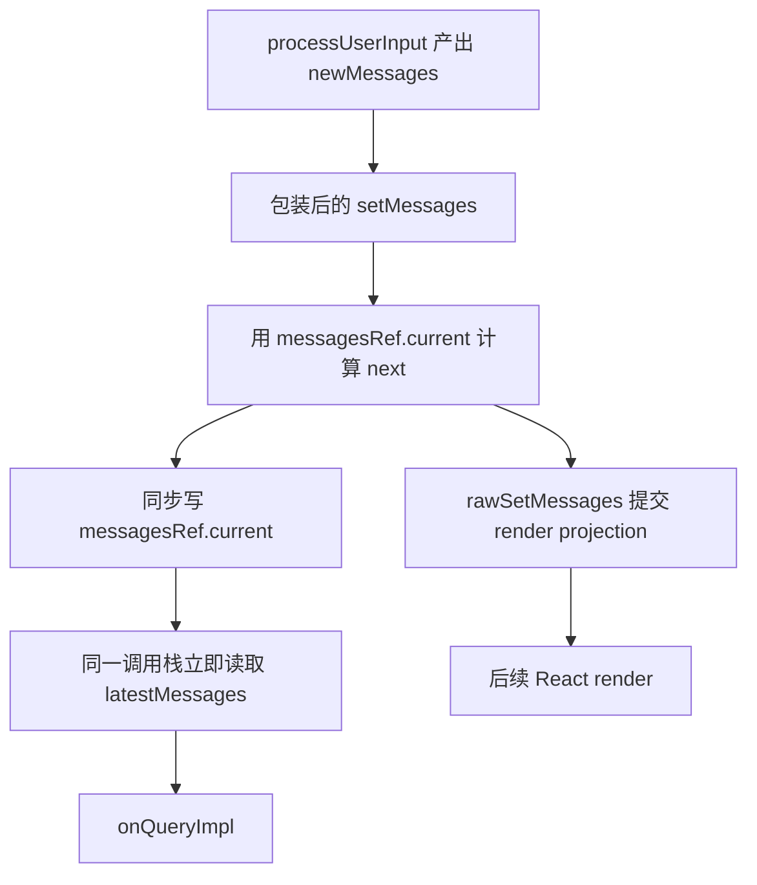

这里真正重要的不是 React API 名字，而是 owner 规则：

- `messagesRef.current` 是当前调用栈的同步事实；
- `messages` state 服务渲染；
- AppState 提供工具、权限和运行状态，但不会自动拥有这条主消息数组；
- compact、rewind、clear 会缩短或替换 owner 数组，依赖长度的 cursor 必须一起校正。

如果把 render state 误当成同步 owner，最危险的不是画面慢一帧，而是用户刚提交的消息可能没有进入本轮 query view。这个错误在 Java 服务中也有对应物：你把异步发布到事件总线的 read model 当成当前事务的写模型，然后在同一调用栈里立刻读取它。

### 一个容易误判的闭包问题

看到 React callback 时，很多人会立刻怀疑“闭包捕获了旧 messages”。这个怀疑值得检查，但不能靠经验下结论。当前源码中 `getToolUseContext(messages, ...)` 的第一形参就是显式传入的 `messagesIncludingNewMessages`；参数名遮蔽了外层 state。事实闸门 A 曾提出 stale closure 风险，直接源码核验后被反驳。

这说明源码研究的一个方法：**不要因为某类框架常见某种 bug，就把它投射到当前函数。先沿实参、形参和读取点闭合数据来源。**

## Headless 的共享数组为什么更微妙

Headless 路径没有 React。`src/cli/print.ts` 把 `initialMessages` 保存为一个跨 command 存活的数组：

```ts
const mutableMessages: Message[] = initialMessages
```

每次 command 调用 `ask()`；`ask()` 创建 `QueryEngine`，构造器把这个数组赋给自己的私有字段。普通用户输入路径随后执行 `push`，因此 engine 字段和 `print.ts` 变量只要仍指向同一数组，就能观察到同一次 append。

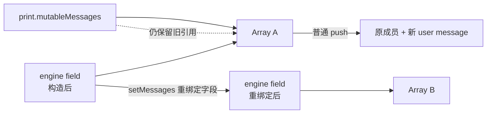

`push` 修改对象本身；两个别名仍然共享。可是 `ProcessUserInputContext.setMessages(fn)` 执行的是：

```ts
this.mutableMessages = fn(this.mutableMessages)
```

如果 `fn` 返回新数组，engine 私有字段会指向 Array B，而 `print.ts` 外部的 `const mutableMessages` 仍指向 Array A。这是 Java/Python 同样存在的引用语义：给一个字段重新赋值，不会远程改变另一个变量保存的引用。

当前源码可以静态证明这种**别名分叉能力**，但不能据此宣称普通 Headless 用户路径一定发生历史丢失。触发它的 slash command 受 feature gate 影响，当前快照还缺少相关 `commands/force-snip` 实现。教材因此只保留条件式边界，不把它包装成已经复现的产品 bug。

这也解释了 H2 为什么选择单一 `ConversationStore`，而不是规定“大家记得一直共享同一个数组”。共享引用是一份隐式契约；只要某个参与者从 mutation 改成 replacement，契约就会悄悄失效。

## `[...]` 固定成员，不会冻结消息对象

`QueryEngine.submitMessage()` 把输入 push 进私有数组后，执行：

```ts
const messages = [...this.mutableMessages]
```

这一步非常容易被写成“创建不可变快照”。准确说法应是：**它创建了数组成员关系的浅 view。**

假设 owner 是：

```text
Array A -> [Message X, Message Y]
```

展开后得到：

```text
Array B -> [Message X, Message Y]
```

Array A 和 Array B 是不同容器；`Message X` 与 `Message Y` 仍是同一对象引用。

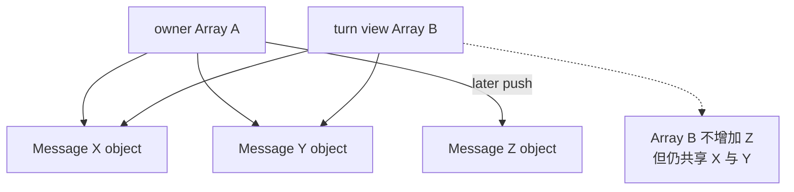

因此后续 `owner.push(Message Z)` 不会让旧 view 自动多出 Z；但是另一个别名修改 `Message X.message.usage` 时，旧 view 仍可能看见新值。

当前快照正有一个必须这样设计的实例。`src/services/api/claude.ts` 在 `content_block_stop` 时创建并 yield `AssistantMessage`；稍后的 `message_delta` 才带来最终 usage 和 `stop_reason`。代码直接写回最后一个已 yield message 的嵌套字段，而不是用新对象替换。邻近注释解释了原因：Transcript 写队列保留了 `message.message` 的引用并延迟序列化，直接 mutation 才能让队列写到最终值。

这不是一句“mutation 不好”能评价的代码。它是在流式协议时序、增量消费和延迟持久化之间作出的显式选择：

- 早 yield，UI 和调用者能尽快看到 content block；
- 晚到的 delta 补全成本和停止原因；
- 保留对象身份，让延迟 writer 观察最终字段；
- 代价是 shallow view 不能被描述成深不可变值。

### TypeScript 的三个不同约束

初学者应把下面三件事分开：

```ts
const view = [...owner]              // 新数组，共享元素
const readonlyView: readonly M[] = view // 编译期禁止经此引用改数组
const frozen = Object.freeze(view)   // 运行时冻结这一层数组
```

它们都不会自动深冻结 `M` 的嵌套对象。`readonly` 主要是 TypeScript 静态能力；运行后的 JavaScript 没有因为类型注解自动复制任何东西。Java 的 `List.copyOf()` 也只保证列表结构不可修改，不会深复制列表元素；Python 的 `tuple(messages)` 同样只是固定容器成员。

## 为什么不能只给消息一个 `id`

现在回到那轮工具调用。至少五类身份同时存在：

| 身份 | 回答的问题 | 不能替代什么 |
| --- | --- | --- |
| envelope `uuid` | 这是哪个本地消息实例 | 不能代替 provider response 或 tool call |
| assistant `message.id` | 哪些 fragment 属于同一次 provider response | 不能唯一标识每个本地 envelope |
| `tool_use.id` | 模型发起的是哪次工具调用 | 不能代替产生它的 assistant envelope |
| transcript `parentUuid` | 恢复拓扑里这个节点接在哪个本地节点之后 | 不能当 tool result 配对键 |
| SDK `session_id` / `parent_tool_use_id` | 外部宿主在哪个会话、嵌套调用下观察事件 | 不能覆盖内部 UUID 链 |

`createUserMessage()` 会为内部 user envelope 生成 UUID 和 timestamp。`baseCreateAssistantMessage()` 同时生成 envelope UUID 与内部 provider-style `message.id`。流式层还可能让同一次 provider response 的多个 content block成为多个 assistant envelope，它们的 envelope UUID 不同，但 `message.id` 相同。

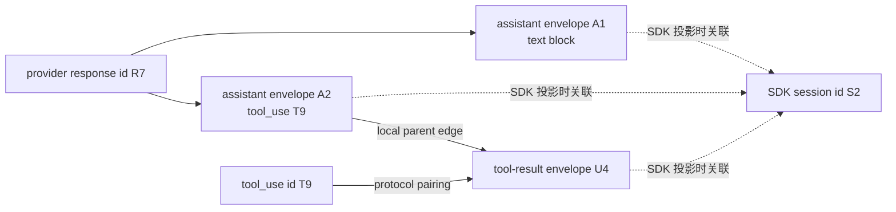

注意图中有两条从工具相关消息建立的边：

- `tool_result.tool_use_id = T9` 回答“这个结果解析哪次工具意图”；
- `sourceToolAssistantUUID = A2` 最终帮助 Transcript 写出 `parentUuid`，回答“本地恢复拓扑把结果挂在哪个 assistant envelope 下”。

如果把 response ID 当 envelope key，同一 response 的 A1、A2 会互相覆盖；如果把 envelope UUID 当 tool-use ID，provider 无法找到对应结果；如果把 session ID 当消息 ID，同一会话只能保存一个节点。

H2 的 TypeScript 实现用 branded string 把这类错误提前暴露：

```ts
declare const envelopeIdBrand: unique symbol
declare const responseIdBrand: unique symbol
declare const toolUseIdBrand: unique symbol

type EnvelopeId = string & { readonly [envelopeIdBrand]: 'EnvelopeId' }
type ResponseId = string & { readonly [responseIdBrand]: 'ResponseId' }
type ToolUseId = string & { readonly [toolUseIdBrand]: 'ToolUseId' }
```

运行时它们仍是字符串，所以边界输入仍需校验；但在 TypeScript 编译期，错误地把 `ResponseId` 传给需要 `ToolUseId` 的函数会失败。Java 可以用 `record EnvelopeId(String value)` 等 value object 获得更强运行时封装；Python 的 `NewType` 主要帮助静态检查，运行时仍接近普通字符串。

## `user` role 为什么不是“人类消息”

Provider 协议通常用 role 交替组织上下文。工具结果为了反馈给模型，也可能放在 user-role content block 中：

```text
role = user
content = [{ type: tool_result, tool_use_id: T9, ... }]
```

但它显然不是用户在键盘上输入的话。当前快照的 `isHumanTurn()` 因此不仅检查 `type === 'user'`，还排除 `isMeta` 和常见 `toolUseResult`。然而这仍不是全领域完备分类器：`attachments.ts` 明确说明，某些 subagent tool result 的 content 含 `tool_result` block，但本地 `toolUseResult` 字段可能被设成 `undefined`。那里必须检查 content 结构。

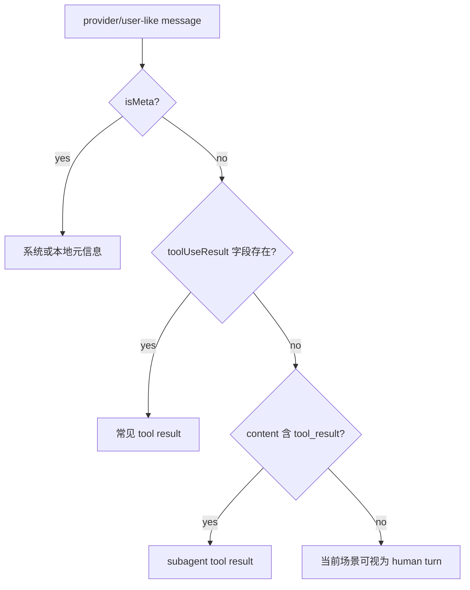

这张图不是要你把 `isHumanTurn()` 重写成一个全局万能函数。相反，它揭示了**分类器必须与用途绑定**：

- UI 统计“用户轮次”需要识别人类输入；
- API projection 需要识别 provider content block；
- Transcript writer 关心是否持久化以及 parent；
- SDK projector 关心外部 discriminant；
- 标题生成、消息队列和恢复可能还有不同边界。

一个局部 helper 在其调用域里正确，不代表它定义了系统中“人类消息”的永恒真理。企业代码里应优先使用显式领域 kind，并在外部协议边界做映射。

### 当前快照的证据边界

大量源码导入 `src/types/message.ts` 对应模块，但当前快照中没有这份源文件；`coreTypes.ts` 引用的 generated type 文件也不完整。因此本教材不会声称已经恢复 Claude Code 的完整内部 `Message` 联合。

我们仍可从 creator、switch、guard、Zod schema 与持久化代码确认当前机制实际使用的形状。`src/entrypoints/sdk/coreSchemas.ts` 也能确认 SDK 输出含 user、assistant、result、system、partial assistant、tool progress 等多个 discriminant，以及 UUID、session ID 和 parent tool-use ID。**可确认使用点不等于完整类型全集。** 这是证据边界，不是让作者补写一个看起来合理的私有类型。

## 内存、API、SDK 与 Transcript 是四个平面

`attachment` 和 `progress` 最容易暴露“在数组中”等于“发送或持久化”的错误假设。

当前直接源码可以确认：

- QueryEngine 的内部 owner 可以包含 Assistant、User、Attachment 和 Progress；
- progress 可以被投影为 SDK tool-progress 一类事件；
- `isLoggableMessage()` 明确过滤 progress，`isTranscriptMessage()` 也不把它纳入当前 Transcript union；
- loader 为旧 JSONL 中曾经参与 parent chain 的 progress 建 bridge，避免老会话恢复时链被截断；
- attachment 不会以内部 `AttachmentMessage` envelope 原样发送给 provider，但 `normalizeAttachmentForAPI()` 可以把它转换为一个或多个 user messages；
- 外部用户的 Transcript 默认还会过滤多数 attachment，少数类型受明确配置控制。

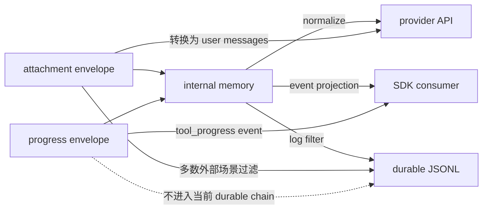

源码附近曾有“progress 会写 transcript，只是不作为 parent”的旧注释，但实际调用链已经通过 `cleanMessagesForLogging -> isLoggableMessage` 过滤它，loader guard 也排除它。教材采用执行链与当前 guard 的证据，而不是把相邻注释自动当作真相。

为什么 progress 不适合作为 durable parent？因为它频率高、生命周期短，而且真实消息不应依赖一个恢复时可以安全丢弃的 UI tick。旧 transcript 已经存在这种历史形状，所以 loader 仍保留兼容 bridge：读到 legacy progress 时，把后继节点的 parent 重写到最近的非 progress 祖先。这是“新写入规则更干净，读取兼容旧数据”的典型迁移策略。

## 并行工具把线性链推成 DAG

单个工具时，`assistant(tool_use) -> user(tool_result)` 看起来像普通链表。并行工具时，streaming 层可能为同一 provider response 的多个 `content_block_stop` 生成不同 assistant envelope：

```text
A1(response=R, tool_use=T1)
A2(response=R, tool_use=T2)
R1(parent=A1, tool_use_id=T1)
R2(parent=A2, tool_use_id=T2)
```

如果 Transcript 只能从一个 leaf 沿单一 `parentUuid` 向上走，它可能只保留其中一个结果分支。当前 `buildConversationChain()` 先做 parent walk，再调用 `recoverOrphanedParallelToolResults()`；后者按共享 `message.id` 找 assistant sibling，再按 parent UUID 找各自 tool results，并把遗漏节点插回连续位置。

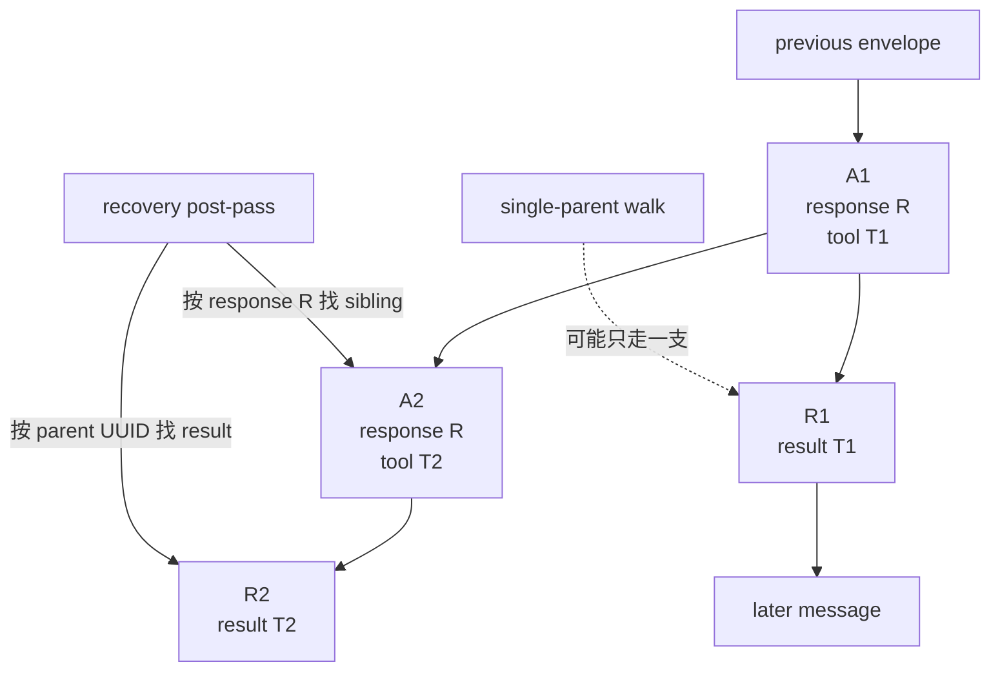

这正是多身份协作的价值：

- response ID 把流式 sibling 归组；
- envelope UUID 保留各节点唯一性；
- parent UUID 恢复局部拓扑；
- tool-use ID 检查协议配对。

它们不是重复字段，而是分别编码不同关系。完整 Transcript、fork 和 compact 会在后续单元继续展开；M10 只要求你看见：**顺序数组可以是运行视图，但持久化关系不一定是单链。**

## 配对不是美化数据，而是请求协议

Provider 收到 assistant 的 `tool_use T1` 后，下一段 user content 必须给出匹配的 `tool_result T1`。错误序列至少有四类：

```text
missing:   assistant(T1) -> 没有 result
orphan:    user(result T9) -> 历史中没有 T9
duplicate: assistant(T1) -> result T1 -> result T1
gap:       assistant(T1) -> human text -> result T1
```

当前 Claude Code 的 `ensureToolResultPairing()` 位于 API projection 后。它会处理跨消息重复 tool-use ID、缺失结果、孤儿结果和重复结果。非 strict 路径可以插入合成 error result 或删除孤儿；strict 模式直接抛错，避免把含合成 placeholder 的轨迹当成训练数据。

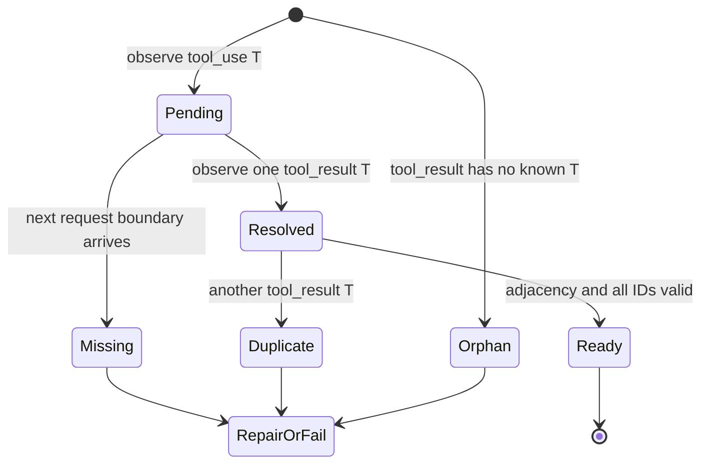

为什么不能简单删除所有不匹配内容？因为 role alternation、上下文连贯和模型对前一 assistant 的理解也可能因此破坏。为什么不能永远自动修复？因为合成结果会改变模型下一轮推理条件；在审计、训练数据或高风险执行中，fail closed 往往比“尽量继续”更诚实。

H2 选择了更小、更严格的契约：durable publication 阶段拒绝 orphan 和 duplicate；进入 provider request 前再检查 missing 与 adjacency，不实现 Claude Code 的修复算法。这是 clean-room 的设计迁移，不是对原实现的复制。

## 两个 writer 为什么需要 revision

到这里我们已经知道共享数组别名很脆弱。另一个常见方案是让每个 writer 读取数组、复制、修改，再整体 replace：

```text
writer A reads revision 7
writer B reads revision 7
A publishes revision 8 with message A
B publishes its old view plus message B
```

如果没有冲突检查，B 的 replace 可能覆盖 A。H2 采用 expected revision：

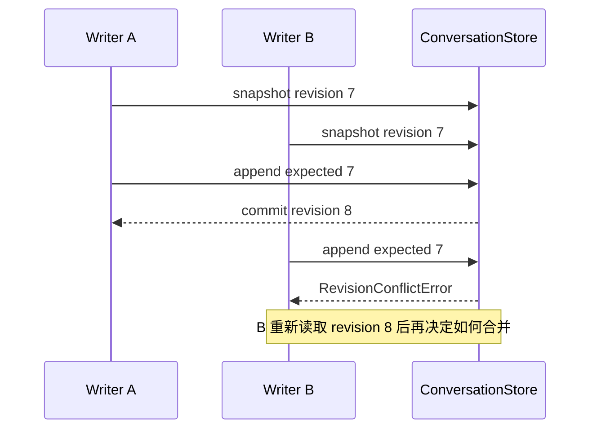

这叫 optimistic concurrency control：先假设冲突不常见，不在整个思考期间持有锁；提交时比较版本。它不会自动告诉 B 应该怎样合并，所以失败必须返回上层重试、重算或放弃。

注意 revision 解决的是**并发 publication**，不是分布式幂等的全部问题：

- 进程重启后 revision 如何持久化，M10 未实现；
- 多节点写入需要数据库 compare-and-set 或事务条件；
- tool execution 本身还需要 idempotency key；
- client 重试不能只靠内存 revision 去重。

但把冲突显式化已经比“最后一次数组赋值获胜”前进了一大步。

## 运行 H2 实验：先证明，再破坏

本单元的代码位于：

```text
curriculum/units/M10/code/typescript/
curriculum/units/M10/code/python/
```

累计 Harness 中的合入版本位于：

```text
mini-agent-harness/typescript/conversationStore.ts
mini-agent-harness/python/conversation_store.py
```

### 第一步：观察 owner 与旧 view

运行 TypeScript：

```powershell
cd "D:\agent\Claude code最新\curriculum\units\M10\code\typescript"
node conversation-store.test.ts
node demo.ts
powershell -NoProfile -ExecutionPolicy Bypass -File .\typecheck.ps1
```

运行 Python：

```powershell
cd "D:\agent\Claude code最新\curriculum\units\M10\code\python"
python -m unittest -v test_conversation_store.py
python demo.py
```

【运行验证】当前实际结果为 TypeScript 10/10、Python 11/11，TypeScript strict typecheck 通过。demo 中第一次 turn view 停在 revision 1，并保持三个成员；owner 接收 tool result 后前进到 revision 2 和四个成员。progress 被观察到，但没有推进 durable revision。

这一结果支持的是 H2 clean-room 契约，不是 Claude Code 原仓库的动态行为证明。

### 第二步：亲手破坏浅复制假设

先写一个最小实验：

```ts
const owner = [{ nested: { value: 1 } }]
const view = [...owner]
owner.push({ nested: { value: 2 } })
owner[0]!.nested.value = 99

console.log(view.length)          // 1
console.log(view[0]!.nested.value) // 99
```

预期：旧 view 不增加成员，却观察到共享元素被修改。反证条件是 `view.length` 变成 2，或 nested value 仍是 1。你应当解释为什么这两个观察分别属于容器身份和元素身份。

然后把 `ConversationStore` 的 `cloneMessage()` 临时改成直接返回调用者对象，再运行“publication clones and freezes nested payloads”测试。测试应失败，说明 caller alias 能污染已发布消息。实验结束后恢复实现。

### 第三步：移除 expected revision

在测试中保留两个 writer 都从 revision 0 开始。临时让 `#requireRevision()` 无条件通过，再观察第二个提交是否覆盖或错误接纳陈旧决策。

预期：`stale writers fail` 测试失败。真正要写下的结论不是“revision 很有用”，而是：

```text
读取时的假设属于 revision 0
第一次提交已把世界推进到 revision 1
第二个 writer 的决定没有在 revision 1 上重新计算
所以系统必须拒绝，而不是猜测合并
```

### 第四步：构造四种 pairing 错误

分别构造 missing、orphan、duplicate 和 gap。观察它们是在 publication 校验还是 request-ready 校验失败：

- orphan、duplicate 不应进入 store；
- missing 可以暂时存在，因为工具尚未完成，但不能进入下次 provider request；
- gap 暴露“最终有结果”不等于“协议位置合法”；
- 两个并行 tool use 的结果可以按 B、A 顺序到达，只要各出现一次且保持紧邻结果集合。

这个区别很重要。系统不能在 tool 正在执行时就把 pending 当 corruption；也不能在发请求时仍说“也许以后会有结果”。验证边界必须与生命周期阶段对齐。

## H2 的实现为什么这样划分

`ConversationStore` 的公开表面很小：

```text
snapshot()
append(expectedRevision, messages)
replace(expectedRevision, messages)
publishProgress(...)
assertRequestReady(snapshot)
traces()
```

小接口不是为了少写代码，而是为了把修改权集中到一个地方。

### publication 先验证，后提交

`append()` 和 `replace()` 都先构造候选 `ValidatedState`；只有完整验证成功后才替换 owner 字段并增加 revision。失败时保留旧状态，同时写一条不含 prompt 正文的 rejection trace。

这给出一个简单原子性边界：要么整批消息可发布，要么 durable membership 不变。它不是数据库事务，但足以防止“前半批已经 push，后半批验证失败”的半提交。

### progress 走另一条通道

`publishProgress()` 只允许针对 pending tool use，增加自己的 sequence 并产生 event；它不写 `#messages`，也不增加 conversation revision。这样 UI/SDK 可以频繁观察进度，而请求快照和 durable history 不会被高频 tick 污染。

### request-ready 晚于 store-valid

一个 assistant tool use 在工具执行期间可以合法处于 pending；因此 store-valid 不等于 request-ready。`assertRequestReady()` 在真正发下一次模型请求前检查：

- 每组 tool results 紧邻其 assistant；
- 每个 pending ID 已解析；
- 没有 result 解析未知或已解析 ID。

把这两个阶段合成一个 validator，会导致系统要么无法保存执行中的状态，要么把不完整历史误送给 provider。

### 为什么 publication 要深复制

Claude Code 的流式层有意共享并修改已 yield 对象；H2 没有照搬这一点。H2 把 publication 当作明确的 immutable boundary，因此使用 `structuredClone()` 复制可克隆数据，再递归 freeze。

这项选择的收益是 reader 推理简单、并发边界清楚；代价是复制成本和对不可克隆值的限制。生产系统不一定对整条历史每次深复制，可以采用 immutable persistent collection、append-only event、copy-on-write block 或数据库记录。但无论优化成什么，**publication 后谁还能改哪些字段**必须是显式契约。

开发过程中有一个很有价值的失败：最初 `toolUseBlock()` 直接 deep-freeze 调用者传入的 `input`。这虽然保护了 block，却反过来冻结了 caller 的对象，破坏了 API 边界。修复是先 clone input，再 freeze 副本。不可变设计不仅要防止外部写进来，也不能意外夺走外部对象的所有权。

## TypeScript 与 Python 同契约，不同手段

TypeScript 版本使用：

- discriminated union 区分 `human | assistant | tool-result | system`；
- branded string 区分三类 ID；
- private field 集中 owner；
- `structuredClone` 和 `Object.freeze` 建立 publication boundary；
- `ReadonlyMap`、`ReadonlySet` 表达观察意图；
- strict compiler 检查穷尽性和类型误用。

Python 版本使用：

- frozen dataclass 表达消息值；
- `NewType` 辅助 ID 静态区分；
- tuple 固定成员集合；
- `MappingProxyType` 冻结 mapping view；
- `deepcopy` 与递归 freeze 隔离 caller payload；
- `unittest` 验证相同行为边界。

两者没有逐行翻译。例如 TypeScript 的真正运行时深冻结必须显式递归；Python frozen dataclass 只禁止字段再赋值，也不会自动冻结字段里嵌套的 dict/list，所以 tool input 仍需转换。共同契约是观察结果，而不是代码长得一样。

## 接入累计 Mini Agent Harness

M10 的裁决是 `merge`。累计 Harness 当前标为 `H2-in-progress`，因为 S2 尚未完成。新增模块没有替换 H1 的 `SessionStateStore`：

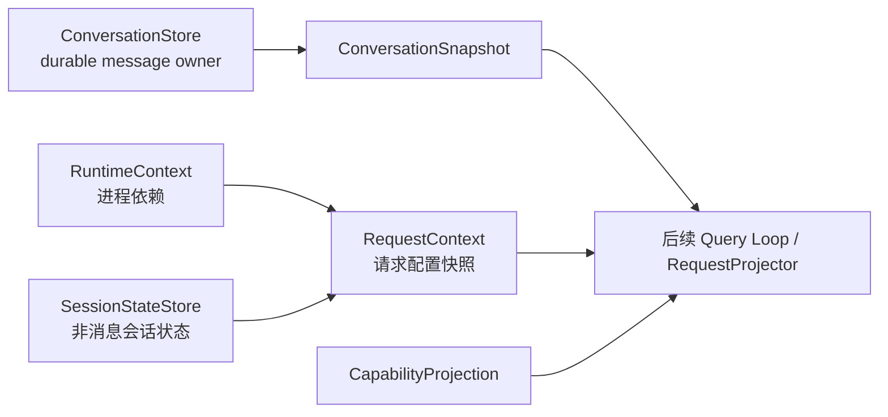

这是显式组合，而不是再造一个“万能 AppState”。后续 Query Loop 将同时接收 request context、conversation snapshot 和 capability snapshot，各自带来源 revision。这样某个配置或工具 catalog 更新时，不会神秘地原地改变已经发出的模型请求。

累计回归命令：

```powershell
cd "D:\agent\Claude code最新\mini-agent-harness"
powershell -NoProfile -ExecutionPolicy Bypass -File .\tests\run-h2-regression.ps1
```

【运行验证】H2-in-progress 4/4 检查通过，其中完整包含 H1 12/12 和 S0 15/15；新增 ConversationStore 的 TypeScript 10/10、Python 11/11 与累计 strict typecheck 均通过。

## 迁移到 Java/Spring：把所有权做成事务边界

如果你在企业项目中用 Java/Spring 实现同类机制，不要从 `List<ChatMessage>` controller 参数开始。先定义四层：

```text
ConversationApplicationService
-> ConversationRepository
-> immutable MessageEnvelope domain model
-> ProviderRequestProjector
```

一个可行的持久化模型是：

```text
conversation(id, revision, status, updated_at)
message_envelope(id, conversation_id, ordinal, kind, response_id, parent_id, payload)
tool_call(id, assistant_envelope_id, state, idempotency_key)
tool_result(id, tool_call_id, envelope_id, is_error)
```

提交消息时执行条件更新：

```sql
update conversation
set revision = revision + 1
where id = :id and revision = :expectedRevision
```

affected rows 为 0 就抛并发冲突，让 application service 重新读取。tool call 使用独立唯一键和状态机，避免 HTTP 重试重复执行副作用。Message payload 可以是 JSON，但 kind、conversation ID、response ID、tool-call foreign key 等高价值关系不要全部藏在不可查询的大 JSON 里。

Spring transaction 只覆盖 durable publication；progress 更适合事件总线、SSE/WebSocket 或短期缓存，不应每秒更新主 conversation revision。Outbox 可以在同一事务中记录“revision 8 已发布”事件，异步投影 UI、检索索引和审计日志。

### RAG 场景为什么同样需要这些边界

RAG 系统中，一条“检索结果”可能同时出现在：

- tool result 原始证据；
- 经重排和截断后的 model context；
- UI citation；
- 可审计 retrieval trace；
- 缓存和评估样本。

如果它们共用同一可变对象，后续脱敏、截断或重排可能污染审计原文。正确做法是保存 durable evidence envelope，再为当前请求产生 projection；citation ID、document ID、chunk ID、tool-use ID 和消息 envelope ID 各自表达不同关系。

### LangGraph 不会替你定义消息真相

LangGraph 可以管理 state channel、checkpoint 和节点编排，但你仍要决定：

- channel 里的 message 是 durable event 还是 request projection；
- reducer 是 append、replace 还是按 ID merge；
- 并发分支如何检测重复 tool result；
- checkpoint 是否包含 ephemeral progress；
- provider response ID 与 graph task ID 是否混用。

框架提供承载机制，不替项目定义身份和所有权契约。把 H2 的不变量写清后，才知道怎样配置 reducer、checkpoint schema 和并发合并。

## 把消息层提升到企业级

从本单元自然推出的生产要求包括：

- **幂等**：tool call、message append 和 client retry 使用不同 idempotency key；
- **隐私**：trace 记录 ID、revision 和结果状态，不复制 prompt、凭据或 tool payload；
- **保留策略**：durable transcript、运营日志、训练样本和 ephemeral progress 使用不同 TTL；
- **可观测性**：监控 revision conflict、pairing repair/failure、orphan ratio 和 projection drop reason；
- **Schema 演进**：reader 兼容旧 progress parent 或旧 message kind，writer 只产生新格式；
- **成本**：长历史不应每次深复制全量对象，可用 append-only segment 与 immutable view；
- **安全**：合成 tool result 必须带 synthetic/error provenance，不能冒充真实工具成功；
- **恢复**：检测 parent cycle、dangling parent 和并行 sibling，不把“取最后一条消息”当完整恢复算法。

这些要求的共同点是：不要让一个字段、一个数组或一个日志文件同时承担所有语义。

## 资深 Agent 开发岗面试：从结论讲到源码和系统设计

下面的问题不是背诵题库。先独立说两分钟，再对照回答检查：第一句是否给了结论，是否能沿机制说到 Claude Code 的决定性设计，以及是否能承接失败与企业追问。

### 问题 1：为什么成熟 Agent 系统不能把会话历史设计成一个大家共享的 `messages` 数组？

**两分钟回答：**结论先说，共享数组可以作为局部实现，但不能成为跨组件的隐式一致性协议，因为它没有说明谁拥有修改权、一次请求看见哪个版本，以及 replacement 后别名是否还一致。Claude Code 的 REPL 用 `messagesRef.current` 作为同步 owner，React state 只是渲染投影；Headless 则让 `print.ts` 的 `mutableMessages` 和 QueryEngine 字段在普通 `push` 下共享同一引用。问题在于 QueryEngine 的 `setMessages(fn)` 可以把字段重绑定到新数组，外部变量不会自动跟随，所以源码本身就暴露了 alias contract 的脆弱性。进入请求前它还会做数组 spread，这只固定成员，不深冻结对象。企业实现里我会用单一 ConversationStore 或 Repository，publication 带 revision，reader 拿 immutable snapshot，stale writer 显式冲突。这样 UI、请求投影、Transcript 和工具执行都通过接口协作，而不是约定“千万别换数组”。如果继续追问分布式实现，我会落到数据库 compare-and-set、outbox 和 tool idempotency key。

### 问题 2：`const messages = [...mutableMessages]` 能不能叫不可变快照？

**两分钟回答：**严格说只能叫数组成员的浅快照。它创建了新容器，所以 owner 后续 `push` 不会让旧 view 增长；但两个数组仍引用同一批 message object，嵌套字段可以从别的别名被修改。Claude Code 的 streaming API 正好有这个实例：`content_block_stop` 时 assistant message 已经 yield，稍后的 `message_delta` 才把最终 usage 和 `stop_reason` 直接写回同一个嵌套对象，延迟 Transcript writer 因为持有引用也能看到最终值。所以 `readonly Message[]`、数组 spread 和深不可变是三回事。设计时我会先问 publication 后字段是否允许补写；若允许，就明确 mutable lifecycle 和 completion boundary；若不允许，就 clone/freeze 或用 immutable record。H2 教学 Harness 选择深复制加冻结，是为了让请求 reader 的推理简单，但生产上会评估全量复制成本，可能换成 append-only event 或 persistent collection。

### 问题 3：一条 assistant 工具调用为什么需要多个 ID？只保留全局 UUID 不行吗？

**两分钟回答：**不行，因为这些 ID 表达的不是同一种唯一性。Claude Code 的 envelope UUID 标识本地消息节点；assistant `message.id` 把同一次 provider response 的多个流式 fragment 归组；`tool_use.id` 和 `tool_result.tool_use_id` 是模型协议的调用配对键；Transcript 的 `parentUuid` 描述恢复拓扑；SDK 的 `session_id` 和 `parent_tool_use_id` 面向外部宿主。并行 tool use 时，同一 response 可以生成多个不同 UUID 的 assistant envelope，各自有 result parent edge，但仍共享 response ID。只留一个 UUID 会失去 provider 分组或工具配对语义；把 response ID 当 envelope key又会覆盖 sibling。企业设计里我会用不同 value object 和数据库唯一约束，让编译器、schema 与存储同时阻止混用，并保留 trace correlation ID 作为观测关系，而不是拿它替代领域主键。

### 问题 4：为什么检查 `role === 'user'` 不能统计真实用户轮次？

**两分钟回答：**因为 provider role 是协议角色，不是领域来源。工具结果通常也放在 user-role content 中，系统 meta message 也可能复用 user envelope。Claude Code 的 `isHumanTurn()` 除了检查 user type，还排除 meta 和常见 `toolUseResult`；但附件逻辑又指出某些 subagent result 的 content 含 `tool_result`，本地 result 字段却可能是 `undefined`，所以局部 helper 也不是所有历史形状上的完备真理。我会在领域层定义 `HumanInput`、`ToolResult`、`SystemControl` 等显式 kind，在 provider adapter 才映射为 user/assistant role。统计、标题生成、权限和审计根据领域 kind 做决策；API projection 根据 content block 做协议校验。这样不会因为 provider 为了 role alternation 把 tool result 编成 user，就把工具输出算成用户新一轮意图。

### 问题 5：tool-use/tool-result 配对出错时，应该自动修复还是直接失败？

**两分钟回答：**结论是按数据用途和风险分层，不能全局选一个答案。Claude Code 的 `ensureToolResultPairing()` 在普通路径会删除孤儿、去重并为 missing use 插入 synthetic error result，目的是让旧会话或中断历史还能继续；strict 模式则直接抛错，因为训练轨迹一旦注入合成 placeholder，后续模型输出的条件已经被改变。H2 选择 fail closed，因为当前目标是建立可证明的请求契约：orphan 和 duplicate 不能发布，missing 与不相邻结果不能进入 provider request。生产系统里，用户恢复场景可以有带 provenance 的 repair 层，但原始事件必须保留，修复结果不能伪装成真实执行；安全、计费、训练数据和审计路径通常更适合严格失败。面试继续追问时，我会补充 repair metrics、dead-letter、人工恢复以及幂等重放。

### 问题 6：progress 为什么不应该和普通消息一起持久化？

**两分钟回答：**核心原因是它的生命周期和一致性要求不同。progress 是高频、可丢、面向 UI 或 SDK observer 的临时状态；普通 user、assistant 和 tool result 则参与模型上下文与恢复拓扑。Claude Code 当前 `isLoggableMessage()` 和 `isTranscriptMessage()` 都排除 progress，旧 transcript 曾把它放进 parent chain，loader 现在还要做 bridge 才能避免真实后继消息在恢复时被截断。这说明把 ephemeral tick 当 durable node 会增加 fork 和 dangling parent 风险。企业实现里我会让 progress 走 SSE、WebSocket 或短 TTL stream，durable store只记录开始、完成、失败等状态转移；必要时把聚合后的里程碑写审计事件。这样能降低写放大，也能让 replay 重建业务状态，而不是重放每秒一次的动画更新。

### 问题 7：并行工具调用为什么会让 Transcript 恢复比链表复杂？

**两分钟回答：**因为运行序列可以线性展示，但因果关系已经分叉。Claude Code 的 streaming 层可能为同一次 provider response 的多个 tool-use block生成多个 assistant envelope；每个 tool result 又通过 `sourceToolAssistantUUID` 挂到自己的 assistant。这样 `parentUuid` 拓扑是 DAG，单个 leaf 向上走只能保留一个分支。源码中的 `recoverOrphanedParallelToolResults()` 会按共享 provider message ID 找 sibling，再按 parent UUID 找对应 result，把单链 walk 漏掉的节点补回。企业系统如果支持并行工具，我不会把恢复模型设计成“每条记录只有 previousId 就够了”；会明确 turn/group ID、causation ID、tool-call relation 和 join barrier，并验证所有分支恰好完成一次。若需要严格审计，最好保存 append-only event graph，再为 UI 和 provider生成线性 projection。

### 问题 8：让你用 Java/Spring 设计 ConversationStore，你会怎样处理并发、幂等和可观测性？

**两分钟回答：**我会把 durable publication 设计成带版本条件的事务，而不是在 JVM 内给 List 加锁。conversation 表保存 revision，append 时 `where revision = expectedRevision` 做 compare-and-set；message envelope 用独立主键和 ordinal，tool call 有唯一 idempotency key，tool result 对 tool call 建唯一约束。事务里同时写 outbox，提交后异步投影 UI、检索索引和审计。读取请求时拿明确 revision 的 snapshot，provider projector 做 role、附件和 pairing 校验。progress 不推进主 revision，走短期 event channel。可观测性方面我只记录 conversation ID、revision、operation、冲突和 pairing reason，不把 prompt 或凭据打进日志；指标关注 conflict rate、orphan rate、repair rate、projection latency。这样单机锁、数据库一致性、外部重试和隐私边界分别有明确机制，不会都塞进一个 synchronized 方法。

## 离开本单元前，完成一次真正的闭环

不要只确认“代码跑通”。请在不看前文的情况下完成下面的任务：

1. 画出 REPL `messagesRef` 与 React state 的 owner/projection 关系，并说明为什么用户提交后能在同一调用栈读取新消息。
2. 用两个数组和一个共享对象解释 shallow snapshot 的两种观察结果。
3. 为一轮并行工具调用写出 envelope UUID、response ID、tool-use ID 和 parent ID，确保没有复用语义。
4. 构造 human user 与 user-role tool result，说明为什么 role classifier 会误判。
5. 分别解释 missing result 为什么可以暂存在 store、却不能进入下一次 provider request。
6. 运行双语言测试，破坏 clone、revision 和 pairing 三个不变量，记录失败现象与恢复后的结果。
7. 用两分钟回答“共享 messages 数组有什么问题”，并准备承接数据库 CAS、outbox 和幂等追问。

能完成这些任务，你才真正为 M11-M15 做好了准备：后续单元可以开始讨论 Query Loop 如何消费 view、模型 stream 如何产生 assistant fragment，以及 Tool Loop 如何把结果写回 owner，而不必再把“消息是什么”含糊地留在变量名里。

## 源码定位地图

以下行号只帮助当前快照定位，源码符号和决定性分支才是稳定锚点：

| 问题 | 文件与符号 | 决定性语义 |
| --- | --- | --- |
| REPL owner | `src/screens/REPL.tsx`，`messagesRef`、包装后的 `setMessages`、`onQueryImpl` | ref 先同步更新，state 是 render projection |
| Headless owner | `src/cli/print.ts`，`mutableMessages` 与 `ask()` | 跨 command 数组传入 QueryEngine |
| QueryEngine view | `src/QueryEngine.ts`，constructor、`submitMessage()`、`getMessages()`、`ask()` | 字段 alias、`push`、数组 spread 与可选 rebind |
| message creators | `src/utils/messages.ts`，`baseCreateAssistantMessage()`、`createUserMessage()`、`createProgressMessage()` | envelope UUID、provider message ID、local metadata |
| human predicate | `src/utils/messagePredicates.ts:isHumanTurn()` 与 `src/utils/attachments.ts:hasToolResultContent()` | role、字段与 content classifier 的边界 |
| API projection | `src/utils/messages.ts:normalizeMessagesForAPI()` | attachment 转 user messages，内部消息被过滤或合并 |
| tool pairing | `src/utils/messages.ts:ensureToolResultPairing()` | missing、orphan、duplicate、strict 与 repair |
| stream late mutation | `src/services/api/claude.ts` 的 `message_delta` 分支 | 已 yield assistant 的 usage/stop reason 被补写 |
| Transcript write | `src/utils/sessionStorage.ts`，`insertMessageChain()`、`isLoggableMessage()`、`cleanMessagesForLogging()` | parent override、progress/attachment filter |
| Transcript read | `src/utils/sessionStorage.ts`，`isTranscriptMessage()`、`buildConversationChain()`、`recoverOrphanedParallelToolResults()` | legacy progress bridge 与并行 DAG 恢复 |
| SDK message protocol | `src/entrypoints/sdk/coreSchemas.ts` | 外部 discriminant、UUID、session 与 parent tool-use ID |

证据状态说明：上述 Claude Code 行为均为当前本地源码的`快照事实`；双语言测试结果是`运行验证`；H2 的单 owner、revision、深冻结和 fail-closed pairing 是`设计迁移`。当前快照缺失的完整内部 message type 不由教材推测补全。
