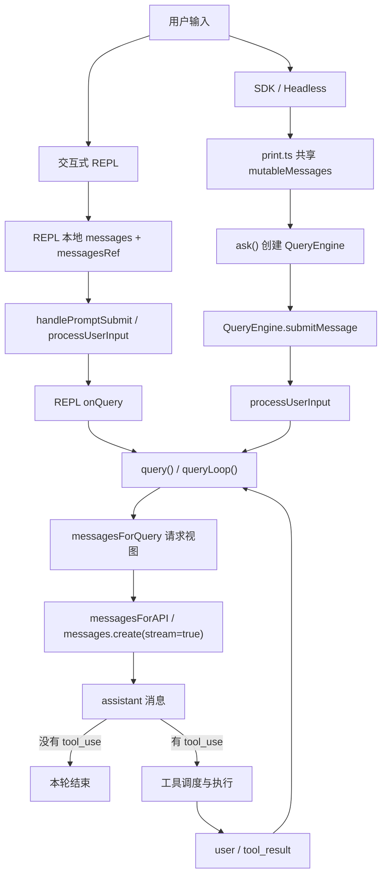
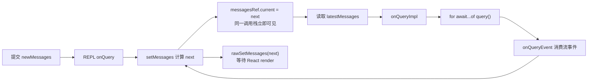
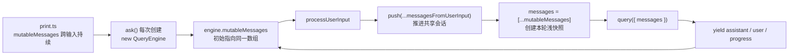
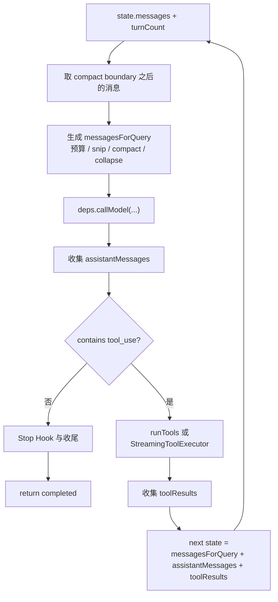
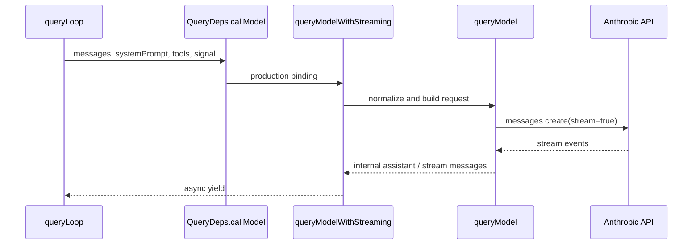
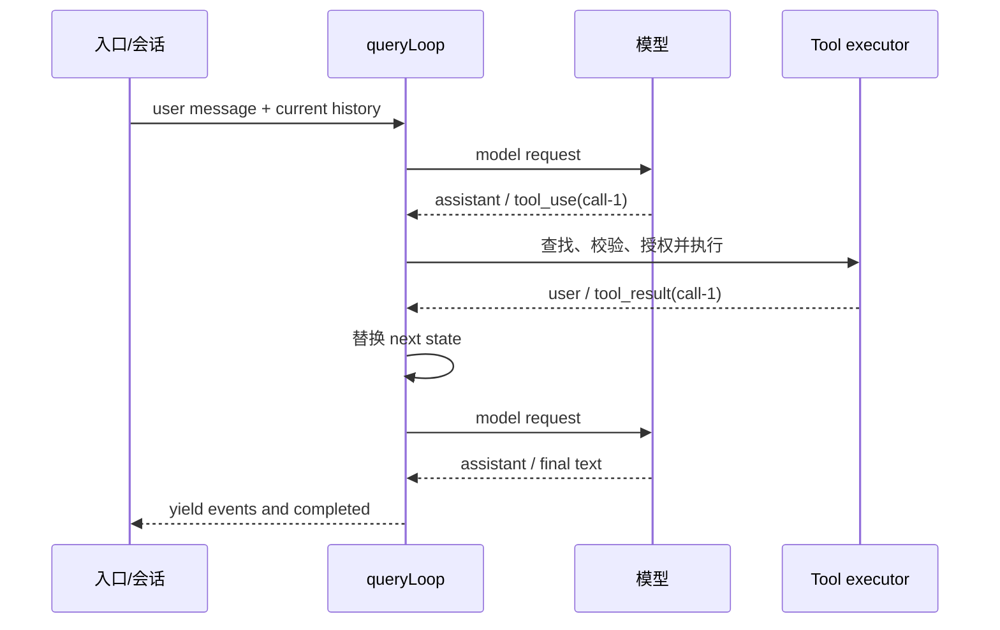
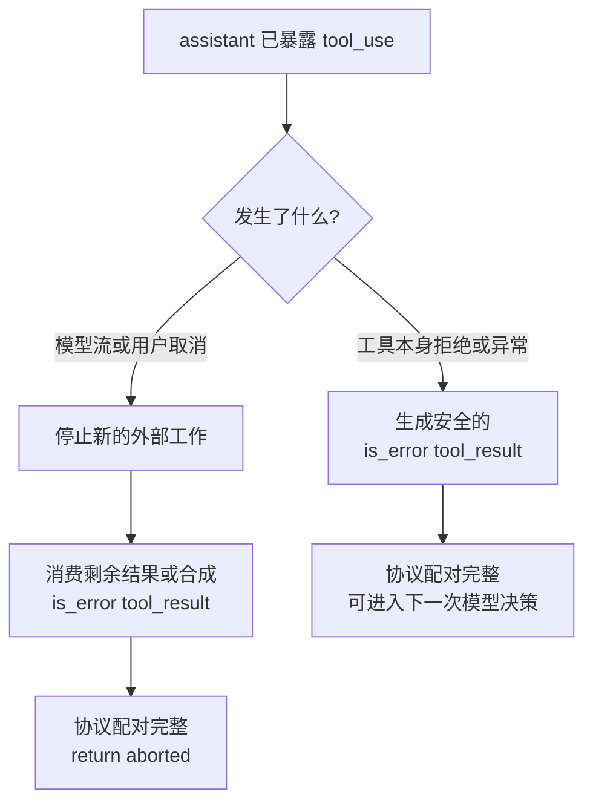
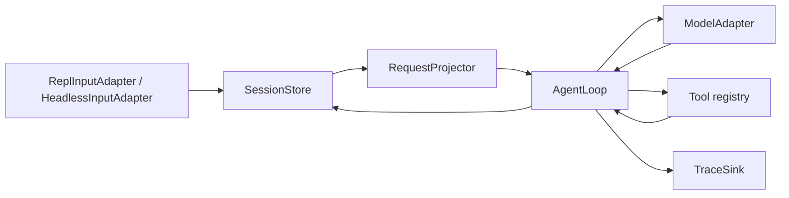

# M11 标杆纵切：一条用户消息怎样穿过状态、请求投影和 Tool Loop

> 本单元主体阅读与源码跟踪约 4.5 至 6.5 小时。双语言实验、故障注入和扩展挑战另计约 2 至 3 小时。

假设你在 Claude Code 里输入：

```text
上海今天多少度？请查到真实结果后回答。
```

表面上只有一句话。真正运行时，系统至少要完成五次语义转换：终端里的字符要成为内部用户消息；可变会话历史要变成本轮稳定输入；稳定输入要经过上下文投影和 API 正规化；模型返回的 `tool_use` 要变成本地工具执行；执行结果又要成为一条模型能够理解的 `tool_result`，触发第二次模型请求。

如果只知道“`query()` 会调用模型”，你会在三个地方做错设计：

- 把 UI 状态、会话历史和 API messages 当成同一个数组；
- 把工具调用理解成模型函数的内部回调，看不见它实际上跨越了一轮消息协议；
- 把 REPL 和 Headless 画成一条入口链，误以为 REPL 必经 `QueryEngine`。

这三个错误会直接传染到恢复、并发、压缩和多 Agent 设计。本单元的目标不是记住一长串函数名，而是建立一张以后能够不断放大的运行地图。

本地 `claude-code-CLI/` 是从发布包 source map 得到的静态源码快照。本单元把直接读到的内部实现标为“快照事实”，把本单元代码运行得到的结果标为“运行验证”，把 Mini Agent Harness 方案标为“设计迁移”。快照缺少原始测试和完整构建元数据，所以这里不会声称“Claude Code 原项目测试通过”，也不会猜测所有 feature gate 在某个线上环境中的取值。

## 先把整条路看见

同一句用户输入有两种主要进入方式，但它们不是从第一行就共享代码。



先只看主干：两条入口都把原始输入变成内部消息，然后在 `query()` 汇合。`queryLoop()` 每轮从已有消息派生请求视图，调用模型；如果响应没有工具调用就结束，如果有工具调用就执行工具，把结果写成用户侧的 `tool_result` 消息，再回到循环顶部。

注意图中的两个“不等于”：

```text
REPL messagesRef != QueryEngine.mutableMessages
会话消息历史 != 本次 API messages
```

后面所有源码细节，都是在解释这两个不等式为什么成立。

## 先走一次没有工具的最小轮次

把问题暂时改成：

```text
请只回答“收到”。
```

最小轮次可以抽象成：

```text
raw input
-> internal UserMessage
-> current query snapshot
-> request projection
-> API request
-> internal AssistantMessage(text)
-> no tool_use
-> completed
```

内部 `UserMessage` 不是一个裸字符串。快照中的 `createUserMessage()` 会生成带有 `type: 'user'`、API role、content、UUID、timestamp 和若干元数据的对象。决定性片段位于 `src/utils/messages.ts` 的 `createUserMessage()`（约 460 行）：

```ts
const m: UserMessage = {
  type: 'user',
  message: { role: 'user', content: content || NO_CONTENT_MESSAGE },
  uuid: uuid || randomUUID(),
  timestamp: timestamp ?? new Date().toISOString(),
  // 还有 meta、toolUseResult、permissionMode、origin 等内部字段
}
```

这里已经能看出第一层边界：内部消息包含 UI、恢复、权限和工具执行需要的信息；API 最终只接受其中一部分。若你直接把内部对象序列化给模型，轻则请求 400，重则把本应只在本地存在的元数据泄露出去。

普通文本走 `src/utils/processUserInput/processTextPrompt.ts` 的 `processTextPrompt()`。它创建 user message，并返回：

```ts
{
  messages: [userMessage, ...attachmentMessages],
  shouldQuery: true,
}
```

`shouldQuery` 很重要。输入可能是本地命令、被 Hook 阻止的请求或不需要模型的操作。输入处理器不仅“解析文本”，还决定是否应该进入 Agent 主循环。

现在先记住三个对象：

- 原始输入 `input`：终端或 SDK 交给入口适配器的值；
- `messagesFromUserInput` / `newMessages`：输入处理器新生成的一组内部消息；
- 已有会话历史：在新消息到来前已经存在的 user、assistant、attachment、progress 等对象。

入口的首要责任，是把前两者按正确时机合入第三者。

## REPL：为什么同时需要 React state 和同步 ref

交互式路径从 `src/screens/REPL.tsx` 开始。主会话消息在这里不是 AppState 的字段，而是局部 React 状态：

```ts
const [messages, rawSetMessages] = useState<MessageType[]>(initialMessages ?? [])
const messagesRef = useRef(messages)
```

如果你来自 Java，可以先把它们理解成两个不同角色：

- `messages` 类似一次 UI render 看到的不可变快照；
- `messagesRef.current` 类似一个生命周期跨 render、可立即读写的引用盒子。

但不要把 `useRef` 简化为 Java 的 `AtomicReference`。它不自带原子并发保证，也不会通知 React 重绘。它只是让同一个组件生命周期中的回调能够访问最新值。

为什么不能只调用 React 的 `setMessages(prev => ...)`，然后立刻读取 `messages`？因为状态更新由 React 调度，当前闭包捕获的 `messages` 仍可能是旧 render 的值。Claude Code 用一个包装器同时更新 ref 和 render state：

```ts
const setMessages = useCallback(action => {
  const next = typeof action === 'function'
    ? action(messagesRef.current)
    : action
  messagesRef.current = next
  rawSetMessages(next)
}, [])
```

源码中的真实实现还处理输入占位符和数组缩短，这里只保留改变语义的核心。它保证 `setMessages()` 返回时，`messagesRef.current` 已是新数组；React 是否已经完成下一次 render 不再影响当前查询读取最新消息。

这是本单元第一个 TypeScript/React 难点：

```ts
setMessages(old => [...old, ...newMessages])
```

`old => ...` 是函数式更新。`...old` 和 `...newMessages` 使用数组展开，创建一个新的外层数组。它不会深复制每个消息对象。可以画成：

```text
旧数组 A -> [Message#1, Message#2]
新数组 B -> [Message#1, Message#2, Message#3]
             ^          ^          ^
             仍可能是相同对象引用
```

因此“创建快照”只意味着后续 `push` 不会改变旧数组的长度，不意味着 Message 内部字段永远不会被修改。后面你会看到流式响应确实可能更新消息对象中的 usage/stop reason。把浅拷贝误说成深不可变，会导致错误的并发假设。

### 用户提交后发生了什么

`REPL.tsx` 的提交回调把参数交给 `handlePromptSubmit()`。真正的核心执行位于 `src/utils/handlePromptSubmit.ts`：

```text
handlePromptSubmit()
-> 检查空输入、退出命令、粘贴内容和并发队列
-> executeUserInput()
-> processUserInput()
-> 汇总 newMessages
-> onQuery(newMessages, abortController, shouldQuery, ...)
```

`executeUserInput()` 在等待输入处理前先占用 `QueryGuard`。这不是为了本单元展开完整并发机制，而是为了守住一个重要不变量：同一个 REPL 主线程不能让两个用户提交同时修改同一轮 Query 状态。当前轮在运行时，新输入进入队列，或在允许打断的工具场景触发取消。

`processUserInput()` 再把普通文本、图片、附件、斜杠命令、Hook 结果分流。普通文本最终交给 `processTextPrompt()`；如果 `UserPromptSubmit` Hook 阻止继续，它可以返回 `shouldQuery: false`。所以这条路径不能粗暴画成“按 Enter 必然调用模型”。

得到 `newMessages` 后，REPL 的 `onQuery()` 做决定性的两步：

```ts
setMessages(oldMessages => [...oldMessages, ...newMessages])
const latestMessages = messagesRef.current
await onQueryImpl(latestMessages, newMessages, ...)
```

由于包装后的 `setMessages` 同步更新 ref，`latestMessages` 已包含刚才的用户消息。`onQueryImpl()` 构造工具上下文、system prompt、user context 和 system context，然后直接消费 `query()`：

```ts
for await (const event of query({
  messages: messagesIncludingNewMessages,
  systemPrompt,
  userContext,
  systemContext,
  canUseTool,
  toolUseContext,
  querySource: getQuerySourceForREPL(),
})) {
  onQueryEvent(event)
}
```

`for await...of` 用来消费 `AsyncIterable`。与 Java 增强 for 循环不同，它每次等待一个异步产生的值；与 `await query()` 也不同，后者假设只有一个最终结果。模型文本、thinking、工具进度、附件和错误可以边产生边交给 UI，这就是生成器接口的价值。

此时可以准确回答“REPL 的消息由谁拥有”：

- `REPL.tsx` 的局部 `messages`/`messagesRef` 直接拥有主会话消息数组；
- AppState 提供 Permission、Tool、Task、MCP 等运行上下文；
- `query()` 接收本轮输入，但不成为 REPL 跨轮会话的长期所有者；
- `onQueryEvent()` 把 query 产生的新内部消息追加回 REPL 状态。

“AppState 参与运行”与“AppState 拥有主会话消息”不是同一句话。

把 REPL 的这段细节压缩成一张“写入与读取时序图”：



复习时只要抓住两条不同节奏的边：`messagesRef` 是当前调用栈的立即读取面，React state 是下一次 render 的 UI 投影面。两者写入同一个 `next`，但被观察的时机不同。

## Headless：共享数组与 QueryEngine 是怎样配合的

Headless/SDK 路径没有 React 组件。`src/cli/print.ts` 在会话运行闭包中保存：

```ts
const mutableMessages: Message[] = initialMessages
```

它会跨多次输入继续存在。每次处理队列中的命令，`print.ts` 调用 `ask({ ..., mutableMessages })`。

`ask()` 位于 `src/QueryEngine.ts`。它是一个方便的一次调用包装器：

```ts
const engine = new QueryEngine({
  ...,
  initialMessages: mutableMessages,
})

yield* engine.submitMessage(prompt, { uuid: promptUuid, isMeta })
```

这里有一个容易忽略的细节：Headless 会话跨调用的数组由 `print.ts` 保存；`ask()` 每次都会创建新的 QueryEngine。`QueryEngine` 的注释说“一次会话一个 engine”，表达了类的目标抽象，但当前 `print.ts -> ask()` 包装路径并不是把同一个实例跨所有输入复用。教材必须以真实调用者为准，而不是只读类注释。

构造器最初把传入数组引用赋给字段：

```ts
this.mutableMessages = config.initialMessages ?? []
```

普通文本被处理后：

```ts
this.mutableMessages.push(...messagesFromUserInput)
const messages = [...this.mutableMessages]
```

第一行修改 engine 当前持有的数组。对普通 prompt，它最初与 `print.ts` 的共享数组是同一个对象，所以 push 同时推进 Headless 会话历史。第二行创建本次 `query()` 使用的浅拷贝，隔离后续数组结构变化。

这可以用 Java 写成近似形式：

```java
List<Message> shared = initialMessages;
shared.addAll(newMessages);
List<Message> requestSnapshot = new ArrayList<>(shared);
```

但 Java 对照只解释外层列表复制；两边都没有因此深复制每个 Message。

`QueryEngine.submitMessage()` 最终也直接消费同一个 `query()`：

```ts
for await (const message of query({
  messages,
  systemPrompt,
  userContext,
  systemContext,
  canUseTool: wrappedCanUseTool,
  toolUseContext: processUserInputContext,
  querySource: 'sdk',
})) {
  // 更新 mutableMessages、transcript、usage，再输出 SDKMessage
}
```

因此，两条入口的准确比较是：

| 问题 | REPL | SDK / Headless |
| --- | --- | --- |
| 跨轮主消息容器 | 组件本地 `messages` + `messagesRef` | `print.ts` 共享 `mutableMessages` |
| 输入处理协调者 | `handlePromptSubmit` / `executeUserInput` | `QueryEngine.submitMessage` |
| 是否使用 QueryEngine | 当前否 | 是 |
| 输出消费者 | UI 的 `onQueryEvent` | QueryEngine 转换成 SDKMessage |
| 汇合点 | `query()` | `query()` |

这张表比“REPL 和 SDK 都调用 QueryEngine”多了一点复杂度，却避免了以后讨论恢复和并发时的大量错误。

再用图把 Headless 中最容易混淆的“共享引用”和“本轮快照”分开：



这张图限定在普通 prompt 的主路径：`push` 改变长期容器，展开运算则为当前 `query()` 创建外层数组快照。后续的 compact、transcript 和 resume 会让这条线更复杂，但不改变本单元需要的这个所有权起点。

## `query()` 不是模型客户端，而是循环边界

`src/query.ts` 的公开入口很短：

```ts
export async function* query(params: QueryParams) {
  const consumedCommandUuids: string[] = []
  const terminal = yield* queryLoop(params, consumedCommandUuids)
  // 正常完成后确认已消费命令
  return terminal
}
```

`yield*` 把另一个生成器产生的所有值继续向外转发，并取得它最后的 return value。你可以把 `query()` 看成协议外壳，把 `queryLoop()` 看成状态机主体。

`queryLoop()` 不是递归地不断调用自己，而是维护一个局部 `state` 并进入 `while (true)`。每一轮开始时解构：

```ts
let state = {
  messages: params.messages,
  toolUseContext: params.toolUseContext,
  turnCount: 1,
  // 还有 compact、输出恢复、stop hook 等状态
}

while (true) {
  const { messages, turnCount } = state
  // 投影请求、调用模型、执行工具、决定 return 或替换 state 后 continue
}
```

这一结构揭示了状态所有权：

- REPL/Headless 的会话容器属于入口层；
- `queryLoop.state` 属于一次 `query()` 执行；
- 每次工具轮转都会替换 `state`，但不会把数组结构直接写回 REPL 调用参数；
- query 产生的消息通过 generator `yield` 返回入口，入口再决定如何持久化和展示。

这种设计允许相同主循环服务不同入口，也允许测试注入 fake model。代价是必须非常清楚哪些状态由调用者长期拥有，哪些只在一次生成器生命周期内有效。

`queryLoop()` 的控制流可以还原为一个会替换 `state` 的循环状态机：



图中回到顶部的不是原始入参数组，而是新的局部 `state`。这是“一次用户输入内可以有多个模型轮次”的决定性结构。

## 从会话历史到请求：模型看见的是投影，不是数据库

每轮开始时，`queryLoop()` 先创建：

```ts
let messagesForQuery = [...getMessagesAfterCompactBoundary(messages)]
```

随后可能依次执行 Tool Result Budget、history snip、microcompact、context collapse 和 autocompact。不同 feature gate 会改变具体路径，但稳定的设计事实是：`messagesForQuery` 是本次请求视图，不是会话 source of truth。

为什么 Agent 系统需要这一层？设想工具刚读取一个 5 MB 日志文件。会话历史需要保留“读过什么、结果属于哪个工具调用、恢复时发生过什么”；模型请求却不能每轮重复发送完整 5 MB。一个成熟 Harness 通常需要同时维护：

```text
durable history: 发生过什么
request view: 这次模型应该看见什么
```

如果压缩函数直接破坏 durable history，恢复和审计会丢失事实；如果请求永远发送 durable history，token、延迟和隐私成本会失控。

在调用模型依赖前，源码还把 `userContext` 前置到请求视图：

```ts
for await (const message of deps.callModel({
  messages: prependUserContext(messagesForQuery, userContext),
  systemPrompt: fullSystemPrompt,
  tools: toolUseContext.options.tools,
  signal: toolUseContext.abortController.signal,
  options: { model: currentModel, querySource, ... },
})) {
  // 消费流
}
```

所以 `messagesForQuery` 仍不是最终 API messages。

进入 `src/services/api/claude.ts` 的 `queryModel()` 后，才执行：

```ts
let messagesForAPI = normalizeMessagesForAPI(messages, filteredTools)
messagesForAPI = ensureToolResultPairing(messagesForAPI)
```

`normalizeMessagesForAPI()` 位于 `src/utils/messages.ts`。它会过滤只用于显示或进度的消息，把附件正规化成模型可见 user 内容，合并连续 user 消息，正规化 tool input，处理无效媒体和其他 API 约束。`ensureToolResultPairing()` 再修复恢复场景中的孤立工具消息。

最终参数构造器才产生：

```ts
return {
  model: normalizeModelStringForAPI(options.model),
  messages: addCacheBreakpoints(messagesForAPI, ...),
  system,
  tools: allTools,
  max_tokens: maxOutputTokens,
  ...
}
```

因此需要区分四层消息：

| 层次 | 例子 | 主要用途 | 谁修改 |
| --- | --- | --- | --- |
| 会话历史 | REPL `messagesRef`、Headless `mutableMessages` | UI、恢复、跨轮连续性 | 入口协调者 |
| Query Loop 状态 | `state.messages` | 当前 Agent 运行的控制流 | `queryLoop()` continue sites |
| 请求视图 | `messagesForQuery` | 边界、预算、压缩后的本轮上下文 | Context Pipeline |
| API 参数 | `messagesForAPI`、`params.messages` | 满足 Provider/API 协议 | `queryModel()` 请求构造 |

四层之间不是简单改名，而是每越过一层都会发生特定动作：

```mermaid
flowchart LR
  H["会话历史<br/>messagesRef / mutableMessages"]
  H -->|"选取并建立本次运行"| S["Query Loop<br/>state.messages"]
  S -->|"boundary / budget / snip / compact"| V["请求视图<br/>messagesForQuery"]
  V -->|"prependUserContext"| C["模型适配器输入"]
  C -->|"normalize + pairing + media/tool 约束"| A["API messages<br/>messagesForAPI"]
  A -->|"paramsFromContext + cache breakpoints"| P["params.messages"]
  P --> N["messages.create(stream=true)"]
```



复习这张图时，不只要能背出变量名，还要能说出箭头上的动词。变量名可能随版本变化，“会话事实与模型请求是两种生命周期”的设计约束更稳定。

面试中如果被问“`mutableMessages` 是否直接发送给 LLM”，一个准确的第一句是：

> 不是。它先成为当前 Query 的消息输入，再经过 compact boundary、预算/压缩等请求视图处理；进入模型适配器后还会正规化为 API messages 并修复工具配对，最终才进入 `messages.create`。

这句话给出结论，也为继续追问保留了清晰层级。

## 真实网络请求在哪里发生

`queryLoop()` 不直接导入网络客户端，而是使用依赖对象：

```ts
const deps = params.deps ?? productionDeps()
```

`src/query/deps.ts` 的生产绑定是：

```ts
export function productionDeps(): QueryDeps {
  return {
    callModel: queryModelWithStreaming,
    microcompact: microcompactMessages,
    autocompact: autoCompactIfNeeded,
    uuid: randomUUID,
  }
}
```

这是依赖注入。它不是为了“让代码看起来高级”，而是把 I/O 边界变成可替换端口。测试可以传入 scripted model，不需要 mock 整个模块图；生产则使用真实流式适配器。

生产调用链为：

```text
queryLoop
-> deps.callModel
-> queryModelWithStreaming
-> queryModel
-> paramsFromContext
-> anthropic.beta.messages.create({ ...params, stream: true })
```

真实请求位于 `src/services/api/claude.ts` 的 `queryModel()` 内：

```ts
const result = await anthropic.beta.messages
  .create(
    { ...params, stream: true },
    { signal, headers: clientRequestId ? { ... } : undefined },
  )
  .withResponse()
```

`AbortSignal` 在这里抵达网络请求。模型响应不是一次性 AssistantMessage，而是一串 stream event。适配器逐步组装 thinking、text、tool input 和 usage，再向 `queryLoop()` yield 内部 assistant/stream 消息。

若最终 assistant 只有文本，没有 `tool_use`，`needsFollowUp` 保持 false，循环在 stop hook 等收尾后返回 `completed`。最小无工具轮次到这里结束。

从 `queryLoop()` 到网络的边界也值得单独记一张图，因为它说明了哪里可测试、哪里才是 I/O：



测试注入 fake model 时替换的是 `QueryDeps.callModel`，不需要伪造整个 UI、网络 SDK 和工具系统。生产环境则由 `productionDeps()` 把该端口绑定到真实流式适配器。

## 加入工具后，为什么模型必须请求两次

回到最初的天气问题。第一次模型请求不应该编造温度，而是返回类似：

```json
{
  "type": "tool_use",
  "id": "call-1",
  "name": "lookup_weather",
  "input": { "city": "Shanghai" }
}
```

这不是函数已经执行。它只是 assistant 消息中的一个协议块，表达“模型请求宿主执行这个工具”。

`queryLoop()` 在消费模型流时扫描 assistant content：

```ts
const msgToolUseBlocks = message.message.content.filter(
  content => content.type === 'tool_use',
)

if (msgToolUseBlocks.length > 0) {
  toolUseBlocks.push(...msgToolUseBlocks)
  needsFollowUp = true
}
```

如果 streaming tool execution 开启，`StreamingToolExecutor` 可以在工具输入完整后尽早调度；否则模型流结束后调用：

```ts
runTools(toolUseBlocks, assistantMessages, canUseTool, toolUseContext)
```

`src/services/tools/toolOrchestration.ts` 的 `runTools()` 会把连续的并发安全工具组成批次，把非并发安全工具串行处理。每个工具最终进入 `src/services/tools/toolExecution.ts` 的 `runToolUse()`，经历查找、输入校验、Hook、Permission 和真实执行。M15 会展开这些层次；本单元只抓住输出契约。

工具成功并不是返回一个任意 JavaScript 值给模型调用栈。源码把结果包装成内部 user message：

```ts
createUserMessage({
  content: [{
    type: 'tool_result',
    tool_use_id: toolUseID,
    content: mappedOutput,
  }],
  sourceToolAssistantUUID: assistantMessage.uuid,
})
```

未知工具、输入错误、权限拒绝、取消和执行异常也会形成 `tool_result`，并设置 `is_error: true`。这是 Agent Harness 的关键思想：错误不是只写日志，也不是抛出后让对话消失；只要安全允许，错误要回到模型能够推理的协议中。

完成一批工具后，`queryLoop()` 组装下一轮状态：

```ts
state = {
  messages: [
    ...messagesForQuery,
    ...assistantMessages,
    ...toolResults,
  ],
  toolUseContext: updatedToolUseContext,
  turnCount: turnCount + 1,
  transition: { reason: 'next_turn' },
  ...
}
```

然后 `while (true)` 回到顶部。第二次模型请求看到的核心序列是：

```text
user: 上海今天多少度？
assistant: tool_use(id=call-1, name=lookup_weather, ...)
user: tool_result(tool_use_id=call-1, content=31)
```

模型现在才能生成：

```text
上海当前观测温度为 31°C。
```

所以 Tool Loop 不是“模型调用工具再继续生成”的黑盒。它至少跨越两个模型请求，中间由 Harness 拥有执行权：

```text
模型提出意图
-> Harness 校验和授权
-> Harness 执行
-> Harness 把事实写回协议
-> 模型基于新事实继续
```

这也说明谁拥有状态：模型拥有不了本地文件、进程和权限状态；Tool 也不决定是否继续 Agent Loop；`queryLoop()` 才拥有本次轮转决定。

把两次模型请求放到时序图中，Tool Loop 就不再像一个隐藏的“函数回调”：



其中 `call-1` 是跨组件的关联键。没有它，并发工具的结果就无法稳定回到原始意图；只有它而没有下一轮消息协议，模型又看不到本地执行得到的新事实。

## 取消和失败怎样收敛

只讲成功路径会得到一个不能上线的 Harness。这里选择两个最能改变语义的失败，而不是穷举每个 `catch`。

### 模型流已经给出 tool_use，此时用户取消

最危险的中间状态是：assistant 的 `tool_use` 已经进入历史，但对应工具结果没有产生。如果下一次请求直接带着这段历史，API 会看到未配对的工具调用。

`query.ts` 在检测到流式取消时分两种情况：

- 有 `StreamingToolExecutor`：消费 `getRemainingResults()`，让排队中或执行中的工具形成取消/合成结果；
- 没有 streaming executor：调用 `yieldMissingToolResultBlocks()` 为已经输出的 `tool_use` 补错误结果。

收敛后返回 `aborted_streaming`。如果取消原因是新输入打断旧轮次，系统还可以省略重复的“用户中断”提示，因为队列里的新用户消息会提供下一步上下文。

这体现了一个通用不变量：

```text
任何已经持久化或向消费者暴露的 tool_use，最终必须有可解释的 tool_result 或明确的回滚/tombstone。
```

### 工具本身失败

`runToolUse()` 捕获异常后构造：

```text
user / tool_result
  tool_use_id = 原调用 ID
  is_error = true
  content = 可供模型理解的安全错误
```

Query Loop 正常进入下一轮。模型可以改参数、换工具或向用户说明失败。只有把错误变成领域消息，失败才进入 Agent 的决策闭环。

企业实现还要区分“可给模型看的错误”与“只能给日志和安全团队看的细节”。数据库连接串、命令环境和内部栈不能原样塞进 tool result。Claude Code 源码也有日志脱敏和诊断分层，后续安全与可观测单元会展开。

### 取消不是异常字符串

`AbortController` 表达的是协作式取消。调用者持有 controller，被调用者接收 `signal`。被调用者应在网络请求、工具执行和等待点检查 signal，并释放资源。不要把所有取消都转成普通 `Error("cancelled")` 后继续重试；那会把用户意图误判成系统故障。

Java 中最接近的设计通常不是直接依赖 `Thread.interrupt()`，而是显式的 `CancellationToken`/请求上下文，再把它桥接到 Reactor cancellation、HTTP client cancellation 和进程终止。Python `asyncio.CancelledError` 也要单独传播，不应被宽泛的 `except Exception` 吞掉。

把两条失败路径并在一起，可以看出“失败是否继续”和“协议是否完整”是两个不同决策：



所以“有错误结果”不等于“必须继续循环”。取消路径补齐结果后可以终止；普通工具失败则可以把决策权还给模型。两者都不应留下无主的 `tool_use`。

## 用可运行实验把心智模型变成证据

静态源码能说明当前快照“写了什么”，但你还需要亲手验证这些设计为何必要。本单元提供 TypeScript 与 Python 两套 clean-room 实现。它们遵守同一行为契约，不复制 Claude Code 私有实现。

代码位置：

```text
curriculum/units/M11/code/typescript/
  harness.ts
  harness.test.ts
  demo.ts

curriculum/units/M11/code/python/
  harness.py
  test_harness.py
  demo.py
```

### 先运行时间线

当前环境 Node 24 可以直接擦除可擦除的 TypeScript 类型：

```powershell
cd "D:\agent\Claude code最新\curriculum\units\M11\code\typescript"
node --experimental-strip-types demo.ts
```

Python：

```powershell
cd "D:\agent\Claude code最新\curriculum\units\M11\code\python"
python demo.py
```

两边都应出现同样的关键事件顺序：

```text
input.accepted
request.projected        messageCount=1
model.request            turn=1
assistant.received       contains tool_use
tool.started
tool.finished
tool_result.appended
request.projected        messageCount=3
model.request            turn=2
assistant.received       contains final text
loop.completed
```

`messageCount` 从 1 变成 3 是最直观的证据。第二次请求新增的两条消息分别是 assistant/tool_use 和 user/tool_result。

### 再运行四个契约测试

```powershell
cd "D:\agent\Claude code最新\curriculum\units\M11\code\typescript"
node --experimental-strip-types harness.test.ts

cd "D:\agent\Claude code最新\curriculum\units\M11\code\python"
python -m unittest -v test_harness.py
```

四个测试分别证明：

1. 工具轮次确实产生两次模型请求，第二次请求含匹配的结果；
2. 工具抛错不会破坏协议，错误结果仍进入第二次请求；
3. 工具阶段取消后不会发起第二次模型请求，且同一 assistant 消息中已暴露的每个 `tool_use` 都会留下可解释的取消结果；
4. 请求投影不会与后续会话数组共享结构，后续 append 不会污染已经捕获的请求。

本项目已实际运行这两套测试，TypeScript 4/4、Python 4/4 通过。这是“运行验证”，不是 Claude Code 原仓库测试。

### 一个真实的 TypeScript 陷阱

最初版本把构造器写成：

```ts
constructor(private readonly ids: IdSource) {}
```

这是 TypeScript 的“参数属性”语法：声明参数的同时生成并赋值字段。它需要编译转换，不属于 Node strip-only 可以简单删除的类型语法。Node 24 直接运行时抛出 `ERR_UNSUPPORTED_TYPESCRIPT_SYNTAX`。

可直接运行的版本改为：

```ts
private readonly ids: IdSource

constructor(ids: IdSource) {
  this.ids = ids
}
```

这个失败很有价值：TypeScript 不只是“带类型的 JavaScript”。有些语法只需擦除类型，有些语法需要真正编译生成 JavaScript。源码阅读时要知道当前项目经过哪种构建链，不能看到 `.ts` 就假设 Node 原生都能执行。

### 主动做四次破坏

不要只看绿色测试。按下面顺序修改一份副本，每次先写预期再运行：

1. 在 `AgentLoop` 组装下一轮前删掉 `toolResults`。预期：scripted model 的第二次断言失败，证明工具返回值不能走旁路。
2. 把 `RequestProjector.project()` 改成直接返回 SessionStore 内部数组，再在模型完成前追加消息。预期：已捕获请求长度发生变化，证明请求视图需要结构隔离。
3. 在工具取消后删除 `return { status: "cancelled" }`。预期：出现第二次 model request，证明取消必须改变控制流，而不是只记录状态。
4. 把工具错误改成直接 `throw` 出 AgentLoop。预期：模型无法看见失败，也不能选择恢复策略。

每次实验的反证条件都非常具体。若现象没有出现，不要立刻相信教材；先检查你修改的分支是否真的被 scripted model 触发。

## Mini Agent Harness：保留思想，不照抄形状

本单元的 clean-room Harness 有六个核心角色：



这里故意没有复刻 REPL 的 React ref 或 Headless 的共享裸数组。设计迁移允许改进所有权：

实验里的 `SessionStore` 和 `RequestProjector` 使用 `structuredClone()`。它是当前 Node 内置的结构化深复制 API，能处理 `Date`、`Map`、`Set` 和循环引用等常见值，但不能复制函数等非结构化数据。它与 `[...messages]` 只复制外层数组不同；这里选择深复制是为了让“请求不被会话后续修改污染”的实验边界更容易观察，不代表生产 Harness 必须对每轮全量深复制。

- `SessionStore` 成为唯一可变消息所有者；
- 两种 InputAdapter 只把外部输入转成领域消息；
- `RequestProjector` 只读取快照并产生请求，不修改会话；
- `ModelAdapter` 隐藏 Provider SDK；
- `AgentLoop` 拥有轮转和终止判断；
- `TraceSink` 观察事件，但不能修改业务状态。

这与快照的差异必须说清：

| 方面 | Claude Code 快照事实 | M11 设计迁移 |
| --- | --- | --- |
| 入口消息所有权 | REPL 与 Headless 使用不同容器 | 统一 `SessionStore` |
| 快照复制 | 多处为浅拷贝，并有对象更新语义 | 实验使用深复制，简化隔离证明 |
| 工具并发 | 支持 streaming executor 与安全分组 | 首版按顺序执行 |
| Context | 有预算、snip、compact、collapse | 只保留 `RequestProjector` 端口 |
| Permission/Hook | 完整执行链 | 本单元尚未实现 |
| 持久化/恢复 | Transcript 与 Resume 体系 | 本单元尚未实现 |

因此本单元的 Harness 决定是 `merge`：消息、请求投影、模型适配器、工具结果反馈和取消契约已经稳定且测试通过，可以作为 H2 纵切首版。但它不是最终 H2，也不能假装 H0/H1 已经发布。后续单元会把类型、生命周期、配置、权限、上下文和持久化逐层接入，并保持这四个行为测试回归。

## 迁移到 Java/Spring 时，先迁移所有权

在 Spring 项目里，最容易犯的错误是把 `SessionStore` 做成无隔离的 singleton bean：所有用户共享一个消息数组。正确作用域取决于部署方式，但至少要有明确 session key，并让同一会话的 append 和 run 串行化或乐观并发控制。

一种接口边界可以是：

```java
interface ConversationStore {
    List<Message> snapshot(SessionId sessionId);
    void append(SessionId sessionId, Message message);
}

interface RequestProjector {
    ModelRequest project(List<Message> snapshot, RequestPolicy policy);
}

interface ModelAdapter {
    Publisher<ModelEvent> stream(ModelRequest request, CancellationToken token);
}

interface ToolExecutor {
    CompletionStage<ToolResult> execute(ToolUse call, CancellationToken token);
}
```

关键不是接口名，而是四条约束：

1. Store 是会话事实的 owner；Projector 不能反向改 Store。
2. ModelAdapter 不直接执行工具，只输出 tool intent。
3. ToolExecutor 不决定下一轮，AgentLoop 才决定。
4. 所有异步边界共享一个可传播的 cancellation context。

如果要横向扩容，还要把“同一会话只有一个活跃主循环”从进程内 `QueryGuard` 升级为分布式租约、版本号或队列分区。仅靠数据库里一个 `running=true` 会有检查后再写入的竞争。

RAG 系统也适用同一模型。Retriever 是工具或受控子流程；检索结果应带 provenance 进入 tool result，而不是偷偷修改 prompt 字符串。这样模型回答、观测、权限和评估都能知道“这段事实来自哪次检索”。

## 与 LangGraph 的关系：框架编排不替你决定协议

LangGraph 可以把上述循环表达为节点和条件边：

```text
input -> project -> model -> has_tool_use?
                         yes -> tools -> model
                         no  -> end
```

但使用图框架不会自动解决这些问题：

- State 里保存的是 durable history 还是 request view？
- tool error 是异常边还是 `tool_result` 消息？
- checkpoint 在 tool_use 之前还是结果之后？
- cancel 时怎样保证工具配对和外部资源清理？
- 多个 worker 是否可能同时推进同一 thread？

框架提供调度原语，Harness 仍必须定义行为契约。本单元学到的消息所有权和投影边界，正是判断 LangGraph state 设计是否可靠的标准。

## 把它提升到企业级运行

一个生产 Agent Loop 至少还要在当前纵切上增加：

- **幂等**：每个 input、model request、tool use 和 tool result 有稳定 ID；重试不重复执行有副作用工具。
- **并发控制**：同一会话的主循环有单写者；只读工具可以有界并发，写工具按资源冲突串行。
- **持久化边界**：用户消息接受后先持久化，模型请求、工具调用和结果都有可恢复事件。
- **安全**：模型提出调用不代表获得权限；Permission 与 Sandbox 是两层控制。
- **观测**：一次 run 有 correlation ID，每轮 request、tool 和用户等待时间分 Span；日志不泄露 prompt 和凭据。
- **成本治理**：RequestProjector 在发请求前计算 token/预算，超限时压缩、降级或暂停，而不是等 Provider 拒绝。
- **发布治理**：新的 projector 或 tool scheduler 通过影子流量、契约测试和可回滚配置发布。

这些能力看似分散，其实都依赖本单元的基础分层。如果不知道谁拥有会话、什么是请求投影、工具结果何时写回，就无法定义幂等键、checkpoint 或 SLO。

## 资深 Agent 开发岗面试：怎样在两分钟内讲清

资深面试官通常不满足于“这个函数调了下一个函数”。他会看你能否先给出稳定结论，再讲运行机制、决定性设计和生产边界。下面 7 道题覆盖本单元最可能被直接或间接追问的能力。参考回答故意保留口语节奏：先说结论，再展开机制，最后落到 Claude Code 源码或企业设计。不要逐字背诵，要练到能按这个顺序现场组织。

### 问题 1：Claude Code 里一条用户输入是怎样到达模型的？

**参考口语回答（约 2 分钟）：**

> 先说结论：Claude Code 不是把终端里的字符串直接发给模型，而是先经过入口适配、会话状态、Query Loop 和请求投影，最后才进入流式 API。交互式 REPL 和 Headless 的入口实现不同：REPL 用组件本地 `messages` 和同步 `messagesRef`，经 `handlePromptSubmit` 处理输入后直接调 `query()`；Headless 由 `print.ts` 保存共享 `mutableMessages`，`ask()` 每次创建 `QueryEngine`，再由 `submitMessage()` 进入 `query()`。所以 REPL 并不经过 QueryEngine，两条路径的真正汇合点是 `query()`。汇合后，`queryLoop()` 先从当前状态派生 `messagesForQuery`，做边界、预算和压缩处理，模型适配层再把它正规化成 API messages，最后调用 `messages.create(stream=true)`。如果返回纯文本，本轮可以结束；如果返回 `tool_use`，宿主执行工具并把 `tool_result` 加入 next state，再发起下一次模型请求。

### 问题 2：`mutableMessages` 为什么不能直接当作 LLM 请求？

**参考口语回答（约 2 分钟）：**

> 先说结论：会话历史是本地事实容器，模型请求是某一轮的受约束投影，两者目标和生命周期不同，所以不能等同。在 Claude Code 里至少要分四层：入口层保存 REPL `messagesRef` 或 Headless `mutableMessages`，它们服务 UI、跨轮连续性和恢复；`queryLoop.state.messages` 是一次 Agent 运行的控制状态；`messagesForQuery` 是经过 compact boundary、预算、snip 或 compact 后的本轮请求视图；进入 `queryModel()` 后还要过 `normalizeMessagesForAPI()` 和工具配对修复，才成为 Provider 能接受的 `params.messages`。如果把长期历史原样发送，会同时带来 token 超限、隐私泄漏、显示消息污染 API 和恢复语义混乱。我在企业 Harness 里也会把 `ConversationStore` 和 `RequestProjector` 分开，一个记录发生过什么，一个决定这次模型应该看什么。

### 问题 3：模型返回 `tool_use` 之后，为什么通常需要第二次模型请求？

**参考口语回答（约 2 分钟）：**

> 先说结论：`tool_use` 只是模型提出的执行意图，不是工具已经执行；宿主必须在本地完成查找、参数校验、权限判断和真实执行，然后把新事实以配对的 `tool_result` 返回给模型，模型才能基于结果继续决策。Claude Code 的 `queryLoop()` 在模型流里收集 assistant 的 `tool_use` block，用 `StreamingToolExecutor` 或 `runTools()`/`runToolUse()` 执行，然后生成 user 角色的 `tool_result`。`tool_use.id` 和 `tool_result.tool_use_id` 是关联键。下一轮 state 由 `messagesForQuery + assistantMessages + toolResults` 组成，所以第二次请求才同时看到“模型当时想做什么”和“工具实际做出了什么”。这个分层还保住了安全边界：模型可以提议操作，但本地执行权始终属于 Harness。

### 问题 4：REPL 和 Headless 的消息所有权有什么差异，为什么这个问题重要？

**参考口语回答（约 2 分钟）：**

> 先说结论：两个入口复用同一个 Query Loop，但不共享同一个长期会话容器。REPL 的主会话消息是 `REPL.tsx` 局部的 React `messages` 和 `messagesRef`，AppState 提供权限、工具、Task 等运行上下文，但不直接拥有主消息数组。之所以同时用 state 和 ref，是因为 React render 有调度边界，`setMessages()` 包装器要先同步更新 ref，让当前调用栈能读到刚追加的用户消息。Headless 没有 React，它由 `print.ts` 的 `mutableMessages` 跨 `ask()` 调用保持连续性，新建 QueryEngine 初始持有该数组引用，处理输入后再为本轮 `query()` 建立浅快照。如果不分清这些 owner，并发提交、压缩、恢复和 UI 刷新都可能在错误的数组上操作。企业设计中我会进一步收敛为按 session 隔离的单写者 Store。

### 问题 5：用户中途取消，或者工具执行失败，Agent Loop 怎样保证状态不坏？

**参考口语回答（约 2 分钟）：**

> 先说结论：取消不只是抛一个异常，工具失败也不能只记日志；成熟 Agent Loop 必须同时做到控制流收敛和消息协议完整。Claude Code 会把入口创建的 `AbortSignal` 传到模型网络请求和工具执行边界。如果 assistant 已经暴露 `tool_use` 后取消，不能直接退出留下孤立调用；有 streaming executor 时要收集剩余结果，没有时要合成错误 `tool_result`，配对完整后再返回 aborted。而普通工具拒绝或异常，通常会转成 `is_error=true` 的 `tool_result`，让模型决定改参数、换工具还是向用户说明失败。企业实现还要保证错误内容可给模型看但不泄露凭据和内部栈，对有副作用的工具再加稳定 call ID 和幂等记录。

### 问题 6：`query()` 为什么适合用 `AsyncGenerator`，模型调用为什么要做依赖注入？

**参考口语回答（约 2 分钟）：**

> 先说结论：`AsyncGenerator` 解决的是“一次 Agent 运行会持续产生事件”，依赖注入解决的是“控制流不应绑死在某个 Provider I/O 上”。Claude Code 的 `query()` 不是返回一个最终字符串，而是用 `yield*` 转发 `queryLoop()` 产生的 assistant block、stream event、tool progress、user/tool_result 和错误消息。入口可以用 `for await...of` 边收边更新 UI 或 SDK 输出，取消信号也能沿同一次生成器生命周期传播。模型调用则通过 `QueryDeps.callModel` 进入，生产上由 `productionDeps()` 绑定 `queryModelWithStreaming`，测试时可换成 scripted model，不需要 mock 整个模块图。这两个选择结合起来，让 Query Loop 只关心状态转移和事件协议。代价是消费者必须正确处理提前退出、清理、背压和部分消息，这也是我会在生产 Harness 里明确定义的契约。

### 问题 7：如果让你参考 Claude Code，用 Java/Spring 设计一个可生产的 Agent Harness，你会怎么拆？

**参考口语回答（约 2 分钟）：**

> 先说结论：我会先围绕状态所有权和消息协议拆边界，而不是先选一个 Agent 框架。核心至少有按 session 隔离的 `ConversationStore`、只读历史并生成本轮请求的 `RequestProjector`、隔离 Anthropic/OpenAI 等 Provider 的 `ModelAdapter`、执行校验和返回结构化结果的 `ToolExecutor`，以及唯一决定继续或终止的 `AgentLoop`。在 Spring 里我不会把消息数组放进无隔离 singleton bean，而是用 session key 加持久化 Store，并为同一会话建立单写者、版本号或租约。每个 input、model request、tool use 和 tool result 都有稳定 ID，副作用工具有幂等键。取消上用请求上下文桥接 WebClient/Reactor 和工具进程，恢复上持久化 input accepted、model requested、tool started/result 和 loop completed 等事件。LangGraph 可以承担节点调度和 checkpoint，但 durable history、request view、工具错误协议和并发所有权仍由 Harness 契约决定。

这些回答不要一开始就报文件名。先给出机制结论，面试官追问“你从哪里看出来的”时，再定位 `REPL.tsx`/`handlePromptSubmit.ts`、`QueryEngine.ts`、`query.ts`、`query/deps.ts`、`services/api/claude.ts`和 `toolOrchestration.ts`/`toolExecution.ts`。这样才像在解释一个你真正理解的系统，而不是背诵源码目录。

## 在离开本单元前完成一次闭环

不要背诵上面的流程。关掉正文，自己完成以下动作：

先画两条入口，只允许在真实汇合点合并。随后在图上标出四个消息层次，并为每条箭头写“复制、追加、过滤、正规化、执行或 yield”中的一个动词。若你写不出动词，说明那条边还只是模糊关联。

然后在源码中从 `REPL.tsx:onQuery` 和 `QueryEngine.submitMessage` 各自出发，独立定位到 `query()`；继续走到 `productionDeps().callModel` 与 `messages.create({stream:true})`。不要依赖本单元给出的行号，优先按符号搜索，因为快照版本变化时行号最先失效。

接着运行双语言 demo，把事件时间线手写成消息序列。对每次 `model.request`，列出当时存在的 user、assistant/tool_use、user/tool_result。完成一次破坏实验，并解释失败为什么证明某个不变量。

最后用自己的项目重写一个适配器：可以把 Spring REST 请求、Kafka command 或 LangGraph input 接到 `SessionStore`，但不能让适配器直接调用工具。若你能解释这个限制的原因，就已经从“看懂源码”走到了“迁移设计思想”。

## 源码定位地图

按“路径 -> 符号 -> 决定性语义 -> 辅助行号”回看：

- `src/screens/REPL.tsx` -> `messages/messagesRef/setMessages` -> 同步 ref 保证当前调用栈读到最新消息 -> 约 1182–1220。
- `src/utils/handlePromptSubmit.ts` -> `executeUserInput` -> 输入处理结果聚合后交给 `onQuery` -> 约 396、476、513、560。
- `src/utils/processUserInput/processUserInput.ts` -> `processUserInput` -> 普通 prompt、命令、附件与 Hook 的分流 -> 约 85、153、577。
- `src/utils/processUserInput/processTextPrompt.ts` -> `processTextPrompt` -> 原始输入成为内部 UserMessage -> 约 19、75、89。
- `src/screens/REPL.tsx` -> `onQuery/onQueryImpl` -> 先写 REPL 消息，再把最新数组交给 `query()` -> 约 2661、2793、2855、2891、2906。
- `src/cli/print.ts` -> `mutableMessages` 与 `ask` 调用 -> Headless 跨调用消息连续性 -> 约 1145、2147、2167。
- `src/QueryEngine.ts` -> `QueryEngine.submitMessage/ask` -> SDK 输入处理、数组 push、查询浅快照与 SDK 输出 -> 约 184、209、416、431、434、675、1186、1249。
- `src/query.ts` -> `query/queryLoop` -> 请求视图、模型流、工具结果和 next state -> 约 219、241、365、659、833、1380、1715。
- `src/query/deps.ts` -> `productionDeps` -> 生产模型适配器注入 -> 约 33。
- `src/services/api/claude.ts` -> `queryModelWithStreaming/queryModel` -> API 正规化、参数构造与真实流式请求 -> 约 752、1017、1266、1301、1538、1822。
- `src/utils/messages.ts` -> `createUserMessage/normalizeMessagesForAPI` -> 内部消息构造与 API 消息投影 -> 约 460、1989。
- `src/services/tools/toolOrchestration.ts` -> `runTools` -> 并发安全分组与串行/并行调度 -> 约 19。
- `src/services/tools/toolExecution.ts` -> `runToolUse` -> 工具调用最终形成配对 tool_result -> 约 337 及各成功/失败分支。

到这里，你应该能用一句话收束整章：

> Agent Loop 的本质不是“把字符串发给模型”，而是由 Harness 拥有会话与执行权，把外部输入、请求投影、模型意图和工具事实通过可恢复、可取消的消息协议连接起来。
