# M12 谁在推进 Agent：从三层 Pull 到 Query 状态机

你在 M11 已经看见一条用户消息怎样从 REPL 或 Headless 入口汇合到 `query()`，又怎样经过模型和工具形成第二轮请求。现在把镜头停在一个容易被“看懂代码”掩盖的问题上：

> 当 assistant 消息已经从 `queryLoop()` 里 `yield` 出来，下一行的 `assistantMessages.push(...)` 执行了吗？

答案是：还没有。

此时控制权已经交给 REPL 或 QueryEngine。外层可以先把这条 assistant 消息写入会话、Transcript 或 SDK 输出；只有它再次请求下一项，Query Loop 才会回到 `yield` 后面，更新自己的局部状态。外层若在这里结束消费，那一行普通 bookkeeping 永远不会执行，但退出清理仍然要执行。

这个先后顺序不是 TypeScript 小知识。它决定了：

- 一轮 Agent 由谁推进；
- UI 慢时 producer 会在哪里暂停；
- 外层会话状态和循环局部状态为何不能混成一个数组；
- `completed`、`abort`、consumer close 和 throw 为什么是四种不同结局；
- 以后设计 SSE、工具并发和可恢复 Agent 时，背压与取消应该接在哪里。

M02 讲过 `AsyncGenerator` 的语言语义。本单元不再把语法从头讲一遍，而是把它放回 Claude Code 的真实 Query 路径，观察语法怎样成为 Agent Harness 的控制协议。

## 先用一张图抓住推进权

一次 Query 不是“调用模型，等待最终答案”，而是三层拉取关系：

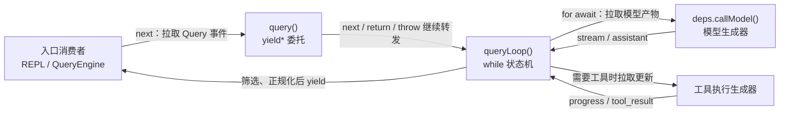

请先记住三个动作：

1. 入口消费者 pull `query()`；
2. `query()` 用 `yield*` 把 pull 委托给 `queryLoop()`；
3. `queryLoop()` 再用 `for await` 主动 pull 模型流或工具流。

“流”并不代表值会自己从最内层冲到 UI。模型事件先到 Query Loop，Query Loop 可以收集、过滤、暂扣或转换，再决定哪些值成为外层 Query 事件。

这也是为什么 `query()` 不能简单理解为模型客户端。它更像一个协议边界：里面是多轮状态机，外面是能够边消费、边写回、边投影的运行表面。

## 先走完一次两轮运行

假设用户问：“20 + 22 等于多少？”模型第一次不直接回答，而是生成：

```text
assistant / tool_use(add, {left:20, right:22})
```

工具执行后形成：

```text
user / tool_result(call-1, 42)
```

第二次模型请求才得到最终文本。忽略 M13 才会展开的 Context 投影细节，M12 关心的控制时间线是：

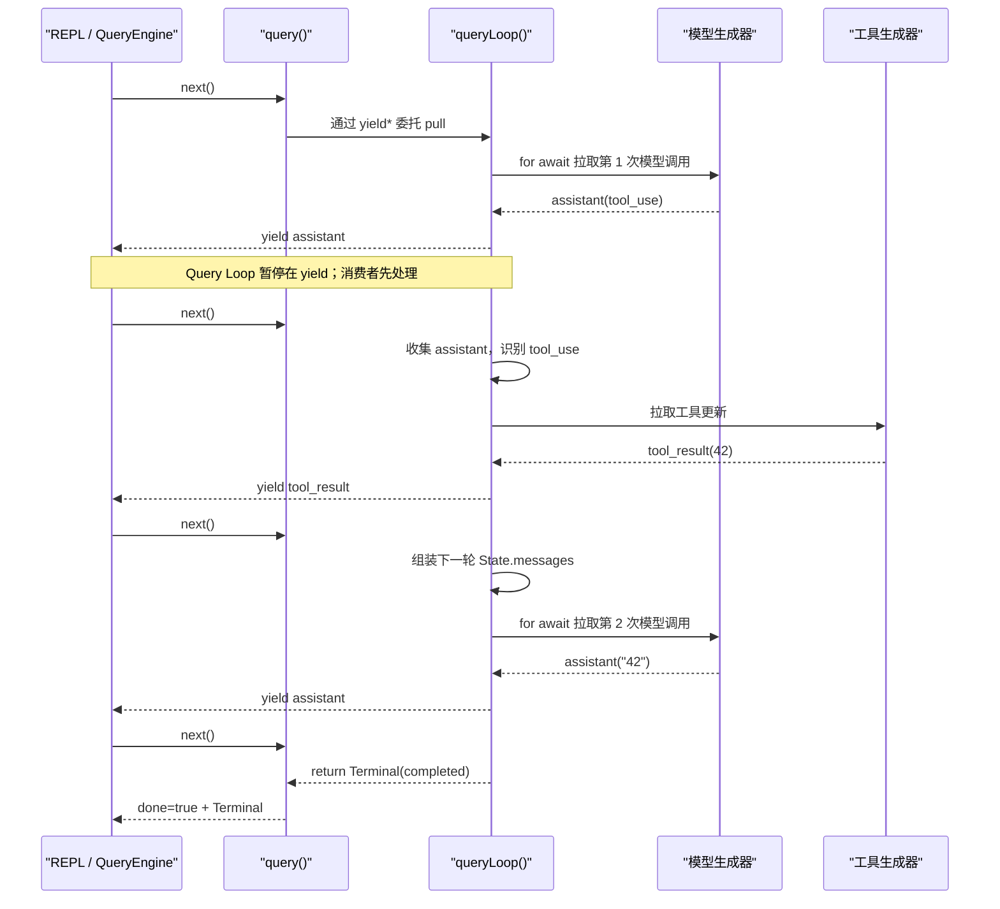

这里有两个“第二次”：

- 第二次模型请求来自 Query Loop 更新 `state` 后的下一次 `while` 迭代；
- Query Loop 在每一个 `yield` 后继续，都来自外层消费者的下一次 pull。

不要把它们混为“递归调用了自己”。当前快照的实现是显式迭代状态机。

## `query()` 很薄，但这层不能删掉

`src/query.ts` 中的外层包装器核心形状是：

```ts
export async function* query(params): AsyncGenerator<QueryEvent, Terminal> {
  const consumedCommandUuids: string[] = []
  const terminal = yield* queryLoop(params, consumedCommandUuids)
  // 只有 queryLoop 正常 return，才执行 consumed command completed 通知
  return terminal
}
```

源码定位：`src/query.ts -> query()`，约 219–238 行。

`yield*` 在这里同时完成两件事：

- 把 `queryLoop()` 产生的中间事件原样转发给上层；
- 在子生成器正常结束时，接住它返回的 `Terminal`。

于是 `yield*` 后面的代码天然成为“正常业务完成段”。如果内部 throw，或者外层 consumer 主动 `.return()` 关闭生成器，这一段不会被误执行。

这和 `finally` 的职责刚好不同：

```text
yield* 后正常段：确认业务协议正常结束
finally：无论正常、异常还是被关闭，都要做的资源清理
```

把“通知成功”放进 `finally` 是严重错误，因为取消和 consumer close 也会经过 `finally`。把“总要释放的资源”放在正常 return 后同样错误，因为 throw 和 close 会跳过它。

当前 `query()` 还维护 `consumedCommandUuids`，说明这层包装不是无意义转发。它把“内部循环 terminal”与“整个 query 正常完成后才能确认的副作用”分开。

## 当前 Query Loop 是 `while` 状态机，不是递归

源码中还能见到 `query_recursive_call` checkpoint 和“recurse”一类历史命名。名称不是控制流证据。真正应该检查的是：函数是否自调用、下一轮参数从哪里来、调用栈是否增长。

当前 `queryLoop()` 的骨架是：

```text
选择 params.deps 或 productionDeps()
建立 State
启动一次用户轮次级 memory prefetch

while (true):
  从 state 解构本轮输入
  形成 messagesForQuery
  拉取模型事件
  处理停止、恢复或工具分支
  return Terminal
  或 state = next; continue
```

源码定位：`src/query.ts -> queryLoop()`，约 241 行起；代表性的 `state = next; continue` 和 return 分支分布在 1099–1115、1207–1220、1282–1305、1714–1728 行附近。

这是一种“不可变替换倾向”的状态机：不是在函数末尾递归调用 `queryLoop(next)`，而是构造下一份状态，让下一次 `while` 从顶部重新解构。

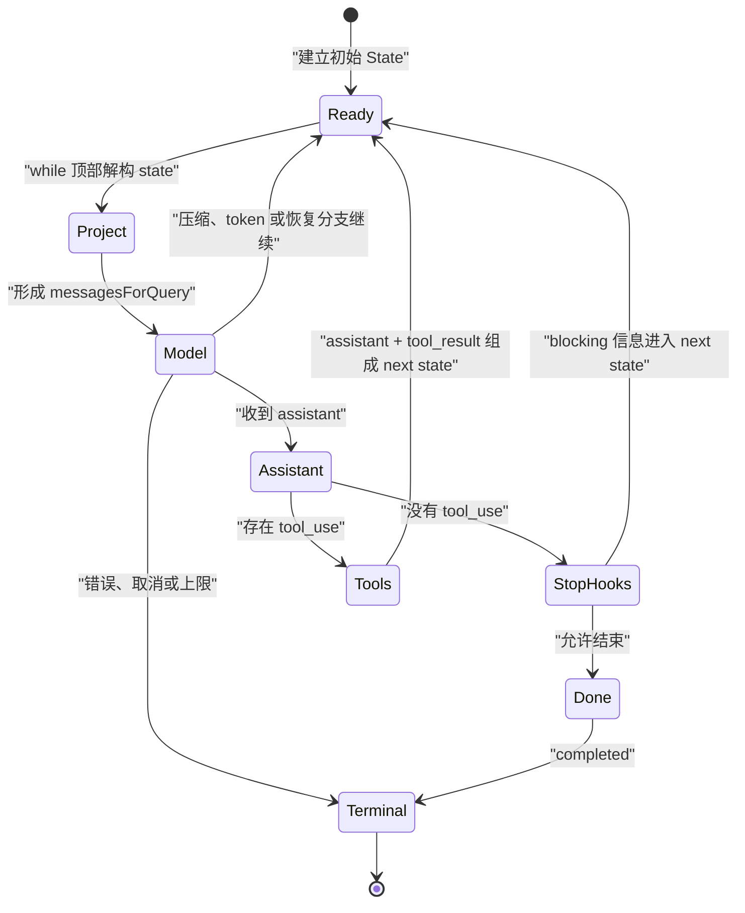

图中的继续分支不是完整枚举。当前可见代码里，`continue` 还服务于 context collapse drain、reactive compact、max output token 恢复、Stop Hook 阻断信息、token budget 续写等机制。M13–M18 会分别拆开这些业务，本单元只确认它们共享同一个控制形状：

```text
产生 Continue 语义 -> 替换 State -> 回到 while 顶部
```

### 为什么不应只有一个 `shouldContinue: boolean`

布尔值能告诉你“继续”，却不能告诉你为什么继续。下一轮若需要：

- 增加一条 tool result；
- 换用压缩后的消息；
- 提高 max output token；
- 加入 Stop Hook 的 blocking error；
- 记录这次恢复来自哪个分支；

那么继续原因本身就影响下一状态、遥测和测试。当前 `State` 中还保留上一轮 `transition: Continue | undefined`，用于让测试和诊断知道恢复路径，而不是靠猜消息内容。

快照缺少 `src/query/transitions.ts`，所以我们只能从 import、使用位置和对象字面量反向观察 `Continue`/`Terminal`。本教材不会声称完整穷举原始联合类型。

## 依赖注入改变的不是风格，而是可验证边界

`queryLoop()` 不硬编码直接调用某个全局模型函数，而是选择：

```ts
const deps = params.deps ?? productionDeps()
```

随后调用 `deps.callModel()`。`src/query/deps.ts` 中的生产工厂才把它绑定到 `queryModelWithStreaming`，类型使用 `typeof queryModelWithStreaming` 保持端口形状。

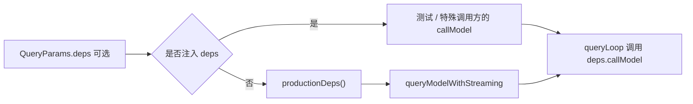

这使状态机实验不必打开真实网络，也不必伪造整个 Claude Code 运行环境。它同时保留生产默认值，避免每个调用方都手动组装依赖。

需要警惕一个误读：可注入不等于“任何东西都合法”。端口仍受类型和运行协议约束。`callModel` 必须返回可被 `for await` 消费的对象，并产生 Query Loop 能识别的事件。错误 fake 是调用方违反契约，不是依赖注入本身破坏了类型。

## `yield` 是状态提交顺序边界

最值得逐行停下来的不是 `while`，而是两个 `yield`。

### Assistant 路径

`src/query.ts` 约 823–845 行的决定性顺序是：

```text
yield yieldMessage
-- producer 在这里暂停 --
assistantMessages.push(originalMessage)
扫描 tool_use
可能加入 StreamingToolExecutor
```

也就是说，外层消费者先看见 assistant，Query Loop 后把原始 assistant 收进本轮局部集合。

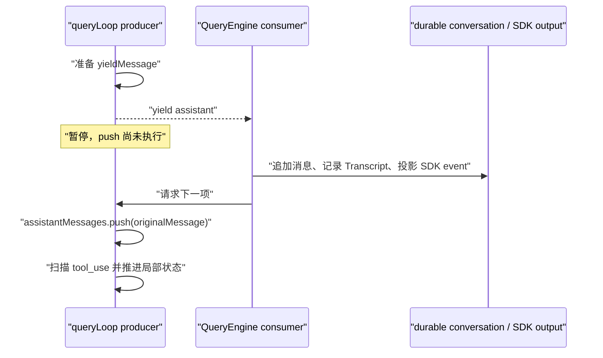

### Tool update 路径

`src/query.ts` 约 1384–1407 行同样是：

```text
yield update.message
-- consumer 先处理 --
normalizeMessagesForAPI([update.message])
toolResults.push(...)
接收 update.newContext
```

如果为了“先把内部状态写好”而把这些操作搬到 `yield` 前，事件对外可见的提交顺序就变了。改变是否正确，必须同时回答：

- 外层持久化失败时，producer 是否仍应进入下一轮？
- consumer 在事件后关闭时，producer 已提交的状态是否会成为不可观察的幽灵状态？
- tool progress、最终 result 和 context update 的顺序是否仍满足协议？

所以 `yield` 前后不是随意格式问题，它是一条 happens-before 边界。

## 两条状态轨道，不是一个数组轮流传

M10 已经区分了会话 owner 与查询快照。M12 再增加一层：Query Loop 为了完成当前 query，也必须拥有自己的跨迭代状态。

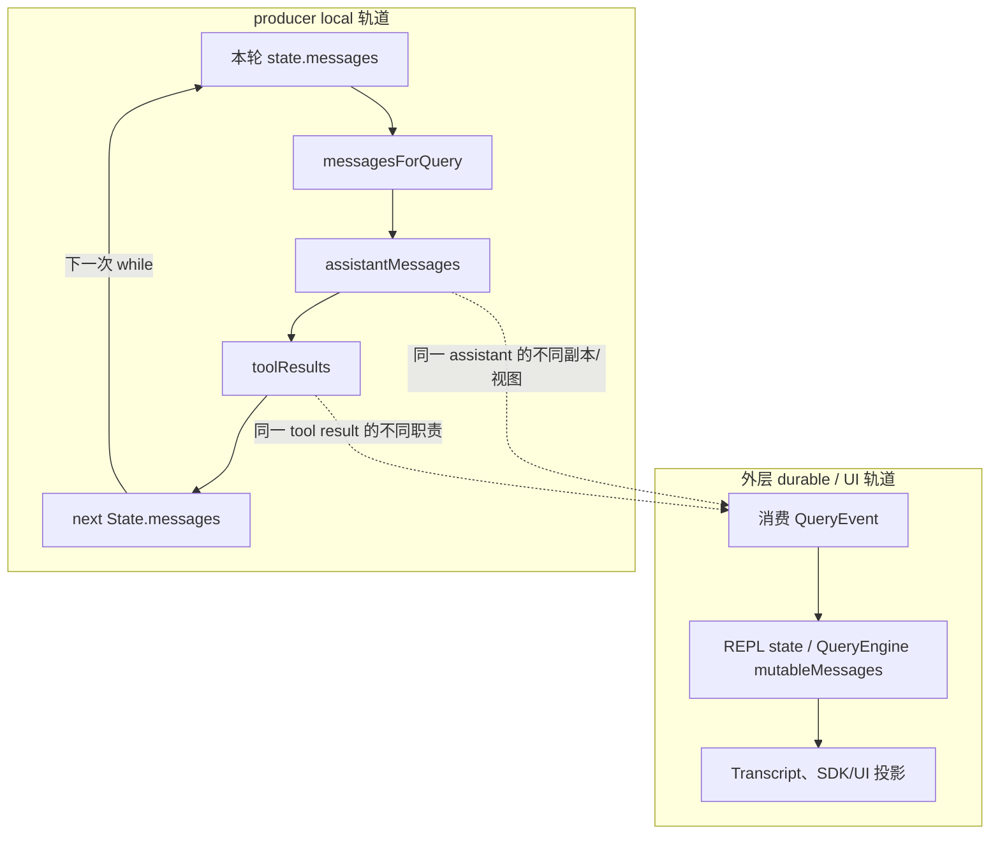

内轨的职责是：即使外层没有把消息“喂回来”，当前 Query 仍能用 `messagesForQuery + assistantMessages + toolResults` 构造下一轮模型输入。

外轨的职责是：让会话、UI、Transcript 和 SDK 使用者观察到运行，并维护跨 Query 的 durable 状态。

因此下面这句话是错的：

> Query Loop yield assistant 后，必须等 QueryEngine 把它写回 `mutableMessages`，下一轮才能继续。

准确说法是：

> Query Loop 必须等 consumer 再次 pull，才会执行 `yield` 后的局部收集；但它不依赖 consumer 把 durable 数组回传，producer 自己构造当前 query 的 next state。

“等待下一次 pull”和“等待外层回传状态”完全不是一回事。

## Terminal 在哪里，为什么主消费者看不到它

`query()` 的类型把两种输出写得很清楚：

```text
AsyncGenerator<QueryEventUnion, Terminal>
               ^ yielded value   ^ normal return value
```

手动消费时可以看到 `IteratorResult`：

```ts
while (true) {
  const step = await iterator.next()
  if (step.done) {
    return step.value // Terminal
  }
  consume(step.value) // QueryEvent
}
```

但 REPL 和 `QueryEngine.submitMessage()` 都使用 `for await`。这个语法只把 `done:false` 的值交给循环变量；遇到 `done:true` 就结束循环，没有变量承接 `step.value`。

QueryEngine 因此不是把内部 `Terminal` 直接改名成 SDK result。它依据自己消费过的消息、stop reason、预算和 structured output 状态，构造外部结果。

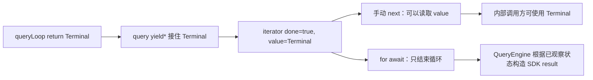

这不是已证实的 bug，而是两个协议层：

- `Terminal` 描述 Query 状态机怎样结束；
- SDK result 描述 Headless 调用方最终收到什么。

如果你设计自己的 Harness，必须明确选择：

1. 手动 `.next()`，保留事件和 return terminal；
2. 把 terminal 也做成显式事件；
3. 让外层 run object 或 Promise 单独承载 summary；
4. 同时提供 `events` 与 `completion` 两个明确端口。

不能让一部分消费者等待 return value，另一部分消费者只等待 `run.finished`，却没有映射规则。

## QueryEngine 的 early close：内外终止不一定同时发生

QueryEngine 在消费循环内部有三个真实的直接返回点：

- 收到 `max_turns_reached` attachment；
- 超过 `maxBudgetUsd`；
- structured output retry 超过上限。

最能说明问题的是 max turns：

```text
queryLoop yield max_turns_reached attachment
-> QueryEngine 消费 attachment，产出自己的 error result
-> QueryEngine return，关闭内部 query iterator
-> queryLoop 没有恢复执行紧随 yield 后的 return {reason:'max_turns'}
```

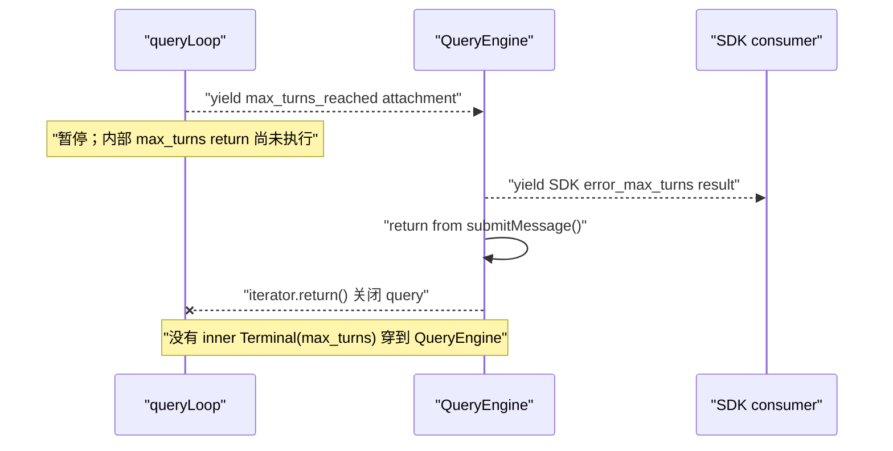

外层已经有足够信息结束自己的协议，所以它不必为了取得内部 terminal 再 pull 一次。这个设计是否值得采用，要看外部协议是否完整；但描述它时不能把两层结束对象画成同一个节点。

## 正常结束、Abort、consumer close 与 throw

这四者在“最后都不再有下一条普通事件”这一点上相似，语义却完全不同。

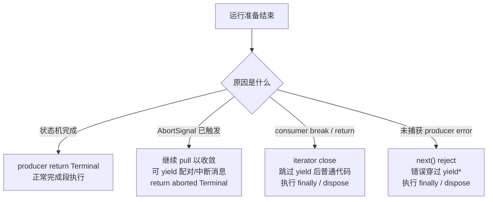

### Abort 是协作意图，不是 iterator close

同一个 signal 会传入模型调用和工具上下文。用户按下取消后，Query Loop 仍可能需要：

- 为已经暴露的 `tool_use` 补齐 `tool_result`；
- 消费或丢弃 StreamingToolExecutor 的剩余结果；
- 产出 interruption message；
- 记录 terminal reason；
- 释放绑定到本轮的资源。

只要外层继续 pull，这些收敛事件仍能被消费。于是“signal 已 abort”和“生成器已经关闭”不能画等号。

当前可见路径中，streaming 阶段可收敛为 `aborted_streaming`，tool 阶段可收敛为 `aborted_tools`。这是业务 terminal。

### Consumer close 是外层撤销兴趣

`break`、consumer body 抛错或显式 `.return()` 会关闭 iterator。此时 producer 不是按自己的业务状态返回一个 terminal；它接到的是 Return completion。

因此：

- 当前 `yield` 后普通代码跳过；
- `yield*` 后正常 completion 通知跳过；
- `finally` 与作用域资源处置执行；
- 不能伪造 `completed` 或 `aborted_tools`。

### Throw 是错误通道

Claude Code 会把一部分可协议化错误转换为消息和 terminal，例如代表性模型异常可以形成 API error message，并以 `model_error` 结束；已暴露的 tool use 还要先配对。

但不能推导“所有错误都成为事件”。未捕获错误仍可让 `.next()` reject，并穿过 `yield*` 到消费者。企业协议需要同时定义结构化业务失败和致命异常，而不是把所有 `Error.toString()` 塞进模型上下文。

## `using`：把多出口清理收敛到资源声明

`queryLoop()` 有十多个 return site。如果每个分支都手写 memory prefetch 的 abort 和 telemetry，很容易漏掉 throw 或 consumer `.return()`。

当前源码在进入循环前声明：

```ts
using pendingMemoryPrefetch = startRelevantMemoryPrefetch(
  state.messages,
  state.toolUseContext,
)
```

返回的 `MemoryPrefetch` 实现 `[Symbol.dispose]()`。处置时会 abort 它自己的 child controller，并记录预取是否被消费等 telemetry。

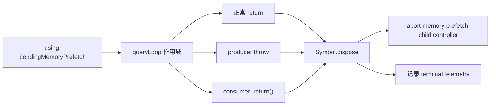

这是 Explicit Resource Management 的价值：资源声明和退出清理绑定，而不是依赖每个业务分支记得调用。

边界也必须说清：这里只能确认 memory prefetch handle 被处置。不能据此宣布模型 socket、所有工具 Promise、子进程和后台任务都已停止。每种外部资源都需要自己的 abort、destroy、kill、discard 或 dispose 连接。

## 还有一层 `yield*`：Stop Hook 也有过程值和终值

在没有工具 follow-up 的路径上，`queryLoop()` 会：

```ts
const stopHookResult = yield* handleStopHooks(...)
```

`handleStopHooks()` 可以产生 progress/attachment 等过程消息，正常结束时返回包含 `blockingErrors` 与 `preventContinuation` 的结果。Query Loop 再决定真正结束、阻断结束，还是把 blocking 信息放进 next state。

这说明 `yield*` 不是只用于 `query -> queryLoop`：同一个协议形状可以嵌套多层，每层都能转发过程事件，并在正常结束时取得下层决策结果。

M12 不展开 Stop Hook 的业务规则。现在只要能区分：

```text
Hook yielded message：外层可以观察的过程
StopHookResult：Query Loop 决定继续或结束的内部终值
```

## 用 clean-room 实验观察每个边界

实验代码位于：

```text
curriculum/units/M12/code/typescript/
curriculum/units/M12/code/python/
```

### TypeScript：手动保留 terminal

核心接口是：

```ts
async function* queryLoop(
  params: QueryParams,
): AsyncGenerator<QueryEvent, LoopTerminal>
```

`drainWithTerminal()` 不用 `for await`，而是手动读取 `IteratorResult`：

```ts
while (true) {
  const step = await iterator.next()
  if (step.done) return { events, terminal: step.value }
  events.push(step.value)
}
```

运行：

```powershell
node curriculum/units/M12/code/typescript/query-loop.test.ts
node curriculum/units/M12/code/typescript/demo.ts
.\mini-agent-harness\node_modules\.bin\tsc.cmd `
  -p curriculum/units/M12/code/typescript/tsconfig.json
```

实际结果：6 个契约测试和 strict typecheck 全部通过。demo 观察到：

```text
events = request, assistant, tool_result, request, assistant
modelRequestSizes = 1, 3
terminal = completed / 2 turns
durableMessageCount = 4
```

第一次请求只有初始 user。第二次请求由 producer local state 组装，含 user、assistant tool use、user tool result。外层 durable conversation 也消费事件，但从未把数组喂回 producer。

### 把 consumer 插在 `yield` 中间

测试故意这样推进：

```text
iterator.next() -> request
iterator.next() -> assistant
consumer persist assistant
iterator.next() -> producer 继续
```

trace 是：

```text
producer.assistant.before_yield
consumer.assistant.persist
producer.assistant.after_yield
```

如果你的 trace 里 `after_yield` 出现在 consumer persist 之前，说明实验实现已经改变了控制协议。

### Consumer close 破坏实验

在 assistant event 后执行：

```ts
await iterator.return(undefined as never)
```

观察到：

```text
有 producer.assistant.before_yield
没有 producer.assistant.after_yield
有 producer.loop.finally
有 wrapper.finally
没有 wrapper.normal_completion
```

这同时验证了“普通 bookkeeping 被跳过”和“退出清理仍执行”。

### `for await` 对照实验

同样的 generator 用 `for await` 自然耗尽后，事件全部可见；但再调用一次 `.next()` 只得到：

```text
done = true
value = undefined
```

原 terminal 已经在 `for await` 判断 done 时经过，语法没有保存它。另一份手动 next 运行则正确得到 `completed`。

### 模型等待期取消

脚本化模型停在 `waitUntilAborted(signal)`。consumer 先取得 request event，再触发 controller：

```text
request
interruption(model)
done + Terminal(aborted)
```

模型请求数保持 1，没有开始第二轮。这比“函数最后检查一次 signal”更有意义：取消发生在真正的 await 边界。

## Python：行为目标相同，协议形状不能照抄

Python async generator 支持 `async for`、`anext()`、`aclose()` 与 `finally`，但语法禁止：

```python
async def events():
    yield event
    return terminal  # 非法：async generator 不能携带 return value
```

M12 的 Python 版让 `QueryRun` 持有：

```python
self.terminal: LoopTerminal | None
```

自然耗尽时写入 terminal；consumer `aclose()` 时保持 `None`。于是调用方能明确区分业务完成和外层关闭，而没有假装 Python 拥有 TypeScript 的 return channel。

运行：

```powershell
python -m unittest discover `
  -s curriculum/units/M12/code/python `
  -p test_query_loop.py -v
python curriculum/units/M12/code/python/demo.py
```

实际结果：5 个测试通过，demo 的事件、两次请求尺寸和 terminal 与 TypeScript 一致。

### 一个实验中真实出现的 Python 陷阱

最初的包装器是：

```python
async def query_events(run):
    async for event in run.events():
        yield event
```

外层被 `aclose()` 时，wrapper 的 `finally` 执行了，但内层 `run.events()` 的 `finally` 没有在断言点前完成。JavaScript `yield*` 的关闭委托不能靠一个普通 Python `async for` 包装自动复刻。

最终实现显式保留 inner iterator：

```python
inner = run.events()
try:
    async for event in inner:
        yield event
finally:
    await inner.aclose()
```

这不是语言优劣，而是迁移时必须保留的生命周期契约。跨语言系统最好把 terminal 和 cancellation 做成明确网络协议，不让关键语义依赖某一种语言的 generator return 特性。

## 做五次有目的的修改

这些练习不计入主体学习时间。每次修改前先写预测，再运行测试。

1. 把 `assistantMessages.push()` 移到 assistant `yield` 前。比较 consumer close 后 producer local state 的变化，并说明这是不是你想要的提交语义。
2. 把 `drainWithTerminal()` 改成普通 `for await`。不要额外存一个假 terminal，解释调用方失去了哪个通道。
3. 删除 Python wrapper 对 `inner.aclose()` 的显式调用。重跑 close 测试，解释哪一层资源没有及时收敛。
4. 把模型等待期的 `AbortSignal`/token 传递删除，只保留每轮顶部检查。测量取消要等多久才生效。
5. 让外层 durable consumer 在 assistant 事件上抛错。确认 producer next state 没有继续，但 finally 执行；再设计恢复时由谁决定重放事件。

每次修改都回答同一组问题：谁拥有状态，谁触发下一步，什么已经对外可见，什么仍只是 producer 局部事实。

## Mini Agent Harness：本轮合并契约，不重写运行时

当前作品级 Harness 已经有三种清楚的对象：

| 语义 | 当前对象 | Owner |
| --- | --- | --- |
| durable message state | `ConversationStore` | 单个 `AgentRuntime`，revision + run lease |
| observer events | `AgentEventSink` | UI/CLI adapter；失败被隔离 |
| terminal summary | `Promise<AgentRunSummary>` | `AgentRuntime.submit()` 调用方 |

`AgentEventSink.emit()` 可以被 await，因此当前 runtime 会等待 observer；但 sink 失败被捕获为 `event-sink.failed` trace，不允许 observer 接管 Tool Loop 或破坏消息配对。`AgentRunSummary` 则显式承载 completed、cancelled、failed、max-turns、turns、revision 和 usage。

M12 的裁决是：

```text
merge：把 durable / observer / terminal 三层契约写入 H2 文档
defer：完整 pull-based AgentRunStream 延后到 M14
reject：不把 callback 随手包成无界 async queue
```

为什么不立即把稳定 runtime 改成 `AsyncGenerator`？因为真正的 stream API 不能只改返回类型。它必须一起回答：

- SSE delta 由谁缓冲，队列上限是多少；
- consumer 慢时暂停模型读取，还是只暂停应用层投影；
- consumer close 是否自动触发 `AbortController`；
- terminal summary 通过 return、completion Promise 还是 terminal event 获取；
- UI、Transcript、telemetry 多个观察者是广播还是单消费者；
- 网络连接已经 push 到本地的字节由谁拥有。

M14 会有真实模型 stream 语义，届时再作 API 选择，能避免为了“看起来像 Claude Code”而造出无界队列和泄漏。

## 迁移到 Java/Spring：不要只翻译成 `Flux`

Java 没有 TypeScript async generator 的同构 return channel。最接近的生产形状通常是：

```text
RunHandle
|- Flux<AgentEvent> events
|- CompletionStage<RunSummary> completion
`- cancel(reason)
```

这个拆分比“一个 `Flux<Object>` 什么都塞”更清楚：

- `events` 负责过程；
- `completion` 负责唯一 terminal summary；
- `cancel` 负责协作意图；
- subscriber cancel 是否转成业务 cancel，要显式定义。

如果使用 Spring WebFlux SSE，HTTP 客户端断开会取消订阅，但这仍不自动等于模型和工具已停止。需要在 `doFinally(CANCEL)` 或资源作用域中触发 run controller，再等待模型 adapter、工具执行器和子进程在预算内确认。

对于 durable state，仍应由数据库事务或带 revision 的 `ConversationStore` 拥有。不要让每个 Reactor operator 顺手修改同一个 `ArrayList<Message>`。producer next state 可以是当前 run 的局部不可变对象，durable commit 则经过明确 repository 边界。

## 与 LangGraph 的关系：节点调度不会替你定义消费协议

LangGraph 可以把模型、工具和条件分支表达成图，并提供 stream mode。但你仍要决定：

- 图 state 与外部会话记录谁是 source of truth；
- stream chunk 是进度、消息还是 durable commit；
- 客户端断流时图执行继续还是取消；
- checkpoint 记录在 yield 前还是 yield 后；
- terminal reason 怎样映射成 API result。

Claude Code 的 Query Loop 给我们的迁移思想不是“所有 Agent 都写 while”。真正值得保留的是：过程事件、循环局部状态、durable owner、terminal summary 和取消意图各有明确协议。

## 提升到企业系统：从单消费者走向多观察者

当前主路径可理解为一个 consumer 拉取 Query 事件，但生产系统往往同时有：

- Web/SSE 客户端；
- Transcript writer；
- telemetry；
- 审计与成本系统；
- 后台恢复控制器。

不能让五个模块直接竞争同一个 async iterator。通常需要一个 run coordinator 成为唯一 consumer，再把事件发布给不同下游：

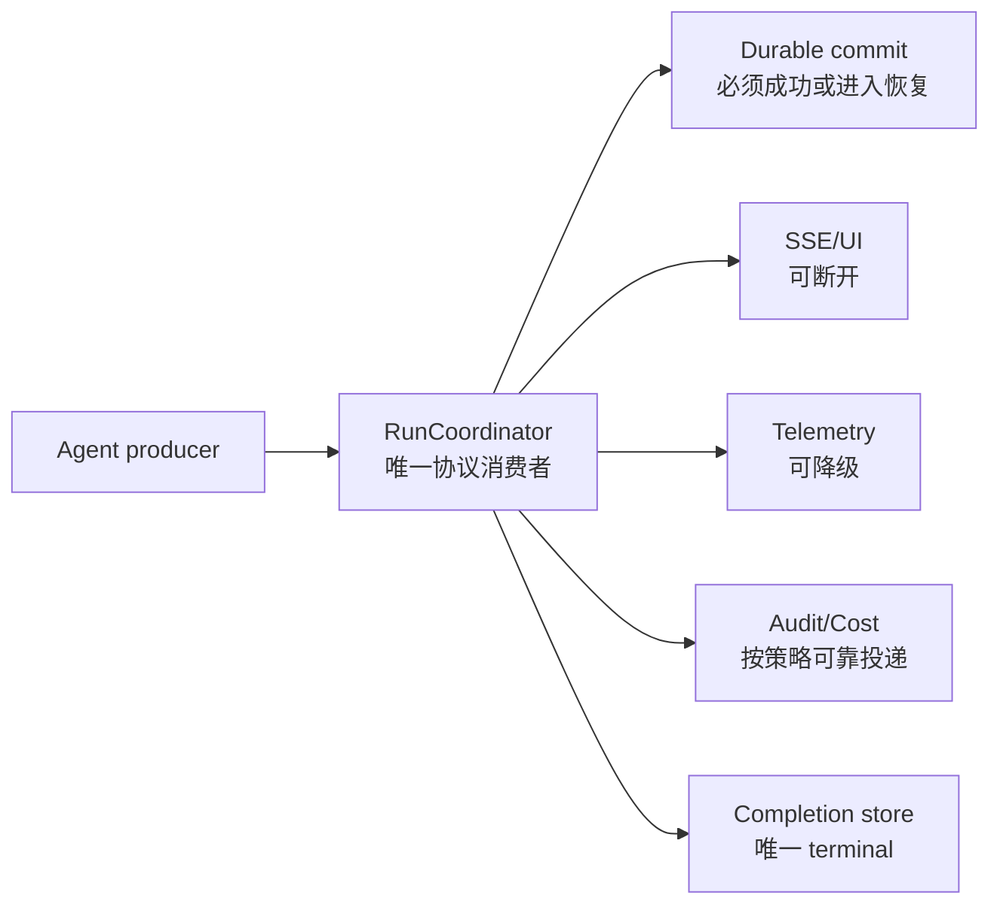

不同下游的失败策略必须不同。UI 断开不一定回滚 durable commit；telemetry 失败通常不应破坏 tool pairing；durable commit 失败则可能要求暂停 producer、关闭运行或进入恢复队列。

M12 的 `yield` 顺序问题在这里变成真正的系统设计问题：对外发布事件前先提交数据库，还是先让用户看到低延迟事件？常见方案是为每个事件分配 run ID 和 sequence，durable log 先落盘，再异步投影 UI；若追求极低延迟，则必须接受 UI 可能看到尚未 durable 的 provisional event，并定义补偿协议。

## 资深 Agent 开发岗面试：从控制权讲到生产协议

下面的问题不是背诵题库。先用第一句话给结论，再用 Claude Code 的决定性机制支撑，最后留下能承接追问的工程边界。

### 问题 1：Claude Code 的一轮 Agent 到底是谁驱动的？

> 先说结论：它是 consumer pull 驱动、Query Loop 持有局部状态的分层状态机，不是模型回调自己一路跑到底。REPL 或 QueryEngine 用 `for await` 拉取 `query()`；`query()` 再用 `yield*` 把 pull 委托给 `queryLoop()`；Query Loop 内部用 `for await` 拉取模型和工具生成器。每次向外 yield 后，producer 会暂停，外层先做会话写回和输出投影，下一次 pull 才执行 yield 后的 assistant/tool-result 收集。当前 queryLoop 用 `while(true)` 和 `state = next; continue` 推进，不是递归。这个设计把过程事件、局部 next state 和外层 durable state分开。生产上我会让 RunCoordinator 成为唯一协议消费者，再分发 UI、Transcript 和 telemetry，避免多个观察者竞争同一个 iterator。

### 问题 2：为什么 `yield` 前后顺序会影响数据一致性？

> 先说结论：因为 `yield` 是可见性和控制权边界，前面的状态已经发生，后面的普通代码只有 consumer 再 pull 才会执行。Claude Code 的 assistant 路径先 yield，恢复后才 `assistantMessages.push`；tool update 也是先 yield，恢复后才正规化并加入 `toolResults`。所以 QueryEngine 可以先把事件写入 durable/UI 轨道，producer 再更新当前 query 的局部轨道。如果 consumer 在事件后关闭，yield 后 bookkeeping 会跳过，但 finally/dispose 仍执行。企业系统里我会明确事件是 provisional 还是 committed，并用 run ID、sequence 和 append-only log 解决 UI 先看到、数据库后失败的问题，不能把几个 push 随意换序。

### 问题 3：`AbortSignal` 和关闭 async generator 有什么区别？

> 先说结论：AbortSignal 是协作式取消意图，generator close 是消费者停止迭代的控制动作，两者不能互相冒充。Claude Code 收到 abort 后，Query Loop 可能仍被继续 pull，用来补齐已经暴露的 tool_use、产出 interruption 消息、收集工具结果并返回 `aborted_streaming` 或 `aborted_tools`。consumer `.return()` 则关闭委托链，跳过 yield 后普通代码和 query 的正常完成通知，只执行 finally 与资源 dispose，没有业务 Terminal。生产 Harness 里我会把 client disconnect、用户 cancel、budget stop 分成不同 reason；close 可以触发 abort，但还要等待模型 socket、工具和子进程各自确认，不能看到 generator finally 就宣称资源全停了。

### 问题 4：`for await` 为什么拿不到 Query Loop 的 Terminal？这是 bug 吗？

> 先说结论：这是 JavaScript 消费语法和协议分层的结果，不是自动成立的 bug。`AsyncGenerator<Event, Terminal>` 的 return 值只在 `done:true` 的 IteratorResult 里；`for await` 遇到 done 就退出，没有变量接 value。Claude Code 的 `query()` 用 `yield*` 能接住内部 Terminal，但 REPL 和 QueryEngine 用 `for await`，所以它们只消费事件；QueryEngine 再根据消息、stop reason、预算和 structured output 状态构造 SDK result。若自己的系统必须保留 terminal，我会手动 next，或者提供 events + completion Promise。关键是让所有消费者遵守同一映射，不要把内部 Terminal、SDK result 和 run.finished event 混成一个概念。

### 问题 5：如果 QueryEngine 收到 max-turn 事件后直接 return，会发生什么？

> 先说结论：外层 SDK 协议会结束，但内部 Query Loop 紧随 yield 后的 `return {reason:'max_turns'}` 可能不会执行，因为 consumer 已关闭 iterator。当前源码就是先从 Query Loop yield `max_turns_reached` attachment，QueryEngine 消费后产出自己的 error result 并 return。关闭通过 `yield*` 传回去，清理会执行，但 inner Terminal 不会再被 QueryEngine 读取。这说明两层协议各自有终止对象。设计企业 API 时，我会确认外层事件包含足够的 reason 和 run identity，并让 completion store 幂等收敛；如果审计必须保留内部 terminal，就不能依赖 consumer 再 pull，而要把 terminal 提升为显式持久事件或独立 completion channel。

### 问题 6：为什么当前 Mini Agent Harness 不立即改成 AsyncGenerator？

> 先说结论：因为返回类型不是核心，完整的流控、取消和 terminal 协议才是核心。当前 Harness 已有 `ConversationStore` 作为 durable owner、`AgentEventSink` 作为可失败但不拥有控制流的 observer、`Promise<AgentRunSummary>` 作为 terminal。为了模仿 Claude Code 把它改成 AsyncGenerator，却不设计 queue 上限、SSE 背压、consumer close 到 AbortSignal 的传播和多观察者广播，会比现状更差。所以 M12 只合并三层契约，等 M14 有真实 SSE 事件组装后再决定 `AgentRunStream`。面试里我会强调这是接口时机选择，不是拒绝流式；成熟设计要一起交付 buffer、completion 和 resource scope。

### 问题 7：TypeScript、Python 和 Java 怎样统一这个协议？

> 先说结论：跨语言时不要依赖 TypeScript generator return 这种语言特性，要把事件、完成和取消提升成显式协议。TypeScript 进程内可以保留 `AsyncGenerator<Event, Terminal>`；Python async generator 不能 return value，所以 M12 用 `QueryRun.terminal`；Java 可以用 `Flux<AgentEvent>` 加 `CompletionStage<RunSummary>`。跨进程我会统一成带 runId、sequence 的事件流，加一个唯一 terminal record，再提供 cancel command。这样客户端断流、业务取消和 producer failure 都有独立 reason，Transcript 能重放，任何语言都能实现，不需要伪造一一对应的语法。

## 离开本单元前，完成一次闭环

先不要看源码，自己画出三层 pull：入口 consumer、`query()/queryLoop()`、模型/工具 generator。每条箭头写清是 `.next()`、`yield*` 还是 `for await`。

然后从 `src/query.ts:query()` 进入 `queryLoop()`，找到：

1. 初始 `State`；
2. `while(true)`；
3. 一个 `state = next; continue`；
4. assistant yield 与后续 push；
5. tool update yield 与后续 toolResults push；
6. 一个 normal Terminal return；
7. `using pendingMemoryPrefetch`；
8. `yield* handleStopHooks()`。

接着运行双语言实验，并解释：

- 为什么第二次请求是 3 条消息；
- 为什么 durable conversation 是 4 条消息；
- 为什么这两个数字不同却都正确；
- 为什么 TypeScript 手动 next 能读 terminal，for-await 不能；
- 为什么 Python wrapper 必须显式 `aclose()` 内层；
- 为什么 abort 后还能出现 interruption event。

最后为自己的 Agent/RAG 系统写一个 `RunHandle` 契约，至少包含 events、completion、cancel、durable owner、sequence 和 consumer disconnect 策略。能把这份契约用 TypeScript、Python 和 Java 各表达一次，你才真正掌握了本单元。

## 源码定位地图

- `src/query.ts -> query()`：`yield* queryLoop()`、正常完成通知和 `Terminal` 返回，约 219–238 行。
- `src/query.ts -> queryLoop()`：State 初始化、`while(true)`、依赖选择、Continue/Terminal 分支，约 241 行起。
- `src/query.ts -> assistant yield`：先 yield、恢复后收集 assistant 与扫描 tool use，约 823–845 行。
- `src/query.ts -> Stop Hook`：`yield* handleStopHooks()` 并取得 `StopHookResult`，约 1267 行。
- `src/query.ts -> tool update yield`：先 yield、恢复后正规化并写入 `toolResults`，约 1384–1407 行。
- `src/query.ts -> memory prefetch`：`using pendingMemoryPrefetch`，约 301 行；消费点约 1600 行。
- `src/query/deps.ts -> QueryDeps / productionDeps()`：模型、压缩等窄依赖端口及生产绑定。
- `src/query/stopHooks.ts -> handleStopHooks()`：过程消息与 `StopHookResult` 双通道。
- `src/utils/attachments.ts -> MemoryPrefetch / startRelevantMemoryPrefetch()`：`[Symbol.dispose]()`、child abort 与 telemetry，约 2341–2415 行。
- `src/QueryEngine.ts -> submitMessage()`：`for await` 消费 Query、消息写回、max turns/budget/structured output early return，约 675、873、1001、1046 行。
- `src/screens/REPL.tsx -> onQueryImpl()`：REPL 对 `query()` 的 `for await` 消费，约 2793 行。
- `src/utils/generators.ts -> returnValue()`：需要保留 generator 终值时的辅助消费形状；不是 REPL/QueryEngine 当前主路径。

证据边界：以上源码结论是当前静态快照事实；快照缺少 `src/query/transitions.ts`，因此 reason 列表不作完整类型穷举。M12 的双语言代码是 clean-room 运行验证；Harness、Java/Spring 与多观察者方案是设计迁移。
