# M13 对话里存在，为什么请求里看不见：从 durable history 到模型线协议

你刚做完一个两轮 Agent：用户要求检查仓库，模型先调用 `read_file`，工具返回完整文件，模型再给出答案。界面能向上翻到每一条消息，恢复文件里也保留了完整工具结果。可是你在 Provider mock 里打断点，发现请求中没有早期对话、没有进度消息、没有 compact boundary，大工具结果只剩一段 preview，而且几条内部 user message 合成了一条。

这不是消息丢失。相反，如果一个成熟 Agent 把“会话中发生过什么”原样当成“这一次应发送什么”，很快会同时遇到四类问题：超过上下文窗口、违反 Provider 消息协议、破坏 tool use/result 配对，以及把只供 UI 或恢复使用的内部 envelope 泄漏给模型。

M10 已经建立 durable conversation 的 owner，M12 又解释了 Query Loop 怎样推进。本单元要补上两者和真实模型调用之间最容易被忽略的一层：**请求投影不是取数组再 `JSON.stringify`，而是一段有顺序、有状态、有协议不变量的编译过程。**

主体学习建议安排 4 至 7 小时。双语言实验、破坏修改与 Harness 扩展另计。读完后，你应该能在一张白板上区分四层对象，沿源码解释每一次成员变化，判断某个修改应落在会话 owner、请求 projector、Provider adapter 还是恢复子系统，并能说明为什么 strict 与 repair 是产品决策而不是代码风格。

## 先看见四层对象，而不是一条“消息数组”

先把整条路放在眼前：

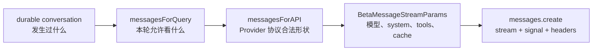

四层都可能被口头简称为“messages”，但它们回答的问题不同：

| 层 | 主要问题 | 典型 owner | 能否永久改变会话事实 |
| --- | --- | --- | --- |
| durable conversation | 运行中发生过什么，恢复时有什么依据 | REPL/QueryEngine 外层会话状态 | 可以，但必须经过会话提交边界 |
| `messagesForQuery` | 当前迭代允许模型看到哪段历史，哪些内容先做轻量处理 | `queryLoop()` 当前 producer | 不应因普通投影而改变 durable membership |
| `messagesForAPI` | 内部 envelope 怎样变成 Provider 接受的 role/content 协议 | `queryModel()` 当前调用 | 不可以 |
| wire params | 这次到底使用哪个模型、system、tools、cache、thinking 和 stream 选项 | Provider 请求构造与重试上下文 | 不可以 |

最重要的第一句话是：

> durable conversation 保存事实；request view 选择本轮可见事实；API normalization 编译协议；wire params 装配一次具体传输。

如果你只记“发送前要裁剪消息”，会漏掉正规化、配对、缓存和参数能力。如果只记“normalize 会过滤消息”，又会误以为它负责持久化压缩。四层模型把这些职责先分开，后面的源码才不会糊成一条长管道。

## 跟一条真实请求走完整条链

设想 durable history 里依次存在：

```text
u-old       旧问题
a-old       旧回答
b-1         compact_boundary
u-new       “检查 README”
a-tool      assistant / tool_use(call-1)
p-1         progress: reading
tr-1        tool_result(call-1, 120K chars)
att-1       attachment: branch=main
```

当前请求不应把这八个 envelope 原样发出去。它会经历下面的顺序：

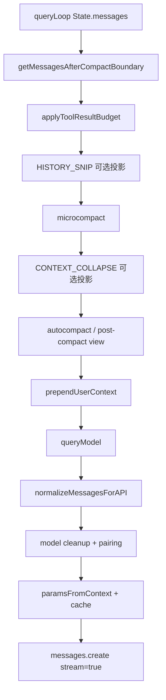

这张图是运行顺序，不是模块所有权图。比如 tool-result replacement state 可以跨多轮存在，但 `messagesForQuery` 仍是本次 generator 迭代的局部变量。后面我们会把状态 owner 单独画出来。

【快照事实】主路径位于 `src/query.ts -> queryLoop()` 约 365 至 660 行，随后进入 `src/services/api/claude.ts -> queryModel()`。当前源码快照缺少部分 feature-gated snip 与 context-collapse 实现，因此本单元只确认调用接口、调用顺序、调用侧注释和返回结果怎样继续流动，不补造内部算法。

## 第一步不是删历史，而是选可见起点

`src/utils/messages.ts -> getMessagesAfterCompactBoundary()` 做的事情很克制：

```typescript
const boundaryIndex = findLastCompactBoundaryIndex(messages)
const sliced = boundaryIndex === -1 ? messages : messages.slice(boundaryIndex)
return sliced
```

真实函数还会在 `HISTORY_SNIP` 开启时调用缺失快照模块的 projection，但先抓住这个决定性语义：它返回从最后一个 compact boundary 开始的数组，**包含 boundary 本身**。

为什么不直接 `slice(boundaryIndex + 1)`？因为 boundary 仍是内部请求管道可观察的语义标记，后续 snip、诊断或投影可能需要它。它最终不会到达 API，不是因为这里偷偷删掉，而是因为 `normalizeMessagesForAPI()` 会过滤普通 system message。

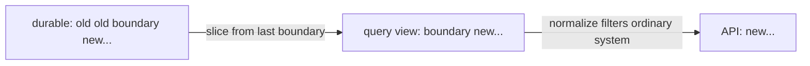

这个两步依赖非常适合面试追问。错误说法是“compact 会删除旧消息”；更准确的说法是：

- compact transaction 可能产生摘要和 boundary，这是另一个机制；
- `getMessagesAfterCompactBoundary()` 只派生 model-facing 范围；
- REPL scrollback 或 transcript 仍可能保留 boundary 之前的事实；
- 本次 API normalization 再把 boundary envelope 过滤掉。

### `[...array]` 只隔离容器，不会深复制消息

`queryLoop()` 使用：

```typescript
let messagesForQuery = [...getMessagesAfterCompactBoundary(messages)]
```

对 TypeScript 初学者，最危险的误解是“spread 后完全独立”。它只创建新数组，元素对象仍共享引用：

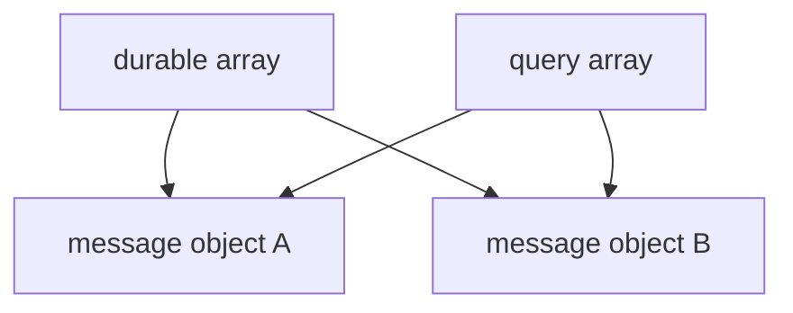

所以后续替换必须创建新的 message/content block，不能对共享元素执行 `message.content[0].text = ...`。容器 owner 已经分开，不代表嵌套内容天然不可变。这也是累计 Harness 在 `ConversationStore` 发布时深冻结，而在 request projector 中创建新 message 的原因。

把这段 TypeScript 映射到熟悉语言：

- Python 的 `list(source)` 或 `source[:]` 同样是浅复制；
- Java 的 `new ArrayList<>(source)` 也只复制引用；
- 真正的工程问题不是“是否使用某个深复制函数”，而是消息对象是否有不可变契约，修改者是否总是创建新值。

## 轻量缩减不是一个万能 `truncate()`

选出 history range 后，Claude Code 没有立即做一次全量总结。调用侧按下面顺序尝试更局部的处理：

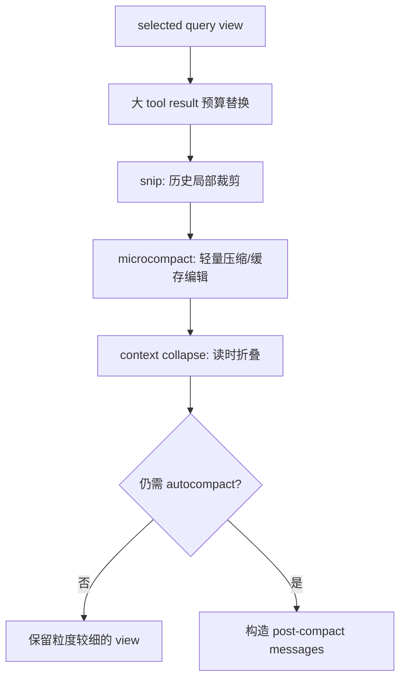

为什么顺序重要？因为它体现成本递增：先处理极端的大结果，再做局部裁剪或缓存编辑，最后才可能把一段历史变成摘要。把所有问题都交给 full compact，会让一个 200K 的工具输出拖着整个会话反复总结，也会让恢复、引用和缓存前缀更难稳定。

本单元只理解它们在请求链中的接口。M16 至 M18 会分别研究 Context view、轻量裁剪与真正 compact transaction。现在不应提前声称：

- snip 的具体保留窗口或默认 feature gate；
- context collapse 的完整 commit log 结构；
- microcompact 的所有 cache-edit 算法；
- autocompact 的阈值和 summary prompt。

知道证据边界也是源码能力。看到动态 `require()` 的类型断言，不等于你已经拥有被 require 模块的实现。

## 大工具结果为什么需要另一个状态 owner

`src/utils/toolResultStorage.ts` 里最值得迁移的不是某个阈值，而是 `ContentReplacementState`：

```typescript
type ContentReplacementState = {
  seenIds: Set<string>
  replacements: Map<string, string>
}
```

先想一个看似合理的无状态实现：每轮统计 tool result 大小，超过预算就替换最大的。它在单次请求里工作，但跨轮会破坏 Prompt Cache。

假设第一轮中结果 A 只有 60K，没有超过 100K 预算，所以模型看到了全文。第二轮又加入结果 B 50K。无状态算法发现 A+B 超限，可能把更大的 A 改成 preview。于是第二轮的历史前缀和第一轮不再相同，已经缓存的前缀失效；更糟的是，模型对过去事实的可见形态突然改变。

真实设计把候选分成三类：

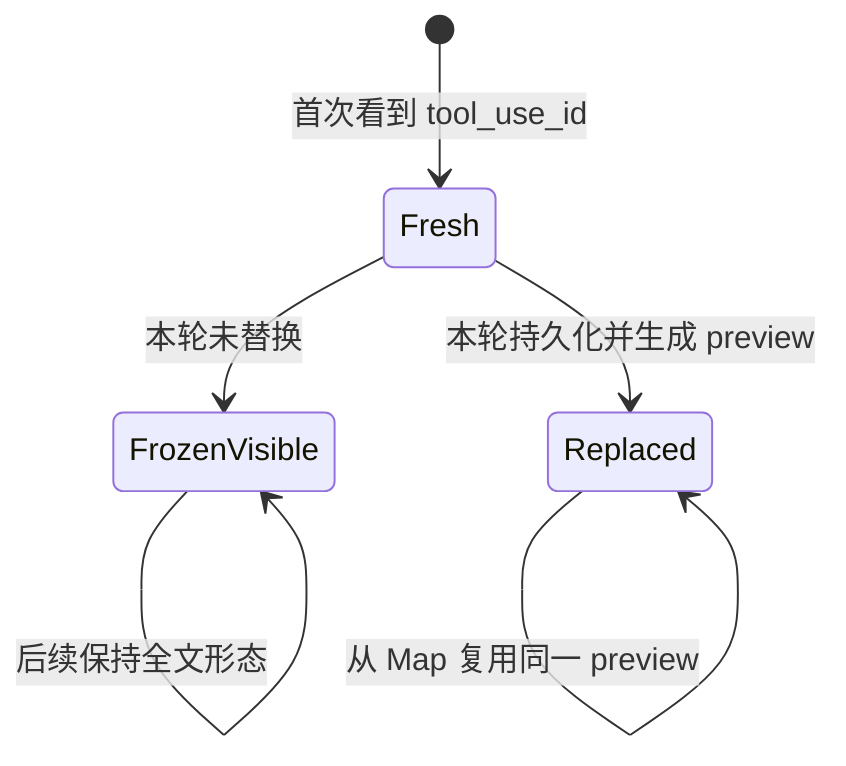

- `fresh`：从未评估过，可以做新决策；
- `frozen`：之前见过并保留全文，之后不能反悔；
- `mustReapply`：之前替换过，必须复用同一 replacement string。

这说明 request projection 并不总是纯函数。更准确的工程表述是：

> 会话 membership 的投影应保持无副作用；如果为了跨请求稳定性必须保存决策，该状态要有独立 owner、明确 key、恢复记录和可测试的不变量。

### 预算按最终 wire user group，而不是按内部 envelope

Provider 会把相邻 user 内容合并。并行工具的多个 result 中间还可能穿插 progress、attachment 或相同 response ID 的 assistant fragment。如果预算按每个内部 envelope 单独检查，几个各自低于阈值的结果在 normalize 后可能合成一个超大 user message。

`collectCandidatesByMessage()` 因此模拟最终 API grouping：新的 assistant response 形成边界；progress、attachment 和将被合并的 user envelope 不应错误切组；相同 response ID 的 assistant fragments 也不应制造新 group。

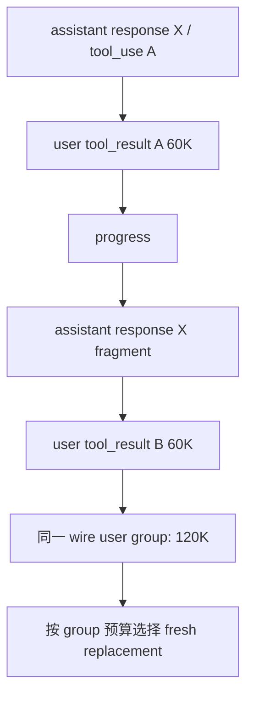

【快照事实】`applyToolResultBudget()` 在 microcompact 前运行。调用侧注释说明 cached microcompact 只按 `tool_use_id` 工作，不读取内容，所以 replacement 与 microcompact 可以组合。replacement 成功时可写入 transcript record，以便 resume 重建；普通 request view 替换本身仍不删除 durable 原文。

### 这里的并发问题不是“Set 线程安全吗”

当前 JavaScript 单线程执行不会自动消除异步观察窗口。源码在持久化 replacement 的 `await` 前后谨慎安排 `seenIds` 和 `replacements` 的更新：成功路径要避免观察者看到“ID 已 seen，但 Map 里还没有 replacement”的中间状态，否则它会把本应重用 preview 的结果误判成 frozen-visible。

迁移到 Java 时问题更明显。你不能只把 `Set` 换成 `ConcurrentHashMap.newKeySet()` 就宣布安全；`seen.add(id)` 和 `replacements.put(id, preview)` 是一个业务原子决策，需要同一锁、单 writer actor 或原子状态 publication。

## User context 是临时 user message，不是 durable prompt

`src/utils/api.ts -> prependUserContext()` 在 context 非空时创建 `isMeta: true` 的 user message，使用 `<system-reminder>` 包装并放在当前 request view 前面。它没有把消息 append 回 durable array。

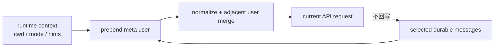

不要把三个概念混在一起：

- durable human input：用户真正说过的话，属于会话事实；
- request-only user context：当前运行环境给模型的临时信息，只属于本次投影；
- system prompt/context：在 `queryModel()` 中走独立的 system block 参数。

为什么临时环境信息不直接写 system prompt？这是产品协议选择，不是普遍真理。当前快照让它作为 meta user message 进入完整 normalize 流程，因此它可能与相邻 user content 合并。企业 Harness 可以选择独立 context channel，但必须明确 Provider 映射、缓存影响和注入优先级。

还有一个容易让测试困惑的边界：【快照事实】当 `NODE_ENV === 'test'` 时，`prependUserContext()` 直接返回输入。这是当前 Claude Code helper 的测试隔离行为。我们的 clean-room 实验没有复制这个环境开关，因为实验验证的是一般投影契约，不冒充执行该 helper。若你录制 VCR 或比较请求字节，必须先确认测试模式是否绕开了 context 注入。

## `normalizeMessagesForAPI()` 更像协议编译器

现在进入本章信息最密集的转折。`src/utils/messages.ts -> normalizeMessagesForAPI()` 不是把内部类型转成 SDK 类型这么简单，它会改变消息成员、role、内容顺序和 block 形状。

可以把它理解为一个多 pass 编译器：

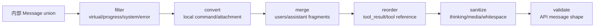

下面只挑改变运行语义的代表性 pass。

### 过滤：不是所有内部 envelope 都是模型事实

- virtual message 不进入 API；
- progress 被过滤；
- 普通 system message 被过滤，local command system 除外；
- synthetic API error envelope 被过滤；
- compact boundary 作为普通 system message在这里消失。

UI 需要进度，不代表模型需要看到“正在读取第 3 个文件”。恢复系统需要 boundary，不代表 Provider 支持这种 role。内部 union 比外部协议丰富是正常设计，filter 正是反腐层的一部分。

### 转换：内部类别不等于 Provider role

local command output 可以转换成 user message；attachment 会被展开成一个或多个 user message；tool result 在 Anthropic 协议中也位于 user content blocks。于是“Provider role 是 user”不能反推“这是人类输入”。

这延续了 M10 的关键结论：领域身份必须看显式 kind 和 ID，不能只看 role。

### 合并：消息 envelope 数量不等于 API message 数量

连续 user message 会合并，tool result blocks 被提升到 user content 前部。相同 Provider message ID 的 assistant fragments 会合并，以恢复一个流式响应的完整形状。

假设 normalize 前是：

```text
user(meta context)
user(human input)
assistant fragment(response-7, text)
assistant fragment(response-7, tool_use)
user(tool_result)
attachment(branch=main)
```

normalize 后可能变成：

```text
user(meta context + human input)
assistant(response-7: text + tool_use)
user(tool_result first + attachment text)
```

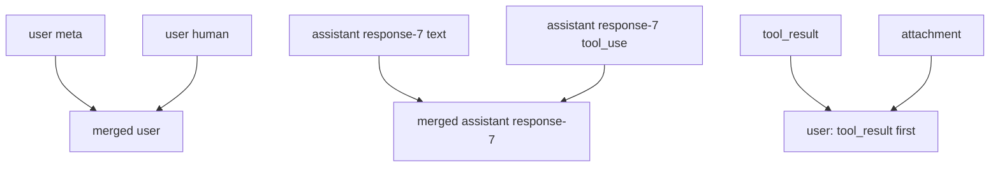

这正是为什么预算 grouping 必须预判 normalize 的结果，也解释了为什么“第 12 条内部消息对应第 12 条 API 消息”是无效调试思路。调试时应保留 envelope ID、response ID、tool-use ID 和 projection report，而不是依赖数组下标身份。

### 清理与校验：避免模型能力切换后发出非法内容

正规化还处理 orphan thinking、尾部 thinking、纯空白 assistant、media 限额、tool reference、错误 tool-result content 和图片合法性。`queryModel()` 随后还会根据当前模型能力剥离 tool-search 特有字段和 advisor blocks。

本单元不逐行列完所有 pass。学习重点是：每个 pass 都应回答“它保护哪个外部不变量”，而不是记函数清单。未来添加 Provider 时，你需要建立自己的 canonical request IR 和 Provider lowering，而不是在 HTTP adapter 里散落十几个条件分支。

## Pairing repair 为什么放在 normalize 后

正规化完成后，`queryModel()` 调用 `ensureToolResultPairing()`。顺序不能随意交换，因为合并、过滤和转换之后的 API messages 才是 Provider 真正要检查的形状。

配对不变量可以画成一个很小的状态机：

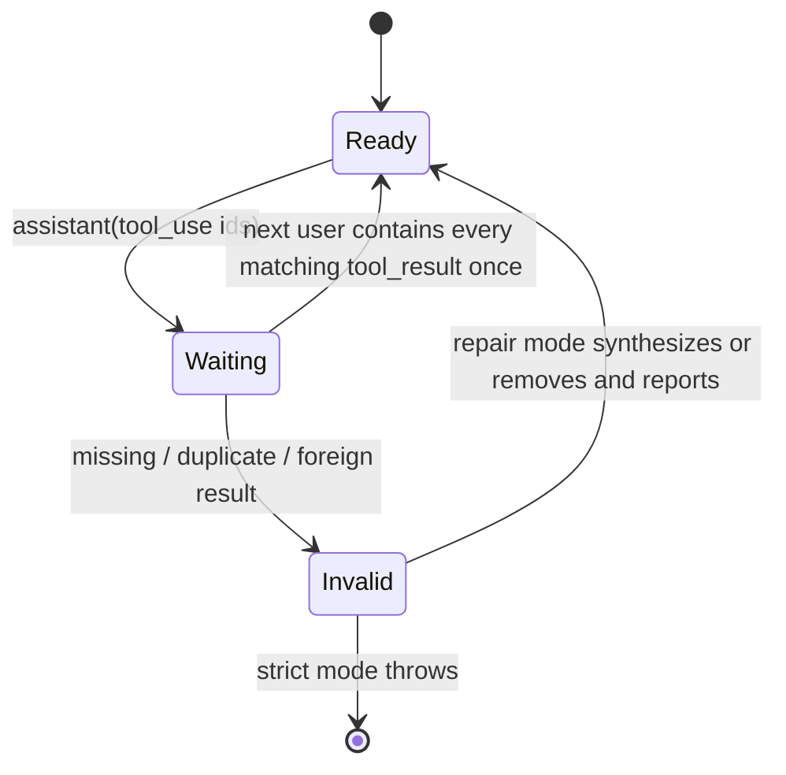

【快照事实】当前 repair 代表性行为包括：

- 为 missing tool use 插入 synthetic error result；
- 移除 orphan result；
- 去掉 duplicate tool use 或 duplicate result；
- 处理某些 server-side tool use 的同消息约束；
- strict flag 开启时，只要需要 repair 就抛错。

为什么 Claude Code 默认愿意 repair？因为 resume、teleport 或旧 transcript 可能留下历史兼容问题。让用户完全无法恢复，代价可能高于插入一个明确的 synthetic error 让模型继续。

为什么累计 Mini Agent Harness 仍选择 strict fail-closed？因为它目前没有历史兼容包袱，而且是作品级教学系统。悄悄修补会掩盖 store、tool loop 或恢复逻辑的 bug。strict 能把错误尽早推回 owner 边界。

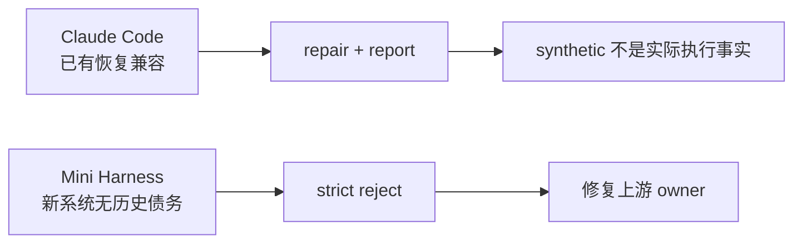

这里没有“哪个永远更好”。企业系统的决策应由恢复成功率、审计要求、错误可见性和历史数据质量共同决定。即使选择 repair，也必须把 synthetic result 标记为 synthetic/error，不能写成工具真实执行成功。

## `messagesForAPI` 仍然不是最终请求

完成 normalize 和 pairing 后，你手里只有合法的 API message list。`src/services/api/claude.ts -> paramsFromContext()` 还要组装：

- 规范化后的 model ID；
- cache breakpoint/edit 后的 messages；
- cache-aware system blocks；
- 经过能力过滤和 schema 转换的 tools；
- `tool_choice`、betas、metadata 和 `max_tokens`；
- thinking 或 temperature；
- context management、output config、speed 等条件字段。

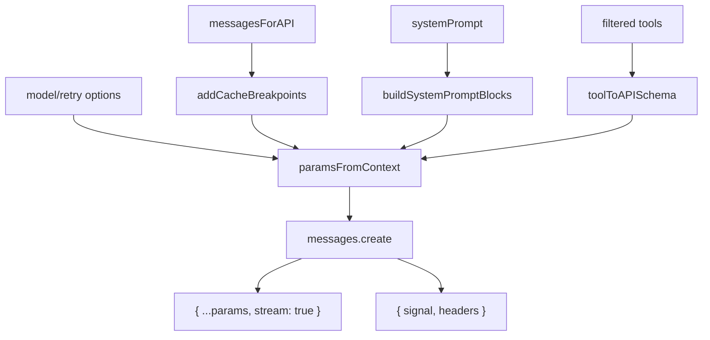

主流式调用约在 `queryModel()` 的 1822 行：

```typescript
anthropic.beta.messages.create(
  { ...params, stream: true },
  { signal, headers },
)
```

注意两个对象的边界：第一参数是 API payload，`stream: true` 在这里加入；第二参数是传输控制，例如取消 signal 和 request headers。事实闸门 A 曾把约 864 行的 non-streaming fallback 当作主路径并得出相反结论，Codex 回到源码后驳回了该意见。这是一个很实用的源码审查经验：**同一个 SDK method 的多个调用点不能靠最近的搜索结果代表主路径，必须沿调用上下文判断。**

`paramsFromContext()` 可能在日志、重试和 fallback 中多次求值，所以某些一次性 cache edits 会在闭包创建前先 consume。M14 会深入 stream、retry 与 usage；本单元只保留“参数构造必须在 protocol projection 后，并且 retry 不能无意重复消费一次性状态”的接口认识。

## 把所有权和可变性重新画一次

到这里，控制流已经很长。现在换成所有权图复习：

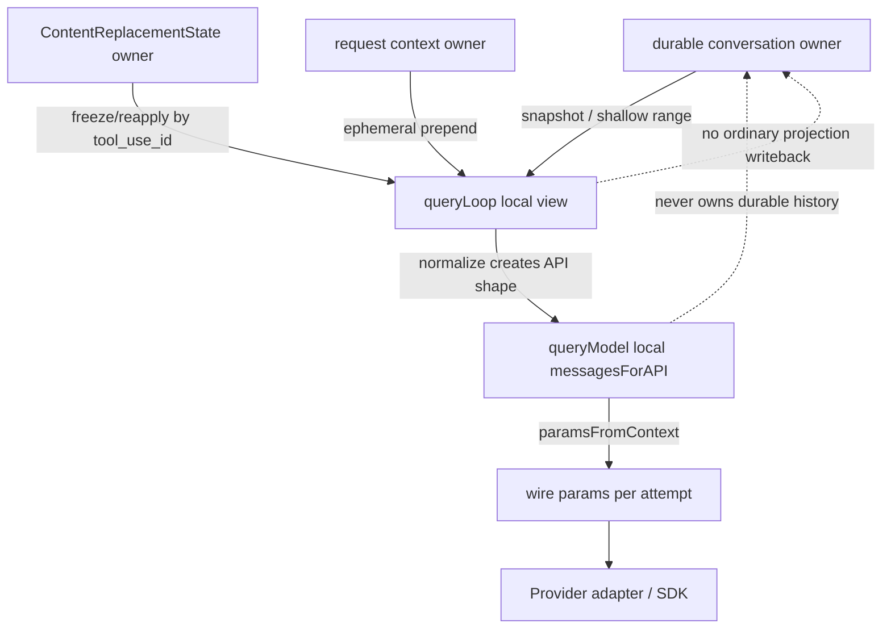

用问题检查自己：

1. tool preview 为什么不能原地覆盖 `ConversationStore`？因为那会把请求成本策略误写成历史事实。
2. replacement state 为什么也不属于 Provider adapter？因为 adapter 应接收已经合法、稳定的 request，不应偷偷改变跨轮语义。
3. user context 为什么不能追加到 durable history？因为 cwd、mode 或临时提示可能下一轮变化，也不是用户说过的话。
4. pairing 为什么要在请求边界再检查一次？因为 history range 和 normalization 都可能改变可见成员，durable 全量合法不自动推出任意 projection 合法。

### 失败、取消和恢复分别落在哪里

请求投影大部分是同步转换，但它仍与异步失败相交：

| 事件 | 应有行为 | 不应发生 |
| --- | --- | --- |
| replacement 外置持久化失败 | 保留原内容并冻结实际已发送形态，记录失败 | 半写 state，下一轮误用不存在的 preview |
| history start 切到 orphan result | strict 拒绝当前请求 | 删除 result 后继续，掩盖错误 boundary |
| normalize 发现非法图片/content | 请求前失败或形成明确诊断 | 交给 Provider 400 后猜原因 |
| 调用前 AbortSignal 已取消 | 不发起新的 SDK 请求 | params 已构造就忽略取消 |
| resume 读到旧配对缺口 | 按产品策略 strict 或显式 repair | 把 synthetic result 当真实执行 |

M13 不深入网络取消，因为 M14 会沿 stream 展开。但你已经能定位：projection failure 是模型调用前的协议失败；transport abort 是调用边界的生命周期失败；两者不应共用一个模糊的“请求失败”状态。

## 用双语言实验把“看起来合理”变成可反驳结论

实验目录：

```text
curriculum/units/M13/code/typescript
curriculum/units/M13/code/python
```

它们是 clean-room 运行验证，不是 Claude Code 私有实现复制。两种语言遵守同一行为目标：

- 从最后 boundary 选择 view，durable source 不变；
- context 在 normalize 前临时注入；
- progress/boundary 被过滤，attachment/local output 转成 user；
- tool result 按 API user group 预算；
- replacement state 冻结跨轮决定；
- strict pairing 拒绝非法请求，repair 返回明确报告；
- 最终 params 在 projection 后创建并冻结。

### 先运行基线

TypeScript：

```powershell
cd "D:\agent\Claude code最新\curriculum\units\M13\code\typescript"
node --test --experimental-strip-types .\request-projection.test.ts
& '..\..\..\..\..\mini-agent-harness\node_modules\.bin\tsc.cmd' -p .\tsconfig.json --noEmit
node --experimental-strip-types .\demo.ts
```

Python：

```powershell
cd "D:\agent\Claude code最新\curriculum\units\M13\code\python"
python -m unittest -v
python .\demo.py
```

当前验证结果为 TypeScript `9/9`、strict typecheck 通过，Python `8/8`。不要只看绿色结果，接下来逐个理解它们怎样反证错误实现。

### 实验一：source 与 request view 不是同一个对象

fixture 在 boundary 前放旧问题，boundary 后放新问题、progress、tool result 和 attachment。投影后断言：

- 输出中没有旧问题、progress 和 boundary；
- 输出中存在 context 与 attachment 转换结果；
- source 仍保留完整历史和完整 tool output。

反证条件是任何 nested payload 被改写。TypeScript 用 `structuredClone` 前后比较，Python 用 `deepcopy`。这不能证明任意并发安全，但能直接击穿“projector 为省内存原地裁剪”的错误实现。

### 实验二：全局预算是错的

构造两个不同 assistant response，各有一个 80 字符 result，预算为 100。正确结果是两个 group 都不替换；全局算法会看到 160 并错误替换一个。

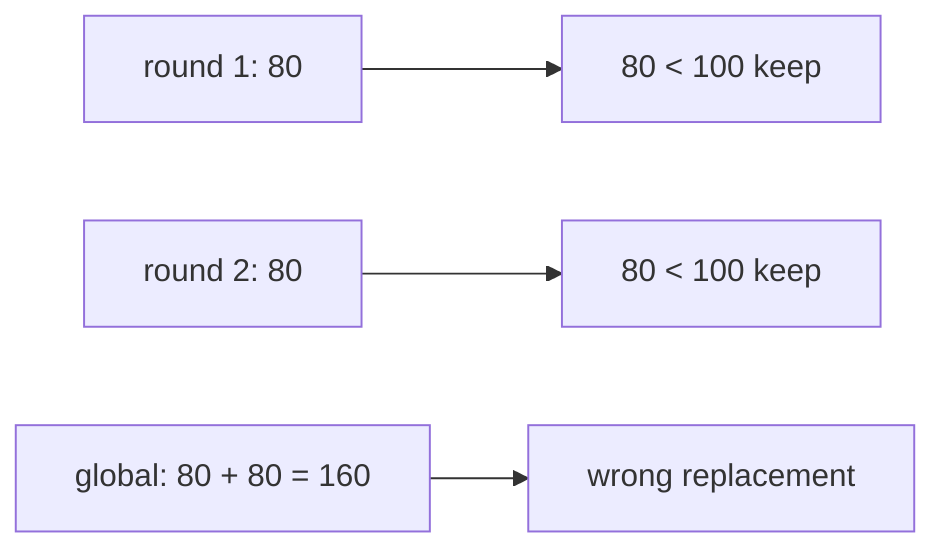

这项测试来自 FACT_B 的有效批评，但我们纠正了审查中的另一个误解：相邻 user envelopes 如果 normalize 后会合并，就必须属于同一预算 group，不能各算一次。

### 实验三：跨轮 state 决定缓存前缀

第一次使用低预算，`call-1` 被替换；第二次把预算提高到 1000，但复用同一 state。正确输出仍是同一 preview。如果第二轮恢复全文，说明实现每轮重算，没有稳定 owner。

另一个测试先让 60 字符 A 可见并冻结，再加入 20 字符 B，使 70 预算超限。正确选择只能替换 fresh B，不能回头替换更大的 A。

这两个测试分别验证：

- already-replaced 必须 byte-stable reapply；
- seen-visible 必须 frozen，不允许改变旧 prefix。

### 实验四：strict 与 repair 的语义差异

删除 `call-1` 的 result：strict 抛 `ProjectionError`；repair 插入 `[missing tool result repaired]`，同时在 report 记录 ID。

修改实验，让 repair 插入一个看似成功的 `is_error: false` result。测试可能仍能通过配对形状，但语义已经错了：模型会把未执行操作当成成功。这说明结构合法性和事实真实性是两条约束。

### 一个真实发现的状态机错误

最初实验在确认 assistant 后的 tool-result 配对时，没有同步推进 message cursor。下一轮循环又看到同一个 result，于是把合法 result 判成 orphan。修复不是增加一个 `if` 跳过，而是明确状态机动作：一旦消费 `assistant + next user results` 这一对，cursor 必须一次跨过两个 API messages。

这类错误很适合面试：协议校验器最危险的 bug 往往不在条件判断，而在“确认状态后是否完成了对应消费”。

## TypeScript 和 Python 不需要长得一样

TypeScript 实验使用 discriminated union：

```typescript
type DomainMessage =
  | { kind: 'human'; ... }
  | { kind: 'assistant'; ... }
  | { kind: 'tool-result'; ... }
```

`switch (message.kind)` 既做运行时分派，也让编译器在 `assertNever()` 处检查遗漏。Python 使用 frozen dataclass 与 `Literal`，但运行时仍需要显式 `else` 抛错。它们目标相同，保障强度不同。

`ContentReplacementState` 在 TypeScript 中持有可变 `Set`/`Map`。注意 `Object.freeze(state)` 也不会禁止 `state.seenIds.add()`，因为 freeze 只冻结对象属性槽，不冻结集合内部。这里的可变性是有意的 owner state，不能靠表面 freeze 自欺。

Python 的 dataclass 则明确不使用 `frozen=True` 保存 replacement state，其他 request/result 数据保持 frozen。这个对比把“哪些对象可变”变成设计选择，而不是统一风格规定。

## 把实验合进 Mini Agent Harness，而不是复制 Claude Code

累计 Harness 的 M13 合入点是 `mini-agent-harness/typescript/agent/requestProjector.ts` 和 Python `agent_runtime.py`。新增能力：

```text
RequestProjectionPolicy
  historyStart / history_start
  userContext / user_context
  maxToolResultChars / max_tool_result_chars
  toolResultPreviewChars / tool_result_preview_chars

RequestProjectionReport
  source/selected/projected counts
  omitted before history start
  replaced tool-result count
  context injected boolean
  strict validation status
```

运行路径现在是：

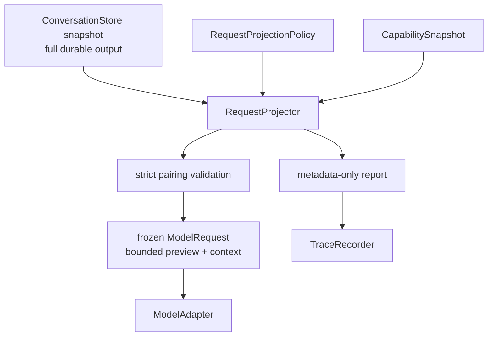

### 合入了什么

- history start 选择；
- request-only context；
- 单个 result 的有限 deterministic preview；
- projection 后的 strict pairing；
- 不含内容的 report 和 Trace；
- durable source 不变的双语言测试。

### 为什么 Harness 没复制 aggregate budget 与外置存储

当前作品级 Harness 的目标是建立正确 owner 和扩展点，不是实现 Claude Code 的全部生产规模。它对单个 result 做明确上限，已经能证明“完整事实保留在 Store，模型只看 preview”。aggregate API grouping、外置大结果文件、resume replacement record 和 Prompt Cache edit 需要和 H3 的 Context/Transcript 一起设计，否则会产生半套恢复协议。

所以裁决是：

- `merge`：policy、report、history start、ephemeral context、bounded preview、strict validation；
- `defer`：真实 compact transaction、aggregate budget、外置存储、snip/collapse、cache edit、resume record；
- `reject`：在 Store 内原地截断，或在 Provider adapter 中偷偷修补且不返回 report。

这不是“功能缩水”。恰当的作品项目应能说明边界和演进依赖。比起堆一个没有恢复语义的 `VectorMemoryManager` 空接口，这种取舍更能承受资深面试追问。

### Trace 为什么只记计数

`request.projected` 记录 source/selected 数量、history omission、replacement count、context 是否注入和 strict 状态，不记录 prompt、context 文本或工具输出。这样可以回答“为什么 token 突然下降”和“本轮是否发生替换”，又不会把敏感内容复制到第二个持久化面。

TypeScript 集成测试确认 Provider 看到 preview，`ConversationStore` 仍保留完整 output，Trace 两边都不含正文。当前首轮验证为 TypeScript Agent `23/23`、Python Agent `12/12`，strict typecheck 通过。阶段末还会运行 H2/H1/S0 累计回归。

## 迁移到 Java/Spring：把 projector 做成显式应用端口

Java 版本不要让 JPA Entity 直接变成 Provider DTO。可以定义：

```java
public interface RequestProjector {
    ProjectionResult project(
        ConversationSnapshot conversation,
        CapabilitySnapshot capabilities,
        RequestContext context,
        ProjectionPolicy policy
    );
}
```

`ProjectionResult` 同时返回 immutable request 与 metadata report。`ConversationRepository` 只负责 durable state，Anthropic/OpenAI adapter 只负责 lowering 和 transport。

Spring 装配可以是：

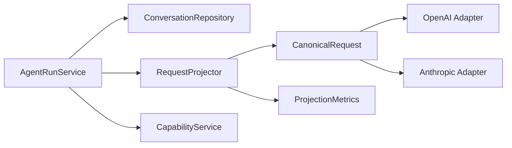

有三个生产注意点：

1. replacement state 需要按 conversation/thread 分区，不能放成 Spring singleton 的裸 Map；
2. 多实例部署要决定单 writer、数据库版本号或分布式锁，不能靠进程内 `ConcurrentHashMap`；
3. report 与正文数据分库存储或分级脱敏，避免可观测平台成为 prompt 副本仓库。

如果系统使用 RAG，检索结果也应进入 request-local context，而不是默认写入用户事实。真正需要审计的检索证据可以单独持久化 `RetrievalRecord`，再由 projector 决定本轮展示哪部分。这样“可恢复证据”和“模型可见文本”仍是两个对象。

## 与 LangGraph 的关系：state channel 不等于 Provider request

LangGraph 节点 state 中可能保存完整 `messages`，pre-model hook 或 model node 再选择要发送的 view。框架帮你调度节点，不会自动替你决定：

- compact boundary 的持久化语义；
- tool result 超限后的 preview 是否跨轮稳定；
- Provider role 的 canonical normalization；
- repair 是否允许写回 state；
- trace 能否记录正文。

迁移时可以把 `ConversationState`、`ProjectedRequest`、`ProviderPayload` 设为三个独立 schema。不要为了方便让 model node 就地覆盖 graph state 中的 messages，否则 checkpoint 恢复看到的已经是裁剪结果。

## 企业系统里，请求投影也是治理边界

当 Agent 进入生产，请求投影不只控制 token，它还承担数据治理：

- PII 或租户敏感字段能否进入外部模型；
- 哪些 tool output 只留审计摘要，正文放对象存储；
- 每个模型/地区允许的 media 与 data residency；
- 缓存 key 是否跨租户隔离；
- projection policy 改版如何灰度和回滚；
- repair 数量突然上升是否意味着 transcript 损坏。

可以建立这些不含正文的指标：

```text
projection_source_messages
projection_selected_messages
projection_omitted_messages
projection_replaced_tool_results
projection_repair_total{reason}
projection_validation_failures{provider,model}
request_estimated_tokens_before_after
```

再为关键 SLI 设边界：

- strict validation failure rate；
- Provider 400 中 protocol error 比例；
- projection latency P95/P99；
- repair 后成功恢复率；
- cache prefix hit rate；
- 请求 token 与 durable token 的压缩比。

不要给每条消息做高基数 ID label，也不要把 preview 内容写进 metrics。需要定位具体 run 时，用受控 trace ID 回到权限隔离的 transcript 系统。

## 资深 Agent 开发岗面试：从投影讲到系统设计

下面的问题不是背诵题库。先独立口述，再对照参考回答。每个回答刻意采用面试现场能组织出来的节奏：第一句给结论，然后讲机制、源码锚点、失败边界和迁移。

### 问题 1：为什么 Agent 的会话历史不能直接作为 LLM API 的 messages？

**两分钟回答：**结论是，会话历史和模型请求是两个生命周期、两个约束集合，必须经过显式投影。会话历史要保存用户、assistant、tool result、进度、压缩边界等完整事实，服务 UI、恢复和审计；Provider 请求只接受特定 role/content 形状，还受上下文窗口、模型能力和 tool pairing 约束。Claude Code 在 `queryLoop()` 里先从 `State.messages` 派生 `messagesForQuery`，做 boundary、tool-result budget、snip、microcompact 等 request view 处理，再在 `queryModel()` 里用 `normalizeMessagesForAPI()` 过滤、合并、转换，最后 `paramsFromContext()` 加入 system、tools、cache 和 thinking。我的 Harness 也把 `ConversationStore` 与 `RequestProjector` 分开，projection 返回 report，不修改 durable output。这样 Provider 切换、Context 策略和审计都不会污染会话事实。

### 问题 2：compact boundary 为什么被 slice 结果包含，最后却没发给模型？

**两分钟回答：**结论是，它是内部投影语义和外部协议过滤的两阶段设计，不是一个地方先加再随意删。`getMessagesAfterCompactBoundary()` 从最后 boundary 开始 slice，保留 boundary，后续 snip 或内部逻辑仍能观察它；进入 `normalizeMessagesForAPI()` 后，boundary 作为普通 system envelope 被 filter，所以不会成为 Provider message。这个设计也说明 compact boundary 选择的是 model-visible history start，不等于删除 REPL 或 transcript 中的旧事实。迁移到企业系统时，我会让 boundary 成为 checkpoint metadata 或专门 event，而不是伪装成人类消息，并在 projector 测试“旧历史不可见但 source 不变”。

### 问题 3：大工具结果每轮重新按预算裁剪不行吗，为什么还需要 state？

**两分钟回答：**结论是不行，无状态重算会让过去请求前缀发生变化，破坏 Prompt Cache，也会让模型对旧事实的可见形态不稳定。Claude Code 用 `ContentReplacementState` 按 `tool_use_id` 记录 seen IDs 和 replacement string。第一次保留全文的结果以后 frozen，不能因为新结果加入再回头裁；第一次替换的结果以后从 Map byte-identical 重用 preview。预算还要按 normalize 后的 wire user group 估算，而不是每个内部 envelope 或全局池。并发上，seen 和 replacement 是一个业务原子决策，不能只说用了线程安全 Map。我的课程实验专门用提高预算和加入 fresh result 两个反例验证这条不变量。

### 问题 4：`normalizeMessagesForAPI()` 和普通 DTO Mapper 有什么区别？

**两分钟回答：**结论是它更像协议编译器或 anti-corruption layer，因为它不只改字段名，还会改变成员、顺序、role 和 block 结构。Claude Code 会过滤 virtual、progress、普通 system 和 synthetic API error，把 local command、attachment 转成 user 表达，合并连续 user 和相同 response ID 的 assistant fragments，把 tool result 调整到合法位置，再处理 thinking、media、tool reference 和图片校验。DTO Mapper 通常假设语义一一对应，这里明显不是。工程上我会先定义 provider-neutral canonical request，再分别 lowering 到 Anthropic/OpenAI，并给每个改变语义的 pass 建反例测试，避免把逻辑散落在 HTTP adapter。

### 问题 5：tool pairing 应该 repair 还是 strict fail-closed？

**两分钟回答：**结论是取决于系统是否承担历史兼容与恢复责任，但 repair 必须显式、可审计，不能伪造成功。Claude Code 的 resume/teleport 可能遇到旧 transcript 缺失、orphan 或 duplicate，所以 `ensureToolResultPairing()` 可以插入 synthetic error result 或移除非法 result；strict flag 则在需要 repair 时抛错。我的新 Harness 没有历史债务，默认 strict，这样 Store 或 Tool Loop 的 bug 会尽早暴露。企业系统如果启用 repair，我会把 synthetic 标记、reason、原 trace ID 和 repair metric 保留下来，并限制它只发生在恢复入口，不让普通实时路径靠 repair 掩盖一致性问题。

### 问题 6：请求已经 normalize 完，为什么还不能直接发送？

**两分钟回答：**结论是 normalize 只得到合法消息，完整请求还需要模型能力和本次传输上下文。Claude Code 的 `paramsFromContext()` 继续加入 model、cache-aware messages、system blocks、tool schemas、tool choice、betas、metadata、max tokens、thinking 或 temperature、context management 和 output config。主流式调用再把 `stream: true` 合入第一参数，把 AbortSignal 和 headers 放到第二个传输 options。重试时 params 可能重建，所以一次性 cache edit 不能在每次 closure 求值时重复消费。这个层次拆分让我能分别测试消息语义、模型能力矩阵和网络生命周期。

### 问题 7：怎样观测请求投影，又不泄漏 prompt 和工具结果？

**两分钟回答：**结论是默认记录结构变化和相关 ID，不复制正文。我的 Harness 的 `RequestProjectionReport` 只含 source/selected/projected count、history omission、replacement count、context injected 和 strict validation，Trace 也只收这些标量。需要排障时，用 run/request ID 回到权限受控的 transcript，而不是把 tool output 放进日志平台。生产上我会看 validation failure、repair rate、before/after token、projection latency 和 cache hit，并禁止高基数 message ID 做 metrics label。这样既能发现策略回归，也不会让可观测系统成为第二份敏感对话库。

### 问题 8：如果让你在 Spring AI 或 LangGraph 中复现这套设计，最先拆哪三个对象？

**两分钟回答：**结论是先拆 `ConversationSnapshot`、`ProjectedRequest` 和 `ProviderPayload`，而不是先挑框架节点。Snapshot 是 durable fact，Projector 根据 context、capability、budget 和 policy 派生 canonical request，Provider adapter 再做 Anthropic/OpenAI lowering 与 transport。replacement state 按 conversation 分区，有 revision 或 single-writer 保护；projection 同时返回 metadata report。LangGraph 可以负责节点调度和 checkpoint，Spring 负责装配与端口，但都不能替代这三个对象的 owner 和不变量。这样未来加 RAG、PII 过滤、模型路由或 compact 时，不会就地改坏 checkpoint state。

## 离开本单元前，完成一次闭环

不要用“我看懂了”结束。按下面顺序验证：

1. 不看正文，画出 durable、query、API、wire 四层，并给每条边写动作。
2. 从 `src/query.ts -> queryLoop()` 定位 `messagesForQuery` 的创建、budget、snip、microcompact、collapse、autocompact 和 user context 顺序。
3. 从 `normalizeMessagesForAPI()` 选择一个 filter、一个 convert、一个 merge，解释它们保护的 Provider 不变量。
4. 手工构造 missing、orphan、duplicate 三种 pairing，预测 strict/repair 结果。
5. 运行 17 个双语言测试，删除 grouping 或 replacement state，确认反例真正变红。
6. 在 Mini Harness 设置 tool preview，证明 Store 保留全文、Provider 只见 preview、Trace 不含两者正文。
7. 用两分钟回答“为什么会话历史不能直接发给模型”，再让同伴追问 cache、恢复和多实例 owner。

进阶修改另计：

- 把 Harness 的静态 `historyStart` 改成版本化 ContextView policy，同时防止切到 orphan result；
- 为 aggregate API user-group budget 设计 provider-neutral IR，但暂不实现外置存储；
- 在 Java 中用单 writer actor 维护 replacement state，注入持久化失败并验证原子 publication；
- 为 repair mode 设计 synthetic provenance，要求任何下游都不能把它统计成真实工具成功。

## 源码定位地图

【快照事实】核心定位以符号为主，行号只作当前快照辅助：

| 机制 | 文件与符号 | 决定性语义 |
| --- | --- | --- |
| 本轮请求 view | `src/query.ts -> queryLoop()` | 从 durable messages 派生局部 view，并按固定顺序处理 |
| compact history start | `src/utils/messages.ts -> getMessagesAfterCompactBoundary()` | 从最后 boundary slice，boundary 后续由 normalize 过滤 |
| 大结果预算 | `src/utils/toolResultStorage.ts -> applyToolResultBudget()` / `enforceToolResultBudget()` | API group、fresh/frozen/reapply、独立 state、可恢复 record |
| request-only user context | `src/utils/api.ts -> prependUserContext()` | meta user 前置，test mode 短路，不写 durable history |
| API 协议编译 | `src/utils/messages.ts -> normalizeMessagesForAPI()` | filter/convert/merge/reorder/sanitize/validate |
| tool pairing | `src/utils/messages.ts -> ensureToolResultPairing()` | repair 与 strict 两种产品语义 |
| post-compact view | `src/services/compact/compact.ts -> buildPostCompactMessages()` | autocompact 后替换当前 view |
| Provider 参数 | `src/services/api/claude.ts -> queryModel()` / `paramsFromContext()` | system/tools/cache/model/thinking 与流式调用装配 |

【运行验证】本单元的 TypeScript/Python 实验验证 clean-room 投影契约，不证明运行了 Claude Code 产品。

【设计迁移】Mini Agent Harness 的 `RequestProjectionPolicy`、metadata-only report、单结果 preview 和 strict 默认值是课程方案，不是 Claude Code 私有类型的复刻。

带着这四层对象进入 M14：下一步不再问“请求里有哪些消息”，而是问 `messages.create(stream=true)` 返回的 SSE 片段怎样被消费、聚合、取消、重试并形成 assistant message。只有先把请求边界钉牢，流式响应的 owner 才不会再次和 durable conversation 混在一起。

