# M14 真实模型流：一条 SSE 怎样成为 Agent 能继续执行的消息

> 本单元主体建议 5 至 7 小时。运行双语言实验、注入故障和完成扩展挑战另计。

M13 的最后，我们得到了一份已经合法、冻结、可以送往 Provider 的 wire request。最容易产生的错觉是：接下来只剩 `await client.messages.create(...)`，等模型返回一条 assistant 消息。

真实 Agent Harness 不能这样理解。模型返回的不是一条完整消息，而是一串会暂停、重试、乱序暴露业务语义、被取消，甚至在已经产生部分工具调用后改走第二次请求的事件。Harness 必须同时回答：谁组装 block，什么时候允许上层看见 assistant，终态 usage 写给谁，消费者不再读取时谁释放 socket，以及失败后的“再请求一次”会不会让真实世界发生两次副作用。

先看整条路。本单元从 M13 的 wire params 开始，到 Query Loop 可消费的消息为止；工具真正怎样执行留到 M15。

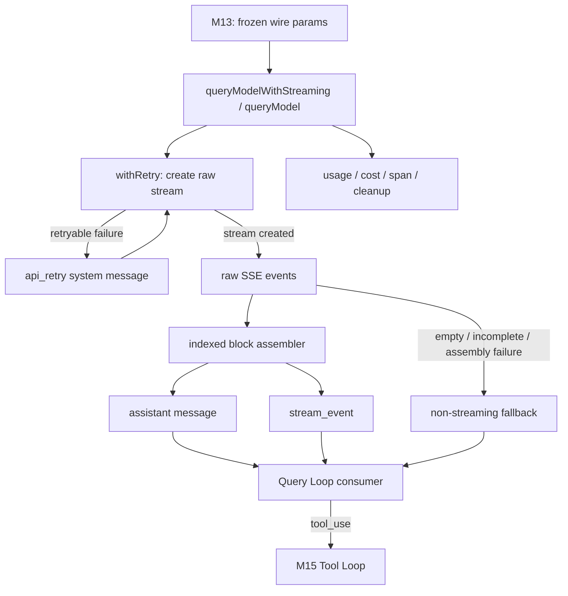

这张图先给出五个 owner：`withRetry()` 拥有“创建出流之前”的重试；`queryModel()` 拥有网络流和组装状态；`queryLoop()` 拥有模型切换和 partial attempt 的上层收敛；入口拥有用户取消信号；消费者拥有继续拉取还是关闭 generator 的决定。后面所有异常都要先问“发生在哪个 owner 的边界”，不能笼统说成 API 报错。

## 从一次请求开始，而不是从 SSE 名词开始

假设用户让 Claude Code “读取 `package.json` 并解释脚本”。M13 已把历史、临时上下文和工具定义投影成 wire params。Provider 可能依次发出：

```text
message_start
content_block_start(index=0, tool_use)
content_block_delta(index=0, partial_json='{"path":')
content_block_delta(index=0, partial_json='"package.json"}')
content_block_stop(index=0)
message_delta(stop_reason='tool_use', usage=...)
message_stop
```

如果把每个 delta 都当消息保存，历史里会出现半截 JSON；如果只等 `message_stop`，工具就无法尽早进入调度；如果 `content_block_stop` 立刻交出 assistant，稍后才来的 usage 和 `stop_reason` 又怎样回到同一个对象？这就是本单元的核心矛盾：**业务消息需要尽早可见，终态字段却更晚才到。**

当前快照的决定性路径在：

```text
src/services/api/claude.ts
-> queryModelWithStreaming()
-> queryModel()
-> withRetry()
-> messages.create({ ...params, stream: true }, { signal, headers }).withResponse()
-> for await (const part of stream)
```

`queryModelWithStreaming()` 是对录制/回放等能力的外壳，核心组装仍在 `queryModel()`，不是两套平行实现。`queryModelWithoutStreaming()` 也不是另一个协议解析器：它完整消费同一个 generator，取出最终 assistant。这里“完整消费”很重要，稍后会看到，生成器最后一次 `yield` 后仍有成功日志和收尾代码；只取到消息就停止，会改变生命周期语义。

### 流创建之前，重试消息已经可能出现

`withRetry()` 接收一个创建请求的 operation。它内部持有 attempt、client、连续 overload 计数和可变 `RetryContext`。一次 attempt 失败后，它可以刷新 client、读取 `Retry-After`、调整 fast mode 或 token override，先向上游 `yield` 一条 `api_retry` 系统消息，再等待并重试。只有 operation 成功时，generator 的 return value 才是真正的 raw stream。

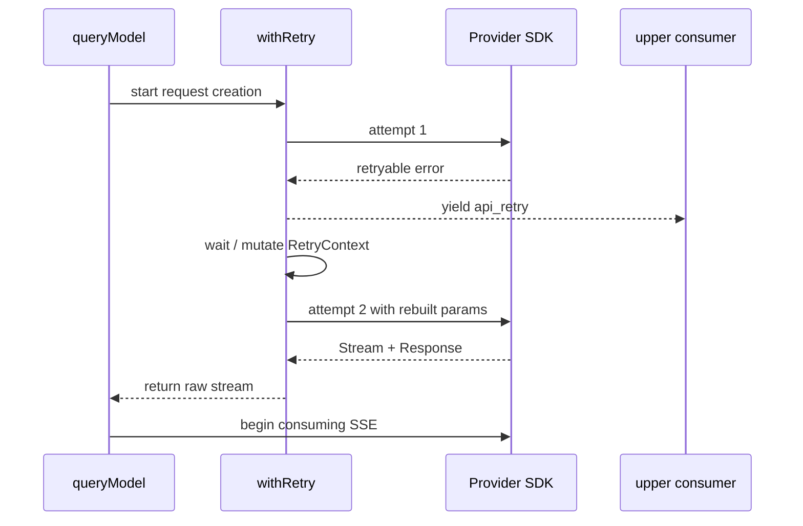

所以 `api_retry` 不是 Provider SSE 的一种，也不是 assistant 内容。它是 Harness 在“还没创建出可消费的 response stream”时暴露的运行事件。把两者混在一个 parser 里，会让网络协议、重试策略和 UI 消息互相污染。

对 Java 学习者，可以把 `withRetry()` 想成一个会发出进度事件、最终返回资源句柄的异步拦截器；但普通 Spring Retry 只返回最终值，不能直接表达中间 `yield`。对 Python 学习者，它更接近一个 async generator：`yield` 是可见进度，`return` 是内部控制结果。M12 已讲过这两个通道不能混同，此处它们第一次直接改变网络请求语义。

## raw event 到 assistant：组装器是一台按 index 工作的状态机

SSE parser 只负责把字节还原为事件对象；它不知道什么叫“一条可执行的工具调用”。`queryModel()` 维护 `partialMessage`、`contentBlocks[index]`、`usage`、`newMessages` 等状态，把协议事件编译成 Harness 消息。

为什么必须按 `index` 存 block？一个 response 可以包含 thinking、text、tool_use 等多个 block。delta 只携带它所属的 index；若只维护“当前 block”，稍微出现交错、漏事件或错误 index 就会把文本拼进工具 JSON。正确的最小心智模型如下：

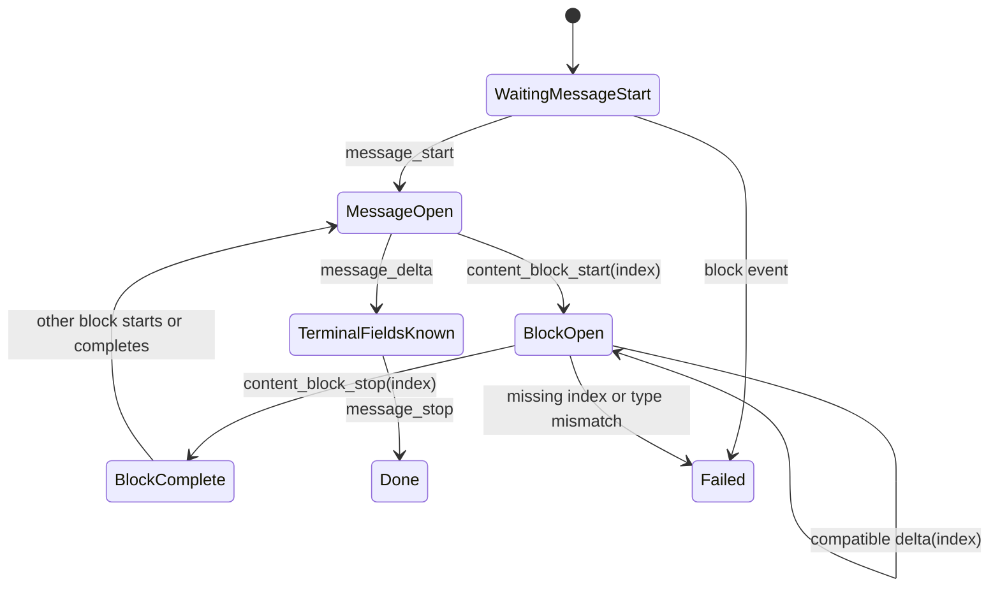

源码在 `content_block_start` 时为对应 index 建立空槽。text 从空字符串开始，thinking 从空 thinking/signature 开始，tool input 从空 JSON 片段开始。它没有把 start event 中可能携带的初始文本再拼一次，这是为了避免 SDK 的 start 内容与后续 delta 重复。

接着，`content_block_delta` 必须同时满足两个条件：index 已存在，delta 类型与 block 类型相符。`text_delta` 不能写入 tool block，`input_json_delta` 不能写入 text block。当前源码会显式失败，而不是为了“尽量可用”静默忽略。对 Agent 来说，静默拼错工具参数比明确失败危险得多，因为前者可能执行一个语法合法但语义错误的命令。

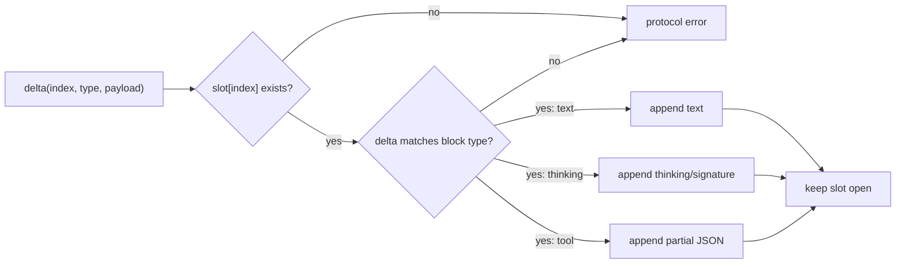

这也是 TypeScript discriminated union 在真实协议里的价值。`event.type` 和 `delta.type` 缩小了联合类型，`switch` 的每个分支只能访问相应字段；它不只是让编辑器补全，而是把“哪些状态转换合法”写进实现结构。Java 可用 sealed interface + pattern switch 表达，Python 可用 dataclass union 配合显式 `isinstance`，但 Python 的类型提示不会替你阻止运行时错配，所以实验仍需 fail-closed 校验。

### 为什么 tool JSON 要到 stop 才解析

`{"path":` 不是坏 JSON，只是尚未完成。每个 `input_json_delta` 到达时都 `JSON.parse`，会把正常传输误判为失败。组装器先累积字符串，到 `content_block_stop` 才解析完整对象；解析失败或顶层不是 object，才真正拒绝。

这条设计可以迁移为一个普遍原则：**协议片段的局部非法，不等于完成对象非法；验证应放在对象获得完整性保证的边界。** 但完整性边界之后不能继续宽容，否则错误会进入 Tool Loop。

## 最反直觉的时序：assistant 先出现，终态字段后到

到 `content_block_stop`，一个 block 已完整，源码立即创建并 `yield` 一条 assistant message，然后才 `yield` 对应的 raw `stream_event`。到稍后的 `message_delta`，usage 和 `stop_reason` 才完整。源码会直接修改最后一个已经 yield 的 assistant 的嵌套 message。

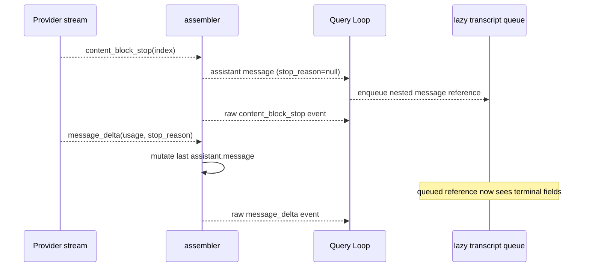

这里不是随意的可变对象写法。`QueryEngine` 对 assistant transcript 使用 fire-and-forget 写队列，队列持有 `message.message` 的嵌套引用，并延迟序列化。如果 `message_delta` 时创建一个新外层对象，甚至替换嵌套 `message`，写队列仍指向旧对象，最终 transcript 可能永远保留 `stop_reason=null` 和旧 usage。直接 mutation 保住了已交付引用的身份。

这与 M10 的“durable history 不应被请求投影原地修改”不冲突。两个规则作用在不同所有权边界：

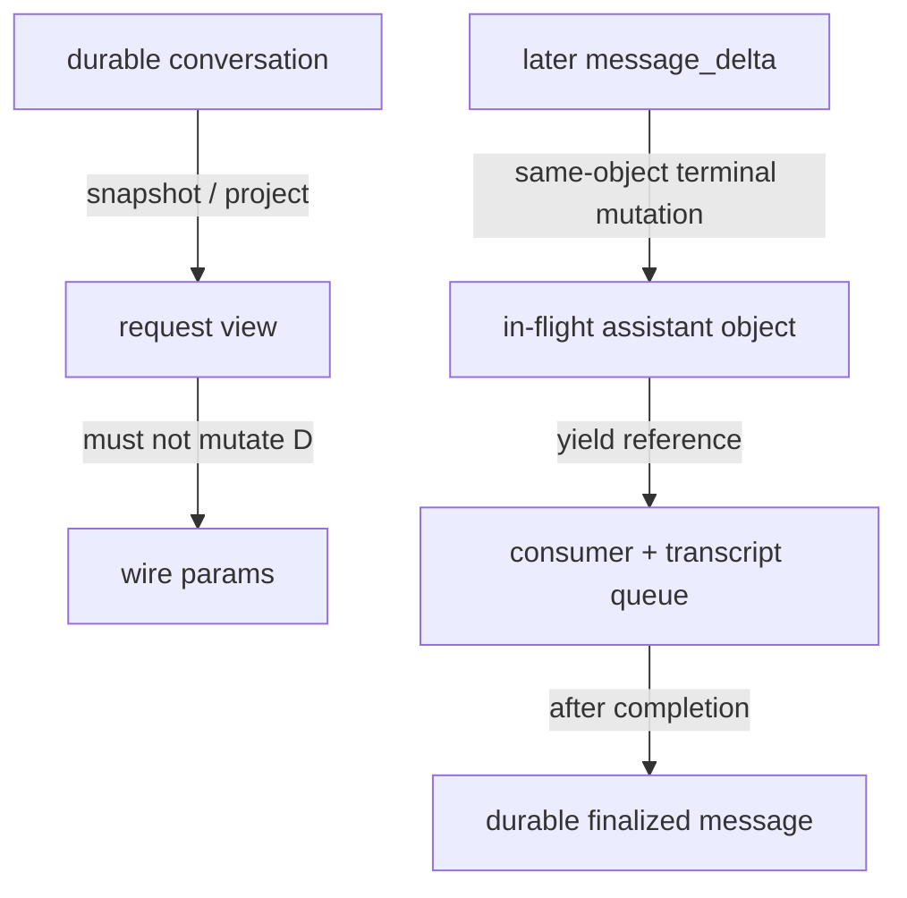

M13 保护 source 不受临时投影污染；M14 在一个尚未终结的 response 内维护对象身份。关键不是“永远 immutable”或“永远 mutable”，而是明确对象正处在哪个生命周期、谁已经持有引用、何时冻结。

有多个 content blocks 时，当前快照会产出多条 assistant messages：它们共享底层 API message id，但各有 Harness uuid。最终 usage 和 stop reason 只写到最后一条，避免每个 block 重复计费；后续正规化可以按 API message identity 合并内容。不要把“一个 Provider response”“一个 content block”“一个 Harness message”当成同一粒度。

## 每个 raw event 的固定处理顺序

一次 `for await` 取到 part 后，大致顺序是：先重置主动 idle watchdog，记录被动 stall gap，再更新 assembly state，可能先 yield 内部 assistant/error message，最后转发对应的 `stream_event`。

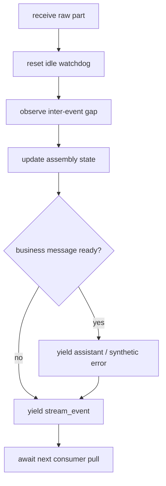

“最后 await next pull”提醒我们：这是 pull-based async generator。消费者处理很慢时，producer 不应无限把事件塞进内存。Claude Code 的真实网络流与 generator 之间有 SDK/stream 行为；clean-room Harness 又额外明确了固定容量、单消费者的 `AgentRunStream`，让背压成为可测试契约，而不是依赖偶然速度。

## 三种 fallback，三个 owner

工程里最危险的概念混淆之一，是把所有“再试一次”都叫 retry。当前路径至少有三种不同动作。

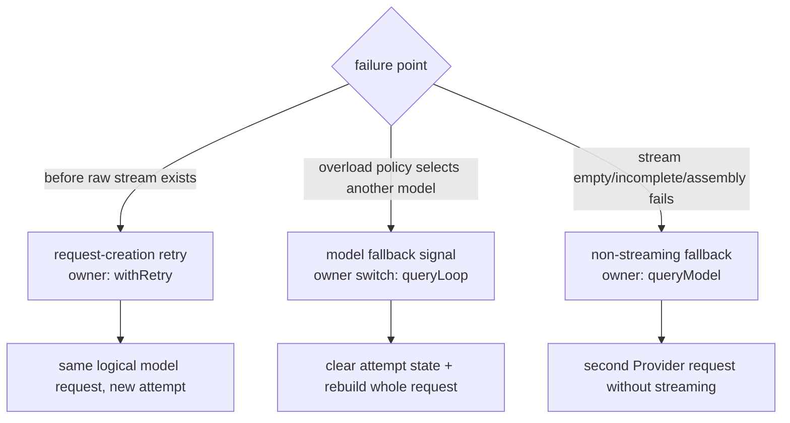

第一种发生在 raw stream 交出之前。`withRetry()` 可以重建参数并产生 retry notice，最终失败包装为 `CannotRetryError`，保留 retry context。

第二种由 overload 等策略触发。`withRetry()` 抛 `FallbackTriggeredError`，`queryModel()` 不能吞掉它；真正修改 `currentModel`、清理 partial attempt、重建 executor 并重跑请求的是 `queryLoop()`。模型选择属于 Query Loop 的会话轮次控制，不属于 SSE assembler。

第三种发生在 stream 已经创建之后。空流、不完整流、组装错误或 idle timeout 可以促使 `queryModel()` 发起 non-streaming 请求。若上层已看到 partial assistant，`onStreamingFallback` 会通知 `queryLoop()` tombstone 旧消息并丢弃旧 executor 结果。

### tombstone 不是 rollback

假设 partial stream 已完整产出一个 `tool_use(deleteFile)`，M15 的 streaming tool executor 已启动工具；随后流断裂，non-streaming fallback 又返回相同调用。把旧 assistant 标成 tombstone，只能让它不再参与后续消息语义，不能撤销文件删除。第二个调用仍可能重复副作用。

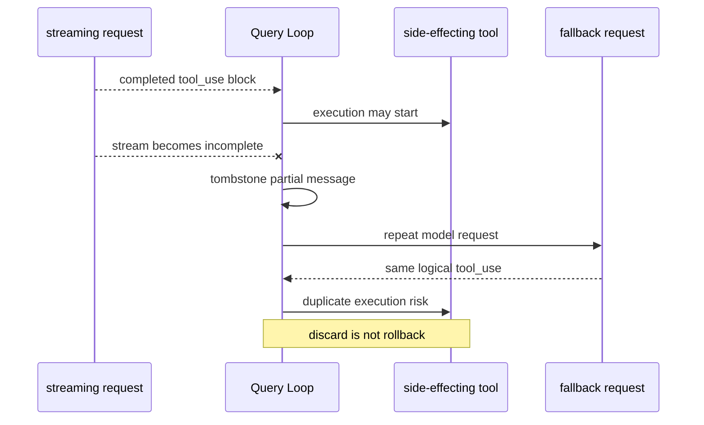

因此源码提供禁用 mid-stream fallback 的开关。迁移到企业 Harness 时，有副作用工具至少需要 stable call id 和 idempotency ledger；更保守的策略是在 partial tool 已暴露后禁止透明重放，转为显式失败和人工/上层恢复。数据库事务也不是万能答案：发邮件、调用第三方支付、操作外部 SaaS 无法由本地事务回滚。

## abort、timeout、watchdog 和 close：四个相似表象

“流停止了”不能直接等价为“用户取消”。至少要区分四条原因链。

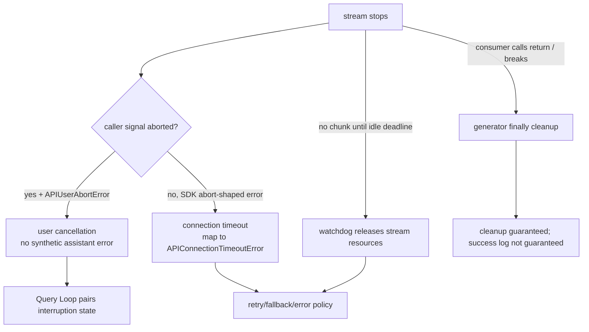

真实用户取消需要 caller 的 `AbortSignal` 已经 aborted。此时 API 层不伪造 assistant error，由 Query Loop 负责 interruption 以及未配对 tool result 的收敛。若 SDK 抛出 abort 形状的异常，但 caller signal 没有取消，它被映射为连接超时；否则监控会把基础设施超时错误算成用户行为。

watchdog 处理另一类失败：连接没有明确报错，却长时间没有新 chunk。被动记录“上一个 chunk 到这一个 chunk 的间隔”无法发现永远不来的下一个 chunk，所以源码还设置主动 timer；超时回调释放 SDK stream controller 和底层 Response body。后者可能持有 V8 heap 之外的 TLS/socket buffer，等待 GC 不等于及时释放网络资源。

consumer close 则来自反方向：上层拿到足够信息后对 generator 调 `.return()`，或 `for await` 提前 break。JavaScript 会进入 generator 的 `finally`，所以 stream 和 Response 仍会释放；但最后一次 `yield` 后面的普通成功日志不保证执行。`queryModelWithoutStreaming()` 必须 drain 完整 generator，不能拿到第一条 assistant 就返回。

这里可以形成一个实用审查问题：某段清理是否放在 `finally`，还是只写在最后一次 `yield` 之后？前者属于所有退出路径，后者只属于自然耗尽路径。

## usage、cost、TTFT 和 span：观测字段也有所有权

模型请求能跑通还不够。并行 Agent 环境里，如果 identity 和累计语义错误，成本、延迟和错误会记到另一个请求上，系统看似有监控，实际无法诊断。

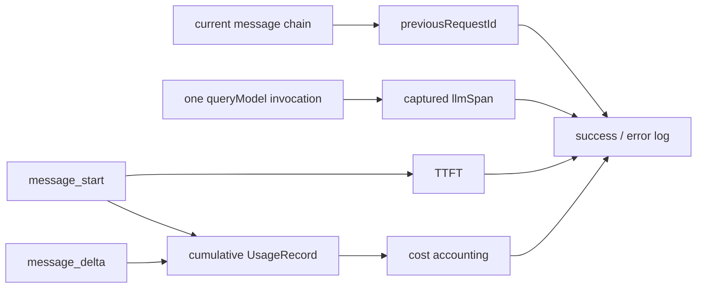

`previousRequestId` 从当前 messages chain 推导，不读“全局最近一次请求”。main thread、subagent 和 teammate 有各自消息链，并发时不会互相覆盖，rollback/undo 删除消息后也自然回到正确链头。

每次 `queryModel()` 还会捕获 `startLLMRequestSpan()` 返回的具体 `llmSpan`，结束时显式传回。只调用一个“结束最近 span”的全局 API，在并行响应顺序变化后极易串线。

usage 是累计快照，不是 delta。例如：

```text
message_start: input=120, cache_read=40, output=0
message_delta: input=0, cache_read=0, output=25
```

这不表示最终 input 变成 0，也不能把 120 和 0 当两个增量相加。当前更新规则保留 start 中已知的 input/cache 值，并采用稍后到达的 output 等终值。一次 response 内做 cumulative merge；多个实际 Provider responses 的 run cost 才做跨响应累加。

Streaming cost 在 `message_delta` 分支任何 yield 之前记录。non-streaming fallback 的 assistant 也可能被消费者拿到后立即 close，所以它的 usage/cost 放在外层 `finally` 结算。若一次 streaming 请求已消耗 token，随后又发起 fallback，两次都是真实付费请求，run ledger 应累计两笔；“后一个结果替代前一个结果”不等于 Provider 没收第一笔钱。

TTFT 在 `message_start` 到达时计算，不等于“收到任意首字节”。当前快照把 `ttftMs` 初始化为 `0`；如果在 `message_start` 前失败并成功 fallback，日志中的 0 实际表示不可得，不是真实 0ms。我们的 clean-room 设计用 `number | undefined` / `Optional[float]` 表达 unknown，这是根据观测语义做的迁移改进，不冒充快照现状。

## 用 fake stream 证明，而不是连接真实模型猜测

真实 API 难以稳定制造 delta-before-start、半截 tool JSON、消费者提前 close 和 idle timeout。M14 的实验使用确定性 fake event，目标不是模仿 Anthropic SDK 的每一行，而是让行为契约可反证。

TypeScript：

```powershell
cd "D:\agent\Claude code最新\curriculum\units\M14\code\typescript"
node --experimental-strip-types --test streaming.test.ts
node --experimental-strip-types demo.ts
```

这里的 `--experimental-strip-types` 让当前 Node 直接擦除 TypeScript 类型并执行实验文件；它不是编译器替代品。累计 Harness 仍用锁定的 TypeScript 工具链做严格 typecheck，前者服务快速运行，后者负责类型验证。

Python：

```powershell
cd "D:\agent\Claude code最新\curriculum\units\M14\code\python"
python -m unittest -v test_streaming.py
python demo.py
```

先不要看断言，写下预测：

1. start event 中的 text 若没有 delta，最终 text 应是什么；
2. `content_block_stop` 的 assistant 与 raw stop event 谁先出现；
3. 保存 assistant 引用后，`message_delta` 是否能让该引用看到 stop reason；
4. input/cache 的 0 是否会擦除 start usage；
5. delta-before-start、类型错配和 incomplete stream 应静默跳过还是失败。

实验实际验证：TypeScript `4/4`、Python `3/3`。上面的五组预测被组合在这些测试用例中，其中“错误顺序”一组同时覆盖 delta-before-start、类型错配和 incomplete stream；测试用例数量不是预测数量。三类 block 按 index 组装；assistant 先于 raw stop event；同一引用后来看到终态字段；usage 保持 cumulative；协议不变量失败关闭。

最有价值的破坏实验是把 `message_delta` 分支改成创建新对象：

```ts
// 错误示意：看似更“immutable”，却切断已交付引用
const updated = { ...last, usage: usage.snapshot(), stopReason }
```

保存 `content_block_stop` 返回的旧引用，再消费 `message_delta`。若旧引用仍是 `stopReason=null`，你就亲手观察到了 lazy transcript queue 会遇到的身份问题。修复不是宣布“可变对象更好”，而是给 in-flight message 定义清晰的 finalize 边界：finalize 前允许 owner 写终态字段，finalize 后冻结并进入 durable store。

第二个破坏实验是把每次 usage 都相加。输入 120 后再输入显式 0，表面上未出错；但若 Provider 重复发送累计 output=25、output=25，就会被算成 50。正确测试必须包含重复累计快照，才能区分 delta 与 snapshot。

第三个挑战是模拟 producer 比 consumer 快。若队列没有容量上限，暂停消费者后观察 buffer 会持续增长。产品级 stream contract 应在容量满时让 producer await，consumer close 时 abort owner run 并等待 cleanup，而不是只停止读取。

## Mini Agent Harness：这次合入流边界，不假装已有完整 SSE

本单元将 Provider-neutral 的流控制边界合入累计 Harness：

- `ModelAdapter.stream()` 是可选能力，已有 `complete()` 不被替换；
- `AgentRunStream` 固定容量、单消费者，producer 在满容量时背压；
- consumer `close()` 会传播 abort，并等待 producer cleanup；
- terminal result 只含 metadata，不复制 token 文本和工具 JSON；
- TypeScript 与 Python 镜像同一行为契约。

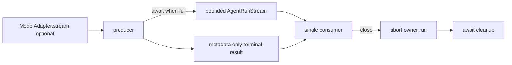

这次没有合入 Provider-specific SSE parser，也没有把 streamed assistant blocks 接进 `AgentRuntime`，更没有提前实现 M15 的 streaming tool execution、并行工具和透明模型 fallback。教材实验中的 `StreamingAssembler` 已证明机制，但直接塞进 Harness 会过早绑定 Anthropic event shape；因此 parser 留在独立实验，Harness 只先固定跨 Provider 都需要的背压、关闭和终态契约。

这个取舍对简历项目反而更可信：能明确说出“已经交付的抽象边界”和“尚未实现的 Provider 适配”，比把一个 fake generator 宣称成完整 SSE 支持更像工程实践。

## 迁移到 Java/Spring、RAG 与 LangGraph

在 Spring 系统里，可以把 Provider adapter 定义为 `Flow.Publisher<ModelStreamEvent>` 或 Reactor `Flux<ModelStreamEvent>`，但不要让任意 controller 同时订阅并各自执行工具。单消费者执行流与多观察者 telemetry 流应分开：前者拥有控制权，后者只接收脱敏 metadata。取消可由 Reactor cancellation 映射到 request-scoped cancellation token，并在 `doFinally` 释放 HTTP response；只有 `doOnComplete` 不覆盖 cancel/error。

RAG 系统同样会遇到“partial output 已可见后重试”的问题。检索通常可重放，但 citation 写库、反馈写回、外部 webhook 未必幂等。不要按“模型调用”和“工具调用”简单分类，要按副作用和 idempotency key 设计 replay policy。

LangGraph 的 streaming mode 能提供 node/update/message 等事件，但 framework stream 不自动解决业务幂等、Provider usage 累计语义和外部 side effect rollback。把 LangGraph checkpointer 当成 durable orchestration state，把本单元的 request/span/cost ledger 当成 execution observability；两者相关联但不能互相替代。

企业实现至少应拆出：

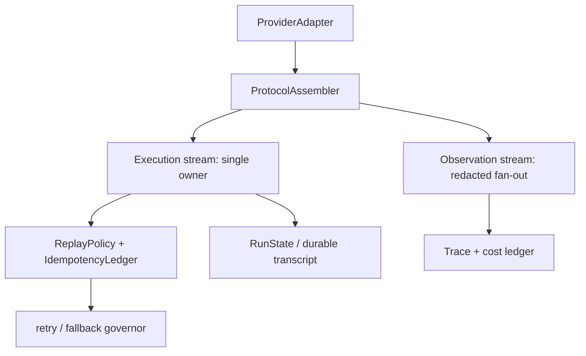

这样 Provider 协议变化不会直接改 Tool Loop，监控订阅不会获得执行权，透明重试也必须先经过 replay policy。

## 资深 Agent 面试官会怎样追问

### 1. “流式模型接口不就是边收 token 边展示吗？在 Agent 里为什么复杂得多？”

我的结论是，Agent 的流式接口本质上是一个带业务副作用的协议状态机，不只是 UI 打字机。以 Claude Code 快照为例，请求先在 `queryModel()` 里通过 `withRetry()` 创建 raw stream，之后按 index 组装 text、thinking 和 tool_use block；到 `content_block_stop`，完整工具调用已经能作为 assistant message 交给 Query Loop，后面的 `message_delta` 才补 usage 和 stop reason。

这意味着 Harness 必须区分协议事件、业务消息和终态统计三层。工具参数要等 block 完整才解析，但工具调度又可能早于整个 message 结束。如果 partial tool 已执行，之后 streaming fallback 重新请求模型，tombstone 旧消息也撤销不了副作用。所以生产设计里我会加 stable call id、idempotency ledger 和 replay policy，对不可幂等工具默认禁止透明重放。流式的难点不在字符串拼接，而在完整性边界、所有权、取消清理和副作用一致性。

### 2. “为什么 Claude Code 要修改已经 yield 出去的 assistant？这不是违反 immutable 设计吗？”

结论是，这里保留对象身份比机械追求 immutable 更重要，但可变范围必须限制在 response finalize 之前。Claude Code 在 `content_block_stop` 就 yield assistant，而真实 usage 和 stop reason 到 `message_delta` 才来。QueryEngine 的 transcript 写队列已经持有嵌套 message 引用并延迟序列化；如果后面创建新对象替换，队列仍指向旧对象，持久化会丢终态字段。

所以源码直接 mutation 最后一条已 yield message 的嵌套字段。它和请求投影不修改 durable history 并不冲突：前者是 in-flight response owner 完成对象，后者是 view compiler 不得污染 source。我的企业实现会把生命周期写清楚：building 状态只允许 assembler 修改，finalized 后冻结并移交 durable store；观察者不能任意写。面试里我不会回答“mutable 好”或“immutable 好”，而会先讲引用已交付后谁拥有 finalize 权。

### 3. “你会怎么区分 retry、fallback、timeout 和 cancel，避免监控与业务语义混乱？”

我的结论是，先按 failure point 和 owner 分类，再决定是否重放。Claude Code 里，raw stream 创建前的可重试失败归 `withRetry()`，它可以产生 retry 系统消息；模型 fallback 由它发出信号，但真正切换模型和重建轮次状态的是 `queryLoop()`；stream 已创建后的空流或不完整流，才可能由 `queryModel()` 做 non-streaming fallback。

取消也要看 caller signal。SDK 抛 abort 形状错误但 caller 没取消，应算连接超时，不应记成用户取消；长时间没有 chunk 由 idle watchdog 主动释放资源；消费者提前 break 是 close，保证 `finally` cleanup，但不保证 yield 后的成功日志执行。监控上我会分别记录 user_cancel、sdk_timeout、idle_timeout、consumer_close 和 retry_exhausted，并把 replay decision 单独记录。否则取消率、Provider 稳定性和用户体验指标都会失真。

### 4. “并行 Subagent 下，怎样保证成本和 Trace 不串请求？”

结论是，identity 必须来自 request-local chain 和显式 span handle，不能依赖全局 last request。Claude Code 从当前 messages 推导 `previousRequestId`，main thread 和各个 agent 有自己的消息链；每次请求还保存 `startLLMRequestSpan()` 返回的具体 `llmSpan`，成功或失败时显式结束它。这样即使请求 A 先发后回、请求 B 后发先回，也不会结束错 span。

usage 还要区分 response 内累计快照和 run 内跨请求累加。`message_delta` 的 usage 不是增量；如果 streaming 失败后又发 non-streaming fallback，两次 Provider 请求都真实收费，run ledger 要记两笔。工程上我会用 run_id、request_id、attempt_id、model、span_id 组成关联键，价格表做版本化，正文内容默认不进 telemetry，只保留 token count、TTFT、状态和错误分类。

### 5. “如果让你在 Spring 中实现这个流边界，你最先锁定哪些契约？”

我的结论是，先锁定单消费者、背压、取消传播、终态和幂等，再选 Reactor 还是别的库。我会让 Provider adapter 返回 `Flux<ModelStreamEvent>`，由唯一 execution subscriber 驱动组装和工具调度；监控走另一个脱敏 observation port，不能共享执行订阅权。buffer 必须有上限，满时背压；下游 cancel 要传到 HTTP request，并在 `doFinally` 释放 response。

终态用独立 `Mono<RunSummary>`，只在 producer cleanup 后完成，避免客户端看到 completed 但 socket 和工具还没收敛。协议 assembler 只产出完整 block，Tool Loop 接收 stable call id；发生 fallback 前查询 idempotency ledger。最后用虚拟时钟和 fake publisher 测 delta-before-start、慢消费者、取消、idle timeout 和重复累计 usage。技术选型可以变，这些行为契约不能靠框架默认值碰运气。

### 6. “TTFT 为什么不能简单初始化成 0？这个小细节有什么生产影响？”

结论是，0 是一个有效延迟值，而 unknown 是缺失数据，混在一起会污染 SLI。Claude Code 快照在 `message_start` 计算 TTFT，但字段初始化为 0；如果 streaming 在 message_start 前失败并走 non-streaming fallback，成功日志会拿到 0。它实际表示没有观测到 streaming 首 token，不是 Provider 零毫秒响应。

生产里我会把 TTFT 设计成 optional，并另外记录 request mode、fallback 和 attempt。聚合时只对 observed TTFT 计算分位数，同时统计 missing ratio；否则 fallback 增多时 P50 反而可能变好。类似地，首字节、message_start、首个 text delta 和首个可执行 tool block 是不同指标，必须按用户体验或调度目标选择，不能都叫首 token 延迟。

## 离开本单元前，自己完成一次闭环

不要背函数名。合上正文后，试着画出两张图：第一张从 `withRetry()` 到 raw stream，再到 assistant-before-event 和 later mutation；第二张只画三种 fallback 与四种停止原因的 owner。然后回答：

- 为什么 `content_block_stop` 可以交出业务消息，`message_stop` 却不是唯一完成边界；
- 为什么 replacement/tombstone 不能撤销 side effect；
- 为什么 cumulative usage 在 response 内合并、在 run 内累加；
- consumer close 保证了什么，又不保证什么；
- 你会把 Provider-specific parser、bounded stream、Tool Loop 和 telemetry 分别放在哪个组件。

最后修改实验，让两个 content block 的 stop 顺序与 index 顺序不同，再判断你的 assembler 是按“完成顺序”还是按“数组顺序”交付消息。接着为 bounded stream 增加一个容量为 1 的慢消费者测试：producer 第二次 push 必须等待，close 后必须观察到 abort 和 cleanup。能预测、运行、解释失败并修复，你才真正把“模型流”从 API 用法变成了 Harness 能力。

## 源码复习索引

- `src/services/api/claude.ts` -> `queryModelWithStreaming()` / `queryModel()` -> request、raw event assembly、fallback、usage、cost、span、cleanup；
- `src/services/api/withRetry.ts` -> `withRetry()` -> 创建流之前的 attempt、retry notice 与 fallback signal；
- `src/query.ts` -> `queryLoop()` -> partial attempt 收敛、真正的 model switch 与下游消费；
- `src/QueryEngine.ts` -> assistant transcript queue / `message_delta` observation -> 已交付引用和终态字段；
- `src/services/api/logging.ts`、`src/utils/telemetry/sessionTracing.ts` -> success/error 与显式 span identity。

这些是当前本地快照的定位。实验代码是 clean-room 运行验证；bounded stream、optional TTFT、idempotency ledger 和 Spring/LangGraph 方案属于设计迁移。Graphify 只帮助找到候选文件，没有作为本章事实依据。
