# M15 Tool Loop：模型说“调用工具”之后，系统怎样安全地继续

> 本单元主体建议 5 至 7 小时。运行双语言实验、故障注入和 Harness 扩展挑战另计。

M14 结束时，模型流已经能组装出一条 assistant 消息。假设它没有直接回答，而是一次给出四个 `tool_use`：

```text
A = Read(package.json)      可以并发
B = Read(tsconfig.json)     可以并发
C = Bash(npm test)          必须独占
D = Read(test-report.txt)   可以并发，但必须等 C
```

最初级的 Agent 会写成 `for (...) await runTool(call)`。它安全，却浪费 A 与 B 可以重叠的时间。另一个常见版本是 `await Promise.all(calls.map(runTool))`。它很快，却可能让 C 与读操作、甚至两个写操作同时改变工作区。更隐蔽的问题还在后面：某个调用 schema 错了、权限被拒绝、Hook 阻止、用户按下取消或工具抛异常时，Provider 协议仍要求每个 `tool_use.id` 得到对应的 `tool_result`。漏掉一个，下一轮请求就不再合法。

所以 Tool Loop 不是“把函数调起来”。它是一段同时维护调度、安全、协议和状态的事务边界：

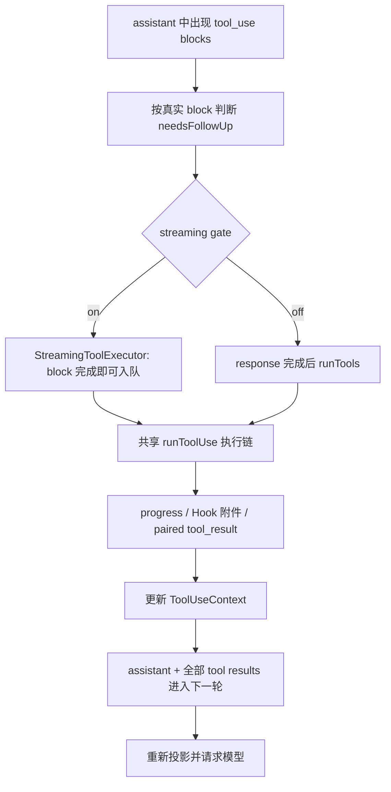

本单元会沿这四个调用走完一次真实运行。先看系统为什么继续，再看谁可以同时执行，最后看结果怎样重新成为模型输入。Hook、Permission、MCP 和 Sandbox 的完整内部机制属于后续单元；这里只闭合 Tool Loop 为了正确运行必须知道的边界。

## 循环继续的依据不是 `stop_reason`

看到 `stop_reason: "tool_use"`，很容易把它当作继续循环的开关。当前快照没有这样做。`src/query.ts -> queryLoop()` 在每次 iteration 创建 `toolUseBlocks` 和 `needsFollowUp`，并留下直接注释：`stop_reason === 'tool_use'` 不可靠。真正的条件是 assistant content 中是否出现了实际 `tool_use` block。

模型流每产生一条 assistant message，Query Loop 就筛出其中的 tool blocks；只要列表非空，就追加到 `toolUseBlocks` 并把 `needsFollowUp` 设为 `true`。流结束后，如果它仍为 `false`，本轮才可能结束。

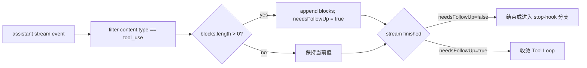

这条判断把协议元数据与业务事实分开了。`stop_reason` 是 Provider 对整体 response 的终态描述，tool block 是系统真正准备执行的对象。即使终态字段迟到、缺失或不准确，只要完整 block 已经出现，Harness 就必须为它负责。

源码锚点：

```text
claude-code-CLI/src/query.ts
-> queryLoop()
-> toolUseBlocks / needsFollowUp（约 551-568）
-> assistant message 分支（约 826-844）
-> !needsFollowUp 终止分支（约 1062）
```

这也解释了 M14 为什么在 `content_block_stop` 就交付完整 tool block：只有对象完整，Tool Loop 才能建立 ID、校验输入和承担副作用。

## 同一个 Tool Loop，快照里有两个调度入口

当前快照受 `config.gates.streamingToolExecution` 控制。gate 开启时，`queryLoop()` 创建 `StreamingToolExecutor`；每个完整 block 到达就调用 `addTool()`，模型剩余内容仍在流动时，早到的工具已经可能执行并产生 progress。gate 关闭时，系统先等 response 收完，再把所有 blocks 交给 `runTools()`。

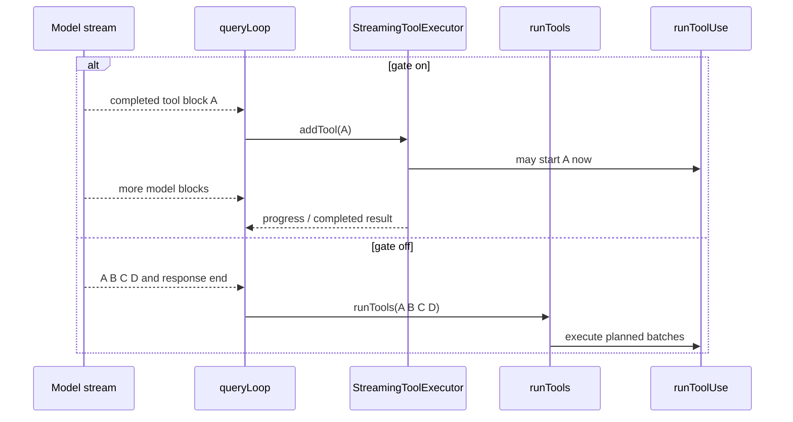

两条路径共享 `runToolUse()`，所以 lookup、校验、Hook、Permission、真实调用和结果映射的主体相同；但不能据此说它们语义完全等价。事实闸门确认至少有四组差异：

- response-complete 路径会收集并按原 block 顺序应用 concurrent context modifiers；streaming executor 当前只应用 unsafe tool 的 modifier；
- Bash 错误触发 sibling cancellation 只存在于 streaming executor；
- 每个工具的 `interruptBehavior` 只由 streaming executor 使用；
- deprecated alias fallback 位于 `runToolUse()` 内，而 streaming `addTool()` 会先查当前 definitions，可能在到达 fallback 前直接生成 unknown-tool result。

这些不是本教材要替快照“修平”的瑕疵，而是必须被保留的版本事实。后面的 Mini Agent Harness 会选择统一策略，那是 clean-room 设计迁移。

## 并发安全不是工具名上的永久标签

回到 A、B、C、D。`Read` 看起来天然安全，`Bash` 看起来天然危险，但快照没有只维护一个固定名单。调度器先找到 tool definition，再用 input schema 解析模型输入；只有 parse 成功，才调用 `tool.isConcurrencySafe(parsedInput)`。parse 失败或 predicate 抛异常，都保守归为 unsafe。

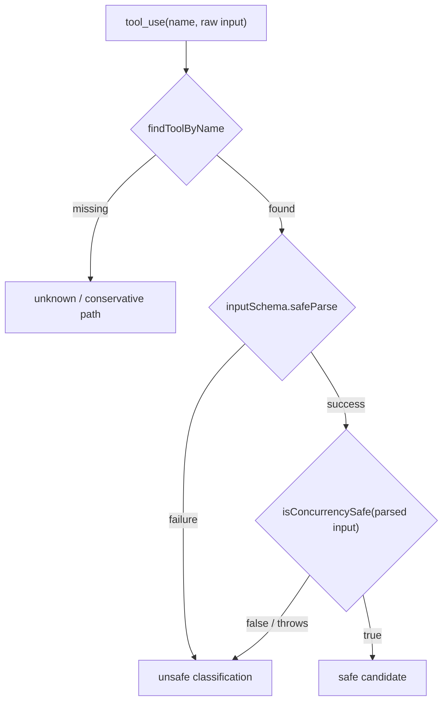

为什么顺序必须是“parse 后判定”？因为并发安全可能取决于参数，而不仅是名字。例如同一个 shell 工具，查询版本号与修改文件的命令风险不同；predicate 需要面对合法、结构明确的数据。如果拿 raw JSON 猜测，类型错乱本身就可能绕过分类条件。

这里第一次遇到一个重要 TypeScript 设计：`isConcurrencySafe` 是高阶函数边界。工具把“怎样根据本工具输入判断”作为函数交给 scheduler；scheduler 不需要知道 Bash、Read 或 MCP 的业务细节。Java 中可用 `Predicate<ParsedInput>`，Python 中可用 callable。区别在于 TypeScript 的 schema parser 还能把 `unknown` 缩小为工具自己的输入类型，predicate 不必到处做强制断言。

快照的 response-complete 规划位于：

```text
src/services/tools/toolOrchestration.ts
-> partitionToolCalls()
-> inputSchema.safeParse()
-> isConcurrencySafe(parsedInput.data)
```

streaming 路径在 `StreamingToolExecutor.addTool()` 重复同一保守分类原则。

## safe batch 与 exclusive barrier

`partitionToolCalls()` 沿模型给出的 block 顺序扫描：连续 safe calls 合成一个 batch；每个 unsafe call 单独成为一个 batch。A、B、C、D 因此不是“前三个先跑完再看”，而是三段：

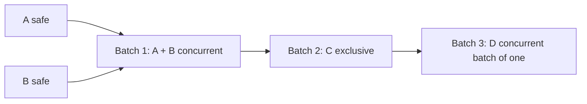

C 是屏障。它之前的 A、B 必须都结束，C 才开始；C 结束后 D 才能开始。这样既保留模型表达的副作用顺序，又不浪费连续只读调用的并行空间。response-complete 路径默认最大并发数是 10，可由 `CLAUDE_CODE_MAX_TOOL_USE_CONCURRENCY` 改变。

StreamingToolExecutor 没有先拿到完整列表。它维护 `queued -> executing -> completed -> yielded` 状态：

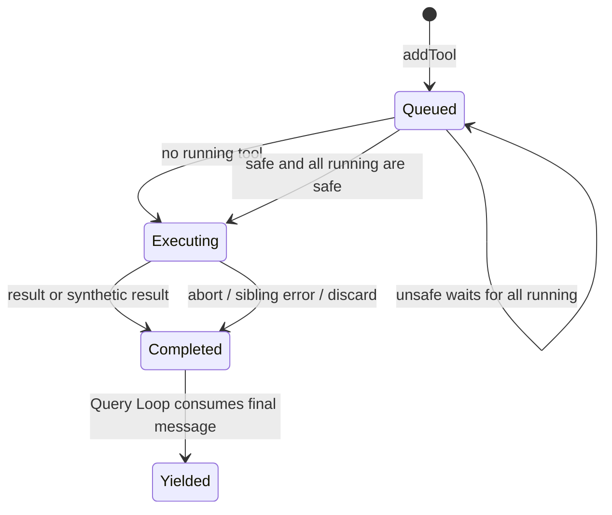

队列扫描遇到暂时不能启动的 unsafe tool 时停止向后推进，避免 D 越过 C。多个 safe tools 可以并发；某个晚到的 safe tool先完成时，其 progress 和结果可被观察，配对不能依赖数组位置，只能依赖 `tool_use_id`。

不要把这个设计简化成“read 并行、write 串行”。真实规则是：**合法输入上的动态 predicate 决定当前调用是否可并发，unsafe 调用形成顺序屏障。**

## 调度只决定何时开始，`runToolUse()` 才决定能否执行

进入 batch 不等于获得执行权。两条 scheduler 最终都调用 `src/services/tools/toolExecution.ts -> runToolUse()`。这条共享链可以压缩成八个语义关口：

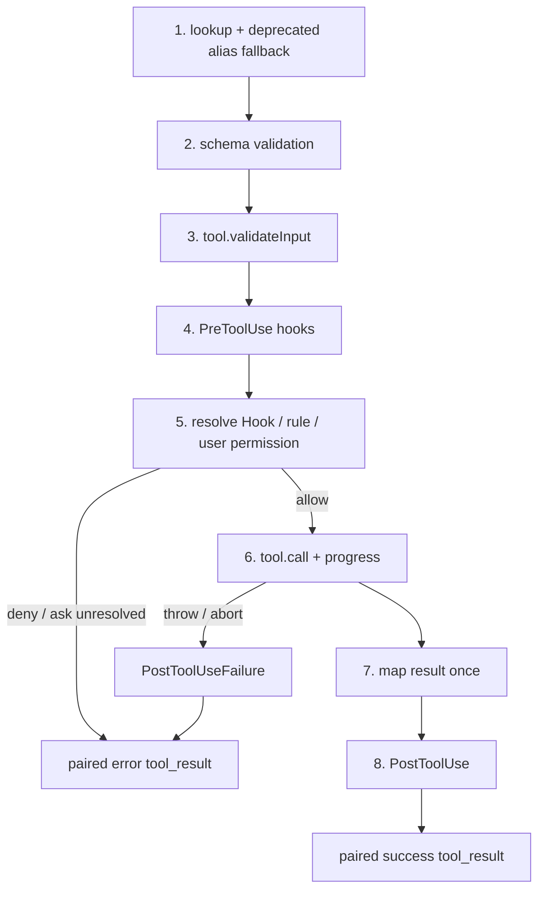

第一层 lookup 有一个容易漏掉的版本边界：`runToolUse()` 找不到当前可见工具时，还会在 base tools 中检查 deprecated alias，例如旧 transcript 使用旧名。只有确实命中 alias 才 fallback，不会把任意未知名字映射过去。StreamingToolExecutor 的 `addTool()` 却会先查当前 definitions；missing 时直接构造错误，所以这项兼容行为并非两条路径共有。

第二、三层是两种不同验证。`inputSchema.safeParse()` 检查结构和类型，例如 `path` 是否是字符串；`tool.validateInput()` 检查工具领域语义，例如路径、命令或组合参数是否允许。结构失败不会进入 Permission，更不会执行工具，却仍返回带原 ID 的 error result。

第四层运行 PreToolUse。Hook 可以产生 progress、附加上下文、停止继续、提供 permission result 或更新可观察输入。源码特意区分 `processedInput` 与最终 `callInput`：给 Hook/Permission 观察的派生字段不应无意改变真实 `tool.call()` 的参数；只有 Hook 或 permission 明确返回新的 input 时，修改才有意进入调用。

第五层解析权限。这里必须修正一句常见但危险的话：**PreToolUse Hook 返回 allow，不代表任何情况下都无条件执行。** `resolveHookPermissionDecision()` 仍要综合 Hook result、deny/ask rules、运行模式和可能的用户交互；Hook deny 可以直接拒绝，规则也可能覆盖或要求询问。

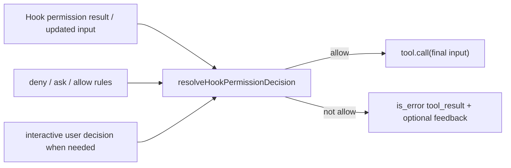

Permission 是“应用是否允许发起动作”的决策。Sandbox 是“即使动作被发起，操作系统还限制它能碰什么”的执行约束。当前 M15 只经过前者，不能因为存在 `canUseTool` 就声称工具被隔离。

## progress 与 result 是两条通道

长工具若只在结束时返回结果，用户会以为系统卡住。`runToolUse()` 让工具和 Hook 产生 progress；streaming executor 把它放进 `pendingProgress`，立即唤醒结果消费者。progress 可以先于 final result 被 yield，但它不是 durable tool result，也不解析 `tool_use`。

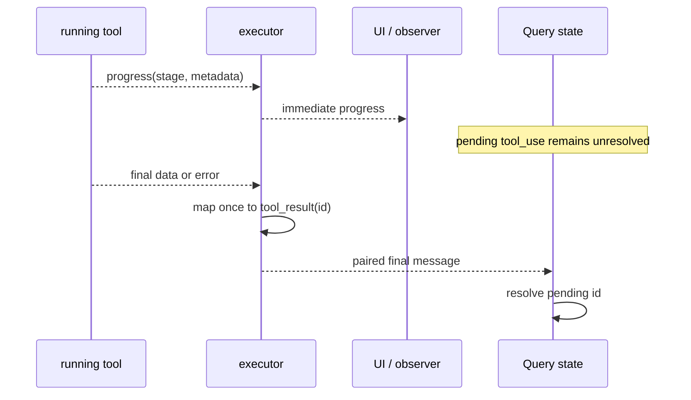

这条分离与 M10、M12 的三通道模型一致：durable conversation 保存协议事实，observer event 展示过程，terminal summary 表示整次 run 的结果。把 progress 写成普通 user message 会污染下一轮；把 final result 只发给 UI 又会让模型看不到工具产物。

快照在成功时先把工具数据映射为 API `tool_result` block，再运行 PostToolUse；普通工具若 Hook 没改输出，可以复用预映射结果，避免重复映射。失败则运行 PostToolUseFailure，最后仍创建 `is_error: true`、携带原 `tool_use_id` 的 user-role message。

## “失败也要有结果”是协议恢复，不是伪装成功

下面六种情况看似不同，在 Query Loop 眼里共享一个不变量：assistant 已经发布的每个 `tool_use.id`，必须恰好被一个 final `tool_result` 解析。

| 情况 | 是否执行真实工具 | 最终消息 |
| --- | --- | --- |
| unknown tool | 否 | synthetic error result |
| schema / semantic invalid | 否 | validation error result |
| PreToolUse stop / permission deny | 否 | denied error result，可带 Hook 信息 |
| tool throws | 已进入，可能已有部分副作用 | failure error result |
| caller abort | 视到达时点 | current/queued call 的 cancelled result |
| normal success | 是 | success result |

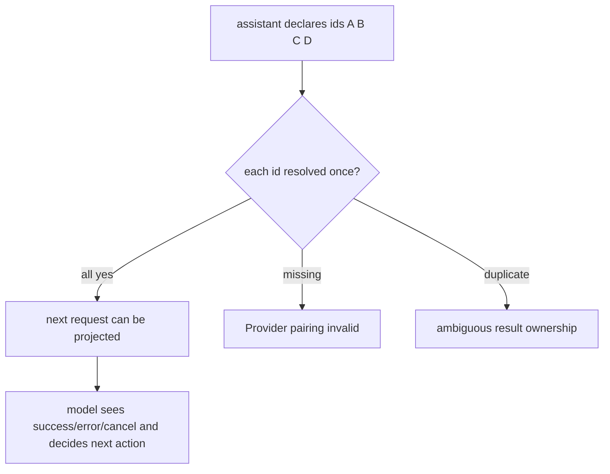

错误 result 不是把失败包装成成功；它是在消息协议中如实记录失败，使模型可以修正参数、换工具、解释无法完成或停止。Runtime 不替模型伪造业务成功，也不能因为工具没执行就删掉它曾经声明的 call。

这也是为什么 M13 的 strict projection 很重要：Tool Loop 负责产生配对，RequestProjector 在下一次网络请求前再次拒绝 orphan、missing 和 duplicate。一个边界负责创建，另一个边界负责验证，不能只依赖其中一个。

## 取消不是一个布尔值：要看谁的 controller 被终止

快照 streaming executor 有父 Query controller、sibling controller 和 per-tool child controller。它们回答不同问题：

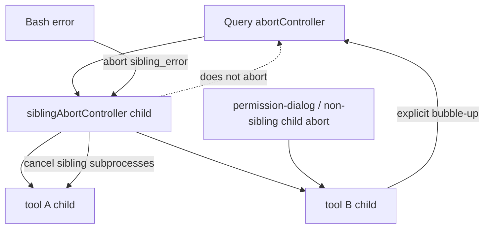

只有 streaming 路径中的 Bash error 会设置 `hasErrored` 并以 `sibling_error` 终止同组兄弟 subprocess。Read、WebFetch 等普通失败不会级联。`sibling_error` 特意不向父 Query 冒泡，因此“同组 Bash 失败”不等于“整轮用户取消”。相反，permission dialog 等非 sibling 原因触发的 tool child abort 会显式向 Query controller 冒泡，让 Query Loop 结束当前 turn。

用户输入新的消息时，`interruptBehavior='cancel'` 的工具可以被终止，`block` 型工具不应收到这类 abort。这个 per-tool 粒度也只在 streaming executor 中。response-complete `runTools()` 使用共享 Query abort，没有 Bash sibling cascade 和同样的 per-tool interrupt 调度。

无论原因是什么，已经发布的 tool calls 仍需配对。`query.ts` 在 streaming abort 时必须完整消费 `getRemainingResults()`，让 executor 为 queued/in-progress calls 产生 synthetic result；没有 streaming executor 时，则调用 `yieldMissingToolResultBlocks()` 补齐。然后 Query 才能返回 `aborted_streaming`。

## streaming fallback 只能丢弃旧结果，不能撤销副作用

M14 已看到：partial stream 可能先产出完整 tool block，工具开始后 stream 又失败并走 non-streaming fallback。`StreamingToolExecutor.discard()` 会让旧 executor 不再启动 queued tools，并阻止旧结果进入新 attempt。但已经执行的写文件、命令或网络调用不会被 tombstone 撤销。

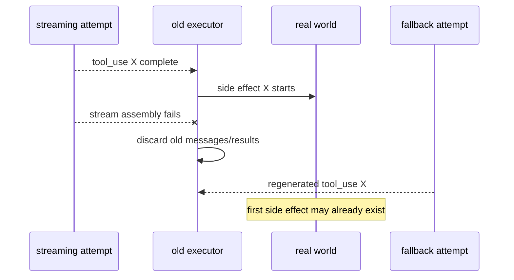

因此“丢弃消息”是 observation recovery，不是 execution rollback。企业系统若允许支付、发信、建单等不可逆工具边流边执行，必须增加 idempotency key、调用 ledger、outbox/inbox、人工确认或 observation/execution 分流。仅靠 call ID 去重也不够：fallback 可能生成新 ID，却代表同一业务意图。

本课程 Harness 暂不实现 durable idempotency ledger。这不是遗漏，而是把持久化、崩溃恢复和分布式一致性留到后续 Transcript/治理闭环；当前版本明确不做透明副作用重试。

## 所有工具结果完成后，普通附件才能进来

工具执行期间，用户可能又输入消息，后台任务可能完成，Hook 也可能产生附件。把普通 user content 插在一组 tool results 中间，Provider 会认为 assistant 的 tools 尚未被完整解析。`query.ts` 因此在所有 tool calls 完成后才处理 queued attachments，并留下明确注释：API 不允许 regular user message 与 tool_result 交错。

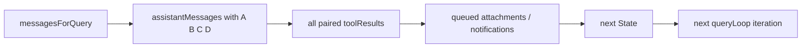

下一状态的主干是：

```text
messagesForQuery
+ assistantMessages
+ toolResults
+ 合法时点插入的 attachments
```

同时，scheduler 产出的 `newContext` 更新 ToolUseContext，`turnCount` 增加。随后 Query Loop 递归/迭代进入下一次请求投影。`tool_result` 在领域上仍是工具结果，即使 Provider 编码把它放在 user role；不要因为 role 相同，就把它和用户新输入混成一类状态。

## 用两个独立实现先证明机制

本单元没有连接真实模型。TypeScript 与 Python 实验都在本目录内独立实现小型 scheduler，不导入累计 Harness。它们验证的不是“API 能访问”，而是以下可反证结论：

```text
curriculum/units/M15/code/typescript/tool-scheduler.test.ts
curriculum/units/M15/code/python/test_tool_scheduler.py
```

运行：

```powershell
cd "D:\agent\Claude code最新\curriculum\units\M15\code\typescript"
node tool-scheduler.test.ts

cd "D:\agent\Claude code最新\curriculum\units\M15\code\python"
python -m unittest -v test_tool_scheduler.py
```

实际结果：TypeScript `6/6`，Python `6/6`。

实验先要求你写下预测：

1. A 与 B 都应在任一方结束前启动；峰值 active 不得超过 2。
2. C 的 start 必须晚于 A、B 的 end；D 的 start 必须晚于 C 的 end。
3. invalid input 不得调用 safety predicate，也不得执行工具，但必须有 error outcome。
4. deny、throw、cancel 和未启动调用都各有一个 call ID 对应的 outcome。
5. progress 必须早于 final outcome；它不占用 final 配对名额。
6. 两个 safe 工具完成顺序颠倒时，context updates 仍按原 block 顺序应用。
7. 快照模拟中，response-complete 保留 concurrent modifiers；streaming 策略只保留 unsafe modifier，证明两条路径不能描述成等价。

任一反证现象都意味着实现错误：C 提前启动说明屏障失效；peak 大于 limit 说明没有真正限流；结果按完成位置配对会让慢 A 与快 B 串 ID；cancel 后缺 result 会让下一轮非法；context 最终值随机器速度变化说明状态提交不确定。

### 一个值得亲手破坏的实验

把 scheduler 的有界 worker pool 改成：

```ts
await Promise.all(calls.map(call => run(call)))
```

然后把 A、B、C、D 放在同一个数组。你会看到 C 越过 barrier，与 A/B 同时启动。再把 context update 改为“谁完成谁立刻写共享对象”，多跑几次，最终 winner 会受延迟影响。这个实验把两个问题分开：并发执行本身可以是非确定的，**durable publication 和状态归并却必须选择确定顺序。**

## Mini Agent Harness：统一执行核心，暂不提前启动 streaming tool

M15 把以下能力合入累计 TypeScript/Python Harness：

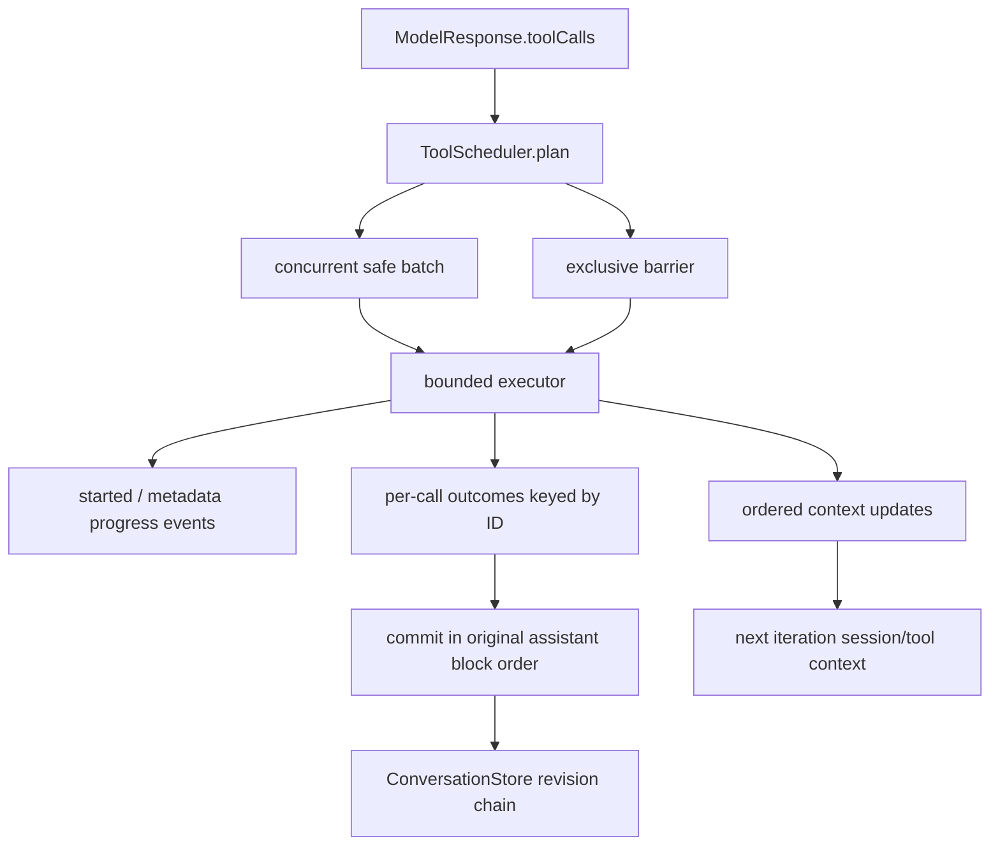

TypeScript 入口：

```text
mini-agent-harness/typescript/agent/toolScheduler.ts
mini-agent-harness/typescript/agent/tools.ts
mini-agent-harness/typescript/agent/runtime.ts
```

Python 镜像：

```text
mini-agent-harness/python/agent_runtime.py
mini-agent-harness/python/test_tool_scheduler.py
```

新增契约：

- `AgentTool.isConcurrencySafe(input)` 是可选动态 predicate；未声明默认 unsafe，保留旧工具串行兼容；
- built-in `read_file`、`list_files`、`search_text` 标成 safe，`run_command` 为 unsafe；
- scheduler 生成显式 `ToolExecutionPlan`，safe batch 使用固定 worker 上限，unsafe 为 exclusive barrier；
- schema 校验先于 safety predicate，invalid/unknown 保守进入 exclusive 失败路径；
- started 与 metadata-only progress 可以实时观察，observer 失败不能拥有执行；
- outcome 允许完成乱序，但 Runtime 按 assistant block 顺序写 `ConversationStore`，避免并发 stale revision；
- success/error/denied/cancelled 都生成恰好一个 paired durable result；
- context updates 在 batch 结束后按原 call 顺序合并，下一 iteration 才读取更新后的 context。

这里有一个有意的吞吐量权衡。快照 streaming executor 能在模型流尚未结束时启动工具，并及时 yield 某些完成结果；当前 Harness 仍从 `ModelAdapter.complete()` 拿到完整 response 后才规划。它把“何时触发”延后，把“怎样调度和配对”先做稳定。真正由 Provider SSE 的 completed block 触发执行，等 M14 stream parser 与 Runtime 消费边界正式接通后再合入。

Harness 也没有复制快照两条路径的差异。它选择一个统一 executor core：ordered context modifiers、统一 cancellation pairing、当前 definitions 中的精确名字、没有 Bash 专属 sibling cascade。这个选择减少 clean-room 项目的行为分叉，但必须标记为 `设计迁移`，不能反写成 Claude Code 快照事实。

当前回归包括：

```text
TypeScript Runtime 25/25
TypeScript Provider 7/7
TypeScript Tool 5/5
TypeScript Scheduler 5/5
TypeScript Stream 4/4
Python Agent + Scheduler + Stream 22/22
TypeScript strict typecheck PASS
```

## 迁移到 Java/Spring、RAG 与生产系统

在 Spring 中，不要把每个 tool call 直接 `CompletableFuture.supplyAsync()`。先建立领域计划：

```java
sealed interface ToolBatch permits ConcurrentBatch, ExclusiveBatch {}
record ConcurrentBatch(List<ParsedToolCall> calls, int limit) implements ToolBatch {}
record ExclusiveBatch(ParsedToolCall call) implements ToolBatch {}
```

每个 call 先经过 schema/Bean Validation、领域校验、policy 和 permission；执行结果写入以 call ID 为 key 的 outcome map，最后由单一 conversation owner 按原顺序提交。若使用 Reactor，可让 safe batch `flatMap(..., concurrency)`，batch 之间用 `concatMap` 保持屏障；不要用一个无界 `flatMap` 覆盖全部调用。

RAG 系统尤其容易误标并发安全。两个向量检索通常可并发，但“检索后写会话 memory”“刷新索引”“创建引用记录”已经含副作用。并发 predicate 应检查当前参数和执行模式，不能只看工具名。检索 progress 可以进入 observer stream，文档片段 final result 才进入模型请求；敏感全文不应默认写 Trace。

LangGraph 的 tool node 可以帮你做图级编排，但它不会自动替你解决应用层 call ID pairing、Permission 与 Sandbox 区分、跨 Provider fallback 幂等或 durable publication 顺序。框架可以拥有节点调度，企业 Harness 仍要拥有协议和治理边界。

生产设计至少再加四层：

- 幂等：业务 intent key、执行 ledger、重复检测和可审计的 retry policy；
- 资源：per-tenant 与 per-tool 并发配额、队列长度、超时和熔断；
- 安全：Permission 决策之外的 Sandbox/worker identity/网络与文件系统隔离；
- 可观测：plan、queue wait、permission wait、execution latency、outcome、cancel reason 和 pairing violation，默认不记录输入输出正文。

## 资深 Agent 面试官会怎样追问

### 1. “Tool Loop 为什么不能直接 `Promise.all`？”

结论是，工具并发必须先证明调用级安全，再用 unsafe barrier 保住副作用顺序，不能把一个 response 里的所有 calls 无差别并行。Claude Code 快照会先 schema parse，再调用 `isConcurrencySafe(parsedInput)`；连续 safe calls 形成 batch，unsafe call 单独执行。这样 A、B 两个读取能并发，C 的命令会等它们结束，D 又等 C。错误、拒绝和取消也不能让结果缺席，每个 call ID 都要有 paired `tool_result`。企业实现里我还会加 per-tenant 限流、幂等 ledger 和单 owner 的 durable commit，避免执行并发演变成状态提交竞争。

### 2. “并发工具完成顺序不确定，怎样保证下一轮消息稳定？”

结论是，把执行顺序和发布顺序拆开：工具可以并发完成，outcome 用 call ID 归属，durable conversation 由单一 owner 按确定顺序提交。Claude Code 的协议配对依赖 `tool_use_id`，不是数组位置；response-complete 路径对 context modifiers 还会按原 block 顺序归并。我们自己的 Harness 进一步选择所有 final results 都按 assistant block 顺序写 ConversationStore，所以不会让两个并发 append 同时拿旧 revision。代价是快结果可能要等 batch 收敛后才 durable，但进度仍可实时发给 observer。这是用一点结果可见延迟换确定性和恢复简单度。

### 3. “PreToolUse Hook 返回 allow，是不是就可以绕过 Permission？”

结论是不是。Hook 是权限决策链的一项输入，不是绕过所有 policy 的万能通行证。快照先做 schema 和工具语义校验，再运行 PreToolUse，然后由 `resolveHookPermissionDecision()` 综合 Hook result、deny/ask rules、运行模式和必要的用户交互。Hook deny 可以直接阻止，allow 仍可能被更高优先级规则覆盖或要求询问。最后即使 Permission 允许，也不代表有 Sandbox，工具仍可能拥有宿主机权限。生产系统要把 Hook、policy、human approval 和执行隔离分别建模并记录 decision source。

### 4. “工具被拒绝或执行失败，为什么还要给模型发 `tool_result`？”

结论是，因为 assistant 已经声明了一个带 ID 的协议义务；失败结果是在协议中如实解析它，不是伪装成功。Claude Code 对 unknown、schema invalid、Hook stop、permission deny、throw 和 abort 都构造 `is_error` 的 user-role `tool_result`，携带原 `tool_use_id`。下一轮模型才能看到原因并决定修参数、换方案或停止。若直接吞掉，RequestProjector 会面对 missing tool result，Provider 也可能拒绝请求。企业系统中我会让领域 outcome 和 Provider 编码分层，role 只是 wire format，不能把失败结果误当普通用户消息。

### 5. “Claude Code streaming 和 non-streaming 的工具调度完全一致吗？”

结论是不完全一致，主体执行链共享，但调度与取消细节有明确差异。gate on 时完整 block 一到就进 StreamingToolExecutor；gate off 时 response 完成后 `runTools()` 批处理。response-complete 会按原顺序应用 concurrent context modifiers，streaming 当前不支持这一点；Bash sibling cascade、per-tool `interruptBehavior` 只在 streaming；deprecated alias fallback 也可能被 streaming 的提前 unknown 检查挡住。面试里我会明确这些是当前快照事实，再说明 clean-room 系统可以选择统一 executor，但那是设计迁移，不是声称原实现已经统一。

### 6. “流式 fallback 后怎样避免工具副作用执行两次？”

结论是，tombstone 或 discard 只能阻止旧消息和旧结果继续传播，不能回滚已经发生的副作用；真正的解决方案要前移到执行协议。Claude Code 的 streaming executor 可能在完整 tool block 到达时就启动，后续 stream 失败再走 non-streaming request，第二个 attempt 可能重建相同意图。企业系统需要稳定 intent key、durable execution ledger、幂等业务接口，必要时把观察与执行分开，直到 response 终态再批准不可逆动作。对于支付、发信这类工具，我不会把透明 fallback 当普通网络重试。

### 7. “取消一个并发工具批次时，你怎样保证可恢复？”

结论是，取消要同时收敛资源和协议：signal 传到 permission 与 tool，停止新调用，等待或终止 in-flight 资源，并为 assistant 已声明的每个 call 生成唯一 cancelled outcome。Claude Code streaming 路径还区分 Query、sibling 和 per-tool controller；Bash sibling error 不等于父 Query abort，其他 child abort 可能显式上冒。我们的 Harness 采用共享 caller signal和统一 pairing，执行完成可以乱序，但提交仍按 ID 和原顺序。后续做跨进程 worker 时，还要持久化 cancellation intent、lease 和幂等状态，不能把客户端断线直接等同于业务已取消。

## 离开本单元前，自己走完一次闭环

不看前文，画出 A、B、C、D 的 batch，并回答：为什么 C 是 barrier，为什么 invalid input 在 safety predicate 前失败，为什么 fast B 可以先完成却不能占用 A 的 ID。然后在实验中做三项修改：

1. 把并发上限从 2 改成 1 和 3，记录 peak 与总耗时，但确认 barrier 不变。
2. 为一个工具加入参数相关的 safety predicate：`mode=read` safe，`mode=write` unsafe；证明分类发生在 parse 后。
3. 故意让 progress observer 抛异常，证明 final result、pairing 和下一轮仍完成。

最后给自己的 Harness 写一段设计说明，必须分别回答：scheduler 拥有什么，tool registry 拥有什么，Permission 决定什么，ConversationStore 为什么仍只有一个 writer，fallback 后副作用由谁负责。能把这些边界讲清，才算真正从“会调用工具”走到了“能设计 Tool Loop”。

## 源码复习索引

```text
claude-code-CLI/src/query.ts
-> queryLoop(): needsFollowUp、streaming gate、tool result 收敛、attachments、next State

claude-code-CLI/src/services/tools/StreamingToolExecutor.ts
-> addTool(): lookup、parse 后动态 safe 分类
-> processQueue(): safe 并发与 unsafe barrier
-> executeTool(): child abort、Bash sibling cascade、progress、modifier 限制
-> getCompletedResults() / getRemainingResults(): progress 与 final result 收敛
-> discard(): fallback 丢弃，不是 rollback

claude-code-CLI/src/services/tools/toolOrchestration.ts
-> getMaxToolUseConcurrency(): response-complete 并发上限
-> partitionToolCalls(): consecutive safe batch + exclusive unsafe
-> runTools(): ordered concurrent context modifiers
-> runToolsConcurrently() / runToolsSerially()

claude-code-CLI/src/services/tools/toolExecution.ts
-> runToolUse(): lookup 与 deprecated alias fallback
-> schema / validateInput / PreToolUse / permission / tool.call
-> mapToolResultToToolResultBlockParam / PostToolUse / PostToolUseFailure
-> success、deny、throw、abort 的 paired tool_result
```

证据边界：以上内部调用和路径差异是当前源码快照事实；双语言 scheduler 输出是运行验证；Mini Agent Harness 的统一 executor、ordered durable commit 和默认 unsafe 策略是设计迁移；durable idempotency ledger、Provider-SSE 触发、完整 Hook/MCP ABI 与 Sandbox 仍属于后续能力。
