# M16 模型为什么看不见全部历史：Context 视图、预算与轻量裁剪

你让 Agent 在一个大型仓库里连续调查了半小时。它先并行搜索，再读取十几个文件，期间工具返回了几百 KB 文本。终端仍能向上滚动到开场的每句话，恢复会话时那些消息也还在；可是下一次模型请求不一定携带同样的内容。

这不是“历史丢了”，也不只是“token 不够”。成熟 Agent 同时维护至少三种不同的真实：

- 产品和恢复需要的完整会话事实；
- 当前 Query 为完成任务而选择的可见视图；
- Provider 最终收到的协议载荷。

如果把三者当成同一个数组，最直接的优化就是从前面删消息或把大字符串原地截短。它看似省 token，却会同时破坏 UI 回看、Transcript 恢复、`tool_use` / `tool_result` 配对和 Prompt Cache。M16 要解决的核心问题因此不是“怎样截断字符串”，而是：**谁有权从完整历史投影出一次请求，投影能改什么，决定怎样跨轮稳定，又该在哪里重新验证协议。**

本单元承接 M10 的 durable owner、M13 的四层请求投影和 M15 的 Tool Loop。主体学习约 4 至 7 小时；双语言实验、破坏修改和企业扩展挑战另计。M17 才进入会生成摘要并改变后续历史形状的 compact 事务，本单元先把 summary 之前的轻量路径讲透。

## 先把整条请求管线看见

一次模型迭代开始时，`queryLoop()` 手里并不是“准备直接发送的 messages”。它先从当前状态选择 history boundary，再依次经过结果预算、snip、microcompact、context collapse、autocompact、请求时 user context、API normalization 和 cache 参数装配。只有最后才得到 wire request。

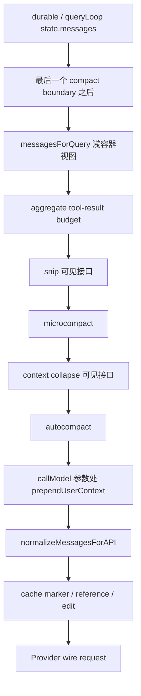

这张图首先帮你排除三个常见误读。

第一，Context 不是一个单独类，也不是一段 system prompt，而是一串拥有不同输入、状态和提交点的投影。第二，轻量裁剪不都在同一时间发生：单个工具结果可能在消息创建前就被外置；aggregate budget 则在下一次请求投影时工作。第三，`messagesForQuery` 也不是最终 API messages，附件合并、临时 user context 和 cache edit 还会继续改变 Provider 所见形状。

源码主入口是：

```text
src/query.ts -> queryLoop()
src/utils/messages.ts -> getMessagesAfterCompactBoundary()
src/utils/toolResultStorage.ts -> applyToolResultBudget()
src/services/compact/microCompact.ts -> microcompactMessages()
src/utils/api.ts -> prependUserContext()
src/utils/messages.ts -> normalizeMessagesForAPI()
src/services/api/claude.ts -> addCacheBreakpoints()
```

这里的顺序由 `src/query.ts -> queryLoop()` 的真实调用确认。Graphify 只帮助定位过候选文件，不是本章证据。

## 完整历史、当前视图和 wire 载荷不是一个 owner

M10 已经建立一个重要原则：durable history 的成员关系必须有唯一 owner。M16 在其上再加一层：**请求投影可以拥有自己的数组，但不能因此获得修改 durable message 的权力。**

`queryLoop()` 的决定性语句很短：

```ts
let messagesForQuery = [...getMessagesAfterCompactBoundary(messages)]
```

它做了两件事：helper 先选择可见起点，spread 再创建独立数组容器。以后用 `messagesForQuery = otherMessages` 替换本地变量，不会改变上层数组的成员；但 spread 是浅复制，内部 message、`message.content` 和 block 仍可能共享引用。

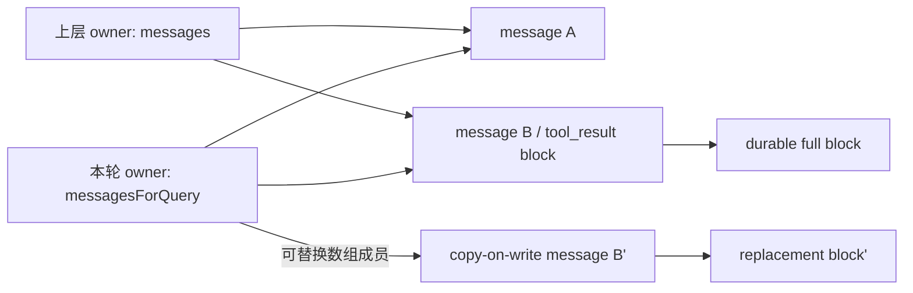

这里首次遇到一个会直接改变架构语义的 TypeScript 概念：

- `[...array]` 只复制第一层容器；
- `ReadonlyArray<T>` 只限制通过这个类型引用修改容器，不会自动 deep-freeze `T`；
- `{ ...message, content: newContent }` 是 copy-on-write 的一层；若 `content` 内还要替换 block，就要继续复制被触及的 block；
- Java 的 `new ArrayList<>(source)` 和 Python 的 `list(source)` 也只是浅容器复制，风险完全相同。

所以“我已经 spread 过了”不能证明投影不会污染历史。真正的证明要观察：被修改的每一层是否都创建了新对象，以及源对象在实验前后是否深度相等。

## History boundary 是协议边界，不是随便选一个下标

`getMessagesAfterCompactBoundary()` 在 `src/utils/messages.ts` 中反向寻找最后一个 `system/compact_boundary`。找不到时返回传入数组；找到时返回 `messages.slice(boundaryIndex)`，并保留 boundary 本身。后续 normalization 会过滤这个内部 system marker。

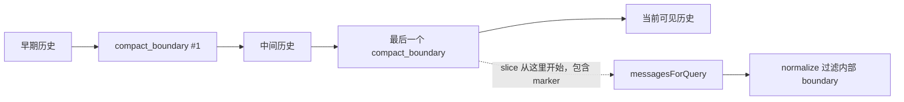

为什么不能换成“从后向前数，够预算就停”？因为消息不是互相独立的文本行。一个 assistant message 可能声明三个 tool calls，紧随其后的 user-role blocks 分别用 call ID 返回结果。若 suffix 恰好从第二个 result 开始，字符串长度可能满足限制，协议却已经失去发起它的 tool call。

完整 history 合法，不代表任意 suffix 合法。这也是 M13 的 strict post-projection validation 在 M16 仍然必须存在的原因：

```text
durable validation 证明原序列合法
!=
projection validation 证明当前请求序列合法
```

快照中的 compact boundary 是由更高层机制选择的合法恢复点；本章 clean-room 实验故意用任意 `historyStart` 破坏它，让错误在 Provider 调用前显现。一个生产系统若允许管理员、策略模块或检索器决定 history start，也必须把“起点对应完整协议边界”做成机器校验，而不是文档约定。

## 大结果为什么有两道不同的缩减

假设模型一次并行调用三个 search，每个返回 80 字符。单结果阈值是 100，最终 user group 阈值是 220：三个结果单独都合法，合并后却有 240 字符。只做 per-result preview 无法发现这个问题。

Claude Code 快照有两道发生时点不同的处理。

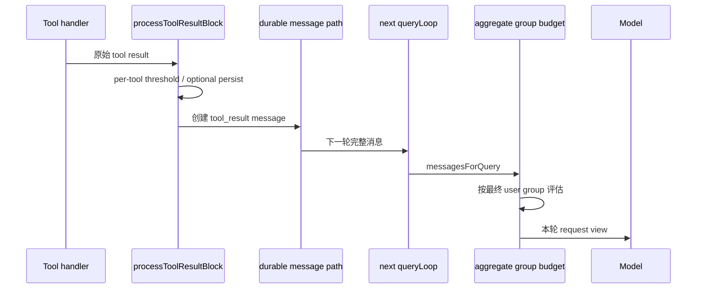

### 第一道发生在消息创建前

`src/services/tools/toolExecution.ts` 在把执行结果构造成 user/tool-result message 前，调用 `src/utils/toolResultStorage.ts -> processToolResultBlock()`。后者先映射协议 block，再进入 `maybePersistLargeToolResult()`：

1. 空结果会被补成一个短 marker，避免某些模型误判 turn boundary；
2. 图片 block 保持原样；
3. 内容未超过工具阈值时保持原 block；
4. 超限时把完整结果写到 session tool-results 文件，并用“文件路径 + 固定 preview”替换 message content；
5. 持久化失败则保留原内容，不伪装成已外置。

这道处理一旦成功，后面进入消息链的 model-facing content 从一开始就是 preview。它不是“只在某一请求临时隐藏”；完整正文另有文件 owner。工具 envelope 还可能保留独立的 `toolUseResult` 供 UI 或内部状态使用，不能把这两个字段混为一谈。

`maxResultSizeChars: Infinity` 是重要例外。`getPersistenceThreshold()` 对非有限上限直接退出，这类工具依赖自己的 `maxTokens` 等机制自限。它说明 per-tool policy 是工具契约的一部分，不是一个能够兜住所有请求的全局上限。

### 第二道发生在下一次请求视图

`queryLoop()` 建立 `messagesForQuery` 后调用 `applyToolResultBudget()`。它只在 `ContentReplacementState` 存在时工作，并按最终 API user message 的合并方式收集候选。若一个组的 eligible tool-result 总量超过限制，就从最大的 fresh result 开始外置和替换，直到估算回到阈值内，或再也没有允许替换的 fresh result。

第二道是 read projection：`replaceToolResultContents()` 只复制包含目标 block 的 message、content array 和 block；未触及对象按引用复用。它不会把 preview 写回原 `messages`。

两道缩减解决的是不同问题：

| 边界 | 何时发生 | 判断单位 | 完整正文 owner | 对 durable message 的影响 |
| --- | --- | --- | --- | --- |
| per-tool persistence | 工具结果进入消息前 | 一个工具的结果大小 | tool-results 文件 | message 从创建时就是 preview |
| aggregate group budget | 下一请求投影时 | 最终合并后的 user group | 既有消息/外置文件 | copy-on-write 请求视图 |

把它们都叫“截断”会丢掉三个关键信息：谁拥有完整正文、决定发生在哪个生命周期、失败时原内容是否仍会发送。

## 分组必须模拟最终协议，而不是看内部 envelope

内部 message 数量经常多于 wire message 数量。并行 tool results 可以分别到达，progress 或 attachment 可以夹在中间，流式 assistant blocks 也可能以同一个 response ID 分成多个 envelope。`normalizeMessagesForAPI()` 会过滤或合并其中一些结构。

aggregate budget 若按每个内部 user envelope 分别计数，就会漏掉“每个都小、合并后很大”的情况。因此 `collectCandidatesByMessage()` 使用一个更接近 wire 的分组规则：

- user message 中的 eligible tool-result 加入当前组；
- progress、attachment 和 system/local-command 不形成边界；
- 第一次出现的新 assistant response ID 才 flush 当前组；
- 同 response ID 的 assistant fragment 再次出现时不形成新边界。

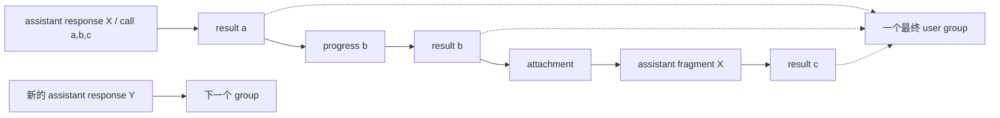

注意：这不是说 progress 和 attachment 在语义上等于 tool result。它们只是**不能被误当作最终 wire group 的分隔符**。状态分类和预算分组是两个维度。

快照还会把 `maxResultSizeChars` 非有限工具加入 `skipToolNames`。被排除的结果会标记为已见，却不计入 eligible fresh size，也不会成为 replacement 候选。于是一个组的真实 wire payload 仍可能超过 wrapper limit。这不是实现遗漏，而是当前 wrapper 契约承认“某些工具自己负责边界”。教材和监控都不能把 `limit=220` 解释成“Provider 一定只看到不超过 220 字符”。

## `seenIds` 和 `replacements` 为什么是状态，不是缓存小技巧

如果每轮都重新按“当前最大的结果”选择 replacement，会发生一个很隐蔽的语义变化。

第一轮请求把结果 A 的全文发给模型，Provider 可能已经缓存这一前缀。第二轮新增结果 D 后，你重新计算并把旧 A 换成 preview。即使本轮 token 更少，原前缀的字节已经改变，Prompt Cache 命中会下降；更严重的是，同一会话在不同轮次对“模型曾看到什么”给出不同答案。

`ContentReplacementState` 用两个集合冻结决定：

- `seenIds`：这个结果已经通过预算判断；
- `replacements`：其中确实被替换的 ID 到**精确 replacement 字符串**的映射。

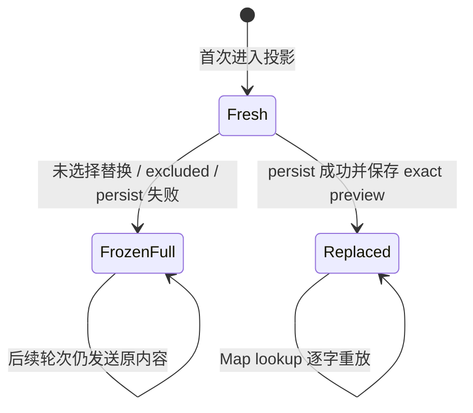

这里“逐字”比“逻辑上相同”更严格。resume record 保存的是 replacement 字符串，不只是 `replaced=true`。如果新版本改变 preview 模板、文件大小格式或路径展示，重新生成的文本可能不同；保存 exact string 才能维持缓存前缀。

选择算法也只对 fresh 候选工作：

```text
mustReapply -> 直接应用旧 replacement
frozen      -> 保留旧全文，不再改命
fresh       -> 必要时按大小选择 replacement
```

如果 frozen results 自己已经超过预算，快照接受 overage，等待后续 microcompact 或 autocompact。稳定性与即时最小 token 之间，当前设计选择前者。这是值得迁移的工程思想：**已经对外可观察的决定，不能因为新一轮局部优化而悄悄重算。**

### `await` 前后为什么要小心

快照的 `enforceToolResultBudget()` 在外置文件时有一个异步空窗。未被选中的 ID 可以同步加入 `seenIds`；被选中外置的 ID，则在 `await persistToolResult()` 返回后，把 `seenIds.add(id)` 和 `replacements.set(id, exactString)` 连续执行。

在 JavaScript 单线程事件循环里，这两条同步语句之间没有 `await`，普通异步任务不会插入其中。这减少了读者看到“已见但没有 replacement”的半状态。但它仍不是通用事务：Set/Map 是可变对象，没有 expected revision，也没有跨进程一致性。

课程 Harness 因此没有照抄可变 Map，而是把过程拆为：

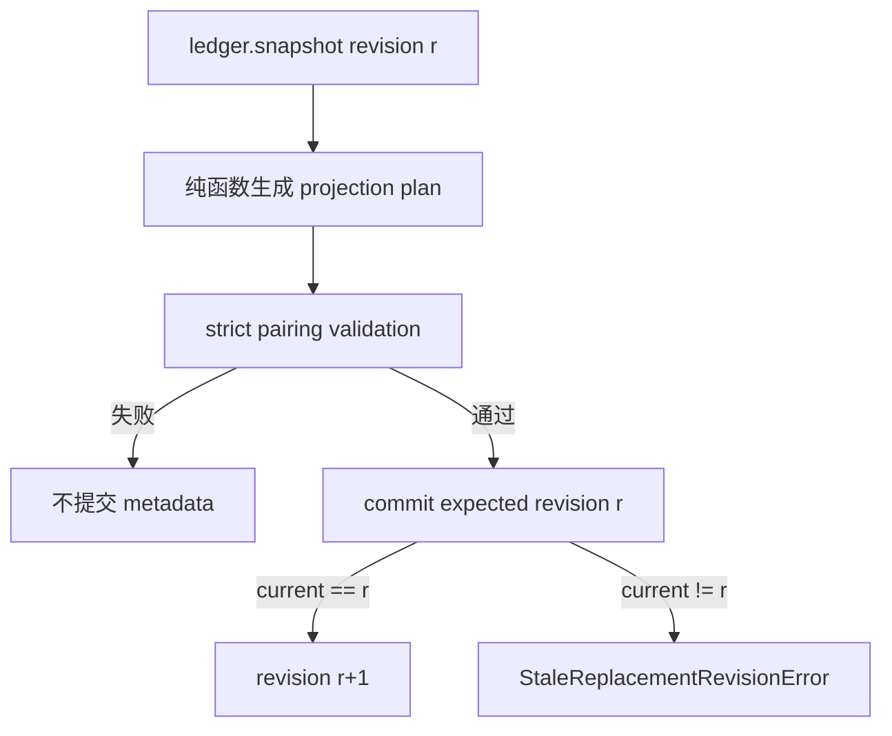

这是设计迁移，不是 Claude Code 快照事实。它用乐观并发控制解决“两个 projector 同时从 revision 3 计算，后到者覆盖先到者”的问题。Java 中可以用带版本号的数据库行或 `AtomicReference.compareAndSet`；Python 单进程可用 lock + revision，分布式场景则需要存储层条件更新。

## fork、resume 和 teammate 不共享同一种状态语义

不能从“subagent 都继承上下文”推导 replacement state 也总会继承。直接源码显示三条不同路径：

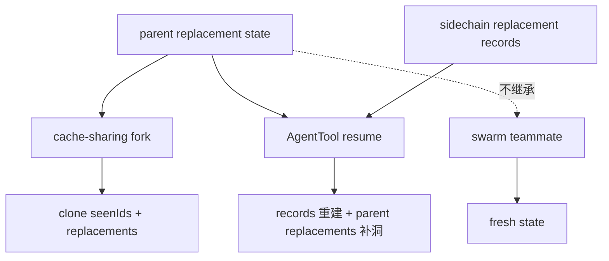

- cache-sharing fork 需要复用父前缀，所以 `cloneContentReplacementState()` 复制父 state，之后各自修改；
- AgentTool resume 从 sidechain records 重建，并用父 replacements 填补“继承时已经替换、但子链没有新 record”的缺口；
- swarm teammate 是独立会话，不复用父 Prompt Cache 前缀，因此从 fresh state 开始。

这个差异揭示一个更通用的判断方法：不要问“它是不是子 Agent”，要问“它是否承诺共享同一个模型可见前缀，以及恢复后是否要重现此前的精确决定”。状态继承由一致性目标决定，不由对象树关系决定。

## 四种预算单位一定要分开

Context 代码里同时出现 char、token、message 和 API payload。命名如果不精确，教材很容易写出“工具结果超过 token 限制，所以按 bytes 截断”这种混合句子。

| 单位 | 快照中的代表位置 | 真正回答的问题 | 不能推出什么 |
| --- | --- | --- | --- |
| JavaScript 字符长度 | per-tool threshold、aggregate group | 哪些文本先外置或替换 | 精确 UTF-8 bytes 或模型 token |
| 估算 token / API usage | `tokenCountWithEstimation()` | 是否接近 blocking/autocompact 阈值 | 哪个结果应被替换 |
| 最终 message group | `collectCandidatesByMessage()` | 哪些并行结果会在 wire 上共同占用一条 user message | 内部 envelope 数等于 wire 数 |
| wire payload | normalize + cache blocks | Provider 实际收到的协议对象 | durable history 被同样改写 |

`roughTokenCountEstimation(content, 4)` 实际使用 `content.length / 4`。尽管参数名和常量附近常出现 `bytesPerToken`，这里的 `String.length` 是 JavaScript UTF-16 code unit 数，不是读取 `Buffer.byteLength(content, 'utf8')` 后得到的真实 bytes。英文、中文和 emoji 的比例都可能不同。

`tokenCountWithEstimation()` 也不是每轮从头 tokenizer。它向后找到最近一个带真实 API usage 的 assistant response；若同 response ID 因并行 blocks 被拆成多个 sibling，会退回到该 response 的第一个 sibling，然后用：

```text
最近一次真实 API usage
+ 此后新增 message 的粗估 token
```

这样既避免累计 token 重复计算，也不会漏掉夹在同 response siblings 之间的 tool results。没有 usage 时才对全部 messages 粗估。snip 释放的 token 又要单独从这个估值中减去，因为旧 usage 本身不会自动知道 read-time projection 删除了什么。

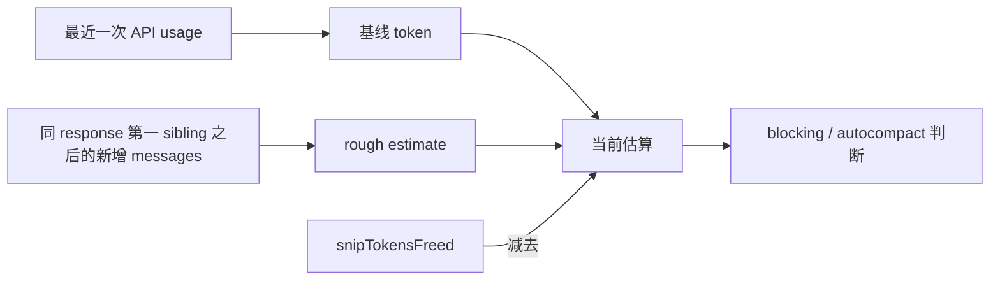

企业系统最好让指标名带单位，例如 `tool_result_chars`、`estimated_context_tokens`、`wire_user_group_count`，而不是统称 `context_size`。单位本身就是接口的一部分。

## snip、microcompact、collapse 和 autocompact 不是同一个开关

回到章首管线，aggregate budget 后依次可见：snip、microcompact、context collapse、autocompact。它们都可能让模型看到更少内容，却有不同 owner 和恢复语义。

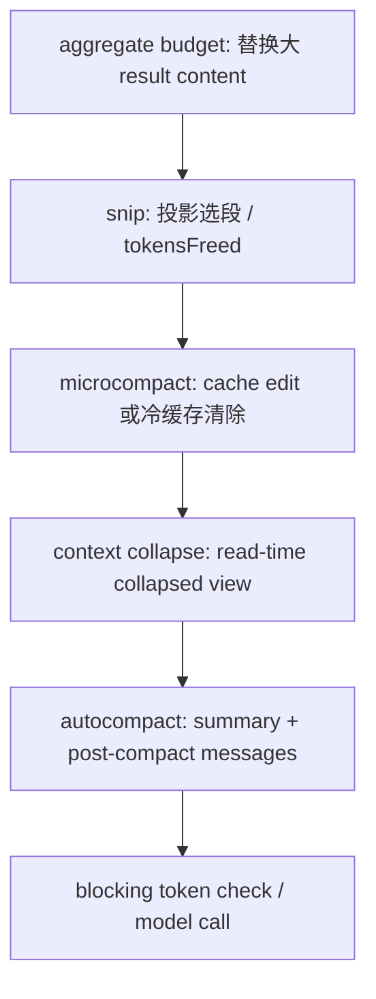

当前源码快照缺少 `snipCompact.ts`、`snipProjection.ts`、`cachedMicrocompact.ts` 和 context-collapse 的内部实现文件。我们能确认调用接口、顺序、输入输出和下游用法，却不能补造其选段算法、feature 默认值或全部边界。下面每个结论都守在可见证据内。

### snip

feature 开启时，`snipCompactIfNeeded(messagesForQuery)` 返回新的 `messages`、`tokensFreed` 和可选 boundary message。`tokensFreed` 会传给 autocompact 与 blocking check，修正“最近 API usage 仍包含旧内容”的估值。缺失模块使我们不能断言它具体保留哪些段落。

### cached microcompact

`microCompact.ts` 中可见的 cached path 按 compactable tool-use ID 登记结果组，生成 pending cache edits，却返回原 `messages`。真正的 `cache_reference` 和 `cache_edits` 要到 API 层的 `addCacheBreakpoints()` 才加入 wire。也就是说，本地 history 和模型缓存中的逻辑可见内容可以通过协议能力分离。

### time-based microcompact

若明确是 main-thread source、距离上一个 assistant response 的时间超过阈值且有可清理结果，缓存已经被认为是冷的。此时不再维护旧缓存前缀，而是 copy-on-write 把除最近 N 个以外的 compactable result 内容换成 cleared marker，并重置 cached-MC state。

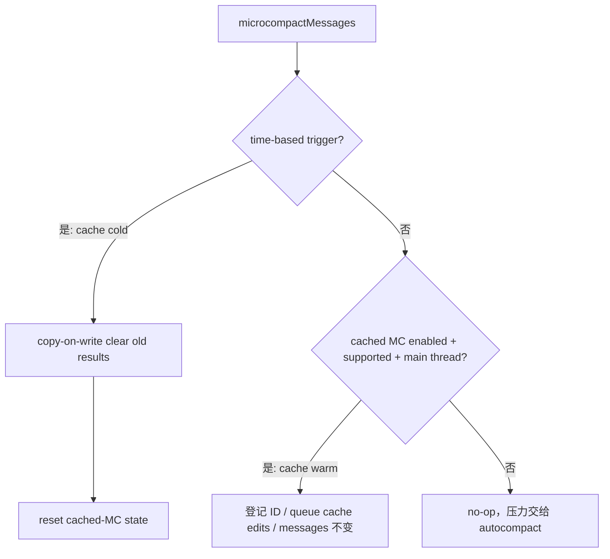

### 一个不能美化掉的快照缺口

`microCompact.ts -> isMainThreadSource()` 接受 `querySource.startsWith('repl_main_thread')`，因此 `repl_main_thread:outputStyle:custom` 可以进入 cached path。`src/services/api/claude.ts` 中 `useCachedMC` 却要求 `options.querySource === 'repl_main_thread'`。

API 层又在构造 retry 参数函数之前，只按 `cachedMCEnabled` 调用一次 `consumePendingCacheEdits()`。于是 output-style variant 可能产生 pending edit，被消费后却因为 exact gate 不进入 `addCacheBreakpoints()`，造成 module state 与 wire 行为漂移。

这应标为当前快照实现缺口，而不是优秀设计。Harness 不复制它：一次请求对“是否启用某能力”只计算一个 gate decision，并让产生、消费和发送共享该决定。

`consumePendingCacheEdits()` 放在 retry 参数 builder 外则是另一个正确的细节。builder 可能因日志或重试执行多次；如果每次调用都消费全局 pending state，第一次仅用于日志的构造就可能偷走真实请求的 edit。这里的原则是：**一次性状态先由请求 owner 领取，再让纯参数构造重复读取同一 snapshot。**

## 附件什么时候进入，决定了 tool pairing 是否仍合法

附件不是统一在开场或结束时追加。用户轮次开始时，`processUserInput()` 收集当前附件，`processTextPrompt()` 形成 `[userMessage, ...attachmentMessages]`。Tool Loop 中途出现的文件变更、队列通知、memory prefetch 和 skill prefetch，则必须等当前批次 tool results 全部完成后再加入 `toolResults` 容器。

源码注释直接说明原因：API 不接受普通 user message 与 `tool_result` 交错。若 assistant 发起 A、B 两个调用，在 A 的 result 后插入一条普通附件，再放 B 的 result，配对在领域层或许都找得到，Provider 的相邻协议却可能失败。

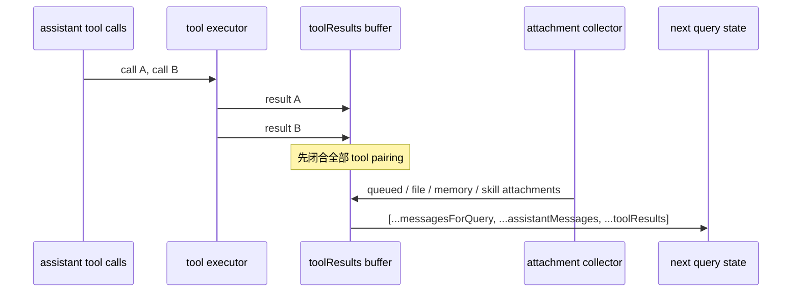

这里可以迁移到 RAG。检索片段、权限通知和后台任务结果都可能采用 user-role 编码，但“role 相同”不表示它们可以任意交错。应该先区分领域 kind，再由 Provider projector 根据协议排列。

## `prependUserContext()` 只活在一次调用参数里

`queryLoop()` 调模型时写的是：

```ts
deps.callModel({
  messages: prependUserContext(messagesForQuery, userContext),
  // ...
})
```

`prependUserContext()` 在非测试环境且 context 非空时，创建一个 `isMeta: true` 的 user message 放到数组最前面，再 spread 原 messages。它不赋值回 `messagesForQuery`，也不会出现在本轮结束时构造的 next state。

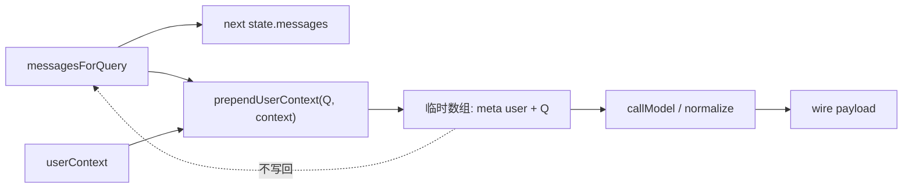

`isMeta: true` 是内部语义标签，不代表 Provider 自动忽略。normalization 仍会把它编码成 user content，并可能与相邻 user message 合并。所以正确表述是“request-only，但 model-visible”，不是“元数据所以不占上下文”。

随后 `src/services/api/claude.ts` 才把 normalized messages 交给 `addCacheBreakpoints()`。该函数加入 message-level cache marker；cached MC 开启时还会重放 pinned edits、加入新的 delete edits，并给缓存前缀内的 tool-result blocks 添加 `cache_reference`。这些都是 wire projection，不应写回通用 message objects。源码为 cache reference 创建新 block，也正是为了避免同一对象随后被不支持 cache editing 的次级请求复用时受到污染。

## 一次完整请求现在可以怎样复述

把前面的局部图重新串起来，学习者应该能不用源码说出这条主线：

1. `queryLoop()` 从 producer-local state 读取当前 messages；durable owner 在更上层。
2. helper 选择最后一个 compact boundary 之后的可见历史，spread 只创建浅容器。
3. aggregate budget 按最终 API user group 检查 fresh tool results，稳定重放既有 replacement，并 copy-on-write 当前请求视图。
4. snip、microcompact、context collapse 和 autocompact 按固定顺序进一步处理，但各自的状态与持久化语义不同。
5. blocking check 使用最近 API usage 加新增消息粗估，并扣除可见的 snip freed tokens。
6. request-only `userContext` 只在 `callModel()` 参数处临时 prepend。
7. normalization 把内部 envelopes 投影为 Provider messages，合并相邻 user 内容并过滤内部 marker。
8. API 层加入 cache marker/reference/edit，才得到 wire payload。
9. Tool Loop 完成后，普通附件放在所有 tool results 之后，再构成下一 iteration state。

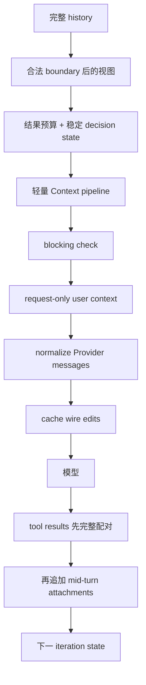

这条链中，“可见内容变少”至少有四种含义：从 history 选择 suffix、把结果换成外置 preview、在 cache 层删除旧结果、用 summary 替代旧段落。它们不能共享一个含糊的 `truncate()` API，因为恢复、缓存和 owner 完全不同。

## 用双语言实验推翻三个直觉

独立实验位于：

```text
curriculum/units/M16/code/typescript/
curriculum/units/M16/code/python/
```

先不要看断言，写下三个预测：

1. 从尾部保留 170 字符是否一定得到合法请求？
2. 三个 80 字符结果在单结果上限 100 时，是否已经受到总量保护？
3. 同一 history 连续投影两次，第一次 replacement 是否会逐字保持？

运行 TypeScript：

```powershell
cd "D:\agent\Claude code最新\curriculum\units\M16\code\typescript"
node --test .\context-budget.test.ts
& "D:\agent\Claude code最新\mini-agent-harness\node_modules\.bin\tsc.cmd" -p .\tsconfig.json --noEmit
node .\demo.ts
```

运行 Python：

```powershell
cd "D:\agent\Claude code最新\curriculum\units\M16\code\python"
python -m unittest -v test_context_budget.py
python .\demo.py
```

实际结果是 TypeScript `8/8`、Python `8/8`，TypeScript strict typecheck 通过。demo 中 durable tool-result 总量为 240 字符；per-result preview 后仍为 240；aggregate projection 在示例策略下变为 190，并记录两次新 replacement。

### 实验真正证明了什么

- `naiveGlobalSuffix()` 会从 result 开始，strict validator 报 orphan；它反证“只要最后 N 字符”的做法。
- `applyPerResultPreview()` 中每个结果都低于 100，因此总量仍是 240；它反证“单项合法就代表聚合合法”。
- `planAggregateProjection()` 把 progress、attachment 和同 response fragment 视为非边界，三个 result 进入同一组。
- 第一次 commit 保存 exact preview；第二次只 reapply，messages 深度相等，revision 保持 1。
- self-bounded 结果不会被替换，report 的 `overBudget` 为 true；它反证“wrapper limit 是硬保证”。
- source 在前后深度相等；它支持 copy-on-write，但只证明当前 clean-room 实现，不证明所有 Claude Code feature path。
- 两个 plan 从同一个 ledger snapshot 产生时，第二个 commit 抛 stale error；它证明课程设计的 revision gate。

报告只含 call ID、字符数、状态和 revision，不含原正文或 preview。生产 trace 若记录 preview，仍可能泄漏文件、日志、PII 或密钥；“已经截短”不等于“适合遥测”。

### 现在动手破坏它

先把 TypeScript `collectFinalUserGroups()` 改成遇到 `progress` 就 flush。预期：原本一个三结果组会被拆开，`newlyReplacedCount` 降低甚至为 0，总 wire group 风险被漏掉。修复时不要专门判断 progress，而要恢复“只有最终协议中的真实 assistant boundary 才 flush”的模型。

再把 `projectAndCommit()` 中的 `assertStrictPairing()` 移到 `ledger.commit()` 之后，然后用 orphan history start 运行。你会得到半提交：请求失败，但 replacement revision 已推进。正确顺序是 validate-before-commit。

最后把 replacement preview 从 ledger Map 中删除，第二次根据当前 `previewChars` 重算。让第二次策略从 4 改成 2，观察字节不再稳定。修复不是固定一个全局常量，而是把已经对外可观察的 exact decision 当作状态保存。

## H3-1 怎样进入 Mini Agent Harness

S2 的 Harness 已有 `ConversationStore`、`RequestProjector`、strict pairing 和 per-result preview。M16 没有另起一套 Context 服务，而是在现有 request boundary 上加入最小但完整的状态协作。

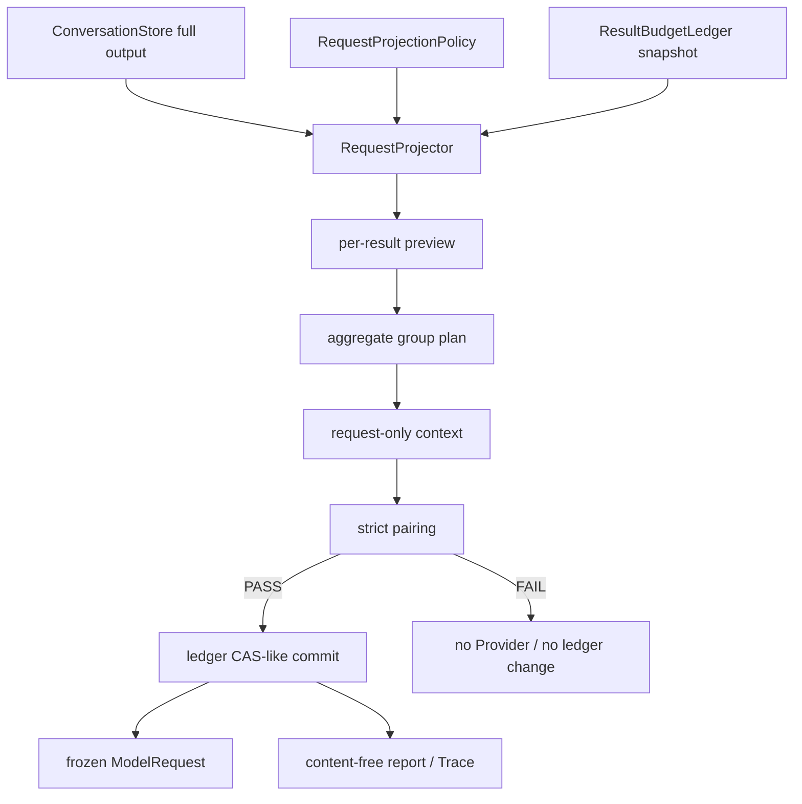

新增契约如下：

- `RequestProjectionPolicy.maxToolResultGroupChars` 显式配置聚合上限；默认缺省时为 no-op，保持兼容。
- `ResultBudgetLedger` 由 Runtime 生命周期持有，不由 Provider adapter 持有。
- ledger snapshot 给纯 projection plan 使用；commit 验证 expected revision。
- strict pairing 在 commit 前执行。
- report 增加 new/reapplied/frozen/group/over-budget/revision 字段，不包含正文。
- TypeScript 与 Python 镜像同一行为，不要求语言结构逐行翻译。

为什么 ledger 属于 Runtime，而不是 `ConversationStore`？因为 Store 拥有 durable message facts；replacement ledger 拥有某一请求策略已经对模型暴露过的决定。它们生命周期相关，但不是同一事实。如果把 ledger 塞进 Store，就容易把 request optimization 误当成 durable conversation；如果放进 Provider adapter，又会让不同 Provider 实例或 retry 层私自决定历史可见性。

当前增量仍有明确边界：没有外置文件，没有 Transcript record，没有 resume/fork provision，没有 Provider cache edit，没有 tokenizer-aware 总请求预算，也没有完整 compact。M16 单独完成时不发布 H3；只有 M17-M19 共同闭合后，S3 才把四个增量原子发布为 `H3 / 0.4.0`。

累计回归结果：TypeScript Runtime `27/27`、Provider `7/7`、Tool `5/5`、Scheduler `5/5`、Stream `4/4`；Python Agent/Scheduler/Stream `24/24`、ConversationStore `13/13`；H2 `4/4`、H1 `12/12`、S0 `15/15` 和集成回归 `4/4` 全部通过。

## 迁移到企业 Agent、RAG 和 Java/Spring

企业 Context Pipeline 最值得迁移的不是某个阈值，而是五个控制面。

### 1. 把内容 owner 与可见性 owner 分开

Transcript/ConversationStore 保存事实，ContextProjector 决定本请求看见什么。RAG 检索结果、工具输出和 Memory 都通过 typed projection 进入请求，而不是反向改写原始记录。审计要能回答“原文在哪里”和“模型这一轮看到了哪种投影”。

### 2. 预算必须有单位和作用域

至少区分：per artifact bytes、estimated tokens、final message group、full request context window、output reserve。不要让一个 `maxContext` 同时承担文件上传、工具返回和模型窗口三种职责。

### 3. 把稳定决定做成可恢复记录

若系统依赖 Prompt Cache、审计重放或 deterministic retry，就保存 exact replacement/summary 及其 provenance，而不是恢复时用新版本代码重算。记录至少包含 conversation/thread ID、source item ID、decision revision、策略版本、replacement digest 或受控正文引用、创建时间和恢复状态。敏感正文不应进入普通 trace。

### 4. 用 validate-before-commit 保护投影事务

projection 是纯计划；协议配对、schema、token reserve 和安全策略全部通过后，才提交 decision metadata。Provider 调用失败是否回滚 metadata，要由“这个决定是否已经成为外部可观察事实”裁决，不能一概回滚。

### 5. 明确 over-budget 的降级路径

所有候选被冻结、图片无法替换或 self-bounded 工具违反假设时，系统要返回结构化原因，然后选择 compact、拒绝请求、换更大上下文模型或要求工具重新分页。静默继续可能在 Provider 处收到不可控的 context error。

在 Spring 中，可以把边界组织为：

```java
interface ContextProjector {
    ProjectionPlan plan(ConversationSnapshot source,
                        BudgetLedgerSnapshot ledger,
                        ProjectionPolicy policy);
}

interface BudgetLedgerRepository {
    BudgetLedgerSnapshot load(ConversationId id);
    long commit(ConversationId id, long expectedRevision,
                ReplacementDecisionSet changes);
}
```

`@Transactional` 只能保护同一数据库事务里的 metadata，不能自动让 Provider 调用和对象存储成为原子操作。更现实的做法是 outbox/intent + idempotent materialization：先持久化 projection intent，外置内容成功后提交 exact decision，再发模型请求；恢复程序根据状态机补做或回滚未完成 intent。M17 会继续讨论 compact summary 的事务提交点。

LangGraph 的 state reducer 也不应原地删除 Transcript。可以让一个 Context node 从 durable state 产生 `request_view` 和 `projection_report`，模型 node 只消费这个不可变视图；replacement ledger 则由 checkpointed state 或外部 repository 持有。这样 graph orchestration 负责顺序，Context contract 仍然独立可测。

## 资深 Agent 开发面试会怎样追问

下面的问题不是背诵题库。先尝试只用第一句回答，再逐步展开到 Claude Code 设计、失败边界和企业方案。

### 1. “会话历史都保存在内存里，为什么模型还是看不见全部历史？”

**结论先说：保存历史和构造一次模型请求是两个不同的所有权边界，模型只看到当前 Context Pipeline 投影出的 wire payload。**

在 Claude Code 这条链里，`queryLoop()` 先从最后一个 compact boundary 后建立 `messagesForQuery`，再经过 aggregate tool-result budget、snip、microcompact、collapse 和 autocompact；调用模型时还临时 prepend user context，之后 normalization 会合并和过滤内部消息，API 层再加 cache blocks。所以 UI 能回看的 durable history、Query 当前视图和 Provider 请求并不等价。这个分层的价值是保留恢复与审计事实，同时按当前模型窗口和缓存策略控制可见内容。企业实现里我会让 ConversationStore 只拥有完整事实，让 ContextProjector 产生不可变 request view，并记录不含正文的 projection report；绝不会为了省 token 原地删 Transcript。

### 2. “你会怎样裁剪大工具结果，保证不破坏 tool calling 协议？”

**结论先说：只能替换结果正文，不能切断 tool call/result 的结构，而且投影后必须重新做严格配对校验。**

单结果阈值不够，因为并行结果可能分别很小、在最终 user message 合并后超限。Claude Code 快照既有消息创建前的 per-tool 外置，也有请求阶段按最终 API user group 的 aggregate budget；后者把 progress、attachment 和同 response fragments 当成非边界，只让新的 assistant response 切组。替换时保留 `tool_use_id`、message 顺序和 error 语义，只把 content 换成稳定 preview。我的 Harness 还把 strict pairing 放在 ledger commit 前，任何 orphan、missing、duplicate 都在 Provider 前失败，且不推进 replacement revision。生产上还要为无法替换的图片或自限工具提供 compact 或拒绝路径。

### 3. “为什么 replacement 结果要跨轮保存？每次重新算不是更省吗？”

**结论先说：replacement 是已经影响模型可见前缀的一致性决定，跨轮重算会破坏 Prompt Cache 和可重放语义。**

Claude Code 用 `seenIds` 冻结曾经发过全文的结果，用 `replacements` 保存已替换结果对应的精确 preview。后续不是重跑模板，而是 Map lookup 逐字重放；resume record 也保存字符串，不只保存布尔值。这样旧前缀不会因为新结果加入、阈值变化或代码升级突然改形。代价是 frozen content 可能让当前组继续 over-budget，所以还需要 microcompact 或 full compact 兜底。企业系统里我会把 decision revision、source ID、exact representation/provenance 持久化，并用策略版本区分新旧决定；如果只存 `wasTruncated=true`，恢复时重算就不能保证字节稳定。

### 4. “字符数、token 数和 Context Window 有什么区别？线上应该怎么监控？”

**结论先说：它们是不同单位、不同作用域的约束，必须分别命名和观测，不能用一个 `context_size` 混过去。**

Claude Code 的工具结果预算主要按 JavaScript 字符长度做启发式选择；`roughTokenCountEstimation()` 也是 `String.length / ratio`，不是真实 UTF-8 bytes。blocking/autocompact 则用最近 API usage 加后来消息粗估，最终 Provider 还会看到 normalization、附件和 cache blocks 组成的 wire payload。所以字符预算只能决定“先替换谁”，不能承诺精确 token；单组预算也不是完整窗口。线上我会同时打 `result_chars`、`estimated_input_tokens`、`actual_input_tokens`、`cache_read_tokens`、`over_budget_group_count` 和 projection revision，并按模型保留 output reserve。真正接近硬限制时，以 tokenizer/API usage 或 Provider 返回为准。

### 5. “两个请求同时做 Context 投影，会有什么竞态？”

**结论先说：最危险的不是同时读历史，而是两个旧快照对同一 result 作出不同 replacement 决定并相互覆盖。**

快照实现主要依赖每 conversation thread 的稳定 owner，可变 Set/Map 没有通用 revision transaction。我的 clean-room Harness 把 ledger 变成 snapshot-plan-commit：两个 projector 都从 revision 5 计算时，第一个 commit 到 6，第二个提交 expected 5 会显式抛 stale error；它要重新读取，而不是 last-write-wins。并且 strict pairing 在 commit 前，非法请求不会留下半状态。企业分布式实现可以用数据库 `UPDATE ... WHERE revision=?`、Redis CAS/Lua 或事件流单 writer。若外置对象存储也参与，还要有 intent/outbox 和幂等 key，单靠进程锁不够。

### 6. “Prompt Cache 和 Context 压缩应该怎样协作？”

**结论先说：热缓存优先维持前缀字节稳定，冷缓存可以直接改写内容；两条路径必须共享一致的 gate 和一次性状态 owner。**

Claude Code 的 cached microcompact 本地 messages 不变，只登记 tool IDs，API 层再加 `cache_reference` 和 delete edits；time-based path 判断缓存已冷后，才 copy-on-write 清除旧 result 并重置 cached state。快照里 output-style source 的 prefix gate 与 API exact gate 不一致，说明 gate 分裂会导致 pending edit 被消费却未发送。另一个值得借鉴的点是 pending edit 在 retry 参数 builder 外只消费一次，随后每次重建请求都读取同一 snapshot。企业方案里我会让请求 owner 先领取 `CacheEditPlan`，生成、发送、pin 共用同一个 capability decision，并让 retry 幂等重放，而不是每层重新查 feature flag。

### 7. “如果让你给企业 RAG Agent 设计 Context Pipeline，你会先做哪些契约？”

**结论先说：我会先冻结 owner、投影阶段、预算单位、提交点和降级语义，再选择摘要模型或向量库。**

具体来说，Transcript 保存完整用户输入、检索证据和工具结果；ContextProjector 从 revisioned snapshot 生成 request view；每个来源带 scope、provenance、敏感级别和生命周期。预算分 per-item、final group、estimated token、output reserve 四层；投影后验证 tool pairing、引用完整性和安全策略。replacement 与 summary 使用 expected revision 和可恢复记录，trace 只放 ID、计数和策略版本。无法满足预算时返回结构化原因，进入分页、重新检索、compact、换模型或拒绝，而不是静默丢内容。Java/Spring 我会用 repository CAS 加 outbox；LangGraph 只负责编排 node，不让 reducer 同时成为 Transcript owner 和模型请求 builder。

## 离开本章前，做一次不看答案的重建

拿一张空纸，从 `queryLoop state.messages` 开始画到 Provider wire request。图中必须至少出现：最后 compact boundary、aggregate group、replacement state、snip/microcompact/autocompact、临时 user context、normalization 和 cache edits。然后标出每一步是“选择成员”“替换 content”“产生协议附件”还是“提交持久状态”。

再回答四个故障问题：

1. suffix 从 tool result 开始，哪一道校验拒绝？
2. 三个结果各自未超限但合并超限，哪一道预算负责？
3. 已经发过全文的结果为什么不能下一轮临时替换？
4. pending cache edit 为什么不能在每次 retry 参数构造时消费？

最后在 Harness 中完成一个修改：给 over-budget report 增加结构化 `reason`，至少区分 `frozen-only`、`excluded-only` 和 `non-positive-reduction`。要求不记录正文，TypeScript/Python 行为一致，并保持累计回归通过。这个练习会迫使你把“预算没有满足”从一个布尔值提升为可治理的失败语义。

## 源码复习索引与边界

按下面顺序回源码，可以最快重建本章：

```text
src/query.ts
  -> queryLoop(): messagesForQuery 与 Context 处理顺序
  -> blocking token check
  -> deps.callModel({ messages: prependUserContext(...) })
  -> tool results 后的 attachment 注入与 next State

src/utils/messages.ts
  -> findLastCompactBoundaryIndex()
  -> getMessagesAfterCompactBoundary()
  -> normalizeMessagesForAPI()

src/utils/toolResultStorage.ts
  -> processToolResultBlock()
  -> maybePersistLargeToolResult()
  -> ContentReplacementState
  -> collectCandidatesByMessage()
  -> enforceToolResultBudget()
  -> reconstructContentReplacementState()

src/services/compact/microCompact.ts
  -> microcompactMessages()
  -> cachedMicrocompactPath()
  -> evaluateTimeBasedTrigger()

src/utils/tokens.ts
  -> tokenCountWithEstimation()

src/services/tokenEstimation.ts
  -> roughTokenCountEstimation()

src/utils/api.ts
  -> prependUserContext()

src/services/api/claude.ts
  -> pending cache edit 单次消费
  -> addCacheBreakpoints()
```

本章证据状态必须保持清楚：

- 上述处理顺序、两层结果缩减、group boundary、replacement state、附件时点、token 估算和 wire cache edit 是 `快照事实`；
- TypeScript/Python `8/8` 与 Harness 回归是 `运行验证`，只证明 clean-room 契约；
- revision ledger、content-free report 和统一 gate 是 `设计迁移`；
- 缺失的 snip、cached-microcompact、context-collapse 内部算法不能补写，cached-MC output-style gate 不一致是当前 `快照缺口`。

到这里，你不应再把 Context 理解成“把历史塞进 token window”。更准确的心智模型是：**durable owner 保存事实，Context Pipeline 通过一组有单位、有状态、有验证和有提交点的投影，为一次请求构造可重放的模型视图。**下一单元将在这个基础上处理更危险的问题：当轻量投影仍然装不下时，summary 如何生成、何时提交、取消或崩溃后怎样避免半 compact。
