# M17 上下文装不下时谁能改写历史：Compact 事务、边界与恢复

> 本章主体预计 4 至 7 小时。故障注入、Harness 修改和扩展设计另计。你不需要先会写数据库事务，但必须已经完成 M10、M13、M16，知道 durable history、Query view、API view 和 wire request 不是同一个对象。

## 一次“压缩成功”，到底成功了什么

你和 Agent 已经协作了两个小时。它读过几十个文件，执行过工具，保留了完整 Transcript；下一次请求却接近 Context Window。系统生成了一段漂亮摘要，界面也显示 “Conversation compacted”。这时如果进程立即崩溃，重启后一定能恢复到摘要后的会话吗？

答案是：**不能仅凭“摘要生成成功”下结论。**

一次 compact 至少跨过四个不同完成点：


前一个完成不自动推出后一个完成。Claude Code 当前快照没有把这些步骤包装成一个数据库式原子事务。它使用顺序、边界消息、append-only Transcript、write queue、preserved-segment metadata 和恢复时的 fail-open 策略，尽量让正常路径顺畅、让部分失败可恢复；但 hard crash 下仍存在窗口。

本章要建立的不是“摘要算法”心智模型，而是：

> Compact 是一次跨内存视图、副状态、持久化队列和恢复链的历史改写协议。摘要只是其中一个输入，boundary、owner、提交点和恢复语义才决定系统是否仍可信。

先把整条路看见：

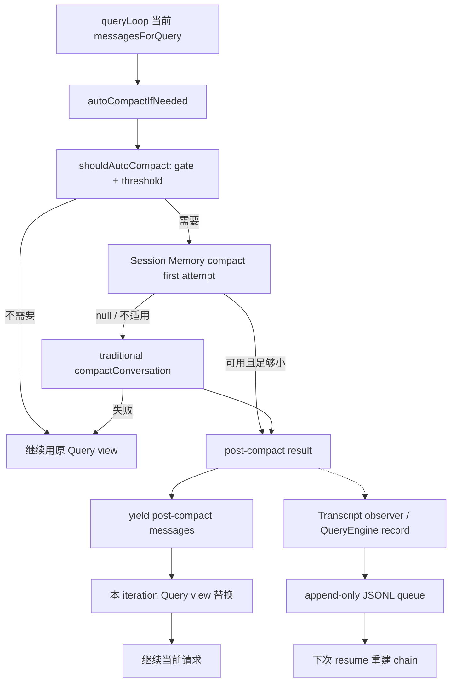

Graphify 只帮助定位过 `query.ts`、`services/compact/`、`useLogMessages.ts` 和 `sessionStorage.ts`。下面的职责、顺序和失败边界均回到源码快照及独立实验核验。

## 为什么不等 Context Window 真满了再 compact

入口位于 `src/query.ts -> queryLoop()`，auto 决策集中在 `src/services/compact/autoCompact.ts`。这里必须先拆开两个经常被混写的职责：

- `shouldAutoCompact()` 判断当前 source、配置、feature gate 和 token threshold 是否允许或需要 compact；
- `autoCompactIfNeeded()` 管理 consecutive failure 熔断，尝试 Session Memory，再 fallback 到 traditional compact，并更新失败计数。

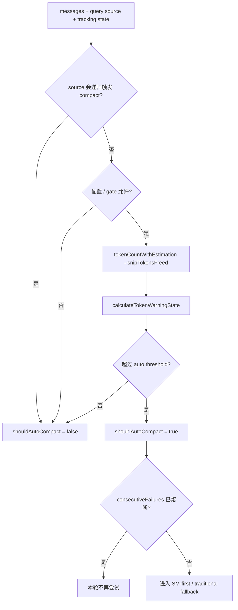

为什么 threshold 小于模型标称 Context Window？因为请求仍要为摘要输出、下一次模型输出、system/attachment 和估算误差预留 headroom。等到输入占满窗口，摘要请求自己也可能因为没有输出空间而失败。

这与生产系统中的磁盘高水位很像：告警阈值不是物理容量。一个 200k token 模型不意味着你可以先装入 199,999 token，再要求它生成可靠摘要。工程配置至少要区分：

```text
effective context size
- reserved summary/output headroom
- auto-compact buffer
= operational trigger region
```

`tokenCountWithEstimation()` 也不是精确 tokenizer 的全知结果。它会利用最近 API usage，再估算后来消息。M16 已经说明字符、estimated token、API usage 和最终 wire token 属于不同单位；M17 的 threshold 是运行决策，不是数学证明。

### 为什么需要失败熔断

假设 summary 请求连续三次因为同一输入过长或 Provider 故障失败。如果 Query Loop 每个 iteration 都再次 compact，系统会把主要时间消耗在注定失败的内部请求上，甚至形成“为了恢复而无法继续”的活锁。

`AutoCompactTrackingState.consecutiveFailures` 给会话内 auto path 一个简单 circuit breaker。注意它不属于 threshold 函数。这个拆分很重要：纯决策函数回答“是否应该”，有状态协调器回答“现在是否还值得再试”。企业迁移时也应把 policy 与 retry/circuit state 分开，否则单元测试很难证明一次失败为什么改变下一次决定。

traditional compact 失败后，auto path 通常返回 `wasCompacted:false`，当前 iteration 继续使用原 `messagesForQuery`。这不是“整个状态回滚”，只能说明消息视图没有切换；稍后会看到辅助状态可能已经改变。

## 摘要请求是受限 fork，不是继续跑一次 Tool Loop

`src/services/compact/compact.ts -> compactConversation()` 不是简单的：

```ts
const summary = await model.complete(messages)
return [summary]
```

真实顺序更长：

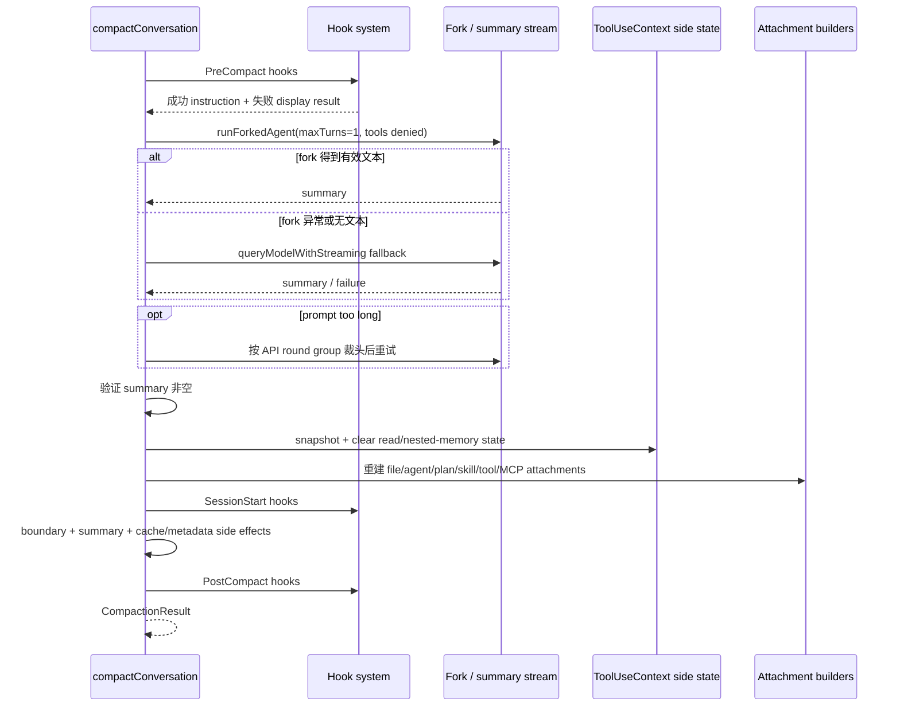

`streamCompactSummary()` 优先走 `runForkedAgent()`，目的是复用已有 Prompt Cache；它共享同一个 abort controller，限制 `maxTurns:1`，并用 `createCompactCanUseTool()` 拒绝工具。若 fork 没拿到可用文本，再走 streaming model fallback；fallback 同样接受取消信号，使用固定摘要 system prompt，并禁用 thinking。

这几个限制共同表达一个设计判断：**summary 是内部受控计算，不应在压缩历史时再次产生任意工具副作用。** 如果允许摘要模型读写文件、启动任务或请求权限，compact 就从“历史投影”升级成新的业务 turn，失败与审计边界会彻底混乱。

### prompt-too-long 重试到底丢了什么

摘要请求自己也可能太长。`truncateHeadForPTLRetry()` 从最老 API round group 开始丢弃，至少保留一组；若裁切后 assistant 位于首部，会插入 synthetic user marker，后续逻辑继续保护 tool pairing。fork 的 context messages 和普通 messages 输入一起改成裁后的集合。

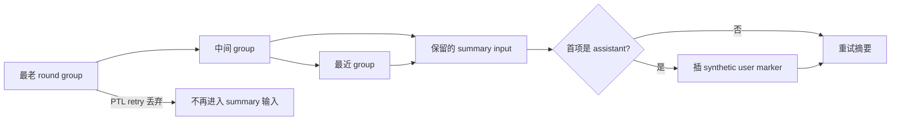

这里不能说“最老内容已经安全压缩”。它恰恰没有进入本次 summary。PTL retry 的目标是让系统恢复可用，不是无损归档。企业系统若要求合规留存，应由 Transcript 或对象存储保存事实，不能让 summary 承担唯一审计副本。

## Hook 为什么不像数据库触发器

PreCompact、PostCompact 的名字很容易诱导出错误类比：“Pre 可以 block，Post 失败会 rollback”。当前快照不是这个语义。

`src/utils/hooks.ts -> executeHooksOutsideREPL()` 会把逐 hook 的 timeout、abort、进程非零退出和解析失败转换成 `succeeded:false` 结果。PreCompact wrapper 只把成功且非空的输出加入 custom instructions；失败通常成为 display 信息。PostCompact 的普通失败同样不会把已经生成的 summary 回滚。

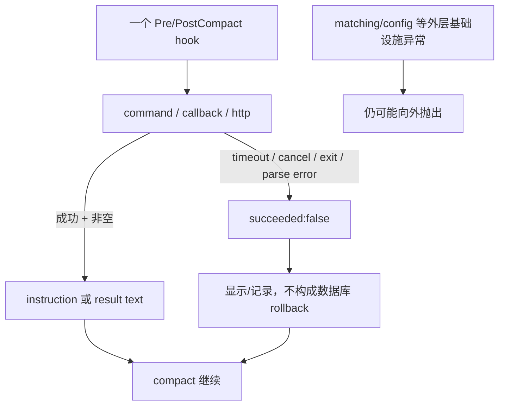

准确表达应是：**普通逐 hook 失败被结果化，通常不阻止 compact；更外层的 hook 基础设施仍可能抛错。**

这也说明“block”不能脱离调用协议解释。一个 permission hook 的 block、一个 PreToolUse hook 的 deny 和一个 PreCompact hook 的失败，不一定共享控制语义。面试中如果只说“Hook 都能阻断”，会暴露你没有跟踪调用者怎样消费结果。

## 最危险的窗口：summary 已有，整个系统却没有事务提交

traditional compact 在 summary 文本通过验证后会先保存 `readFileState` 快照，然后清空 `context.readFileState` 与 `loadedNestedMemoryPaths`，再异步重建附件、运行 SessionStart、创建 boundary/summary、更新 cache baseline 和 metadata，最后才运行 PostCompact 并返回 result。

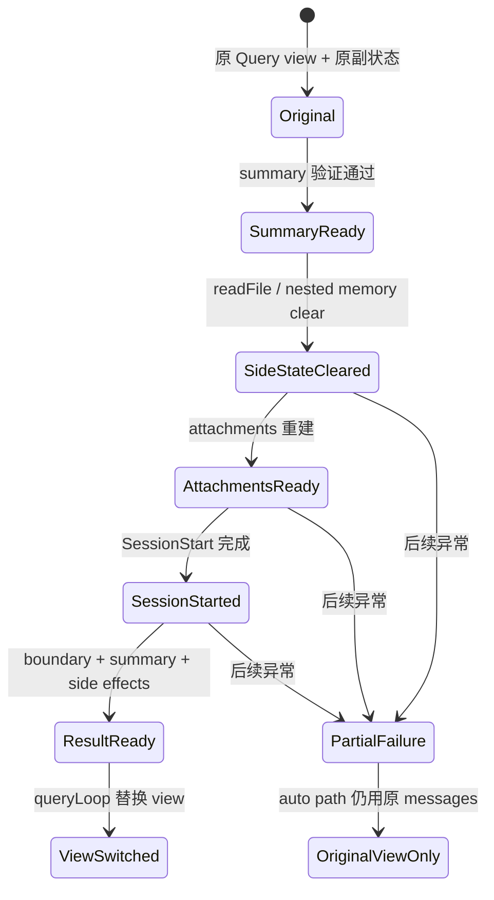

如果 attachment 或 SessionStart 基础设施在清理后失败：

- `compactConversation()` 没有返回 `CompactionResult`；
- Query Loop 可以继续用原 messages view；
- 但 read-file 与 nested-memory 辅助状态可能已经被清除；
- 外层 `finally` 只恢复 UI/SDK compact 状态，不负责把所有副状态倒回。

因此下面两句话只有第一句成立：

```text
compact 失败，当前 Query messages 没有切换。        正确
compact 失败，整个 Agent 状态与之前逐字相同。      错误
```

这正是 H3-2 不直接照抄顺序的原因。可迁移的思想不是“Claude Code 已有完整事务”，而是从这个窗口反推出更强的 clean-room contract：先准备不可变 plan，再在一个明确 owner 和 expected revision 下提交。

## `CompactionResult` 只是替换计划，不是 Transcript commit

`buildPostCompactMessages()` 的可见顺序是：

```text
boundary marker
-> summary messages
-> messagesToKeep
-> attachments
-> hook results
```

`queryLoop()` 拿到 result 后先逐条 yield post-compact messages，再把本 iteration 的 `messagesForQuery` 指向新数组，并继续当前请求。manual `/compact` 复用同一结果形状，但命令路径还会保存 slash-command 相关 caveat/display message，且不会自动继续触发一次模型查询。

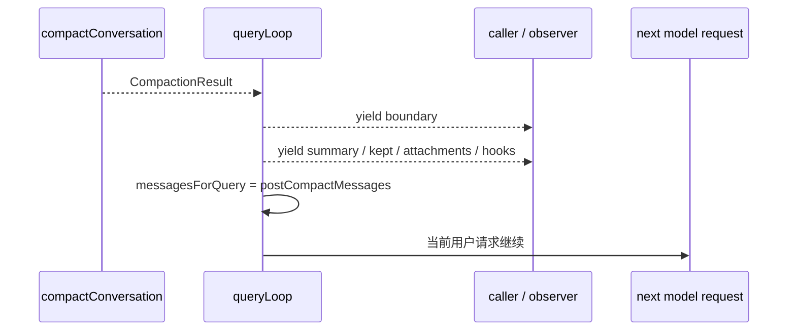

为什么先 yield 再替换本地 view？因为流式调用者需要看到状态转移的组成消息；但 yield 是一个可暂停边界，observer、UI 和持久化消费者的时序不能被想当然地压成一条同步赋值。

TypeScript 中的 `AsyncGenerator` 在这里再次改变控制流：每个 `yield` 都把执行权交给 consumer。M02 已经验证，consumer 提前结束会触发 producer cleanup，却不保证 producer 的正常完成代码继续执行。阅读 compact 路径时必须追踪“result 已创建”和“所有 yielded item 已被消费”的差异。

## Session Memory compact 为什么保留尾段

auto path 在 gate 开启时先调用 `trySessionMemoryCompaction()`。它不是再请求一个摘要模型，而是读取已经存在的 Session Memory，把旧 memory 作为 summary，再选一段最近消息继续保留。

不适用时返回 `null`，让 traditional compact 接管。典型原因包括 memory 为空或仍是模板、summarized message ID 不可定位、构造后的 token estimate 仍超过 threshold。

`calculateMessagesToKeepIndex()` 从已总结位置之后开始，向前扩展到最低 token/text 量，但不会跨越最近 compact boundary。`adjustIndexToPreserveAPIInvariants()` 再向前保护 tool-use/result pair 和共享 response ID 的 thinking fragments。

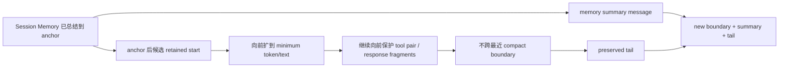

这里有一个重要的 owner 区分：Session Memory summary 保存的是长期提炼后的内容；retained tail 的原消息已经在 Transcript 中，compact 不应复制它们成为另一套新事实。于是 boundary 上需要 `preservedSegment`：

```text
headUuid
anchorUuid
tailUuid
```

它不是摘要正文，而是恢复时的 relink 指令：把仍沿旧 parent 链存在的 tail 重新接到新 summary 后。

## Transcript 是 append-only，但 append-only 不等于每次写入都原子

交互式路径中，`src/hooks/useLogMessages.ts` 观察 messages。当 compact 导致首 UUID 改变，它把完整 post-compact 数组交给 `recordTranscript()`，但调用是 fire-and-forget。SDK/Headless 的 `QueryEngine` 在非 bare 路径会等待 `recordTranscript()` 做清理、去重、入队和可能的 remote persistence；local `appendEntry()` 仍通常使用 `void enqueueWrite()`。

因此即使外层 `await recordTranscript()` 返回，也不能宣称最后一行已经写入本地文件。

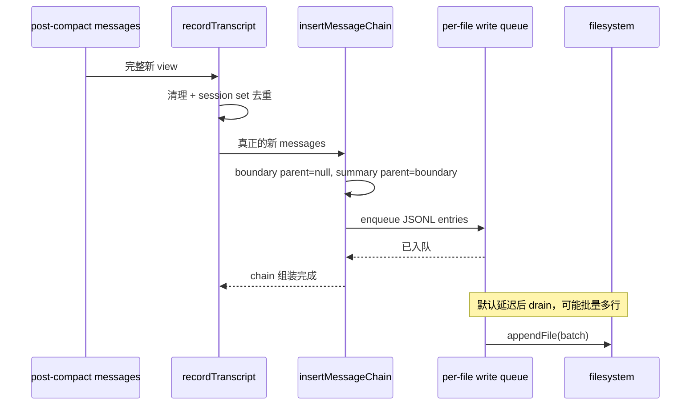

`recordTranscript()` 用 session message set 去重。compact 后 boundary 和 summary 是新消息，`messagesToKeep` 往往已存在于磁盘。遇到新 boundary 后，后面的 dedup-kept messages 不再作为 prefix parent；writer 只为真正的新消息建链。

对 compact boundary，`insertMessageChain()` 固定写：

```text
parentUuid: null
logicalParentUuid: old parent
```

这两个字段服务不同语义：

- `parentUuid:null` 截断 resume 可达主链；
- `logicalParentUuid` 保留逻辑/UI 关联；
- summary 的 `parentUuid` 指向 boundary；
- old JSONL rows 不会被物理删除。

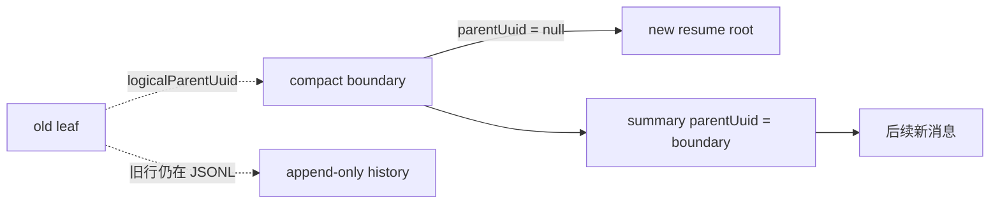

如果把 logical parent 当成 structural parent，恢复时又会沿回旧历史，compact 就失去截断作用。类似设计在事件溯源系统中很常见：一个字段描述业务因果，另一个字段描述当前 materialized chain，不能因为都叫 parent 就合并。

## 入队、append、flush、hard crash 是四种保证

每个 Transcript 文件有独立 queue。默认约 100ms 后 drain；一次 drain 可以把多行拼成 batch，再执行一次或多次 append。boundary 和 summary 在正常调度下经常进入同一批 append，但源码没有 compact WAL、prepare/commit marker、checksum framing 或 `fsync`。

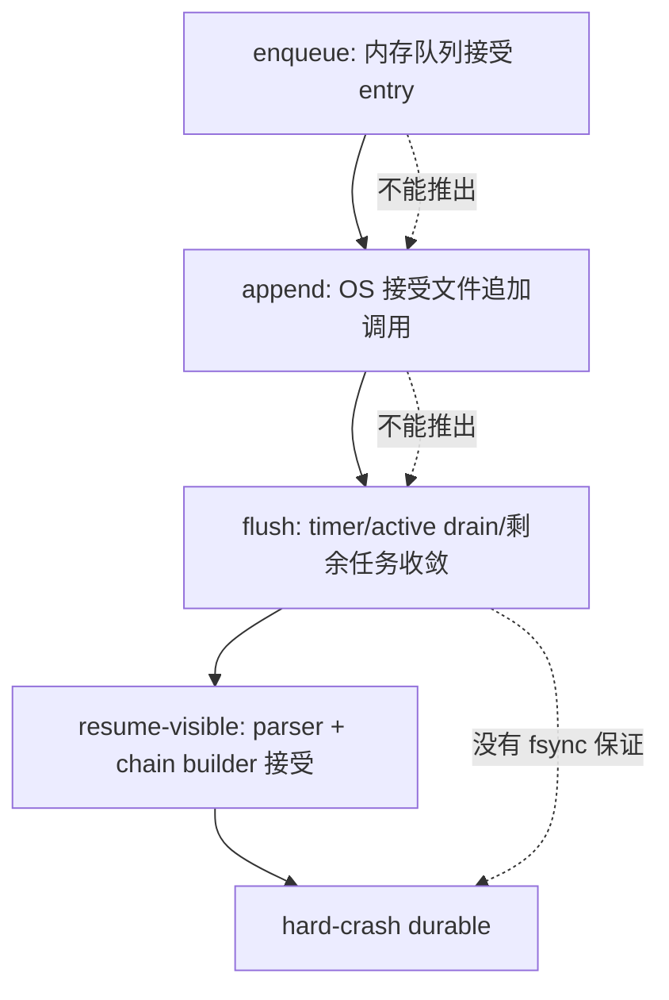

`Project.flush()` 会取消 timer、等待 active drain、处理剩余 queue，并等待其他 tracked write。graceful shutdown 把 flush 放在较高优先级，QueryEngine 也在多个边界显式 flush；但外层 cleanup 有约 2 秒预算，突然断电或 SIGKILL 不执行正常 cleanup。

`parseJSONL()` 遇到 malformed 或 crash-truncated 行会跳过。这个策略很实用：最后半行不会让整个 Transcript 无法读取；但“跳过”意味着该行不会成为有效 summary 或 chain node。

### 一个具体崩溃时间线

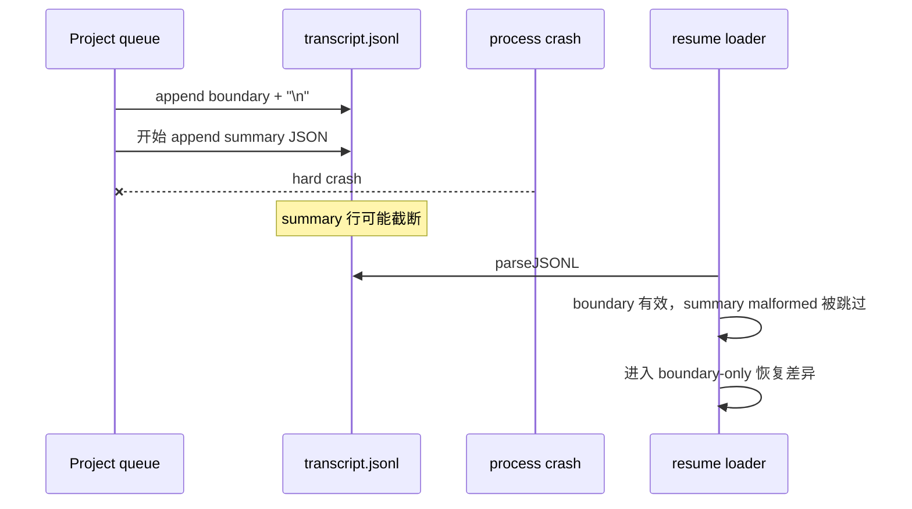

这就是为什么“用 JSONL 就天然崩溃安全”不正确。JSONL 提供局部可解析性；事务语义仍需要 framing、commit marker 或恢复状态机。

## Resume 怎样重新选择一条链

`loadTranscriptFile()` 解析 entries 后调用 `applyPreservedSegmentRelinks()`。对带 preserved metadata 的完整 Session Memory compact，它会：

1. 找到绝对最后 boundary 与最后带 preserved segment 的 boundary；
2. 从 `tailUuid` 沿旧 parent 链走回 `headUuid`；
3. 完整验证 segment 后，把 head 接到 `anchorUuid`；
4. 把 anchor 的其他 child 重新接到 tail；
5. preserved assistant usage 归零，避免 resume 后立刻再次 compact；
6. 删除最后 boundary 之前、且不在 preserved set 的旧消息。

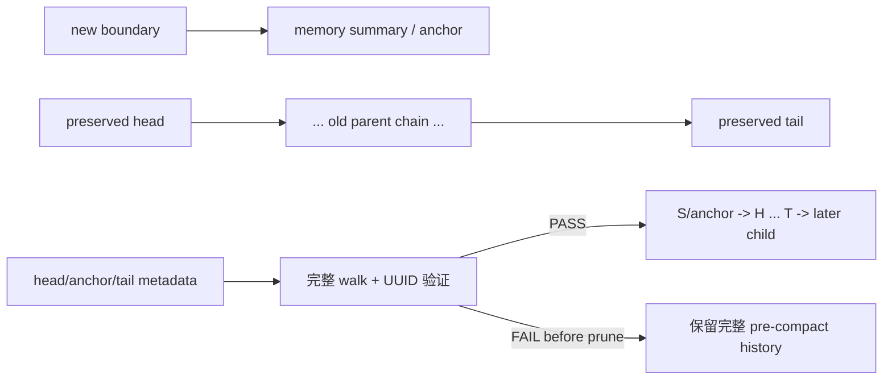

失败路径很值得借鉴。metadata malformed、UUID 缺失或 tail-to-head 链断裂时，函数在 prune 前返回。它宁可恢复更多旧历史，也不静默删除未验证的 segment。这是一种 fail-open-to-history，而不是 fail-open-to-execution：内容保留，但系统不假装 compact 成功。

traditional compact 没有 preserved segment，主要依赖 boundary 的 `parentUuid:null` 建立新链。大文件 portable reader 还会从最后一个 non-preserved boundary 附近开始截取 buffer，减少加载成本。

### boundary-only 为什么没有一个统一答案

若 hard crash 只留下 boundary，没有有效 summary：

- 小文件完整解析仍可能保留旧 user/assistant entries；孤立 system boundary 不是有效会话 leaf，picker 可能回退旧链；
- 大文件 pre-boundary skip 可能已丢弃 boundary 前 buffer，又没有 boundary 后有效 user/assistant leaf；
- 当前快照没有统一 `PREPARED/COMMITTED` marker 告诉 loader 应恢复哪一侧。

所以教材不能承诺“boundary-only 一定回退原历史”，也不能断言“一定损坏”。准确结论是：**不同 loader 路径可能不同，当前协议缺少统一恢复状态。**

下面的矩阵可以独立用于复习：

| 磁盘可见状态 | 快照可确认行为 | 不能承诺 |
| --- | --- | --- |
| 截断 JSONL 行 | parser 跳过 malformed 行 | 最后一条业务状态已持久化 |
| 完整 boundary + summary | 可形成新的 structural root/chain | 已 `fsync`、断电不丢 |
| malformed preserved metadata | prune 前返回，保留完整旧历史 | 自动修复 metadata |
| 完整 preserved segment | 验证、relink、usage reset、prune | 所有 feature-gated variant 相同 |
| boundary-only | 小/大文件路径可能不同 | 统一原历史 fallback |

## 用事务语言重新描述 Compact

现在可以把“谁能改写历史”说清楚了。

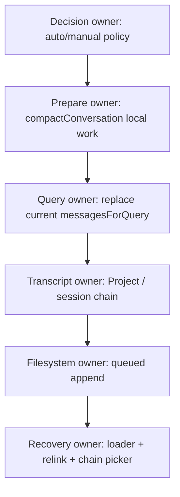

Claude Code 当前快照通过多个 owner 协作完成 compact，没有单一函数同时拥有所有状态。这不是“代码不够整洁”，而是交互式 Agent 必然跨越运行时、流、磁盘和恢复边界；真正需要审视的是 owner 之间有没有可验证协议。

传统 ACID 类比只能用到有限程度：

- prepare summary 类似生成候选新状态，但期间已有 hook 和模型调用；
- Query view replacement 是内存可见性提交，不是磁盘提交；
- append-only boundary/summary 像事件记录，但缺少统一 commit marker；
- recovery 从 structural chain 推断状态，而不是读取一行 transaction status；
- Provider、filesystem、hook 不可能被一个本地 `@Transactional` 自动覆盖。

## 双语言实验：先预测崩在哪里

独立实验位于：

```text
curriculum/units/M17/code/typescript/
curriculum/units/M17/code/python/
```

先写下预测：

1. summarizer 收到取消后，owner revision 会不会增长？
2. prepared journal 写完再取消，恢复应选 original 还是 replacement？
3. 两个 plan 都基于 revision 0，能否依次提交？
4. retainLast 恰好从 tool result 开始时，系统会不会保留 orphan result？
5. boundary-only、summary-only 或 provenance 被篡改时，report 能否不泄漏正文地要求修复？

运行 TypeScript：

```powershell
cd "D:\agent\Claude code最新\curriculum\units\M17\code\typescript"
node --test .\compact-transaction.test.ts
& "D:\agent\Claude code最新\mini-agent-harness\node_modules\.bin\tsc.cmd" -p .\tsconfig.json --noEmit
```

运行 Python：

```powershell
cd "D:\agent\Claude code最新\curriculum\units\M17\code\python"
python -m unittest -v test_compact_transaction.py
```

实际结果均为 `8/8`，TypeScript strict typecheck 通过。

### 实验状态机

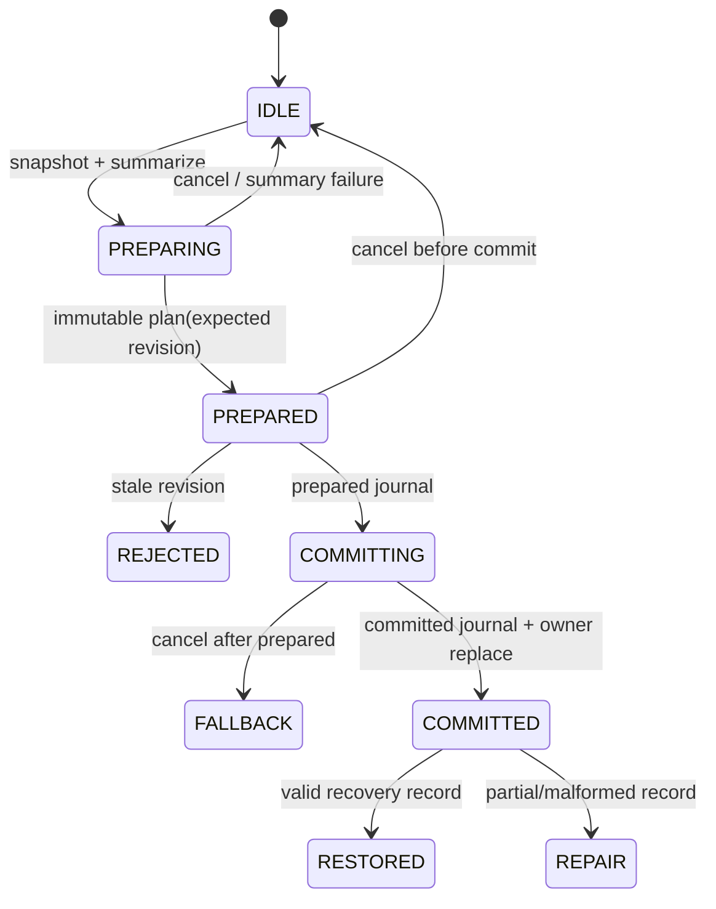

实验真正证明：

- summary 取消不会修改 owner 或 journal；
- prepared-only 明确回退 original；
- stale plan 在 journal mutation 前失败；
- complete commit 恰好推进一个 revision；
- retained boundary 会向前扩展，直到 tool-use/result pair 合法；
- partial/malformed recovery 给出 `repair_required` 和 reason；
- report 不含 message content。

它没有证明 Claude Code Transcript 已采用这个 transaction，也没有证明 in-memory journal crash durable。`运行验证` 支持课程的 clean-room 设计迁移，不能反向改写`快照事实`。

### 现在动手破坏三个不变量

第一，把 retained start 的向前扩展循环删掉，让 `retainLast=2` 从 tool result 开始。预期 replacement 构造或 strict validation 报 orphan。修复不是“多保留一条”，因为并行 tool calls 可能需要保留一个 assistant 加多个 results；正确做法是一直扩到完整协议边界。

第二，把 expected revision check 移到 committed journal 之后。先 prepare，再让另一个 writer append。预期 journal 声称 committed，Store 却拒绝 replace，恢复会把未实际拥有的新状态当成真。修复是 validate/revision-before-journal，并确保 final journal+replace 之间没有可抢占的 await；跨进程时需要更强 storage transaction。

第三，让 recovery report 带上 `summaryText` 方便排错。测试应拒绝该字段。summary 可能包含源码、PII、凭据或业务数据；诊断只需 transaction ID、source revision、count 和 reason。需要查看正文时走受控 Transcript 权限，不走普通 telemetry。

## H3-2 怎样进入 Mini Agent Harness

S2 的 Harness 已有单一 `ConversationStore` owner、revisioned append/replace、run lease 和 strict request pairing。H3-2 没有另建第二套 history，而是在同一 owner 上加入 CompactCoordinator。

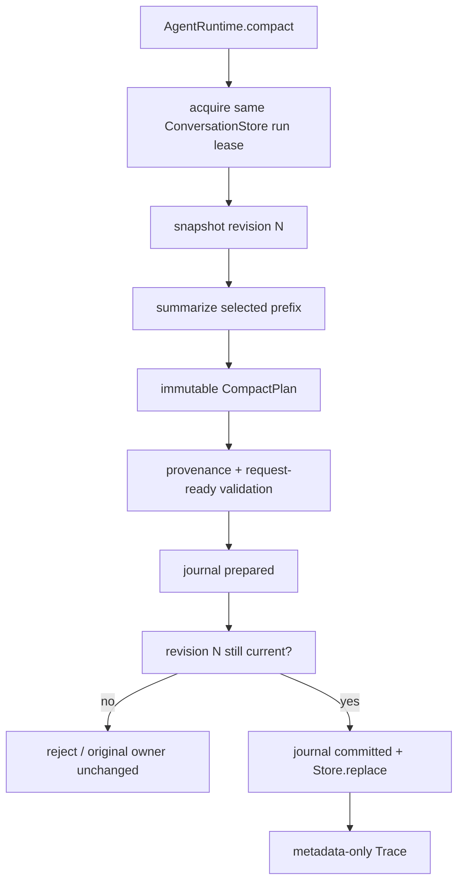

契约关键点：

- `submit()` 与 `compact()` 不能并行修改同一 conversation；二者共享 run lease；
- prepare 只读取 immutable snapshot，summary 完成前不改 owner；
- leading system messages 保留；boundary 和 summary 使用新 system envelopes；
- retained tail 向前扩展到 request-ready；
- replacement 中 parent chain 重新连接，不让已删除节点继续成为 structural parent；
- journal 记录 original、replacement 和 provenance；
- recovery 三态为 `restored | fell_back | repair_required`；
- Trace 只记录 revision、count、transaction ID、cancel/error type。

TypeScript Compact 集成 `5/5`，Python 镜像 `5/5`；Python Agent+Compact+Scheduler+Stream `29/29`，严格 TypeScript 与 H2/H1/S0 累计回归全部通过。

### 为什么 journal 现在仍是 in-memory

这是有意的范围控制。要把它升级为真正文件 journal，不能只把 `records.push()` 换成 `appendFile()`，还要回答：

- 一条 record 如何 framing，截断时怎样识别？
- prepared 和 committed 是否必须落在同一 fsync group？
- Store/Transcript 与 journal 谁先写？
- process crash 后如何幂等 materialize？
- 多进程谁持有 conversation writer lease？
- journal 中保存正文、引用还是 object key？
- summary/provenance 的保留与删除策略是什么？

这些属于后续 Transcript/Resume milestone。H3-2 当前价值是让状态机、owner 和失败语义先成为可测试契约，而不是用一个脆弱文件写入冒充 durability。

## 企业 Agent 与 Java/Spring 迁移

生产系统最值得迁移的不是某个 compact prompt，而是六条架构约束。

### 1. Summary 是派生物，Transcript 是事实

摘要应记录 source revision、source item IDs、策略/模型版本、创建时间和保留尾段。它可以失效、重算或被人工修复，不能覆盖原审计事实。数据保留策略到期后是否删除原文，是合规决策，不应由 Context 超限临时决定。

### 2. Prepare 与 commit 分离

模型摘要是慢且可取消的外部调用，不能持有数据库长事务。先从 revision N 读取 snapshot，在事务外生成 plan；提交时用短事务验证 revision N 仍有效，再写 compact record/outbox。

```java
record CompactPlan(
    ConversationId conversationId,
    long expectedRevision,
    List<MessageId> summarizedIds,
    List<MessageId> retainedIds,
    SummaryRef summary,
    String policyVersion
) {}

interface CompactRepository {
    CompactSnapshot load(ConversationId id);
    CommitResult commit(CompactPlan plan); // UPDATE ... WHERE revision = ?
}
```

Spring 的 `@Transactional` 只覆盖同一资源事务。它不会把 LLM 请求、对象存储、Kafka 和文件系统变成一个原子动作。常见方案是：DB transaction 写 committed metadata + outbox，异步 materializer 幂等生成 request view；或者先写 content-addressed summary object，再 CAS 提交引用，孤儿对象由 GC 清理。

### 3. Recovery state 必须显式

不要只靠“有没有 boundary”猜状态。至少区分：

```text
PREPARING  尚无 durable plan
PREPARED   plan/provenance durable，owner 未切换
COMMITTED  revision 已切换，可 materialize
REPAIR     record 不完整或引用缺失
```

恢复器必须能选择 original、replacement 或人工修复队列，并记录为什么。`UNKNOWN` 不应被静默当作 committed。

### 4. 协议边界优先于 token 最优

retained tail 不是“最后 N token”。Tool calls/results、assistant fragments、引用证据和事务步骤都可能组成不可拆分 group。企业 RAG 还要保护 citation/source pair：若保留回答却丢掉它引用的证据，语法合法但审计语义已经破坏。

### 5. 内容和 telemetry 分权

普通 trace 只放 ID、revision、耗时、token、count、状态和 reason。summary、prompt、tool output 进入受控 content store，有独立权限、加密和保留期。debug 模式也不应默认绕过这一边界。

### 6. 把 graceful 与 crash guarantee 分开写进 SLO

“shutdown 时 flush”是正常退出可用性；“节点断电后 committed compact 不丢”是 durability。前者靠 cleanup coordinator，后者需要 storage protocol。SLO 和故障演练必须分别验证。

LangGraph 中可以把 compact 设计为一个显式 node：读取 checkpoint revision，生成 `CompactPlan`，由 reducer/CAS node 提交；失败边走 original state，repair 边进入人工或后台修复。不要让 model node 原地删除 checkpoint message list。

## 资深 Agent 开发面试会怎样追问

先只说每题第一句，再把回答自然展开到 Claude Code、失败边界和企业方案。以下回答按现场约两分钟组织，不要求逐字背诵。

### 1. “Agent 上下文超限时，为什么不能直接保留最后 N 条消息？”

**结论先说：因为消息是有协议依赖的状态链，最后 N 条可能从 tool result 或 assistant fragment 中间切开，得到 token 合法但语义非法的请求。**

Claude Code 的 Session Memory compact 会把 retained start 向前调整，保护 tool-use/tool-result pair 和共享 response ID fragments，也不会跨最近 compact boundary。traditional compact 则通过 boundary + summary + messagesToKeep 构造新视图。我的 Harness 同样从目标 suffix 开始，反复用 request-ready validator 检查，不合法就继续向前扩展。企业里还要把 RAG 引用与证据、workflow command 与 result 视为 group。token 优化必须服从协议完整性；否则最糟糕的不是 Provider 报错，而是模型在缺少因果输入时给出看似合理的错误结论。

### 2. “生成摘要后立刻把旧历史删掉，有什么问题？”

**结论先说：summary 是可失败、可过期的派生视图，不应该在提交协议完成前覆盖 durable Transcript。**

Claude Code 快照先生成 summary，但后面还会清理副状态、重建 attachments、跑 SessionStart、创建 boundary、写 metadata，再由 Query Loop 切 view，Transcript 还要异步入队和 append。任一步失败都说明“summary 有了”不等于“恢复链已提交”。因此生产方案应保留 append-only 原事实，plan 带 source revision 和 summarized IDs，提交时 CAS；summary object 与 compact record完整后再把新 revision 设为 active。原文何时删除由合规和 retention 决定，不由临时 token 压力决定。

### 3. “Claude Code 的 compact 是原子事务吗？”

**结论先说：当前快照不是覆盖内存、副状态、Transcript 和磁盘的单一原子事务，它依赖分阶段顺序与恢复技巧。**

`compactConversation()` summary 成功后就可能清掉 read-file 和 nested-memory state，后续失败没有 whole-state rollback；`CompactionResult` 返回后 Query Loop 才切当前 view；Transcript writer 再写 boundary/summary，而且 local append 有 per-file queue。flush 改善正常退出，但没有 compact WAL、fsync 或 hard-crash guarantee。preserved segment 恢复会先完整验证再 prune，malformed 时保留旧历史，这是很好的 fail-open 策略。我的迁移设计会加 immutable plan、expected revision、prepared/committed record 和显式 recovery state，但会明确这是 clean-room 增强，不反过来声称源码已有。

### 4. “如果 compact 同时发生用户新输入，怎么处理？”

**结论先说：必须有单一 conversation writer 或 optimistic revision gate，不能让 summary 基于旧快照覆盖后来输入。**

最简单的错误是：compact 从 revision 10 生成 plan，用户输入把 Store 推到 11，compact 最后 last-write-wins replace，用户消息消失。我的 Harness 让 `submit()` 和 `compact()` 共用 run lease，提交还验证 expected revision；stale plan 在写 journal 前失败。分布式系统不能只靠进程 mutex，可以用数据库 `UPDATE ... WHERE revision=10`、actor 单 writer 或 log partition；摘要慢调用放在锁外，短 commit 做 CAS。冲突后通常重新 snapshot，而不是把旧 summary 硬拼到新历史。

### 5. “PreCompact Hook 失败应该回滚吗？”

**结论先说：要看 Hook 协议如何定义，不能看到 Pre 就默认它拥有事务否决权。**

Claude Code 当前 `executeHooksOutsideREPL()` 会把逐 hook timeout、abort、进程和解析失败转成 `succeeded:false`；PreCompact 只有成功非空输出作为 summary instruction，普通失败主要用于显示，PostCompact 普通失败也不会把 summary 回滚。外层 matching/config 基础设施仍可能抛错。所以我会把 hook result 类型写成 `advice | warning | veto`，由调用者显式消费；真正 veto 必须在不可逆提交前，且记录决定来源。若所有 hook 异常都回滚，观测插件故障就能阻断核心恢复；若所有异常都忽略，安全 policy 又会失效，协议必须区分。

### 6. “JSONL append-only 为什么还会有恢复问题？”

**结论先说：append-only 防止覆盖旧记录，但不自动提供多记录原子性、framing 完整性或 fsync durability。**

Claude Code Transcript 的 boundary 和 summary 通常先进入 per-file queue，再批量 append；进程可能在两行之间或一行中间崩溃。parser 会跳过 malformed last line，这让旧内容仍可读，却可能只留下 boundary。小文件完整 parse 与大文件 pre-boundary skip 对这种状态可能不同，因为没有统一 commit marker。生产上我会给 transaction record 做 length/checksum framing，写 prepared/committed state，按需要 fsync，并让 recovery 只 materialize committed revision。JSONL 仍可作为 transport，但需要额外协议。

### 7. “Session Memory compact 和普通 summary compact 有什么本质区别？”

**结论先说：Session Memory path 复用已有长期记忆并保留一个可重连尾段，traditional path 则为当前历史发起受限 summary 请求。**

auto path 在 gate 开启时先尝试 Session Memory；memory 空、anchor 找不到或结果仍过阈值就返回 null，再走 traditional。Session Memory 会选择 summarized point 后的 tail，向前保护协议 group，并在 boundary 写 head/anchor/tail metadata；resume 时验证完整链再 relink，验证失败就在 prune 前返回。traditional summary 则走 fork/fallback、PTL retry 和 attachment rebuild。企业里我会把“长期 memory store”和“临时 compact summary”建成不同 artifact 类型、不同 provenance 和 retention，避免所有摘要都塞进一个字符串字段。

### 8. “让你为企业 Agent 设计 Compact，你会先定哪些接口？”

**结论先说：我会先定义 snapshot、plan、commit、recovery 四个契约，再选择摘要模型和存储实现。**

Snapshot 要有 conversation revision 和合法 message groups；Plan 包含 source IDs、retained IDs、summary reference、policy/model version；Commit 用 expected revision CAS，同时写 active compact record 与 outbox；Recovery 根据 `PREPARED/COMMITTED/REPAIR` 明确选 original 或 replacement。模型请求在事务外可取消，Trace 不带正文，storage materialization 幂等。Java/Spring 中 repository transaction 只提交 DB metadata，summary object 用 content-addressed key，Kafka 通过 outbox；LangGraph 只编排步骤，不让 reducer 既当 Transcript owner 又当模型投影器。这样才能分别测试取消、stale writer、partial record 和恢复。

## 离开本章前做一次完整重建

拿一张空纸，不看前文画三条线。

第一条从 `queryLoop()` 画到 `CompactionResult`，必须出现：`shouldAutoCompact()`、failure circuit、Session Memory first attempt、PreCompact、受限 summary fork/fallback、PTL retry、副状态 clear、attachments、SessionStart、boundary/summary、PostCompact。

第二条从 result 画到 Transcript，必须标出：yield、Query view replacement、`recordTranscript()`、dedup、boundary `parentUuid:null`、per-file queue、append、flush。每个箭头写清“已完成”究竟保证了什么。

第三条从 JSONL 画到 resume，必须出现：parse skip malformed、preserved segment full validation、relink、prune-before-return 顺序，以及 boundary-only 的小/大文件差异。

然后完成两个修改：

1. 给独立 CompactTransaction 新增“committed record 指向不存在的 retained ID”故障，要求 `repair_required / malformed_provenance`，并证明 report 没有正文；
2. 把 Harness journal 替换成一个模拟 crash 的 framed writer：允许在任意 byte 截断，恢复器只能接受 checksum 完整的 committed record。先不要接真实 Transcript，重点证明状态机。

最后用自己的话回答：为什么 `CompactionResult`、Query view replacement、Transcript enqueue、filesystem append 和 resume-visible chain 是五个不同完成点？如果答案里只有“异步”，还不够；你必须指出每一步的 owner、状态和失败后可观察结果。

## 源码复习索引与证据边界

按下面顺序回源码，最容易重建本章：

```text
src/query.ts
  -> queryLoop(): auto result、yield、view replacement、continuation

src/services/compact/autoCompact.ts
  -> shouldAutoCompact(): recursion/config/threshold
  -> autoCompactIfNeeded(): failure circuit、SM-first、traditional fallback

src/services/compact/compact.ts
  -> compactConversation()
  -> streamCompactSummary()
  -> truncateHeadForPTLRetry()
  -> buildPostCompactMessages()
  -> annotateBoundaryWithPreservedSegment()

src/services/compact/sessionMemoryCompact.ts
  -> trySessionMemoryCompaction()
  -> calculateMessagesToKeepIndex()
  -> adjustIndexToPreserveAPIInvariants()

src/utils/hooks.ts
  -> executeHooksOutsideREPL()
  -> PreCompact / PostCompact wrappers

src/commands/compact/compact.ts
src/utils/processUserInput/processSlashCommand.tsx
  -> manual /compact

src/hooks/useLogMessages.ts
  -> interactive Transcript observation

src/utils/sessionStorage.ts
  -> recordTranscript()
  -> insertMessageChain()
  -> per-file enqueue/drain/flush
  -> loadTranscriptFile()
  -> applyPreservedSegmentRelinks()

src/utils/sessionStoragePortable.ts
  -> large-file boundary scan
  -> truncated JSONL handling

src/utils/gracefulShutdown.ts
src/utils/cleanupRegistry.ts
src/QueryEngine.ts
  -> normal flush boundaries and cleanup budget
```

证据状态必须保持清楚：

- 上述 visible auto/traditional/session-memory 顺序、hook 结果化、boundary chain、queue/flush 和 relink 是`快照事实`；
- summary 后副状态可能变化、enqueue 不等于 append、normal flush 不覆盖 hard crash 是`快照弱保证`；
- reactive compact、context collapse、部分 KAIROS 内部实现以及 boundary-only 统一恢复协议是`快照缺口`；
- 双语言 `8/8` 和 Harness Compact `5/5 + 5/5` 是`运行验证`；
- revision-gated plan/commit、explicit recovery state、provenance journal 和 metadata-only report 是`设计迁移`。

到这里，Compact 不应再被理解成“把旧聊天总结成一段话”。更准确的模型是：**策略决定何时需要改写视图，受限 summary 产生候选内容，Query owner 切换当前运行，Transcript owner追加新的 structural boundary，recovery owner再判断这条链是否足够完整。只有把这些完成点分开，才能讨论取消、并发、崩溃和企业级恢复。**
