# M18 文件存在不等于模型看见：CLAUDE.md、Rules、系统提示与动态附件

> 本章主体预计 4 至 7 小时，双语言实验与破坏修改另计。你应已完成 M13、M16、M17，知道 durable history、request view、system prompt、user message 和 Transcript 不是同一个 owner。

## 先从一个真实误判开始

你在 `packages/payment/.claude/rules/java.md` 写了：

```markdown
---
paths: src/main/java/**
---

所有金额必须使用 BigDecimal，不允许 double。
```

文件确实在磁盘上，Claude Code 也启动在仓库根目录。但你只让 Agent 修改 `packages/web/src/App.tsx`。模型这轮看见了 Java rule 吗？如果后来 Read 了 `packages/payment/src/main/java/Order.java`，它何时看见？它进入 system prompt、user message 还是动态 attachment？compact 后会不会再次注入？

正确答案不是“Claude Code 会自动读 CLAUDE.md”。**发现文件、判定 scope、生成上下文、进入某轮 request 是四个不同事件。**


任何一条边缺失，文件都可能“存在但不可见”。反过来，模型看见一段 instruction 也不说明它来自 system prompt；CLAUDE.md 在当前主线程路径主要经 `userContext` 变成前置 meta user message，nested rule 则经 attachment 进入 Query view。

本章最终心智模型是：

> Instruction Pipeline 是带 source、scope、trust、revision 和注入时点的请求投影。文本内容只是一部分；来源与生命周期决定它能否被信任、何时生效、怎样去重和如何恢复。

先看完整地图：

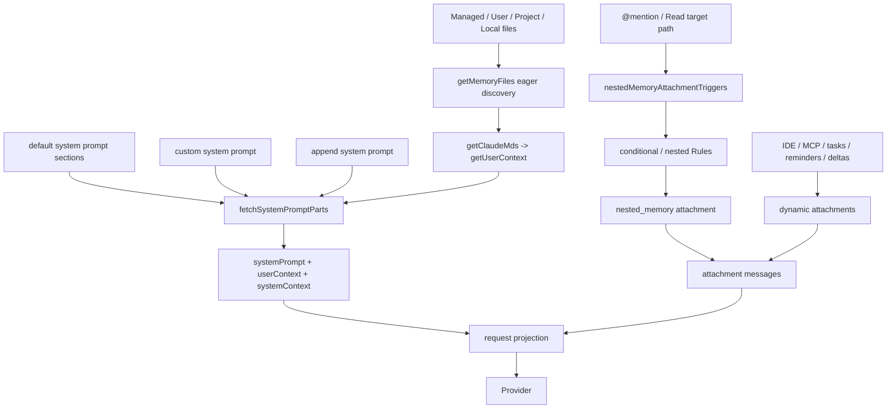

Graphify 只用于候选定位，以下顺序与边界已由源码和同一 DeepSeek Max 事实会话双重核验。

## 源码为什么把 Instruction 叫 Memory

`src/utils/claudemd.ts` 的类型名是 `MemoryFileInfo`，注释也称 Managed/User/Project/Local memory。这是历史命名，不代表它们与 M19 的 Session/Auto Memory 共享同一生命周期。

至少要分开：

| 内容 | 主要 owner | 语义 |
| --- | --- | --- |
| Managed/User/Project/Local CLAUDE.md | 文件系统 + instruction discovery | 用户或组织写下的约束/偏好 |
| `.claude/rules/*.md` | 文件系统 + path scope | 无条件或条件指令 |
| AutoMem/TeamMem | memory subsystem | 跨会话提炼内容 |
| compact summary | compact/Transcript | 历史视图替代物 |
| dynamic attachment | 当前 Query iteration | 临时运行上下文 |

源码中的 `isInstructionsMemoryType()` 只接受 Managed、User、Project、Local，明确排除 AutoMem/TeamMem；InstructionsLoaded hook 也按这个边界工作。教材继续使用“instruction file”作为教学别名，回源码时保留真实类型名。

## Eager discovery 从哪里开始，顺序代表什么

`getMemoryFiles()` 是 memoized async discovery。当前快照顺序为：

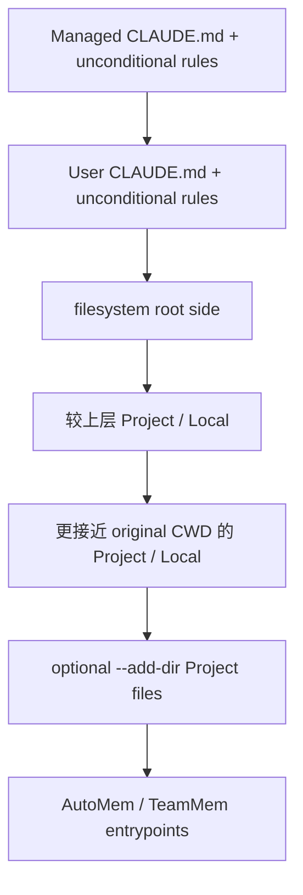

细节不能省略：

- Managed 不受普通 setting-source 开关，表示组织 policy source；
- User 受 `userSettings` source 开关；
- Project 的 `CLAUDE.md`、`.claude/CLAUDE.md`、无条件 `.claude/rules/*.md` 受 `projectSettings`；
- Local 的 `CLAUDE.local.md` 受 `localSettings`；
- Project/Local 从 root 向 CWD 处理，较局部内容出现在后面；
- `--add-dir` 还需 `CLAUDE_CODE_ADDITIONAL_DIRECTORIES_CLAUDE_MD`，且不加载该目录的 `CLAUDE.local.md`；
- nested worktree 会跳过主工作树中可能重复的 checked-in Project 文件，同时仍允许只存在于主仓库的 Local 文件。

源码注释说后出现内容得到模型更多注意。要把它理解成**文本排列策略**，不是机器 policy engine。若 Managed 写“禁止上传密钥”，Local 写“允许上传密钥”，LLM 的自然语言冲突消解不等于安全 enforcement。真正安全边界仍应在 Permission、Sandbox、network policy 和 tool handler 中实现。

### 顺序并非跨平台完全确定

`.claude/rules` 使用 `fs.readdir()` 并按返回顺序递归，没有显式 sort。一次 memoized 会话中结果稳定，但 OS、文件系统或不同运行可能产生不同 sibling order。

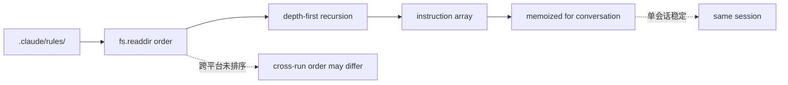

若两个 sibling rule 相互冲突，不能依赖文件系统恰好返回哪个在后。企业 pipeline 应显式 `priority + canonical path + source ID` 排序，或在 CI 检测冲突。

## `@include` 是内容扩展，也是 trust 穿透点

`processMemoryFile()` 会解析 symlink real path，用 normalized path Set 防循环，并限制 include depth。它先把主文件放入 result，再递归追加 include；这比文件头某些“includes first”自然语言描述更可信，因为事实闸门核对了实际代码。

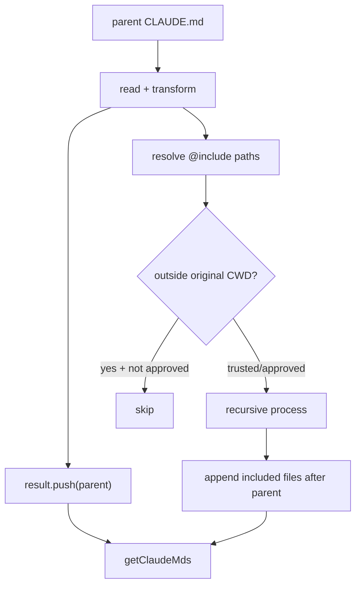

Project、Local、Managed 的 external include 默认不进入 context，需要 project config 已批准；User instruction 的 include 允许 external，因为它本身就是用户全局私有 source。`getMemoryFiles(true)` 还会用于发现外部 include 并展示 warning，但这个 force read 是审批检查，不等于真实 context 已授权。

这是典型的 TOCTOU 风险边界：warning UI 发现“可能读取某文件”，真实 build 必须再次基于批准状态决定是否注入。不能把“用户看过 warning”当成永久授权，除非配置明确记录 approval。

### 读取后内容可能不等于磁盘字节

instruction loader 会：

- 解析 frontmatter 并从正文剥离；
- 剥离 block-level HTML comments，但保留 fenced code/inline code 内语义；
- 对特定 memory entrypoint 截断；
- 忽略不允许的二进制扩展。

于是模型看见的是 transformed view，而 Edit/Write 面对的是原文件。若把 transformed content 直接塞进 `readFileState` 并声称完整读取，后续 Edit 可能基于不存在的字节偏移覆盖文件。

源码通过 `contentDiffersFromDisk + rawContent + isPartialView` 解决：缓存真实字节用于变化检测，同时标记这是 partial view，Edit/Write 必须先显式 Read。

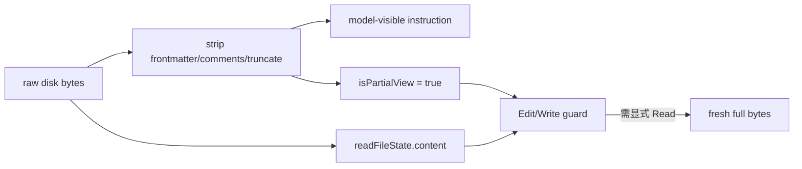

这是一条很优秀的迁移思想：**同一文件可以有多个投影视图，但修改权限必须绑定原始 owner 的完整快照。**

## 无条件 Rule 与条件 Rule 为什么分两条路

`.claude/rules/*.md` 的 frontmatter `paths` 被解析为 patterns。没有有效 paths、或全部是 match-all `**` 时，rule 视为 unconditional，随 eager discovery 注入；有具体 path 时，留到目标文件出现后匹配。

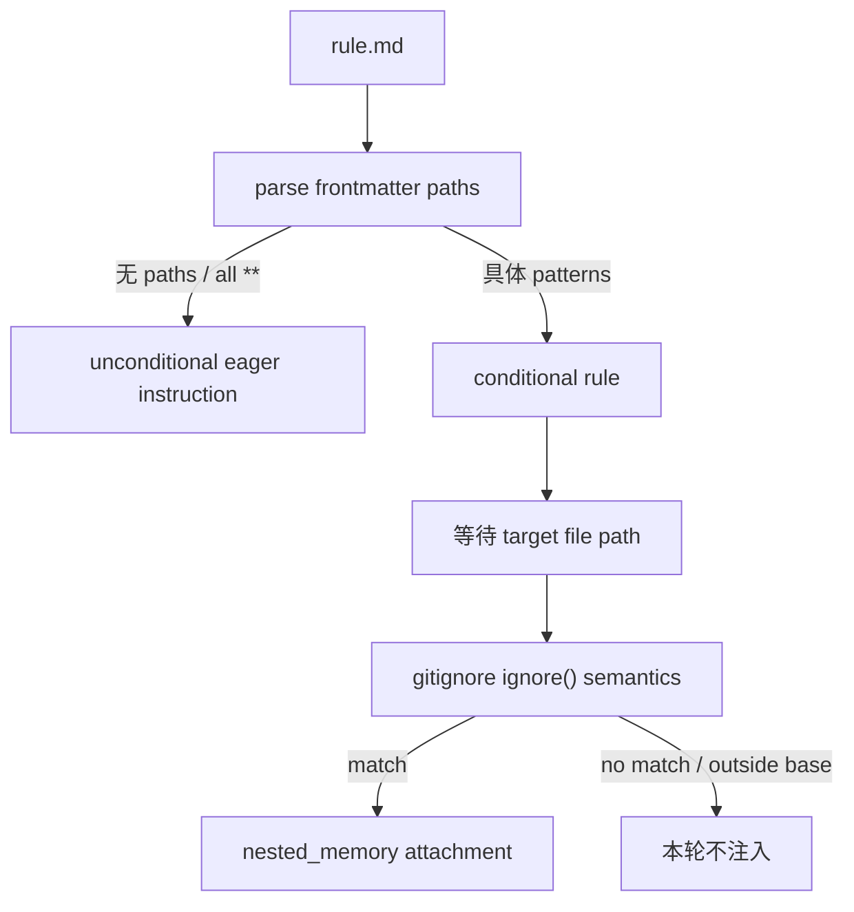

这里使用 `ignore` 库的 gitignore 语义，不是看起来已 import 的 picomatch。Project rules 的 relative base 是 `.claude` 的父目录；Managed/User rules 的 base 是 original CWD。若 target relative path 为空、越过 `..` 或在 Windows 跨盘变成绝对路径，直接不匹配。

为什么 conditional rule 不在启动时全部塞入 prompt？一是 token；二是 scope 泄漏。支付模块的数据库规则不应影响前端 CSS 任务。路径条件让“当前读到什么文件”成为 instruction discovery 的运行信号。

但 glob 只是一种匹配，不是授权。rule 匹配后能告诉模型“如何修改这个路径”，不能授予模型读取该路径。后者先通过 allowed working path/Permission。

## CLAUDE.md 不在 default system prompt 里

这是本章最容易答错的源码事实。

`src/context.ts -> getUserContext()` 调用 `getMemoryFiles()` 与 `getClaudeMds()`，返回：

```text
{
  claudeMd: "Codebase and user instructions ...",
  currentDate: "Today's date is ..."
}
```

API 层用 `prependUserContext()` 把它变成位于 conversation messages 前面的 meta user/system-reminder。default system prompt 则来自 `getSystemPrompt()` 的 sections。

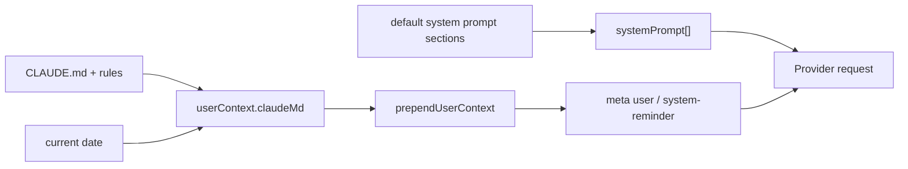

为什么这仍被模型当作强指令？因为 wrapper 明确告诉模型这是 system-provided reminder，并且文本自身声明 codebase/user instructions 必须遵守。**传输 role 与产品语义不是一回事。** 同样是 API `user` role，真实用户输入、tool result、meta attachment 可以是不同 domain kind。

这也再次验证 M10 的原则：不要用 Provider role 直接替代内部状态分类。

## custom、default、append 和 systemContext 的替换关系

`fetchSystemPromptParts()` 并行取得三个 prefix pieces：default system prompt、userContext、systemContext。

当 custom system prompt 存在：

- default builder 跳过；
- systemContext（如 git status）为空；
- userContext 仍然构建，因此 CLAUDE.md 不消失；
-特定 SDK memory override 还可追加 memory-mechanics prompt；
- append system prompt 最后追加。

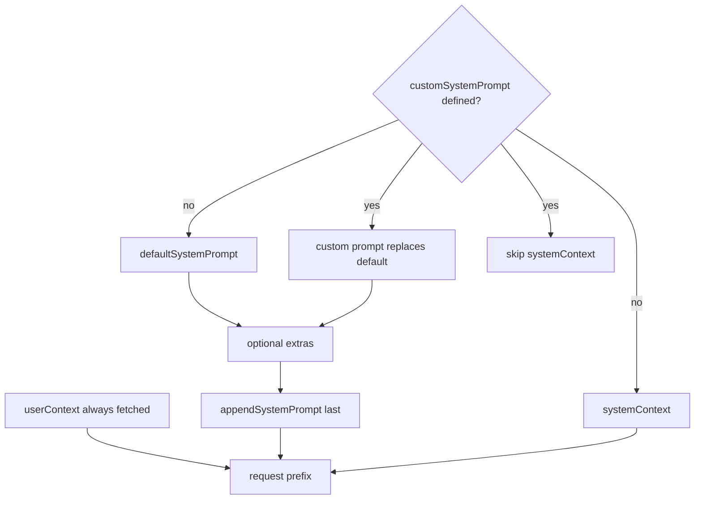

所以“`--system-prompt` 会把 Claude Code 所有项目指令覆盖掉”是错的；它覆盖 default system prompt，不覆盖 independently assembled userContext。若企业 SDK 真需要 hermetic prompt，必须显式关闭 CLAUDE.md discovery、attachments、hooks、skills 等来源，而不是只传 custom prompt。

## System prompt 为什么不是每轮随便重算

`systemPromptSection(name, compute)` 的普通 section 第一次 compute 后缓存；`DANGEROUS_uncachedSystemPromptSection()` 每轮重算，并要求调用点说明为什么值得破坏 Prompt Cache。`/clear` 与 `/compact` 调用 clear，连 beta header latches 一起重置。

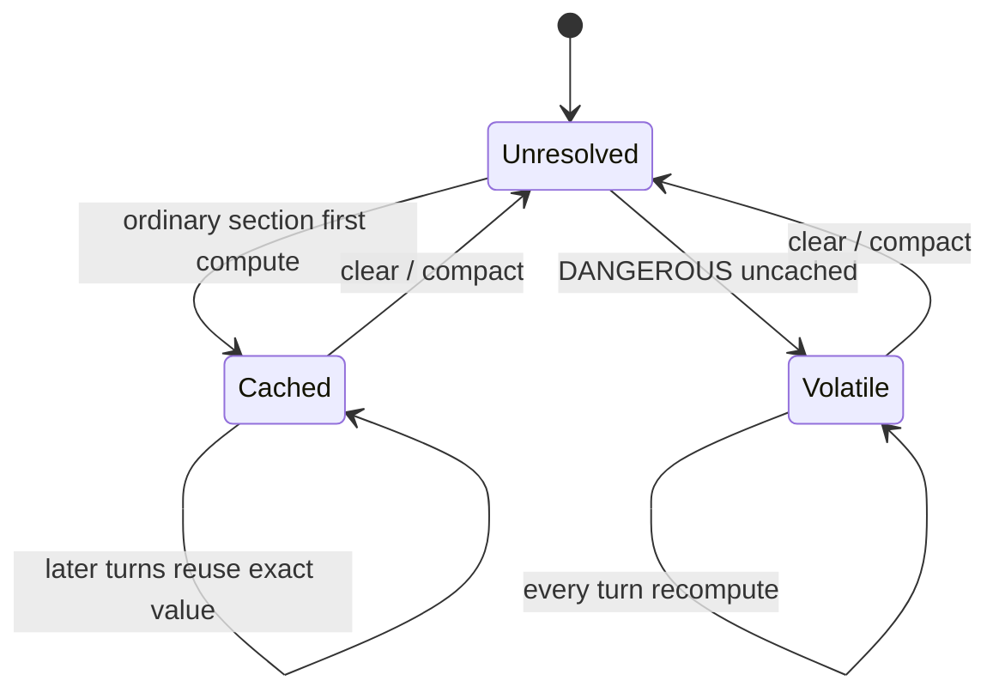

稳定 section 不只是性能缓存。system prompt 是 Provider cache-key prefix，非必要变化会让昂贵前缀失去复用。另一方面，缓存意味着环境变化不会自动立即生效；必须有明确 invalidation owner。

同样，`getMemoryFiles()` 与 `getUserContext()` 被 memoize。普通 correctness invalidation 使用 `clearMemoryFileCaches()`；compact 这类真实 reload 使用 `resetGetMemoryFilesCache('compact')`，让下一次 InstructionsLoaded hook 带正确 reason，而不是伪装 session_start。

这说明 cache clear 也有业务语义：清掉值与宣布“为什么重新加载”是两个动作。

## Nested instruction 怎样被一次 Read 唤醒

启动 CWD 在仓库根时，子目录 `packages/payment/CLAUDE.md` 不一定 eager 进入。用户 @mention 或 Read 某个深层文件，会把 target path 放入 `nestedMemoryAttachmentTriggers`。`getAttachments()` 必须先完成 user input attachments，确保触发集合已填，再运行 nested loader。

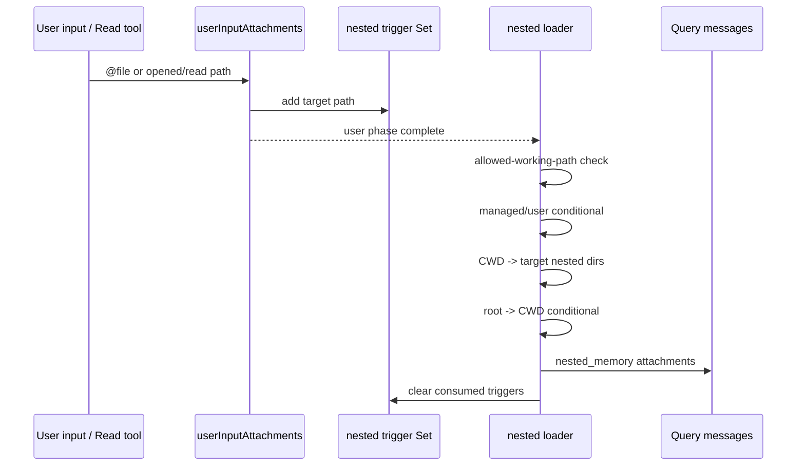

三阶段顺序必须能复述：

1. Managed/User conditional rules 匹配 target；
2. CWD 到 target 的每层目录加载 CLAUDE.md、unconditional 与 conditional rules；
3. root 到 CWD 只补 conditional rules，因为 unconditional 已 eager 加载。

`pathInAllowedWorkingPath()` 在最前面。Instruction discovery 不能绕过 workspace permission。

## 为什么需要两个去重状态

`readFileState` 是容量有限的 LRU，用于文件读状态、变化检测与 edit safety。若只用它判断 nested CLAUDE.md 是否已注入，繁忙会话中条目被驱逐后，同一 instruction 会反复作为新 attachment 注入。

因此 `loadedNestedMemoryPaths` 是不驱逐 Set，专门记录本 compact epoch 已注入的路径。

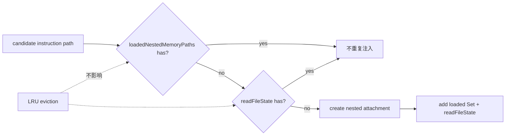

compact 会清理这些状态，随后 attachments 重建并让所需 instructions 重新进入新视图。不要把 non-evicting 理解为进程永久：它的生命周期属于当前 ToolUseContext/compact epoch。

## Dynamic attachment 是调度管线，不是一袋字符串

`getAttachments()` 处理 @mention、MCP resource、agent mention、queued command、date change、deferred tools、MCP instruction delta、changed files、nested memory、dynamic skill、plan/auto mode、task、mailbox、diagnostics、budget 等多种来源。

执行顺序不是全部串行：

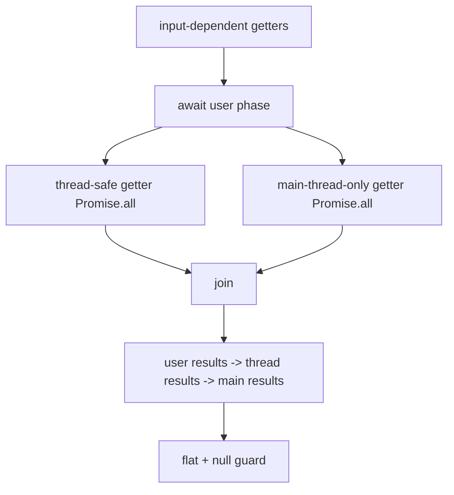

`Promise.all` 的结果顺序由输入数组决定，不由异步完成时间决定。因此并行不会自动制造 attachment ordering nondeterminism；真正弱点是 rule discovery 的 `readdir` 未排序。

每个 getter 由 `maybe()` 包装，异常记录后返回空数组，不让一个 diagnostics 或 IDE getter 阻断整个请求。外层创建 1 秒 AbortController，但这是 cooperative signal：许多 getter 并不观察它，不能宣称一秒后所有工作被强制终止。

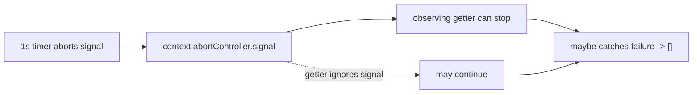

超时 API 的关键不是“有 AbortController”，而是 downstream 是否把 signal 传到 I/O 并在返回后复查。M03、M15 的取消结论在这里再次适用。

## Attachment 怎样变成模型消息

Attachment 先是内部 discriminated union，例如：

```text
{ type: 'nested_memory', path, content, displayPath }
```

`getAttachmentMessages()` 把它们创建为 internal attachment messages；`normalizeAttachmentForAPI()` 再按 type 转换，nested memory 最终成为包含 source path 和正文的 meta user/system-reminder。

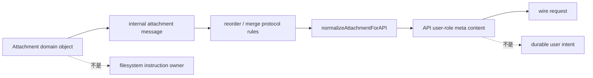

为什么要保持内部类型？因为同为 API user role：nested instruction、tool result、真实 user input、MCP resource、hook additional context 的生命周期和权限都不同。过早 flatten 成字符串会让去重、审计、compact 和安全治理失去依据。

Dynamic attachment 可以进入 messages/Transcript 的某些路径，但它的事实 owner仍不是 instruction catalog。是否持久化某个 attachment message与其下轮是否重新计算，也是两种问题。

## InstructionsLoaded Hook 为什么只是观察者

eager session load、compact reload、nested traversal、path glob match 和 include 都可能触发 InstructionsLoaded hook，并带 reason、file type、globs、trigger path 或 parent path。

调用使用 fire-and-forget；AutoMem/TeamMem 排除；用于 external approval 检查的 force read 不触发，避免双重审计。hook failure 记录日志，不撤销已装配 instruction。

这是一种合理的 ownership：InstructionPipeline 决定内容，Hook 观察来源。若 Hook 需要安全否决，协议必须明确升级为同步 policy gate，并定义 timeout/deny 语义；不能让 audit webhook 的网络抖动悄悄控制模型是否获得项目规则。

## 双语言实验：把隐形来源变成可观察契约

独立实验位于：

```text
curriculum/units/M18/code/typescript/
curriculum/units/M18/code/python/
```

先预测：

1. source 输入顺序乱序，最终是否仍 Managed→User→Project→Local→Dynamic？
2. target 是 Java path，docs rule 是否进入？
3. external source 为 untrusted，是否可能因 priority 高而进入？
4. 同一路径大小写不同出现两次，保留哪个？
5. catalog revision 更新后，旧 request snapshot 是否被原地改变？
6. 动态 delta 是否写回 catalog？
7. report 是否包含 instruction 正文？

运行：

```powershell
cd "D:\agent\Claude code最新\curriculum\units\M18\code\typescript"
node .\instruction-pipeline.test.ts
& "D:\agent\Claude code最新\mini-agent-harness\node_modules\.bin\tsc.cmd" -p .\tsconfig.json --noEmit

cd "D:\agent\Claude code最新\curriculum\units\M18\code\python"
python -m unittest -v test_instruction_pipeline.py
```

实际结果 TypeScript `7/7`、Python `7/7`、strict typecheck 通过。

实验没有实现 Markdown、@include 或 gitignore parser；它专门验证更可迁移的 contract：source、scope、trust、stable order、normalized dedupe、immutable revision、request-only delta 和 content-free report。

### 三个破坏实验

先删掉 trust filter，让 `untrusted` 参与排序。预期外部 instruction 进入 request。修复不是把 external source 排到最后；只要进入模型视图就已经越界，trust 必须是 selection gate。

再把 dynamic source 发布进 Catalog。连续两个 request 后观察上一轮 reminder仍存在。修复是让 dynamic delta只属于 `project(snapshot, target, delta)` 的返回值，不改变 durable catalog revision。

最后删除 `catalog.assertCurrent()`。先从 revision 0 投影，再 publish revision 1，仍把旧 snapshot 交给 Provider。修复不是深复制，因为旧 snapshot 本来就 immutable；问题是可见性时效，必须在发送边界验证 revision 或明确接受 snapshot consistency。

## H3-3 怎样进入 Mini Agent Harness

H3-3 新增 `InstructionCatalog` 与 `InstructionPipeline`，没有把内容塞进 `ConversationStore`。

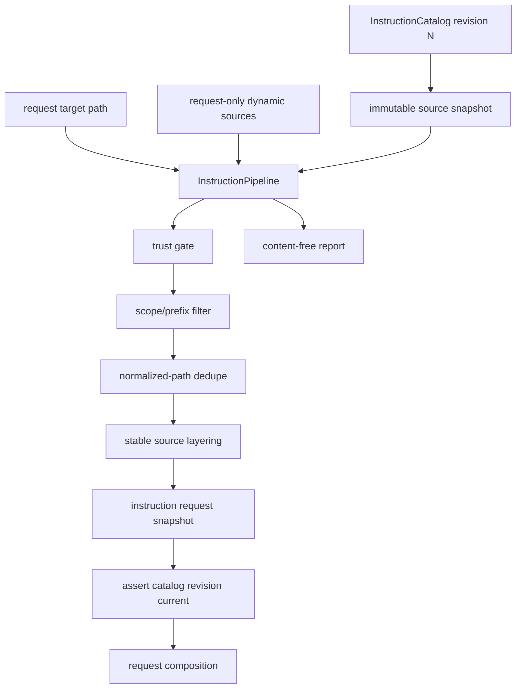

Merge：source kind、scope root/prefix、trust/approval、revision、stable order、dedupe、dynamic delta、metadata report和双语言行为。

Defer：真实 CLAUDE.md parser、gitignore glob、filesystem/symlink/include、InstructionsLoaded hook、nested trigger、Skill/MCP/Plugin source、持久化/分布式 catalog。

Reject：所有 instruction 拼成无来源字符串、external 默认信任、每轮无条件重读、共享可变数组、dynamic 回写 catalog、Trace 记录正文。

为什么 InstructionCatalog 不属于 ConversationStore？ConversationStore 拥有对话事实与 tool pairing；InstructionCatalog 拥有环境/政策 source revision。一个 conversation 可以在相同历史上对不同 target path产生不同 instruction view，二者不能共用一个“message revision”假装相同生命周期。

## 企业 Agent、RAG 与 Java/Spring 迁移

### Source metadata 是第一等数据

每条 instruction 至少保存：source type、canonical URI、scope、trust/approval、revision、content reference、policy version、loaded reason。正文放受控 content store，普通 telemetry 只记录 ID 与 count。

### Discovery 与 enforcement 分开

自然语言可以指导代码风格，不能授予 tool 权限。安全 policy 要在 executable gate、filesystem sandbox、network allowlist 里再次 enforcement。Managed instruction 与 Local instruction 冲突时，不能只希望模型“更重视前者”。

### Snapshot consistency 要明确选择

一次请求开始时固定 Catalog revision，Provider 前检查是否仍 current。强一致系统 stale 就重投影；允许 snapshot isolation 的系统可继续，但要把 revision写入审计，不能混成“最新”。

### Conditional scope 用成熟 matcher

生产中使用 gitignore/minimatch/pathspec 之类经过验证的库，统一跨平台 separator、case、symlink 和 root escape；不要自己用 `string.startsWith` 模拟完整 glob。H3-3 只实现 prefix，是明确范围，不冒充 Rules parser。

### Java 接口示例

```java
record InstructionSource(
    InstructionId id,
    SourceKind kind,
    URI canonicalUri,
    Scope scope,
    TrustDecision trust,
    ContentRef contentRef
) {}

interface InstructionCatalogRepository {
    InstructionCatalogSnapshot load(ProjectId projectId);
    long publish(ProjectId projectId, long expectedRevision,
                 List<InstructionSource> sources);
}

interface InstructionProjector {
    InstructionView project(InstructionCatalogSnapshot catalog,
                            RequestTarget target,
                            List<DynamicInstruction> deltas);
}
```

Spring `@Transactional` 可以保护 Catalog revision 和 source metadata；读取 Git、对象存储或 policy service 应形成扫描 plan，再短事务 CAS publish。远程 managed policy 更新可用 outbox/event 通知 runtime invalidation，不在每个 request 阻塞读取全部 source。

LangGraph 可以让 instruction node 从 checkpointed catalog revision生成 `instruction_view`，model node只读该 view。dynamic attachments作为本轮 state channel，reducer 不把它们写进 durable Catalog。

## 资深 Agent 开发面试会怎样追问

### 1. “CLAUDE.md 是放在 system prompt 里吗？”

**结论先说：当前主线程快照里 CLAUDE.md 主要经 `getUserContext()` 变成前置 meta user/system-reminder，不是 default system prompt section。**

`fetchSystemPromptParts()` 分开 default system prompt、userContext 和 systemContext；API 层再 prepend userContext。custom system prompt 会替换 default并跳过 systemContext，但 userContext仍构建，所以项目 CLAUDE.md 不会自动消失。nested 子目录 rule 又是另一条路径：目标文件触发后作为 attachment进入 Query message。企业实现不能只看 Provider role判断来源，必须在内部保留 source kind与 provenance；真正安全 policy还要在 tool/permission层 enforcement。

### 2. “多层 CLAUDE.md 冲突时谁优先？”

**结论先说：源码通过 Managed→User→root-to-CWD Project/Local 的文本顺序让局部内容更靠后，但这不是可证明的安全优先级。**

同一 rules目录的 sibling 还依赖未显式排序的 `readdir`，跨平台不保证。LLM 可能更关注后文，却没有 policy engine式 deny-overrides。生产方案应给 source显式 priority和冲突策略，Managed安全约束在 Permission/Sandbox再次执行；CI 可以检测同 scope的相反 rule。排序要 canonical且可重放，不能依赖文件系统偶然顺序。

### 3. “为什么 custom system prompt 仍然会受项目指令影响？”

**结论先说：custom只替换 default system prompt，CLAUDE.md属于独立 userContext assembly。**

`fetchSystemPromptParts()` 在 custom存在时返回空 default和空 systemContext，但仍 await `getUserContext()`；QueryEngine最后组合 custom、可选 memory mechanics、append，再由 API prepend userContext。要做 hermetic SDK执行，需要显式禁用 CLAUDE.md discovery、dynamic attachments、hook/skill等来源，不能只传 `--system-prompt`。我会在 API 设计中把 `replaceDefaultPrompt` 和 `disableAmbientInstructions` 做成两个不同选项。

### 4. “条件 Rules 为什么在读文件后才出现？”

**结论先说：它们的 scope依赖目标路径，启动时全注入既浪费 token又会把模块规则泄漏到无关任务。**

@mention或 Read把路径加入 nested trigger；attachment phase先等 user input getters，再做 allowed-path检查、Managed/User conditional、CWD到target nested dirs、root到CWD conditional。匹配使用 gitignore语义，Project相对项目root，Managed/User相对 original CWD。匹配不是读取授权，allowed working path先行。企业 RAG中也可用数据域、tenant和document tag触发 scoped instruction，但 matcher与authorization必须分开。

### 5. “为什么要同时维护 loadedNestedMemoryPaths 和 readFileState？”

**结论先说：前者拥有非驱逐的注入幂等性，后者是容量有限的文件读/变化/编辑安全缓存。**

只用 100-entry LRU，条目被驱逐后同一 CLAUDE.md会再次注入；只用 loaded Set，又无法判断磁盘变化或 transformed view是否可编辑。源码把 instruction path加入 non-evicting Set，同时把 raw bytes与 `isPartialView`放入 readFileState。compact会清 epoch后重建。企业里我会分别命名 `InstructionDeliveryLedger` 与 `FileReadSnapshot`，避免一个 cache同时承担两个生命周期。

### 6. “有 AbortController，为什么 attachment 一秒超时仍可能无效？”

**结论先说：取消是协作协议，只有 getter把 signal传到 I/O并观察它，abort才会停止工作。**

`getAttachments()` 一秒后 abort context signal，但不少 getter不检查；它们可能继续到自然完成。`maybe()`只隔离抛出的 error为 `[]`，不是强制 kill。正确实现要把 deadline传入每个 connector、在 await后复查，并为不可取消资源设置独立并发/熔断。面试中我会特别区分“发出取消请求”“Promise拒绝”“底层副作用停止”三个时点。

### 7. “动态 attachment 应该写入长期 instruction store 吗？”

**结论先说：默认不应该，attachment是本轮运行投影，持久 instruction是独立 source owner。**

IDE selection、MCP delta、task reminder、nested rule和diagnostics都可能成为 meta user message，但生命周期不同。若把它们统一 append到 Catalog，下一轮会重复旧提醒，compact/resume也无法区分重算与事实。H3-3让 dynamic source只进入一次 `project()` 调用，不改变 Catalog revision。确需持久化时，写成有 TTL/provenance的事件或 memory candidate，不偷换成永久规则。

### 8. “怎样设计企业级 Instruction Pipeline？”

**结论先说：先冻结 source、scope、trust、revision和注入时点，再选择 parser与存储。**

Discovery扫描 Managed/User/Project sources并产生 revisioned catalog；Projector按 request target和dynamic delta生成 immutable view；Provider前做 stale check；report只含 source IDs/count。external include必须approval，content进入受控store，安全约束在执行层重复enforce。Java/Spring用短事务 CAS publish加outbox invalidation；LangGraph用独立 instruction node，不让 conversation reducer拥有 catalog。测试重点是跨平台顺序、scope escape、stale snapshot、dynamic泄漏和敏感正文遥测。

## 离开本章前的重建

不看正文，画出同一 `packages/payment/src/main/java/Order.java` 从 Read 到模型的路径：trigger Set、allowed path、三阶段 Rules、loaded Set、nested attachment、normalization、wire request。再画 eager CLAUDE.md 的另一条路径，必须经过 `getMemoryFiles -> getClaudeMds -> getUserContext -> prependUserContext`，不能画进 default system prompt。

回答五个故障：

1. external Project include 未批准，在哪一层消失？
2. sibling Rules 顺序跨平台变化，为什么 memoize不能解决跨运行重放？
3. transformed instruction 已进 readFileState，为什么 Edit仍需显式 Read？
4. custom prompt为何不移除 CLAUDE.md？
5. attachment getter忽略 signal时，一秒 timer实际保证什么？

最后修改 H3-3：给 source增加 `policyRevision` 与 `expiresAt`，让过期 dynamic source在投影时拒绝，让 stale managed policy触发结构化 failure。保持 TypeScript/Python一致，report不含正文，并跑累计回归。

## 源码复习索引与证据边界

```text
src/utils/claudemd.ts
  -> getMemoryFiles()
  -> processMemoryFile()
  -> processMdRules() / processConditionedMdRules()
  -> getClaudeMds()
  -> clearMemoryFileCaches() / resetGetMemoryFilesCache()

src/context.ts
  -> getUserContext()
  -> getSystemContext()

src/utils/queryContext.ts
  -> fetchSystemPromptParts()

src/constants/prompts.ts
src/constants/systemPromptSections.ts
  -> default sections、memoized/uncached、clear

src/QueryEngine.ts
  -> custom/default/memory mechanics/append assembly

src/utils/attachments.ts
  -> getAttachments()
  -> getDirectoriesToProcess()
  -> getNestedMemoryAttachmentsForFile()
  -> memoryFilesToAttachments()
  -> getAttachmentMessages()

src/utils/messages.ts
  -> normalizeAttachmentForAPI()
  -> attachment reorder/merge

src/utils/hooks.ts
  -> InstructionsLoaded hook
```

证据状态：

- discovery、parent-first include、userContext位置、custom/default/append、nested三阶段、dedupe与attachment normalization是`快照事实`；
- sibling `readdir`顺序与 cooperative attachment timeout是`快照弱保证`；
- feature-gated私有变体不补造；
-双语言 `7/7`是`运行验证`；
- scoped/trusted/revisioned catalog、stable order、stale check和dynamic delta是`设计迁移`。

完成本章后，你不应再问“Claude Code 会不会读取这个文件”，而应问：**哪个 source发现了它，trust是否允许，scope何时匹配，它进入哪一种请求通道，哪个 revision拥有这次可见性，以及失败后会不会重复或泄漏。**
