# M19 记忆不是一段更长的 Prompt：Session Memory、Auto Memory 与跨会话召回

> 本章主体预计 4--7 小时；双语言实验、破坏性修改和 Harness 扩展另计。你已经完成 M17 的 compact transaction 与 M18 的 Instruction Pipeline。本章要解决的不是“如何把历史摘要塞回 prompt”，而是：**哪些内容值得跨越当前请求留下来，谁拥有它，何时可见，失败后会不会丢失或重复。**

## 一个会让 Agent 变笨的误判

用户在周一说：“所有金额都用 `BigDecimal`。”周二同一个仓库的新 session 仍然需要这条偏好。下面五种东西都可能出现这句话，却不能互换：

| 载体 | owner | scope | 生命周期 | 能否直接当作长期事实 |
| --- | --- | --- | --- | --- |
| 当前 user message | Query / conversation | 当前请求 | 一轮及其 durable history | 不能自动跨 session |
| compact summary | CompactCoordinator / Transcript view | 当前 session | 压缩 epoch | 不是 curated memory |
| Session Memory `summary.md` | session memory worker | project + session | 当前 session | 只能辅助当前 session compact |
| Auto Memory topic file | memory directory | canonical git root | 跨 session | 是候选长期上下文，仍需核验 |
| Transcript | transcript store | session / run | append-only 记录 | 是证据，不是摘要结论 |

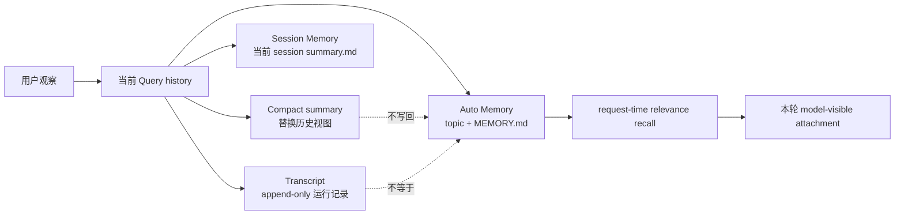

本章的核心句子是：

> **Memory extraction 是 best-effort 的候选提炼，Memory recall 是 request-time 的有界投影；两者都不能偷换成“模型写过，所以系统永久相信”。**

先把证据标签记住：`[FACT]` 表示当前 `claude-code-CLI/` 快照中由源码核验的行为；`[RUN]` 表示独立实验观察；`[DESIGN]` 表示本章 H3-4 clean-room Harness 的迁移设计，不是 Claude Code 事实。

## 1. Session Memory：给 compact 准备的 session-scoped side file

### 1.1 owner 与文件边界 `[FACT]`

Session Memory 位于 `{projectDir}/{sessionId}/session-memory/summary.md`，而不是 Auto Memory 的跨 session 目录。模块状态拥有 `lastSummarizedMessageId`、token 计数、提取开始时间和初始化状态。它只在满足 feature gate、非 bare、非 remote、主 REPL query source 等条件时注册 post-sampling hook。

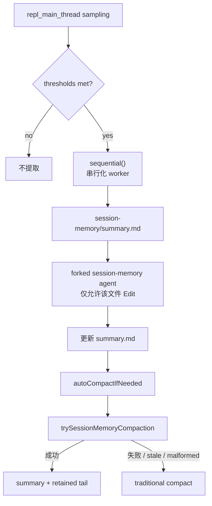

触发阈值不是一个“超过 N token 就必然运行”的开关。源码同时看当前 context token、相对上次 extraction 的增长、tool call 数和最后 assistant turn 是否仍有 tool use。闭包会在决定触发时推进候选边界；真正成功后才推进 token 计数和 `lastSummarizedMessageId`。因此“决定提取”和“提取成功”是两个事件。

### 1.2 为什么要等待但不能无限等待 `[FACT]`

SM compact 等待 extraction，最多约 15 秒；一旦 worker 超过一分钟被识别为 stale，或 summary 文件仍是 template、summarized UUID 不在当前消息、post-compact 仍超 threshold，就回退 traditional compact。这个等待是 soft deadline：它保证 compact 不一直等，但不证明底层 fork 已被强制杀死。

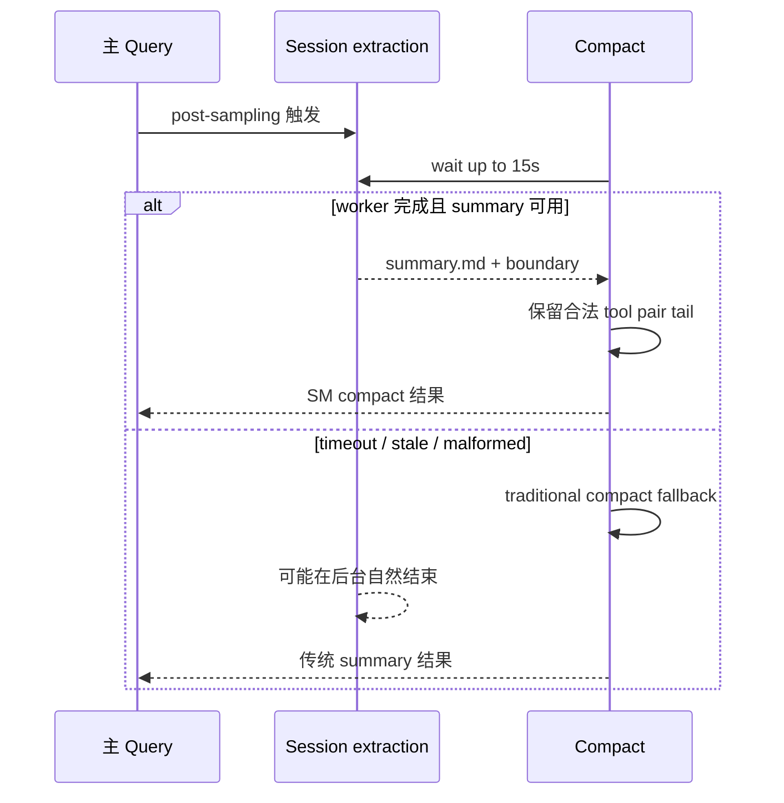

### 1.3 边界错误如何造成遗漏 `[FACT]`

`lastSummarizedMessageId` 只有在最后 assistant turn 没有 tool call 时才推进。这避免把 assistant `tool_use` 与后续 `tool_result` 之间切成“已经总结”的边界。手动 `/summary` 有 `finally` 清理；自动 post-sampling 路径异常时，`extractionStartedAt` 可能保留，下一次由 stale 逻辑恢复。

学习时请画出这条边界：

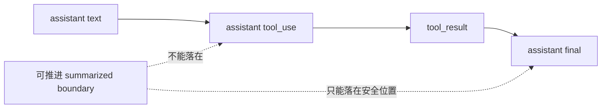

## 2. Auto Memory：跨 session 的 topic 与索引

### 2.1 scope 不是当前目录字符串 `[FACT]`

Auto Memory 默认把 canonical git root 映射到 `~/.claude/projects/<slug>/memory/`。worktree 共享 canonical root；没有 persistent storage 的 remote、bare、关闭 setting 或 env gate 时不启用。可信 settings source 才能 override 路径，project settings 不能随意改变全局 memory root。

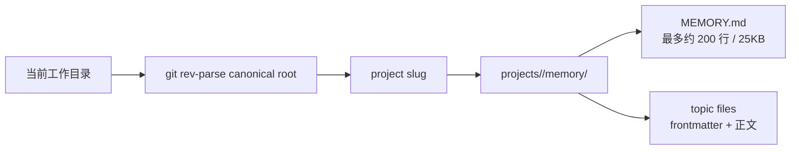

`MEMORY.md` 是索引，不是所有 topic 正文的替代品。传统模式可把索引当 AutoMem 经 `getUserContext()` 注入；relevance gate 开启后，索引会从 eager context 中移除，改为 query-time 选择 topic attachment。**“索引被注入”与“topic 被召回”是两条不同路径。**

### 2.2 主 Agent 写入与后台提炼 `[FACT]`

主 Agent 通过 memory mechanics prompt 获得直接 Write/Edit 能力。完整 query loop stop 后，`extractMemories` 以受限 fork 异步运行：最多扫描约 200 个 topic header，只允许 read tools、read-only Bash 和 memory root 内的 Write/Edit，`skipTranscript: true`，`maxTurns: 5`。同时到来的 stop context 不并发执行，只保留 latest pending context；当前 run finally 中递归执行一个 trailing run。headless/print 在 response flush 后 soft drain，interactive 不阻塞主回复。

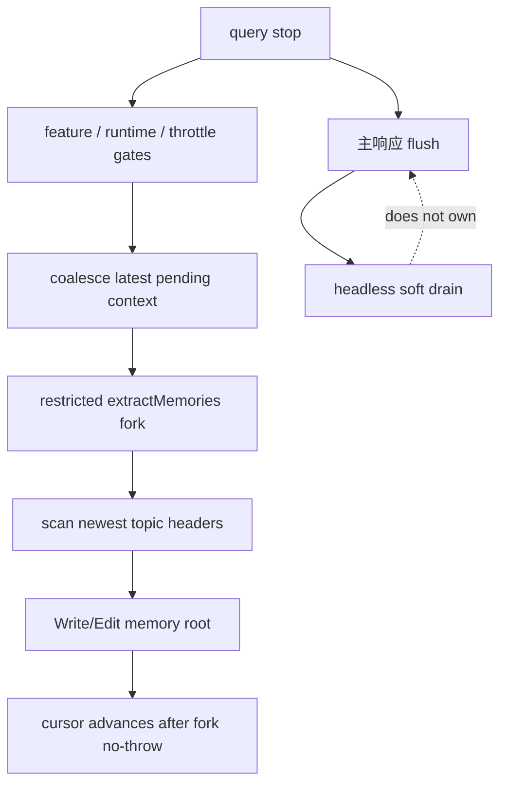

这里有一个必须诚实写出的失败窗口 `[FACT]`：`hasMemoryWritesSince()` 只根据主 Agent 的 Write/Edit `tool_use` 路径判断“已有写入意图”，没有把对应 `tool_result` 的成功、失败或 `is_error` 配对。因此主 Agent 发出写入意图但写入失败时，后台提炼仍可能跳过并推进 cursor。教材只能说“写入意图互斥、best-effort”，不能说 exactly-once、失败安全或写入成功后才推进。

### 2.3 Prompt guidance 不是 enforcement

memory mechanics prompt 会告诉模型什么值得保存、避免敏感数据、写完要更新索引。这是行为指导，不是 PII scanner、DLP、加密、事务或审批。当前快照没有统一 candidate/accepted 状态机、TTL、revision CAS、跨文件事务或强 crash durability。

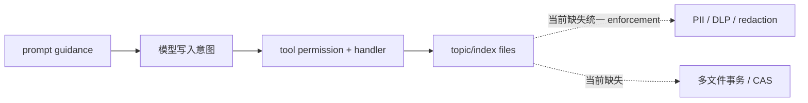

企业实现若要“用户偏好可以自动沉淀”，应让模型只产生 candidate event，经过策略、脱敏、人工或规则 accept 后才进入 accepted store。H3-4 会实现这个迁移契约。

## 3. Relevance recall：不是永久注入，而是一次请求的投影

### 3.1 从 query 到 topic attachment `[FACT]`

每个 user turn 入口启动一次 relevance prefetch，只接受至少两个词的真实 user prompt，并受 session-total bytes 限制。`scanMemoryFiles()` 排除 `MEMORY.md`，按 mtime newest-first，最多 200 个文件。`findRelevantMemories()` 用 side query 和 JSON schema 从 filename/description 选择文件，caller 最多取 5 个；返回 filename 必须再验证。

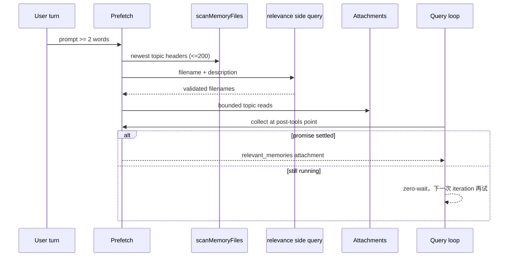

prefetch 与模型流、工具执行并行。post-tools collect 只在 promise 已 settled 时消费；本轮结束前未完成则 dispose abort，当前轮不注入。prior attachment、`readFileState` 与 `collectSurfacedMemories()` 共同去重，mark 必须发生在 filter 之后，避免 prefetch 把自己的结果标记成已展示。

### 3.2 召回失败的正确表述

相关性召回不是“记忆数据库自动把所有历史拼进 system prompt”。它是带 query、候选文件、字节预算、最多 5 个结果、freshness/mtime 元数据和 attachment normalization 的 request-time view。它可以漏召回，可以在本轮结束后才完成，也可以被 compact 清掉后再次 surfacing。所有这些都比“永久注入”更接近真实系统。

## 4. Auto Dream：跨 session consolidation fork

Auto Dream 在 stop 后异步尝试：time gate、10 分钟 scan throttle、touched session count、PID/mtime lock 全部通过才运行。fork 可读 transcript 与 memory，只能在 memory root 写，skip transcript；lock mtime 同时代表 lastConsolidatedAt，失败回滚 prior mtime，crash 由 dead PID/stale lock reclaim。

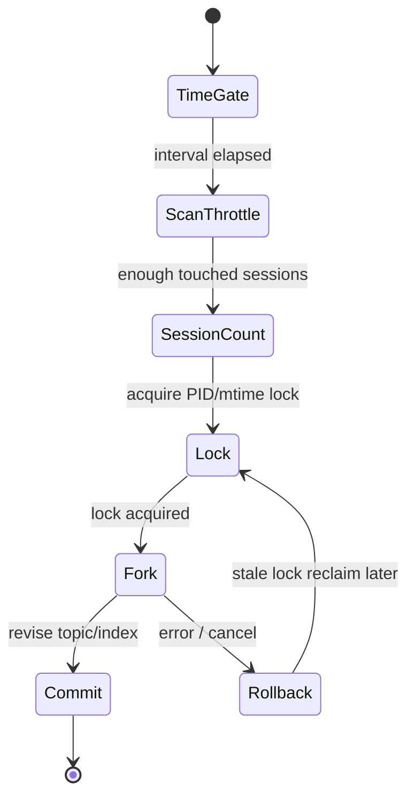

Auto Dream 直接修订或删除 topic 与 index；它不是 candidate approval，也没有多文件事务或 revision CAS。它的设计价值在于把“主响应 latency”与“跨 session consolidation”分离；它的治理缺口同样必须被指出。

## 5. 把一次记忆召回完整串起来

下面这张图是复习主图。不要把其中任意一条箭头解释成“所有内容都永久进入 conversation”。

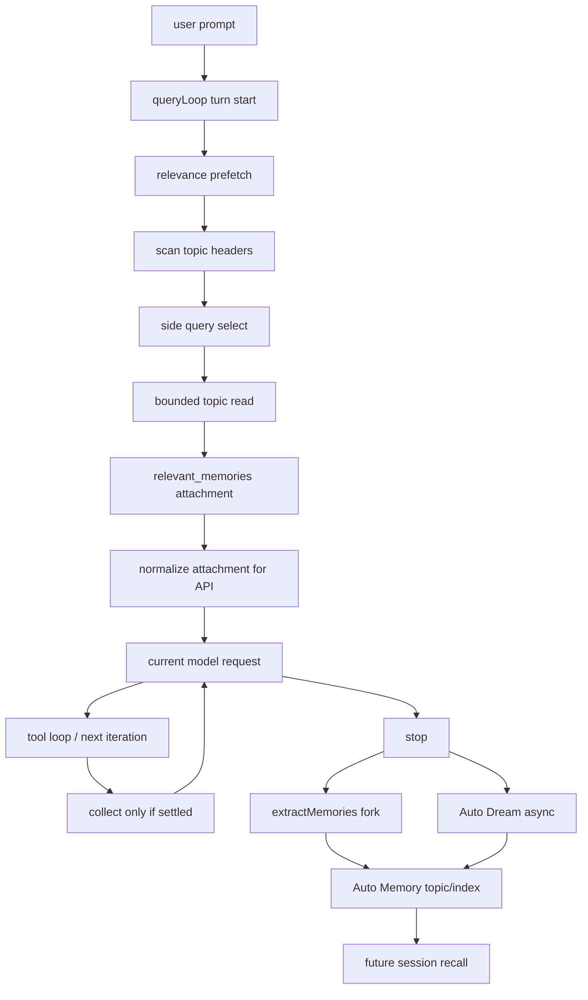

此图的 owner 复述：`ConversationStore/QueryLoop` 拥有当前请求，`CompactCoordinator` 拥有历史视图替换，Session Memory worker 拥有 session summary side file，Auto Memory worker/Dream 拥有跨 session topic/index，Transcript store 拥有运行证据。任何“统一 Memory Map”都会掩盖这些边界。

## 6. 双语言实验：先预测，再破坏，再修复

本章实验直接进入累计演进的 H3-4 Harness，而不是再维护一份会漂移的复制品：

```text
mini-agent-harness/typescript/agent/memory.ts
mini-agent-harness/typescript/agent/memory.test.ts
mini-agent-harness/python/memory.py
mini-agent-harness/python/test_memory.py
```

实验一开始先写下预测：candidate 能否被 recall？project scope 的记录能否在 session scope 出现？stale revision 是否被拒绝？compact 是否改变长期 accepted memory？Trace 是否包含正文？然后运行测试，最后故意破坏实现。

### 6.1 可验证闭环 `[RUN]`

H3-4 `MemoryStore` / `MemoryProjector` 的双语言契约：

1. candidate 未 accept 不可召回；
2. project/session scope 隔离；
3. 同 key 的 active duplicate merge，不产生第二条记录；
4. accept/update 使用 expected revision，stale writer 明确失败；
5. retention 到期后 accepted 变 expired，不能进入 projection；
6. bounded recall 具有稳定排序、item limit 与 char limit；
7. compact 只替换 ConversationStore 历史视图，不覆盖长期 memory；
8. metadata Trace 只含 operation、revision、ID、scope、reason，不含正文。

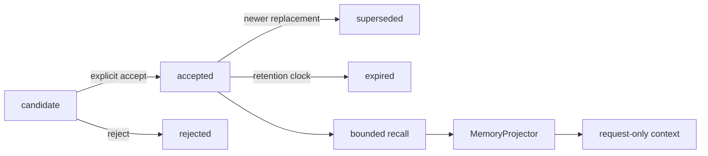

### 6.2 破坏实验

- 删除 `status === accepted` 过滤：测试应显示 candidate 泄漏到请求；
- 把 `expectedRevision` 改成 last-write-wins：并发 accept/update 应覆盖彼此，测试必须失败；
- 将 trace 改为记录 `content`：content-free 断言必须失败；
- 让 projector 直接 append ConversationStore：compact 后重建 conversation，长期 memory 不应消失；
- 移除 `scope` 比较：project 与 session 的同名 key 应串线，隔离测试必须失败。

修复不是“加一个 if 让测试变绿”，而是找回 owner：MemoryStore 管候选与生命周期，MemoryProjector 管当前请求视图，ConversationStore 管 durable messages，CompactCoordinator 管历史替换。

## 7. H3-4 clean-room 迁移设计 `[DESIGN]`

### 7.1 契约

```text
MemoryStore.propose(expectedRevision, candidate)
  -> candidate snapshot
MemoryStore.transition(expectedRevision, id, accepted|rejected|superseded|expired)
  -> revision-gated lifecycle change
MemoryStore.updateAccepted(expectedRevision, id, content, provenance)
  -> explicit accepted update
MemoryStore.recall(scope, query, limit, maxChars)
  -> read-only bounded view
MemoryProjector.project(scope, query, budget)
  -> request-only text + report
```

它合并了 candidate lifecycle、scope、provenance、revision-gated accept/update、retention、bounded recall 和 content-free trace；它明确延后磁盘/数据库持久化、加密、PII/DLP、embedding、distributed writer、team sync、Auto Dream 和 Transcript reducer。H3-4 **不是** Claude Code 当前内部状态机的复刻。

### 7.2 为什么不让 compact 持有 MemoryStore

compact 的输入是 durable conversation snapshot，输出是可恢复的替换计划；memory 的输入是候选事实，输出是带 scope 的 request-time context。前者必须维护 tool pairing、boundary 和 journal；后者必须维护 acceptance、retention 和 recall budget。合并 revision 会让“压缩历史”和“接受长期事实”互相覆盖。

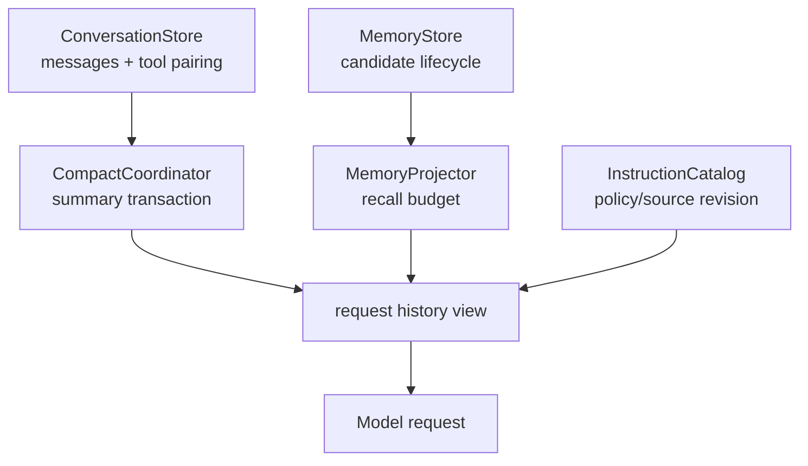

### 7.3 企业迁移

Java/Spring：`MemoryCandidate` 进入短事务表，`accept` 采用 `(memory_id, expected_revision)` CAS；正文放受控 content store，普通 telemetry 只写 ID、scope、status 和 counts。PII/DLP 扫描、租户隔离和 retention policy 位于 accept gate，而不是 prompt。outbox 通知 runtime 刷新 recall cache。

Python/LangGraph：把 `memory_candidates`、`accepted_memory_view`、`instruction_view` 放在不同 state channel；checkpoint 只保存 revision 与 IDs，model node 读取 projector 输出。不要让 reducer 把 dynamic attachment 归并进永久 catalog。

## 8. 资深 Agent 岗面试表达

以下问题假设面试官希望听到源码、运行时和系统设计，而不是背 API。每个回答都先给结论，再用约两分钟口语展开。

### 1. Session Memory 和 Auto Memory 有什么区别？

**结论：Session Memory 是当前 session 为 compact 服务的滚动 summary；Auto Memory 是按 canonical git root 跨 session 持久化的 topic/index。**

我会先从 owner 讲：Session Memory 写在 `{projectDir}/{sessionId}/session-memory/summary.md`，它的 boundary 由当前 Query message UUID 推进，compact 成功后清掉旧边界；Auto Memory 位于项目 slug 的 memory 目录，topic 可以在下一个 session 通过 relevance prefetch 召回，`MEMORY.md`只是索引。Claude Code 把前者接到 SM-first compact/fallback，后者接到 stop 后 extract fork、relevance attachment 和 Auto Dream。两者都可能含“用户偏好”，但生命周期不同，不能把 compact summary 当长期记忆，也不能把 Auto Memory 当 durable conversation。企业实现会分别建表和 retention policy，避免 session compact 覆盖跨 session accepted facts。

### 2. 为什么不能说“模型写成功后记忆就 exactly-once”？

**结论：当前快照只有写入意图级别的 best-effort 互斥，没有 tool_use/tool_result 成功配对，因此存在失败窗口。**

`hasMemoryWritesSince()` 看主 Agent assistant message 里的 Write/Edit tool_use 路径，后台 extract fork 看到路径就可能跳过并推进 cursor，但它不检查对应 tool_result 是否 `is_error`。所以工具拒绝、权限失败或文件写失败时，主 Agent 其实没写成，后台也可能不重试。这个设计避免重复覆盖，却牺牲了失败安全。我在生产系统会让写入产生带 operation id 的 candidate event，只有 handler 成功回执后才 accept，或者至少用 tool result 做 CAS；同时保留 retry/dead-letter，不能用一句“模型已经调用 Write”代替存储成功。

### 3. relevance memory 为什么是 request-time attachment？

**结论：因为它要控制 token、scope 和新鲜度，不能把所有 topic 永久塞进 system prompt。**

每个 user turn 启动 prefetch，先扫描最多 200 个 topic header，再用 side query 按 filename/description 选，caller 最多取 5 个并按 bytes/lines 截断。它和模型流、tool loop 并行，post-tools collect 只在 promise 已完成时零等待消费，未完成就留到下一轮；最终通过 relevant_memories attachment normalization 为当前请求的 meta message。这样同一个 topic 可以随 query 变化、随 compact 清理再 surfacing。企业 RAG 也应保留 retrieval provenance 和 request budget，不能把“被召回过”写成永久对话事实。

### 4. Auto Dream 解决了什么问题？

**结论：它把跨 session consolidation 从主响应 latency 中移走，但并没有自动获得事务性治理。**

stop 后经过 time gate、10 分钟 scan throttle、session count 和 PID/mtime lock，受限 fork 读取 transcript 与 memory，只在 memory root 写 topic/index；成功后下次 session能看到更整洁的长期记忆，失败则回滚 lock 时间。Claude Code 的这个设计适合 best-effort background maintenance，但直接修订/删除多文件，没有 candidate approval、revision CAS 或跨文件 transaction。企业系统要加 outbox、CAS、幂等 operation id 和审计，否则一个 crash 可能留下 topic/index 不一致。

### 5. 为什么 MemoryStore 不应该拥有 ConversationStore？

**结论：两者的状态 owner 和一致性边界不同，合并会让 compact、recall 和恢复互相污染。**

ConversationStore 负责 durable messages、assistant tool-use 与 tool-result pairing、run lease 和 request-ready snapshot；CompactCoordinator 在它上面做可恢复的 summary replacement。MemoryStore 负责 candidate status、scope、provenance、retention 和 accepted recall；MemoryProjector只在请求边界生成文本。Claude Code 里 Session Memory、Auto Memory、Transcript本来就走不同路径。我的 Harness 会让三个 revision 独立，request composer 显式同时读取 history view、instruction view 和 memory view，任何一个 stale 都能单独重投影。

### 6. 怎样防止 project memory 泄漏到另一个 session 或租户？

**结论：scope 必须是结构化键并在 recall 前强制匹配，不能只把 project 名拼进字符串。**

我会把 `(tenantId, canonicalProjectId, memoryScope)`作为索引和授权条件，session memory 还加 sessionId；project memory 只能在同 tenant、同 canonical root 的 projector 中读取。Claude Code 用 canonical git root 让 worktree共享项目，但这是产品语义，不等于企业多租户隔离。召回时先做 scope/policy gate，再做 relevance ranking；trace只记录 scope和IDs，不记录正文。测试必须创建同 key 的 project/session 两条记录并断言互不可见，之后再测试 stale scope policy。

### 7. compact 后为什么长期 memory 还在？

**结论：compact 替换的是 ConversationStore 的历史视图，不是 MemoryStore 的 accepted records。**

compact plan 会在 journal 中记录 original/replacement/provenance，提交后新请求看到 summary + retained tail；Session Memory 只是帮助生成 summary.md。Auto Memory topic/index由另一个 worker 管理，只有 recall attachment在请求时附着。所以 compact 可以清理旧 attachment、重置 session extraction boundary，却不应删除 accepted long-term memory。若实现把 memory 文本直接 append 进 durable history，恢复时会重复注入、无法区分来源，也会被下一次 compact错误压缩。

### 8. 记忆系统怎样做到可解释又不泄漏敏感正文？

**结论：把 content 与 provenance/telemetry 分离，模型看到的是受预算约束的 projection，trace只写元数据。**

candidate 保留 sourceKind/sourceIds、scope、capturedAt 和 policy revision；accept gate 先做 PII/DLP、retention 和权限检查，正文进入受控存储。recall projector按 query、limit、bytes 生成不可变 view，报告只给 selected count、IDs、revision 和 truncation。Claude Code 当前 topic/index和prompt guidance没有完整 enforcement，这正是迁移设计要补的地方。这样既能回答“为什么这条记忆出现在请求里”，又不会把用户的完整偏好写入普通日志或 trace。

## 离开本章前的重建

不看正文，完成四张图和两个修改：

1. 画 Session Memory extraction -> SM compact -> traditional fallback，并标出 15 秒 wait 与一分钟 stale 的不同含义；
2. 画 Auto Memory stop fork -> topic/index -> relevance prefetch -> attachment，标出 headless soft drain 和 zero-wait collect；
3. 在 Harness 中让 candidate 在未 accept 时尝试召回，解释为什么测试失败；
4. 把 `tool_use` 写入意图改成失败的 `tool_result`，说明为什么不能宣称 exactly-once；
5. 画 ConversationStore、CompactCoordinator、MemoryStore、MemoryProjector 的四个 owner；
6. 用自己的话回答“为什么 compact 不会覆盖 accepted long-term memory”。

## 证据索引

```text
src/services/SessionMemory/sessionMemory.ts
src/services/SessionMemory/sessionMemoryUtils.ts
src/services/compact/sessionMemoryCompact.ts
src/services/extractMemories/extractMemories.ts
src/memdir/memdir.ts
src/memdir/paths.ts
src/memdir/findRelevantMemories.ts
src/memdir/memoryScan.ts
src/utils/attachments.ts
src/services/autoDream/
src/query/stopHooks.ts
src/query.ts
src/QueryEngine.ts
```

快照事实、运行验证和 Harness 设计迁移必须分开写。Graphify 只帮助找到这些候选入口；最终教材事实来自源码、实验和官方行为交叉核验，不能引用图谱本身作为证据。
