# M20 一次工具调用怎样被治理：Tool ABI、Permission 与 Hook 决策链

> 主体学习时间：约 4--7 小时。双语言实验、故障注入和扩展挑战另计。

你已经在 M11 看过用户消息怎样进入 Query Loop，在 M15 看过多个 tool_use 怎样被分批调度并配回 tool_result。现在把镜头缩到其中一个调用。

模型给出一个 Bash 调用，带着 call ID、工具名和 command。最危险的误解是：“JSON 结构合法，所以找到 Bash handler 执行即可。”这个对象来自不可信模型输出；它可能类型错、业务上无效、命中组织 deny rule、需要用户确认、被 Hook 改写、在等待确认时被取消，也可能执行成功后被 PostHook 要求停止后续 Agent。每一步回答的问题不同，任何两个问题混成一个布尔值，都会让系统很难解释，也很难安全扩展。

本章只追这一条调用，但会追到副作用落地和下一次模型请求的边界：


先记住一句可以贯穿全章的话：

> Tool ABI 定义“可以调用什么”；Validation 判断“输入是否有意义”；Hook 提出外部扩展意见；Permission 裁决“这次是否授权”；Sandbox 约束“授权后在哪里运行”；PostHook 只能影响事后处理，不能把已经发生的副作用倒放。

## 1. Tool 不是一个函数，而是一组跨层契约

如果你熟悉 Spring，可以把 Tool<Input, Output, Progress> 想成 controller contract、authorization port、domain validator 和 command handler 的组合，但不要真的把它们实现成一个巨型方法。当前快照的 src/Tool.ts 里，决定执行语义的字段至少包括：

- name、aliases：运行时查找身份；
- inputSchema / inputJSONSchema：模型与运行时共享的结构契约；
- validateInput：工具自己的业务验证；
- checkPermissions：工具特有的授权判断；
- call：真正执行副作用或读取；
- isConcurrencySafe、isReadOnly、isDestructive：调度与治理元数据；
- requiresUserInteraction：这个工具能否由普通自动决策完成；
- backfillObservableInput：只给观察者补兼容字段，不默认改变真正 call input；
- outputSchema、maxResultSizeChars：结果边界；
- interruptBehavior：新用户消息到来时 cancel 还是 block。

所以 Tool 不是“函数加一段 description”。它同时参加模型能力投影、运行时查找、并发计划、权限、观察、执行和结果映射。M14 的能力目录决定模型是否看见 schema；M15 的 scheduler 读取并发属性；本章的 executor 才消费 validation、permission 与 call。


为什么不能直接把 MCP tool、内置 tool 和 plugin callback 都塞进 Map<string, Function>？因为函数表只能解决路由，不能表达请求 schema、可见性、权限、并发、取消、结果限制和审计来源。企业系统应把 executable registry 与 model-visible catalog 分开；前者是能力，后者是一次请求的投影。

### 三个输入，不要只看到一个变量

当前实现里至少要区分三种形态：

1. API 返回的原始 input；
2. schema parse 后的 parsedInput.data；
3. Hook/Permission 最终收敛、传给 tool.call 的 callInput。

backfillObservableInput 又引出一个“观察视图”：它在浅复制上补旧字段或派生字段，让 SDK stream、Transcript、Hook 和 canUseTool 看见，但不会自动修改真正的 callInput。这样可以兼容观察者，同时不破坏 prompt cache、序列化结果或 fixture。只有 Hook/Permission 返回 fresh updatedInput 时，替换才有意进入 handler。


这不是无关紧要的变量命名。观察字段若意外污染 call input，工具结果、路径语义和缓存键都可能改变；反过来，真正被批准的 rewrite 若只停留在日志视图，用户确认的修改又不会执行。owner 必须明确：executor 持有当前 call input，observer 只能提 proposal。

## 2. Validation 为什么必须在 Hook 前，也必须在 rewrite 后再来一次

### 当前快照的初始验证 [FACT]

checkPermissionsAndCallTool() 先执行 tool.inputSchema.safeParse(input)。失败时不会进入 Hook、Permission 或 handler，而是直接形成 is_error: true、带原 tool_use_id 的 user/tool_result。结构通过后才调用可选的 tool.validateInput(parsedInput.data, context)；业务验证失败也走配对错误结果。

schema 与 semantic validator 解决的是不同问题：

~~~text
schema: command 是 string 吗？未知字段允许吗？数组元素类型对吗？
semantic: command 在当前模式是否合法？路径组合是否矛盾？这个 edit 是否有可应用目标？
permission: 即使合法，当前用户和策略是否允许执行？
~~~

“非法”与“未授权”不能共用一个错误。非法输入应该让模型修参数；未授权应该说明策略或用户拒绝。把两者都叫 permission denied，会损失恢复信息，也会让审计无法区分模型协议错误与安全裁决。

### 当前实现的 rewrite 缺口 [FACT]

PreToolUse、PermissionRequest Hook 或交互式用户决策都可能返回 fresh updatedInput。Permission 内部某些路径会调用 inputSchema.parse() 再做 checkPermissions，但这不是统一 invariant：

- 初始完整的 safeParse + validateInput 已经发生在 Hook 之前；
- rewrite 后没有一个共同出口保证两者都重跑；
- permission parse 的非 abort 异常可以被记录后继续其他 rule/mode 分支；
- 因此不能说“任何批准后的输入一定重新经过完整验证”。


这类缺口并不等于“随便构造一个 exploit 就一定能绕过”。它仍值得进入教材，是因为它改变了可迁移的设计契约：每次外部 rewrite 都必须产生新 revision，并重新建立输入不变量。

在 Spring 中，可以把它实现成不可变 ToolInvocation，包含 callId、toolName、revision 与 JsonNode input。Hook 不能原地改 JsonNode；它返回 RewriteProposal，orchestrator 创建 revision + 1，再依次运行 JSON Schema validator 和 domain validator。只有成功 revision 才能进入 policy engine。这样审计能够回答：“最终执行的到底是哪一版输入？”

## 3. PreToolUse 不是一个 if：它是并行扩展点

企业经常需要在不改核心 executor 的情况下接入组织策略建议、命令标准化、DLP/secret scan、外部审批、telemetry 和附加上下文。因此 PreToolUse 运行在副作用之前，并能提出 allow、ask、deny、updatedInput、additional context、stop 或 prevent-continuation 等结果。它是扩展协议，不是最终授权者。

当前快照会把匹配 Hook 并行启动，再按完成结果流消费。permission behavior 使用安全单调的优先级：

~~~text
deny > ask > allow
~~~

也就是说，先看到 allow，之后看到 deny，最终仍是 deny；ask 不能覆盖 deny；allow 只在还没有更强决定时成立。

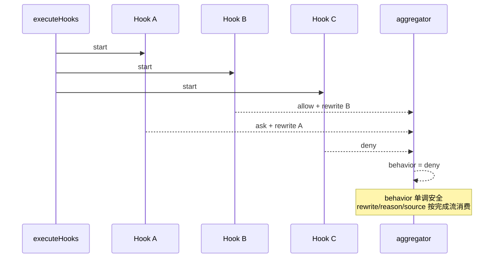

### 安全聚合不等于确定性 provenance [FACT]

behavior 是累计变量；但 yielded updatedInput、reason 和 source 来自当前完成的 Hook。多个 Hook 都 rewrite 时，后观察到的结果可能覆盖先前输入；聚合出来的 deny/ask/allow 又不一定来自携带最终 rewrite 的那个 Hook。

所以当前实现可以说：

- 最终 permission behavior 不会被较弱决定降级；
- Hook 并行减少总等待；
- 但它不是 ordered proposal log，也不是 input revision transaction；
- 单一 reason/source 不能完整代表所有参与者。

企业实现有三种选择：明确 Hook 顺序逐个执行 rewrite；Hook 并行产出 proposal 后按静态 priority 和 conflict policy 归并；或禁止多 Hook rewrite，只允许指定 rewriter。H4-1 为教学和可解释性选择第一种。它不是宣称 Claude Code 应该照此重写，而是用较小代码建立一个可验证的强契约。

### preventContinuation 不等于阻止当前调用 [FACT]

名字很容易误导。单独设置 preventContinuation，没有 blocking error、deny、stop 或 abort 时，当前 handler 仍可能执行；成功后才附加 stopped-continuation 信息。它控制的是后续 Agent 是否继续，不是当前副作用是否获准。


在自己的系统里最好把名字拆成 executionDecision 与 continuationDecision。一个负责“这次能否做”，另一个负责“做完后还要不要继续想”。这样不会把 stop-after-success 误当 transaction rollback。

## 4. Hook allow 为什么仍然不是最终 allow

Hook deny 可以直接拒绝；Hook ask 或没有决定会进入普通 canUseTool；Hook allow 仍要经过 checkRuleBasedPermissions()。显式 whole-tool deny、tool-specific deny、content-specific ask 和不能被 bypass 的 safety check 都可覆盖 Hook allow。

另外，requiresUserInteraction 且 Hook 没提供 updatedInput 时仍需交互；requireCanUseTool 为真时仍必须走 canUseTool；Hook 为交互型工具提供 fresh input 时，可以充当交互适配器，但仍不能越过 deny/ask rule。


这就是“扩展点不能拥有最高授权”的设计原则。组织 Hook 可以建议允许，但核心不可绕过规则仍由 policy owner 保留。相反，如果 Hook deny 是组织强制策略，core 也不应悄悄把它降成 ask。

Permission 内部也不是一张简单 allowlist。hasPermissionsToUseToolInner() 的关键优先链大致是：

~~~text
abort precheck
-> whole-tool deny
-> whole-tool ask（sandboxed Bash 存在受控例外）
-> tool.checkPermissions
-> tool-specific deny
-> requiresUserInteraction
-> content-specific ask
-> safetyCheck
-> bypass / plan-bypass
-> whole-tool allow
-> passthrough as ask
~~~

外层还处理 dontAsk 将 ask 收敛为 deny、auto mode classifier、safe-tool allowlist、acceptEdits、PowerShell 等分支。不要背这一串作为永远不变的模板，而要看懂它表达的优先级：显式禁止和不可绕过安全检查早于自动放行；工具最了解输入的局部风险；ask 是未完成决策而不是弱 allow；没有交互表面时 ask 必须被 resolver 处理或 fail closed；bypass mode 也不是跳过所有 safety check 的万能开关。

## 5. 同一个 ask，在 interactive 与 headless 里如何落地

### 交互式：多个候选答案，只能有一个 winner [FACT]

REPL 可以显示 permission dialog。Hook、classifier、bridge/channel 与用户输入可能在不同时间返回，PermissionContext 与 interactive handler 使用 queue callback 和 createResolveOnce().claim()，让第一个合法 winner 取得决策所有权。后到结果不能再次 resolve 同一调用。

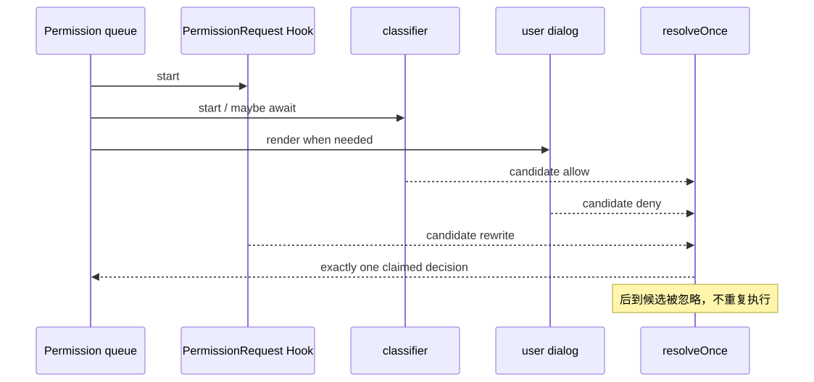

等待期间还要处理 abort：用户已经取消当前 run，就不能稍后弹出过期 dialog，也不能让 classifier 的迟到 allow 启动工具。这也是 permission promise resolve 与 side effect 开始之间需要最后检查的原因。

### Headless / async agent：无 UI 不等于默认允许 [FACT]

print、SDK 或后台 agent 可能不能弹 dialog。此时需要 ask 的调用会先给 PermissionRequest Hook 一个机会；Hook 可 allow、deny、rewrite 或更新规则。无决定则 auto-deny，Hook 异常也不会自动 allow。auto classifier unavailable 究竟 fail open 还是 fail closed 受 feature gate 影响，所以教材不能泛化成“任何 classifier 故障都必然拒绝”。


企业设计中，headless resolver 应是显式端口。没有 resolver、resolver timeout、抛错或返回无法验证的 rewrite，都应形成可配对、可解释的 deny，而不是因为“无人能点按钮”就提升权限。

## 6. 最窄也最重要的竞态：allow 之后、side effect 之前

外层 callTool() 在进入 streamed execution 前检查 abort；Hook 与 permission adapter 内也有多处取消处理。但内层 checkPermissionsAndCallTool() 在最终 allow 收敛后，没有一个统一的 executor-level throwIfAborted() 再进入 tool.call()。具体工具可能自己观察 AbortSignal，Bash 也会把 controller 传入进程层，但那是 handler 协作，不是所有 Tool 共享的强保证。

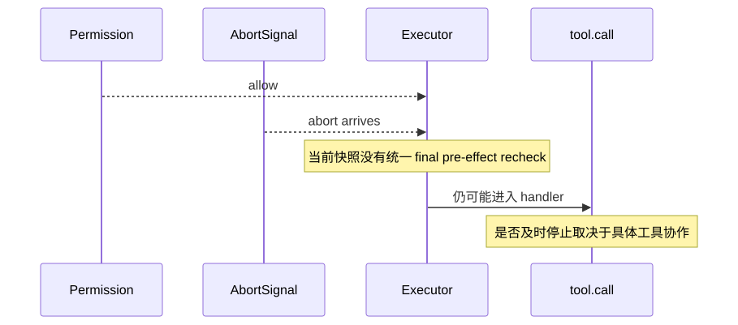

正确做法是为取消定义 ownership：等待 permission 时由 adapter 响应取消；permission 返回后 executor 在副作用前做最后复查；handler 内长任务协作取消并清理；handler 返回后 executor 再归一 outcome；不论哪条路径，call finalizer 只提交一个 result。

H4-1 的 ExtensionDecisionPipeline.prepare() 返回 immutable PreparedDecision。Registry 在 allow 后立刻检查 signal，才调用 handler。TypeScript 与 Python 测试都构造“permission 刚 allow 就 cancel”的竞态，断言 handler call count 为 0。

这里的“恰好一个 paired result”不是说网络世界获得 exactly-once side effect。它只表示当前进程的 conversation protocol 对每个 call ID 最终提交一次 outcome。若 handler 在外部系统完成写入后进程崩溃，仍需 idempotency key、outbox 或外部事务解决。

## 7. PostHook 在时间箭头的哪一边

PostToolUse 在 handler 成功后运行；PostToolUseFailure 在 handler throw 或 abort 后运行。它们可以追加上下文、改变部分可见输出、阻止后续 continuation 或提供诊断，但不能撤销文件写入、网络请求或已经启动的进程。

非 MCP 工具的结果在 PostHook 前已经装配；MCP output 因支持 PostHook 改写，会在之后映射。这一差异影响“Hook 能改变模型看到什么”，却不改变“副作用已经发生”。


如果业务真的要求 rollback，它必须位于 domain transaction 内，或由显式 compensation workflow 完成。PostHook 只能发起补偿请求，不能凭一个 blockContinuation 布尔值宣称之前的远端付款、邮件发送或文件删除不存在。

下面这些出口都必须让原 tool_use_id 得到结果：unknown/不可执行 Tool、schema 失败、semantic validation 失败、PreHook stop、permission deny、handler success、handler throw 和 abort/cancel。


Hook attachment、progress 和 diagnostics 都是旁路消息，不能替代 tool_result。否则下一次请求会出现 orphan tool use，M13 的 strict request pairing 会拒绝它。当前 Claude Code 是外层 callTool() 与内层编排共同构成这项保证；Harness 则让 Scheduler 归一化 outcome，再由 Runtime 按原 call order 写入 ConversationStore。

## 8. Permission 与 Sandbox：两个正交轴

Permission 回答“当前主体能否以这份 input 调用这个 capability”；Sandbox 回答“即使 capability 已获准，实际进程可触达哪些文件、网络、系统调用和资源”。

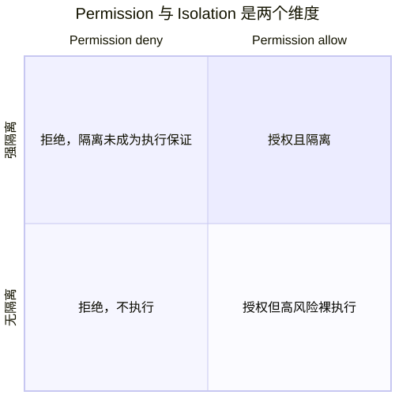

sandboxed Bash 状态可以影响 ask/auto-allow 判断，dangerouslyDisableSandbox 或 excluded command 也会改变运行方式；但 Permission allow 绝不证明已隔离。Sandbox 拒绝通常表现为执行阶段错误，也不等同于 permission deny。M25 会研究隔离实现，本章只把接口边界钉牢。

迁移到 Kubernetes 或企业 runner 时，同样要分开：policy service 决定 tenant/user/tool/input 是否授权；execution plane 决定 container、filesystem mount、network policy、CPU/time limit；audit ledger 关联 decision ID 与 execution ID。二者任一失败都产生配对结果，但 reason category 不同。

## 9. 运行 H4-1：把弱保证改成可测试契约

本章不是另建一次性 demo。H4-1 合并进累计 Harness：

~~~text
mini-agent-harness/typescript/agent/extensionDecision.ts
mini-agent-harness/typescript/agent/extensionDecision.test.ts
mini-agent-harness/python/extension_decision.py
mini-agent-harness/python/test_extension_decision.py
~~~

先读契约，不要先读实现：


DecisionContext 只含 call ID、tool name、revision 和深冻结 input；DecisionEvidence 只含 stage、source ID、behavior 与 revision。input、output、command、path、Hook stdout 和 secret 不进入 evidence。

Hook 按注册顺序运行。每次 updatedInput 都创建 revision + 1，随后同时重跑 schema 与 semantic validator。Hook allow 是 proposal；policy deny 仍胜出，并保留两条 evidence。ask 必须由显式 resolver 收敛；headless 无 resolver 或 resolver throw 都 fail closed。

### 先预测，再运行

先写下七个答案：

1. Hook allow、policy deny 时，最终是什么？能否同时看见两条 evidence？
2. Hook 把 count: 2 改成 count: 0，handler 调用几次？
3. permission allow 后同一事件循环触发 cancel，副作用是否发生？
4. handler 成功后 PostHook stop，输出还在吗？下一轮继续吗？
5. headless ask 没 resolver，会不会继承 policy allow？
6. deny/throw/cancel 最终会不会造成缺失或重复 result？
7. evidence 序列化后能否找到 input secret？

然后运行：

~~~powershell
cd "D:\agent\Claude code最新\mini-agent-harness"
node typescript/agent/extensionDecision.test.ts
python -m unittest discover -s python -p "test_extension_decision.py" -v
npm run typecheck
npm test
~~~

当前实现的聚焦结果是 TypeScript 7/7、Python 7/7，严格类型检查通过。第七项验证 resolver rewrite 同样创建 revision、重跑双层验证和 policy，并且 content-bearing reason 不进入 evidence。累计回归还会覆盖 scheduler、ConversationStore、compact、instruction、memory、streaming 和 S0--S3 旧契约；聚焦测试通过不能代替累计回归。

TypeScript 的关键路径可以压缩成：

~~~typescript
let context = freezeContext(callId, toolName, 0, input)
validateSchema(context.input)
await validateSemantics?.(context.input)

for (const hook of preHooks) {
  const proposal = await hook.run(context, signal)
  if (proposal.updatedInput) {
    context = freezeContext(callId, toolName, context.revision + 1, proposal.updatedInput)
    validateSchema(context.input)
    await validateSemantics?.(context.input)
  }
}
~~~

关键不是语法，而是 owner 转移：Hook 不拿走 context，它只返回 proposal；pipeline 创建下一版并重新验证。Python 使用 frozen dataclass 与 MappingProxyType 表达同一契约。

### 做五个破坏实验

- 删掉 rewrite 后的 semantic validation。预期“合法改非法”测试失败，handler 若继续则证明缺口越过业务不变量。
- 把 policy deny 改成“只要任一 Hook allow 就 allow”。预期 Hook allow + policy deny 测试失败。这模拟 extension 越权。
- 删掉 handler 前的 throwIfAborted / throw_if_cancelled。预期 permission-race 测试中 call count 变成 1。
- 让 PostHook stop 把成功 output 改成“未执行”。测试应迫使你承认副作用已发生；正确实现只设置 continueConversation = false。
- 把整个 input 放进 DecisionEvidence。metadata-only 断言应失败。修复不是对 secret 字符串打码，而是让 evidence schema 根本没有 content 字段。

每次破坏后先解释 owner 被谁偷走，再恢复实现并跑累计回归。不要只记“加一个 if”。

## 10. 从 H4-1 走向简历级 Agent Harness

H4-1 不是 Claude Code 的缩小复刻，也不追求其 50% 功能。它选择了简历和面试中最有解释力的核心：provider-neutral Tool Registry 与 request-time visibility；schema + semantic 双层验证；ordered pre/post Hook ABI；immutable revisioned input；Hook proposal、policy winner、resolver 的 metadata evidence；final pre-effect cancellation gate；headless ask fail-closed；concurrent-safe scheduling 与 exclusive barrier；一个 call 一个 paired result；PostHook continuation 与 rollback 明确分离。

延后内容也必须能说清：不实现 Claude Code 全部 permission mode、classifier 和 UI；不实现真正进程 Sandbox，当前 run_command 的 executable grant 仍是高风险裸执行；不实现 distributed policy service、审批数据库和 durable Hook queue；不保证外部副作用 exactly-once；不把 evidence 接成完整 SIEM；不允许 Hook stdout、input/output 或凭据进入普通 trace。

### Java/Spring 迁移

建议拆成 ToolCatalog、ToolRegistry、InvocationValidator、ExtensionDecisionPipeline、PolicyDecisionPoint、ApprovalResolver、ExecutionPlane 与 ToolResultFinalizer。ToolResultFinalizer 与外部副作用用 operation ID 关联。数据库可保存 metadata decision ledger，敏感 input 放受控 payload store；普通审计表只保存 call ID、tool ID、input revision、policy revision、decision source、outcome category 和 duration。

### Python / LangGraph 迁移

不要让所有节点随意修改一个 state["tool_input"]。更稳妥的是让 raw_invocation、validated_revision、hook_proposals、policy_decision、approved_invocation、execution_outcome 和 paired_message 成为不同 state channel。每个 channel 存不可变值；conditional edge 只依据 decision category 路由。Checkpoint 保存 revision 和 evidence IDs，不默认保存 Hook stdout 或完整 secret-bearing payload。Tool node 前仍要检查 cancellation/deadline，不能把 graph edge 当成副作用闸门。

## 11. 资深 Agent 开发岗怎样问这一章

下面不是背诵题库。回答都先给结论，再在约两分钟内自然展开 Claude Code 的实现、失败边界和自己的迁移设计。

### 1. 一个 Agent tool 为什么不能就是 Map<String, Function>？

**结论：函数表只解决名字到 handler 的路由，工程级 Tool 还必须同时表达模型 schema、运行时验证、授权、并发、取消和结果协议。**

Claude Code 的 Tool 除了 call，还有 input schema、validateInput、checkPermissions、只读/破坏性/并发属性、交互需求、结果大小与 progress。调用时 executor 先验证，再跑 PreToolUse 和 permission，最后才进 handler；任何出口还要生成原 ID 的 tool_result。我做企业 Harness 会把 model-visible catalog 和 executable registry 分开，用一次请求的 capability projection 控制模型能看见什么，用 registry 与 policy 决定实际能执行什么。这样“没投影”“没注册”“已注册但拒绝”是三类明确错误，而不是一个 function not found。

### 2. PreToolUse Hook 返回 allow，为什么还可能被拒绝？

**结论：Hook allow 是扩展层提案，不是最高权限；显式 deny、tool rule、content ask 和不可绕过 safety check 仍能覆盖。**

Claude Code 在 resolveHookPermissionDecision 里不会拿 Hook allow 直接调用工具，而是继续检查 rule-based permissions；requires-interaction 或 requireCanUseTool 也可能进入用户决策。多个 Hook 的 behavior 又按 deny 大于 ask 大于 allow 聚合。这避免一个 plugin Hook 越过组织强制策略。我的实现会保留两份 provenance：Hook proposal 和 policy winner，而不是只写“denied”。这样既能解释 Hook 工作过，也能证明最终授权 owner 是 policy engine。

### 3. 多个 Hook 并行时怎样处理 input rewrite？

**结论：permission behavior 可以安全单调聚合，但 input rewrite 必须有确定的 conflict policy，否则来源和最终输入会混淆。**

当前 Claude Code 并行运行匹配 Hook，deny/ask/allow 聚合不会被弱决定降级；但 completion stream 中的 updatedInput、reason/source 可能后观察覆盖，不能把它讲成强 provenance ledger。生产里我会选 ordered Hook，或并行生成 proposal 后按静态 priority 合并，并拒绝冲突字段。每次合并创建新 revision，重跑 schema 和 domain validation。Harness 为了教学选择 ordered ABI；大型系统可把纯观察 Hook 并行，只有 rewriter 串行。

### 4. 为什么 rewrite 后还要重新验证？permission check 不够吗？

**结论：permission 只回答授权，不能替代结构和业务不变量；rewrite 产生的是一份新输入，必须像外部输入一样重新验证。**

Claude Code 初始会跑 Zod schema 和 validateInput，但 Hook、PermissionRequest Hook 或用户之后可给 fresh input，当前快照没有统一再跑两层验证的出口。某些 permission path 会 parse，但异常处理和 semantic validator 都不构成全局保证。我的 H4-1 把 input 做成 revisioned context，每次 rewrite 后 schema + semantic 都通过才进入 policy。测试把 count:2 改成非法的 0，断言 handler从未被调用。企业里还会把 validator version 写进 decision metadata，便于策略升级后追责。

### 5. permission 已经 allow，为什么还要在 handler 前检查 cancel？

**结论：因为等待授权本身是异步窗口，allow 只证明决策完成，不证明当前 run 仍然有效。**

用户可能在 dialog、Hook 或 classifier 返回的同一时刻取消。Claude Code 多处观察 abort，外层入口也检查，但当前内层 allow 到 tool.call 没有统一 final gate，具体工具是否及时停取决于 handler。我的 executor 在决策后、side effect 前统一 recheck，handler 内继续协作取消，返回后再归一结果。测试故意让 gate allow 后立刻 abort，handler count 必须是 0。我要强调这仍不等于外部 side effect exactly-once，远端写入需要 idempotency key 和 outbox。

### 6. PostToolUse block 能回滚工具吗？

**结论：不能；它位于副作用之后，只能控制后续 continuation、可见输出或启动显式补偿。**

Claude Code 的 PostToolUse 在 handler success 后，PostToolUseFailure 在 throw/abort 后。文件、网络或进程副作用已经发生。甚至 PreToolUse 的 preventContinuation 单独存在也不一定阻止当前 handler，它主要在成功后停止 Agent。我的 Harness 把结果写成 execution outcome 与 continueConversation。PostHook stop 时保留成功 output 和 side-effect count，只是不再发下一次模型请求。真回滚要在事务 owner 内，跨系统则用 saga/compensation，不能由 Hook 的一个布尔值伪装。

### 7. 无 UI 的后台 Agent 遇到 ask 怎么办？

**结论：ask 必须交给显式 headless resolver；没有 resolver、resolver 失败或无决定时 fail closed。**

Claude Code 的 headless/async path 会先跑 PermissionRequest Hook，无决定才 auto-deny，Hook 异常不会自动放行。auto classifier unavailable 的策略受 feature gate 影响，我不会夸大成所有场景都 fail closed。自己的系统里会把 resolver 做成端口，可接组织审批、预授权 token 或 coordinator；resolver 返回 rewrite 仍要再验证。后台任务不能因为“没人能点确认”就把 ask 当 allow，那相当于交互能力越弱权限越高。

### 8. 怎样保证 tool result 配对，又不泄漏工具内容到审计？

**结论：协议 finalizer 只负责每个 call ID 提交一个 outcome；审计只存 metadata evidence，content 走受控结果存储。**

Claude Code 对 validation fail、Hook stop、deny、success、throw 和 abort 都通过总编排形成原 tool_use_id 的 result，Hook attachment 不能替代它。Harness 的 scheduler 把异常归一为 success/error/denied/cancelled，Runtime 按原 call order 写 ConversationStore。Decision evidence 只含 stage、source ID、behavior 和 revision，不含 command、path、Hook stdout、input/output 或 secret。企业里我会用 call ID 关联加密 payload store、decision ledger 和 execution log；普通 telemetry 只放类别、revision、duration 和计数。

## 12. 离开本章前，凭记忆重建

不看正文完成这些动作：

1. 画出 Tool ABI 到 paired result 的完整链，并给 schema、semantic、permission 各写一个不同失败例子；
2. 解释 observable input、initial call input、fresh updatedInput 的 owner；
3. 画三个并行 Hook 返回 allow/ask/deny，指出 behavior 与 rewrite provenance 为什么不是同一问题；
4. 解释 Hook allow 为什么仍可能进入 ask 或 deny；
5. 画 interactive resolve-once 与 headless fail-closed 两条时序；
6. 标出 permission allow 到 handler 之间的取消窗口；
7. 用一句话区分 prevent current execution、prevent continuation 与 rollback；
8. 运行双语言 H4-1 测试，再破坏 rewrite revalidation 和 final abort gate；
9. 解释 paired result exactly-once 与外部副作用 exactly-once 的区别；
10. 把 H4-1 迁移为 Spring ports 或 LangGraph state channels。

如果你只能记住一张复习图，就记这一张：


## 证据索引

~~~text
claude-code-CLI/src/Tool.ts
claude-code-CLI/src/services/tools/toolExecution.ts
claude-code-CLI/src/services/tools/toolHooks.ts
claude-code-CLI/src/utils/hooks.ts
claude-code-CLI/src/utils/permissions/permissions.ts
claude-code-CLI/src/types/permissions.ts
claude-code-CLI/src/hooks/useCanUseTool.tsx
claude-code-CLI/src/hooks/toolPermission/PermissionContext.ts
claude-code-CLI/src/hooks/toolPermission/handlers/interactiveHandler.ts
claude-code-CLI/src/tools/BashTool/shouldUseSandbox.ts
claude-code-CLI/src/tools/BashTool/BashTool.tsx
~~~

Graphify 只用于发现候选入口。本章的 [FACT] 来自当前源码快照与双事实闸门；[RUN] 来自双语言 Harness 测试；[DESIGN] 是 clean-room 迁移，不得反推成 Claude Code 当前保证。
