# M21 一份 Markdown 怎样变成可执行能力：Skill、Plugin 与扩展供应链

> 主体学习时间：约 4--7 小时。双语言实验、冲突注入和供应链扩展挑战另计。

M20 刚把一条 `tool_use` 拆成 validation、Hook、Permission、handler 和 paired result。可是还有一个更早的问题：`SkillTool` 为什么知道某个 Skill 存在？一个 Plugin 里的 command、agent、Hook、MCP 或 LSP 配置，怎样从磁盘或 marketplace 进入正在运行的 Claude Code？禁用 Plugin 后，已经开始的调用又会不会被“瞬间抹掉”？

初学者最容易用一个过于简单的模型回答：启动时扫描目录，把名字放进 Map，调用时读 Markdown；重名靠 namespace；更新时重新加载 Map。这个模型能解释一个十行 demo，却解释不了真实系统中的来源优先级、延迟投影、信任边界、缓存版本、刷新窗口和 in-flight execution。

本章沿一份扩展从“来源意图”走到“一次请求真正可见”的全过程前进：


先把结论压成一句话：

> 扩展系统不是“文件扫描器”，而是来源治理、物化、解析、命名、活动注册、请求快照和执行租约组成的生命周期；语法有效、缓存命中和名称带前缀都不能分别替代信任、完整性和冲突处理。

## 从一个 `SKILL.md` 开始：文件何时读，正文何时进入模型

假设项目里有：

```text
.claude/skills/review-java/SKILL.md
```

文件包含 frontmatter：名称、描述、何时使用、允许的工具，以及一段很长的操作流程。直觉会说“为了节约 token，Claude Code 直到调用时才读文件”。这句话把三件事混在了一起：磁盘读取、模型发现、正文展开。

在 `src/skills/loadSkillsDir.ts` 中，`loadSkillsFromSkillsDir()` 找到 `SKILL.md` 后就调用 `fs.readFile(skillFilePath)`，再由 `createSkillCommand()` 解析 frontmatter，并把正文保存在 `Command` 的闭包里。也就是说，发现阶段已经发生磁盘 I/O。到了模型需要知道“有哪些技能”时，`SkillTool` 的列表主要投影 name、description、when-to-use 等元数据；真正调用时，`getPromptForCommand()` 才取出闭包中的正文，替换参数和变量，并进入消息。

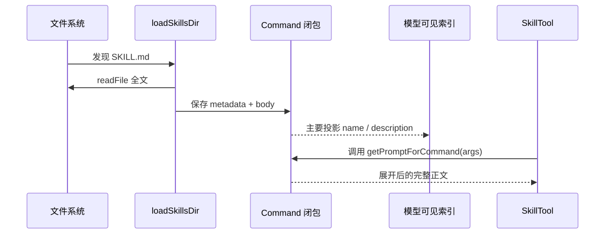

这是一种“提前读取、延迟投影”。它的收益是发现与调用之间不必再次依赖磁盘，索引又不需要把所有正文塞进每轮 prompt。代价也很明确：文件在发现后被修改，旧闭包不会凭空变化，必须触发相应缓存失效或重载；“延迟正文”也不等于“零内存占用”。

### 为什么闭包在这里不是语法花活

TypeScript 中函数可以捕获创建时作用域里的 `content`。`Command.getPromptForCommand` 不是只保存文件路径再重读，而是保存一段可在未来执行的行为。这让 Command 成为“已解析能力描述”，不是裸文件引用。

Java 最接近的是构造一个不可变 `SkillDefinition`，其中保存 body，并暴露 `render(arguments, sessionContext)`；Python 可以用冻结 dataclass 保存 body，再由方法展开。不要把闭包误解为自动实时读取：闭包捕获的是这次发现得到的值。

你可以做一个一分钟预测：发现 Skill 后立刻改写磁盘文件，但不触发刷新，本轮调用会看到旧正文还是新正文？按上述模型应是旧正文。反证条件是 `getPromptForCommand()` 内重新 `readFile`；当前决定性路径没有这样做。

## 延迟的不只是正文，还有“什么时候允许执行”

本地 Skill 调用时会执行参数替换、`${CLAUDE_SKILL_DIR}`、`${CLAUDE_SESSION_ID}` 等替换，也可能处理 Markdown 中的 prompt shell。于是 Skill 不是静态知识卡片，它可能把自然语言扩展成一次可执行流程。

这里必须把来源带进决策。`loadSkillsDir.ts` 在展开正文时检查 `loadedFrom !== 'mcp'`，远端 MCP Skill 被视为不可信，不执行正文中的 inline shell。本地来源并不因此自动可信：frontmatter 能被正确解析，只说明结构能读，不说明其中的 `allowed-tools`、Hook 或 shell 行为应无条件获准。`SkillTool.ts` 还有单独的安全属性判断和权限路径。


因此要同时维护三种判断：

- parse validity：frontmatter 能否按 schema 解析；
- trust：来源和声明是否被组织策略信任；
- per-invocation permission：这次具体展开或工具使用是否获准。

把它们压成一个 `valid: boolean`，后续就无法回答“内容格式没问题，为什么仍需用户确认”。

## 发现不是一个目录：来源顺序本身就是语义

真实使用中，同一台机器可能同时有 managed、user、project、`--add-dir`、legacy commands、Plugin、bundled 和 MCP/dynamic 能力。`loadSkillsDir.ts` 先并行扫描多个来源，再按 managed、user、project、additional、legacy 的数组顺序组合。本地去重使用 canonical realpath：两个路径最终指向同一个文件时只保留一个；两个不同文件即使声明相同 name，也不会因为名字相同而在这里消失。

随后 `src/commands.ts` 的 `loadAllCommands()` 又把 bundled、built-in plugin、local Skill、workflow、Plugin command、Plugin Skill、built-in command 合成一个数组。查找使用 `findCommand()` 的 `Array.find()`。这意味着同名定义的 winner 由装配顺序决定，是 first match，不是“最后加载覆盖”，也不是一个显式冲突错误。


这个实现有现实理由：兼容历史来源，启动和查询都简单，顺序可表达优先级。但它也有工程债务：冲突不是显式领域对象，观察者只看到 winner，很难回答 loser 来自哪里；新增来源时，插入数组的位置会改变行为。

### Plugin namespace 解决了多少问题

Plugin command/skill 通常被命名为 `pluginName:namespace:name`。前缀显著降低了 `review`、`test` 这类普通名字的碰撞，但 `pluginName` 来自 manifest，并不是完整的 `plugin@marketplace` 身份。两个不同 marketplace 可以提供同名 Plugin；同一个 Plugin 内也可能制造相同最终名。只要最终数组仍用 first-match，namespace 就是“降低概率”，不是“证明唯一”。

企业 Harness 应区分：

```text
source identity = marketplace + locator + plugin + version
model name       = namespace + local component name
```

前者回答“这份代码究竟来自哪里”，后者回答“模型怎样称呼它”。用 model name 充当供应链主键，会在升级、回滚和取证时丢失身份。


注意，H4-2 会选择“冲突即拒绝整次发布”，这比 Claude Code 快照的 first-match 更强，是 clean-room 设计，不应倒写成源码事实。

## Plugin 不是一个命令，而是交付容器

一份 Plugin manifest 可以指向 commands、skills、agents、hooks、MCP servers、LSP servers、output styles 和 userConfig。不同组件最终进入不同消费者：command/skill 影响模型调用表面，agent 影响委派入口，Hook 进入 M20 的决策链，MCP 建立跨进程能力，LSP 建立语言服务连接。

因此 Plugin loader 做的不是“import 一个 npm 包”。它需要：

1. 解析来源设置与启用意图；
2. 在下载前应用 marketplace allow/block policy；
3. 把 Git、本地路径等来源物化到可定位目录；
4. 校验 manifest 与各组件 schema；
5. 确认相对路径不会逃出 Plugin base；
6. 分别交给 commands、agents、Hooks、MCP、LSP 消费者；
7. 在刷新时协调这些消费者看到的新版本。


`strictKnownMarketplaces` 与 `blockedMarketplaces` 解决的是“是否允许从这个来源获取”；schema 解决的是“声明形状是否有效”；`validatePathWithinBase()` 解决的是“组件路径是否逃逸”。它们都是必要防线，但没有一层单独证明发布者身份和内容未被恶意替换。

## cache、version、ref、SHA 为什么仍然不等于签名

Plugin loader 会构造 versioned cache path，Git 来源可以带 ref 或 SHA，物化后也可能记录 commit identity。它们带来三个价值：同一版本可复用、多个版本能并存、更新和回滚有定位点。

但“40 位 SHA 格式正确”只证明字符串符合格式；“按 SHA checkout”提供内容寻址，不等于这个 SHA 得到组织或作者的签名背书；manifest version 更只是发布者声明。当前 Plugin 子系统中没有发现通用的 `git verify-commit`、Sigstore、PGP 或独立 checksum trust root。


面向企业时，可以把策略升级为：来源 allowlist 负责入口；不可变 digest 负责内容；签名与证书身份负责发布者；透明日志和审计负责可追责；sandbox 和最小权限负责即使供应链失守后的爆炸半径。不要声称“有签名就不需要运行时隔离”。

### sensitive userConfig 的准确边界

Plugin 的 Skill/Agent 内容可能引用 userConfig。直接把 secret 替换进 prompt 会让它进入模型、Transcript 或日志。当前 `loadPluginCommands.ts` 和 `loadPluginAgents.ts` 的调用点明确说明：敏感键在这类内容投影中解析为描述性 placeholder，而不是实际 secret。

这里必须克制表述：这能确认 Skill/Agent prompt content 的边界，不自动证明 Hook、MCP、LSP 每条消费路径都永远接触不到 secret。某些执行组件正因为要连接外部服务，可能必须在受控执行边界解析凭据。正确设计不是“一律不读 secret”，而是让 prompt plane 与 execution plane 分离：模型只见引用或 capability handle，受信执行器在最后时刻解析，普通 trace 只记 key ID 和结果类别。


## 三层状态：设置、物化、活动组件

刷新难懂，往往因为人们只说“Plugin 状态”。至少应拆成三层：

- settings intent：用户或组织希望哪个 Plugin 启用；
- disk/cache materialization：哪个版本已经下载、缓存、标为 orphan；
- active runtime components：当前 AppState、Hook registry、MCP/LSP manager 实际在用什么。

启用设置写成功，不代表下载完成；下载完成，不代表活动状态已经交换；活动 commands 已更新，也不代表 Hooks 与 LSP 同一纳秒完成切换。


这张图不是说源码存在一个同名状态机，而是用已核验阶段建立教学模型。尤其是 `Inactive -> Removed` 有时间差：磁盘清理不是禁用语义的必要前提。

## `refreshActivePlugins()`：完整编排不等于单一事务

`src/utils/plugins/refresh.ts` 的主顺序很有代表性：先 `clearAllCaches()`，完成 `loadAllPlugins()`，再让 command/agent 等 cache-only consumer 读取已经预热的结果；接着预热 MCP/LSP 描述，`setAppState()` 交换 Plugin arrays、agent definitions 并 bump MCP reconnect key；之后 reinitialize LSP；最后 clear-and-register Hooks。

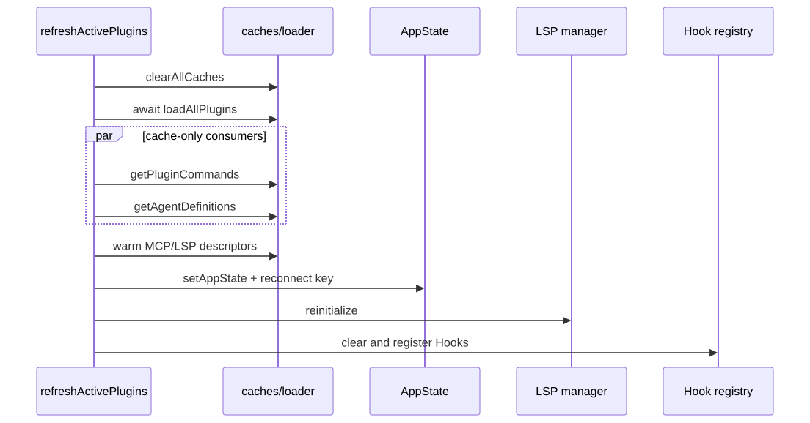

`setAppState()` 对它覆盖的 React 状态可以是一次交换，但整个刷新还有前后的外部 registry 和 manager。Hook 加载失败不会回滚已经完成的 AppState 交换；LSP 重建也不与 Hook 注册共享一个 commit record。因此教材应该称它为“跨组件完整刷新编排”，不能称“所有扩展组件的原子事务”。

为什么不强求一个全局事务？因为磁盘、网络连接、React state、Hook registry 与语言服务器没有天然共同的事务管理器。真正的全局两阶段提交会显著增加实现复杂度，还不一定能回滚外部进程。更实际的企业设计是：

- 先在 staging 构建完整 candidate；
- 对纯内存 registry 做 revisioned atomic swap；
- 对外部连接使用 health check、generation 和补偿；
- trace 中记录哪个 generation 在哪个组件生效；
- 失败时明确“部分激活”，并允许重试或回滚到旧 generation。

## reload 与正在执行的请求：快照和 lease 是两个问题

假设请求 R1 已经拿到 Plugin v1 的 command snapshot，管理员此时升级到 v2。最危险的两个极端是：

1. 原地修改 R1 的数组，导致同一次运行前半段使用 v1、后半段突然使用 v2；
2. 卸载时强杀所有 v1 handler，导致已经承诺的 tool result 永远不配对。

不可变 snapshot 解决“成员视图不漂移”：R1 继续知道自己当时看见哪些组件，新请求 R2 看 v2。execution lease 解决“旧代码能执行到何时”：在卸载前已获得 lease 的调用可以合作式结束；卸载后不能再从旧 snapshot 新开调用；lease 释放后旧 runtime 才能安全回收。

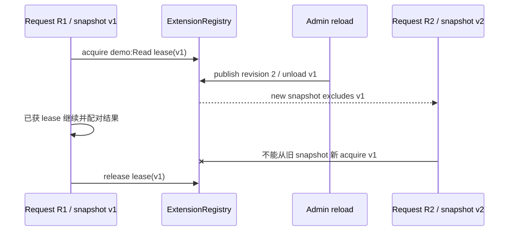

这比“旧 snapshot 永远可执行”更安全，也比“reload 立即 cancel 所有旧调用”更容易维持协议完整性。若发现高危漏洞，系统可以另设 emergency revoke，明确牺牲可用性并生成取消结果；不要把日常卸载和紧急吊销混为一个动作。

## H4-2：把隐式顺序升级成显式契约

本章把 `ExtensionRegistry` 合入 Mini Agent Harness。它不复制 Claude Code loader，而是迁移五个值得保留的设计问题，并对两个薄弱边界做增强。

输入是 `ExtensionBundle`：namespace、完整 source identity、trust/signature evidence 和 components。发布者带 `expectedRevision` 提交“完整替换集合”。Registry 先验证所有 bundle，再计算最终 qualified name；若两个不同 bundle 产生同名组件，返回结构化 conflict，revision 和旧 entries 都不改变。


TypeScript 关键接口位于 `mini-agent-harness/typescript/agent/extensionRegistry.ts`：

```ts
type ExtensionSourceIdentity = Readonly<{
  marketplace: string
  locator: string
  plugin: string
  version: string
}>

type ExtensionPublication =
  | Readonly<{ ok: true; snapshot: ExtensionSnapshot }>
  | Readonly<{ ok: false; revision: number; conflicts: readonly ExtensionConflict[] }>
```

这是 discriminated union：先检查 `ok`，TypeScript 才允许读取对应分支字段。Java 可以用 sealed interface `Published | Conflict`，Python 实现用冻结 dataclass 加显式 `ok`。它比抛出一个无结构字符串更适合控制面，因为冲突是可预期业务结果，不是程序崩溃。

Registry 还暴露 `toCapabilityDefinitions()`，把已经批准的 snapshot 适配进既有 `CapabilityCatalog`。这样保留职责分离：ExtensionRegistry 决定“哪个来源版本可以成为活动扩展”；CapabilityCatalog 决定“一次模型请求看见哪些能力”。

### 为什么发布必须是全量替换

如果 `publish()` 只追加 components，禁用和卸载很难表达，旧条目会成为幽灵能力。全量替换使 candidate 的成员资格明确，也让失败保持上一 revision。代价是调用方需要构造完整 candidate；规模变大后可在内部使用 persistent map 或 diff 优化，但对外契约仍应表达“提交后的完整世界”。

### trace 为什么不记录 manifest 和 signature

H4-2 的 trace 只有 action、revision、bundleCount、conflictCount。它足以回答发布是否成功、何时 acquire/release，却不把 signature、描述正文或 secret 带入普通日志。详细取证可放在受限审计存储，以 source key/digest 关联。可观测性不是“把所有输入 JSON.stringify”。

## 现在亲手推翻四个错误实现

先运行：

```powershell
cd mini-agent-harness
node typescript/agent/extensionRegistry.test.ts
cd python
python -m unittest -v test_extension_registry.py
```

当前双语言各有八个行为测试。实验不是为了看绿色，而是逐个回答契约问题。

### 实验一：把冲突恢复成 first-wins

临时将 `findConflicts()` 后的拒绝分支删除，只保留排序后第一个条目。输入两个 marketplace、相同 `demo:Read`。观察：发布会成功，但用户无法从结果知道另一个来源被遮蔽。反证条件是结果仍能列出两个 owner 并保持旧 revision；删除冲突分支后不会成立。

修复时不要简单改成 last-wins。应恢复结构化 `ExtensionConflict`，让管理员显式重命名、禁用或选择来源。

### 实验二：用 namespace 当 source key

临时令 `sourceKey()` 只返回 namespace。让同 namespace 的 v1 和 v2 先后发布，保留旧 snapshot。你将无法准确判断旧 lease 对应哪个 marketplace、locator 与 version，也无法区分正常升级和来源劫持。修复是恢复完整 source identity；生产版还应加 immutable digest。

### 实验三：卸载后允许从旧 snapshot acquire

删除 `activeBundleKeys` 检查。旧 snapshot 在卸载后仍能无限启动新工作，磁盘版本和运行时资源无法回收。恢复检查后，已有 lease 继续有效，新 acquire 失败。这正是 membership snapshot 与 execution lease 的分工。

### 实验四：把 signature 写入普通 trace

在 trace 中加入整个 bundle，再运行 metadata-only 测试。它应失败，因为 `secret-signature` 出现在序列化结果。生产环境同理：API key、证书、Hook body 与 Skill body 不应为了“方便排障”进入普通 telemetry。


完成实验后，你应能不看正文画出两张图：文件读取与正文投影的时序；reload 时 snapshot 与 lease 的时序。若只能记住文件名，说明还没有掌握机制。

## 迁移到 Spring、RAG 与 LangGraph

在 Spring 系统中，可以把扩展控制面拆成四个端口：`ExtensionSourceRepository` 管意图，`ArtifactResolver` 管物化，`ExtensionRegistry` 管 revisioned membership，`ExecutionLeaseManager` 管 in-flight。Bean 注册本身不是供应链校验；动态 classloader 也不应直接暴露给请求线程。

一次发布流程可以是：控制面接收 marketplace/source identity，策略服务检查 allowlist，构建服务下载并验证 digest/signature，隔离进程解析 adapter，registry 以 optimistic revision 提交。请求侧只拿 immutable snapshot 和 capability handles。若是多实例部署，revision 需要进入配置流或数据库，实例上报 applied generation；不要宣称所有节点同时生效。

RAG 系统同样适用。Retriever、reranker、embedding provider、文档解析器都是扩展。若只按 `name=search` 注册，A/B 版本、租户来源和索引契约会混淆。应把 source/version/digest 与 model-visible alias 分开，并把索引 schema compatibility 放入 candidate validation。

LangGraph 的 node registry 能表达图节点，但不会自动替你解决 marketplace 信任、签名、跨请求快照与卸载 lease。框架编排和扩展控制面是不同层：前者决定边怎样走，后者决定哪些实现被允许成为节点。


企业面试官继续追问时，重点往往不是“你会不会写 Plugin”，而是你能否把动态扩展当作生产控制面。

## 面试中怎样讲到源码、权衡和系统设计

### 1. Skill 是不是调用时才读取？为什么要延迟？

先给结论：当前快照不是调用时才读文件，而是发现时读完整 `SKILL.md`，调用时才把正文展开进消息。决定性位置在 `loadSkillsDir.ts` 的文件读取、`createSkillCommand()` 和 `getPromptForCommand()`。这样模型平时只看 name、description 等索引，避免每轮塞入所有正文，同时调用不必再次依赖磁盘。工程上要注意，闭包保存的是发现时版本，文件变化需要刷新；延迟投影也不是延迟 I/O。迁移到自己的 Harness，我会把 Artifact loading 和 Request projection 分开，并给 catalog revision，让请求能说明自己使用了哪一版能力。

### 2. namespace 是否已经解决扩展重名？

先给结论：namespace 只能降低冲突概率，不能证明全局唯一。Claude Code Plugin command/skill 的名字带 plugin name 和目录 namespace，但 plugin name 不是完整的 `plugin@marketplace` 身份，总装配最终仍可能出现同名，`findCommand()` 又是 first-match。生产系统里我会把完整 source identity 作为控制面主键，把 namespace:name 只作为模型别名；candidate 发布时做显式冲突检测，冲突就拒绝整次 revision，而不是静默遮蔽。这样排障时能回答 winner 和 loser 分别从哪里来。

### 3. 为什么 manifest 校验通过仍不能说 Plugin 可信？

先给结论：schema validity、source policy、path safety 和 publisher authenticity 是四个不同问题。manifest schema 只能保证字段形状，base-path check 防目录逃逸，marketplace allow/block 决定来源是否允许；它们都不等于内容得到可信发布者签名。当前快照的 version/ref/SHA 主要用于物化和 cache identity，没有通用签名验证。企业版我会叠加 immutable digest、签名身份、透明日志和最小权限 sandbox，并保留运行时 Permission，因为供应链信任也不能替代单次操作授权。

### 4. Plugin reload 为什么很难做成一个原子事务？

先给结论：因为它跨越内存 AppState、Hook registry、MCP 连接、LSP 进程和磁盘缓存，没有天然共同事务管理器。当前 `refreshActivePlugins()` 是有顺序的完整编排：先 load/warm，再 AppState swap，之后 LSP 重建和 Hook 替换；Hook 失败不会回滚前面的 state。我的方案会在 staging 构造 candidate，对纯内存 registry 做 revisioned atomic swap，对外部连接使用 generation、health check 和补偿，并显式记录部分激活，而不是用“原子”掩盖失败窗口。

### 5. 卸载 Plugin 时，正在运行的工具要不要立刻杀掉？

先给结论：日常卸载不应默认粗暴强杀，也不能允许旧版本无限开新调用。请求拿 immutable snapshot 保持本轮成员视图，执行前再 acquire version lease；卸载后新 snapshot 不含旧组件，旧 snapshot 也不能再新 acquire，但已获 lease 的调用合作式完成并产生配对结果，释放后再回收旧 runtime。若是紧急安全吊销，可以有独立 emergency revoke，接受取消与可用性代价。这样把配置变更、协议完整性和安全事件分开治理。

### 6. 怎样防止 Plugin secret 进入模型和日志？

先给结论：把 prompt plane 和 execution plane 分开。当前快照在 Plugin Skill/Agent 内容替换 sensitive userConfig 时使用描述性 placeholder，这个边界不能盲目扩展到所有连接组件。企业 Harness 中，模型只拿 capability handle 或 secret reference，受信 adapter 在执行最后阶段从 vault 解析，普通 trace 只记录 key ID、source generation 和成功/失败类别；正文、签名、token 不进 telemetry。权限、脱敏和 retention 仍需分别配置。

### 7. 设计一个支持灰度和回滚的扩展注册中心。

先给结论：核心是不可变 artifact、revisioned registry、请求快照和版本 lease。控制面先验证 source policy、digest、signature、schema 与 compatibility，生成 candidate；用 expectedRevision 原子发布 membership。实例订阅 generation 并上报 applied 状态，请求按租户或流量策略选 snapshot，执行取得 lease。回滚只是发布旧 artifact 的新 revision，不改历史对象。指标要看加载失败率、generation lag、冲突、调用错误和 lease drain 时间。Claude Code 的多阶段刷新说明外部消费者很难一个事务完成，所以生产版必须观测部分生效。

### 8. 这套机制和普通依赖注入、Java SPI 有什么区别？

先给结论：依赖注入和 SPI 主要解决进程启动或类路径上的实现选择，动态 Agent 扩展还要解决模型可见投影、不可信内容、单次 Permission、来源供应链、热刷新与 in-flight 一致性。Claude Code 的 Skill 正文会进入模型，Hook 会改变决策，MCP/LSP 还跨进程，所以风险面更宽。可以用 Spring Bean 或 SPI 实现 adapter，但外层仍需要 source identity、policy、snapshot、lease 和 metadata-only audit；否则只是把动态代码注册包装成了一个漂亮工厂。

## 离开本章前，做一次完整复述

拿一张白纸，从 `.claude/skills/review-java/SKILL.md` 或一个 marketplace Plugin 开始，不看答案讲清：何时读文件；何时只投影 metadata；本地与 MCP Skill 的 shell 边界；不同来源怎样组合；realpath 去重与 name collision 有何不同；source policy、schema、path、cache、signature 各保证什么；刷新为何不是全局事务；旧请求为何需要 snapshot 与 lease。

最后把 H4-2 的行为写成六句契约：

1. source identity 与 model alias 分离；
2. candidate 先完整验证，冲突显式返回；
3. 失败不改变旧 revision；
4. 新 snapshot 反映卸载，旧 snapshot 成员不被原地修改；
5. 卸载后禁止旧 snapshot 新 acquire，已获 lease 可以完成；
6. trace 只记录稳定元数据。

做到这里，你掌握的就不再是“Claude Code 支持 Skill 和 Plugin”，而是动态能力从内容、代码和配置变成可治理运行时契约的全过程。下一章进入 MCP：扩展一旦不在本进程里，能力发现、协议握手、连接生命周期、取消和安全边界会怎样继续变化。

## 源码与实验定位

- Skill 发现、全文读取、闭包展开、来源组合与 realpath 去重：`claude-code-CLI/src/skills/loadSkillsDir.ts`，重点看 `createSkillCommand()`、`loadSkillsFromSkillsDir()` 与总装配段。
- 模型可见 Skill 索引与调用权限：`claude-code-CLI/src/tools/SkillTool/SkillTool.ts` 及 prompt。
- 总命令组合与 first-match：`claude-code-CLI/src/commands.ts` 的 `loadAllCommands()`、`findCommand()`。
- Plugin command/skill 命名和 sensitive content substitution：`claude-code-CLI/src/utils/plugins/loadPluginCommands.ts`、`loadPluginAgents.ts`。
- manifest、组件与路径边界：`schemas.ts`、`validatePlugin.ts`、`pluginInstallationHelpers.ts`。
- marketplace policy、下载和版本物化：`marketplaceHelpers.ts`、`marketplaceManager.ts`、`pluginLoader.ts`、`pluginVersioning.ts`。
- 多组件刷新：`claude-code-CLI/src/utils/plugins/refresh.ts`、`loadPluginHooks.ts`、`cacheUtils.ts`。
- H4-2 TypeScript/Python：`mini-agent-harness/typescript/agent/extensionRegistry.ts` 与 `mini-agent-harness/python/extension_registry.py`。

证据标签：上述 Claude Code 内部机制均为当前本地快照事实；H4-2 的显式冲突、完整 source identity、signature policy port、不可变 registry snapshot 和 execution lease 为 clean-room 设计迁移与运行验证，不是对 Claude Code 内部实现的反向声明。
