# M23 一份工作怎样穿过 Task、Subagent 与 Team：所有权、租约、Mailbox 和 Cron

> 主体学习时间：约 4--7 小时。双 worker 竞争、取消/崩溃注入、TypeScript/Python H5/H6 实验和生产持久化挑战另计。

M22 结束时，我们已经能把一个远端 MCP Tool 安全地放进能力快照。但 Agent 系统还有一种更长的时间尺度：模型这一轮已经返回，工作却没有结束。它可能在后台运行，可能等另一个 Agent 先完成依赖，可能明天九点才触发，也可能在负责人崩溃后需要重新领取。

初学者最容易用一个 `Task` 类装下所有东西：

```ts
type Task = {
  status: 'pending' | 'running' | 'done'
  owner?: string
}
```

这个模型看起来统一，实际把五个不同问题混在一起：工作记录是否完成、当前有没有进程执行、谁有修改权、消息是否交付、定时触发是否已经提交。一个 `status` 不能同时回答这些问题。

本章跟踪一份“核验 MCP 断线恢复”的工作。team lead 创建 work item，researcher 领取它并启动 Subagent；任务转到后台后，lead 继续处理主对话；researcher 通过 mailbox 发送发现，退出前完成 shutdown handshake；最后 Cron 安排一次复查。如果进程在任意一步崩溃，我们都要知道哪个 owner 能恢复什么。

先看整条路：


贯穿全章的判断方法只有一句：

> 先问“谁拥有这份状态，谁能提交下一次转换”，再谈并发、取消和恢复；同名对象如果 owner 不同，就不该共享一个状态机。

## 第一处拆分：Claude Code 里至少有三种 Task

当前快照把三种概念放在不同源码边界。它们会互相引用，但没有共同的业务状态机。

| 概念 | 主要 owner | 状态/字段 | 持久化 | 回答的问题 |
| --- | --- | --- | --- | --- |
| Runtime Task | AppState + 具体 Task 实现 | pending/running/completed/failed/killed、output、timing | 运行态为主，output 可落盘 | 现在谁在执行，怎样停止 |
| Work-item Task | task-list JSON + 文件锁协议 | pending/in_progress/completed、owner、blocks/blockedBy | 独立 JSON 文件 | 这份协作责任归谁，依赖完成了吗 |
| Cron Task | scheduler + schedule record | cron、createdAt、lastFiredAt、recurring | file-backed 或 session-only | 何时产生下一次工作 |


`src/Task.ts` 定义 Runtime Task 的公共壳：`TaskStateBase` 有 id、type、status、description、start/end time、output file/offset 和 notified。`Task` 接口真正统一的只有 `kill(taskId, setAppState)`。local shell、local agent、in-process teammate、workflow 等具体实现各自拥有执行资源。

`src/utils/tasks.ts` 的 Work-item 则没有 AbortController 和 output file。它是一份共享责任记录，包含 subject、description、owner、blocks、blockedBy 和 metadata。状态里的 `in_progress` 不是 Runtime Task 的 `running`：前者表示责任已开始，后者表示当前内存里确有执行。

这带来一个很实用的故障判断：

- Work-item 是 `in_progress`，但找不到 Runtime Task，可能是 owner 已崩溃或执行尚未启动；
- Runtime Task 是 `running`，但没有 Work-item，可能是临时探索、主会话后台化或未纳入协作计划；
- Cron 已触发，却还没有 Work-item/Runtime execution，说明 trigger 到工作创建之间没有提交成功。


Java 中不要让一个 JPA `TaskEntity` 同时保存线程 Future、业务工单和 Quartz trigger。比较清楚的边界是 `WorkItemRepository`、`ExecutionSupervisor`、`TriggerStore`。Python 也不要把 `asyncio.Task` 与数据库里的 task row 当成同一个对象。

## Work-item identity 为什么不是当前 session 随便起的名字

协作记录必须先知道自己属于哪个 task list。`getTaskListId()` 的优先级是：显式 `CLAUDE_CODE_TASK_LIST_ID`、in-process teammate 的 leader team、process teammate team、leader 当前 team，最后才是 session id。


这个选择让同一 Team 的 leader、in-process teammate 和 pane/process teammate 看到同一目录。TeamCreate 还会 reset 对应 task list，并用 high-water mark 防止 reset/delete 后 ID 回退重用。ID 重用看似只是 UI 问题，实际会让旧日志、旧消息和新任务错误关联。

## claim 真正保护了什么

我们先看普通 `claimTask()`。它不是先读再随手写 owner，而是在目标 task file 的锁内重读和提交：

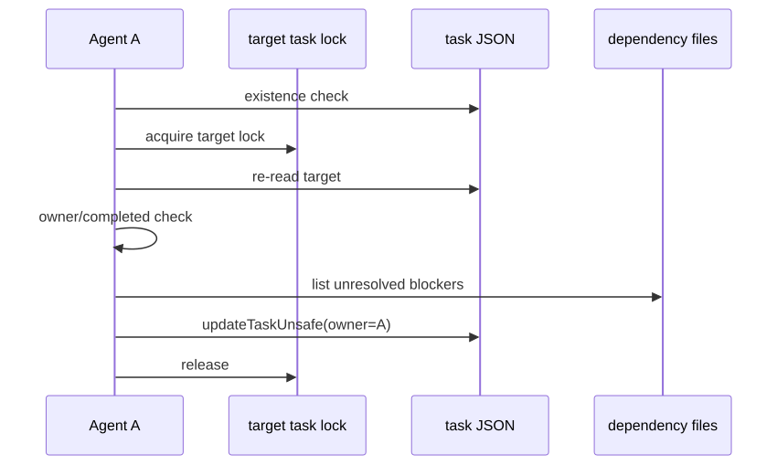

最重要的语义不是“用了锁”，而是 target owner 的 check-and-write 在同一 critical section。两个普通 claimant 都遵守这把锁时，不会同时把自己当成第一位 owner。

但不要把它扩大成依赖图事务。target lock 没有锁住每个 blocker file。它在锁内读取 blocker 列表，其他 Agent 仍可能同时完成或修改 blocker。这里得到的是“提交前检查到的依赖状态”，不是数据库 serializable snapshot。

启用 `checkAgentBusy` 后，代码换成 task-list-level lock，读取全列表，同时检查：

1. target 是否存在、完成或已被别人领取；
2. target 的 unresolved blocker；
3. claimant 是否已经拥有其他 unresolved task；
4. 通过后才写 owner。


TypeScript 的 `await` 会让同一个函数在 I/O 处让出事件循环，因此“先 list，再 update”若没有共同锁，会留下 TOCTOU：两个调用都在旧快照里看到 idle，再分别领取。task-list lock 是把检查和提交纳入同一协议。Java 对应数据库 transaction + `SELECT ... FOR UPDATE` 或 compare-and-set；Python 可以用同一 DB transaction，不能靠 `asyncio.Lock` 解决多进程竞争。

当前文件锁仍不是跨机器 lease 或数据库 serializable transaction。只有遵守相同锁纪律的路径才被序列化；网络文件系统、进程崩溃和绕过路径还要另行治理。教材要讲清保证范围，而不是看到 `lock` 就写“线程安全”。

## owner 字符串为什么还不够

当前 Work-item 只有 `owner?: string`，没有 `expiresAt`、heartbeat 或 lease token。正常 teammate 终止或批准 shutdown 后，`unassignTeammateTasks()` 会把它拥有的 unresolved tasks 清 owner、重置 pending。但如果进程直接消失且没有清理路径，owner 可能长期残留。

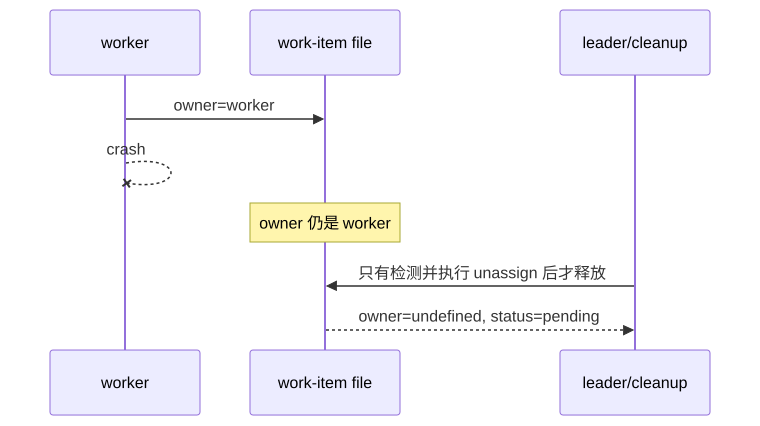

这正是 H5 加 lease 的理由。租约不是给 owner 多加一个时间字段，而是一个有 fencing 含义的权利证明：

```ts
type ClaimLease = {
  ownerId: string
  token: string
  generation: number
  heartbeatAt: number
  expiresAt: number
}
```

worker 完成、释放或 heartbeat 都必须提交 token。lease 过期并被 worker B 重新领取后，worker A 的旧 token 即使迟到，也不能 complete 新世代任务。

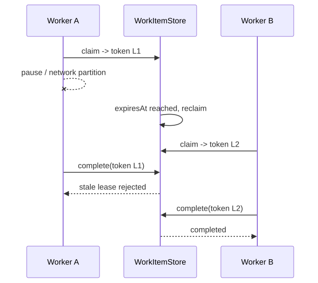

Mini Agent Harness 的 `WorkItemStore` 用 revision、TTL、heartbeat、token 和 reclaim 做出这个 clean-room 契约。当前实现是单进程 domain store，原子性来自一次同步 mutation；生产版必须把同一条件写进数据库 CAS，例如 `UPDATE ... WHERE revision=? AND lease_token=?`。只把 Map 换成数据库、却仍先查后写，不会自动获得 fencing。

## Work-item 领取后，谁拥有真正运行的资源

领取只是责任变化。执行开始后，Runtime Task 才拥有 AbortController、output 和 terminal transition。`registerAsyncAgent()` 在 AppState 注册 local_agent task；`completeAgentTask`、`failAgentTask`、`killAsyncAgent` 负责状态收敛和通知。


注意虚线：Runtime completed 不应自动等于 Work-item completed。Subagent 可能只完成一次尝试，结果还需验证；也可能运行成功但 Work-item commit 失败。企业系统要显式决定“execution outcome 怎样提交业务责任”，而不是在 Promise resolve 时顺便把工单改 done。

Claude Code 有一处很优秀的顺序：后台 Agent 完成时，先把 Runtime Task transition 到 terminal，解除 `TaskOutput(block=true)` 等待者，再做可能挂住的 handoff classification、worktree cleanup 和 notification。否则一个慢 git cleanup 会让观察者误以为执行仍在运行。

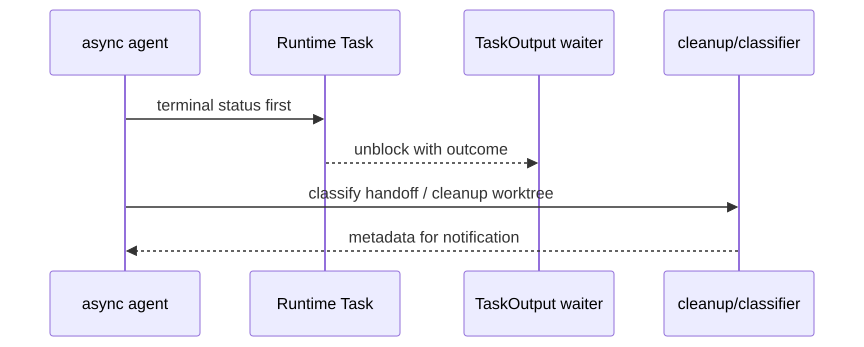

这可以迁移成通用原则：决定等待语义的状态先提交；附加清理、摘要和通知不能占有核心 completion gate。

## 同步 Subagent 与后台 Subagent 的取消所有权不同

`runAgent.ts` 根据 `isAsync` 选择 controller：同步 Agent 默认共享 parent controller；异步 Agent 默认创建独立 controller。`AgentTool.tsx` 的 async-from-start 路径还留下决定性注释：不要链接 parent abort，后台 Agent 应在用户 ESC 取消主线程后继续，之后由显式 kill 管理。


这不是“后台任务更高级”，而是 owner 转移。同步 child 的 owner 是当前 parent turn；后台 child 的 owner 是 Runtime Task supervisor。若只把 Promise 丢到后台、又没有可寻址 task id 和 stop path，就不是异步架构，只是资源泄漏。

H5 把 `mode` 与 `cancellation` 分成两个字段：foreground/background 决定交互表面，linked/detached 决定取消所有权。默认 linked；只有明确交给 supervisor 的工作才 detached。Claude Code 当前 async Subagent 是 unlinked 的快照事实；H5 的显式二轴模型是 clean-room 迁移。

## foreground 到 background 不是同一个 iterator 悄悄继续

同步 Agent 从一开始就注册 foreground Runtime Task，使用户可以在长运行中把它后台化。主循环把 `agentIterator.next()` 与 `backgroundSignal` 做 `Promise.race`。收到 background signal 后，代码确认 task 已标 background，关闭 foreground iterator 让其 finally 清 MCP/hooks/cache，再使用同一 task controller 以 async mode 继续。

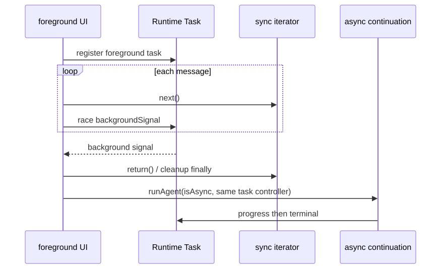

为什么不直接让旧 iterator 在一个 detached closure 里继续？因为它之前按 sync context 构造，controller、permission prompt、cleanup owner 与 UI 都可能不同。显式结束旧 scope 再启动新 scope，使资源所有权可解释。代价是续跑需要正确重建消息和 context；M24 会继续研究 transcript 恢复事务。

`Promise.race` 只选择先观察哪个 outcome，不会自动取消输掉的 `next()`。源码显式调用 iterator.return()，这才触发 generator finally。第一次遇到这种代码时要记住：race 是控制流选择，cleanup 仍由 owner 明确执行。

## 运行中的 Agent 怎样收到新消息

SendMessage 给 running local agent 发送 plain text 时，不会修改正在飞行的模型 request。它把字符串 append 到 Runtime Task 的 `pendingMessages`；attachments 路径在下一 tool round `drainPendingMessages()`，把队列清空并注入新消息。

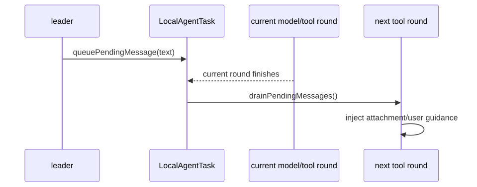

因此“消息已发送”只表示进入本地队列，不表示当前 API 请求已看见，更不表示 Agent 已执行。这个边界与 M22 的 request snapshot 完全一致：正在运行的请求不可被全局状态原地改写。

如果 local agent 已 stopped，SendMessage 可以调用 `resumeAgentBackground()`。resume 读取 sidechain transcript 和 metadata，过滤 unresolved tool use/空 assistant，重建 content replacement state；原 worktree 存在就恢复并刷新 mtime，不存在则回退 parent cwd。对 resumed fork，它不会再次附加已经写进 transcript 的 parent context，否则会产生 duplicate tool_use ID。


这仍不等于完整 crash recovery。sidechain transcript 写入是 fire-and-forget 的部分路径，外部副作用与 transcript commit 之间可能有缝隙；M24 会把恢复链单独闭合。

## fork 为什么不是“再开一个空白 Agent”

fork path 在 feature 条件下继承 parent conversation、已经渲染的 system prompt、精确 tool pool 和 thinking configuration，目的是共享完整上下文与 prompt cache prefix。它为当前 assistant message 的每个 tool_use 构造 placeholder tool_result，再追加每个 child 不同的 directive。


fork child 仍保留 Agent Tool 才能让 tool definition 与 parent cache 对齐，因此必须在调用时阻止 recursive fork。源码同时检查 query source 和 boilerplate tag；只靠消息 tag 会被 autocompact 重写历史后绕过。

这里的设计思想不是鼓励无限复制上下文，而是：需要 cache-identical prefix 时，能力和 system bytes 也要稳定；需要防递归时，guard 应放在不随消息改写而消失的运行上下文。

## Team 为什么不是 `Promise.all(subagents)`

现在 researcher 需要把检索和恢复实验分给另一个长期成员。普通 Subagent 只有一次 invocation identity；TeamCreate 还建立：team config、deterministic leader identity、member directory、共享 task list、team-scoped inbox、permission/mode 定位和 session cleanup。


TeamFile 的 member 不只存 display name，还包括 agentId、agentType、model、cwd/worktree、session/backend/pane、subscriptions、isActive 和 permission mode 等定位。TeamCreate 用 deterministic leader ID，同时保留真实 leader session ID 做发现；leader 自己没有被伪装成普通 teammate。

为什么 identity 要分层？

- display name 用于人类沟通和 team-scoped inbox；
- agentId 用于稳定成员身份和 work owner；
- session/backend/cwd 用于找到实际运行位置；
- task-list id 决定共享责任目录。

把这些压成一个字符串，会在重连、同名、跨 session 和审计时失去语义。H5 的 `TeamDirectory` 同样要求 teamId + agentId，displayName 只在 team 内唯一。

## 两个 Mailbox，两个完全不同的持久化保证

Claude Code 快照里至少有 memory Mailbox 和 team file inbox。

`src/utils/mailbox.ts` 的 `Mailbox` 是进程内 consuming queue。`send()` 优先找第一个 predicate matching waiter，否则 push；`poll/receive` 取出后从 queue 删除。Message 虽有 id，但 Mailbox 没有按 id 去重，也没有 durable ack。


`src/utils/teammateMailbox.ts` 的 team inbox 是 JSON 数组。writer 先确保文件存在，再锁 inbox、重读最新数组、append `read:false`，然后重写文件。reader 可以读取 unread；`markMessageAsReadByIndex` 或 mark-all 才修改 read flag。

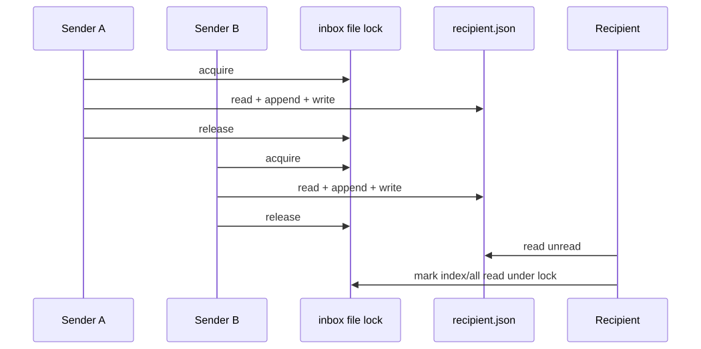

file lock 防止两个 writer 都基于旧数组重写而丢消息，但它没有自动给出消息系统语义：

- `TeammateMessage` 没有 stable message id；
- 数组顺序是获得锁后的 append 顺序，不是跨 sender 因果顺序；
- `read` 表示展示/消费标记，不证明业务 side effect 成功；
- 同一内容可以重复 append，没有 dedupe；
- read 后、业务提交前崩溃可能丢工作；业务提交后、mark read 前崩溃可能重复执行。


H5 的 `AcknowledgedMailbox` 选择 at-least-once：messageId 首次 send 分配 recipient sequence；同 identity 重发返回 duplicate，不再次入队；未 ack 消息每次 receive 都 redeliver 并增加 deliveryCount；只有 recipient 显式 ack 后才消失。messageId collision 若 identity 不同就 fail closed。

这仍不等于 exactly-once side effect。正确组合是 mailbox at-least-once + consumer 以 messageId 做 durable idempotency + 成功后 ack。普通 trace 只记录 message id、kind、sequence、delivery count，不记录 payload。

## shutdown 不是 leader 直接 abort teammate

当 team lead 想让 researcher 退出，SendMessage 生成 requestId，把 structured `shutdown_request` 写入目标 inbox。teammate 可以批准或拒绝。批准时先写 `shutdown_approved` 到 leader inbox，然后 in-process teammate abort 自己的 controller；process/pane backend 调 graceful shutdown。拒绝则写 `shutdown_rejected` 并继续工作。

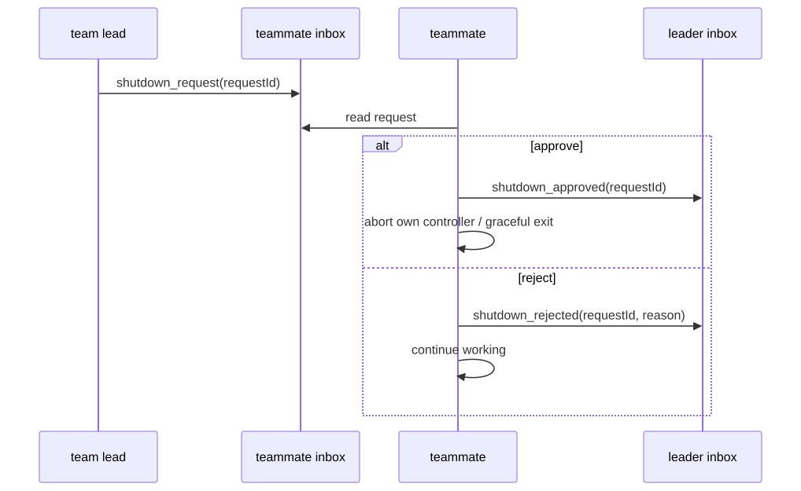

这条协议保留了 member autonomy，也让 worker 有机会先提交结果、释放 Work-item 和清理资源。代价是 request 可能排队、重复或永远无响应；当前快照没有完整 timeout/dedupe state machine，不能把 requestId 扩大成可靠 workflow。

H5 的 `ShutdownCoordinator` 把 pending -> approved/rejected -> completed 做成显式状态，并要求只有 target 响应。approved 先把 member 置 stopping，实际 execution owner 完成退出后再置 stopped。生产系统还需 deadline、force terminate policy 和重复 response 幂等。

plain text 的路由更宽：可 direct、broadcast、送到 running local agent queue，或恢复 stopped agent。structured message 不能 broadcast，也不能像 plain text 一样跨 session/bridge。cross-machine bridge 会把文本变成另一端用户 prompt，所以 Permission 使用 bypass-immune safety check 要求显式同意，并在等待用户后再次检查连接。

## Cron 只负责产生 trigger，不负责替你完成工作

研究完成后，lead 安排明天复查 MCP server schema。file-backed Cron 保存 `id/cron/prompt/createdAt/lastFiredAt/recurring` 等字段；session-only task 只存在 bootstrap state，进程退出即消失。

file-backed scheduler 需要一个 owner。`.claude/scheduled_tasks.lock` 保存 stable session/daemon identity、PID 和 acquiredAt。创建使用 `wx` 的 exclusive create；若 live PID 持有，当前 session 被动等待并周期 probe；若 PID dead 或 lock corrupt，则 unlink 后竞争恢复，只有一个 exclusive create 胜出。


PID lock 解决的是“同一项目多个 Claude session 谁负责读共享 schedule file”，不是业务 lease。PID reuse、容器、跨机器共享文件系统都需要更强 owner identity；本章不把它宣传成分布式 scheduler。

## missed run、jitter 与 nextFireAt

initial load 会找 missed one-shot：它们不直接假装按时执行，而是 surfaced 给用户，并异步从文件移除。recurring missed task 不走同一提示；tick 会 fire 一次，再从当前时间重排，避免把停机期间所有间隔快速补跑。


recurring next time 以 `lastFiredAt ?? createdAt` 为 anchor，fire 后用 now 计算新 next，并异步持久化 `lastFiredAt=now`。deterministic jitter 由 task id 和 schedule window 计算，使大量相同 cron 不全落在整点，避免 inference fleet 惊群。

这里可迁移的不是某个 jitter 公式，而是：随机化必须稳定、可重建且不能让 one-shot 在创建前触发；下一次时间的 anchor 必须能跨进程恢复，否则 daemon 每次重启都可能把旧 createdAt 当成新到期。

## `inFlight` 和 scheduler lock 为什么仍不是 exactly-once

`cronScheduler.ts` 在同一进程用 `inFlight` Set 挡住 async remove/stamp 与 chokidar reload 的窗口。但执行顺序是先 `onFire/onFireTask`，后 one-shot remove 或 recurring `lastFiredAt` persist：

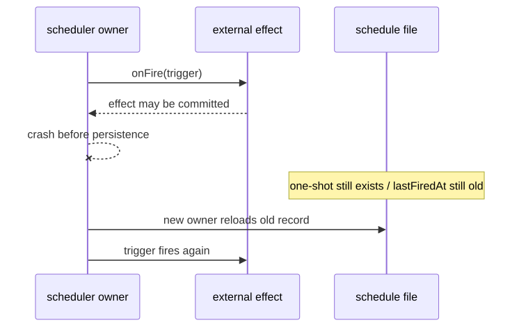

`inFlight` 在 crash 后消失；PID lock 只会选出新 owner，不知道旧 owner 的副作用是否已经发生。甚至 remove/stamp 自身失败后，inFlight finally 释放，后续 tick 也可能再次看到旧 record。因此准确说法是“降低常见重复窗口”，不是 at-most-once 或 exactly-once 保证。

H6 foundation 的 `DurableScheduler` 把每次到期转换成 stable trigger id：`scheduleId@scheduledFor`。poll 先把 trigger 放进 pending state；未 commit 前，恢复后 redeliver 同一个 trigger id；commit 后 one-shot 删除，recurring 从 completedAt + interval 继续。


这仍是 at-least-once trigger。下游用 triggerId 建 idempotency ledger，才能避免重复创建外部副作用。若 effect 已发生但 ledger/commit 未完成，系统只能 query outcome、重试同 key 或进入 indeterminate/人工处理。

## H5/H6 把哪些设计合进了 Harness

新增模块是 `typescript/agent/workCoordinator.ts` 与 Python mirror。它没有手写 tmux、分布式队列或生产 Cron，而是把最有迁移价值的 domain contract 做成可测试代码：


新增契约：

- WorkItem 与 RuntimeExecution 是两个不可互换的 type；
- claim 在一次 store mutation 中检查 blocker、revision 和 active lease；
- heartbeat 延长 TTL，expired lease 回 pending，旧 token 被 fencing；
- runtime execution 单独持有 signal，mode 与 cancellation ownership 正交；
- TeamDirectory 固定 team/member identity，ShutdownCoordinator 用 requestId 推进状态；
- Mailbox 同 ID 同 identity 重发去重，未 ack 明确 redeliver；
- scheduler state 可导出/恢复，pending trigger ID 保持稳定；
- trace 只有 entity id、status、revision 和 count。

兼容影响：H4 的 Tool/Extension/MCP 契约不被 RuntimeExecutionRegistry 接管；现有 AgentRuntime 仍是 single-agent loop。H5/H6 目前是可组合 owner，还未把生产 process backend、TranscriptStore 或数据库 CAS 自动接入 main runtime。这是有意 defer，不是假装完整多 Agent 平台。

## 用十二个测试观察同一行为契约

运行：

```powershell
cd mini-agent-harness
node typescript/agent/workCoordinator.test.ts
cd python
python -m unittest -v test_work_coordinator.py
```

TypeScript 与 Python 各 12 个测试验证：

- WorkItem 没有 Runtime output/controller；
- blocker 未完成时 claim 被拒；
- active lease fencing competing owner；
- heartbeat、expiry、reclaim 与 stale token；
- expected revision 拒绝 stale claimant；
- linked child 随 parent cancel；
- detached child 需 supervisor 显式 cancel；
- Team identity 与 correlated shutdown；
- Mailbox dedupe、redelivery、ack、sequence 与 ID collision；
- scheduler 恢复同一个 missed trigger；
- recurring 从 completion 重排；
- trace 不含 payload。

### 破坏实验一：owner 没有 token

把 `complete(id, token)` 改成 `complete(id)`。让 A 的 lease 过期、B 重新 claim，再让 A 的迟到 completion 到达。若 Work-item 被改 completed，证明 owner string/TTL 不足以 fencing。恢复 token + generation 条件更新。

### 破坏实验二：background 自动等于 detached

删除 cancellation 字段，让所有 background child 不随 parent。构造一个仅对当前 request 有意义的 speculative child，parent 取消后观察它继续调用工具。修复不是禁止后台，而是调用时显式选择 linked；真正 detached 必须登记 supervisor owner 和 stop path。

### 破坏实验三：receive 自动删除消息

让 Mailbox `receive()` 立即 remove，然后在 side effect 前注入 crash，消息永久丢失。再改成 side effect 后 remove，在 remove 前注入 crash，副作用重复。恢复 redelivery-until-ack，并让业务以 messageId 去重。

### 破坏实验四：fire 后不保存 pending trigger

让 scheduler poll 直接调用 handler，再异步删除 schedule。effect 后、删除前 crash，恢复时会重新产生新调用。恢复先生成 stable pending trigger；即使 redeliver，idempotency key 不变。


## 迁移到 Spring、RAG 与 LangGraph

在 Spring 中，推荐把边界做成六个 port：

```text
WorkItemRepository
ExecutionSupervisor
TeamDirectory
MailboxRepository
ShutdownProtocol
TriggerRepository
```

PostgreSQL 的 WorkItem claim 可用 revision + lease token CAS；scheduler 用 `FOR UPDATE SKIP LOCKED` 或成熟队列领取 due trigger；outbox/inbox 表用 messageId 唯一索引，业务事务同时写 effect ledger 与 ack。Kubernetes Job/worker 只实现 RuntimeExecution，不直接拥有业务 WorkItem 真相。


RAG 任务常有“切分文档 -> embedding -> index publish”的依赖图。Work-item blocker 表达阶段依赖，Runtime execution 表达本次 worker attempt；不要让 embedding worker 的 Pod status 直接成为文档索引业务状态。owner crash 后 lease reclaim，旧 worker 的 index publish 还需 fencing/version check，防止旧向量覆盖新版本。

LangGraph 擅长把节点和 state transition 表达出来，但 graph state 不自动解决跨进程 lease、外部 Tool side effect、Mailbox delivery 或 Cron exactly-once。可以让 LangGraph 决定下一节点，把 WorkItemStore/Mailbox/Scheduler 留在 Harness control plane。框架编排与运行治理不是二选一。

生产观测至少包括：claim conflict、lease expiry/reclaim、stale fencing reject、running execution/abort latency、orphan execution、mail redelivery/ack lag/dedupe hit、shutdown pending age、trigger lag/missed/pending age、idempotency hit 和 indeterminate effect。不要把 work description、message payload、prompt 或 tool result复制进普通 trace。

## 资深面试官会怎样追问

### 1. 为什么 Runtime Task 和业务 Work-item 不能用同一张表？

先给结论：因为它们的 owner、生命周期和恢复依据不同。Claude Code 的 Runtime Task 在 AppState 里表示真实执行，状态有 running/failed/killed，还拥有 output 与取消；`utils/tasks.ts` 的 Work-item 是文件持久化协作记录，只有 pending/in_progress/completed、owner 和依赖。执行完成不一定代表业务验收完成，业务任务 in_progress 也不证明当前有进程。企业系统我会用 WorkItemRepository 保存责任，用 ExecutionSupervisor 管 attempt，通过显式 attemptId/commit 关联，避免 Pod 崩溃把业务状态一起抹掉。

### 2. `claimTask` 用了文件锁，能否说领取是完全原子的？

先给结论：只能说 target owner 的 check-and-write 在相同锁协议内原子，不能扩大成整个依赖图或分布式事务。普通 claim 锁目标文件，锁内重读 owner、completed 和 blockers；busy-aware path 用 task-list lock 收紧“claimant 是否已忙”的 TOCTOU。但 blocker 是其他文件，绕过锁纪律或网络文件系统都可能改变保证。生产版我会用数据库 transaction/CAS，把 revision、未完成 blocker 和 lease 条件放进同一提交，并明确隔离级别。

### 3. owner 和 lease 有什么本质区别？

先给结论：owner 只是归属标签，lease 是有期限、可续期并能 fencing 旧写者的权利证明。Claude Code 当前 Work-item owner 没有 expiry/heartbeat，成员正常退出时靠 unassign 清理；崩溃可能留下孤儿。我的 Harness claim 返回 token/generation，heartbeat 延期，过期后 B 可重领；A 的旧 token 不能 complete。分布式系统里最终写入也必须带 fencing 条件，否则只做 TTL 仍会被暂停后恢复的旧 worker 覆盖。

### 4. 用户按 ESC，Subagent 一定会停止吗？

先给结论：要看同步还是后台。Claude Code sync Subagent 共享 parent AbortController，所以 parent cancel 会传播；async-from-start 故意使用不相连 controller，主线程 ESC 后继续，由 TaskStop/显式 kill 管。foreground 转 background 也把 owner 交给 Runtime Task supervisor。设计自己的 Harness 时我会把 UI mode 与 cancellation ownership 分开，默认 linked；detached child 必须有 task id、supervisor、budget 和 stop path，不能只 `void promise`。

### 5. foreground Subagent 后台化为什么要结束旧 iterator？

先给结论：因为 iterator 持有按同步 scope 构造的 controller、MCP、Hook、Permission 和 cleanup owner，不能假设换个 closure 就完成所有权转移。Claude Code 用 `Promise.race` 等 background signal，确认 task 后调用 iterator.return() 触发 finally，再以 async context 和同一 task controller 续跑。这个过程说明 race 只选控制流，资源清理由 owner 显式执行。企业实现可用 structured concurrency scope 做 handoff，并测试 cleanup 超时。

### 6. Team 与批量 Subagent 的架构差异是什么？

先给结论：Team 多了长期身份和共享协调平面，不只是并发数量。Claude Code Team 有 config、leader/member identity、共享 task list、team-scoped inbox、backend/session/cwd 定位和 shutdown protocol；普通 Subagent 主要围绕一次 invocation 和 sidechain transcript。企业 Team 还需要成员租约、role/policy、mailbox 和 ownership transfer。若只是 `Promise.all`，child 完成后没有可恢复身份，也无法回答谁拥有未完成任务。

### 7. inbox 有 `read` 字段，为什么还不能叫可靠消息队列？

先给结论：`read` 是展示/消费标记，不是与业务事务绑定的 ack。Claude Code file inbox 在锁下 append，防 writer 丢更新，但 message 没有 stable id/dedupe；read 与 side effect 分开，崩溃会造成丢失或重复。生产方案采用 messageId 唯一键、at-least-once redelivery、consumer idempotency ledger 和成功后 ack；需要强一致业务时，把 effect 与 inbox ack 放同一数据库事务或 outbox pattern。

### 8. shutdown 为什么设计成 request/response，而不是 leader 直接 kill？

先给结论：优雅 shutdown 涉及结果提交、任务释放和资源清理，目标成员应有机会批准或拒绝。Claude Code leader 写带 requestId 的 shutdown_request；teammate 回 approved/rejected，批准后 in-process 自 abort 或 process graceful exit。它能表达拒绝和异步排队，但当前没有完整 timeout/dedupe workflow。企业系统会增加 deadline、stopping 状态、force-kill escalation，并在退出完成后再释放 lease。

### 9. Cron scheduler 有 PID lock 和 inFlight，为什么还会重复？

先给结论：它们只收窄 owner 竞争和同进程异步窗口，不能跨 fire/commit 崩溃边界。Claude Code 先 onFire，再异步 remove one-shot 或写 lastFiredAt；effect 后进程崩溃，schedule record 仍旧，新 owner 会再次 fire。inFlight 也是内存 Set。生产方案先持久化 stable trigger ID/pending，再以该 ID 调业务；恢复可以 redeliver，但下游 dedupe。对无法幂等的副作用返回 indeterminate并查询状态。

### 10. 怎样避免 lease 过期后两个 worker 同时写外部系统？

先给结论：lease 只阻止新的协调提交，不能撤销旧 worker 已经拿到的网络能力，所以要把 fencing token带到最终资源。数据库更新用 `WHERE generation >= current`，对象存储用 version/conditional write，Tool gateway 校验 active attempt；不支持 fencing 的第三方 API 则用 idempotency key和 outcome ledger。Claude Code 当前 owner 不是 lease；H5 是迁移方案，不能假装给第三方副作用自动加了 fencing。

### 11. 如何设计一个多 Agent 任务协调服务？

先给结论：我会把责任、执行、通信和触发拆成四个 owner。WorkItemStore 用 DAG + revisioned lease；ExecutionSupervisor 在隔离 worker 上跑 attempt并传播 linked/detached cancel；TeamDirectory 管稳定身份和 policy；Mailbox 用 durable messageId/ack；Scheduler 只生成 stable trigger。所有外部 Tool 调用携带 attemptId/idempotency key，Transcript 记录恢复链，telemetry只记 metadata。SLO 看 claim latency、reclaim、orphan、ack lag、trigger lag和indeterminate outcome，而不是只看 Agent 成功率。

### 12. LangGraph 已经有 state graph，为什么还需要 Harness 这些控制面？

先给结论：graph 决定逻辑上的下一节点，不自动拥有跨进程执行和外部副作用语义。节点重试时仍要 lease、attempt identity、Tool idempotency；多 worker 通信仍要 mailbox；定时恢复仍要 scheduler；取消还要 supervisor。可以把 LangGraph 作为 workflow planner，让 Harness 负责 runtime governance。Claude Code 的 Runtime Task、Work-item、Team inbox 和 Cron 分离，正好说明编排图与运行控制不是同一层。

## 离开本章前的完整检查

不看正文，画出：Work-item create -> claim -> Runtime execution -> foreground/background handoff -> Team transfer -> mailbox -> shutdown -> Work-item completion -> Cron trigger。然后在图上分别标出 owner、revision/token、cancel source 和持久化 commit。

你还应能独立解释：

- 为什么 Claude Code 的 Runtime Task、Work-item Task、Cron 不能共用状态机；
- ordinary claim 与 busy-aware claim 分别保护什么，锁的保证在哪里结束；
- owner string、lease、heartbeat、fencing token 的差别；
- sync/async Subagent 的 AbortController 为什么不同；
- pending message 为什么只能进入下一 request；
- Team 比多个 Subagent 多出哪些长期协作状态；
- memory queue、file inbox、H5 acknowledged mailbox 各自提供什么保证；
- shutdown request 为什么需要 correlation 与完成状态；
- scheduler lock/inFlight 为什么不能证明 exactly-once；
- H5/H6 哪些是快照事实，哪些是 clean-room 企业迁移。

下一章会接住这里所有“进程退出后怎么办”的缺口：sidechain/main Transcript 怎样追加和重建，resume/fork 如何恢复 message parent chain，Work-item lease、pending trigger、background output 与 Team state 怎样在一个恢复事务中重新取得 owner。

## 源码与实验定位

- Runtime Task 公共类型：`claude-code-CLI/src/Task.ts`；具体 local agent lifecycle：`src/tasks/LocalAgentTask/LocalAgentTask.tsx`。
- Work-item、task-list identity、claim、busy check、unassign：`src/utils/tasks.ts`。
- Subagent sync/async/handoff：`src/tools/AgentTool/AgentTool.tsx`；context/controller/transcript cleanup：`runAgent.ts`。
- resume/fork：`src/tools/AgentTool/resumeAgent.ts`、`forkSubagent.ts`；pending message 注入：`src/utils/attachments.ts`。
- Team identity/config：`src/tools/TeamCreateTool/TeamCreateTool.ts`、`src/utils/swarm/teamHelpers.ts`。
- Mailbox 与 SendMessage/shutdown：`src/utils/mailbox.ts`、`src/utils/teammateMailbox.ts`、`src/tools/SendMessageTool/SendMessageTool.ts`。
- Cron record/scheduler owner：`src/utils/cronTasks.ts`、`cronScheduler.ts`、`cronTasksLock.ts`。
- H5/H6：`mini-agent-harness/typescript/agent/workCoordinator.ts` 与 `mini-agent-harness/python/work_coordinator.py`。

证据标签：上述 Claude Code 行为均为当前本地快照事实。H5 的 expiring lease/fencing、显式 linked/detached scope、message ID/dedupe/ack、shutdown state，以及 H6 的 stable pending trigger/commit/recovery，是 clean-room 设计迁移；它们不代表 Claude Code 当前已有相同实现。真正数据库 CAS、分布式 queue/process backend、Transcript recovery、生产 Cron HA 与 exactly-once 外部副作用均未在本章实现。
