# M25 模型能调用，不等于系统安全：Sandbox、Managed Policy 与扩展供应链

你已经在 M20 里做出了 Permission decision pipeline：模型只能看见被投影的工具，调用还要经过规则、Hook 和必要的人类确认。看上去，门已经关上了。

现在把场景换一下。一个被允许的命令是：

```text
npm run build
```

用户的意图只是构建项目。但 `npm` 会读取项目脚本，脚本可以再启动 shell；依赖安装脚本可以访问网络；一个被替换的可执行文件可以读取工作区外的凭据。Permission 只看见了“这次调用被允许”，它并没有自动创造文件系统命名空间、网络白名单或可信二进制。

这正是本章的起点：

> 安全不是在 Tool Loop 前多加一个 `if`。它要求授权决定、执行环境、策略版本、秘密解析和扩展来源一直保持一致，直到真实副作用发生。

先把整条路看见：

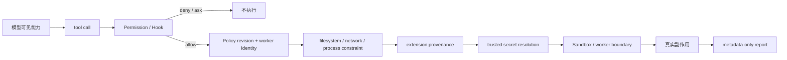

这不是说 Claude Code 内部恰好有一条同名流水线。左半段来自快照中的 Permission、settings、Sandbox、Plugin/MCP 控制；中间的 revision/worker envelope 和最后的 metadata report，是我们在 Mini Agent Harness 里做的 clean-room 迁移。两者必须分开记。

## 第一扇门问“可不可以”，第二堵墙限制“做得到什么”

Permission 和 Sandbox 最容易被混为一谈，因为它们都可能让命令“不能运行”。但它们回答的是不同问题。

Permission 的输入仍是一次 capability invocation：哪个工具、哪些参数、当前是什么 mode、规则是 allow/ask/deny，Hook 是否改写或阻止。它可以让用户说“我允许 `git status`”，也可以说“所有写操作先问我”。

Sandbox 面对的不是意图，而是已经要创建的 child process。它限制这个进程能读写哪些路径、能连接哪些 host，并把限制真正施加到执行环境。即使 Permission 给出 allow，Sandbox 仍应拒绝越界资源。

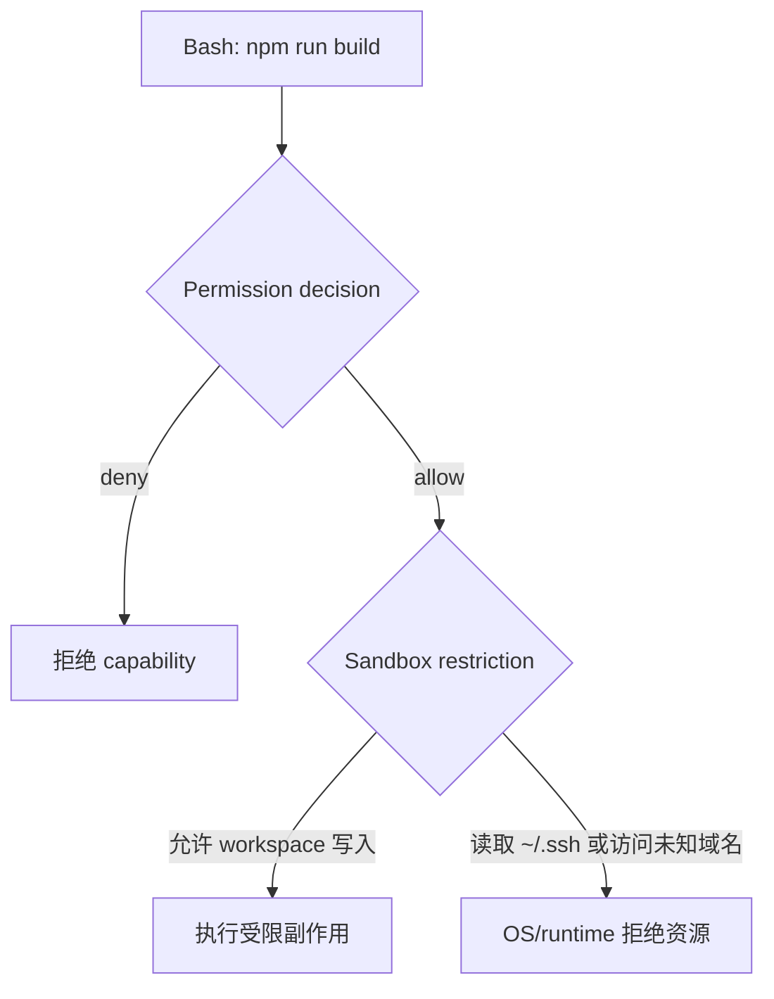

这里有一个很重要的面试表达：Permission 是 control-plane authorization，Sandbox 是 data-plane enforcement。一个允许调用，另一个限制调用最终能触达的资源。前者不能替代后者，后者也不能决定业务上该不该允许某个动作。

### 源码里两者在哪里分开

先看 `src/tools/BashTool/shouldUseSandbox.ts::shouldUseSandbox()`。它不是 Permission resolver，而是决定本次 Bash input 是否要进入 Sandbox：

1. `SandboxManager.isSandboxingEnabled()` 必须为真；
2. `dangerouslyDisableSandbox` 只有在 `areUnsandboxedCommandsAllowed()` 为真时才生效；
3. command 必须存在；
4. 命中 `excludedCommands` 时返回 false；
5. 否则返回 true。

然后到 `src/utils/Shell.ts`。命令被 provider 构造后，如果 `shouldUseSandbox` 为真，Shell 会先调用 `SandboxManager.wrapWithSandbox()`，再决定实际 spawn binary 和 argv。命令完成后，Sandbox 路径还有 cleanup。

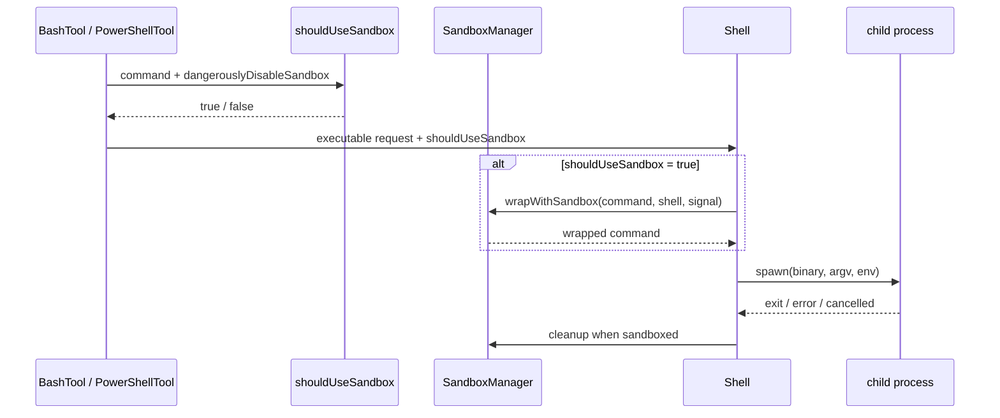

决定性变化发生在 spawn 前：不是 UI 上出现了“Sandboxed”字样，而是原命令被 runtime wrapper 改写后才进入 child process。

### `autoAllowBashIfSandboxed` 不是“Sandbox 覆盖所有规则”

`src/tools/BashTool/bashPermissions.ts` 的 Sandbox auto-allow 会先检查显式 deny/ask。命中 deny/ask 时仍按 Permission 处理；只有没有这些更强规则时，才可能因为命令将被 sandbox 而自动 allow。

因此正确关系是：

```text
显式 deny / ask
    > Sandbox auto-allow
    > 默认交互决策
```

这仍然要求你正确配置 Sandbox 资源边界。一个“已 sandbox”但允许整个 home directory 和任意网络的进程，隔离价值会大幅下降。

## 写了 `sandbox.enabled`，不代表现在真的有 Sandbox

Claude Code 的适配层没有用一个布尔值假装所有条件都满足。`src/utils/sandbox/sandbox-adapter.ts::isSandboxingEnabled()` 同时检查四件事：

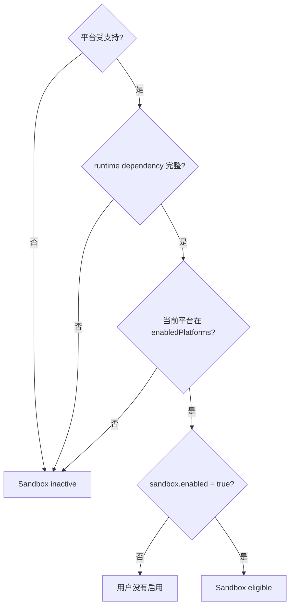

这里必须区分两个状态：

- `disabled`：用户没有启用，这不是“运行失败”；
- `unavailable`：用户明确要求启用，但平台或 dependency 使其不能运行。

`getSandboxUnavailableReason()` 只在显式启用时产生原因。REPL 与 print/headless 启动路径会把原因告诉用户。默认配置下，它警告后允许 unsandboxed 运行；设置 `sandbox.failIfUnavailable: true` 后才拒绝启动。

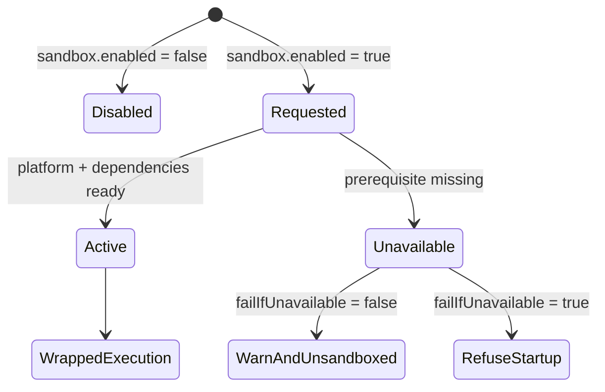

这会改变生产设计。安全基线如果要求“任何命令必须被隔离”，就不能只分发一份 settings；启动探针必须验证实际 runtime availability，并让 fail-closed 成为部署条件。

### Native Windows 的边界

当前外部 Sandbox runtime 支持 macOS、Linux 和合适的 WSL，不支持 native Windows。本项目又明确不使用 WSL，所以你在本机运行 Claude Code CLI 时不能把 Sandbox 教材结论误读成“Windows 进程已经被隔离”。

`src/tools/PowerShellTool/PowerShellTool.tsx` 在 Windows 上不调用该 Sandbox 路径。如果企业 policy 同时要求 Sandbox 且禁止 unsandboxed command，它会拒绝 PowerShell，而不是伪装成隔离成功。

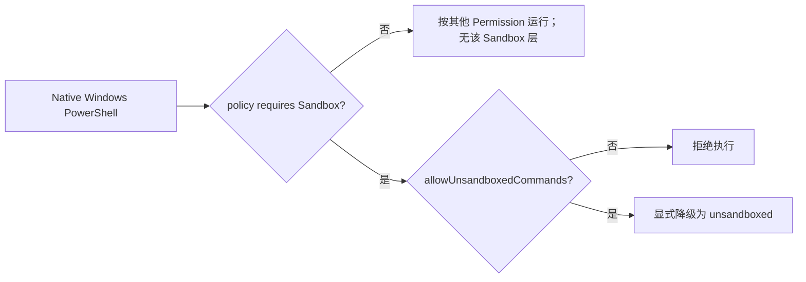

本图说明的是快照决策边界，不是推荐把生产 Agent 直接放在宿主 Windows 上。企业迁移通常会选择 Linux worker/container，并在 control plane 侧拒绝没有 isolation capability 的 worker。

### `excludedCommands` 为什么“不是边界”却仍然危险

源码注释明确说 `excludedCommands` 是 user-facing convenience，不是 security boundary。原因不是它没有效果，而是它基于命令文本和 heuristic matching，不能承担可靠安全证明。

但是命中后 `shouldUseSandbox()` 确实返回 false。这意味着：

- 它不能被当成“可信地识别某种安全命令”；
- 它却能让命中的命令离开 Sandbox；
- 所以它是用户主动配置的 isolation downgrade；
- 退出 Sandbox 后，真实 Permission prompt/rule 仍承担授权控制。

不要只背“不是安全边界”六个字。你要能说清：它不是可靠 enforcement mechanism，但配置它会改变执行环境，必须被审计和最小化。

同样，若启用 weaker nested sandbox 或 weaker network isolation，系统也不是“有/无 Sandbox”两态，而是不同 capability level。生产 worker registration 应上报隔离能力，policy 明确匹配，不让弱 worker 接收强隔离任务。

## Permission 规则怎样变成 runtime restriction

接下来沿 `src/utils/sandbox/sandbox-adapter.ts::convertToSandboxRuntimeConfig()` 看一次投影。它没有把 settings JSON 原样扔给 runtime，而是提取并组合多种来源：

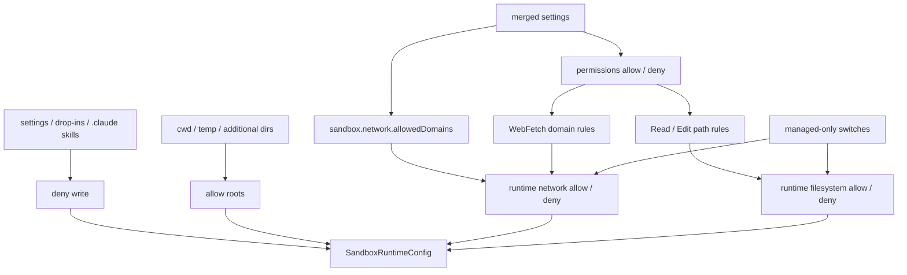

几个设计点值得迁移：

第一，deny 和 allow 不是同一信任级。managed-only domain/read mode 开启时，低信任来源提供的 allow 不再进入最终 runtime config。

第二，控制面自身要防写。settings、managed drop-ins 和 `.claude/skills` 如果允许被 sandboxed command 改写，下一个 command 的权限边界就可能被当前 command 篡改。

第三，worktree/additional working directory 不是“顺手拼进 cwd”。它们要经过独立投影，因为每多一个 root 都扩大可写面。

第四，bare Git repository planting 不是普通文件写入。适配层用 deny-write 加 command 后 scrub 缓解，但这仍是特定攻击面的工程补丁，不等价于通用文件系统安全。

### 策略更新为什么要有 revision

settings change listener 会同步调用 runtime 的 `updateConfig()`，显式 Permission 更新还能走 `refreshConfig()`。这减少旧配置继续被新命令使用的窗口，但仍有一个分布式系统问题：

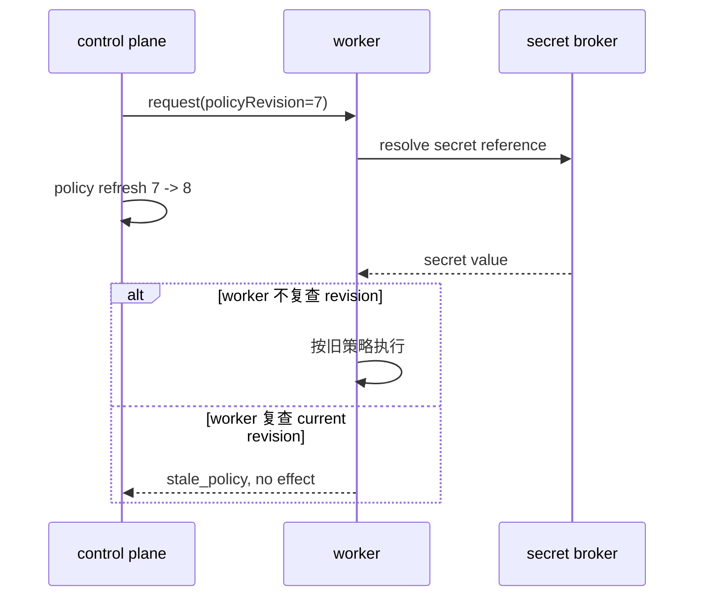

Claude Code 快照里的 settings refresh 给了我们动机；H7-1 进一步把 revision 放进 request，在 secret resolution 这种异步边界之后再次检查。它是设计迁移，不应反写成 Claude Code 的同名实现。

## 路径检查能降低风险，但不能把 race 变没

文件路径看似只是字符串，实际至少有四种身份：用户给的 original path、绝对 path、symlink chain、最终 resolved path。对于一个尚不存在的目标，final path 又不存在，只能检查 deepest existing ancestor。

`src/utils/permissions/filesystem.ts` 会检查 original 和 resolved 关系、symlink、dangling path，并对 UNC 与可疑 Windows path 加强处理。FileWrite/FileEdit 还使用 read state：没有先完整读取不能写，文件在 read 之后发生变化要拒绝或重新比较。

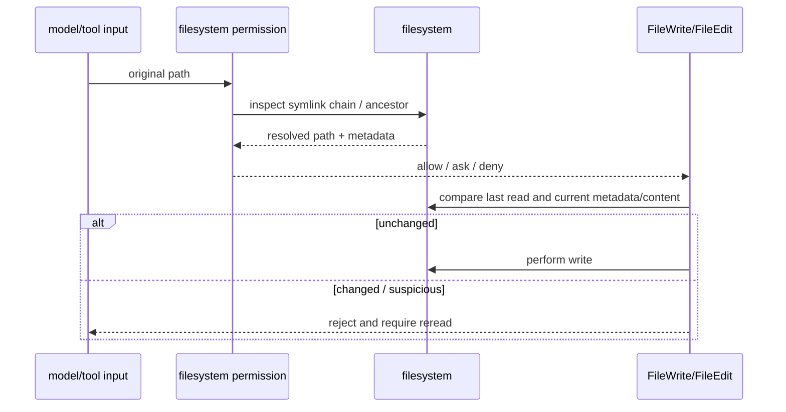

这条链降低了 symlink bypass 和 stale write，但 permission check 与 OS effect 之间仍有时间。另一个进程可能在检查后替换目录项；尚未创建的文件尤其难以先取得稳定 inode capability。

因此正确表述是：

> 应用层 path/symlink/stale-read 检查缩小 TOCTOU 面，Sandbox/OS enforcement 提供外层约束；快照没有证明完整消除 TOCTOU。

如果迁移到高风险企业工具，可以进一步使用 directory file descriptor、`openat`/no-follow、原子 rename、container mount policy，或者把写操作委托给只接受结构化 capability 的文件服务。但每个方案都要说明它保护的是哪一段 race。

## Managed Policy 不是“最后覆盖一次配置”

普通 settings 合并和 managed source 选择是两套不同规则。

普通 settings 的默认 precedence 是：

```text
user -> project -> local -> flag -> policy
```

后来源覆盖前来源。managed setting 从哪里来，则采用 first-source-wins：remote、machine-level registry/plist、managed file 与按字母序 drop-ins，最后才是 user-machine fallback。

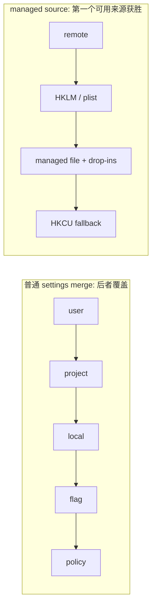

把两条规则混成一条，会在审计时犯很实际的错误：你可能以为某个本地 policy 会与 remote 叠加，实际它根本没有进入选择结果。

### Remote managed settings 为什么既不能叫 fail closed，也不能叫普通缓存

remote service 启动时先应用 cache，再发网络请求；之后大约每小时轮询。fetch 失败时：

- 有 cache：继续使用 stale policy；
- 无 cache：当前实现 fail open；
- fetch 成功：解析并进入安全变化检查。

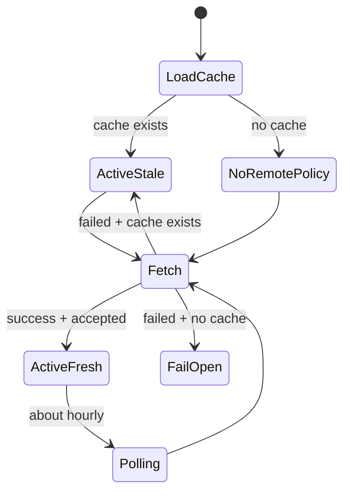

危险 remote changes 包括 shell-executing helper、非 allowlisted env 和 Hooks。在 interactive 模式，它们可以触发 security dialog；noninteractive SDK/headless path 跳过这次交互确认，变化直接进入后续处理。

这不是一句“CLI 有企业策略”就能带过的。生产迁移要明确：

- 哪些策略必须离线可验证；
- stale cache 最长允许多久；
- 无 cache 时是 fail open 还是 fail closed；
- headless worker 怎样审批危险 policy 变化；
- 已在运行的 request 怎样与新 revision 对齐。

## 秘密不是一种数据，而是三条不同边界

“我们对 secret 做了脱敏”通常信息不足。你至少要问：它是否进入模型上下文？是否进入 child process？如何落盘？

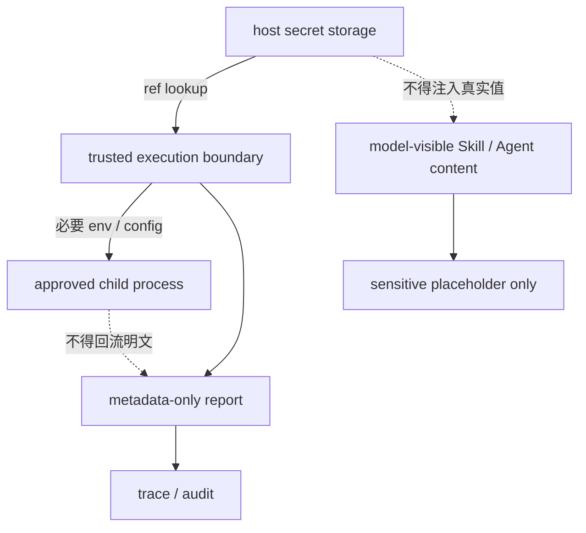

### 模型边界

`src/utils/plugins/pluginOptionsStorage.ts::substituteUserConfigInContent()` 遇到 sensitive option 时写入明显 placeholder，而不是实际 value。Skill/Agent prose 会进入模型，这里选择了“不让模型拥有秘密”。

但 MCP/LSP server config、Hook command 或 env 属于执行边界；相应 substitution 可以取得真实值。不要因为同样使用 `${user_config.KEY}` 就假设两个消费面相同。

### 子进程边界

`subprocessEnv()` 只有在 `CLAUDE_CODE_SUBPROCESS_ENV_SCRUB` 为真时，才从继承环境里清除一组已定义 credential。默认情况下不能宣称所有 child process 自动得到干净环境，更不能宣称未知 secret name 也会被发现。

成熟 Harness 的方向应是 allow-by-construction：worker 默认拿空白或最小环境，具体 tool 通过 secret reference 请求必要值，而不是先继承全部 `process.env` 再靠 blacklist 清理。

### 存储边界

Plugin sensitive option 进入 secure storage 抽象。macOS 优先 Keychain，其他平台当前会落到 plaintext credential file。抽象名叫 `secureStorage`，不意味着每个平台都具备相同加密保证。

这也是源码阅读的通用方法：不要从类名推导安全属性，要追到 platform adapter 和持久化实现。

## 一个 Plugin 被发现，不代表它值得信任

M21 已经讲过 extension registry；本章把问题推进到供应链。来源控制至少有五个环节：


快照里值得保留的控制包括：

- blocklist 在 allowlist 和下载前生效；
- `strictKnownMarketplaces` 限制 source；
- `enabledPlugins[id] = false` 阻止 install/enable；
- 配置允许时，delisted plugin 可以自动卸载；
- URL credential 和 custom header value 在 progress/log 中脱敏；
- `strictPluginOnlyCustomization` 可以收紧 loose customization surface。

这些都很有用，但 schema/path validation 证明的是“结构和落盘路径符合规则”，cache/content hash 证明的是“内容身份或缓存一致性”。它们不证明 publisher authenticity。快照中没有通用 Plugin signature verification 保证。

H7-1 的 `ExtensionTrustRule` 因此只做一件诚实的事：要求 `extensionId + source + optional digest` 与 policy 精确匹配。它没有声称 digest 是可信签名；digest 的来源和验证仍应由上游供应链服务负责。

### MCP policy 也不是 Sandbox

`src/services/mcp/config.ts` 支持按 name、command 和 URL 的 allow/deny。deny 优先；如果存在空 allowlist，它代表全部阻止；`allowManagedMcpServersOnly` 把 allow decision 限制在 managed settings。SDK-managed placeholder 例外，因为 CLI 不负责 spawn/connect 它们。

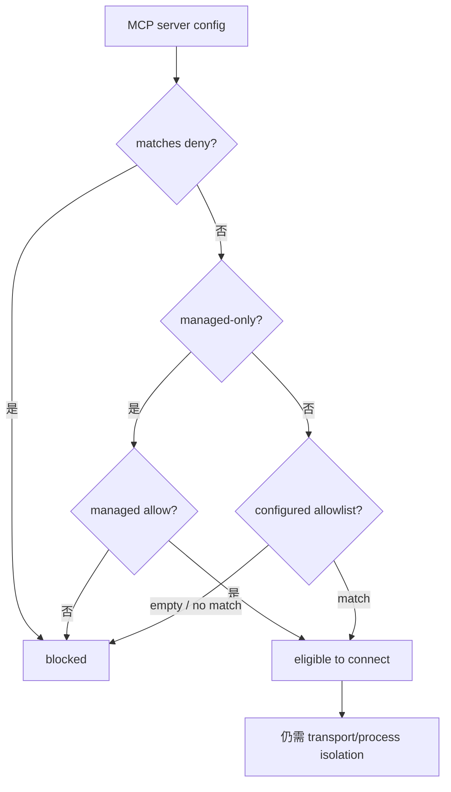

“允许连接哪个 MCP server”和“这个 server process 能访问什么”仍是两个问题，正如 Permission 与 Sandbox 的分工。

## 把纵深防御迁进 H7-1

现在看我们自己的 `mini-agent-harness/typescript/agent/securityBoundary.ts`。它没有实现 OS Sandbox，而是把生产 adapter 必须满足的协议先固定下来。

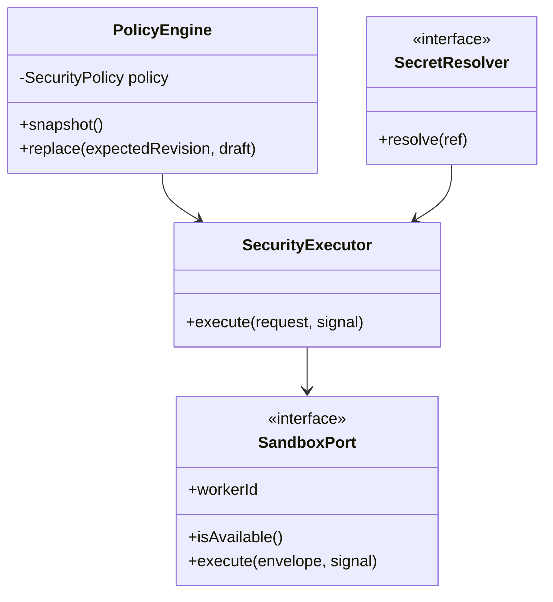

### `EffectRequest` 为什么用 discriminated union

三个 effect 需要不同约束：filesystem 看 operation 和 path，network 看 host，process 看 executable 与 argv。TypeScript 用 `kind` 作 discriminator：

```ts
type EffectRequest =
  | Readonly<{ kind: 'filesystem'; operation: 'read' | 'write'; path: string }>
  | Readonly<{ kind: 'network'; operation: 'connect'; host: string }>
  | Readonly<{
      kind: 'process'
      operation: 'spawn'
      executable: string
      argv: readonly string[]
    }>
```

进入 `switch (effect.kind)` 后，TypeScript 自动收窄成员。Java 对应 sealed interface + record，Python 版本用 dataclass 和 Literal，但 Python 的静态穷尽性更弱，需要测试补足。

为什么不只存 `target: string`？因为那会让 process argv、filesystem operation 和 network host 的语义混在一个字符串里，policy 很快退化为容易绕过的 substring matching。

### executable allow 不能自动允许任意 argv

H7-1 的 `ProcessRule` 不只允许 `git`，还允许 argv prefix。例如允许 `git status` 和 `git diff`，不自动允许：

```text
git -c core.sshCommand=evil status
```

这不是完整 shell parser，但它把“允许 executable”与“允许所有参数”明确拆开。生产工具更好的方案是避免通用 shell，直接定义结构化 Git capability。

### secret value 为什么用 `ReadonlyMap`

模型侧 `ExecutionRequest` 只有 `secretRefs`。所有 policy 和 provenance 检查通过后，`SecretResolver` 才查询 value，并把结果放入 `TrustedExecutionEnvelope.resolvedSecrets`。

`ReadonlyMap` 表达的是调用方不能通过类型接口修改映射；它不是加密，也不是 deep immutable memory。value 仍然存在于 trusted process memory，worker adapter 必须控制日志、core dump 和继承环境。

### 为什么 secret resolve 之后还要再查 revision

resolve 可能访问 Keychain、Vault 或 KMS，是异步边界。等待期间 policy 可以更新。H7-1 在 resolver 返回后重新读取 current revision；变化就返回 `stale_policy`，不调用 worker。

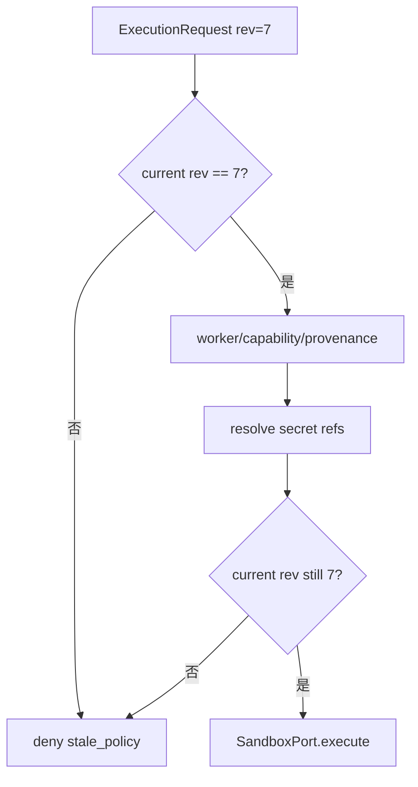

### report 为什么连 effect target 都不保存

`SecurityReport` 保存 call ID、worker ID、revision、capability kind、decision、reason、secret ref ID 和 extension ID。它不保存 path、host、argv、secret value、tool output。

这是一种默认最小化策略。M26 会继续讨论 observability：需要定位问题时，可以记录受控 fingerprint、classification 或单独受权限保护的 evidence reference，而不是把 payload 复制进所有 trace。

## 现在用破坏实验验证，不靠“设计看起来合理”

从项目根目录运行：

```powershell
node mini-agent-harness/typescript/agent/securityBoundary.test.ts
```

预期：`10/10`。Python 镜像：

```powershell
Set-Location mini-agent-harness/python
python -m unittest -v test_security_boundary.py
```

预期：`10/10`。

### 实验一：Permission allow 仍被 filesystem policy 拒绝

输入把 `permissionGranted` 设为 true，但 write path 指向 workspace 外。观察：

- result 是 `capability_denied`；
- fake Sandbox worker 调用次数仍为零。

反证条件：如果 worker 收到 envelope，说明 Permission allow 覆盖了外层资源限制。

### 实验二：Sandbox required 但 unavailable

把 fake port 的 `available=false`。预期 `sandbox_unavailable`，没有 fallback。它验证的是 H7-1 迁移契约，不是本机 native Windows 已经有 Sandbox。

### 实验三：secret 只能到 trusted envelope

resolver 返回测试值。测试同时序列化原始 request 和 report，确认两者没有 value；只有 fake worker 捕获的 trusted envelope 能读到它。

反证条件：request/report JSON 出现明文，或 missing secret 仍触发 worker。

### 实验四：policy refresh race

resolver 内把 policy 从 revision 1 更新到 2，再返回 value。预期旧 request 得到 `stale_policy`，worker 仍未调用。

这条实验比“stale request 一开始就被拒绝”更重要，因为它验证了真实异步窗口。

### 实验五：extension provenance

相同 extension ID 与 digest，source 从 `corp-market` 改成 `public-market`。预期 unknown tuple 被拒绝，精确 trusted tuple 才执行。注意这个实验没有验证 publisher signature，只验证 policy matching。

## 从能运行到能修改

完成基础实验后，不要停在阅读测试。按以下顺序改一处机制：

1. 给 network policy 增加 port range；
2. 让 `*.example.com` 不匹配裸 `example.com`，写出正反例；
3. 给 process rule 增加 working-directory constraint；
4. 在 secret resolver 等待期间触发 cancellation，证明 worker 不执行；
5. 为 policy document 增加 `expiresAt`，决定过期是拒绝还是允许 stale grace period。

每次修改都要回答：新字段由谁拥有？谁能改？worker 如何证明看到的是同一 revision？report 是否泄漏了更多数据？

进阶挑战是写一个真实 adapter，但不要一上来手写 OS sandbox。可以让 `SandboxPort` 调用容器 runtime 或受控 worker service；测试验证 envelope、identity、timeout、cancellation 和 report，隔离能力交给成熟 runtime。

## 迁移到 Java/Spring 与企业 Agent

Java 侧可以把本章边界拆成四个 Spring component：

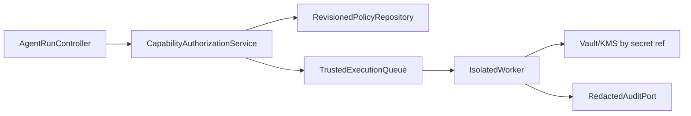

- `CapabilityAuthorizationService` 不拥有 secret；
- `RevisionedPolicyRepository` 用 CAS/版本号发布 immutable snapshot；
- queue message 带 tenant、worker capability、policy revision 和 idempotency key；
- worker attestation/capability 决定它能否接单；
- Vault 只在 worker identity 验证后发放短期 credential；
- audit 默认 metadata-only，敏感 evidence 走单独 retention 与 RBAC。

LangGraph 可以编排“请求审批 -> 执行 -> 观察”节点，但它不会自动提供 OS isolation、secret broker 或 extension provenance。图的 checkpoint 也不能让旧 policy 下的 effect 变安全。Harness 的控制面仍需独立存在。

RAG 系统也有同样问题：一个允许的 retriever 可能跨 tenant 查询，ingestion plugin 可能读取不该读的 bucket，document loader 可能在解析时启动外部程序。把 capability、tenant policy、worker isolation 和 secret scope 放到真实 I/O 边界，而不是只在 graph node 名称上标“safe”。

## 用威胁模型检查设计，而不是追求“绝对安全”

本章可以压成五个资产和五条攻击路径：

| 资产 | 典型攻击路径 | 核心控制 |
| --- | --- | --- |
| host filesystem | symlink/path race、越界写 | path checks + OS isolation + constrained file service |
| network identity | child process 外传 | domain/port policy + isolated network + egress proxy |
| credentials | prompt/env/log 泄漏 | secret ref + minimal env + redacted report |
| policy | tool 改写 settings、stale worker | deny-write + immutable revision + fail closed |
| extension trust | compromised marketplace/MCP | source policy + provenance + signature/SBOM/attestation |

没有一列可以只靠一个布尔字段解决。纵深防御的价值不是层数多，而是某一层看错意图时，下一层仍限制真实资源。

## 资深 Agent 开发岗会怎样追问

下面的回答不是背诵稿。练习时先用第一句给结论，再根据追问选择源码、失败路径或企业迁移展开。

### 1. “Permission 已经 allow 了，为什么还要 Sandbox？”

**结论是 Permission 管授权，Sandbox 管实际资源边界，两者不能互相替代。** Permission 判断这次 Tool 调用在业务上该不该执行，比如规则、Hook 或用户是否同意；但被允许的 `npm`、shell 或 MCP server 仍可能启动子进程、读取额外文件或访问网络。Claude Code 的快照里，Bash permission 决策和 `shouldUseSandbox()` 是两条机制，真正 spawn 前 `Shell.ts` 会调用 `SandboxManager.wrapWithSandbox()`。所以 allow 只代表调用合法，不代表进程能任意访问。企业系统里我会把 capability authorization 放在 control plane，把 filesystem/network/process enforcement 放在隔离 worker；即使前者误判，后者仍限制 blast radius。

### 2. “怎样证明 Sandbox 真的生效，而不是配置里写了 enabled？”

**结论是要验证运行能力和 fail-closed 行为，不能验证一份配置文件就结束。** Claude Code 的 `isSandboxingEnabled()` 同时检查平台、dependency、enabled platform 和用户 setting；显式启用但不可用时，默认可能警告后 unsandboxed，只有 `failIfUnavailable` 才拒绝启动。Native Windows 也不受这个 runtime 支持。生产上我会让 worker registration 上报 isolation capability，做启动自检和代表性 deny probe，并让强隔离任务只调度给匹配 worker；policy 要求隔离但 worker 不满足时直接不接单。观测里记录 capability level 和 policy revision，不记录“配置期望”冒充“执行事实”。

### 3. “`excludedCommands` 不是安全边界，为什么还值得关注？”

**结论是它不能可靠证明命令安全，但它确实会改变执行环境，所以属于高风险降级配置。** 快照注释明确说它只是 convenience，因为匹配基于 command text 和 heuristic，能被复杂 shell 形式绕开；同时 `shouldUseSandbox()` 命中后返回 false，命令会离开 Sandbox。它不是 enforcement boundary，不代表没安全影响。我的治理方式是默认禁用或严格托管这类 escape hatch，仍让 Permission 处理真实授权，并在 audit 里记录 unsandboxed reason。需要长期运行的特殊命令，我更倾向给它单独受控 worker，而不是不断扩大字符串例外。

### 4. “Managed Policy 更新时，正在执行的请求怎么办？”

**结论是 policy 必须版本化，请求和 worker 都绑定 revision，跨异步边界要复查。** Claude Code 会在 settings change 后更新 Sandbox config，这解决了本地配置传播，但企业多 worker 场景还会有队列、secret broker 和网络延迟。我的 request 带 policy revision，worker 执行前检查 current revision；如果 secret resolve 期间 revision 变化，就返回 stale 而不触发 effect。已经发生的副作用不能靠新 policy 撤回，要结合 M24 的 effect journal、幂等和补偿处理。紧急 revoke 还需要 worker push cancellation 或短 lease，不能只等小时级 polling。

### 5. “你怎样避免 secret 进入模型和日志？”

**结论是模型只看 secret reference，真实值只在可信执行边界按需解析，telemetry 默认只记元数据。** Claude Code Plugin sensitive option 在 Skill/Agent content 中会变成 placeholder，但 MCP/LSP env 可能需要实际值；`subprocessEnv()` 又不是默认通用 scrub，所以三个边界必须分开。我的 Harness request 只有 ref，所有 policy、worker 和 provenance 检查通过后 resolver 才取值，trusted envelope 不会序列化到 report。生产上再配最小环境、短期 credential、Vault identity、日志字段 allowlist 和泄漏扫描。重要的是避免“先把全部环境传下去再 blacklist”，那很难覆盖未知 secret。

### 6. “Plugin 有 hash 和 schema 校验，为什么还不算供应链可信？”

**结论是 schema 证明结构，hash 证明内容身份，它们都不自动证明发布者是谁。** Claude Code 快照有 Marketplace blocklist、known source、enabled/delisted policy、schema/path check，这些能降低误装和路径攻击；但没有通用 publisher signature verification 保证。如果 marketplace 本身被攻陷，合法 schema 和新 hash 仍可装入恶意内容。企业方案要补 source ownership、签名和 key rotation、SBOM、构建 provenance、artifact transparency 与 revoke。H7-1 只匹配 extension ID、source 和 digest，我会明确说这是 policy evidence，不冒充密码学真实性。

### 7. “应用层已经检查 symlink 和文件修改时间，TOCTOU 还在哪里？”

**结论是检查和使用不是一个原子 OS 操作，路径状态仍可能在两者之间变化。** 快照检查 original/resolved path、symlink chain、dangling ancestor、UNC，并让 FileWrite/Edit 验证 read state，这能挡住大量绕过和 stale write。但另一个进程仍可能在 permission check 后替换目录项，尚不存在的文件也没有稳定 inode 可以先绑定。高风险设计会在隔离 worker 内用 no-follow、directory FD/openat、原子写或结构化文件服务缩小 race，再让 Sandbox 限制最外层可达范围。我不会说“完全消除”，而会说明每层覆盖哪个窗口。

### 8. “如果让你设计企业级 Agent 执行平台，安全链怎样落地？”

**结论是把执行做成带身份、策略版本和最小 capability 的受控工作负载，而不是让 Web 进程直接跑工具。** control plane 负责模型可见性、Permission、tenant policy 和 queue；isolated worker 注册自己的 OS/network capability，只领取匹配任务。message 带 run/call/idempotency/policy revision，不带 secret value；worker 校验 revision 和 extension provenance，再向 Vault 换短期凭据。filesystem/network/process 由 container、egress proxy 和专用 service 执行，结果通过 metadata trace 与受控 artifact reference 返回。失败和回滚接 M24 的 effect journal，观测和 quota 在 M26 补齐。这样面试官继续追问任意一层，我都能说出 owner、失败语义和不能保证的边界。

## 最后把本章压成一张复习图

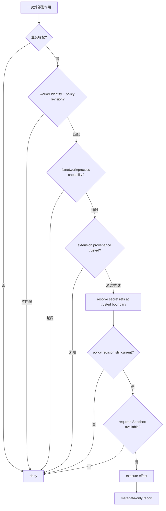

能画出这张图还不够。你要能在每个菱形旁边回答三件事：谁拥有判断所需的状态，哪个源码或 clean-room 契约改变了语义，失败以后是否已经发生外部副作用。做到这一点，你才真正从“会配置工具权限”走到了“会设计 Agent 安全执行边界”。
