# M26 看不见，就无法治理：Trace、评估、Token、成本与配额

先看一份很像“系统一切正常”的日报：

```text
run_status = success
latency = 8.2s
ttft = 0ms
tokens = 41,300
cost = $0
telemetry_flush = success
```

五个字段都可能是真的，合在一起却可能把你带到五个错误结论：

- `success` 只说明最后一次模型请求成功，不说明前面有没有 retry 或 fallback；
- `8.2s` 可能只是成功 attempt 的耗时，不包含排队和重试；
- `0ms` 可能不是“瞬间收到首包”，而是根本没观测到 `message_start`；
- `41,300` 如果来自多次 cumulative snapshot 相加，可能重复计数；
- `$0` 可能不是免费，而是 price catalog 不认识这个 model；
- `flush success` 还可能发生在 uploader 已经丢掉一个 batch 之后。

这正是 Agent 可观测性最危险的地方：**错误不是少打一行日志，而是把不同 owner、不同时间尺度和不同不确定性压成了一个看似精确的数字。**

本章不从“要采集哪些指标”开始。我们从一次用户交互怎样裂变成多个 operation、多个模型 attempt、多个 tool effect 和多个治理决定开始，再一步步把它们重新关联起来。

先把整条路看见：


图里的箭头不是说 observer 可以回头改变已经完成的 Tool。Telemetry、cost 和 evaluation 首先是观察与记账；真正阻断下一次执行的必须是显式 admission/policy gate。这个 owner 分离会贯穿整章。

## 一次 run 并不是一个计时器

假设用户说：“读取构建日志，定位失败原因并修复。”主线程先发一次模型请求，遇到 529 后 retry；fast mode 冷却后 fallback 到另一路模型；模型调用两个 Tool，其中一个等待用户确认；最终答案成功返回。

如果只给整个 run 一个 `startTime` 和 `endTime`，你能知道总耗时，却解释不了耗时属于哪里。反过来，如果每个函数都随手创建 span，却没有稳定 parentage，最后会得到一团不能回答因果关系的时间片。

Claude Code 快照在 `src/utils/telemetry/sessionTracing.ts` 里给出了更有用的层次：

- interaction span 是一次 user request 到 Claude response 的 root；
- LLM request、Tool、blocked-on-user、tool execution 和 Hook 是 operation span；
- interaction 与 Tool 上下文通过 Node.js `AsyncLocalStorage` 传播；
- 不放在 ALS 里的 LLM/blocked/execution/hook span 由 strong map 保活；
- `activeSpans` 使用 `WeakRef`，正常结束时显式删除；30 分钟 TTL 只是 orphan safety net。


这里第一次遇到 `AsyncLocalStorage`，可以把它理解成 Java 的 `ThreadLocal` 的异步任务版本，但不能画等号。Node.js 的一次请求会跨越许多 Promise callback，并不固定占用一个线程；ALS 把 context 与异步调用链绑定，让深层函数不必层层传递 interaction ID。Java Web 服务常用 MDC/Tracing Context 做类似传播，但异步线程池切换时同样要确认 context propagation 是否成立。

### “最近一个 span”为什么会在并行下出错

`startLLMRequestSpan()` 返回一个具体 `Span`。`endLLMRequestSpan(span, metadata)` 如果收到这个 exact span，会按 span ID 找到对应上下文。这是并行安全主路径。

但为了兼容旧调用，`span` 参数可省略。此时实现对 `activeSpans.values()` 做 `findLast(...)`，取最近创建的 `llm_request`。只要两个请求同时在 flight，“最近创建”就不再等于“当前 response 所属”。

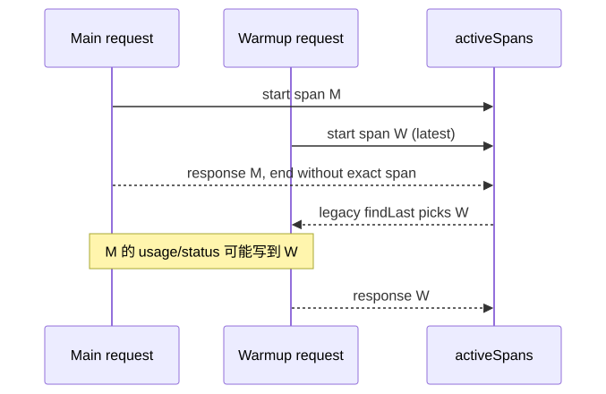

这类错误不会让主业务失败，所以普通端到端测试很容易漏掉。它会让诊断、成本归属和 SLO 变错。正确的设计原则是：

> 并发操作的结束事件必须携带开始时创建的稳定 identity，不能在结束时重新猜“它大概属于谁”。

H7-2 因而把 `runId + requestId + attemptId + route` 固定为 attempt identity。`route` 说明 primary/retry/fallback，但真正防串线的是独立 `attemptId`，不是 route 名称。

### TTL 是泄漏安全网，不是生命周期协议

`ensureCleanupInterval()` 第一次启动 interaction 时才创建 interval，每 60 秒扫描一次；超过 30 分钟的 orphan span 会被 end 并移除，`unref()` 又避免 timer 阻止进程退出。

这段实现很值得迁移，但要准确表达：

- 正常路径仍要调用对应 `end*`；
- TTL 不能证明一个请求真的运行了 30 分钟；
- 被 TTL 清理只能说明 span 没正常闭合；
- cleanup timer 是资源保险，不是业务 timeout，也不是 cancellation。


把三者混在一起会产生很糟糕的告警：业务超时、用户取消和 observer orphan 应分别有自己的状态。

## Metadata-only 不是一句承诺，而是一条可检查的边界

Agent 的 telemetry 比普通后端更敏感。Prompt 里可能有源码、客户数据和密钥；Tool input/result 可能包含文件内容、SQL 结果和 shell 输出；model output 也可能复述这些内容。

快照里至少有三条不能混称为“日志”的路径。

第一条是 `src/services/analytics/index.ts::logEvent()`。普通 `LogEventMetadata` 只允许 `boolean | number | undefined`，默认类型路径排除 string。sink 尚未 attach 时，event 进入 module queue；attach 后用 `queueMicrotask()` 异步 drain，避免阻塞启动。

第二条是标准 session tracing。interaction 的 `user_prompt` 默认写 `<REDACTED>`，只有 `OTEL_LOG_USER_PROMPTS` 开启才写真实 prompt；Tool content 也有独立 gate。

第三条是 beta detailed tracing。`betaSessionTracing.ts` 可以记录 system prompt、tools、new context、model output、thinking、tool input/result，并对部分字段 hash、dedupe 或 truncate。


### 那个很长的 TypeScript 类型名并不是防泄漏证明

源码定义：

```ts
export type AnalyticsMetadata_I_VERIFIED_THIS_IS_NOT_CODE_OR_FILEPATHS = never
```

它的用途是迫使开发者写出一个很显眼的 cast，让 code reviewer 停下来检查字符串。但 TypeScript 的 assertion 可以绕过普通 string exclusion。也就是说，它是组织流程的提醒器，不是编译器证明，更不是运行时 DLP。

这对 TypeScript 初学者很重要。`never` 常表示“不会产生值”，但 `someString as SomeNeverMarker` 是人为断言，编译器不会重新扫描字符串内容。企业实现不能把一个有威慑力的类型名写进安全白皮书，然后宣称“已防止 PII”。

### 截断不是脱敏，Hash 也不是匿名化

`truncateContent()` 解决的是属性大小和运输成本问题。60KB 以内的敏感内容仍是完整敏感内容；超过 60KB 只是少了一部分，并没有改变前缀的保密级别。

Hash 适合做同一内容的稳定 fingerprint 或 dedupe，但低熵值可以被枚举，hash 也会形成跨事件关联标识。它不能替代：

- 字段 allowlist；
- token/credential scanner；
- 分级 retention 和访问控制；
- 受审批的 evidence/artifact channel；
- 删除和审计机制。

H7-2 选择更窄的默认边界：`TelemetryEvent` 是 closed discriminated union。调用方只能提交 attempt/tool ID、时间、类别和数值，接口根本没有任意 `attributes: Record<string, string>`。这是“默认不接受正文”，不是“做了完美脱敏”。需要排障证据时，应走单独的 artifact reference 和更严格 RBAC，而不是偷偷给 telemetry 再加一个 `payload`。


`TelemetryRecorder.record()` 捕获 exporter failure 并返回 delivery status。它不能抛回 Tool Loop 改变 run outcome。这里也要避免另一个极端：observer-only 不等于“丢了也不用管”。失败计数必须进入 shutdown/report/SLO，否则系统只是静默失明。

## 时间必须绑定到 attempt，而不是只绑定最终成功

在 `src/services/api/claude.ts` 中，每个 attempt 开始时记录 `start`。流收到 `message_start` 时计算：

```text
ttftMs = Date.now() - start
```

因此 TTFT 属于这个成功建立 stream 的 attempt，不是从用户按 Enter 开始的整轮墙钟时间。success log 还区分：

- successful-attempt duration：最后成功 attempt 从 start 到完成；
- duration including retries：整个 retry sequence 到完成；
- attempt ordinal 和 fallback 标记；
- request ID、stop reason、usage/cost。

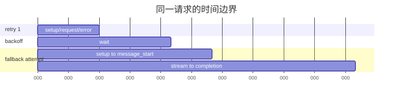

在这张图里：

- fallback attempt TTFT 是 `340 - 260 = 80ms`；
- successful attempt duration 是 `620 - 260 = 360ms`；
- including retries duration 是 `620ms`；
- 用户体感还可能包含 admission queue、Tool 等待和渲染，不能拿其中任一值冒充整轮延迟。

快照变量初始值可能写成 `0`，但企业 ledger 不应该把“没有收到可归因的首包”记进 `0ms` bucket。0 是一个真实数值，代表立即到达；缺失则代表测量没有成立。H7-2 用：

```text
{ status: "observed", milliseconds: 80 }
{ status: "unknown" }
```

这不是类型洁癖。假如 timeout/fallback 请求大量缺 TTFT，却全部被算成 0，P50 会反而变好，告警会在最需要它时失效。

## Usage 最大的坑：流事件给的是快照，不是零钱

`claude.ts::updateUsage()` 的注释明确指出，Anthropic streaming API 的 usage 是 cumulative total。`message_start` 通常给 input/cache，`message_delta` 给最终 output；后续显式 0 不应覆盖起始的非零 input/cache 值。

看这个最小例子：

```text
event 1: output_tokens = 100
event 2: output_tokens = 130
```

第二个事件不是“又生成了 130”，而是“截至现在共 130”。正确总量是 130，错误相加会得到 230。


H7-2 的 `UsageCostLedger` 为每个 attempt 保存上一份 cumulative snapshot，再计算 delta。这里的 key 必须包含 attempt identity：retry attempt 的 50 和 fallback attempt 的 70 都应分别从 0 开始，不能拿 fallback 的 70 减 retry 的 50。

### 快照里的 cost 为什么通常只记一次

快照在最终 `message_delta` 得到完整 usage 后调用 `calculateUSDCost()`，再通过 `addToTotalSessionCost()` 累加。non-streaming fallback 在 `finally` 中记一次，避免 generator `.return()` 导致漏账；advisor sub-usage 也单独计算再纳入 total。

这里的设计重点不是“所有 Provider 都必须照抄这一行”，而是建立计费事件边界：


如果你既对每个 stream snapshot 计费，又对 terminal usage 再计一次，就会双重计算。若你只对最终 request success 记一条，又会把 retry/fallback/advisor 的归属抹掉。企业 ledger 更适合保存 attempt-level immutable entries，再在报表层聚合。

### 未知价格不是零价格

快照的 model price table 会 canonicalize model，考虑 fast mode。遇到 unknown model 时使用 fallback price，同时设置 `hasUnknownModelCost`，最终提示 cost 可能不准确。

这是产品体验上的实用取舍：用户至少能看到估算。但企业账本还需要更明确的审计语义：每条 entry 绑定 `priceVersion`；查不到 price 时 `cost.status = unknown`，不写 `usd = 0`。


为什么要把 price version 固定在 entry 上？因为下个月价格表变化后，历史账单不能被当前价格悄悄重算。你可以做 reconciliation，但它必须产生新版本或 adjustment，而不是修改过去事实。

## 四种“预算”必须分开说

源码附近有多个都能让“请求受限”的机制，很容易在架构图里画成同一个 Quota Service。实际上至少有四类：

| 机制 | owner / 数据来源 | 作用时间 | 它不是什么 |
| --- | --- | --- | --- |
| Provider quota | `claudeAiLimits.ts` 解析 response/error headers | Provider 回应后更新；交互路径可 pre-check | 不是组织 feature policy |
| Organization policy limits | `services/policyLimits` 的远端功能开关与缓存 | 功能可用性判断 | 不是 token/cost 配额 |
| Request task budget | `configureTaskBudgetParams()` 写 `output_config.task_budget` | 单次模型请求 | 不是本地硬 reservation |
| Tenant governor | H7-2 clean-room admission | 工作开始前 reserve | 不是快照已有通用组件 |


`policyLimits` 多数 cache miss/unknown 是 fail open；essential-traffic-only 下少数 policy 例外 fail closed。这是产品可用性与控制风险的选择，不代表所有 quota 都应 fail open。

`task_budget` 告诉模型 total/remaining token，让模型调整节奏。它不是事务锁：两个并发请求都可以看到“还有 10 万 token”，然后一起消耗 8 万。真正防止 oversubscription 的控制必须在启动前做原子 reservation。

### Tenant reservation 怎样挡住并发超卖

H7-2 的 `TenantGovernor` 同时看三个维度：窗口内 token、窗口内 cost 和 active concurrency。一个请求先提交 estimate；能容纳就进入 active map，否则进入该 tenant 的 bounded FIFO queue。

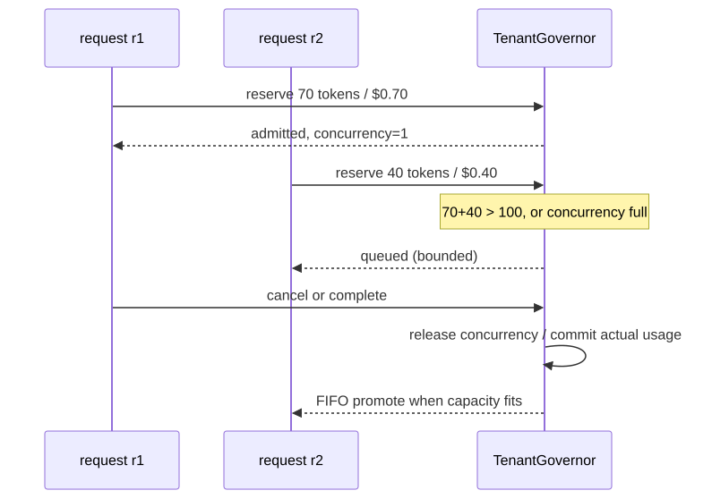

几个边界必须说清：

- reservation 防的是“按 estimate 同时准入导致的超卖”；实际 usage 仍可能超过 estimate，需要 overage policy；
- completion 释放 concurrency，但把 actual token/cost 计入窗口消费；
- cancellation 释放 reservation，不写消费；
- queue 是 per-tenant bounded，防一个 noisy tenant 无限占内存；
- 当前实现进程内，没有 distributed CAS、跨节点公平或 durable rolling window。

生产版通常会把 reservation 放进 Redis/Lua、数据库 serializable transaction 或专用 quota service。要设计 idempotency key、lease expiry、worker crash reconciliation 和 price currency。H7-2 先把 owner 与状态机做对，不冒充分布式完成品。

## “flush 成功”为什么仍可能丢事件

`src/cli/transports/SerialBatchEventUploader.ts` 是一个很好的 backpressure 样本：pending buffer、最多一个 POST in flight、按 count/bytes batch、失败后 requeue 到队首、指数退避+jitter，`RetryableError` 还能携带 Retry-After。

当 `maxQueueSize` 满时，`enqueue()` 会等待，生产者被反压。若配置 `maxConsecutiveFailures`，失败次数达到上限后会 drop 当前 batch、增加 `droppedBatchCount`，然后继续 drain。


关键反直觉点：`flush()` 的条件是 pending empty 且不再 draining。batch 被 drop 后，pending 也可能变空，所以 flush 正常 resolve。`close()` 更直接：它清空 pending，并释放被阻塞的 enqueue/flush waiter。

因此 shutdown report 至少要区分：

```text
delivered count
dropped batch/event count
pending at close
observer/export failure count
flush duration / timeout
```

“没有 throw”只说明调用协议结束，不说明数据完整交付。这个思想可以迁移到消息队列 producer、审计日志和异步指标 exporter。

## Evaluation 不是“Tool 没报错”

一次 Agent run 有多个相互独立的质量维度：

- Tool 执行是否成功；
- 最终答案是否事实正确；
- 是否基于正确 evidence；
- 是否违反安全策略；
- 是否在成本/延迟预算内；
- 用户是否接受结果。

Tool exit code 0 只能证明 handler 没报告失败，不能证明改对了文件。用户点了接受也可能只是没时间检查。快照有 suggestion acceptance、Tool/Hook outcome 和 feedback 等 feature-specific event，但没有证据支持“存在覆盖 Agent correctness 的通用 evaluation ledger”。

所以 H7-2 的 `EvaluationLedger` 明确是设计迁移。每条 record 固定：

```text
eventId
runId / evaluationId
rubricId + rubricVersion
evaluatorVersion
categorical outcome
fixed dimension scores
recordedAtMs
```

相同 event ID + 相同内容是 idempotent replay；相同 ID + 不同内容是 collision。它不保存 judge chain-of-thought，不保存原回答，也不拥有 Tool execution。


把 evaluation 与 policy 分开还有一个好处：换 rubric 时可以重评，而不重写执行历史。在线 blocking evaluation 当然可以设计，但它应该是显式 gate，定义 timeout、降级和证据访问权，而不是让一个“observer callback”偶然抛异常。

## 把 H7-2 接进累计 Harness

M25 的 H7-1 已经把 Permission grant、policy revision、worker identity、Sandbox port、secret resolution 和 extension provenance 放到副作用前。H7-2 不应把这些塞进一个巨型 `AgentRuntime`；它沿现有 owner 边界增加四个 port/ledger。


实现位于：

- TypeScript：`mini-agent-harness/typescript/agent/observabilityGovernance.ts`；
- Python：`mini-agent-harness/python/observability_governance.py`；
- 契约：`mini-agent-harness/contracts/h7-2-contract.md`。

### 为什么 `TelemetryEvent` 用 discriminated union

TypeScript 中：

```ts
type TelemetryEvent =
  | { kind: 'attempt_started'; eventId: string; identity: AttemptIdentity; ... }
  | { kind: 'attempt_finished'; eventId: string; identity: AttemptIdentity; ... }
  | { kind: 'tool_finished'; eventId: string; toolCallId: string; ... }
```

`kind` 是判别字段。处理器一旦 `switch (event.kind)`，编译器就知道对应 variant 有哪些字段。相比 `Record<string, unknown>`，它同时收紧数据面和学习成本：想加入 prompt 必须修改公开类型、测试和审查，而不是在任意 map 里悄悄多写一个 key。

Python 版本用 frozen dataclass 和受限 Literal 表达同一行为契约。它不像 TypeScript union 那样能在所有分支做完全相同的静态 narrowing，所以仍需 runtime tests。双语言等价的目标不是逐行相同，而是这几个可观察不变量相同。

### Idempotent 与 collision 为什么必须同时存在

分布式 transport 会重放，单纯“重复 ID 一律报错”会让正常 retry 变成故障；但“重复 ID 一律忽略”会把两个不同事实静默合并。


这套规则同时用于 usage 与 evaluation。当前实现把 replay fingerprint 保存在进程内；生产存储需要 unique key + payload fingerprint/compare-and-set。

## 用实验逼迫错误实现暴露

实验入口不是“运行后看到 PASS”就结束。每个实验都有一个错误实现会产生的反证现象。

先运行聚焦测试：

```powershell
cd mini-agent-harness
node typescript/agent/observabilityGovernance.test.ts
python -m unittest -v python/test_observability_governance.py
```

### 实验一：累计值被当成 delta

输入 `100 -> 130`。正确 ledger 两条 delta 是 `100, 30`，总量 130。把 `subtractUsage()` 暂时改成直接返回 current，测试会得到 230。这证明测试验证的是语义，不只是类型。

### 实验二：并行 attempt 被覆盖

给 retry attempt 50、fallback attempt 70。正确结果是两个独立 entry，delta 分别是 50 和 70。若 map key 只用 `requestId`，fallback 会在 retry 基础上只加 20，或者覆盖 retry。

### 实验三：未知值被伪装成零

不提供 price 和 TTFT。序列化 entry 不应出现 `usd: 0` 或 `milliseconds: 0`，而应出现 `status: unknown`。这能直接保护 dashboard 聚合语义。

### 实验四：observer 失败反向破坏运行

fake exporter 立即 throw。`TelemetryRecorder.record()` 返回 false，failure count 加一，但调用者不会收到异常。若删除 catch，测试会让 observer 获得不属于它的执行权。

### 实验五：内容边界

只构造 fixed `tool_finished` event，再检查 JSON 没有 prompt/tool result/secret 字段。这个实验不是证明系统能识别任意泄漏，而是证明当前 port 没有自由正文入口。

### 实验六：reservation 与 noisy tenant

tenant limit 为 100 token、$1、并发 1。r1 reserve 70/$0.7 后，r2 的 40/$0.4 进入 queue；取消 r1 后 r2 才被 promote。另一个测试把 queue size 设为 1，第三个等待者必须收到 `TenantQueueFullError`。


完整回归还要运行：

```powershell
npm run typecheck
npm test
powershell -NoProfile -ExecutionPolicy Bypass -File tests/run-agent-regression.ps1
```

聚焦实验验证 H7-2；累计回归验证它没有破坏 M01-M25 已建立的消息 owner、Tool pairing、cancel、recovery 和 security boundary。

## 从本地 Harness 迁移到企业控制面

真正上线时，不要先问“用 Prometheus 还是 Datadog”，先问数据与决策的 owner。

一个可落地的分层是：


这里至少要补齐：

- 全局唯一且 tenant-scoped 的 run/request/attempt/tool/evaluation ID；
- W3C trace context 或等价传播，同时防止外部伪造 tenant identity；
- durable/outbox event delivery、drop accounting 和 retention；
- quota atomic reservation、lease expiry、crash reconciliation；
- price catalog version、currency、税费和 Provider bill reconciliation；
- prompt/evidence 的分类、RBAC、加密、删除与审计；
- SLI：admission wait、TTFT unknown rate、fallback rate、observer drop rate、cost unknown rate；
- SLO 与 error budget，不拿单一平均延迟代替分位数和失败分类。

### Java/Spring 怎么实现同一契约

Java 侧可以这样映射：

- `AttemptIdentity` 用 record；
- closed telemetry event 用 sealed interface + records；
- trace context 用 OpenTelemetry Context/MDC，但跨 Reactor/线程池要显式传播；
- usage/evaluation ledger 用 append-only 表，`event_id` unique，冲突时比较 fingerprint；
- tenant reservation 用事务表或 Redis Lua，把 consumed+reserved+estimate 的检查和写入放在同一原子操作；
- observer export 用 outbox/异步 producer，不让 exporter exception 回滚业务事务。

Spring interceptor 适合捕获 HTTP 入口，但 Agent attempt、Tool wait、fallback 属于业务内部 span，不能只靠 Web filter 自动推断。你仍需在创建 attempt 时产生 identity，并在 completion 时显式闭合。

### RAG 与 LangGraph 为什么也需要这套分层

RAG 的 token cost 只是总成本一部分。retrieval latency、reranker usage、document ACL deny、citation correctness 和跨 tenant query 都要独立 identity。evaluation 需要绑定 corpus/index/rubric version，否则“质量下降”无法定位是模型、prompt 还是索引变化。

LangGraph 能提供 node/run/checkpoint 视角，但 graph node 名不自动等于稳定成本 attempt。一个 model node 内部也可能 retry/fallback，Tool node 也可能排队和等待人工。把 Harness identity 与 ledger 作为 graph runtime 的显式 port，而不是依赖 callback 顺序猜测。

## 资深 Agent 开发岗会怎样追问

下面每个回答都先给结论。练习时控制在约两分钟，再根据追问展开源码、反例或企业实现。

### 1. “怎样设计一套能解释 Agent 为什么慢的 tracing？”

**结论是先把一次用户 interaction、模型 attempt、Tool 等待和真实执行分成稳定的父子 operation，再分别记录 queue、retry、TTFT 和 execution duration，不能只记整个 run 的 start/end。** Claude Code 快照中 interaction 是 root，LLM、tool.blocked_on_user、tool.execution 和 hook 是 operation span，AsyncLocalStorage 传播 interaction/tool context。LLM span 的结束必须带 start 返回的 exact span；legacy `findLast` 在并行请求下可能串线。企业系统里我会让 run/request/attempt/tool ID 进入消息协议，跨队列传播 trace context；dashboard 同时展示 admission wait、including-retries duration、successful-attempt duration、TTFT 和人工等待。这样 10 秒延迟能被解释成排队、Provider 重试还是用户审批，而不是只有一个没有行动价值的平均数。

### 2. “为什么有 OpenTelemetry 还会泄漏 Prompt？”

**结论是 OTel 只是运输与数据模型，不会自动替你决定哪些属性可以写；是否泄漏取决于 instrumentation 和内容 gate。** 快照的标准 interaction prompt 默认是 `<REDACTED>`，但环境开关可以记录真实 prompt；beta detailed tracing 还会记录截断后的 system prompt、model output、tool input/result。truncate 只限制大小，不是 redaction，hash 也可能泄漏低熵或产生可关联标识。我的默认 port 使用 closed metadata schema，根本不接受任意 content；敏感 evidence 放独立 artifact store，使用 RBAC、retention 和审批引用。还会监控 unknown/new field、做 secret scanner，但不会宣称这些能证明零泄漏。

### 3. “流式接口的 Token 应该怎么记账？”

**结论是先确认 Provider 事件是 cumulative snapshot 还是 delta；Claude Code 这条流是 cumulative，所以必须按 attempt 保存上一快照并做差，不能逐事件直接相加。** `message_start` 通常给 input/cache，`message_delta` 给最终 output，后续零值还不能覆盖起始非零字段。`100 -> 130` 只增加 30。retry、fallback 和 advisor 用独立 attempt identity，terminal usage 只计一次。成本 entry 绑定 model、speed 和 price version；价格未知写 unknown，不写零。生产上再用 Provider bill 做 reconciliation，因为本地 token/cost 仍可能是估算，不应冒充结算事实。

### 4. “Provider quota、task budget 和企业租户配额有什么区别？”

**结论是三者的 owner 和强制点不同，不能合并成一个 Quota 字段。** Provider quota 来自响应头，描述账户窗口与利用率；organization policy limit 是远端功能开关；`output_config.task_budget` 是单次请求给模型的 pacing hint；企业 tenant governor 则在工作启动前原子 reserve token、cost 和 concurrency。task budget 不能防两个并发请求同时超卖，Provider header 也不一定按你的内部 tenant 分账。因此我会把它们画成四个控制面，各自保留来源、freshness 和 fail policy。tenant governor 使用 idempotent reservation、bounded queue、complete/cancel release，分布式版还要 CAS、lease 与 crash reconciliation。

### 5. “为什么 telemetry exporter 失败不能让 Agent run 失败？”

**结论是 observer 不拥有业务状态，export failure 不应改变消息 pairing、Tool effect 或最终答案；但失败必须作为独立 SLI 可见。** 如果 Tool 已经写文件，随后 exporter throw 导致事务回滚假象，重试可能再次执行副作用。H7-2 的 Recorder 捕获 port error，只增加 observer failure count。生产上我会用 outbox 或异步队列，把业务 commit 与 event durability 协调，但仍区分 run outcome 和 observability health。shutdown 时检查 dropped count、pending-at-close 和 flush timeout，因为 `flush()` 正常返回也可能发生在 batch 已达到失败上限被 drop 之后。

### 6. “Evaluation ledger 怎么避免变成又一个不可解释的分数表？”

**结论是每条评估必须绑定 run/evidence reference、rubric version、evaluator version和分维度结果，而且评估记录与执行控制分权。** Claude Code 快照有 feature-specific feedback/outcome event，但没有通用 correctness ledger，所以我的 H7-2 是 clean-room 设计。相同 event ID 的同内容重放幂等，不同内容 collision；原回答和 judge evidence 走受控 artifact，不塞进普通 telemetry。换 rubric 时产生新 evaluation，不篡改旧记录。需要阻断发布时，由显式 rollout policy 读取聚合结果，而不是 evaluator callback 随手抛异常。这样才能回答“质量变化来自模型、rubric、数据还是 evaluator”。

### 7. “你怎样防一个大客户吃光所有 Agent worker？”

**结论是 admission 前做 per-tenant token、cost 和 concurrency reservation，并给每个 tenant 独立 bounded FIFO queue；全局 scheduler 再做加权公平。** 只做并发 semaphore 不控制昂贵长请求，只做 token budget 又挡不住大量小请求占满 worker。我的 reference governor 把 active reservation 算进容量，completion 释放 concurrency并提交 actual usage，cancel 释放 reservation；queue 满直接拒绝或降级，不能无限增长。生产版会把 reservation 放进原子存储，给 lease expiry 和 worker heartbeat，actual 超 estimate 进入 overage/reconciliation。跨节点公平和分布式 CAS 是明确后续，不会把进程内 Map 说成生产完成品。

### 8. “请从系统设计角度串起安全、恢复和可观测性。”

**结论是用同一组稳定 identity 贯穿 admission、执行、Transcript、effect journal 和 telemetry，但让每个 owner 只修改自己的状态。** 请求先做 tenant reservation，再携带 run/attempt/policy revision 进入 worker；H7-1 在副作用前校验 Permission、capability、worker、secret ref 和 Sandbox；M24 用 append-only transcript/effect journal 恢复并判断副作用是否 indeterminate；M26 只记录 metadata trace、usage/cost 和 versioned evaluation。observer 失败不回滚 effect，恢复也不靠日志猜状态。M27 部署时再加 durable queue/outbox、schema rollout、canary、SLO 和 rollback。这样既能追责，也不会让一个万能日志系统同时充当数据库、授权器和事实来源。

## 最后把本章压成一张复习图


复习时不要只背字段。沿每条箭头问四件事：identity 在哪里创建；谁拥有状态；unknown/drop/retry 怎样保留；这个 observer 有没有越权改变执行。能稳定回答这四问，你才不是“给 Agent 接了日志”，而是在设计一个可解释、可计费、可评估、可治理的执行系统。

下一章会把这套控制面放进真实生产生命周期：部署拓扑怎样划分，schema 怎样演进，如何 canary、回滚、定义 SLI/SLO，worker 或存储故障时怎样恢复，以及最终 Harness 怎样作为一份不夸大边界的作品集交付。
