# M27 把 Harness 交到生产：部署、灰度、回滚与系统设计闭环

周五下午，你准备发布 Harness `0.7.0`。新版本做了四件事：

- Transcript record 增加一个 schema 字段；
- worker 与 control plane 的协议升到 v2；
- Permission policy revision 从 7 变成 8；
- Tool Loop 修复了一个 retry 后重复提交的问题。

你先启动两个新 worker，健康检查显示进程存活，于是把 10% 流量切过去。五分钟后，新 worker 写出的 Transcript 旧 worker 读不了；回滚后，旧 worker 接管这些会话并失败。更糟的是，部分 Tool effect 已经成功，queue lease 却因 worker 被直接杀死而超时重投，修复本来想解决的重复提交反而发生了第二次。

这里没有一个错误能靠“镜像启动成功”解释。真正的问题是：**binary、protocol、schema、policy、feature、work ownership 和 external effect 没有被当成一份可验证的发布契约。**

这也是全课程最后一个认知转折。前 26 章回答了 Agent 怎样运行、怎样拥有状态、怎样扩展、恢复、安全和治理；本章要回答：这些正确的局部机制怎样在新旧版本同时存在时仍然成立。

先把生产发布的整条路看见：


注意 rollback 的箭头没有回到“副作用未发生”。发布回滚能切回 binary 和 routing，不能让已经写入文件、提交代码或调用外部 API 的 Tool effect 消失。M24 的 recovery/effect journal、M25 的安全边界和 M26 的 identity/ledger 仍然是发布系统的组成部分。

## 先区分快照里的更新机制与企业发布平台

Claude Code 快照确实有更新、迁移、版本门槛和 graceful shutdown，但把这些相邻概念拼在一起，仍不能得到一个 server rollout controller。

`src/cli/update.ts::update()` 做的是当前 CLI 安装更新：

1. doctor diagnostic 识别 installation type、multiple installations 和 warning；
2. channel 来自 `autoUpdatesChannel`；
3. native、package manager、npm local/global 路径分别处理；
4. native installer 遇到 lock contention 会报告另一个进程；
5. 成功、无需更新或失败后进入 `gracefulShutdown()`。


这是成熟的单机更新体验，却没有这些企业 rollout 语义：worker pool、traffic percentage、schema compatibility、readiness、SLO stage、queue handoff、DR。native lock 只能防本机安装竞争，不能冒充分布式 release lock。

### `productionDeps()` 是 composition 思想的一个窄切面

`src/query/deps.ts` 的 `QueryDeps` 只有四项：`callModel`、`microcompact`、`autocompact`、`uuid`。`productionDeps()` 把它们绑定到真实实现，测试可以注入 fake。源码注释直接说明 scope intentionally narrow，用来证明模式，未来才可能扩展 Tool、Hook、log 和 queue。

这段代码值得迁移的不是“四个字段”，而是一个设计规则：

> 业务 owner 依赖 port，composition root 在进程边界选择 adapter；测试替换 adapter，不替换 owner 的状态机。


最终 Harness 的 composition root 需要绑定更多组件，但不要因此说 Claude Code 快照已经有一个完整 DI container。本章从窄模式向企业架构迁移，这是 `【设计迁移】`。

## 一份 release 不能只有 Docker tag

很多团队把 `image:abc123` 当作 release identity。它能定位 artifact，却不能回答这个 worker 能读什么、写什么、执行哪份 policy、是否能和旧 worker 同时工作。

H7-3 的 `ReleaseManifest` 固定六类 identity：

```text
releaseId / binaryVersion
protocol min..max
readableSchemaVersions
writeSchemaVersion
policyRevision
featureRevision
```


为什么 protocol 是 range，而 schema 要分 read/write？

- protocol range 表示一个 binary 可以与哪些 wire version 通信；新旧 range 至少要有交集；
- schema read/write 是非对称能力。新 worker 常常能读 v1/v2，但在过渡期仍只写 v1；
- policy 和 feature 都是 revision，不应只记录“enabled=true”。同一个 binary 在不同 policy 下可能产生不同副作用权限。

Binary version 不是所有语义的代理。相同 image 配不同 managed policy，执行边界已经不同；相同 code 连接不同 schema writer，恢复语义也不同。

### Worker registration 不是进程启动通知

一个 worker 只有同时满足这些条件才可接单：

- release ID 已知；
- protocol version 落在 manifest range；
- worker 能读 manifest 声明的全部 schema；
- write schema、policy revision 和 feature revision 精确匹配；
- Transcript store、work queue、policy source、quota store 等 required dependency ready。


Liveness 只回答“进程是否还活着”。Readiness 回答“是否允许新流量”。Draining 是第三种状态：不再接新 work，但仍拥有已经领取的 work，直到显式 complete 或交给 recovery 协议。

## Schema 发布的核心不是 migration 命令，而是回滚窗口

快照的设置 migration 给出一个实用原则：先写新位置，再删旧字段。`migrateAutoUpdatesToSettings()` 写入 settings/env 成功后才删除 global config 旧字段；多个 migration 失败时 catch/log，以避免阻断启动。`migrateEnableAllProjectMcpServersToSettings()` 也有多个独立文件写。

这些是 best-effort 客户端迁移，不是 ACID。中间崩溃可能让新旧字段同时存在，粗粒度 migration version 让下次启动重试，但没有数据库事务或自动 rollback。

企业数据 schema 应把同一思想扩展成三阶段：


### 阶段一：Expand reader，暂不改变 writer

先发布能读 v1/v2、仍写 v1 的 worker。此时新 worker 能处理旧记录，旧 worker也能读新 worker 的写入，因为仍是 v1。回滚安全。

### 阶段二：Migrate/切 writer，但保留旧 reader

确认所有旧 binary 已具备 v2 reader，或已经完全退出 rollback pool，再切 write schema 到 v2。Backfill 要幂等、可暂停、有进度和失败记录。

### 阶段三：Contract

只有 rollback window 关闭、旧 record 已处理、备份验证完成后，才删除 v1 reader/column。Contract 是最后一步，不是“新代码上线成功”就立刻执行。

H7-3 在 `prepare()` 时做两向检查：

```text
candidate.readable includes active.write
active.readable includes candidate.write
```

第一条保证新 worker 能读旧数据；第二条保证旧 release 能在回滚窗口读新写入。若第二条不成立，candidate 不是“稍有风险”，而是根本不应开始 canary。


## Policy 为什么不能在 binary canary 中悄悄分叉

假设 90% 旧 worker 使用 policy 7，10% 新 worker使用 policy 8。同一个 Tool call 可能因路由 bucket 不同得到不同权限。你看到的质量、错误率和成本变化就同时混入了 binary 与 policy 两个变量；更严重的是，重试到另一组 worker 可能改变安全决定。

H7-3 因而要求 active/candidate 在 binary canary 期间使用相同 `policyRevision`。需要发布 policy 时，应采用独立的 versioned transition：

1. 先让所有 worker 都能理解新 policy schema；
2. control plane 原子发布 policy revision；
3. work request 固定 revision；
4. worker 执行前复查；
5. stale request fail closed；
6. 观测和 rollback 明确标记 policy revision。

这与 M25 H7-1 的原则一致：policy 是执行语义的一部分，不能当成无版本的环境变量。

## Canary 的价值不是“小流量”，而是可证伪的推进条件

H7-3 的 rollout stages 例如：

```text
canary: 10%, min 100 samples
half:   50%, min 1,000 samples
all:   100%, min 5,000 samples
```

caller 在 request edge 产生 stable bucket `0..99`。当前 stage 为 10% 时，bucket 0-9 选 candidate，其余选 active。同一个 tenant/session 应稳定落桶，否则一次多轮 Agent run 会在新旧语义之间跳动。


当前 reference controller 接收 caller-supplied bucket，不实现 hash/router。生产 edge 要保证 bucket 稳定、tenant 隔离和不可由外部用户任意操纵。

### 一次 SLI window 要能阻止发布

M26 已建立 attempt/tool/evaluation/cost identity。本章用其中的聚合窗口做 release decision：

- sample count 至少达到 stage 要求；
- success rate 不低于阈值；
- p95 latency 不高于阈值；
- observer drop rate 不高于阈值；
- unknown cost rate 不高于阈值。


为什么 unknown cost 和 observer drop 也阻止发布？因为“看不见错误”不能被当成“没有错误”。若 candidate 的 exporter 坏了，success rate 可能很好，但你失去了判断依据；若新 model price 未覆盖，成本风险不可控。

真实系统还会加入：evaluation quality、Tool deny/error、recovery rate、queue wait、security violation。阈值要按业务 SLO 和 error budget设定，不能抄本章数字。

## Graceful shutdown 先保关键状态，再放弃次要观察

`src/utils/gracefulShutdown.ts` 的真实顺序值得仔细看：

- `shutdownInProgress` 防止重复关闭流程；
- failsafe 是 `max(5s, SessionEnd hook budget + 3.5s)`；
- 先恢复 terminal、打印 resume hint；
- registered cleanup 有约 2 秒上限；
- SessionEnd hook 有独立 AbortSignal/budget；
- analytics 最多等约 500ms；
- 最终 force exit，必要时甚至走更强制的退出路径。

`cleanupRegistry` 本身用 `Promise.all` 并行执行，没有依赖拓扑。这说明它是 bounded best-effort shutdown，不是“所有资源一定完成”。

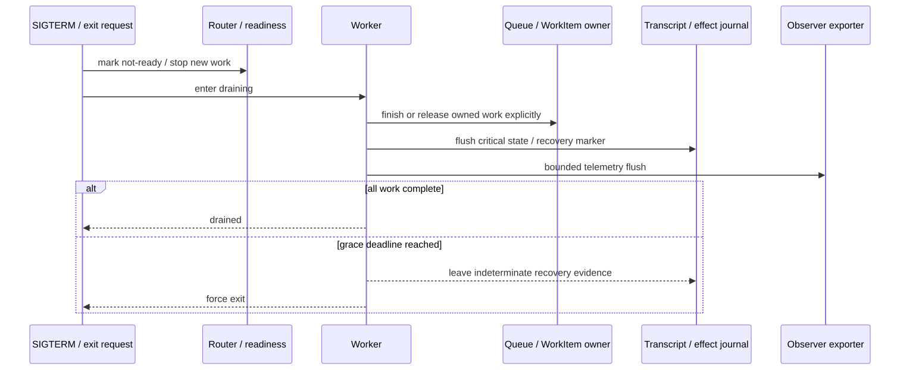

企业 worker drain 比 CLI shutdown 多两个关键动作：先从 router/queue 注销，不再领取新任务；再等待或转交 active work ownership。不能先发 SIGKILL，再靠 queue timeout 猜任务是否执行过。

H7-3 的 worker 状态只做 reference：`drainWorker()` 后拒绝 `acquireWork()`，已有 active work 必须 `completeWork()` 才变 `drained`。真实 queue lease、heartbeat、Transcript takeover 来自 M23/M24 的 owner/fencing/recovery 契约。

## Rollback 到底回滚了什么

一次 production rollback 通常能做：

- 把新流量切回 previous release；
- 停止 candidate 接新 work；
- drain 或终止新 worker；
- 回退可逆的 feature flag；
- 恢复仍兼容的旧 reader/writer。

它不能自动做：

- 撤销已经发送的邮件、支付或 Git push；
- 删除已经写入且旧 schema 读不了的数据；
- 判断一个 timeout Tool 到底成功没有；
- 把被新 policy 拒绝/允许过的历史重新改写；
- 让丢失的 telemetry 重新出现。


H7-3 的 `rollback()` 只改变 active/candidate/previous 和 worker drain 状态。契约明确拒绝“rollback = effect rollback”。这不是功能不完整，而是保持 owner 真实。

### Rollback 以后为什么还要保留 candidate identity

诊断不能只写 `current_version=old`。需要知道哪些 run/attempt/tool 曾在 candidate 上执行，哪些 record 使用 candidate write schema，哪些 evaluation/cost 属于它。Release ID 必须进入 metadata ledger 和 Transcript provenance；回滚后仍保留历史 identity，不能覆盖。

## Feature flag 不是 deployment controller

Feature flag 可以按用户、tenant 或比例改变行为，非常适合 decouple deploy 与 release。但它不自动提供：

- worker binary readiness；
- protocol/schema compatibility；
- queue/work ownership；
- migration sequencing；
- rollback-safe external effect；
- disaster recovery。


快照里的 GrowthBook 或 minimum-version gate 都只能覆盖各自范围。Bridge v1/v2 的 min-version 是配置驱动 semver floor，默认 `0.0.0` 可放行；worker epoch 能 fence stale bridge worker，却不证明健康或会话接管完成；`detectDeploymentEnvironment()` 主要提供环境元数据，不是 readiness。

## 把 H0-H7 放进一张生产拓扑

到这里，Mini Agent Harness 已经不是“最小循环”。它仍远小于 Claude Code，却具备一条作品集级核心纵切：


图中标为 adapter 的部分并没有在仓库里伪装实现：durable queue/store、真实 Sandbox、production OTel、distributed quota、Kubernetes controller 都仍是边界。作品集的价值来自可防守的契约，不来自把 fake 命名成 production。

### 本地与容器化演示

本地 release demo：

```powershell
cd mini-agent-harness
npm run demo:release
```

它会 prepare 两个兼容 release、注册 active/candidate worker、执行 10%/100% 两阶段 SLO 推进并输出 metadata-only report。

容器 smoke：

```powershell
docker compose -f deployment/docker-compose.yml up --build --abort-on-container-exit release-control-smoke
```

`deployment/Dockerfile` 固定 Node runtime，安装 `rg`，以非 root 用户运行；compose smoke 不需要 Provider credential，使用 read-only filesystem、tmpfs、drop capabilities 和 no-new-privileges。`agent-cli` live profile 只从父进程环境读取 `MINI_AGENT_API_KEY`，`.dockerignore` 排除 `.env*`。

这些设置提高了演示质量，却不等于真实 Sandbox。容器 runtime、network policy、secret manager、image signing 和 cluster admission 仍需平台提供。

## 容量估算要从一次运行的组成开始

假设：

```text
peak arrival = 20 runs/s
average run wall time = 15s
average active model/tool time = 8s
target utilization = 60%
average tokens = 18k/run
```

Little's Law 给出平均在途 run：`20 * 15 = 300`。若一个 worker 安全并发 4 个 run，且希望 60% utilization，有效容量约 2.4 run/worker，需要至少 `ceil(300 / 2.4) = 125` 个 worker，再加故障域和 canary headroom。


Token capacity另算：20 run/s * 18k = 360k token/s 的平均需求，Provider quota、tenant budget 和 cost window都要能承受。Tool 可能占 worker connection/CPU，但不消耗模型 token；不要用一个 QPS 数字代替所有资源维度。

容量模型至少拆：

- model request concurrency / token rate；
- Tool CPU、memory、process slots、network egress；
- queue depth 和 admission wait；
- Transcript write IOPS / storage growth；
- telemetry bandwidth；
- Sandbox/container startup time；
- recovery/backfill reserve capacity。

M26 的 tenant reservation 保护共享资源，M27 的 canary headroom 保证发布时不把 active pool推到极限。

## RTO/RPO 与备份不是同一个词

RPO：允许丢多少已提交状态。RTO：故障后多久恢复服务。Agent 系统还要加一个问题：恢复后是否会重复外部 effect。


灾备方案要分别写：

- Transcript、WorkItem、mailbox、scheduler、usage/evaluation ledger 的备份频率与一致性；
- encryption key/secret manager 的恢复；
- queue 与 store 恢复先后；
- fencing epoch，防旧 region 复活后双写；
- external Tool idempotency key 与查询接口；
- 定期 restore drill，而不是只看 backup job success。

H7-3 不实现 DR，但它的 release identity、schema compatibility 和 worker fencing 是 DR 能安全接管的前提。

## 威胁模型要覆盖发布控制面

M25 讲了运行时权限与供应链；发布系统本身也是高权限面：

| 资产 | 失败/攻击 | 控制 |
| --- | --- | --- |
| artifact | 镜像被替换 | digest/signature/provenance/SBOM |
| release manifest | schema/policy 被篡改 | signed immutable manifest + RBAC |
| rollout action | 未授权升流量 | approval + revision CAS + audit |
| SLI | candidate 隐藏错误 | independent telemetry/drop SLO |
| secret | 写入 image/compose | runtime secret injection + scan |
| worker identity | stale worker 继续接单 | short lease/epoch/registration fencing |
| rollback | 旧漏洞重新上线 | rollback allowlist + emergency fix path |


当前仓库没有实现签名、attestation 或 cluster admission，因此只能把它们写进 production adapter/ADR，不能在 README 里打勾冒充完成。

## 用实验完成最后一次跨组件验收

H7-3 聚焦测试：

```powershell
cd mini-agent-harness
node typescript/agent/releaseControlPlane.test.ts
python -m unittest -v python/test_release_control_plane.py
```

它们验证：

1. candidate 不能读 active write schema时 prepare 失败；
2. previous 不能读 candidate write schema时 prepare 失败；
3. binary canary 不能悄悄改变 policy revision；
4. worker protocol/schema/policy/feature mismatch fail closed；
5. active/candidate 都有 ready worker 才能 begin；
6. stable bucket 按 stage 路由；
7. SLO 失败不改变 stage；
8. 健康窗口逐级 promote；
9. draining worker 拒绝新 work，已有 work 显式完成；
10. rollback 切路由并 drain，不声称 effect rollback。


最终不能只跑 H7-3。一次发布契约改动可能破坏最早的消息 pairing 或 cancellation，因此还要运行：

```powershell
npm run typecheck
npm test
powershell -NoProfile -ExecutionPolicy Bypass -File tests/run-agent-regression.ps1
npm run demo
npm run demo:release
```

S5 发布还会把 M24-M27 的图、术语、依赖和 README 做一次阶段一致性检查。

## Java/Spring 企业落地

Java/Spring 版本可以这样拆组件：

- `ReleaseManifest`：不可变 record，存 artifact/protocol/schema/policy/feature revision；
- `ReleaseRepository`：revision CAS；
- `WorkerRegistry`：lease、heartbeat、readiness、drain；
- `RoutingPolicy`：tenant/session stable bucket；
- `SloGuard`：只读 M26 聚合指标，输出 approve/reject，不直接改 DB；
- `MigrationCoordinator`：Flyway/Liquibase 只承担 schema step，rollout controller 管时序；
- `WorkQueue`：领取时写 worker/release/policy/attempt identity；
- `TransactionOutbox`：业务 commit 后发布 metadata event；
- `RecoveryService`：读取 Transcript/effect journal，决定 resume/requeue/manual。


Spring `ApplicationReadyEvent` 不等于业务 readiness；要检查 required store/queue/policy/quota。`@PreDestroy` 也不自动让 queue 停止分发或延长 Kubernetes termination grace，仍要显式 drain 协议。

LangGraph 可以成为 AgentRuntime 的一种编排 adapter，但 checkpoint schema、node version、Tool idempotency 和 rollout identity仍需外部控制面。RAG 系统要把 index version、embedding model、retriever/reranker config 也加入 release/evaluation provenance；否则模型没变，索引变了，canary 结论仍不可解释。

## 资深 Agent 开发岗会怎样追问

这是全课程最后一组面试表达。每题先给结论，再把回答连接到 Claude Code 快照、累计 Harness 和企业系统。

### 1. “你会怎样把一个本地 Agent Harness 部署到生产？”

**结论是先把业务 owner 与基础设施 adapter 分开，再按 edge、admission、durable queue、isolated worker、state stores 和 observability 六层部署，而不是直接把 CLI 包进容器。** Composition root 负责绑定模型、Transcript、queue、Sandbox、secret、telemetry；work request 固定 run/attempt/policy/release identity。worker 从 queue 领取带 lease 的 work，H7-1 在副作用前校验能力和 secret，H6 记录 Transcript/effect recovery，H7-2 记 usage/evaluation/quota。Claude Code 的 `QueryDeps` 展示了窄范围 port injection，但不是完整 DI；`update.ts` 也是单机 CLI 更新，不是 server rollout。生产上再用 release manifest、readiness、canary、drain 和 rollback把新旧 worker 协调起来。

### 2. “新旧 worker 同时运行时，怎样保证协议兼容？”

**结论是 release manifest 显式声明 protocol range、read schemas、write schema、policy 和 feature revision，worker 注册时逐项 fail closed，不能只比较 binary version。** Candidate 必须能读 active writes；rollback window 内 active 也必须能读 candidate writes；protocol range 要有交集。Policy revision 在 binary canary 中保持一致，避免相同 Tool 因路由不同得到不同授权。Claude Code bridge 的 min-version 只是配置驱动 semver floor，epoch 主要 fence stale worker，不等于完整协商。我的 Harness 用 H7-3 contract 把这些缺口做成 clean-room 状态机，生产版再落到 registry/lease/CAS。

### 3. “数据库 schema 怎样做到可灰度、可回滚？”

**结论是用 expand-migrate-contract，把 reader compatibility 先于 writer 切换，把删除旧 schema 放到 rollback window 之后。** 第一版新代码读 v1/v2仍写 v1；确认全量 reader兼容后再 backfill和写 v2；最后才 contract 删除 v1。H7-3 prepare 同时检查 candidate 读 active write 和 active 读 candidate write。Claude Code 的 settings migration有先写新、再删旧和失败重试的实用思想，但多个文件写不是 ACID。企业里我会给 migration idempotency、checkpoint、pause/rollback plan、备份 restore test，并把 schema phase写进 release manifest。

### 4. “Canary 看哪些指标，多久升一次流量？”

**结论是每个 stage 先满足最小样本，再同时看业务成功、质量、p95延迟、observer drop、unknown cost、安全和恢复指标；窗口不可信就不升。** 固定时间不是充分条件，低流量时样本不足，高流量时几分钟可能足够。M26 已把 retry/fallback/TTFT/usage/evaluation按 attempt记录，H7-3 SloGuard只读聚合窗口并 approve/reject。稳定 bucket 应按 tenant/session，避免多轮 Agent 在新旧版本跳动。生产上我还会比较 candidate 与 control 的置信区间、分 tenant/Tool 类型，并给自动停止和人工推进双重门槛。

### 5. “SIGTERM 到来时，Agent worker 怎样安全退出？”

**结论是先取消 readiness和新任务领取，再 drain已拥有 work，优先 flush Transcript/effect ownership，最后才 best-effort flush telemetry并在 deadline强退。** Claude Code 的 graceful shutdown体现了 critical cleanup优先、Hook和analytics有上限、failsafe保证进程退出；但 cleanup是并行且无拓扑，不保证全部完成，也不是 server drain。企业 worker 要和 queue/lease/Kubernetes termination grace协调；已开始 Tool 不能靠 kill判断成功失败，必须写 indeterminate recovery marker，重启后用 idempotency inquiry或人工处理。

### 6. “Rollback 为什么仍可能重复执行 Tool？”

**结论是 deployment rollback只切 binary/routing，不撤销 external effect；如果 worker在 effect成功后、commit前被杀，queue重投就可能重复。** 解决依赖M24的effect journal和stable idempotency key：not-started可重试，completed保留结果，indeterminate先查询外部系统或补偿。H7-3 rollback只drain candidate，不声称回滚 effect。对于支付、发信、Git push等高风险 Tool，我会要求下游幂等接口、outbox/saga或审批；没有查询/幂等能力时宁可进入人工队列，也不盲重试。

### 7. “Feature flag、policy 和 release 有什么区别？”

**结论是 release决定哪份artifact接流量，feature flag决定该binary走哪条产品行为，policy决定哪些副作用被授权，三者都要版本化但不能互相替代。** Flag不保证schema兼容或worker ready，policy变化又直接改变安全语义。我的 request固定release/feature/policy revision，binary canary不混入policy变化；需要发布policy时单独两阶段协调。Claude Code有GrowthBook和managed policy等机制，但它们不是通用deployment controller。这样出现回归时才能判断是代码、flag还是policy，而不是只看到“版本相同”。

### 8. “怎样设计 Agent 系统的灾备？”

**结论是先按状态 owner定义RPO/RTO，再保证新region接管时不会双写或重复effect；备份成功不等于恢复可用。** 要备份Transcript、WorkItem/mailbox/scheduler、usage/eval/quota，并恢复secret/key；用region epoch或lease fence旧worker。恢复后RecoveryReducer重建会话和任务，已完成不重放，未开始可requeue，indeterminate effect查询或人工。定期做restore drill和Provider/queue/store故障演练。H7-3提供release/schema/worker identity，但不冒充DR实现；真正跨region一致性和流量切换由平台adapter负责。

### 9. “这个 Mini Agent Harness 为什么值得写在简历上？”

**结论是它不是功能数量取胜，而是用可运行契约覆盖了Agent最难防守的状态边界：消息与Tool pairing、Context投影、扩展治理、长任务与多Agent所有权、Transcript恢复、安全执行、usage/evaluation/quota和release rollback。** TypeScript主实现与Python镜像用同一失败实验验证，所有设计都区分快照事实与clean-room迁移。它不声称生产Kubernetes、真实Sandbox或分布式quota已完成；README会列清 implemented/deferred。面试时我能从一次用户消息讲到模型/Tool Loop，也能继续讲crash、stale lease、secret、cumulative usage、canary和DR，这比一个只会调用模型API的demo更能体现Agent平台工程能力。

### 10. “请用两分钟总结 Claude Code 给你的架构启发。”

**结论是成熟 Agent Harness 的核心不是一个 while-loop，而是一组不能混写的 owner 和跨异步边界仍成立的行为契约。** Claude Code让我看到消息owner与请求投影分离、模型流与Tool Loop配对、Permission与Sandbox分层、Task责任与运行实例分权、Transcript恢复不能盲重放、telemetry不能拥有执行结果。我的Harness把这些思想clean-room迁移成revision、lease、stable identity、bounded queue、explicit cancel/recovery和release compatibility。源码快照没有通用企业rollout，所以最终章没有虚构，而是用CLI update、bounded shutdown、best-effort migration和version gate的真实边界推导production设计。整个项目最重要的能力，是能从源码事实走到可验证机制，再走到不夸大边界的企业系统设计。

## 最后一次复习：一条请求与一次发布怎样交叉

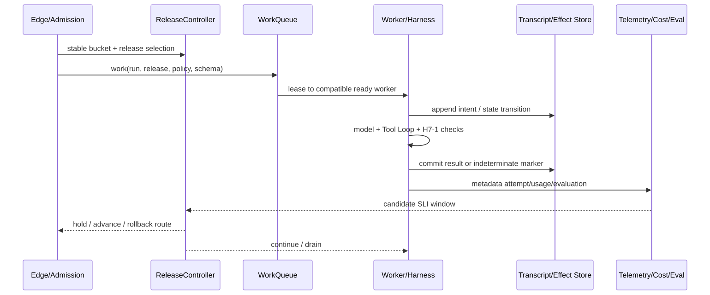

这张图把课程最重要的 owner 放在一起：

- Edge/Admission 拥有准入与稳定路由，不拥有会话；
- Queue/WorkItem 拥有长期责任，不拥有模型流；
- Worker/AgentRuntime 拥有一次运行，不拥有持久真相；
- Transcript/Effect Store 拥有可恢复事实，不拥有外部副作用；
- Telemetry/Cost/Eval 观察并记账，不拥有执行结果；
- ReleaseController 拥有版本流量状态，不拥有已经发生的 Tool effect。

如果你能沿这条时序解释正常、取消、失败、崩溃、恢复、灰度和回滚，并能指出每个“不保证”的边界，那么你已经完成了这套教材真正的目标：不只是看懂 Claude Code 的一个函数，而是能从真实源码提炼机制、用实验验证、复现为 Harness，并把设计迁移到企业级 Agent 系统。

课程到 M27 结束，不创建 M28，也不设置 S6。以后新增 Provider、RAG、Web UI、真实 queue/store/Sandbox 或 Kubernetes adapter，都应作为同一组契约的扩展，而不是重新发明消息、权限、恢复和发布语义。
