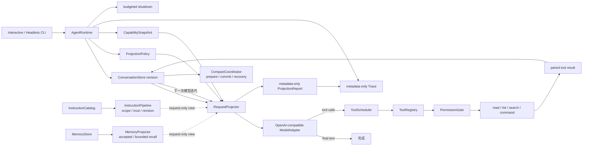

# Mini Agent Harness

这是随 Claude Code 源码教材累计演进的 clean-room Agent Harness。它不复制 Claude Code 私有实现；当前目标是用一条边界清楚、可运行、可测试的单 Agent 纵切，证明学习者真正理解了消息、状态、请求投影、模型调用、工具反馈、权限、取消和收尾怎样协作。

当前版本：`H3 / 0.4.0`（S3 正式里程碑）

## 现在已经能做什么



核心能力：

- Interactive 与 Headless 两种运行表面，共享同一会话和 Agent Loop；
- revisioned `ConversationStore`，严格区分 human、assistant、tool result 与 identity，并用单 Runtime owner 与 active-run lease 阻止异步等待期间的外部插写；
- 每次模型迭代冻结 RequestContext 与 CapabilitySnapshot；
- `RequestProjectionPolicy` 支持 history start、request-only context 和 bounded tool-result preview，投影后 strict 校验 pairing；
- `RequestProjectionReport` 只输出成员计数、omission、replacement count 与状态，不复制 prompt 或 tool output；
- aggregate tool-result group budget、跨轮 exact replacement replay、ledger revision 与投影后 strict pairing；
- `CompactCoordinator` 的 revision-gated prepare/commit、tool-pair-safe retained tail、prepared/committed journal 与显式 recovery report；
- 独立 `InstructionCatalog` / `InstructionPipeline`，按 source、scope、trust、revision 生成 immutable request view，dynamic source 不回写 catalog；
- 独立 `MemoryStore` / `MemoryProjector`，candidate 必须显式 accept，支持 project/session scope、provenance、retention、bounded recall 与 content-free Trace；
- OpenAI-compatible Chat Completions 适配器，可连接 DeepSeek 兼容端点；
- `read_file`、`list_files`、`search_text` 与默认拒绝的 `run_command`；
- capability 可见、permission 允许、handler 注册三层独立校验；
- schema 校验后的 concurrency-safe 分类、连续安全批次、独占屏障和默认 4 个 worker 的固定上限；
- 工具可以并发完成，但 outcome、context update 与 durable tool result 始终按 assistant call 原顺序提交；
- 工具失败/拒绝反馈、取消后补齐配对、单会话 single-flight 和最大轮次；
- 不记录 prompt、tool payload、HTTP body 或 credential 的结构化 Trace；
- TypeScript 主实现、Python 核心行为镜像，以及 H0/H1/H2/H3 累计回归；
- M14 已加入 provider-neutral 的 `BoundedAgentRunStream`：固定容量、单消费者、terminal metadata、consumer close 到 owner abort/cleanup 的契约；现有 `complete()` 适配器保持兼容。

详细组件和所有权见 [architecture/core-runtime.md](architecture/core-runtime.md)，行为不变量见 [contracts/h3-contract.md](contracts/h3-contract.md)。

## 快速运行

环境要求：

- Windows PowerShell；
- Node.js 22.18+（当前验证环境为 Node 24）；
- Python 3.11+；
- `rg` 可执行文件。

`package-lock.json` 固定开发工具链为 `typescript@7.0.2` 与 `@types/node@26.1.2`；`npm ci` 和类型检查都使用这套本地依赖，不在回归过程中临时下载 latest 编译器。

先运行完全不访问网络的 demo：

```powershell
cd "D:\agent\Claude code最新\mini-agent-harness"
npm ci
npm run demo
npm test
npm run typecheck
```

运行全部累计回归：

```powershell
npm run test:all
```

## 连接真实模型

仓库只提交 `.env.example`。真实 credential 必须由进程环境或已被 Git 忽略的 `.env.local` 提供。内置 `read_file` 明确拒绝 `.env`/`.env.*`（但允许读取无凭据的 `.env.example`），避免模型把本地 Provider key 带入 Conversation；显式授权的任意命令仍不是 Sandbox：

```powershell
cd "D:\agent\Claude code最新\mini-agent-harness"
# 在本机被忽略的 .env.local 中配置 MINI_AGENT_API_KEY
npm run agent -- --prompt "先列出五个 Markdown 文件，再总结项目结构" --output json
```

默认公开配置：

```text
MINI_AGENT_BASE_URL=https://api.deepseek.com/v1
MINI_AGENT_MODEL=deepseek-v4-flash
MINI_AGENT_TIMEOUT_MS=0
```

`0` 表示 Harness 不施加总超时，只响应调用方取消。凭据解析器与 Provider 路径不会把 API key 自动注入配置快照、消息、Trace、错误或命令子进程；这项保证不覆盖用户主动把凭据写进 prompt，或通过显式 executable grant 交给任意 argv。可选真实冒烟入口为 `tests/run-real-provider-smoke.ps1`；没有 `MINI_AGENT_API_KEY` 时它会明确跳过执行而不是伪造结果。

交互模式：

```powershell
npm run agent
```

Headless 事件输出：

```powershell
npm run agent -- --prompt "检查 README" --output stream-json --trace
```

## 命令权限

`run_command` 默认拒绝。授予一个 executable 必须显式声明：

```powershell
npm run agent -- --grant-executable rg --grant-executable node
```

这里故意使用 `grant`，不是 `allow-command`：授权粒度是 executable，不是某一组安全 argv。授予 `node`、`python`、`git` 等价于允许模型给该程序传任意参数，属于高风险能力。实现使用 `shell:false`，不接受整段 shell 字符串，并限制 cwd、时间、输出和子进程环境；取消只保证请求终止直接子进程，不承诺所有后代进程都已退出。这仍不是 Sandbox。真正的 argv profile、进程树治理、文件系统/系统调用隔离、容器和远程 worker 属于后续里程碑。

## 测试层次

| 层次 | 验证内容 |
| --- | --- |
| Agent Runtime | 两轮 tool loop、Permission 拒绝、工具取消配对、single-flight、Provider failure |
| Request projection | history start、ephemeral context、bounded preview、strict pairing、durable source/Trace 隔离 |
| Context budget | aggregate result budget、exact replay、stale ledger、over-budget report |
| Compact | revision gate、取消、prepared recovery、tool-pair-safe tail、metadata-only report |
| Instructions | source layering、scope/trust、dedupe、stale snapshot、request-only dynamic delta |
| Memory | candidate acceptance、scope、provenance、stale revision、retention、bounded recall、content-free Trace |
| Provider protocol | Chat Completions 请求投影、tool call JSON、usage、脱敏 HTTP 错误、URL 约束 |
| Built-in tools | workspace 越界、`rg` 搜索、默认拒绝命令、secret 不进入子进程 |
| Tool scheduler | safe batch、exclusive barrier、并发上限、顺序提交、progress 与 exactly-once outcome |
| Python mirror | 与 TypeScript 一致的 loop、pairing、permission、cancel、stream 和 scheduler 行为 |
| 累计回归 | H3 -> H2 -> H1 -> H0 与所有历史行为契约 |

真实 API 冒烟与确定性测试分开。模型可达不证明 Tool Loop 正确，fake provider 测试通过也不伪装成真实网络验证。

当前验证基线（2026-07-31）：`npm test` 共 `69/69`（Config `1/1`、Runtime `27/27`、Compact `5/5`、Instructions `7/7`、Memory `8/8`、Provider `7/7`、Tool `5/5`、Scheduler `5/5`、Stream `4/4`），本地锁定编译器 strict typecheck 通过；统一 Python Agent/Compact/Instructions/Memory/Scheduler/Stream 回归 `43/43`，ConversationStore `13/13`；H2 `4/4`、H1 `12/12`、S0 `15/15` 与集成回归 `4/4` 全部通过。

## 为什么适合简历和面试讲解

这个项目的价值不是功能数量，而是能够清楚回答：

1. 谁拥有 durable conversation，为什么不能让 UI、Provider 和 Tool 同时改数组；
2. 为什么每轮要冻结 request/capability snapshot，而不是随时读“最新全局状态”；
3. 为什么模型看见工具不等于工具可执行，Permission 与 Sandbox 又为什么不同；
4. 为什么 tool error 必须回到协议消息，取消后为什么还要补齐未执行 call 的 result；
5. credential、配置、Trace 和子进程环境怎样隔离；
6. single-flight、max turns、AbortSignal 与 budgeted shutdown 分别守住什么失控边界。
7. 为什么 Context projection、Compact transaction、Instruction catalog 与 Memory lifecycle 必须拥有不同 revision；
8. 为什么 candidate memory 不能直接进入模型请求，retention 与 bounded recall 又由谁执行。

一条准确的简历描述可以是：

> 设计并实现 TypeScript/Python 单 Agent Harness：以 revisioned conversation 为状态核心，完成 OpenAI-compatible 模型适配、请求/能力快照、并发 Tool Loop、Compact transaction、scoped Instruction Pipeline 与 candidate-gated Memory recall，守住顺序提交、取消与配对恢复、工作区工具和 content-free Trace，并用确定性协议测试与真实 Provider 冒烟分层验证。

## 当前边界

本版本有意不宣称已实现 Provider-specific SSE 解析、把 stream 接入 AgentRuntime 的完整 assistant/tool 增量消费、streaming tool execution、透明 model fallback、crash-durable Compact/Transcript、外置结果恢复、完整 CLAUDE.md discovery、Hook/Skill/MCP/Plugin、Subagent/Team、数据库持久化 Memory、embedding recall、PII/DLP enforcement、Sandbox、分布式执行和完整 OTel/cost ledger。Instruction 与 Memory projector 当前是可组合、已测试的独立 owner，尚未自动接入每次 `AgentRuntime.submit()`；调用方必须显式生成 request-only context。统一 Harness executor 也是 clean-room 设计迁移，不等同于 Claude Code 快照的两条执行路径。
