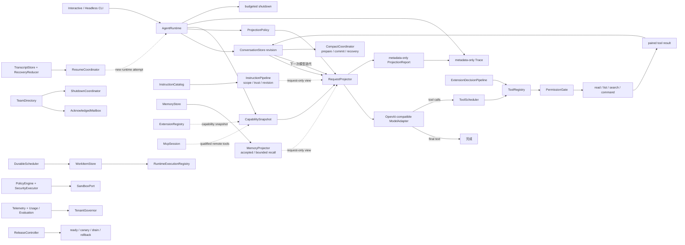

# Mini Agent Harness

这是随 Claude Code 源码教材累计演进的 clean-room Agent Harness。它不复制 Claude Code 私有实现；当前目标是用一条边界清楚、可运行、可测试的 Agent 纵切和协调控制面，证明学习者真正理解了消息、状态、请求投影、模型调用、工具治理、扩展能力、长生命周期工作、取消和恢复怎样协作。

当前版本：`H7 / 0.7.0`（S5 最终课程里程碑）

## 现在已经能做什么



核心能力：

- Interactive 与 Headless 两种运行表面，共享同一会话和 Agent Loop；
- revisioned `ConversationStore`，严格区分 human、assistant、tool result 与 identity，并用单 Runtime owner 与 active-run lease 阻止异步等待期间的外部插写；
- 每次模型迭代冻结 RequestContext 与 CapabilitySnapshot；
- `RequestProjectionPolicy` 支持 history start、request-only context 和 bounded tool-result preview，投影后 strict 校验 pairing；
- `RequestProjectionReport` 只输出成员计数、omission、replacement count 与状态，不复制 prompt 或 tool output；
- aggregate tool-result group budget、跨轮 exact replacement replay、ledger revision 与投影后 strict pairing；
- `CompactCoordinator` 的 revision-gated prepare/commit、tool-pair-safe retained tail、prepared/committed journal 与显式 recovery report；
- 独立 `InstructionCatalog` / `InstructionPipeline`，按 source、scope、trust、revision 生成 immutable request view，dynamic source 不回写 catalog；
- 独立 `MemoryStore` / `MemoryProjector`，candidate 必须显式 accept，支持 project/session scope、provenance、retention、bounded recall 与 content-free Trace；
- OpenAI-compatible Chat Completions 适配器，可连接 DeepSeek 兼容端点；
- `read_file`、`list_files`、`search_text` 与默认拒绝的 `run_command`；
- capability 可见、permission 允许、handler 注册三层独立校验；
- schema 校验后的 concurrency-safe 分类、连续安全批次、独占屏障和默认 4 个 worker 的固定上限；
- 工具可以并发完成，但 outcome、context update 与 durable tool result 始终按 assistant call 原顺序提交；
- 工具失败/拒绝反馈、取消后补齐配对、单会话 single-flight 和最大轮次；
- 不记录 prompt、tool payload、HTTP body 或 credential 的结构化 Trace；
- TypeScript 主实现、Python 核心行为镜像，以及 H0/H1/H2/H3 累计回归；
- M14 已加入 provider-neutral 的 `BoundedAgentRunStream`：固定容量、单消费者、terminal metadata、consumer close 到 owner abort/cleanup 的契约；现有 `complete()` 适配器保持兼容。
- H4-1 的 `ExtensionDecisionPipeline` 已接入 ToolRegistry/Scheduler/Runtime：ordered Hook、immutable input revision、rewrite 后重验证/重授权、final cancel gate、post-effect continuation 与 metadata-only evidence；
- H4-2 的 `ExtensionRegistry` 以完整 source identity 发布 revisioned immutable snapshot，冲突失败不部分提交，unload 后旧 snapshot 不能新建 execution lease；
- H4-3 的 `McpSession` 用 transport-neutral port 表达 handshake、generation/revision、server-qualified tool snapshot、list-changed refresh、degraded/disconnect 和显式 recovery policy；
- H5 的 `WorkItemStore` 与 `RuntimeExecutionRegistry` 分开责任和活执行，加入 lease/heartbeat/reclaim/fencing、linked/detached cancellation；
- H5 的 `TeamDirectory`、`AcknowledgedMailbox` 和 `ShutdownCoordinator` 加入稳定身份、message ID、per-recipient sequence、redelivery-until-ack 与 correlated shutdown；
- H6 foundation 的 `DurableScheduler` 先持久化语义上的 stable pending trigger，再 commit one-shot removal 或 recurring advance；它不宣称外部副作用 exactly-once。
- H6 的 `TranscriptStore`、`RecoveryReducer` 和 `ResumeCoordinator` 从 append-only evidence 保守重建 message/effect/background 状态，区分 normal resume、fork、orphan 与 indeterminate effect；
- H7-1 的 revisioned `PolicyEngine`、`SecurityExecutor`、secret reference 和 `SandboxPort` 在 Permission 之后建立 fail-closed worker/capability envelope；当前 fake port 不是 OS Sandbox；
- H7-2 的 closed metadata telemetry、observer-only exporter、cumulative-to-delta usage、versioned cost/evaluation 和 `TenantGovernor` 建立可观测与配额控制面；
- H7-3 的 `ReleaseController` 用 manifest compatibility、dependency readiness、stable canary、SLO guard、drain 与 effect-aware rollback 管理新旧版本并存；
- Dockerfile、Compose 配置和 release demo 提供可复现参考拓扑，但不冒充生产高可用平台。

详细组件和所有权见 [architecture/core-runtime.md](architecture/core-runtime.md)，累计行为不变量见 [H5](contracts/h5-contract.md)、[H6](contracts/h6-contract.md) 与最终 [H7](contracts/h7-contract.md) 契约。

## 快速运行

环境要求：

- Windows PowerShell；
- Node.js 22.18+（当前验证环境为 Node 24）；
- Python 3.11+；
- `rg` 可执行文件。

`package-lock.json` 固定开发工具链为 `typescript@7.0.2` 与 `@types/node@26.1.2`；`npm ci` 和类型检查都使用这套本地依赖，不在回归过程中临时下载 latest 编译器。

先运行完全不访问网络的 demo：

```powershell
cd "D:\agent\Claude code最新\mini-agent-harness"
npm ci
npm run demo
npm run demo:release
npm test
npm run typecheck
```

运行全部累计回归：

```powershell
npm run test:all
```

## 连接真实模型

仓库只提交 `.env.example`。真实 credential 必须由进程环境或已被 Git 忽略的 `.env.local` 提供。内置 `read_file` 明确拒绝 `.env`/`.env.*`（但允许读取无凭据的 `.env.example`），避免模型把本地 Provider key 带入 Conversation；显式授权的任意命令仍不是 Sandbox：

```powershell
cd "D:\agent\Claude code最新\mini-agent-harness"
# 在本机被忽略的 .env.local 中配置 MINI_AGENT_API_KEY
npm run agent -- --prompt "先列出五个 Markdown 文件，再总结项目结构" --output json
```

默认公开配置：

```text
MINI_AGENT_BASE_URL=https://api.deepseek.com/v1
MINI_AGENT_MODEL=deepseek-v4-flash
MINI_AGENT_TIMEOUT_MS=0
```

`0` 表示 Harness 不施加总超时，只响应调用方取消。凭据解析器与 Provider 路径不会把 API key 自动注入配置快照、消息、Trace、错误或命令子进程；这项保证不覆盖用户主动把凭据写进 prompt，或通过显式 executable grant 交给任意 argv。可选真实冒烟入口为 `tests/run-real-provider-smoke.ps1`；没有 `MINI_AGENT_API_KEY` 时它会明确跳过执行而不是伪造结果。

交互模式：

```powershell
npm run agent
```

Headless 事件输出：

```powershell
npm run agent -- --prompt "检查 README" --output stream-json --trace
```

## 命令权限

`run_command` 默认拒绝。授予一个 executable 必须显式声明：

```powershell
npm run agent -- --grant-executable rg --grant-executable node
```

这里故意使用 `grant`，不是 `allow-command`：授权粒度是 executable，不是某一组安全 argv。授予 `node`、`python`、`git` 等价于允许模型给该程序传任意参数，属于高风险能力。实现使用 `shell:false`，不接受整段 shell 字符串，并限制 cwd、时间、输出和子进程环境；取消只保证请求终止直接子进程，不承诺所有后代进程都已退出。这仍不是 Sandbox。H7-1 已实现可注入的 fail-closed `SandboxPort` 契约，但真实 argv profile、进程树治理、文件系统/系统调用隔离、容器和远程 worker 仍需生产 adapter。

## 测试层次

| 层次 | 验证内容 |
| --- | --- |
| Agent Runtime | 两轮 tool loop、Permission 拒绝、工具取消配对、single-flight、Provider failure |
| Request projection | history start、ephemeral context、bounded preview、strict pairing、durable source/Trace 隔离 |
| Context budget | aggregate result budget、exact replay、stale ledger、over-budget report |
| Compact | revision gate、取消、prepared recovery、tool-pair-safe tail、metadata-only report |
| Instructions | source layering、scope/trust、dedupe、stale snapshot、request-only dynamic delta |
| Memory | candidate acceptance、scope、provenance、stale revision、retention、bounded recall、content-free Trace |
| Extension decision | Hook rewrite、重验证/重授权、policy monotonicity、ask fail-closed、final cancel、PostHook continuation |
| Extension registry | source identity、trust、conflict atomicity、snapshot、unload、execution lease |
| MCP session | handshake/list、generation/revision、refresh/degrade、disconnect、abort、indeterminate retry |
| Work coordination | blocker/claim、lease/heartbeat/reclaim/fencing、linked/detached execution、Team/Mailbox/shutdown/scheduler |
| Transcript recovery | JSONL tail/middle corruption、parent DAG、unresolved Tool、effect/background recovery、normal resume/fork、scheduler takeover |
| Security boundary | stale policy、worker identity、filesystem/network/process constraint、secret resolution、provenance、required Sandbox fail-closed |
| Observability/governance | closed metadata、observer failure isolation、usage delta、price/evaluation version、reservation、quota 与 bounded FIFO queue |
| Release control | manifest compatibility、readiness、stable routing、SLO advancement、drain、rollback 与 effect boundary |
| Provider protocol | Chat Completions 请求投影、tool call JSON、usage、脱敏 HTTP 错误、URL 约束 |
| Built-in tools | workspace 越界、`rg` 搜索、默认拒绝命令、secret 不进入子进程 |
| Tool scheduler | safe batch、exclusive barrier、并发上限、顺序提交、progress 与 exactly-once outcome |
| Python mirror | 与 TypeScript 一致的 loop、pairing、permission、cancel、stream 和 scheduler 行为 |
| 累计回归 | H7 -> H6 -> H5 -> H4 -> H3 -> H2 -> H1 -> H0 与所有历史行为契约 |

真实 API 冒烟与确定性测试分开。模型可达不证明 Tool Loop 正确，fake provider 测试通过也不伪装成真实网络验证。

当前验证基线（2026-07-31）：`npm test` 共 `144/144`；本地锁定编译器 strict typecheck 通过。统一 Python integrated 回归 `116/116`，ConversationStore `13/13`；H2 `4/4`、H1 `12/12`、S0 `15/15` 与集成回归 `4/4` 全部通过。Agent demo、release-control demo 与 Docker Compose 静态配置通过；Docker Desktop Linux daemon 不可用，因此未执行镜像 build/run 冒烟。

## 为什么适合简历和面试讲解

这个项目的价值不是功能数量，而是能够清楚回答：

1. 谁拥有 durable conversation，为什么不能让 UI、Provider 和 Tool 同时改数组；
2. 为什么每轮要冻结 request/capability snapshot，而不是随时读“最新全局状态”；
3. 为什么模型看见工具不等于工具可执行，Permission 与 Sandbox 又为什么不同；
4. 为什么 tool error 必须回到协议消息，取消后为什么还要补齐未执行 call 的 result；
5. credential、配置、Trace 和子进程环境怎样隔离；
6. single-flight、max turns、AbortSignal 与 budgeted shutdown 分别守住什么失控边界。
7. 为什么 Context projection、Compact transaction、Instruction catalog 与 Memory lifecycle 必须拥有不同 revision；
8. 为什么 candidate memory 不能直接进入模型请求，retention 与 bounded recall 又由谁执行。
9. 为什么 Hook rewrite 后必须重验证和重授权，PostHook 又为何不能声称回滚副作用；
10. 为什么 Plugin namespace、source identity、registry revision 与 MCP generation 是不同身份和版本边界；
11. 为什么 WorkItem owner 不是 Runtime execution，lease 过期后还需要 fencing token；
12. 为什么 message `read` 不是业务 ack，stable trigger 也不等于 exactly-once。
13. 为什么 Transcript 缺失 tool result 不能证明副作用没发生，fork 又为何必须重写身份并放弃 unresolved ownership；
14. 为什么 Permission allow 后仍需 policy revision、worker identity、secret boundary 和真实 Sandbox adapter；
15. 为什么 cumulative usage 要按 attempt 转 delta，observer 又不能取得执行控制权；
16. 为什么回滚只改变路由和 admission，不能撤销已经完成的 Tool effect。

一条准确的简历描述可以是：

> 设计并实现 TypeScript/Python Agent Harness：以 revisioned conversation 为状态核心，完成模型适配、并发 Tool Loop、Context/Memory、扩展与 MCP、多 Agent 协调，并加入 Transcript 恢复、fail-closed 安全 envelope、metadata-only 成本/配额治理和可回滚发布控制面；用 144 个 TypeScript 与 116 个 Python 协议测试守住取消、顺序提交、恢复和灰度边界。

## 当前边界

本版本有意不宣称已实现 Provider-specific SSE 解析、把 stream 接入 AgentRuntime 的完整 assistant/tool 增量消费、streaming tool execution、透明 model fallback、物理 durable Compact/Transcript、自动 effect reconciliation、完整 CLAUDE.md discovery、真实 Skill/Plugin filesystem discovery 或 marketplace、官方 MCP transport/OAuth/Resource/Prompt adapter、process-backed Subagent/Team、durable queue/mailbox、数据库持久化 Memory、embedding recall、真实 OS Sandbox、Vault/PKI、分布式 quota/rollout 或生产 OTel 平台。Instruction、Memory、ExtensionRegistry、McpSession、WorkCoordinator、Recovery/Security/Governance/ReleaseController 都是可组合、已测试的独立 owner；除 H4-1 Tool decision pipeline 外，它们没有被隐藏接入每次 `AgentRuntime.submit()`。H6/H7 是 persistence-neutral reference implementation，不冒充生产 durability、基础设施控制面或 Claude Code 私有实现。
