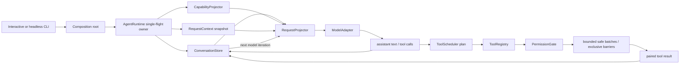

# Core Runtime Architecture

This document describes the integrated TypeScript vertical slice. It is a clean-room design influenced by the course's verified Claude Code mechanisms; it is not a copy of Claude Code internals.

## Runtime path



The loop has one durable message owner. Each `ConversationStore` binds exactly one `AgentRuntime`; an active run holds the Store's write lease, so an external writer cannot interleave a user message while the model or a tool is awaiting. `AgentRuntime` decides whether another model iteration is needed, but it cannot mutate the message array directly; every commit goes through the request-time expected revision and pairing validation.

## Course-to-runtime mapping

| Course evidence | Contract carried into this workspace | Current implementation |
| --- | --- | --- |
| Released S0 / M01-M04 | runtime validation, legal state transitions, pull-driven events, cancellation/resource boundaries and traceable call evidence | H0 domain core and cumulative regression |
| Released S1 / M05-M09 | surface/core separation, configuration provenance, immutable request state, capability projection and budgeted lifecycle | H1 runtime shell around the H0 core |
| Released S2 / M10-M15 | durable message ownership, request projection, provider boundary, run-channel separation, bounded stream lifecycle and ordered concurrent Tool Loop | H2 / Harness 0.3.0 single-agent vertical slice |
| Released S3 / M16-M19 | aggregate budget, revision-checked Compact, scoped/trusted instruction snapshots and governed memory recall | H3 / Harness 0.4.0 Context and Memory milestone |

M14 contributes a provider-neutral bounded stream contract and standalone assembly experiments. M15 contributes the explicit execution plan, bounded safe batches, exclusive barriers, ordered publication and exactly-once outcomes. Provider-specific SSE assembly and Runtime streaming consumption remain deferred.

## Ownership

| State | Owner | Readers | Mutation boundary |
| --- | --- | --- | --- |
| Effective non-secret settings | `ConfigurationSnapshot` | composition root, runtime | publish a new revision |
| Provider credential | process-edge credential resolver | HTTP adapter only | restart/recompose |
| Process dependencies | `RuntimeContext` | request factory | immutable |
| Session metadata | `SessionStateStore` | request factory | publication |
| Durable messages and tool pairing | `ConversationStore` | request projector, diagnostics | revision-checked append/replace |
| Request visibility and preview limits | `RequestProjectionPolicy` | request projector | runtime composition |
| Cross-iteration result replacement decisions | `ResultBudgetLedger` | request projector, metadata trace | expected-revision commit after strict validation |
| Projection counts and validation status | `RequestProjectionReport` | metadata trace | one report per request |
| Compact plan and provenance | `CompactCoordinator` | runtime, recovery | immutable prepare against one Store revision |
| Compact journal records | `CompactJournal` | recovery | prepared/committed append under the runtime run lease |
| Instruction sources and revision | `InstructionCatalog` | request composition | expected-revision publication |
| Per-request instruction view | `InstructionPipeline` | model request composer | immutable scope/trust projection |
| Memory candidates and accepted records | `MemoryStore` | memory projector, governance | expected-revision lifecycle transition |
| Per-request accepted-memory view | `MemoryProjector` | model request composer | scope, relevance, item and character budget |
| Current model iteration | `AgentRuntime` | trace/event observers | single-flight run |
| Model-visible tools | `CapabilitySnapshot` | request projector, registry | new iteration boundary |
| Tool handlers | `AgentToolRegistry` | runtime | bootstrap registration |
| Tool authorization | `PermissionGate` | runtime | one decision per dispatch |
| Tool execution plan and bounded concurrency | `ToolScheduler` | runtime, metadata trace | one immutable plan per assistant tool-call block |
| Shutdown report | `LifecycleCoordinator` | CLI | first shutdown caller |

## Request projection boundary

`ConversationStore` contains the complete durable result. `RequestProjector` creates a separate frozen `ModelRequest` using an explicit policy:

1. select a valid history start from the immutable snapshot;
2. insert request-only user context after leading system messages;
3. apply the existing deterministic per-result preview policy;
4. snapshot the runtime-owned replacement ledger and enforce an aggregate limit over each Provider-neutral tool-result group;
5. insert request-only user context;
6. validate tool call/result pairing again after every projection;
7. commit replacement decisions with the ledger's expected revision;
8. return a content-free report with counts, over-budget groups, ledger revision and validation status.

The second strict validation is required because a full conversation can be legal while a selected suffix begins at an orphan tool result. Projection failure happens before the Provider call. Neither request-only context nor preview content is written back to durable history, and Trace receives only scalar report fields.

H3-1 adds aggregate budgeting for the Harness's own Provider-neutral request shape. The stable ledger freezes prior decisions and replays exact preview strings, but it remains process-local. It is a clean-room migration of the consistency idea, not a claim that contiguous OpenAI-compatible `tool` messages are identical to Claude Code's internal API-user grouping.

H3-2 adds an explicit Compact transaction. The runtime acquires the same single-flight lease used by `submit`, prepares a summary from an immutable source revision, expands the retained tail until tool pairs remain request-valid, then writes prepared/committed journal records before one revision-checked Store replacement. Cancellation before commit preserves the original owner; stale plans fail before journal mutation; recovery distinguishes `restored`, `fell_back` and `repair_required` without placing message content in its report or Trace. The current journal is in-memory, so this is a transaction state-machine contract rather than a crash-durable transcript claim. Filesystem persistence, resume reconstruction, compaction/transcript reconciliation and Prompt Cache edits remain later contracts.

H3-3 adds an independent `InstructionCatalog` and `InstructionPipeline`. A source carries kind, scope root, optional path prefixes, trust and content; projection rejects untrusted/out-of-scope sources, deduplicates normalized paths and emits an immutable managed-to-dynamic request view. Dynamic instructions are request-only and never mutate the Catalog. Stale Catalog writers and stale request projections fail by revision, while reports contain only counts and source IDs. This is deliberately not a CLAUDE.md parser or filesystem discovery service; it migrates the ownership and trust contract without claiming parity with every Rules, nested-memory or attachment path.

H3-4 adds an independent `MemoryStore` and `MemoryProjector`. Observations enter as candidates and remain invisible until an explicit revision-gated acceptance. Project/session scope, provenance, retention and superseded/expired states belong to the Store; the Projector derives one deterministic, item/character-bounded request view. Memory Trace contains only operation metadata, IDs, revision and scope. This state machine is a clean-room governance design: the verified Claude Code snapshot has Session Memory, Auto Memory topic/index files, relevance attachments and Auto Dream, but not this unified candidate/accepted store.

Instruction and memory views are currently explicit composition inputs rather than hidden `AgentRuntime.submit()` side effects. This keeps their revisions and failure policies observable; a caller can place the projected text into the existing request-only context boundary. Automatic discovery, persistence and request wiring remain later integration work.

## Provider boundary

`ModelAdapter` is provider-neutral. `OpenAICompatibleAdapter` performs only:

1. domain request to Chat Completions projection;
2. HTTP transport through an injected `HttpTransport`;
3. runtime validation of text, usage, function calls and terminal `finish_reason`;
4. typed, sanitized transport/protocol errors.

It does not own the conversation, choose tools, execute tools, retry a turn, or decide whether the loop continues. The non-streaming adapter remains the deliberate Runtime path for this milestone. M14's optional adapter stream exposes an independent bounded `AgentRunStream`; it does not change durable message ownership or silently switch the Runtime to streaming semantics.

The credential is read from `MINI_AGENT_API_KEY` only at the process edge. The credential resolver and Provider path do not insert it into `ConfigurationSnapshot`, `RuntimeContext`, `RequestContext`, messages, trace attributes, command environments, or provider errors. This guarantee does not cover a user placing a credential in the prompt or passing it through an explicitly granted executable's arbitrary argv. Partial responses terminated by `length`, `content_filter`, or another non-success reason fail explicitly instead of becoming a successful assistant turn.

## Tool and permission boundary

The built-in tools are:

- `read_file`: bounded UTF-8 line reads inside the real workspace path, with `.env` credential files denied;
- `list_files`: bounded `rg --files` output;
- `search_text`: fixed-string `rg` search with bounded results;
- `run_command`: `shell:false`, bare executable name, bounded time/output, sanitized environment.

Dispatch requires all three states to agree:

```text
model-visible capability
AND permission decision allows it
AND executable handler is registered
```

Read-only workspace tools are allowed by the default policy. Commands are denied unless the executable receives an explicit unrestricted grant. The grant applies to arbitrary argv for that executable, so granting `node` or `python` is intentionally presented as high risk. This is a permission and process-control boundary, not a Sandbox: a granted process still runs with the host user's privileges, and terminating its direct child does not prove that every descendant exited. The project therefore does not claim argv profiles, process-tree containment, filesystem isolation, syscall filtering, container isolation or protection from a malicious granted executable.

`ToolScheduler` separates planning from execution. Consecutive tools whose validated input is classified concurrency-safe form a bounded worker-pool batch; an unsafe or unclassified call becomes an exclusive barrier. Execution may finish out of order, but outcomes, durable `tool_result` messages and context updates are committed in the assistant block's original call order. This avoids letting completion timing become conversation order or create competing `ConversationStore` revisions. The unified scheduler is a clean-room migration and is not presented as an exact copy of Claude Code's response-complete and streaming executors.

## Cancellation and failure

Cancellation is cooperative. The caller's `AbortSignal` reaches the model adapter, permission gate and tool handler. The runtime checks it again after an adapter resolves; dispatch also checks at entry, after an allowed permission decision and after tool resolution. A permission promise that wins its race just before abort therefore cannot start a new tool side effect, and a late model or tool response cannot turn an already-cancelled run into success. If cancellation arrives after an assistant message has introduced one or more tool calls, the runtime appends an error result for the current and every not-started call before returning. This preserves protocol pairing and prevents a later request from inheriting an unresolved call.

Provider failure produces a failed run while retaining previously committed input. Tool failure, permission denial and output-serialization failure become paired error tool results so the model can adapt on the next iteration without inheriting an unresolved tool call. A maximum-turn terminal state prevents an unbounded tool loop.

## Observability

`TraceRecorder` records correlation metadata: run/request/tool IDs, revisions, counts, status, turn and error category. Prompt text, tool input, tool output, HTTP body and authorization headers are deliberately excluded. User-visible `AgentEvent` is a separate stream because final assistant text is product output, not telemetry; failures in that observer are isolated and cannot break message pairing or own the Tool Loop.

## Run channels

The current runtime deliberately keeps three channels separate:

```text
ConversationStore            durable message and pairing state
AgentEventSink               observer-facing process events
Promise<AgentRunSummary>     one terminal run result
```

`AgentRuntime` owns the active run and next model iteration. It does not wait for an observer to feed events back into loop state. Awaiting the event sink can slow the current runtime, but a sink failure is reduced to metadata-only diagnostics and cannot decide completion, cancellation or tool pairing.

The M14 milestone exposes a bounded, single-consumer `AgentRunStream` with owner abort, source cleanup and a metadata-only terminal summary. It is deliberately separate from the Runtime's Promise result and EventSink. Provider SSE assembly, upstream-specific backpressure, multi-observer fan-out and streaming Tool Loop consumption remain deferred; abandoning the Runtime Promise is not a business cancellation.

## Scope boundary

Implemented now:

- persistent in-process conversation;
- request and capability snapshots per model iteration;
- explicit history/context/preview request policy, strict post-projection validation and metadata report;
- aggregate tool-result group budgeting with exact replacement replay and expected-revision ledger commits;
- revision-checked Compact prepare/commit/recovery with tool-pair-aware tail retention;
- scoped, trusted and revisioned instruction projection with request-only dynamic deltas;
- candidate-gated, scoped and revisioned memory lifecycle with retention and bounded recall;
- real OpenAI-compatible provider port;
- bounded concurrent single-agent tool loop with safe batches, exclusive barriers and ordered publication;
- read/search/list tools and explicitly granted command executables;
- permission denial, cancellation, error feedback and max turns;
- interactive/headless CLI, JSON and event output;
- structured trace and budgeted lifecycle flush;
- deterministic TypeScript tests and Python behavior-contract mirror.

Explicitly deferred:

- Provider-specific SSE streaming assembly and Runtime streaming assistant/tool consumption;
- external result storage, crash-durable Compact records and transcript resume;
- persistent/vector memory, PII/DLP enforcement, distributed writers and automatic Runtime memory wiring;
- Hook, Skill, MCP and Plugin execution;
- subagents and teams;
- transcript persistence, resume and crash recovery;
- real Sandbox or distributed execution;
- production OpenTelemetry, quota and cost governance.
