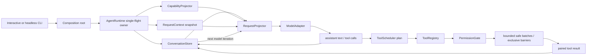

# Core Runtime Architecture

This document describes the integrated TypeScript vertical slice. It is a clean-room design influenced by the course's verified Claude Code mechanisms; it is not a copy of Claude Code internals.

## Runtime path



The loop has one durable message owner. Each `ConversationStore` binds exactly one `AgentRuntime`; an active run holds the Store's write lease, so an external writer cannot interleave a user message while the model or a tool is awaiting. `AgentRuntime` decides whether another model iteration is needed, but it cannot mutate the message array directly; every commit goes through the request-time expected revision and pairing validation.

## Course-to-runtime mapping

| Course evidence | Contract carried into this workspace | Current implementation |
| --- | --- | --- |
| Released S0 / M01-M04 | runtime validation, legal state transitions, pull-driven events, cancellation/resource boundaries and traceable call evidence | H0 domain core and cumulative regression |
| Released S1 / M05-M09 | surface/core separation, configuration provenance, immutable request state, capability projection and budgeted lifecycle | H1 runtime shell around the H0 core |
| Released S2 / M10-M15 | durable message ownership, request projection, provider boundary, run-channel separation, bounded stream lifecycle and ordered concurrent Tool Loop | H2 / Harness 0.3.0 single-agent vertical slice |
| Released S3 / M16-M19 | aggregate budget, revision-checked Compact, scoped/trusted instruction snapshots and governed memory recall | H3 / Harness 0.4.0 Context and Memory milestone |
| Released S4 / M20-M23 | Hook/Permission decision governance, extension registry, MCP session lifecycle and long-lived work coordination | H5 / Harness 0.5.0 extension and coordination milestone |
| Released S5 / M24-M27 | conservative Transcript recovery, fail-closed security envelope, metadata governance and release compatibility | H7 / Harness 0.7.0 production-governance milestone |

M14 contributes a provider-neutral bounded stream contract and standalone assembly experiments. M15 contributes the explicit execution plan, bounded safe batches, exclusive barriers, ordered publication and exactly-once outcomes. Provider-specific SSE assembly and Runtime streaming consumption remain deferred.

## Ownership

| State | Owner | Readers | Mutation boundary |
| --- | --- | --- | --- |
| Effective non-secret settings | `ConfigurationSnapshot` | composition root, runtime | publish a new revision |
| Provider credential | process-edge credential resolver | HTTP adapter only | restart/recompose |
| Process dependencies | `RuntimeContext` | request factory | immutable |
| Session metadata | `SessionStateStore` | request factory | publication |
| Durable messages and tool pairing | `ConversationStore` | request projector, diagnostics | revision-checked append/replace |
| Request visibility and preview limits | `RequestProjectionPolicy` | request projector | runtime composition |
| Cross-iteration result replacement decisions | `ResultBudgetLedger` | request projector, metadata trace | expected-revision commit after strict validation |
| Projection counts and validation status | `RequestProjectionReport` | metadata trace | one report per request |
| Compact plan and provenance | `CompactCoordinator` | runtime, recovery | immutable prepare against one Store revision |
| Compact journal records | `CompactJournal` | recovery | prepared/committed append under the runtime run lease |
| Instruction sources and revision | `InstructionCatalog` | request composition | expected-revision publication |
| Per-request instruction view | `InstructionPipeline` | model request composer | immutable scope/trust projection |
| Memory candidates and accepted records | `MemoryStore` | memory projector, governance | expected-revision lifecycle transition |
| Per-request accepted-memory view | `MemoryProjector` | model request composer | scope, relevance, item and character budget |
| Tool input/decision revisions | `ExtensionDecisionPipeline` | tool registry, scheduler, trace | ordered Hook/rewrite/revalidation/policy boundary |
| Extension bundle membership | `ExtensionRegistry` | capability adapter, execution acquirer | expected-revision all-or-nothing publication |
| MCP generation and remote tool snapshot | `McpSession` | capability composer, remote caller | connect/refresh/degrade/disconnect state machine |
| Work responsibility and claim lease | `WorkItemStore` | coordinator, worker | expected revision plus token/expiry fencing |
| Live execution and cancellation controller | `RuntimeExecutionRegistry` | supervisor, observers | launch/cancel/terminal transition |
| Team/member identity | `TeamDirectory` | mailbox and shutdown coordinator | revisioned membership/lifecycle publication |
| Delivery and acknowledgment state | `AcknowledgedMailbox` | sender, recipient | message ID, sequence, redelivery and explicit ack |
| Correlated shutdown request | `ShutdownCoordinator` | team supervisor | request/approve/reject/complete transition |
| Schedule and pending trigger | `DurableScheduler` | scheduler adapter, recovery | stable trigger creation and explicit commit |
| Transcript records and revision | `TranscriptStore` | recovery reducer, resume coordinator | append-only record publication |
| Recovered message/effect/background view | `RecoveryReducer` | resume coordinator, supervisor | pure projection from immutable evidence |
| Normal/fork resume mapping | `ResumeCoordinator` | composition root | one orchestration with fresh runtime ownership |
| Security policy revision | `PolicyEngine` | security executor | immutable policy publication |
| Checked external-effect envelope | `SecurityExecutor` / `SandboxPort` | worker adapter | current revision, identity and capability validation |
| Telemetry delivery status | `TelemetryRecorder` | observer/exporter | closed metadata events only |
| Usage, cost and evaluation records | `UsageCostLedger` / `EvaluationLedger` | governance/reporting | idempotent versioned event publication |
| Tenant reservation and queue | `TenantGovernor` | admission adapter | reserve, FIFO promote, commit or cancel |
| Release, canary and drain state | `ReleaseController` | router, worker supervisor | revisioned compatibility and SLO transitions |
| Current model iteration | `AgentRuntime` | trace/event observers | single-flight run |
| Model-visible tools | `CapabilitySnapshot` | request projector, registry | new iteration boundary |
| Tool handlers | `AgentToolRegistry` | runtime | bootstrap registration |
| Tool authorization | `PermissionGate` | runtime | one decision per dispatch |
| Tool execution plan and bounded concurrency | `ToolScheduler` | runtime, metadata trace | one immutable plan per assistant tool-call block |
| Shutdown report | `LifecycleCoordinator` | CLI | first shutdown caller |

## Request projection boundary

`ConversationStore` contains the complete durable result. `RequestProjector` creates a separate frozen `ModelRequest` using an explicit policy:

1. select a valid history start from the immutable snapshot;
2. insert request-only user context after leading system messages;
3. apply the existing deterministic per-result preview policy;
4. snapshot the runtime-owned replacement ledger and enforce an aggregate limit over each Provider-neutral tool-result group;
5. insert request-only user context;
6. validate tool call/result pairing again after every projection;
7. commit replacement decisions with the ledger's expected revision;
8. return a content-free report with counts, over-budget groups, ledger revision and validation status.

The second strict validation is required because a full conversation can be legal while a selected suffix begins at an orphan tool result. Projection failure happens before the Provider call. Neither request-only context nor preview content is written back to durable history, and Trace receives only scalar report fields.

H3-1 adds aggregate budgeting for the Harness's own Provider-neutral request shape. The stable ledger freezes prior decisions and replays exact preview strings, but it remains process-local. It is a clean-room migration of the consistency idea, not a claim that contiguous OpenAI-compatible `tool` messages are identical to Claude Code's internal API-user grouping.

H3-2 adds an explicit Compact transaction. The runtime acquires the same single-flight lease used by `submit`, prepares a summary from an immutable source revision, expands the retained tail until tool pairs remain request-valid, then writes prepared/committed journal records before one revision-checked Store replacement. Cancellation before commit preserves the original owner; stale plans fail before journal mutation; recovery distinguishes `restored`, `fell_back` and `repair_required` without placing message content in its report or Trace. The current journal is in-memory, so this is a transaction state-machine contract rather than a crash-durable transcript claim. Filesystem persistence, resume reconstruction, compaction/transcript reconciliation and Prompt Cache edits remain later contracts.

H3-3 adds an independent `InstructionCatalog` and `InstructionPipeline`. A source carries kind, scope root, optional path prefixes, trust and content; projection rejects untrusted/out-of-scope sources, deduplicates normalized paths and emits an immutable managed-to-dynamic request view. Dynamic instructions are request-only and never mutate the Catalog. Stale Catalog writers and stale request projections fail by revision, while reports contain only counts and source IDs. This is deliberately not a CLAUDE.md parser or filesystem discovery service; it migrates the ownership and trust contract without claiming parity with every Rules, nested-memory or attachment path.

H3-4 adds an independent `MemoryStore` and `MemoryProjector`. Observations enter as candidates and remain invisible until an explicit revision-gated acceptance. Project/session scope, provenance, retention and superseded/expired states belong to the Store; the Projector derives one deterministic, item/character-bounded request view. Memory Trace contains only operation metadata, IDs, revision and scope. This state machine is a clean-room governance design: the verified Claude Code snapshot has Session Memory, Auto Memory topic/index files, relevance attachments and Auto Dream, but not this unified candidate/accepted store.

Instruction and memory views are currently explicit composition inputs rather than hidden `AgentRuntime.submit()` side effects. This keeps their revisions and failure policies observable; a caller can place the projected text into the existing request-only context boundary. Automatic discovery, persistence and request wiring remain later integration work.

## Extension governance

H4-1 inserts `ExtensionDecisionPipeline` into the existing tool registry. One call carries an immutable input revision through ordered pre hooks, schema and semantic revalidation, permission policy, an optional ask resolver, a final pre-effect cancellation check and post hooks. A Hook allow cannot override policy deny; every rewrite is revalidated and re-authorized. Post hooks may stop the next model iteration but cannot claim to roll back the completed tool effect. Runtime trace receives only revision/evidence counts and continuation state.

H4-2 keeps extension delivery out of the Tool Loop. `ExtensionRegistry` publishes a complete immutable snapshot from full source identity, trust policy and namespaced components. Conflicts reject the whole publication. Unload removes new snapshot membership and prevents an old snapshot from acquiring a new execution, while an already acquired lease drains cooperatively. Real marketplace fetch, repository checkout, signature infrastructure and component adapters remain outside this reference registry.

H4-3 models MCP above an injected `McpTransport`. `McpSession` owns handshake, server-qualified tool snapshot, generation/revision, list-change refresh, degraded state, disconnect and retry policy. Local abort is passed to the adapter but is never described as remote rollback. A lost session defaults to indeterminate; one recovery attempt is allowed only by explicit policy and reuses the stable idempotency key. The reference does not hand-write JSON-RPC or implement production stdio/HTTP/OAuth transports.

## Work coordination

H5 separates long-lived responsibility from live execution. `WorkItemStore` owns blockers, revision and an expiring claim lease; `RuntimeExecutionRegistry` owns the actual AbortController and linked/detached cancellation. A stale lease token cannot complete reclaimed work, and a detached execution still requires an explicit supervisor stop path.

`TeamDirectory`, `AcknowledgedMailbox` and `ShutdownCoordinator` form a small coordination plane. Team identity is not an array of Promises. Mail is at-least-once until explicit ack, keyed by message ID and ordered per recipient, but ack remains separate from the recipient's business effect. Shutdown has a correlated request/approval/rejection/completed lifecycle rather than a direct leader mutation.

`DurableScheduler` began as an H6 foundation inside the H5 release. Polling materializes a stable pending trigger before external handling; commit removes a one-shot or advances recurrence. H6 recovery now preserves that pending identity across takeover without committing the consumer effect. This improves deduplication but does not make an external side effect exactly-once.

## Transcript and recovery

H6 introduces `TranscriptStore`, `RecoveryReducer` and `ResumeCoordinator` as separate roles. The Store owns append-only evidence and record identity. The reducer tolerates a partial JSONL tail, reports malformed middle records, terminates cycles/dangling parent traversal and derives a conservative message/effect/background view without mutating evidence. An attempted but uncommitted effect remains indeterminate and is reconciled instead of automatically retried.

Normal resume keeps the session identity; fork mints new session/message/record identities and preserves source mapping without copying unresolved effect or background ownership. Orphaned background work creates a new supervised attempt. The implementation is an in-process, persistence-neutral state machine: filesystem/database durability, fsync/WAL, transactional outbox, process resurrection and distributed fencing remain adapter responsibilities.

## Security and production governance

H7-1 places a fail-closed envelope after capability and Permission decisions. `PolicyEngine` publishes an immutable revision; `SecurityExecutor` rechecks policy revision, worker identity, filesystem/network/process constraints and required Sandbox availability before invoking `SandboxPort`. Secrets are references in the control plane and values only at the trusted execution boundary. The fake port proves orchestration semantics, not OS isolation or publisher authenticity.

H7-2 adds closed metadata telemetry, an observer-only export port, cumulative-to-delta attempt usage, versioned cost/evaluation records and an in-process tenant governor. Missing TTFT or price stays unknown. Reservations happen before work, count against capacity and enter a bounded per-tenant FIFO queue. Telemetry/export failure has no authority over AgentRuntime, conversation pairing or effects.

H7-3 adds a revisioned `ReleaseController`. An immutable manifest binds binary, protocol range, readable/write schema, policy and feature revisions. Candidate readiness requires compatible workers and required dependencies; stable routing buckets enter monotonic canary stages only after an adequate SLI window. Drain rejects new work while preserving acquired ownership. Rollback changes routing/admission and never claims to undo Tool effects or Transcript records.

## Provider boundary

`ModelAdapter` is provider-neutral. `OpenAICompatibleAdapter` performs only:

1. domain request to Chat Completions projection;
2. HTTP transport through an injected `HttpTransport`;
3. runtime validation of text, usage, function calls and terminal `finish_reason`;
4. typed, sanitized transport/protocol errors.

It does not own the conversation, choose tools, execute tools, retry a turn, or decide whether the loop continues. The non-streaming adapter remains the deliberate Runtime path for this milestone. M14's optional adapter stream exposes an independent bounded `AgentRunStream`; it does not change durable message ownership or silently switch the Runtime to streaming semantics.

The credential is read from `MINI_AGENT_API_KEY` only at the process edge. The credential resolver and Provider path do not insert it into `ConfigurationSnapshot`, `RuntimeContext`, `RequestContext`, messages, trace attributes, command environments, or provider errors. This guarantee does not cover a user placing a credential in the prompt or passing it through an explicitly granted executable's arbitrary argv. Partial responses terminated by `length`, `content_filter`, or another non-success reason fail explicitly instead of becoming a successful assistant turn.

## Tool and permission boundary

The built-in tools are:

- `read_file`: bounded UTF-8 line reads inside the real workspace path, with `.env` credential files denied;
- `list_files`: bounded `rg --files` output;
- `search_text`: fixed-string `rg` search with bounded results;
- `run_command`: `shell:false`, bare executable name, bounded time/output, sanitized environment.

Dispatch requires all three states to agree:

```text
model-visible capability
AND permission decision allows it
AND executable handler is registered
```

Read-only workspace tools are allowed by the default policy. Commands are denied unless the executable receives an explicit unrestricted grant. The grant applies to arbitrary argv for that executable, so granting `node` or `python` is intentionally presented as high risk. This is a permission and process-control boundary, not a Sandbox: a granted process still runs with the host user's privileges, and terminating its direct child does not prove that every descendant exited. The project therefore does not claim argv profiles, process-tree containment, filesystem isolation, syscall filtering, container isolation or protection from a malicious granted executable.

`ToolScheduler` separates planning from execution. Consecutive tools whose validated input is classified concurrency-safe form a bounded worker-pool batch; an unsafe or unclassified call becomes an exclusive barrier. Execution may finish out of order, but outcomes, durable `tool_result` messages and context updates are committed in the assistant block's original call order. This avoids letting completion timing become conversation order or create competing `ConversationStore` revisions. The unified scheduler is a clean-room migration and is not presented as an exact copy of Claude Code's response-complete and streaming executors.

## Cancellation and failure

Cancellation is cooperative. The caller's `AbortSignal` reaches the model adapter, permission gate and tool handler. The runtime checks it again after an adapter resolves; dispatch also checks at entry, after an allowed permission decision and after tool resolution. A permission promise that wins its race just before abort therefore cannot start a new tool side effect, and a late model or tool response cannot turn an already-cancelled run into success. If cancellation arrives after an assistant message has introduced one or more tool calls, the runtime appends an error result for the current and every not-started call before returning. This preserves protocol pairing and prevents a later request from inheriting an unresolved call.

Provider failure produces a failed run while retaining previously committed input. Tool failure, permission denial and output-serialization failure become paired error tool results so the model can adapt on the next iteration without inheriting an unresolved tool call. A maximum-turn terminal state prevents an unbounded tool loop.

## Observability

`TraceRecorder` records correlation metadata: run/request/tool IDs, revisions, counts, status, turn and error category. H7-2 extends this rule with closed telemetry variants, attempt identity, usage deltas, versioned price/evaluation records and numeric governance reports. Prompt text, tool input, tool output, HTTP body and authorization headers are deliberately excluded. User-visible `AgentEvent` remains a separate stream because final assistant text is product output, not telemetry; failures in any observer are isolated and cannot break message pairing or own the Tool Loop.

## Run channels

The current runtime deliberately keeps three channels separate:

```text
ConversationStore            durable message and pairing state
AgentEventSink               observer-facing process events
Promise<AgentRunSummary>     one terminal run result
```

`AgentRuntime` owns the active run and next model iteration. It does not wait for an observer to feed events back into loop state. Awaiting the event sink can slow the current runtime, but a sink failure is reduced to metadata-only diagnostics and cannot decide completion, cancellation or tool pairing.

The M14 milestone exposes a bounded, single-consumer `AgentRunStream` with owner abort, source cleanup and a metadata-only terminal summary. It is deliberately separate from the Runtime's Promise result and EventSink. Provider SSE assembly, upstream-specific backpressure, multi-observer fan-out and streaming Tool Loop consumption remain deferred; abandoning the Runtime Promise is not a business cancellation.

## Scope boundary

Implemented now:

- persistent in-process conversation;
- request and capability snapshots per model iteration;
- explicit history/context/preview request policy, strict post-projection validation and metadata report;
- aggregate tool-result group budgeting with exact replacement replay and expected-revision ledger commits;
- revision-checked Compact prepare/commit/recovery with tool-pair-aware tail retention;
- scoped, trusted and revisioned instruction projection with request-only dynamic deltas;
- candidate-gated, scoped and revisioned memory lifecycle with retention and bounded recall;
- real OpenAI-compatible provider port;
- bounded concurrent single-agent tool loop with safe batches, exclusive barriers and ordered publication;
- read/search/list tools and explicitly granted command executables;
- permission denial, cancellation, error feedback and max turns;
- ordered Hook/rewrite/policy decisions with revalidation, final cancel gate and post-effect continuation;
- revisioned extension publication, trust boundary, conflict rejection, immutable snapshot and execution lease;
- transport-neutral MCP handshake, generation/revision, qualified tool snapshot, fail-closed refresh and explicit recovery policy;
- separate WorkItem and RuntimeExecution owners with lease/heartbeat/reclaim/fencing and linked/detached cancellation;
- team identity, acknowledged at-least-once mailbox, correlated shutdown and stable pending scheduler triggers;
- append-only Transcript evidence, conservative recovery, normal/fork identity mapping, effect/background classification and pending-trigger takeover;
- revisioned security policy, worker/capability constraints, trusted-boundary secret resolution and a fail-closed Sandbox port;
- metadata-only telemetry, observer isolation, cumulative-to-delta usage, versioned cost/evaluation and tenant reservation/queue governance;
- release manifest compatibility, readiness, stable canary, SLO advancement, worker drain and effect-aware rollback routing;
- release-control demo and Docker/Compose reference deployment;
- interactive/headless CLI, JSON and event output;
- structured trace and budgeted lifecycle flush;
- deterministic TypeScript tests and Python behavior-contract mirror.

Explicitly deferred:

- Provider-specific SSE streaming assembly and Runtime streaming assistant/tool consumption;
- external result storage, physical Transcript/Compact durability, fsync/WAL and automatic effect reconciliation;
- persistent/vector memory, PII/DLP enforcement, distributed writers and automatic Runtime memory wiring;
- filesystem Skill/Plugin discovery, marketplace fetch, component loading and automatic Runtime capability wiring;
- official MCP transport/OAuth, Resource/Prompt adapters and automatic Runtime wiring;
- process-backed Subagents/Teams, durable mailbox storage and distributed coordination;
- real OS/container Sandbox, Vault/PKI and distributed policy delivery;
- production OpenTelemetry transport, exact Provider billing and distributed quota reservation;
- service discovery, durable rollout state, Kubernetes reconciliation, database migration, compensation and disaster recovery.
