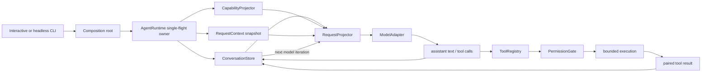

# Core Runtime Architecture

This document describes the integrated TypeScript vertical slice. It is a clean-room design influenced by the course's verified Claude Code mechanisms; it is not a copy of Claude Code internals.

## Runtime path



The loop has one durable message owner. Each `ConversationStore` binds exactly one `AgentRuntime`; an active run holds the Store's write lease, so an external writer cannot interleave a user message while the model or a tool is awaiting. `AgentRuntime` decides whether another model iteration is needed, but it cannot mutate the message array directly; every commit goes through the request-time expected revision and pairing validation.

## Course-to-runtime mapping

| Course evidence | Contract carried into this workspace | Current implementation |
| --- | --- | --- |
| Released S0 / M01-M04 | runtime validation, legal state transitions, pull-driven events, cancellation/resource boundaries and traceable call evidence | H0 domain core and cumulative regression |
| Released S1 / M05-M09 | surface/core separation, configuration provenance, immutable request state, capability projection and budgeted lifecycle | H1 runtime shell around the H0 core |
| Approved S2 work from M10-M11 | durable message ownership, request projection, provider boundary and paired Tool Loop | H2-in-progress single-agent vertical slice |

The third row is an implementation lead, not an S2 release claim. Streaming assembly, parallel tools and the remaining M12-M15 teaching mechanisms stay deferred until their units close the corresponding evidence and learning loops.

## Ownership

| State | Owner | Readers | Mutation boundary |
| --- | --- | --- | --- |
| Effective non-secret settings | `ConfigurationSnapshot` | composition root, runtime | publish a new revision |
| Provider credential | process-edge credential resolver | HTTP adapter only | restart/recompose |
| Process dependencies | `RuntimeContext` | request factory | immutable |
| Session metadata | `SessionStateStore` | request factory | publication |
| Durable messages and tool pairing | `ConversationStore` | request projector, diagnostics | revision-checked append/replace |
| Current model iteration | `AgentRuntime` | trace/event observers | single-flight run |
| Model-visible tools | `CapabilitySnapshot` | request projector, registry | new iteration boundary |
| Tool handlers | `AgentToolRegistry` | runtime | bootstrap registration |
| Tool authorization | `PermissionGate` | runtime | one decision per dispatch |
| Shutdown report | `LifecycleCoordinator` | CLI | first shutdown caller |

## Provider boundary

`ModelAdapter` is provider-neutral. `OpenAICompatibleAdapter` performs only:

1. domain request to Chat Completions projection;
2. HTTP transport through an injected `HttpTransport`;
3. runtime validation of text, usage, function calls and terminal `finish_reason`;
4. typed, sanitized transport/protocol errors.

It does not own the conversation, choose tools, execute tools, retry a turn, or decide whether the loop continues. The non-streaming adapter is deliberate for this milestone. A future streaming adapter can expose an `AsyncIterable` without changing durable message ownership.

The credential is read from `MINI_AGENT_API_KEY` only at the process edge. The credential resolver and Provider path do not insert it into `ConfigurationSnapshot`, `RuntimeContext`, `RequestContext`, messages, trace attributes, command environments, or provider errors. This guarantee does not cover a user placing a credential in the prompt or passing it through an explicitly granted executable's arbitrary argv. Partial responses terminated by `length`, `content_filter`, or another non-success reason fail explicitly instead of becoming a successful assistant turn.

## Tool and permission boundary

The built-in tools are:

- `read_file`: bounded UTF-8 line reads inside the real workspace path, with `.env` credential files denied;
- `list_files`: bounded `rg --files` output;
- `search_text`: fixed-string `rg` search with bounded results;
- `run_command`: `shell:false`, bare executable name, bounded time/output, sanitized environment.

Dispatch requires all three states to agree:

```text
model-visible capability
AND permission decision allows it
AND executable handler is registered
```

Read-only workspace tools are allowed by the default policy. Commands are denied unless the executable receives an explicit unrestricted grant. The grant applies to arbitrary argv for that executable, so granting `node` or `python` is intentionally presented as high risk. This is a permission and process-control boundary, not a Sandbox: a granted process still runs with the host user's privileges, and terminating its direct child does not prove that every descendant exited. The project therefore does not claim argv profiles, process-tree containment, filesystem isolation, syscall filtering, container isolation or protection from a malicious granted executable.

## Cancellation and failure

Cancellation is cooperative. The caller's `AbortSignal` reaches the model adapter, permission gate and tool handler. The runtime checks it again after an adapter resolves; dispatch also checks at entry, after an allowed permission decision and after tool resolution. A permission promise that wins its race just before abort therefore cannot start a new tool side effect, and a late model or tool response cannot turn an already-cancelled run into success. If cancellation arrives after an assistant message has introduced one or more tool calls, the runtime appends an error result for the current and every not-started call before returning. This preserves protocol pairing and prevents a later request from inheriting an unresolved call.

Provider failure produces a failed run while retaining previously committed input. Tool failure, permission denial and output-serialization failure become paired error tool results so the model can adapt on the next iteration without inheriting an unresolved tool call. A maximum-turn terminal state prevents an unbounded tool loop.

## Observability

`TraceRecorder` records correlation metadata: run/request/tool IDs, revisions, counts, status, turn and error category. Prompt text, tool input, tool output, HTTP body and authorization headers are deliberately excluded. User-visible `AgentEvent` is a separate stream because final assistant text is product output, not telemetry; failures in that observer are isolated and cannot break message pairing or own the Tool Loop.

## Scope boundary

Implemented now:

- persistent in-process conversation;
- request and capability snapshots per model iteration;
- real OpenAI-compatible provider port;
- sequential single-agent tool loop;
- read/search/list tools and explicitly granted command executables;
- permission denial, cancellation, error feedback and max turns;
- interactive/headless CLI, JSON and event output;
- structured trace and budgeted lifecycle flush;
- deterministic TypeScript tests and Python behavior-contract mirror.

Explicitly deferred:

- SSE streaming assembly and parallel tool scheduling;
- context compression and memory;
- Hook, Skill, MCP and Plugin execution;
- subagents and teams;
- transcript persistence, resume and crash recovery;
- real Sandbox or distributed execution;
- production OpenTelemetry, quota and cost governance.
